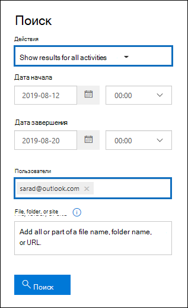

# <a name="search-the-audit-log-to-investigate-common-support-issues"></a>Поиск журнала аудита для изучения распространенных проблем поддержки

В этой статье описывается, как использовать средство поиска журналов аудита, чтобы помочь вам исследовать распространенные проблемы поддержки. Это включает использование журнала аудита для:

- Поиск IP-адреса компьютера, используемого для доступа к скомпрометированной учетной записи
- Определите, кто настроил отправку электронной почты для почтового ящика
- Определите, удалил ли пользователь элементы электронной почты в своем почтовом ящике
- Определите, создал ли пользователь правило "Входящие"
- Изучите причины успешного входа пользователя за пределами организации
- Поиск действий почтовых ящиков, выполняемых пользователями с лицензиями, не относящемся к E5
- Поиск действий почтовых ящиков, выполняемых пользователями делегирования

## <a name="using-the-audit-log-search-tool"></a>Использование средства поиска журнала аудита

Каждый из сценариев устранения неполадок, описанных в этой статье, основан на использовании средства поиска журнала аудита в Центре & соответствия требованиям. В этом разделе перечислены разрешения, необходимые для поиска журнала аудита, и описываются действия по доступу и запуску поиска журналов аудита. В каждом разделе сценария рассказывается о настройке запроса на поиск журнала аудита и о том, что нужно искать в подробных сведениях в записях аудита, которые соответствуют критериям поиска.

### <a name="permissions-required-to-use-the-audit-log-search-tool"></a>Разрешения, необходимые для использования средства поиска журнала аудита

Для поиска журнала аудита необходимо View-Only журналы аудита или журналы аудита в Exchange Online. Эти роли по умолчанию назначены группам ролей "Управление соответствием" и "Управление организацией" на странице **Разрешения** в Центре администрирования Exchange. Глобальные администраторы в Office 365 и Microsoft 365 автоматически добавляются в качестве членов группы ролей управления организацией в Exchange Online. Дополнительные сведения см. в статье [Управление группами ролей в Exchange Online](/Exchange/permissions-exo/role-groups).

### <a name="running-audit-log-searches"></a>Запуск поиска журнала аудита

В этом разделе описаны основы для создания и запуска поиска журналов аудита. Используйте эти инструкции в качестве отправной точки для каждого сценария устранения неполадок в этой статье. Дополнительные пошаговую инструкцию см. в [журнале Поиска аудита.](search-the-audit-log-in-security-and-compliance.md#step-1-run-an-audit-log-search)

1. Перейдите [https://protection.office.com/unifiedauditlog](https://protection.office.com/unifiedauditlog) к и войдите с помощью вашей учетной записи работы или учебного заведения.
    
    Откроется страница **Поиск в журнале аудита**. 
    
    
  
4. Можно настроить следующие критерии поиска. Каждый сценарий устранения неполадок в этой статье рекомендует конкретные рекомендации по настройке этих полей.
    
    а. **Действия:** Выберите выпаданий список, чтобы отобразить действия, которые можно искать. После запуска поиска отображаются только записи аудита для выбранных действий. Выбор **результатов Show для всех действий** отображает результаты для всех действий, которые соответствуют другим критериям поиска. Кроме того, в некоторых сценариях устранения неполадок необходимо оставить это поле пустым.
    
    б. **Дата начала** и **дата окончания:** выберите дату и диапазон времени для отображения событий, произошедших в течение этого периода. Последние семь дней выбираются по умолчанию. Даты и время представлены в формате UTC. Максимальный диапазон дат, который можно указать, составляет 90 дней.

    в. **Пользователи:** Щелкните в этом поле, а затем выберите одного или несколько пользователей для отображения результатов поиска. Записи аудита выбранных действий, выполняемые выбранными пользователями в этом поле, отображаются в списке результатов. Чтобы получить результаты для всех пользователей (и учетных записей служб) в организации, оставьте это поле пустым.
    
    г. **Файл, папка или сайт:** Введите некоторое или все имя файла или папки для поиска действий, связанных с файлом папки, содержащем указанное ключевое слово. Также можно указать URL-адрес файла или папки. Если вы используете URL-адрес, убедитесь, что введите полный URL-адрес или введите только часть URL-адреса, не включайте специальные символы или пробелы. Чтобы получить результаты для всех файлов и папок в организации, оставьте это поле пустым. Это поле остается пустым во всех сценариях устранения неполадок в этой статье.
    
5. Выберите **Поиск** для запуска поиска с помощью критериев поиска. 
    
    Результаты поиска загружаются, и через несколько минут они отображаются в статье **Результаты** на странице поиска **журнала аудита.** Каждый из разделов этой статьи содержит рекомендации по поиску в контексте конкретного сценария устранения неполадок.

    Дополнительные сведения о просмотре, фильтрации или экспорте результатов поиска журналов аудита см. в.

    - [Просмотр результатов поиска](search-the-audit-log-in-security-and-compliance.md#step-2-view-the-search-results)
    - [Фильтр результатов поиска](search-the-audit-log-in-security-and-compliance.md#step-3-filter-the-search-results)
    - [Экспорт результатов поиска](search-the-audit-log-in-security-and-compliance.md#step-4-export-the-search-results-to-a-file)

## <a name="find-the-ip-address-of-the-computer-used-to-access-a-compromised-account"></a>Поиск IP-адреса компьютера, используемого для доступа к скомпрометированной учетной записи

IP-адрес, соответствующий действию, выполняемой любым пользователем, входит в большинство записей аудита. Сведения об используемом клиенте также включаются в запись аудита.

Вот как настроить запрос на поиск журнала аудита для этого сценария:

**Действия:** Если это относится к вашему делу, выберите определенное действие для поиска. Для устранения неполадок скомпрометировать учетные записи рассмотрите возможность выбора пользователя, вписавшись в действия почтовых ящиков **в рамках действий почтовых ящиков Exchange.**  Это возвращает записи аудита, показывающие IP-адрес, который был используется при входе в почтовый ящик. В противном случае оставьте это поле пустым, чтобы вернуть записи аудита для всех действий. 

> [!TIP]
> Оставление этого поля пустым возвращает **действия UserLoggedIn,** которое является действием Azure Active Directory, которое указывает на то, что кто-то вошел в учетную запись пользователя. Использование фильтрации в результатах поиска для отображения записей **аудита UserLoggedIn.**

**Дата начала** **и дата окончания:** выберите диапазон дат, применимый к вашему расследованию.

**Пользователи:** Если вы изучаете скомпрометированную учетную запись, выберите пользователя, чья учетная запись была скомпрометирована. Это возвращает записи аудита для действий, выполняемых этой учетной записью пользователя.

**Файл, папка или сайт:** Оставьте это поле пустым.

После запуска поиска IP-адрес для каждого действия отображается в столбце **IP-адреса** в результатах поиска. Выберите запись в результатах поиска, чтобы просмотреть более подробные сведения на странице вылетов.

## <a name="determine-who-set-up-email-forwarding-for-a-mailbox"></a>Определите, кто настроил отправку электронной почты для почтового ящика

При настройке пересылания электронной почты для почтового ящика сообщения электронной почты, отправленные в почтовый ящик, отправляются в другой почтовый ящик. Сообщения могут отправляться пользователям в организации или за ее пределами. При настройках пересылания электронной почты в почтовом ящике используется используемый в exchange Online код **Set-Mailbox.**

Вот как настроить запрос на поиск журнала аудита для этого сценария:

**Действия:** Оставьте это поле пустым, чтобы поиск возвращал записи аудита для всех действий. Это необходимо для возврата записей аудита, связанных с **набором почтовых ящиков.**

**Дата начала** **и дата окончания:** выберите диапазон дат, применимый к вашему расследованию.

**Пользователи:** Если вы не изучаете проблему отправки электронной почты для определенного пользователя, оставьте это поле пустым. Это поможет определить, настроена ли переададка электронной почты для любого пользователя.

**Файл, папка или сайт:** Оставьте это поле пустым.

После запуска поиска выберите результаты **filter на** странице результатов поиска. В поле под заглавной колонкой **Activity** введите **Set-Mailbox,** чтобы отображались только записи аудита, связанные с комлетом **Set-Mailbox.**


На этом этапе вам необходимо и дальше проверять сведения о каждой записи аудита, чтобы определить, связана ли эта деятельность с отправкой электронной почты. Выберите запись аудита, чтобы отобразить страницу **"Подробные** сведения", а затем выберите **дополнительные сведения.** На следующем скриншоте и описаниях указаны сведения, которые указывают на пересылку электронной почты, установленные в почтовом ящике.


а. В поле **ObjectId** отображается псевдоним почтового ящика, на который была задана пересылаемая почта. Этот почтовый ящик также отображается в столбце **Item** на странице результатов поиска.

б. В поле **Параметры** значение *ForwardingSmtpAddress* указывает, что пересылание электронной почты было задано в почтовом ящике. В этом примере почта пересылается на адрес электронной почты mike@contoso.com, который находится за пределами alpinehouse.onmicrosoft.com организации.

в. Значение  True для параметра *DeliverToMailboxAndForward* указывает, что копия сообщения доставляется  в sarad@alpinehouse.onmicrosoft.com и передается на адрес электронной почты, указанный параметром *ForwardingSmtpAddress,* который в этом примере mike@contoso.com. Если значение параметра *DeliverToMailboxAndForward* задано *false,* то электронная почта передается только по адресу, указанному параметром *ForwardingSmtpAddress.* Он не доставляется в почтовый ящик, указанный в **поле ObjectId.**

г. В **поле UserId** указывается пользователь, задавший пересылку электронной почты в почтовом ящике, указанном в **поле ObjectId.** Этот пользователь также отображается в столбце **Пользователь** на странице результатов поиска. В этом случае кажется, что владелец почтового ящика задает пересылку электронной почты на ее почтовый ящик.

Если вы определяете, что пересылка электронной почты не должна устанавливаться в почтовом ящике, ее можно удалить, задав следующую команду в Exchange Online PowerShell:

```powershell
Set-Mailbox <mailbox alias> -ForwardingSmtpAddress $null 
```

Дополнительные сведения о параметрах, связанных с пересылке электронной почты, см. в статье [Set-Mailbox.](/powershell/module/exchange/set-mailbox)

## <a name="determine-if-a-user-deleted-email-items"></a>Определите, удалил ли пользователь элементы электронной почты

Начиная с января 2019 г. корпорация Майкрософт по умолчанию включит журнал аудита почтовых ящиков для всех организаций Office 365 и Microsoft. Это означает, что определенные действия, выполняемые владельцами почтовых ящиков, автоматически регистрируются, а соответствующие записи аудита почтовых ящиков доступны при поиске их в журнале аудита почтовых ящиков. Прежде чем аудит почтовых ящиков был включен по умолчанию, необходимо было вручную включить его для каждого почтового ящика пользователя в организации. 

Действия почтовых ящиков, зарегистрированные по умолчанию, включают действия почтовых ящиков SoftDelete и HardDelete, выполняемые владельцами почтовых ящиков. Это означает, что вы можете использовать следующие действия для поиска журнала аудита событий, связанных с удаленными элементами электронной почты. Дополнительные сведения о аудите почтовых ящиков по умолчанию см. в этой [информации.](enable-mailbox-auditing.md)

Вот как настроить запрос на поиск журнала аудита для этого сценария:

**Действия:** В **рамках действий почтовых ящиков Exchange** выберите одно или оба из следующих действий:

- **Удаленные сообщения из папки "Удаленные элементы":** Это действие соответствует действию аудита почтовых ящиков **SoftDelete.** Это действие также регистрируется, когда пользователь постоянно удаляет элемент, выбрав его и нажав **Shift+Delete**. После удаления элемента пользователь может восстановить его до истечения срока хранения удаленных элементов.

- **Стертая сообщения из почтового ящика:** Это действие соответствует действию аудита почтовых ящиков **HardDelete.** Это регистрируется, когда пользователь очищает элемент из папки "Извлекаемые элементы". Администраторы могут использовать средство поиска контента в центре безопасности и соответствия требованиям для поиска и восстановления удаленных элементов до истечения срока хранения удаленных элементов или дольше, если почтовый ящик пользователя находится на удержании.

**Дата начала** **и дата окончания:** выберите диапазон дат, применимый к вашему расследованию.

**Пользователи:** При выборе пользователя в этой области средство поиска журнала аудита возвращает записи аудита для элементов электронной почты, удаленных пользователем (SoftDeleted или HardDeleted). Иногда пользователь, удалявший сообщение электронной почты, может не быть владельцем почтового ящика.

**Файл, папка или сайт:** Оставьте это поле пустым.

После запуска поиска можно отфильтровать результаты поиска, чтобы отобразить записи аудита для удаленных элементов или для трудноутвердимых элементов. Выберите запись аудита, чтобы отобразить страницу **"Подробные** сведения", а затем выберите **дополнительные сведения.** Дополнительные сведения об удалении элемента, например о строке субъекта и расположении элемента при его удалении, отображаются в **поле AffectedItems.** На следующих скриншотах покажите пример **поля AffectedItems** из элемента с мягким удалением и трудноусвояемого элемента.

**Пример поля AffectedItems для элемента soft-deleted**


**Пример поля AffectedItems для трудноусвояемого элемента**


### <a name="recover-deleted-email-items"></a>Восстановление удаленных элементов электронной почты

Пользователи могут восстанавливать элементы с мягким удалением, если срок хранения удаленных элементов не истек. В Exchange Online срок хранения удаленных элементов по умолчанию составляет 14 дней, но администраторы могут увеличить этот параметр до 30 дней. Указать пользователям [извлеченные](https://support.office.com/article/Recover-deleted-items-or-email-in-Outlook-Web-App-C3D8FC15-EEEF-4F1C-81DF-E27964B7EDD4) элементы или электронную почту в Outlook в веб-статье для инструкций по восстановлению удаленных элементов.

Как объяснялось ранее, администраторы могут восстановить удаленные элементы, если срок хранения удаленных элементов не истек или если почтовый ящик находится на удержании, в этом случае элементы хранятся до истечения срока хранения. При запуске поиска контента в папке "Извлекаемые элементы" в результатах поиска возвращаются элементы с мягким и жестким удалением, если они соответствуют запросу поиска. Дополнительные сведения о запуске поиска контента см. в [материалах Поиска контента в Office 365.](content-search.md)

> [!TIP]
> Для поиска удаленных элементов электронной почты необходимо найти все или часть строки темы, отображаемой в поле **AffectedItems** в записи аудита.

## <a name="determine-if-a-user-created-an-inbox-rule"></a>Определите, создал ли пользователь правило "Входящие"

Когда пользователи создают правило "Входящие" для почтового ящика Exchange Online, соответствующая запись аудита будет сохранена в журнале аудита. Дополнительные сведения о правилах почтовых ящиков см.:

- [Использование правил почтовых ящиков в Outlook в Интернете](https://support.office.com/article/use-inbox-rules-in-outlook-on-the-web-8400435c-f14e-4272-9004-1548bb1848f2)
- [Управление сообщениями электронной почты в Outlook с помощью правил](https://support.office.com/article/Manage-email-messages-by-using-rules-C24F5DEA-9465-4DF4-AD17-A50704D66C59)

Вот как настроить запрос на поиск журнала аудита для этого сценария:

**Действия:** В **рамках действий почтовых ящиков** Exchange выберите **правило New-InboxRule Create/modify/enable/disable inbox.**

**Дата начала** **и дата окончания:** выберите диапазон дат, применимый к вашему расследованию.

**Пользователи:** Если вы не изучаете конкретного пользователя, оставьте это поле пустым. Это поможет вам определить новые правила почтового ящика, установленные любым пользователем.

**Файл, папка или сайт:** Оставьте это поле пустым.

После запуска поиска в результатах поиска отображаются записи аудита для этого действия. Выберите запись аудита, чтобы отобразить страницу flyout **Details,** а затем выберите **дополнительные сведения.** Сведения о параметрах правил "Входящие" отображаются в поле **Параметры.** В следующих скриншотах и описаниях описаны сведения о правилах почтовых ящиков.


а. В поле **ObjectId** отображается полное имя правила "Входящие". Это имя включает псевдоним почтового ящика пользователя (например, SaraD) и имя правила почтовых ящиков (например, "Перемещение сообщений от администратора").

б. В **поле Параметры** отображается состояние правила "Входящие". В этом примере условие указывается параметром *From.* Значение, определенное для параметра *From,* указывает, что правило "Входящие" действует по электронной почте, отправленной admin@alpinehouse.onmicrosoft.com. Полный список параметров, которые можно использовать для определения условий правил почтовых ящиков, см. в статье [New-InboxRule.](/powershell/module/exchange/new-inboxrule)

в. Параметр *MoveToFolder* указывает действие для правила "Входящие". В этом примере сообщения, полученные из admin@alpinehouse.onmicrosoft.com, перемещаются в папку *AdminSearch.* Также см. [статью New-InboxRule](/powershell/module/exchange/new-inboxrule) для полного списка параметров, которые можно использовать для определения действия правила "Входящие".

г. Поле **UserId** указывает пользователя, создавшего правило "Входящие", указанное в **поле ObjectId.** Этот пользователь также отображается в столбце **Пользователь** на странице результатов поиска.

## <a name="investigate-why-there-was-a-successful-login-by-a-user-outside-your-organization"></a>Изучите причины успешного входа пользователя за пределами организации

При просмотре записей аудита в журнале аудита можно увидеть записи, которые указывают на то, что внешний пользователь прошел проверку подлинности в Azure Active Directory и успешно вошел в организацию. Например, администратор в contoso.onmicrosoft.com может увидеть запись аудита, показывающая, что пользователь из другой организации (например, fabrikam.onmicrosoft.com) успешно вошел в contoso.onmicrosoft.com. Кроме того, вы можете увидеть записи аудита, которые указывают пользователей с учетной записью Майкрософт (MSA), например Outlook.com или Live.com, успешно вошел в вашу организацию. В таких ситуациях проверяемая активность — **пользователь, вошел** в систему . 

Такое поведение является особенностью данного продукта. Служба каталогов Azure Active Directory (Azure AD) позволяет *что-то* называемое сквозной проверкой подлинности, когда внешний пользователь пытается получить доступ к сайту SharePoint или расположению OneDrive в вашей организации. При этом внешнему пользователю будет предложено ввести учетные данные. Azure AD использует учетные данные для проверки подлинности пользователя, то есть только Azure AD проверяет, что пользователь является тем, кем он является. Индикатор успешного входа в записи аудита является результатом проверки подлинности Azure AD пользователем. Успешный вход не означает, что пользователь мог получать доступ к любым ресурсам или выполнять любые другие действия в вашей организации. Это только указывает на то, что пользователь был аутентификацией Azure AD. Чтобы проходной пользователь мог получить доступ к ресурсам SharePoint или OneDrive, пользователю в организации придется явно делиться ресурсом с внешним пользователем, отправив ему приглашение на общий доступ или ссылку анонимного обмена. 

> [!NOTE]
> Azure AD позволяет проходить проверку подлинности только для сторонних *приложений,* таких как SharePoint Online и OneDrive для бизнеса. Это запрещено для других сторонних приложений.

Вот пример и описания соответствующих свойств в записи аудита для пользователя, зарегистрированного в случае, если это результат сквозной проверки подлинности.  Выберите запись аудита, чтобы отобразить страницу **"Подробные** сведения", а затем выберите **дополнительные сведения.**


   а. В этом поле указывается, что пользователь, попытавшийся получить доступ к ресурсу в организации, не был найден в Azure AD организации.

   б. В этом поле отображается upN внешнего пользователя, который пытался получить доступ к ресурсу в организации. Этот пользовательский ID также идентифицирован в **свойствах User** and **UserId** в записи аудита.

   в. Свойство **ApplicationId** определяет приложение, которое вызвало запрос на логотип. Значение 000000003-0000-0ff1-ce00-0000000000000, отображаемого в свойстве ApplicationId в этой записи аудита, указывает на SharePoint Online. OneDrive для бизнеса также имеет тот же ApplicationId.

   г. Это означает, что проверка подлинности прошла успешно. Другими словами, пользователь успешно прошел проверку подлинности в Azure AD. 

   д. Значение **RecordType** **в 15** указывает на то, что проверяемая активность (UserLoggedIn) — это событие с логотипом службы безопасных маркеров (STS) в Azure AD.

Дополнительные сведения о других свойствах, отображаемой в записи аудита UserLoggedIn, см. в схеме схемы Azure AD в схеме API управления [Office 365.](/office/office-365-management-api/office-365-management-activity-api-schema#azure-active-directory-base-schema)

Вот два примера сценариев, которые привели  бы к успешному входу пользователя в деятельность аудита из-за сквозной проверки подлинности: 

  - Пользователь с учетной записью Майкрософт (например, SaraD@outlook.com) попытался получить доступ к документу в учетной записи OneDrive для бизнеса в fourthcoffee.onmicrosoft.com и в fourthcoffee.onmicrosoft.com нет соответствующей учетной записи гостя для SaraD@outlook.com.

  - Пользователь с учетной записью Work или School в организации (например, pilarp@fabrikam.onmicrosoft.com) попытался получить доступ к сайту SharePoint в contoso.onmicrosoft.com году, а в contoso.onmicrosoft.com нет соответствующей учетной записи pilarp@fabrikam.com.

### <a name="tips-for-investigating-successful-logins-resulting-from-pass-through-authentication"></a>Советы по расследованию успешных логинов в результате сквозной проверки подлинности

- Поиск журнала аудита для действий, выполняемых внешним пользователем, идентифицированным в **записи** аудита пользователя. Введите upN для внешнего пользователя в поле **"Пользователи"** и используйте диапазон дат, если он имеет отношение к вашему сценарию. Например, можно создать поиск с помощью следующих критериев поиска:

   

    Помимо записи  пользователя, зарегистрированного в действиях, могут быть возвращены другие записи аудита, такие, которые указывают на то, что пользователь в организации поделился ресурсами с внешним пользователем, а также был ли внешний пользователь получил доступ, изменил или скачал документ, который был им общим.

- Поиск действий общего доступа к SharePoint, которые указывали бы, что файл был общим для внешнего пользователя, идентифицированного пользователем, зарегистрированным **в** записи аудита. Для получения дополнительной информации см. раздел [Использование аудита совместного использования в журнале аудита](use-sharing-auditing.md).

- Экспорт результатов поиска журнала аудита, содержащих записи, относящиеся к вашему расследованию, чтобы вы могли использовать Excel для поиска других действий, связанных с внешним пользователем. Дополнительные сведения см. в журнале Экспорт, настройка и просмотр записей [журналов аудита.](export-view-audit-log-records.md)

## <a name="search-for-mailbox-activities-performed-by-users-with-non-e5-licenses"></a>Поиск действий почтовых ящиков, выполняемых пользователями с лицензиями, не относящемся к E5

Даже [](enable-mailbox-auditing.md) если аудит почтовых ящиков по умолчанию включен для организации, вы можете заметить, что события аудита почтовых ящиков для некоторых пользователей не находятся в поиске журналов аудита с помощью центра соответствия требованиям, **командылета Search-UnifiedAuditLog** или API управления Office 365. Причина этого заключается в том, что события аудита почтовых ящиков будут возвращены только пользователям с лицензиями E5, если вы один из предыдущих методов поиска единого журнала аудита.

Чтобы получить записи журналов аудита почтовых ящиков для пользователей, не входящих в E5, можно выполнить одно из следующих обходных обходов:

- Вручную включить аудит почтовых ящиков на отдельных почтовых ящиках (запустите `Set-Mailbox -Identity <MailboxIdentity> -AuditEnabled $true` команду в Exchange Online PowerShell). После этого ищите действия по аудиту почтовых ящиков с помощью центра соответствия требованиям, **командылета Search-UnifiedAuditLog** или API управления Office 365.
  
  > [!NOTE]
  > Если аудит почтовых ящиков уже включен в почтовом ящике, но поиски не возвращают результатов, измените значение параметра _AuditEnabled_ на и `$false` `$true` обратно.
  
- Используйте следующие cmdlets в Exchange Online PowerShell:

  - [Поиск-почтовый ящикAuditLog](/powershell/module/exchange/search-mailboxauditlog) для поиска журнала аудита почтовых ящиков для определенных пользователей.

  - [New-MailboxAuditLogSearch](/powershell/module/exchange/new-mailboxauditlogsearch) для поиска журнала аудита почтовых ящиков для определенных пользователей и отправки результатов по электронной почте указанным получателям.

## <a name="search-for-mailbox-activities-performed-in-a-specific-mailbox-including-shared-mailboxes"></a>Поиск действий почтовых ящиков, выполняемых в определенном почтовом ящике (включая общие почтовые ящики)

При использовании  списка выпаданий пользователей в средстве поиска журнала аудита в центре соответствия требованиям или команде **Search-UnifiedAuditLog-UserIds** в Exchange Online PowerShell можно искать действия, выполняемые определенным пользователем. Для действий по аудиту почтовых ящиков этот тип поиска будет искать действия, выполняемые указанным пользователем. Это не гарантирует, что все действия, выполняемые в одном почтовом ящике, возвращаются в результатах поиска. Например, поиск журнала аудита не возвращает записи аудита для действий, выполняемых пользователем-делегатом, так как поиск действий почтовых ящиков, выполняемых конкретным пользователем, не возвращает действия, выполняемые пользователем делегирования, которому назначены разрешения на доступ к почтовому ящику другого пользователя. (Пользователь делегирования — это тот, кому назначено разрешение sendAs, SendOnBehalf или FullAccess в почтовый ящик другого пользователя.)

Кроме того,  использование списка отсева пользователей в средстве поиска журнала аудита или поисковой системы **UnifiedAuditLog-UserIds** не возвращает результаты действий, выполняемых в общем почтовом ящике.

Чтобы искать действия, выполняемые в определенном почтовом ящике, или искать действия, выполняемые в общем почтовом ящике, используйте следующий синтаксис при выполнении **cmdlet Search-UnifiedAuditLog:**

```powershell
Search-UnifiedAuditLog  -StartDate <date> -EndDate <date> -FreeText (Get-Mailbox <mailbox identity).ExchangeGuid
```

Например, следующая команда возвращает записи аудита для действий, выполняемых в совместном почтовом ящике Contoso Compliance Team в период с августа 2020 г. по октябрь 2020 г.:

```powershell
Search-UnifiedAuditLog  -StartDate 08/01/2020 -EndDate 10/31/2020 -FreeText (Get-Mailbox complianceteam@contoso.onmicrosoft.com).ExchangeGuid
```

Кроме того, можно использовать кодлет **Search-MailboxAuditLog** для поиска записей аудита для действий, выполняемой в определенном почтовом ящике. Это включает поиск действий, выполняемых в общем почтовом ящике.

В следующем примере возвращаются записи журналов аудита почтовых ящиков для действий, выполняемых в совместном почтовом ящике Contoso Compliance Team:

```powershell
Search-MailboxAuditLog -Identity complianceteam@contoso.onmicrosoft.com -StartDate 08/01/2020 -EndDate 10/31/2020 -ShowDetails
```

В следующем примере возвращаются записи журналов аудита почтовых ящиков для действий, выполняемых в указанном почтовом ящике пользователями делегирования:

```powershell
Search-MailboxAuditLog -Identity <mailbox identity> -StartDate <date> -EndDate <date> -LogonTypes Delegate -ShowDetails
```

Кроме того, вы можете использовать комлет **New-MailboxAuditLogSearch** для поиска журнала аудита определенного почтового ящика и отправки результатов по электронной почте указанным получателям.