# <a name="use-retention-labels-to-manage-the-lifecycle-of-documents-stored-in-sharepoint"></a>Управление жизненным циклом хранящихся в SharePoint документов с помощью меток хранения

>*[Руководство по лицензированию Microsoft 365 для обеспечения безопасности и соответствия требованиям](https://aka.ms/ComplianceSD).*

В этой статье описано, как вы можете управлять жизненным циклом хранящихся в SharePoint документов с помощью автоматически применяемых меток хранения и хранения на основе событий.

Функция автоматического применения использует метаданные SharePoint для классификации документов. Пример, описываемый в этой статье, относится к документам о продуктах, но такой же поход можно использовать и в других сценариях. Например, в нефтегазовой отрасли можно управлять жизненным циклом документов о физических активах, например, добывающих платформах, журналов скважин и лицензий на производство. В отрасли финансовых услуг можно управлять банковским счетом, ипотекой или страховыми договорами. В государственном секторе можно управлять разрешениями на строительство или налоговыми формами.

В этой статье мы рассмотрим информационную архитектуру и определение меток хранения. Затем мы классифицируем документы, добавляя метки автоматически. И, наконец, мы создадим события, начинающие срок хранения.

## <a name="information-architecture"></a>Информационная архитектура

Наш сценарий происходит в производственной компании, в которой для хранения всех документов о продуктах этой компании используется SharePoint. В число этих документов входят: спецификации продуктов, соглашения с поставщиками и руководства пользователя. При хранении эти документов в SharePoint с применением корпоративных политик управления содержимым определяются метаданные, которые используются для классификации документов. Каждый документ обладает следующими свойствами метаданных:

- **Doc Type** — тип документа (например, спецификация продукта, соглашение или руководство пользователя)

- **Product Name** — название продукта

- **Status** — состояние (черновик или окончательная версия)

Эти метаданные образуют базовый тип контента *Производственный документ* для всех документов.


> [!NOTE]
> Свойства **Doc Type** и **Status** используются политиками хранения на более позднем этапе этого сценария для классификации и автоматического применения меток хранения.

Есть несколько типов контента для разных типов документов, но мы будем работать с документацией по продуктам.

В этом сценарии мы используем службу управляемых метаданных и банк терминов, чтобы создать один набор терминов для *Doc Type* и еще один для *Product Name*. В каждом наборе терминов мы создаем термин для каждого значения. В банке терминов вашей организации SharePoint это будет выглядеть примерно так:

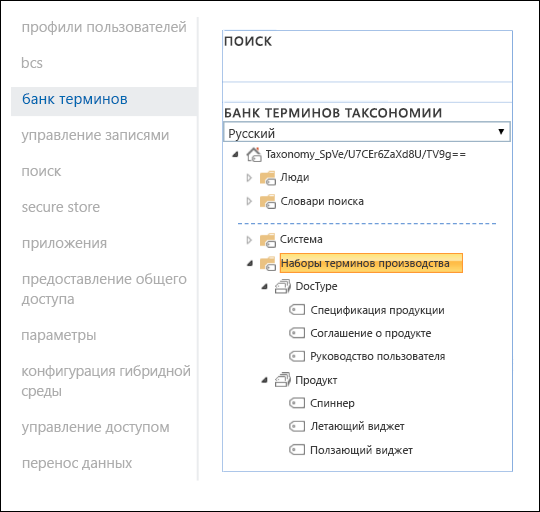

*Тип контента* можно создать и опубликовать с помощью [центра типов контента](https://support.office.com/article/manage-content-type-publishing-06f39ac0-5576-4b68-abbc-82b68334889b). Вы также можете создать и опубликовать тип контента с помощью средств подготовки сайта, например [платформы подготовки PnP](https://docs.microsoft.com/sharepoint/dev/solution-guidance/pnp-provisioning-framework) или [схемы JSON для макетов сайта](https://docs.microsoft.com/sharepoint/dev/declarative-customization/site-design-json-schema#define-a-new-content-type).

У каждого продукта есть отдельный сайт SharePoint, содержащий одну библиотеку документов, в которой разрешены соответствующие типы контента. Все документы хранятся в этой библиотеке документов.

[  ](../media/SPRetention3.png#lightbox)

> [!NOTE]
> Вместо использования одного сайта SharePoint для каждого продукта производственная компания в этом сценарии могла бы использовать команду Microsoft Teams для каждого продукта, поскольку в этом случае поддерживаются функции сотрудничества с членами команды, включая постоянный чат и управление документами на вкладке **Файлы**. В этой статье мы рассматриваем только документы, поэтому будем использовать только сайт.

Вот как выглядит библиотека документов для продукта Spinning Widget:

[ 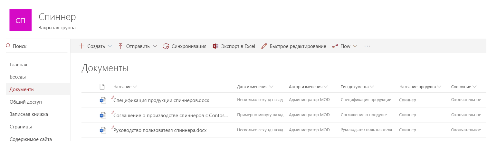 ](../media/SPRetention4.png#lightbox)

Итак, мы располагаем базовой информационной архитектурой для управления документами. Теперь рассмотрим стратегии хранения и ликвидации документов, использующие метаданные и классификацию документов.

## <a name="retention-and-disposition"></a>Хранение и ликвидация

Политики управления данными и соблюдения нормативных требований, действующие в производственной компании, устанавливают порядок хранения и ликвидации данных. Документы, связанные с продуктами, должны храниться в течение всего времени производства продукта, а также дополнительно в течение определенного срока. Этот дополнительный срок отличается для спецификаций продуктов, соглашений и руководств пользователя. Требования к хранению и ликвидации указаны в следующей таблице.

|   Тип документа            |   Хранение                            |   Ликвидация                                |
| -------------------------- | -------------------------------------- | -------------------------------------------- |
| Спецификации продукта      | 5 лет после прекращения производства  | Удалить                                       |
| Соглашения о продуктах          | 10 лет после прекращения производства | Проверка                                       |
| Руководства для пользователей                | 5 лет после прекращения производства  | Удалить                                       |
| Все остальные типы документов | Не применять активное хранение  | Удалять документы старше 3 лет <br /><br /> Документ считается старше 3 лет, если он не изменялся в течение последних 3 лет. |
|||

С помощью Центра соответствия требованиям Microsoft 365 мы создаем следующие [метки хранения](retention.md#retention-labels):

  - Спецификация продукта

  - Соглашение о продукте

  - Руководство пользователя

В этой статье рассматривается создание и автоматическое применение только метки хранения "Спецификация продукта". Чтобы реализовать полный сценарий, следует также создать и автоматически применять метки хранения для двух остальных типов документов.

### <a name="settings-for-the-product-specification-retention-label"></a>Параметры метки хранения "Спецификация продукта"

Вот [план хранения](file-plan-manager.md) для метки хранения "Спецификация продукта":

- **Название:** Спецификация продукта

- **Описание для администраторов:** хранить 5 лет после прекращения производства, автоматически удалять, хранение на основе событий, тип события — *Прекращение производства*.

- **Описание для пользователей:** хранить 5 лет после прекращения производства.

- **Действие хранения:** хранение и удаление.

- **Срок хранения:** 5 лет (1825 дней)

- **Метка хранения**: настройка метки хранения для классификации контента как [записи](records-management.md#records). (Документы, классифицированные как *записи* не могут быть изменены или удалены пользователями.)

- **Дескрипторы плана хранения:** (для упрощения сценария файловые дескрипторы не предоставлены)

На снимке экрана ниже показаны настройки при создании метки хранения "Спецификация продукта" в Центре соответствия требованиям Microsoft 365. При создании метки хранения можно создать тип событий *Прекращение производства*. Процедура описана в сценариях ниже.

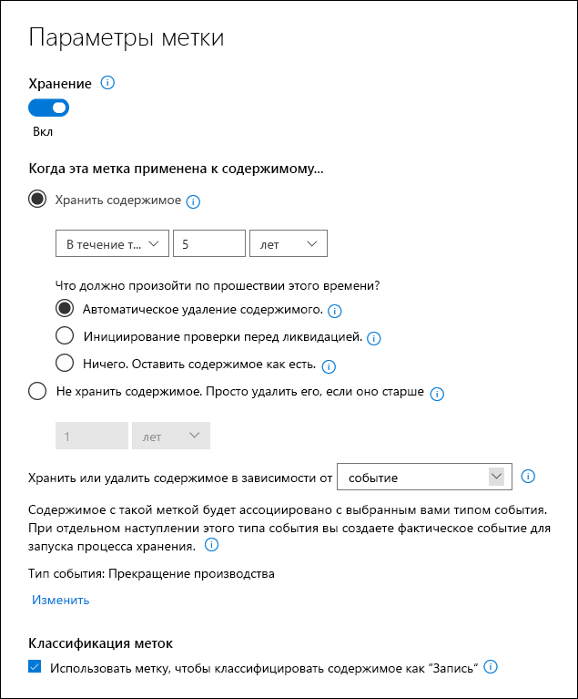

> [!NOTE]
> Чтобы не допустить хранение в течение 5 лет, настройте длительность хранения ***1 день*** при повторном создании сценария в тестовой среде.

### <a name="create-an-event-type-when-you-create-a-retention-label"></a>Создание типа события при создании метки хранения

1. Из раскрывающегося списка **Хранить или удалить содержимое в зависимости от** выберите **событие**.

2. Щелкните **Выберите тип события**.
    
    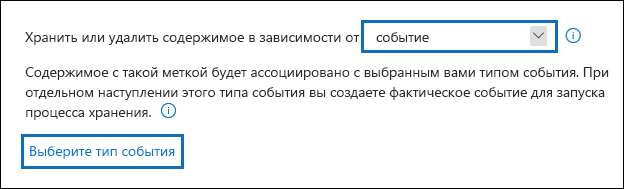

3. Щелкните **Выберите тип события** и нажмите **Создать новые типы событий** на странице **Выберите тип события**.

4. Создайте тип событий ***Прекращение производства***, введите описание и нажмите кнопку **Готово**.

5. На странице **Выберите тип события** выберите только что созданный тип события **Прекращение производства** и нажмите кнопку **Добавить**.

   Вот как должны выглядеть параметры метки хранения "Спецификация продукта". 

   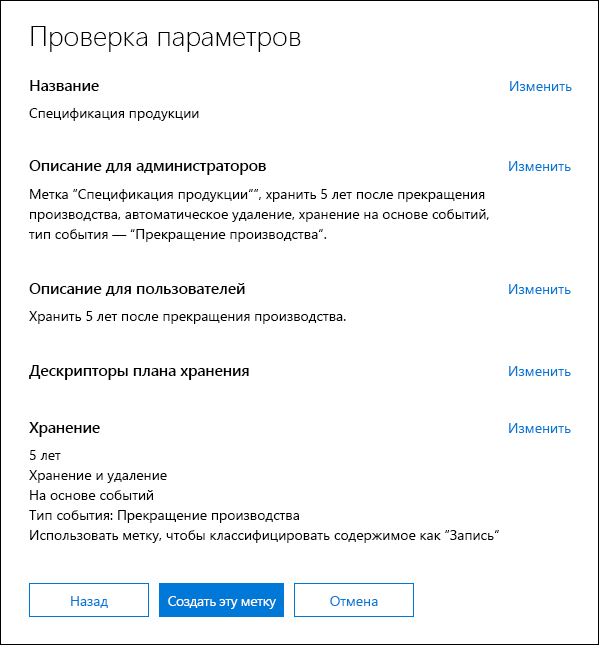

6. Щелкните **Создать эту метку**. 

   > [!TIP]
   > Подробное описание действий см. в разделе [Создание метки со сроком хранения на основе события](event-driven-retention.md#step-1-create-a-label-whose-retention-period-is-based-on-an-event).

Перейдем к автоматическому применению этой метки хранения к содержимому спецификаций продуктов.

## <a name="auto-apply-retention-labels-to-classify-content"></a>Автоматическое применение меток хранения для классификации продуктов

Мы будем использовать язык KQL, чтобы [автоматически применять](apply-retention-labels-automatically.md) созданные метки хранения. KQL — это язык, который используется для создания поисковых запросов. С помощью KQL можно выполнять поиск по ключевым словам или управляемым свойствам. Больше информации см. в [Справочнике по синтаксису языка запросов по ключевым словам (KQL)](https://docs.microsoft.com/sharepoint/dev/general-development/keyword-query-language-kql-syntax-reference).

В общем, мы должны дать системе Microsoft 365 команду применять метку хранения *Спецификация продукта* ко всем документам, в которых для свойства **Статус** задано значение ***Окончательный***, а для свойства **Тип документа** — значение ***Спецификация продукта***. Помните, что **Status** и **Doc Type** — столбцы сайта, которые мы ранее определили для типа контента "Документация по продукту", в разделе [Информационная архитектура](#information-architecture). Для этого нужно настроить схему поиска.

Когда система SharePoint индексирует содержимое, она автоматически создает свойства для обхода для каждого столбца сайта. В этом сценарии нас интересуют свойства **Doc Type** и **Status**. Чтобы поисковая система создала свойства для обхода, в библиотеке должны быть документы с нужным типом содержимого, а также должны быть заполнены столбцы сайта.

В Центре администрирования SharePoint откройте конфигурацию поиска и выберите **Управление схемой поиска**, чтобы просмотреть и настроить свойства для обхода.


Если ввести ***status*** в поле **Свойства для обхода** и щелкнуть зеленую стрелку, появится приблизительно такой результат:


Нас интересует свойство **ows\_\_Status** (обратите внимание на двойной символ подчеркивания). Оно соответствует свойству **Status** типа контента "Производственный документ".

Если ввести ***ows\_doc*** и щелкнуть зеленую стрелку, появится примерно следующее:

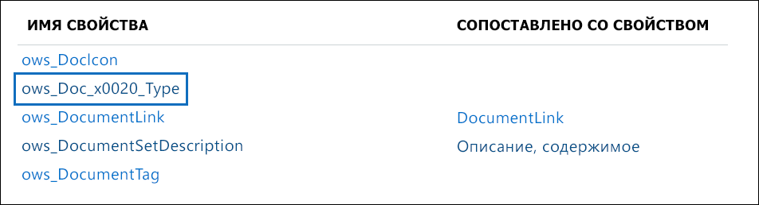

Свойство **ows\_Doc\_x0020\_Type** — второй интересующее нас свойство. Оно соответствует свойству **Doc Type** типа контента "Производственный документ".

> [!TIP]
> Чтобы определить имя свойства для обхода для этого сценария, перейдите в библиотеку документов, содержащую производственные документы. Затем перейдите к параметрам библиотеки. В разделе **Столбцы** выберите имя столбца (например, **Status** или **Doc Type**), чтобы открыть страницу этого столбца сайта. Параметр *Поле* в URL-адресе этой страницы содержит имя поля. Имя поля с префиксом "ows_" является именем свойства для обхода. Например, URL-адрес `https://tenantname.sharepoint.com/sites/SpinningWidget/_layouts/15/FldEdit.aspx?List=%7BC38C2F45-3BD6-4C3B-AA3B-EF5DF6B3D172%7D&Field=_Status` соответствует свойству для обхода *ows\_\_Status*.

Если нужные свойства для обхода отсутствуют в разделе "Управление схемой поиска" в Центре администрирования SharePoint:

- Возможно, документы не были проиндексированы. Можно принудительно выполнить повторное индексирование библиотеки. Для этого перейдите в раздел **Параметры библиотеки документов** > **Дополнительные параметры**.

- Если библиотека документов находится на современном сайте, убедитесь, что администратор SharePoint также является администратором семейства веб-сайтов.

Дополнительные сведения о свойствах для обхода и управляемых свойствах см. в статье [Автоматически создаваемые управляемые свойства в SharePoint Server](https://docs.microsoft.com/sharepoint/technical-reference/automatically-created-managed-properties-in-sharepoint).

### <a name="map-crawled-properties-to-pre-defined-managed-properties"></a>Сопоставление свойств для обхода с заранее заданными управляемыми свойствами

KQL не может использовать свойства для обхода в поисковых запросах. Необходимо использовать управляемое свойство. В обычном сценарии поиска мы создаем управляемое свойство и сопоставляем его с нужным нам свойством для обхода. Тем не менее, для автоматически применяемых меток хранения можно указать на языке KQL только заранее заданные управляемые свойства, а не настраиваемые управляемые свойства. В системе уже есть набор управляемых свойств, созданных для строк с *RefinableString00* по *RefinableString199*, который можно использовать. Полный список см. в разделе [Управляемые свойства, не используемые по умолчанию](https://docs.microsoft.com/sharepoint/manage-search-schema#default-unused-managed-properties). Эти управляемые свойства по умолчанию обычно используются для определения уточнений поиска.

Чтобы запрос на языке KQL автоматически применял нужную метку хранения к документам о продуктах мы сопоставим свойства для обхода **ows\_Doc\_x0020\_Type* и *ows\_\_Status** с двумя уточняемыми управляемыми свойствами. В нашей тестовой среде для этого сценария **RefinableString00** и **RefinableString01** не используются. Мы определили это, ознакомившись с разделом **Управляемые свойства** на странице **Управление схемой поиска** в Центре администрирования SharePoint.

[  ](../media/SPRetention12.png#lightbox)

Обратите внимание, что столбец **Сопоставленные свойства для обхода** на предыдущем снимке экрана пуст.

Чтобы сопоставить свойство для обхода **ows\_Doc\_x0020\_Type**, выполните следующие действия:

1. В поле фильтра **Управляемое свойство** введите ***RefinableString00*** и щелкните зеленую стрелку.

2. В списке результатов щелкните ссылку **RefinableString00** и прокрутите вниз до раздела **Сопоставления со свойствами для обхода**.  

3. Щелкните **Добавить сопоставление** и введите ***ows\_Doc\_x0020\_Type*** в поле **Поиск имени свойства для обхода** в окне **Выбор свойства для обхода**. Нажмите кнопку **Найти**.  

4. В списке результатов выберите **ows\_Doc\_x0020\_Type** и нажмите кнопку **ОК**.

   В раздел **Сопоставленные свойства для обхода** должен выглядеть примерно так, как на этом снимке экрана:

   [ 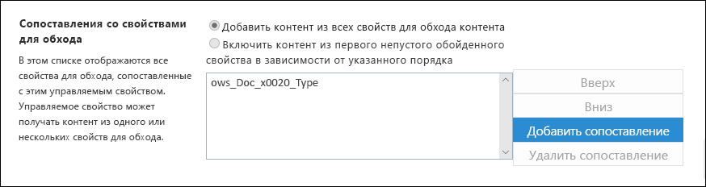 ](../media/SPRetention13.png#lightbox)


5. Прокрутите страницу вниз и нажмите кнопку **ОК**, чтобы сохранить сопоставление.

Повторите эти действия для сопоставления **RefinableString01** и **ows\_\_Status**.

Теперь у вас должно быть два управляемых свойства, сопоставленных с двумя свойствами для обхода:

[ 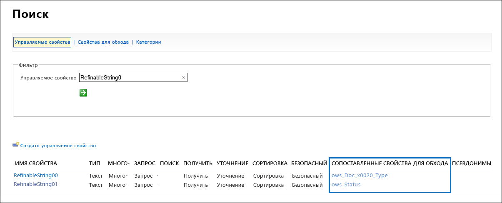 ](../media/SPRetention14.png#lightbox)

Давайте проверим правильность настройки, запустив корпоративный поиск. В браузере перейдите по ссылке *https://\<your_tenant>.sharepoint.com/search*. В поле поиска введите ***RefinableString00:"Спецификация продукта"*** и нажмите клавишу ВВОД. Этот поисковый запрос должен возвратить все документы, у которых свойство ***Doc Type*** имеет значение **Спецификация продукта**.

Теперь введите в поле поиска **RefinableString00:"Спецификация продукта" AND RefinableString01:Final** и нажмите клавишу ВВОД. Этот поисковый запрос должен возвратить все документы, у которых свойство ***Doc Type*** имеет значение **Спецификация продукта**, а **Status** имеет значение ***Окончательный***.

### <a name="create-auto-apply-label-policies"></a>Создание политики автоматического применения меток

Итак, мы убедились, что запрос KQL работает. Теперь нужно создать политику меток, использующую запрос KQL для автоматического применения метки хранения "Спецификация продукта" к соответствующим документам.

1. В [Центре соответствия требованиям](https://compliance.microsoft.com/homepage) выберите **Управление записями** > **Политики меток** > **Автоматическое применение меток**.

   [ 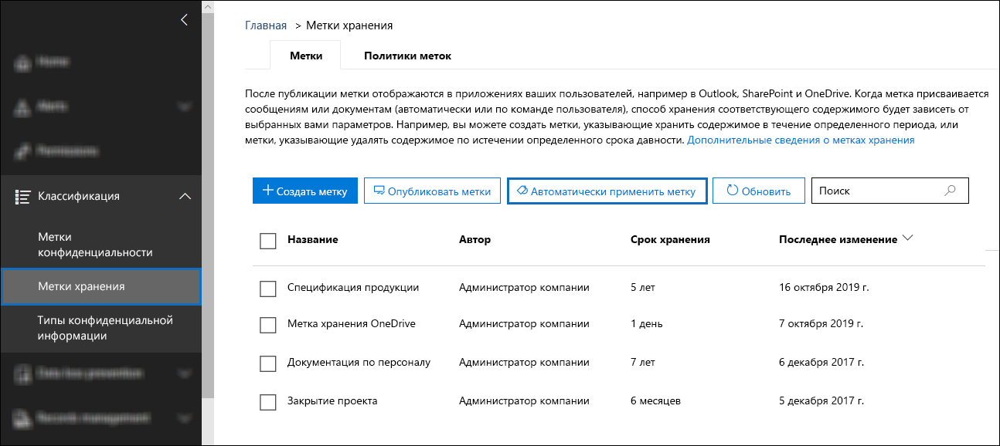 ](../media/SPRetention16.png#lightbox)

2. На странице мастера **Выбор метки для автоматического применения** щелкните **Выбор метки для автоматического применения**.

3. В списке меток выберите **Спецификация продукта**. Затем щелкните **Добавить** и **Далее**.

4. Выберите **Применить метку к содержимому с определенными словами или фразами**, затем нажмите кнопку **Далее**.

   [ 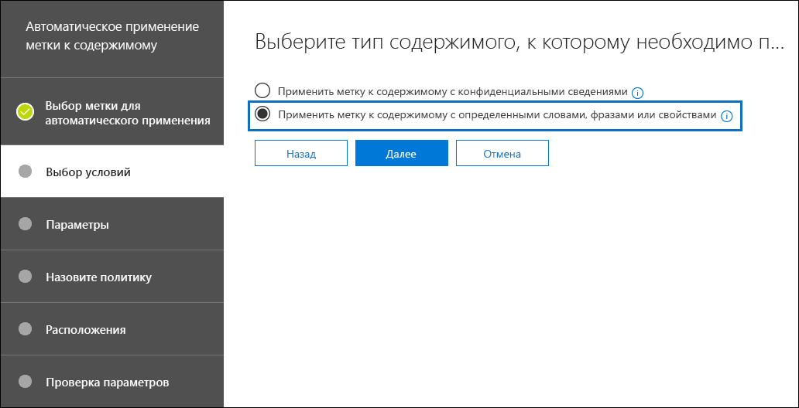 ](../media/SPRetention17.png#lightbox)

   На следующем шаге следует указать тот же запрос KQL, который мы протестировали в предыдущем разделе. Этот запрос возвратил все документы типа "Спецификация продукта" со статусом *Окончательный*. Если сделать этот же запрос в политике меток, то метка хранения "Спецификация продукта" будет автоматически применена ко всем документам, которые соответствуют этому поисковому запросу.

5. В поле **Редактор запросов по ключевому слову** введите ***RefinableString00:"Спецификация продукта" AND RefinableString01:Final***, затем нажмите кнопку **Далее**.

   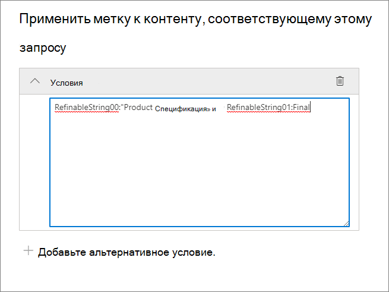

6. Введите имя (например, ***Автоматическое применение метки "Спецификация продукта"***) и необязательное описание этой политики меток, затем нажмите кнопку **Далее**.

7. На странице мастера **Выберите расположения** нужно выбрать расположения содержимого, к которым следует применить эту политику. В этом сценарии мы применяем политику только к расположениям SharePoint, поскольку все производственные документы хранятся в библиотеках документов SharePoint. Установите флажок **Позволить мне выбрать расположения**, выключите переключатели для **электронной почты Exchange**, **учетных записей OneDrive** и **групп Microsoft 365**. Убедитесь, что переключатель для сайтов SharePoint включен. 

    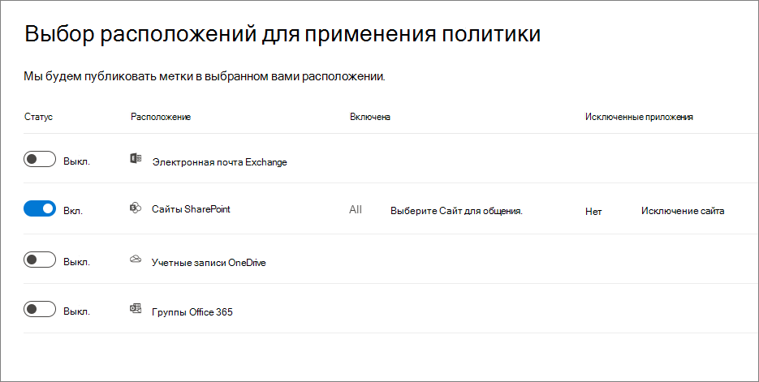

   > [!TIP]
   > Вместо применения политики ко всем сайтам SharePoint можно щелкнуть **Выбрать сайты** и добавить URL-адреса определенных сайтов SharePoint.

8. Нажмите кнопку **Далее**, чтобы открыть страницу **Проверьте параметры**.

    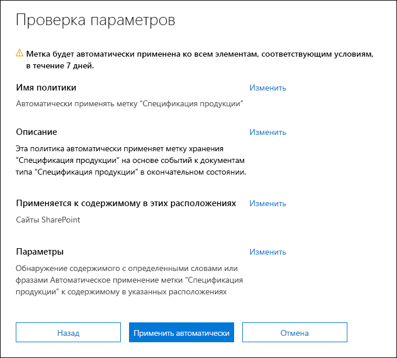

9. Щелкните **Автоматическое применение**, чтобы создать политику меток.

   >[!NOTE]
   >Автоматическое применение метки "Спецификация продукта" ко всем документам, соответствующим запросу KQL, может занять до 7 дней.

### <a name="verify-that-the-retention-label-was-automatically-applied"></a>Проверка автоматического применения метки хранения

Через 7 дней используйте [Обозреватель действий](data-classification-activity-explorer.md) в Центре соответствия требованиям, чтобы убедиться, что созданная нами политика меток автоматически применила метки хранения к документам о продуктах.

Также проверьте свойства документа в библиотеке документов. В области сведений видно, что к выбранному документу применена метка хранения.

[ 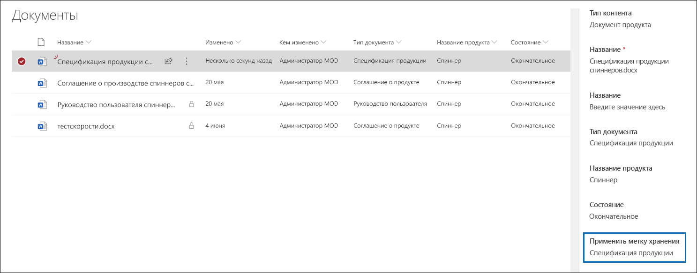 ](../media/SPRetention21.png#lightbox)

Метки хранения были автоматически применены к документам, поэтому документы защищены от удаления (метки хранения настроены таким образом, что документы объявлены *записями*). Пример такой защиты: если попытаться удалить один из этих документов, появится сообщение об ошибке:

[  ](../media/SPRetention22.png#lightbox)

## <a name="generate-the-event-that-triggers-the-retention-period"></a>Создание события, начинающего срок хранения

Итак, метки хранения применены. Теперь перейдем к событию, которое будет означать прекращение производства определенного продукта. Это событие запускает начало периода хранения, определенного в метках хранения. Например, для спецификаций продуктов 5-летний срок хранения начинается при срабатывании события "прекращение производства".

Вы можете вручную создать событие в Центре соответствия требованиям Microsoft 365. Для этого выберите **Управление записями** > **События**. Выберите тип события, укажите правильные идентификаторы ресурсов и дату события. Дополнительные сведения см. в статье [Начало хранения при наступлении события](event-driven-retention.md).

Однако в этом сценарии мы автоматически создадим это событие из внешней производственной системы. Вся система — это простой список SharePoint, где указано, находится ли продукт в производстве. Поток [Power Automate](https://docs.microsoft.com/flow/getting-started), связанный со списком, вызывает событие. В реальном сценарии вы можете сформировать данное событие в разных системах, например в системе отдела кадров или CRM-системе. Power Automate содержит множество готовых взаимодействий и компонентов для рабочих нагрузок Microsoft 365, таких как Microsoft Exchange, SharePoint, Teams и Dynamics 365, а также для сторонних приложений, таких как Twitter, Box, Salesforce и Workdays. Эта функция упрощает интеграцию Power Automate с различными системами. Дополнительные сведения см. в статье [Автоматизация хранения на основе событий](automate-event-driven-retention.md).

На следующем снимке экрана показан список SharePoint, который будет использован для запуска этого события:

[ 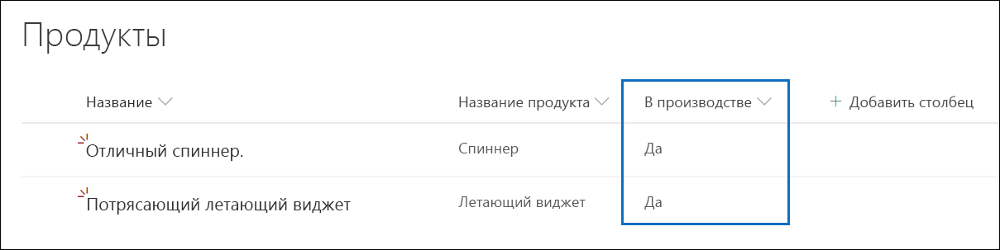 ](../media/SPRetention23.png#lightbox)

В настоящее время в производстве находятся два продукта. Об этом свидетельствует значение ***Да*** в столбце **В производстве**. Если для какого-либо продукта в этом столбце указано значение ***Нет***, поток, связанный с этим списком, автоматически сформирует событие. Это событие запустит срока хранения для метки хранения, которая была применена к соответствующим документам о продуктах.

В этом сценарии мы используем случае поток для срабатывания события:

[ 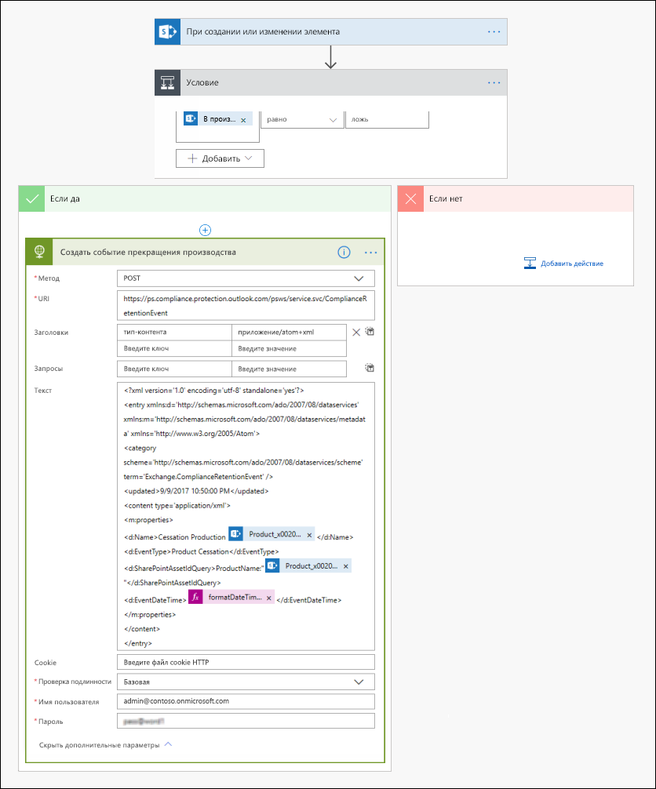 ](../media/SPRetention24.png#lightbox)

Чтобы создать этот поток, начните с соединителя SharePoint и выберите триггер **При создании или изменении элемента**. Укажите адрес сайта и имя списка. Затем добавьте условие: в столбце **В производстве** этого списка установлено значение ***Нет*** (или *false* в карточке условия). Затем добавьте действие на основе встроенного шаблона HTTP. Для настройки действия HTTP используйте значения, указанные в следующем разделе. Можно скопировать значения свойств **URI** и **Текст** из следующего раздела и вставить их в шаблон.

- **Метод**: POST
- **URI**: `https://ps.compliance.protection.outlook.com/psws/service.svc/ComplianceRetentionEvent`
- **Заголовки**: Key = Content-Type, Value = application/atom+xml
- **Текст**:
    
    ```xml
    <?xml version='1.0' encoding='utf-8' standalone='yes'>
    <entry xmlns:d='http://schemas.microsoft.com/ado/2007/08/dataservices' xmlns:m='http://schemas.microsoft.com/ado/2007/08/dataservices/metadata' xmlns='https://www.w3.org/2005/Atom'>
    <category scheme='http://schemas.microsoft.com/ado/2007/08/dataservices/scheme' term='Exchange.ComplianceRetentionEvent'>
    <updated>9/9/2017 10:50:00 PM</updated>
    <content type='application/xml'>
    <m:properties>
    <d:Name>Cessation Production @{triggerBody()?['Product_x0020_Name']?['Value']}</d:Name>
    <d:EventType>Product Cessation&lt;</d:EventType>
    <d:SharePointAssetIdQuery>ProductName:&quot;@{triggerBody()?['Product_x0020_Name']?['Value']}<d:SharePointAssetIdQuery>
    <d:EventDateTime>@{formatDateTime(utcNow(),'yyyy-MM-dd')}</d:EventDateTime>
    </m:properties>
    </content&gt>
    </entry>
    ```

Этот список описывает параметры в свойстве **Текст** действия, которое должно быть настроено для этого сценария:

- **Name**. Этот параметр указывает имя события, которое будет создано в Центре соответствия требованиям Microsoft 365. В нашем случае используется имя "Cessation Production *xxx*", где *xxx* — значение созданного ранее управляемого свойства **ProductName**.
- **EventType**. Значение этого параметра соответствует типу событий, к которому будет применяться созданное событие. Этот тип событий был определен при создании метки хранения. В этом сценарии тип события — "Прекращение производства".
- **SharePointAssetIdQuery**. Этот параметр определяет идентификатор ресурса для события. Для хранения на основе событий требуется уникальный идентификатор документа. С помощью идентификаторов ресурсов можно обозначить документы, к которым применяется определенное событие, или, как мы поступаем в этом сценарии, обозначить столбец метаданных — **название продукта**. Для этого нужно создать новое управляемое свойство **ProductName**, которое можно использовать в запросе KQL. (Кроме того, вместо создания нового управляемого свойства можно использовать **RefinableString00**). Также нужно сопоставить это новое управляемое свойство со свойством для обхода **ows_Product_x0020_Name**. Вот снимок экрана этого управляемого свойства.

    [  ](../media/SPRetention25.png#lightbox)

- **EventDateTime**. Этот параметр определяет дату, когда происходит событие. Используйте такой формат даты:<br/><br/>*formatDateTime(utcNow(),'yyyy-MM-dd'*)

### <a name="putting-it-all-together"></a>Готовое решение

Метка хранения создана и автоматически применена, а поток настроен и создан. Если значение в столбце **В производстве** для продукта Spinning Widget из списка изменится с ***Да*** на ***Нет***, запустится поток для создания события. Чтобы увидеть это событие в Центре соответствия требованиям, выберите **Управление записями** > **События**.

[ 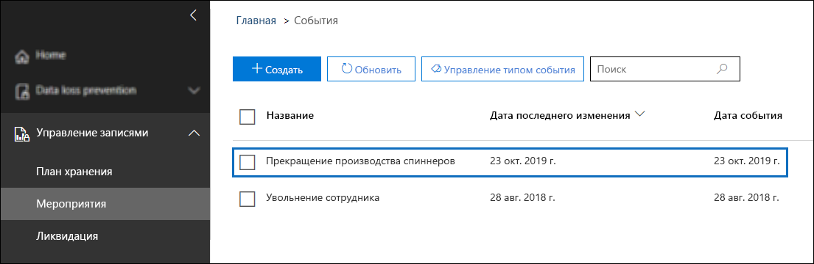 ](../media/SPRetention28.png#lightbox)

Выберите событие, чтобы просмотреть сведения на всплывающей странице. Обратите внимание, что хотя событие создано, состояние события указывает на то, что обработанных сайтов или документов SharePoint нет.

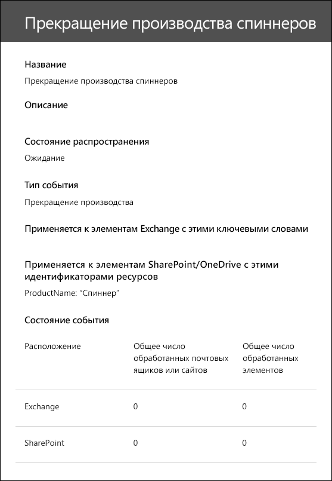

Через некоторое время состояние события будет указывать на то, что сайт SharePoint и документ SharePoint обработаны.  

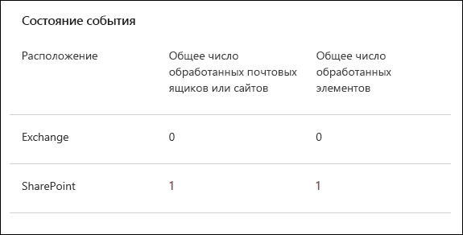
 
Это означает, что запущен срок хранения для метки, примененной к документу о продукте Spinning Widget, на основании даты события *Прекращение производства Spinning Widget*. Если в сценарии в тестовой среде настроен срок хранения в один день, можно перейти в библиотеку документов о продуктах через несколько дней после создания этого события и убедиться, что документ удален (после запуска задания удаления в SharePoint).

### <a name="more-about-asset-ids"></a>Подробнее об идентификаторах ресурсов

Как указано в статье [Общие сведения о хранении, зависящем от возникновения события](event-driven-retention.md), важно понимать взаимоотношения между типами событий, метками хранения, событиями и идентификаторами ресурсов. Идентификатор ресурса — это лишь свойство документа в SharePoint и OneDrive. С его помощью можно обозначить документы, срок хранения которых будет запускаться событием. По умолчанию в SharePoint есть свойство **идентификатора ресурса**, которое можно использовать для хранения на основе событий:

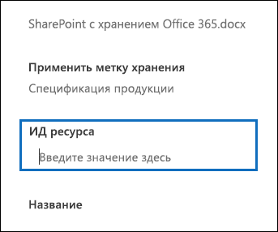

Как показано на следующем снимке экрана, управляемое свойство идентификатора ресурса называется **ComplianceAssetId**.

[  ](../media/SPRetention27.png#lightbox)

Вместо свойства **идентификатора ресурса** по умолчанию можно использовать другое свойство, что мы и делаем в этом сценарии. При этом важно помнить, что если не указать идентификатор ресурса или ключевые слова события, то событие запустит срок хранения для всего содержимого с меткой данного типа событий.

### <a name="using-advanced-search-in-sharepoint"></a>Использование расширенного поиска в SharePoint

На предыдущем снимке экрана видно, что существует еще одно управляемое свойство, связанное с метками хранения. Оно называется **ComplianceTag** и сопоставлено со свойством для обхода. Управляемое свойство **ComplianceAssetId** также сопоставлено со свойством для обхода. Это означает, что можно использовать эти управляемые свойства в расширенном поиске для получения всех документов, помеченных меткой хранения.
