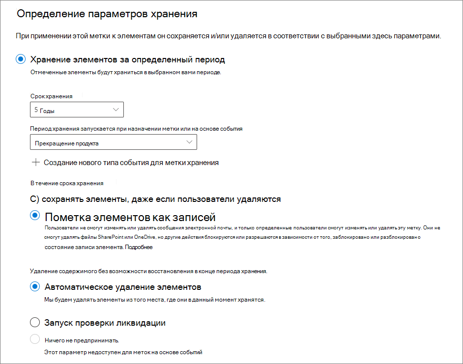
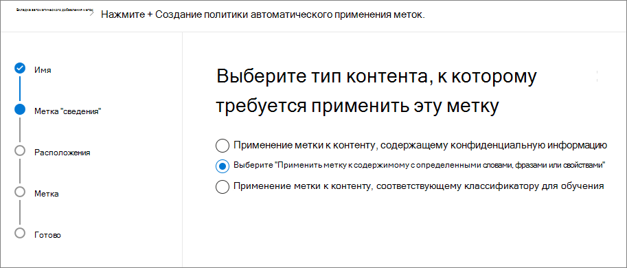
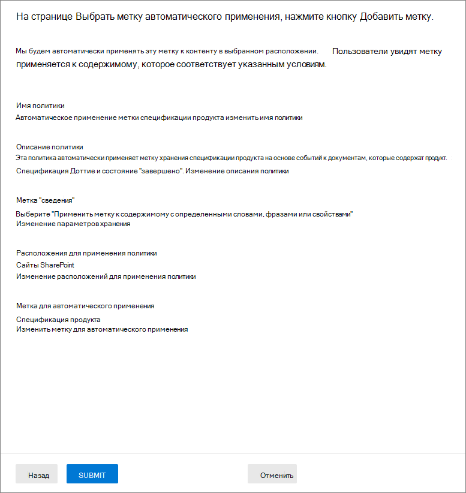

# <a name="manage-the-lifecycle-of-sharepoint-documents-with-retention-labels"></a>Управление жизненным циклом документов SharePoint с помощью меток хранения

>*[Руководство по лицензированию Microsoft 365 для обеспечения безопасности и соответствия требованиям](https://aka.ms/ComplianceSD).*

В этой статье описывается, как управлять жизненным циклом хранящихся в SharePoint Online документах, связанных с продуктами, с помощью меток хранения Office 365 и, в частности, путем автоматического применения меток и настройки хранения на базе событий. Функциональность автоматического применения применяет классификацию документов с использованием метаданных SharePoint. Сценарий, описываемый в этой статье, основан на документах, связанных с продуктами, но такой же поход можно использовать и в других сценариях. Например, в нефтегазовой отрасли можно управлять жизненным циклом документов, связанных с физическими активами, например, добывающими платформами, журналами скважин и лицензиями на производство. В отрасли финансовых услуг можно управлять документами, которые связаны с банковскими счетами, ипотекой или страховыми договорами. В государственном секторе можно управлять документами, связанными с разрешениями на строительство или с налоговыми формами.

Рассмотрим сценарий, описываемый в этой статье. Мы изучим информационную архитектуру и определение меток хранения. Затем мы перейдем к классификации документов путем автоматического применения меток, а затем будем формировать события, запускающие начало срока хранения.

## <a name="information-architecture"></a>Информационная архитектура

Сценарий, описываемый в этой статье, основан на работе производственной компании, в которой для хранения всех документов, связанных с продуктами, которые разрабатывает эта компания, используется Office 365 SharePoint Online. В число этих документов входят: спецификации продуктов, соглашения с поставщиками и руководства пользователя. Для этих документов при хранении в SharePoint в рамках корпоративных политик управления содержимым определяются метаданные, которые используются для классификации документов. Каждый документ обладает следующими свойствами метаданных:

- **Doc Type** — тип документа (например, спецификация продукта, соглашение или руководство пользователя)

- **Product Name** — название продукта

- **Status** — состояние (черновик или окончательная версия)

Эти метаданные образуют базовый тип контента **Производственный документ** для всех документов.


> [!NOTE]
> Свойства **Doc Type** и **Status** используются политиками хранения на более позднем этапе этого сценария для классификации и автоматического применения меток хранения.

Может быть несколько типов контента для разных типов документов, но мы будем работать с документацией по продуктам.

В этом сценарии мы используем службу управляемых метаданных и банк терминов, чтобы создать один набор терминов для **Doc Type** и еще один для **Product Name**. В каждом наборе терминов мы создаем термин для каждого значения. В банке терминов вашей организации SharePoint это будет выглядеть примерно так:


Тип контента можно создать и опубликовать с помощью [центра типов контента](https://support.office.com/article/manage-content-type-publishing-06f39ac0-5576-4b68-abbc-82b68334889b). Тип контента также можно создать и опубликовать с помощью средств подготовки сайта, например [платформы подготовки PnP](https://docs.microsoft.com/sharepoint/dev/solution-guidance/pnp-provisioning-framework) или [схемы JSON для макетов сайта](https://docs.microsoft.com/sharepoint/dev/declarative-customization/site-design-json-schema#define-a-new-content-type).

У каждого продукта есть отдельный сайт SharePoint Online, содержащий одну библиотеку документов, в которой разрешены соответствующие типы контента. Все документы хранятся в этой библиотеке документов.


> [!NOTE]
> Вместо использования одного сайта SharePoint Online для каждого продукта производственная компания в этом сценарии могла бы использовать Microsoft Team для каждого продукта, поскольку в этом случае поддерживаются функции сотрудничества с членами команды, включая постоянный чат и управление документами на вкладке **Файлы**. В этой статье мы рассматриваем только документы, поэтому будем использовать только сайт.

Вот как выглядит библиотека документов для продукта Spinning Widget:


Итак, мы располагаем базовой информационной архитектурой для управления документами. Теперь рассмотрим стратегии хранения и ликвидации документов, использующие метаданные и классификацию документов.

## <a name="retention-and-disposition"></a>Хранение и ликвидация

Политики управления данными и соблюдения нормативных требований, действующие в производственной компании, устанавливают порядок хранения и ликвидации данных. Документы, связанные с продуктами, должны храниться в течение всего времени производства продукта, а также в течение определенного срока после прекращения производства. Этот срок различается для спецификаций продуктов, соглашений и руководств пользователя. Требования к хранению и ликвидации указаны в следующей таблице.

| **Тип документа**          | **Хранение**                          | **Ликвидация**                              |
| -------------------------- | -------------------------------------- | -------------------------------------------- |
| Спецификация продукта      | 5 лет после прекращения производства  | Удаление                                       |
| Соглашение о продукте          | 10 лет после прекращения производства | Проверка                                       |
| Руководство пользователя                | 5 лет после прекращения производства  | Удаление                                       |
| Все остальные типы документов | Не использовать активное хранение других документов  | Удалять документы старше 3 лет<sup>\*</sup>  |
|||

> [!NOTE]
> <sup>\*</sup> Документ считается старше 3 лет, если он не изменялся в течение последних 3 лет.

С помощью Центра безопасности и соответствия требованиям мы создаем следующие метки хранения:

  - Спецификация продукта

  - Соглашение о продукте

  - Руководство пользователя

В этой статье рассматривается создание и автоматическое применение только метки хранения "Спецификация продукта". Чтобы реализовать полный сценарий, следует создать и автоматически применять метки хранения для двух остальных типов документов.

### <a name="settings-for-the-product-specification-retention-label"></a>Параметры метки хранения "Спецификация продукта"

Вот [план хранения](file-plan-manager.md) для метки хранения "Спецификация продукта": 

- **Название:** Спецификация продукта

- **Описание для администраторов:** метка "Спецификация продукта", хранить пять лет после прекращения производства, автоматически удалять, хранение на основе событий, тип события — "Прекращение производства".

- **Описание для пользователей:** хранить пять лет после прекращения производства.

- **Действие хранения:** хранение и удаление

- **Срок хранения:** пять лет (1825 дней)

- **Метка записи**: настроить метку хранения для классификации содержимого в качестве[записи](labels.md#using-retention-labels-for-records-management) (документы, классифицированные как записи, не могут быть изменены или удалены пользователями)

- **Дескрипторы плана хранения:** (для упрощения сценария файловые дескрипторы не предоставлены)

На следующем снимке экрана показаны настройки при создании [метки хранения](labels.md) "Спецификация продукта" в Центре безопасности и соответствия требованиям. При создании метки хранения можно создать тип событий **Прекращение производства**. См. инструкции ниже.



> [!NOTE]
> Для удобства (и чтобы не ждать 5 лет для автоматического удаления документа) установите срок хранения равным 1 дню, если вы воспроизводите этот сценарий в тестовой среде.

### <a name="create-an-event-type-when-creating-a-retention-label"></a>Создайте тип события при создании метки хранения.

1. В раскрывающемся списке **Хранить или удалить содержимое в зависимости от** выберите **событие**.

2. Щелкните **Выберите тип события**.

   

3. На странице **Выберите тип события** щелкните **Здесь можно создать новые типы событий**.

4. Создайте тип событий **Прекращение производства**, укажите описание и нажмите кнопку **Готово**, чтобы завершить создание. 

5. На странице **Выберите тип события** выберите только что созданный тип события **Прекращение производства** и нажмите кнопку **Добавить**.

Вот как должны выглядеть параметры метки хранения "Спецификация продукта". Щелкните **Создать эту метку**, чтобы создать ее.


> [!TIP]
> Подробное описание действий см. в разделе [Создание метки со сроком хранения на основе события](event-driven-retention.md#step-1-create-a-label-whose-retention-period-is-based-on-an-event).

Итак, метка хранения создана. Перейдем к автоматическому применению этой метки хранения к содержимому спецификаций продуктов.

## <a name="classifying-content-by-auto-applying-retention-labels"></a>Классификация содержимого путем автоматического применения меток хранения

Мы будем [автоматически применять](labels.md#applying-a-retention-label-automatically-based-on-conditions) метки хранения, созданные для этого сценария, с помощью языка KQL. KQL — это язык, который используется для создания поисковых запросов. С помощью KQL можно выполнять поиск по ключевым словам или управляемым свойствам. Для получения дополнительных сведениях о KQL см. <https://docs.microsoft.com/sharepoint/dev/general-development/keyword-query-language-kql-syntax-reference>

Коротко говоря, мы должны дать команду системе Office 365 применять метку хранения **Спецификация продукта** ко всем документам, у которых свойство **Status** имеет значение **Final**,а свойство **Doc Type** имеет значение **Спецификация продукта**. Помните, что **Status** и **Doc Type** — столбцы сайта, которые мы ранее определили для типа контента "Product Documentation", в разделе [Информационная архитектура](#information-architecture). Для получения этого результата нужно настроить схему поиска.

Когда система SharePoint индексирует содержимое, она автоматически создает свойства для обхода для каждого столбца сайта. В этом сценарии нас интересуют свойства **Doc Type** и **Status**. Чтобы поисковая система создала свойства для обхода, в библиотеке должны быть документы с нужным типом содержимого, а также должны быть заполнены столбцы сайта.

В Центре администрирования SharePoint можно открыть конфигурацию поиска и выбрать **Управление схемой поиска**, чтобы просмотреть и настроить свойства для обхода.


Если ввести **status** в поле **Свойства для обхода** и щелкнуть зеленую стрелку, появится приблизительно такой результат:


Нас интересует свойство **ows\_\_Status** (обратите внимание на двойной символ подчеркивания). Оно соответствует свойству **Status** типа контента "Production Document".

Если ввести **ows\_doc** и щелкнуть зеленую стрелку, появится примерно следующее:


Свойство **ows\_Doc\_x0020\_Type** — второй интересующее нас свойство. Оно соответствует свойству **Doc Type** типа контента "Production Document".

> [!TIP]
> Чтобы определить имя свойства для обхода для этого сценария, перейдите в библиотеку документов, содержащую производственные документы, а затем перейдите к параметрам библиотеки. В разделе **Столбцы** выберите имя столбца (например, **Status** или **Doc Type**), чтобы открыть страницу этого столбца сайта. Параметр **Поле** в URL-адресе этой страницы содержит имя поля. Имя поля с префиксом "ows_" является именем свойства для обхода. Например, URL-адрес `https://tenantname.sharepoint.com/sites/SpinningWidget/_layouts/15/FldEdit.aspx?List=%7BC38C2F45-3BD6-4C3B-AA3B-EF5DF6B3D172%7D&Field=_Status` соответствует свойству для обхода **ows\_\_Status**.

Если нужные свойства для обхода отсутствуют в разделе "Управление схемой поиска" в Центре администрирования SharePoint, возможны следующие причины:

- Документы не были проиндексированы. Можно принудительно выполнить повторное индексирование библиотеки. Для этого перейдите в раздел "Параметры библиотеки документов" > "Дополнительные параметры".

- Если библиотека документов находится на современном сайте, убедитесь, что администратор SharePoint также является администратором семейства веб-сайтов.

Дополнительные сведения о свойствах для обхода и управляемых свойствах см. в статье [Автоматически создаваемые управляемые свойства в SharePoint Server](https://docs.microsoft.com/sharepoint/technical-reference/automatically-created-managed-properties-in-sharepoint).

### <a name="mapping-crawled-properties-to-pre-defined-managed-properties"></a>Сопоставление свойств для обхода с заранее заданными управляемыми свойствами

KQL не может использовать свойства для обхода в поисковых запросах. Необходимо использовать управляемое свойство. В обычном сценарии поиска мы создаем управляемое свойство и сопоставляем его с нужным нам свойством для обхода. Тем не менее, для автоматически применяемых меток хранения можно указать на языке KQL только заранее заданные управляемые свойства, а не настраиваемые управляемые свойства. В системе уже есть набор заранее заданных управляемых свойств, созданных для строк с RefinableString00 по RefinableString199. Мы воспользуемся этими свойствами. Полный список см. в разделе [Управляемые свойства, не используемые по умолчанию](https://docs.microsoft.com/sharepoint/manage-search-schema#default-unused-managed-properties). Эти управляемые свойства по умолчанию обычно используются для определения уточнений поиска.

Чтобы запрос на языке KQL работал и автоматически применял нужную метку хранения к документам о продуктах мы сопоставим свойства для обхода **ows\_Doc\_x0020\_Type** и **ows\_\_Status** с двумя уточняемыми управляемыми свойствами. В нашей тестовой среде для этого сценария **RefinableString00** и **RefinableString01** не используются. Мы определили это, ознакомившись с разделом **Управляемые свойства** на странице **Управление схемой поиска** в Центре администрирования SharePont.


Обратите внимание, что столбец **Сопоставленные свойства для обхода** на предыдущем снимке экрана пуст.

Чтобы сопоставить свойство для обхода **ows\_Doc\_x0020\_Type**, выполните следующие действия:

1. В поле фильтра **Управляемое свойство** введите **RefinableString00** и щелкните зеленую стрелку.

2. В списке результатов щелкните ссылку **RefinableString00** и прокрутите вниз до раздела **Сопоставления со свойствами для обхода**.  

3. Щелкните **Добавить сопоставление** и введите **ows\_Doc\_x0020\_Type** в поле **Поиск имени свойства для обхода** в окне **Выбор свойства для обхода**. Нажмите кнопку **Найти**.  

4. В списке результатов выберите **ows\_Doc\_x0020\_Type** и нажмите кнопку **ОК**.

   В раздел **Сопоставленные свойства для обхода** должен выглядеть примерно так, как на этом снимке экрана:

   

5. Прокрутите страницу вниз и нажмите кнопку **ОК**, чтобы сохранить сопоставление.

Повторите эту процедуру для сопоставления RefinableString01 и ows\_\_Status.

Теперь у вас должно быть два управляемых свойства, сопоставленных с двумя свойствами для обхода:


Давайте проверим правильность настройки, запустив корпоративный поиск. В браузере перейдите по адресу https://yourtenant.sharepoint.com/search. В поле поиска введите **RefinableString00:"Спецификация продукта"** и нажмите клавишу ВВОД. Этот поисковый запрос должен возвратить все документы, у которых свойство **Doc Type** имеет значение "Спецификация продукта".

Теперь введите в поле поиска **RefinableString00:"Спецификация продукта" AND RefinableString01:Final** и нажмите клавишу ВВОД. Этот поисковый запрос должен возвратить все документы, у которых свойство **Doc Type** имеет значение "Status" имеет значение **Final**.

### <a name="creating-the-auto-apply-label-policies"></a>Создание политики автоматического применения меток

Итак, мы убедились, что запрос KQL правильно работает. Теперь нужно создать политику меток, использующую запрос KQL для автоматического применения метки хранения "Спецификация продукта" к соответствующим документам.

1. В [Центре безопасности и соответствия требованиям](https://protection.office.com) перейдите в раздел **Классификация** > **Метки хранения**,затем щелкните **Автоматическое применение метки**. 

   

2. На странице мастера **Выбор метки для автоматического применения** щелкните **Выбор метки для автоматического применения**.

3. В списке меток выберите **Спецификация продукта**, нажмите кнопку **Добавить**, затем нажмите кнопку **Далее**.

4. Выберите **Применить метку к содержимому с определенными словами или фразами**, затем нажмите кнопку **Далее**.

   

   На следующем шаге нужно будет указать тот же запрос KQL, который мы протестировали в предыдущем разделе. Если помните, этот запрос возвратил все документы "Спецификация продукта" со статусом "Final". Если воспользоваться этим же запросом в политике меток, то метка хранения "Спецификация продукта" будет автоматически применена ко всем документам, которые соответствуют этому поисковому запросу.

5. В поле **Редактор запросов по ключевому слову** введите **RefinableString00:"Спецификация продукта" AND RefinableString01:Final**, затем нажмите кнопку **Далее**.

   

6. Введите имя (например, **Автоматическое применение метки "Спецификация продукта"**) и необязательное описание этой политики меток, затем нажмите кнопку **Далее**. 

7. На странице мастера **Выберите расположения** нужно выбрать расположения содержимого, к которым следует применить эту политику. В этом сценарии мы применяем политику только к расположениям SharePoint, поскольку все производственные документы хранятся только в библиотеках документов SharePoint. Щелкните **Позволить мне выбрать расположения**, выключите переключатели для электронной почты Exchange, учетных записей OneDrive и групп Office 365. Убедитесь, что переключатель для сайтов SharePoint включен. 

    

   > [!TIP]
   > Вместо применения политики ко всем сайтам SharePoint можно щелкнуть **Выбрать сайты** и добавить URL-адреса определенных сайтов SharePoint.

8. Нажмите кнопку **Далее**, чтобы открыть страницу **Проверьте параметры**. 

    

9. Щелкните **Автоматическое применение**, чтобы создать политику меток. Автоматическое применение метки "Спецификация продукта" ко всем документам, соответствующим указанному запросу KQL, может занять до семи дней.

### <a name="verifying-the-retention-label-was-automatically-applied"></a>Проверка автоматического применения метки хранения

Через семь дней используйте [Обозреватель действий с метками](view-label-activity-for-documents.md) в Центре безопасности и соответствия требованиям, чтобы убедиться, что созданная нами политика меток автоматически применила метки хранения к документам о продуктах. На следующем снимке экрана метки хранения также применены к соглашениям о продуктах и руководствам пользователей, хотя в этой статье мы не рассматривали создание этих меток хранения и политик меток.


Еще один этап проверки — свойства документа в библиотеке документов. В области сведений видно, что к выбранному документу применена метка хранения.


Метки хранения были автоматически применены к документам, поэтому документа защищены от удаления (метки хранения настроены таким образом, что документы объявлены записями). Пример такой защиты: если попытаться удалить один из этих документов, появится сообщение об ошибке, показанное на следующем снимке экрана.


## <a name="generating-the-events-that-trigger-the-start-of-the-retention-period"></a>Создание событий, включающих начало срока хранения

Итак, метки хранения успешно применены автоматически. Теперь перейдем к событию, которое будет означать прекращение производства определенного продукта. Когда это событие произойдет, оно запустит начало срока хранения, заданного в метках хранения, которые были автоматически применены к документам. Например, для спецификаций продуктов пятилетний срок хранения начинается при срабатывании события "прекращение производства".

Можно вручную создать это событие в Центре безопасности и соответствия требованиям (для этого перейдите в раздел **Управление записями** > **События**), выбрать тип события, настроить идентификаторы ресурсов и ввести дату события. Дополнительные сведения см. в статье [Хранение на основе событий](event-driven-retention.md).

В этом сценарии мы автоматически создадим это событие, сформировав его из внешней производственной системы. В данном случае система, формирующее событие, представляет собой простой список SharePoint, указывающий, осуществляется ли производство продукта, а также поток [Microsoft Flow](https://docs.microsoft.com/flow/getting-started), который связан с этим списком и будет запускать это событие. В реальном сценарии это событие может формироваться любой системой, например системой отдела кадров или CRM-системой. Microsoft Flow содержит множество готовых взаимодействий и компонентов для нагрузок Office 365, таких как Exchange, SharePoint, Teams и Dynamics 365, а также для сторонних приложений, таких как Twitter, Box, Salesforce и Workdays. За счет этого обеспечивается удобство интеграции Flow с этими системами. Дополнительные сведения см. в статье [Автоматизация хранения на основе событий](automate-event-driven-retention.md).

На следующем снимке экрана показан список SharePoint, который будет использован для запуска этого события: 


В настоящее время два продукта находятся в производстве: об этом свидетельствует значение **Да** в столбце **В производстве**. Если для какого-либо продукта в этом столбце указано значение **Нет**, поток, связанный с этим списком, автоматически сформирует событие. Из-за этого, в свою очередь, сработает начало срока хранения для метки хранения, которая была применена к соответствующим документам о продуктах.

В этом сценарии мы используем случае поток для срабатывания события:


Чтобы создать этот поток, начните с соединителя SharePoint и выберите триггер **При создании или изменении элемента**. Укажите адрес сайта и имя списка, затем добавьте условие для столбце **В производстве** этого списка при установке значения **Нет** (или значения "false" в карточке условия). Затем добавьте действие на основе встроенного шаблона HTTP. Для настройки действия HTTP используйте значения, указанные в следующем разделе. Можно скопировать значения свойств "URI" и "Текст" из раздела ниже и вставить их в шаблон.

- **Метод**: POST
- **URI**: https://ps.compliance.protection.outlook.com/psws/service.svc/ComplianceRetentionEvent
- **Заголовки**: Key = Content-Type, Value = application/atom+xml
- **Текст**:

```HTML
<?xml version='1.0' encoding='utf-8' standalone='yes'>
<entry xmlns:d='https://schemas.microsoft.com/ado/2007/08/dataservices' xmlns:m='https://schemas.microsoft.com/ado/2007/08/dataservices/metadata' xmlns='https://www.w3.org/2005/Atom'>
<category scheme='https://schemas.microsoft.com/ado/2007/08/dataservices/scheme' term='Exchange.ComplianceRetentionEvent'>
<updated>9/9/2017 10:50:00 PM</updated>
<content type='application/xml'>
<m:properties>
<d:Name>Cessation Production @{triggerBody()?['Product_x0020_Name']?['Value']}</d:Name>
<d:EventType>Product Cessation&lt;</d:EventType>
<d:SharePointAssetIdQuery>ProductName:&quot;@{triggerBody()?['Product_x0020_Name']?['Value']}<d:SharePointAssetIdQuery>
<d:EventDateTime>@{formatDateTime(utcNow(),'yyyy-MM-dd')}</d:EventDateTime>
</m:properties>
</content&gt>
</entry>
```

Следующий раздел описывает параметры в свойстве *Текст* действия, которое должно быть настроено для этого сценария.

- **Name**. Этот параметр указывает имя события, которое будет создано в Центре безопасности и соответствия требованиям. В нашем случае используется имя "Cessation Production xxx", где xxx — значение созданного ранее управляемого свойства ProductName.
- **EventType**. Значение этого параметра соответствует типу событий, к которому будет применяться созданное событие. Этот тип событий был определен при создании метки хранения. В этом сценарии тип события — "Прекращение производства".
- **SharePointAssetIdQuery**. Этот параметр определяет идентификатор ресурса для события. Для хранения на основе событий требуется уникальный идентификатор документа. С помощью идентификаторов ресурсов можно обозначить документы, к которым применяется определенное событие, или, как мы поступаем в этом сценарии, обозначить столбец метаданных — наше собственное название продукта. Для этого нужно создать новое управляемое свойство ProductName, которое можно использовать в запросе KQL (вместо создания нового управляемого свойства можно использовать RefinableString00). Также нужно сопоставить это новое управляемое свойство со свойством для обхода ows_Product_x0020_Name. Вот снимок экрана этого управляемого свойства.

    

- **EventDateTime**. Этот параметр определяет дату, когда происходит событие. Используйте текущий формат даты: *formatDateTime(utcNow(),'yyyy-MM-dd'*)

### <a name="putting-it-all-together"></a>Готовое решение

Итак, метка хранения создана и автоматически применена, поток настроен и создан. Вот что произойдет, когда значение в столбце **В производстве** для продукта "Spinning Widget" в списке "Продукты" изменится с **Да** на **Нет**. Поток запускается и создает событие. Чтобы увидеть это событие в Центре безопасности и соответствия требованиям, перейдите в раздел **Управление записями** > **События**.


Выберите событие, чтобы просмотреть сведения на всплывающей странице. Обратите внимание, что хотя событие создано, сведения в разделе состояния события указывают, что нет обработанных сайтов или документов SharePoint.


Через некоторое время в разделе состояния события появится информация о том, что обработан сайт SharePoint и документ SharePoint.  


 
Это означает, что запущен срок хранения для метки, примененной к документу о продукте "Spinning Widget", на основании даты события "Cessation Production Spinning Widget". Если в сценарии в тестовой среде настроен срок хранения в один день, можно перейти в библиотеку документов о продуктах через несколько дней после создания этого события и убедиться, что документ удален (после запуска задания удаления в SharePoint).

### <a name="more-about-asset-ids"></a>Подробнее об идентификаторах ресурсов

Как указано в разделе [обзор хранения на основ событий](event-driven-retention.md), важно понимать взаимоотношения между типами событий, метками, событиями и идентификаторами ресурсов. Идентификатор ресурса — это лишь еще одно свойство документа в SharePoint и OneDrive. С его помощью можно обозначить документы, срок хранения которых будет запускаться событием. По умолчанию в SharePoint есть свойство идентификатора ресурса, которое можно использовать для хранения на основе событий:


Как показано на следующем снимке экрана, управляемое свойство идентификатора ресурса называется **ComplianceAssetId**.


Вместо свойства идентификатора ресурса по умолчанию можно использовать другое свойство, как мы и поступаем в этом сценарии. При этом важно помнить, что если не указать идентификатор ресурса или ключевые слова события, то событие запустит срок хранения для всего содержимое с меткой данного типа событий.

### <a name="using-advanced-search-in-sharepoint"></a>Использование расширенного поиска в SharePoint

На предыдущем снимке экрана также видно, что существует еще одно управляемое свойство, связанное с метками хранения. Оно называется **ComplianceTag** и сопоставлено со свойством для обхода.  Управляемое свойство **ComplianceAssetId** также сопоставлено со свойством для обхода. Это означает, что можно использовать эти управляемые свойства в расширенном поиска для получения всех документов, помеченных меткой хранения.

## <a name="summary"></a>Сводка

В этой статье описан сценарий управления документами, в котором мы автоматически применили метку хранения на основе столбца сайта в SharePoint. Затем мы воспользовались хранением на основе событий и Microsoft Flow для автоматического запуска начала периода хранения на основе внешнего события.

## <a name="credits"></a>Сведения об авторах

Авторы этого сценария: 

Фредерик Лапьер<br/>Главный консультант, Microsoft Services
