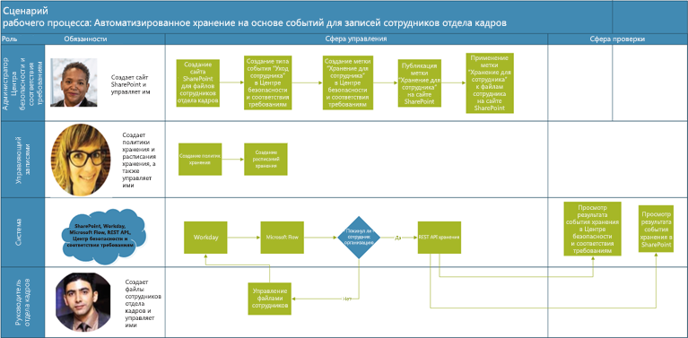
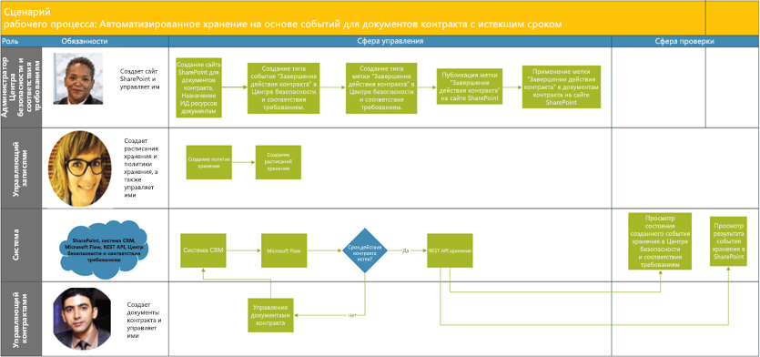

# Автоматизация хранения на основе событийAutomate event-based retention

Процессы развертывания содержимого в организации, а также обнаружения избыточных, устаревших и тривиальных данных играют важную роль. Чтобы продолжать соответствовать юридическим, нормативным и бизнес-требованиям, организации должны обеспечить хранение и защиту важной информации, а также быстрый поиск необходимых данных. Хранение только важной и подходящей информации является ключевым фактором успеха организаций.The explosion of content in organizations and how it can become ROT (redundant, obsolete, trivial) is serious business. To continue to meet legal, business, and regulatory compliance challenges, organizations must be able to keep and protect important information and quickly find what’s relevant. Retaining only important, pertinent information is key to an organization's success.

Чтобы помочь удовлетворить эту потребность, организации могут использовать преимущества решений для хранения в Центре безопасности и соответствия требованиям Office 365. Связанные с хранением операции можно активировать с помощью [меток хранения](labels.md). У метки хранения есть параметр для [определения периода хранения на основе конкретного события](event-driven-retention.md). Обычно период хранения зависит от известной даты, например даты создания или последнего изменения содержимого. Однако у организаций также есть требования по удалению содержимого на основе возникновения событий, например через 7 лет после того, как сотрудник уволился из организации.To help meet this need, organizations can take advantage of retention solutions in the Office 365 Security & Compliance Center. Retention can be triggered by using [retention labels](labels.md). A retention label has the option to [base the retention period on a specific event](event-driven-retention.md). Typically, the retention period is based on a known date, such as the creation date or last modified date for the content. However, organizations also have requirements to dispose of content based on the occurrence of an event, such as seven years after an employee leaves an organization.

Чтобы обеспечить удаление содержимого в соответствии с требованиями, важно знать, когда происходят события. Из-за стремительного роста объема содержимого становится сложно хранить и удалять данные своевременно и в соответствии с требованиями.To ensure compliant disposal of content, it's imperative to know when an event takes place. With the volume of content increasing rapidly, it's becoming challenging to retain and dispose content in a timely and compliant manner.

Хранения на основе событий решает эту проблему. В этой статье описывается, как настроить операции бизнес-процесса, чтобы автоматизировать хранение с помощью событий, используя REST API Microsoft 365.Event-based retention solves this problem. This topic explains how to set up your business process flows to automate retention through events by using the Microsoft 365 REST API.

## О хранении на основе событийAbout event-based retention

Независимо от размера организации количество деловых документов, юридических документов, файлов сотрудников, договоров и документов о продукции, которые ежедневно создаются и которыми необходимо управлять, стремительно растет.An organization can be small, medium, or large. The number of business documents, legal documents, employee files, contracts, and product documents that get created and managed on a day-to-day basis is increasing dramatically.

Например, каждый день десятки и сотни сотрудников устраиваются на работу в организации или увольняются. Отдел кадров постоянно создает, обновляет или удаляет связанные с сотрудниками документы в соответствии с бизнес-требованиями. Этот процесс регулируется различными политиками, определяемыми для компании:For example, each day, tens and hundreds of employees are joining and leaving organizations. The HR department continues to create, update, or delete employee-related documents as per business requirements. This process is subject to the different retention policies outlined for the business:

- **Период хранения содержимого может зависеть от известной даты**, например даты создания, последнего изменения содержимого или присвоения ему метки. Пример: вы можете хранить документы в течение семи лет после создания, а затем удалить их.**The period of retention for content can be a known date** such as the date the content was created, last modified, or labeled. For example, you might retain documents for seven years after they're created and then delete them.

- **Период хранения содержимого может зависеть от неизвестной даты**. Например, с помощью меток хранения можно определять зависимость периода хранения от возникновения определенного типа события, такого как увольнение сотрудника из организации.**The period of retention of content can also be an unknown date**. For example, with retention labels, you can also base a retention period on when a specific type of event occurs, such as an employee leaving the organization.

Событие активирует начало периода хранения, и ко всему содержимому с меткой, относящейся к событию данного типа, применяются действия хранения. Этот процесс называется хранением на основе событий. Дополнительные сведения о нем см. в статье [Общие сведения о хранении, зависящем от возникновения события](event-driven-retention.md).The event triggers the start of the retention period, and all content with a label applied for that type of event get the label's retention actions enforced on them. This is called event-based retention. To learn more, see [Overview of event-driven retention](event-driven-retention.md).

## Настройка хранении на основе событийSet up event-based retention

В этом разделе описываются действия, которые необходимо выполнить до момента подготовки хранения содержимого.This section describes what needs to be done before retaining content.

### Определение ролейIdentify roles

Определите различные роли в организации, которые будут выполнять задачи управления записями и будут обеспечивать эффективное хранение деловых документов.Identify the different roles in an organization that perform Record Management tasks and would be responsible for effective and efficient retention of business documents.

  | **Роль****Persona**| **Role****Role**|
  | - | - |
  | АдминистраторAdmin | Создает типы событий хранения, метки хранения и репозитории записей в SharePointCreates Retention Event types, Retention labels and Record repositories in SharePoint |
  | Управляющий записямиRecords Manager                                  | Предоставляет указания по политикам и расписанию хранения, а также сведения о соответствии требованиямProvides Retention Policies and Retention Schedules guidance and compliance details   |
  | Системный администратор (компания)System Admin (business)                          | Настраивает внешние системы для работы с Microsoft 365 и управляет имиSets up and manages external systems to work with Microsoft 365                       |
  | Информационный работникInformation Worker                               | Управляет жизненным циклом своих бизнес-процессов (отдела кадров, финансового отдела, ИТ-отдела и т. д.)Manages the lifecycle of their business process (HR, Finance, IT, and so on)                 |

### Настройка Центра безопасности и соответствия требованиямSet up the Security & Compliance Center
  
1. Администратор соответствия требованиям создает тип события — например, увольняется сотрудник, истекает срок действия договора или завершается производство продуктаCompliance admin creates an event type &ndash; for example, Employee Termination or Contract Expiration or End of Product Manufacturing. (см. пошаговое описание процесса в статье [Хранение на основе событий](event-driven-retention.md).(See the step-by-step process in [Event-driven retention](event-driven-retention.md).
    
2. Администратор соответствия требованиям создает метку хранения на основе некоего события и связывает ее с типом события.Compliance admin creates a retention label based on an event and associates the label with an event type.
    
    Существует четыре типа триггеров меток хранения:There are four types of triggers for retention labels:
            
    1. Дата созданияCreate date
                
    2. Дата последнего измененияLast modified
                
    3. Дата метки (когда содержимому была присвоена метка)Label date (when the content was labeled)
                
    4. На основе событияEvent-based
    
3. Администратор соответствия требованиям публикует метку хранения.Compliance admin publishes the retention label.

### Настройка SharePointSet up SharePoint
   
Чтобы создать репозиторий записей, администратор соответствия требованиям выполняет следующие действия:To create a records repository, the compliance admin:

1. Создает сайт SharePoint.Creates a SharePoint site.

2. Выполняет одно из указанных ниже действий:Does one of the following:
        
    - Создает библиотеку SharePoint: задает метку на основе события на уровне библиотеки. Дополнительные сведения см. в разделе "Применение метки хранения по умолчанию ко всему контенту в библиотеке SharePoint, папке или набору документов" [этой статьи](labels.md#applying-a-default-retention-label-to-all-content-in-a-sharepoint-library-folder-or-document-set).Creates a SharePoint library: Set event-based label at the library level. For more information, see [Applying a default retention label to all content in a SharePoint library, folder, or document set](labels.md#applying-a-default-retention-label-to-all-content-in-a-sharepoint-library-folder-or-document-set).
          
    - Настройка набора документов в SharePoint.Sets up a document set in SharePoint. Дополнительные сведения см. в статье [Общие сведения о наборах документов](https://support.office.com/article/3DBCD93E-0BED-46B7-B1BA-B31DE2BCD234).For more information, see [Introduction to document sets](https://support.office.com/article/3DBCD93E-0BED-46B7-B1BA-B31DE2BCD234).
      
3. Назначает ИД ресурса для каждого набора документов сотрудников.Assigns an asset ID to each employee document set. ИД ресурса — это наименование продукта или код, который используется организацией, например код сотрудника может быть кодом ресурса.An asset ID is a product name or code used by the organization, for example, Employee number can be an asset ID. При назначении ИД ресурса папке, каждый элемент в этой папке автоматически наследует тот же самый ИД ресурса.By assigning the asset ID to the folder, every item in that folder automatically inherits the same asset ID. Это означает, что срок хранения всех элементов может быть вызван тем же событием.This means all the items can have their retention period triggered by the same event.

## Способы запуска хранения на основе событияWays to trigger event-based retention

Существует два способа запуска хранения на основе события:There are two ways in which event-based retention can be triggered:

- \*\*Использование пользовательского интерфейса центра администрирования \*\* С помощью этого процесса можно уменьшить объем содержимого, сохраняемого за один раз, или запускать хранение реже, например, раз в месяц или раз в год.**Using the admin center UI** This is a process that can be used to retain less content at a time or the frequency to trigger retention isn't often, such as monthly or yearly. Дополнительные сведения об использовании этого метода см. в статье [Обзор хранения на основе события](event-driven-retention.md).For more information about this method, see [Overview of event-driven retention](event-driven-retention.md). Тем не менее, этот способ запуска хранения может потребовать значительных временных затрат и подвержен ошибкам, что препятствует масштабированию.However, this method of triggering retention can be time consuming and prone to error, thus stunting scalability. Таким образом, автоматизированное беспрепятственное решение для запуска хранения может повысить безопасность и улучшить соответствие требованиям в отношении данных.Therefore, an automated, seamless solution to trigger retention can enhance data security and compliance.

- **С помощью REST API M365.** Этот процесс можно использовать для хранения большого объема данных и/или в случае частой активации хранения (каждый день или каждую неделю). Этот процесс определяет, когда событие возникает в вашей бизнес-системе, и автоматически создает связанное событие в Центре безопасности и соответствия требованиям. Вам не нужно вручную создавать связанное событие в пользовательском интерфейсе каждый раз, когда происходит исходное событие.**Using a M365 REST API** This process can be used when large amounts of content are to be retained at a time and/or the frequency to trigger retention is often such as daily or weekly. The flow detects when an event occurs in your line-of-business system, and then automatically creates a related event in the Security & Compliance Center. You don't need to manually create an event in the UI each time one occurs.

Существует два способа использования REST API:There are two options for using the REST API:

- **Microsoft Flow или подобное приложение** можно использовать для автоматического запуска события.**Microsoft Flow or a similar application** can be used to trigger the occurrence of an event automatically. Microsoft Flow является оркестратором подключения к другим системам.Microsoft Flow is an orchestrator for connecting to other systems. Использование Microsoft Flow не требует настраиваемого решения.Using Microsoft Flow doesn't require a custom solution.

- **PowerShell или HTTP-клиент для вызова REST API**. Используйте PowerShell (версии 6 или выше) для вызова REST API Microsoft 365, чтобы создать события.**PowerShell or an HTTP client to call REST API** Using PowerShell (version 6 or higher) to call Microsoft 365 REST API to create events. 

Rest API — это конечная точка службы, поддерживающая наборы операций HTTP (методов), которые обеспечивают создание / получение / обновление / удаление доступа к ресурсам службы.A Rest API is a service endpoint that supports sets of HTTP operations (methods), which provide create/retrieve/update/delete access to the service's resources. Дополнительные сведения см. в статье [Компоненты запросов и ответов REST API](https://docs.microsoft.com/rest/api/gettingstarted/#components-of-a-rest-api-requestresponse).For more information, see [Components of a REST API request/response](https://docs.microsoft.com/rest/api/gettingstarted/#components-of-a-rest-api-requestresponse). В этом случае с помощью REST API Microsoft 365 можно создавать и получать события, используя операции (методы) POST и GET.In this case, by using the Microsoft 365 REST API, events can be created and retrieved using operations (methods) POST and GET.

## Примеры сценариевExample scenarios

Давайте рассмотрим следующие сценарии.Let’s consider the following scenarios.

### Сценарий 1. Сотрудники увольняются из организацииScenario 1: Employees leaving the organization 

В организации создается и хранится множество документов, связанных с сотрудниками, для каждого сотрудника.An organization creates and stores numerous employee-related documents per employee. Эти документы управляются и сохраняются в течение работы в организации каждого сотрудника.These documents are managed and retained during the employment of each employee. Тем не менее, когда работник покидает организацию или в случае его увольнения, организация обязана в соответствии с требованиями законодательства и бизнеса сохранять документы этого работника в течение определенного периода времени.However, when the employee leaves the organization or the employment is terminated, the organization is obligated by legal and business requirements to retain the documents of that employee for a stipulated period.

Если из организации ежедневно увольняется несколько сотрудников, необходимо запускать счетчики хранения сотен или даже тысяч документов каждый день.Now if multiple employees leave the organization every day, the organization must trigger the retention clock of hundreds if not thousands of documents each day.

Кроме того, для каждого сотрудника период хранения рассчитывается на основе типа записи сотрудника (дата увольнения сотрудника + количество дней, месяцев или лет).In addition to this, the retention period needs to be calculated for each of these employees as Employee termination date + number of days, months, or years based on the type of the employee record. Например, у документов о зарплате и документов о премии одного и того же сотрудника могут быть разные периоды хранения.For example, worker’s compensation of the employee vs. benefits filings of the same employee may need different retention.

На схеме далее показано, как может существовать несколько меток, связанных с одним событием.The diagram below shows how there can be multiple labels that are associated with a single event. Здесь все файлы под меткой “Компенсации работника” и все файлы под меткой “Льготы сотрудников” связаны с одним событием — уход сотрудника из организации.Here all the files under Worker’s compensation label and all the files under Employee benefits label are both associated with a single event, which is the employee leaving the organization. Каждый из этих различных файлов имеет различные счетчики хранения.Each of these different files has different retention clocks. Таким образом, когда сотрудник покидает организацию, эти файлы под каждой меткой имеют различный срок хранения.So, when an employee leaves the organization, these files within each label experience a different retention period. Запуск всех этих разных счетчиков хранения для каждого типа файла или метки для каждого сотрудника является очень сложной задачей.Triggering all these different retention clocks for each file type or label for each employee is a very challenging task. Представьте, что это необходимо выполнить для нескольких сотрудников.Imagine doing this for multiple employees.

Поэтому автоматизированный процесс запуска всех этих различных счетчиков хранения для нескольких сотрудников должен работать быстро, быть безошибочным и очень эффективным.Hence an automated process to trigger these different retention clocks for multiple employees will be time-saving, error-free, and extremely efficient.

**Настройка автоматизированного хранения на основе событий для этого сценария:****Configuring Automated Event Based Retention for this scenario:**

  - Администратор создает папки сотрудников в наборе документов, например "Евгения Артемьева", "Артем Кузнецов".Admin creates employee folders to the Document set such as Jane Doe, John Smith.

  - Администратор добавляет в каждую папку файлы сотрудников, например с данными о премиях и зарплате.Admin adds employee files such as Benefits, Payroll, Worker’s Compensation to each employee folder.

  - Администратор назначает идентификатор ресурса для каждой папки сотрудников.Admin assigns Asset ID to each employee folder. 

  - Администратор Центра безопасности и соответствия требованиям выполняет вход в Центр безопасности и соответствия требованиям.SCC Admin logs into the Security & Compliance Center.

  - Администратор безопасности и соответствия требованиям создает типы событий, связанные с сотрудником, например "Увольнение сотрудника" и "Прием сотрудника на работу".SCC Admin creates employee-related events types such as “Employee Termination”, “Employee Hire” events.

  - Администратор безопасности и соответствия требованиям создает метку "Хранение для сотрудника".SCC Admin creates “Employee Retention” label.

  - Эта метка "Хранение для сотрудника" публикуется и вручную или автоматически применяется к файлам сотрудника в SharePointThis “Employee Retention” label is published and applied manually or automatically to the employee files in SharePoint.

  - Система управления отдела кадров, например Workday, может работать совместно с Microsoft Flow для периодического управления файлами сотрудниковHR Management System like Workday can work with Microsoft Flow to run periodically to manage employee files.

  - Если сотрудник увольняется из организации, Flow активирует REST API хранения на основе событий M365, который запустит счетчик хранения для файлов определенного сотрудника.If an employee has left the organization, the Flow will trigger the M365 Event Based Retention REST API that will begin the retention clock on the specific employee’s files.

#### Использование Microsoft FlowUsing Microsoft Flow

Шаг 1. Создайте процесс создания события с помощью REST API Microsoft 365Step 1- Create a flow to create an event using the Microsoft 365 REST API

##### Создание событияCreate an event

Пример кода для вызова REST APISample code to call the REST API

<table>
<thead>
<tr class="header">
<th>МетодMethod</th>
<th>POSTPOST</th>
<th></th>
</tr>
</thead>
<tbody>
<tr class="odd">
<td>URL-адресURL</td>
<td>https://ps.compliance.protection.outlook.com/psws/service.svc/ComplianceRetentionEvent</td>
<td></td>
</tr>
<tr class="even">
<td>ЗаголовкиHeaders</td>
<td>Content-TypeContent-Type</td>
<td>приложение/atom+xmlapplication/atom+xml</td>
</tr>
<tr class="odd">
<td>Основной текстBody</td>
<td>
&lt;?xml version='1.0' encoding='utf-8' standalone='yes'?&gt;&lt;?xml version='1.0' encoding='utf-8' standalone='yes'?&gt;

&lt;entry xmlns:d='https://schemas.microsoft.com/ado/2007/08/dataservices'&lt;entry xmlns:d='https://schemas.microsoft.com/ado/2007/08/dataservices'

xmlns:m='https://schemas.microsoft.com/ado/2007/08/dataservices/metadata'xmlns:m='https://schemas.microsoft.com/ado/2007/08/dataservices/metadata'

xmlns='https://www.w3.org/2005/Atom'&gt;xmlns='https://www.w3.org/2005/Atom'&gt;

&lt;category scheme='https://schemas.microsoft.com/ado/2007/08/dataservices/scheme' term='Exchange.ComplianceRetentionEvent' /&gt;&lt;category scheme='https://schemas.microsoft.com/ado/2007/08/dataservices/scheme' term='Exchange.ComplianceRetentionEvent' /&gt;

&lt;updated&gt;9/9/2017 10:50:00 PM&lt;/updated&gt;&lt;updated&gt;9/9/2017 10:50:00 PM&lt;/updated&gt;

&lt;content type='application/xml'&gt;&lt;content type='application/xml'&gt;

&lt;m:properties&gt;&lt;m:properties&gt;

&lt;d:Name&gt;Employee Termination &lt;/d:Name&gt;&lt;d:Name&gt;Employee Termination &lt;/d:Name&gt;

&lt;d:EventType&gt;99e0ae64-a4b8-40bb-82ed-645895610f56&lt;/d:EventType&gt;&lt;d:EventType&gt;99e0ae64-a4b8-40bb-82ed-645895610f56&lt;/d:EventType&gt;

&lt;d:SharePointAssetIdQuery&gt;1234&lt;/d:SharePointAssetIdQuery&gt;&lt;d:SharePointAssetIdQuery&gt;1234&lt;/d:SharePointAssetIdQuery&gt;

&lt;d:EventDateTime&gt;2018-12-01T00:00:00Z &lt;/d:EventDateTime&gt;&lt;d:EventDateTime&gt;2018-12-01T00:00:00Z &lt;/d:EventDateTime&gt;

&lt;/m:properties&gt;&lt;/m:properties&gt;

&lt;/content&gt;&lt;/content&gt;

&lt;/entry&gt;&lt;/entry&gt;
</td>
<td></td>
</tr>
<tr class="even">
<td>Проверка подлинностиAuthentication</td>
<td>БазоваяBasic</td>
<td></td>
</tr>
<tr class="odd">
<td>Имя пользователяUsername</td>
<td>"Complianceuser"“Complianceuser”</td>
<td></td>
</tr>
<tr class="even">
<td>ПарольPassword</td>
<td>"Compliancepassword"“Compliancepassword”</td>
<td></td>
</tr>
</tbody>
</table>

##### Доступные параметрыAvailable parameters

<table>
<thead>
<tr class="header">
<th><strong>Параметры</strong><strong>Parameters</strong></th>
<th><strong>Описание</strong><strong>Description</strong></th>
<th><strong>Примечания</strong><strong>Notes</strong></th>
</tr>
</thead>
<tbody>
<tr class="odd">
<td>&lt;d:Name&gt;&lt;/d:Name&gt;&lt;d:Name&gt;&lt;/d:Name&gt;</td>
<td>Указание уникального имени события.Provide a unique name for the event,</td>
<td>Не может содержать начальные и конечные пробелы и следующие символы: % \* \ &amp; &lt; &gt; | # ? , : ;Cannot contain trailing spaces, and the following characters: % \* \ &amp; &lt; &gt; | # ? , : ;</td>
</tr>
<tr class="even">
<td>&lt;d:EventType&gt;&lt;/d:EventType&gt;&lt;d:EventType&gt;&lt;/d:EventType&gt;</td>
<td>Введите название типа события (или Guid).Enter event type name (or Guid),</td>
<td>Пример: "Увольнение сотрудника". Тип события должен быть связан с меткой хранения.Example: “Employee termination”. Event type has to be associated with a retention label.</td>
</tr>
<tr class="odd">
<td>&lt;d:SharePointAssetIdQuery&gt;&lt;/d:SharePointAssetIdQuery&gt;&lt;d:SharePointAssetIdQuery&gt;&lt;/d:SharePointAssetIdQuery&gt;</td>
<td>Введите "ComplianceAssetId:" + код сотрудникаEnter “ComplianceAssetId:” + employee Id</td>
<td>Пример: &quot;ComplianceAssetId:12345&quot;Example:&quot;ComplianceAssetId:12345&quot;</td>
</tr>
<tr class="even">
<td>&lt;d:EventDateTime&gt;&lt;/d:EventDateTime&gt;&lt;d:EventDateTime&gt;&lt;/d:EventDateTime&gt;</td>
<td>Дата и время событияEvent Date and Time</td>
<td>
Формат: ГГГГ-ММ-ДДTчч:мм:ссZ. Пример:Format: yyyy-MM-ddTHH:mm:ssZ, Example:

2018-12-01T00:00:00Z2018-12-01T00:00:00Z
</td>
</tr>
</tbody>
</table>

##### Коды ответаResponse codes

| **Код ответа****Response Code** | **Описание****Description**       |
| ----------------- | --------------------- |
| 302302               | ПеренаправлениеRedirect              |
| 201201               | СозданоCreated               |
| 403403               | Сбой авторизацииAuthorization Failed  |
| 401401               | Сбой проверки подлинностиAuthentication Failed |

##### Получение событий на основе диапазона времениGet Events based on time range

<table>
<thead>
<tr class="header">
<th>МетодMethod</th>
<th>GETGET</th>
<th></th>
</tr>
</thead>
<tbody>
<tr class="odd">
<td>URL-адресURL</td>
<td><ol start="4" type="1">
<li>
https://ps.compliance.protection.outlook.com/psws/service.svc/ComplianceRetentionEvent?BeginDateTime=2019-01-11&amp;EndDateTime=2019-01-16https://ps.compliance.protection.outlook.com/psws/service.svc/ComplianceRetentionEvent?BeginDateTime=2019-01-11&amp;EndDateTime=2019-01-16
</li>
</ol></td>
<td></td>
</tr>
<tr class="even">
<td>ЗаголовкиHeaders</td>
<td>Content-TypeContent-Type</td>
<td>приложение/atom+xmlapplication/atom+xml</td>
</tr>
<tr class="odd">
<td></td>
<td></td>
<td></td>
</tr>
<tr class="even">
<td>Проверка подлинностиAuthentication</td>
<td>БазоваяBasic</td>
<td></td>
</tr>
<tr class="odd">
<td>Имя пользователяUsername</td>
<td>"Complianceuser"“Complianceuser”</td>
<td></td>
</tr>
<tr class="even">
<td>ПарольPassword</td>
<td>"Compliancepassword"“Compliancepassword”</td>
<td></td>
</tr>
</tbody>
</table>

##### Коды ответаResponse codes

| **Код ответа****Response Code** | **Описание****Description**                   |
| ----------------- | --------------------------------- |
| 200200               | Все в порядке, список событий в формате atom+xmlOK, A list of events in atom+ xml |
| 404404               | Не найденоNot found                         |
| 302302               | ПеренаправлениеRedirect                          |
| 401401               | Сбой авторизацииAuthorization Failed              |
| 403403               | Сбой проверки подлинностиAuthentication Failed             |

##### Получение события по идентификаторуGet an event by ID

| МетодMethod         | GETGET   |                      |
| -------------- | ------------------------------------------------------------------------------------------------------------------------------------------------------------------------------------------------------------------------------------------------------------------ | -------------------- |
| URL-адресURL            | [https://ps.compliance.protection.outlook.com/psws/service.svc/ComplianceRetentionEvent(‘174e9a86-74ff-4450-8666-7c11f7730f66’)](https://ps.compliance.protection.outlook.com/psws/service.svc/ComplianceRetentionEvent\('174e9a86-74ff-4450-8666-7c11f7730f66'\))[https://ps.compliance.protection.outlook.com/psws/service.svc/ComplianceRetentionEvent(‘174e9a86-74ff-4450-8666-7c11f7730f66’)](https://ps.compliance.protection.outlook.com/psws/service.svc/ComplianceRetentionEvent\('174e9a86-74ff-4450-8666-7c11f7730f66'\)) |                      |
| ЗаголовокHeader         | Content-TypeContent-Type                                                                                                                                                                                                                                                       | приложение/atom+xmlapplication/atom+xml |
| Проверка подлинностиAuthentication | БазоваяBasic                                                                                                                                                                                                                                                              |                      |
| Имя пользователяUsername       | "Complianceuser"“Complianceuser”                                                                                                                                                                                                                                                   |                      |
| ПарольPassword       | "Compliancepassword"“Compliancepassword”                                                                                                                                                                                                                                               |                      |

##### Коды ответаResponse codes

| **Код ответа****Response Code** | **Описание****Description**                                      |
| ----------------- | ---------------------------------------------------- |
| 200200               | Все в порядке, текст ответа содержит событие в формате atom+xmlOK, The response body contains the event in atom+xml |
| 404404               | Не найденоNot found                                            |
| 302302               | ПеренаправлениеRedirect                                             |
| 401401               | Сбой авторизацииAuthorization Failed                                 |
| 403403               | Сбой проверки подлинностиAuthentication Failed                                |

##### Получение события по имениGet an event by name

| МетодMethod         | GETGET       |                      |
| -------------- | -------------------------------------------------------------------------------------------------------------------------------------------- | -------------------- |
| URL-адресURL            | <https://ps.compliance.protection.outlook.com/psws/service.svc/ComplianceRetentionEvent('EventByRESTPost-2226bfebcc2841a8968ba71f9516b763')> |                      |
| ЗаголовкиHeaders        | Content-TypeContent-Type                                                                                                                                 | приложение/atom+xmlapplication/atom+xml |
| Проверка подлинностиAuthentication | БазоваяBasic                                                                                                                                        |                      |
| Имя пользователяUsername       | "Complianceuser"“Complianceuser”                                                                                                                             |                      |
| ПарольPassword       | "Compliancepassword"“Compliancepassword”                                                                                                                         |                      |

##### Коды ответаResponse codes

| **Код ответа****Response Code** | **Описание****Description**                                      |
| ----------------- | ---------------------------------------------------- |
| 200200               | Все в порядке, текст ответа содержит событие в формате atom+xmlOK, The response body contains the event in atom+xml |
| 404404               | Не найденоNot found                                            |
| 302302               | ПеренаправлениеRedirect                                             |
| 401401               | Сбой авторизацииAuthorization Failed                                 |
| 403403               | Сбой проверки подлинностиAuthentication Failed                                |

#### Использование PowerShell (версии 6 или выше) или любого HTTP-клиентаUsing PowerShell (ver.6 or higher) or any HTTP client

Шаг 1. Подключитесь к PowerShell.Step 1: Connect to PowerShell.

Шаг 2. Запустите указанный ниже сценарий.Step 2: Run the following script.

<table>
<tbody>
<tr class="odd">
<td>
param([string]$baseUri)param([string]$baseUri)

$userName = &quot;UserName&quot;$userName = &quot;UserName&quot;

$password = &quot;Password&quot;$password = &quot;Password&quot;

$securePassword = ConvertTo-SecureString $password -AsPlainText -Force$securePassword = ConvertTo-SecureString $password -AsPlainText -Force

$credentials = New-Object System.Management.Automation.PSCredential($userName, $securePassword)$credentials = New-Object System.Management.Automation.PSCredential($userName, $securePassword)

$EventName=&quot;EventByRESTPost-$(([Guid]::NewGuid()).ToString('N'))&quot;$EventName=&quot;EventByRESTPost-$(([Guid]::NewGuid()).ToString('N'))&quot;

Write-Host &quot;Start to create an event with name: $EventName&quot;Write-Host &quot;Start to create an event with name: $EventName&quot;

$body = &quot;&lt;?xml version='1.0' encoding='utf-8' standalone='yes'?&gt;$body = &quot;&lt;?xml version='1.0' encoding='utf-8' standalone='yes'?&gt;

&lt;entry xmlns:d='https://schemas.microsoft.com/ado/2007/08/dataservices'&lt;entry xmlns:d='https://schemas.microsoft.com/ado/2007/08/dataservices'

xmlns:m='https://schemas.microsoft.com/ado/2007/08/dataservices/metadata'xmlns:m='https://schemas.microsoft.com/ado/2007/08/dataservices/metadata'

xmlns='https://www.w3.org/2005/Atom'&gt;xmlns='https://www.w3.org/2005/Atom'&gt;

&lt;category scheme='https://schemas.microsoft.com/ado/2007/08/dataservices/scheme' term='Exchange.ComplianceRetentionEvent' /&gt;&lt;category scheme='https://schemas.microsoft.com/ado/2007/08/dataservices/scheme' term='Exchange.ComplianceRetentionEvent' /&gt;

&lt;updated&gt;7/14/2017 2:03:36 PM&lt;/updated&gt;&lt;updated&gt;7/14/2017 2:03:36 PM&lt;/updated&gt;

&lt;content type='application/xml'&gt;&lt;content type='application/xml'&gt;

&lt;m:properties&gt;&lt;m:properties&gt;

&lt;d:Name&gt;$EventName&lt;/d:Name&gt;&lt;d:Name&gt;$EventName&lt;/d:Name&gt;

&lt;d:EventType&gt;e823b782-9a07-4e30-8091-034fc01f9347&lt;/d:EventType&gt;&lt;d:EventType&gt;e823b782-9a07-4e30-8091-034fc01f9347&lt;/d:EventType&gt;

&lt;d:SharePointAssetIdQuery&gt;'ComplianceAssetId:123'&lt;/d:SharePointAssetIdQuery&gt;&lt;d:SharePointAssetIdQuery&gt;'ComplianceAssetId:123'&lt;/d:SharePointAssetIdQuery&gt;

&lt;/m:properties&gt;&lt;/m:properties&gt;

&lt;/content&gt;&lt;/content&gt;

&lt;/entry&gt;&quot;&lt;/entry&gt;&quot;

$event = $null$event = $null

trytry

{{

$event = Invoke-RestMethod -Body $body -Method 'POST' -Uri &quot;$baseUri/ComplianceRetentionEvent&quot; -ContentType &quot;application/atom+xml&quot; -Authentication Basic -Credential $credentials -MaximumRedirection 0$event = Invoke-RestMethod -Body $body -Method 'POST' -Uri &quot;$baseUri/ComplianceRetentionEvent&quot; -ContentType &quot;application/atom+xml&quot; -Authentication Basic -Credential $credentials -MaximumRedirection 0

}}

catchcatch

{{

$response = $_.Exception.Response$response = $_.Exception.Response

if($response.StatusCode -eq &quot;Redirect&quot;)if($response.StatusCode -eq &quot;Redirect&quot;)

{{

$url = $response.Headers.Location$url = $response.Headers.Location

Write-Host &quot;redirected to $url&quot;Write-Host &quot;redirected to $url&quot;

$event = Invoke-RestMethod -Body $body -Method 'POST' -Uri $url -ContentType &quot;application/atom+xml&quot; -Authentication Basic -Credential $credentials -MaximumRedirection 0$event = Invoke-RestMethod -Body $body -Method 'POST' -Uri $url -ContentType &quot;application/atom+xml&quot; -Authentication Basic -Credential $credentials -MaximumRedirection 0

}}

}}

$event | fl \*$event | fl \*
</td>
</tr>
</tbody>
</table>

#### Проверка результатов обоих вариантовVerify the outcome in both options

Шаг 1. Перейдите в Центр безопасности и соответствия требованиям.Step 1: Go to the Security & Compliance Center.

Шаг 2. Выберите **События** в разделе **Управление информацией**.Step 2: Select **Events** under **Information governance**.

Шаг 3. Убедитесь, что событие создано.Step 3: Verify Event has been created.

Аналогичным образом описанные выше варианты автоматизации хранения на основе событий можно использовать и для следующих сценариев.Similarly, the above options to automate event-based retention can be used for the following scenarios as well.

### Сценарий 2. Окончание действия договоровScenario 2: Contracts Expiring

Организация может иметь несколько записей для одного договора с клиентами, поставщиками и партнерами.An organization can have multiple records for a single contract with customers, vendors, and partners. Эти документы можно хранить в библиотеке документов, например в SharePoint.These documents can reside in a document library like SharePoint. Окончание договора определяет начало срока хранения документов, связанных с договором.The end of a contract determines the start of the retention period of the documents associated with the contract. Например, все записи, связанные с договорами, нужно хранить в течение пяти лет с момента истечения срока действия договора.For example, all records related to contracts need to be retained for five years from the time the contract expires. Событием, активирующим пятилетнее хранение, будет окончание срока действия договора.The event that triggers the five-year retention period is the expiration of the contract.

Система управления отношениями с клиентами может работать совместно с Microsoft 365 и активировать хранение документов договора.A Customer Relationship Management (CRM) system can work with Microsoft 365 and trigger retention of Contract documents

**Настройка автоматизированного хранения на основе событий для этого сценария:****Configuring Automated Event Based Retention for this scenario:**

  - Администратор создает библиотеку SharePoint с различными папками для каждого типа договора.Admin creates a SharePoint library with various folders for each contract type.

  - Администратор добавляет файлы договора, например лицензионные соглашения, договоры о разработке, в папку каждого договора.Admin adds contract files such as License Contracts, Development Contracts to each contract folder.

  - Администратор назначает идентификатор ресурса для каждой папки договора.Admin assigns Asset ID to each contract folder.

  - Администратор Центра безопасности и соответствия требованиям выполняет вход в Центр безопасности и соответствия требованиям.SCC Admin logs into the Security & Compliance Center.

  - Администратор безопасности и соответствия требованиям создает типы событий, связанные с договором, например "Создание договора" и "Завершение действия договора".SCC Admin creates contract-related events types such as “Contract Creation”, “Contract Expiration” events.

  - Администратор безопасности и соответствия требованиям создает метку "Завершение действия договора".SCC Admin creates “Contract Expiration” label.

  - Эта метка "Завершение действия договора" публикуется и вручную или автоматически применяется к файлам договора в SharePointThis “ Contract Expiration” label is published and applied manually or automatically to the contract files in SharePoint.

  - Система управления договорами может работать совместно с Microsoft Flow или аналогичным приложением для периодического управления файлами договоров.Contract Management System can work with Microsoft Flow or a similar application to run periodically to manage contract files.

  - Если срок действия договора завершается, Microsoft Flow активирует REST API хранения на основе событий M365, который запустит счетчик хранения для файлов определенного договора.If a contract expires, Microsoft Flow will trigger the M365 Event Based Retention REST API that will begin the retention clock on the specific contract’s files.

### Сценарий 3. Прекращение производства продуктаScenario 3: End of Product Manufacturing

Производственная компания, которая изготавливает различные линейки продуктов, создает множество документов с техническими характеристиками производства и ценами. Если продукт перестает производится, все технические характеристики и документы, связанные с этим продуктом, следует хранить в течение определенного периода времени после окончания существования продукта.A manufacturing company that produces different lines of products creates many manufacturing specifications and pricing documents. When the product is no longer manufactured, all specifications and documents linked to this product need to be retained for a specific period after the end of the lifetime of the product.

Система планирования ресурсов предприятия (ERP) может работать совместно с Microsoft 365 и Microsoft Flow для активации хранения.An Enterprise Resource Planning (ERP) system can work with Microsoft 365 and Microsoft Flow to trigger retention.

**Настройка автоматизированного хранения на основе событий для этого сценария:****Configuring Automated Event Based Retention for this scenario:**

  - Администратор создает папки продуктов в наборе документов, например "Продукт 1", "Продукт 2" и т. д.Admin creates product folders in the Document set such as Product 1, Product 2, and so on.

  - Администратор добавляет файлы продуктов, например технические характеристики производства, цены продуктов и лицензирование продуктов, в каждую папку продукта.Admin adds product files such as Manufacturing Specifications, Product Pricing, Product licensing to each product folder.

  - Администратор назначает ИД ресурса для каждой папки продукта.Admin assigns Asset ID to each product folder.

  - Администратор Центра безопасности и соответствия требованиям выполняет вход в Центр безопасности и соответствия требованиям.SCC Admin logs into the Security & Compliance Center.

  - Администратор безопасности и соответствия требованиям создает типы событий, связанные с сотрудником, например "Начало производства продукта" и "Окончание производства продукта".SCC Admin creates employee-related events types such as “Start of Product Manufacturing”, “End of Product Manufacturing” events.

  - Администратор безопасности и соответствия требованиям создает метку "Окончание производства продукта".SCC Admin creates “End of Product Manufacturing” label.

  - Эта метка "Завершение изготовление продукта" публикуется и вручную или автоматически применяется к файлам продукта в SharePoint.This “ End of Product Manufacturing” label is published and applied manually or automatically to the product files in SharePoint.

  - Система ERP может работать совместно с Microsoft Flow или аналогичным приложением для периодического управления файлами продуктов.ERP Systems can work with Microsoft Flow or similar applications to run periodically to manage product files.

  - Если изготовление продукта завершается, Microsoft Flow активирует REST API хранения на основе событий M365, который запустит счетчик хранения для файлов определенного продукта.If the manufacturing of a product ends, Microsoft Flow will trigger the M365 Event Based Retention REST API that will begin the retention clock on the specific product’s files.

## ПриложениеAppendix

### Использование результатов ответа 302 (перенаправление) для вызова REST APIUsing Redirect 302 response results to call the REST API

1. Вызовите событие хранения POST с помощью URL-адреса REST API <https://ps.compliance.protection.outlook.com/psws/service.svc/ComplianceRetentionEvent> (требуются разрешения глобального администратора)Invoke a POST retention event call using the REST API URL <https://ps.compliance.protection.outlook.com/psws/service.svc/ComplianceRetentionEvent> (Global Admin permissions are required)

2. Проверьте код ответа. Если получен код 302, получите URL-адрес перенаправления из свойства Location (Расположение) заголовка ответаCheck the response code. If it’s 302, then get the redirected URL from Location property of the response header

3. Вызовите событие хранения POST еще раз с помощью URL-адреса перенаправленияInvoke the POST retention event call again using the redirected URL.

## Сведения об авторахCredits

Редактор статьи:This topic was reviewed by:

Antonio MaioAntonio Maio MVP в сфере приложений и служб Microsoft OfficeMicrosoft Office Apps and Services MVP  Antonio.Maio@Protiviti.comAntonio.Maio@Protiviti.com
