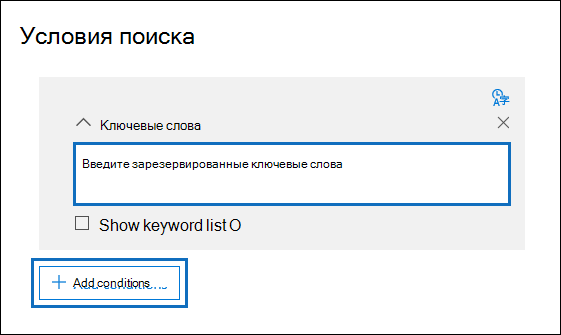

# Создание запросов на поисковые коллекции в Advanced eDiscoveryBuild search collection queries in Advanced eDiscovery

При создании поисковых запросов для сбора данных в расширенном случае обнаружения электронных данных можно использовать ключевые слова для поиска определенного содержимого и условий, чтобы сузить область поиска для возврата элементов, наиболее релевантных для вашего судебного разбирательства.When building search queries to collect data in an Advanced eDiscovery case, you can use keywords to find specific content and conditions to narrow the scope of the search to return items that are most relevant to your legal investigation.

## Поиск по ключевым словамKeyword searches

Введите запрос ключевого слова в поле **Ключевые слова** в запросе поиска.Type a keyword query in the **Keywords** box in the search query. Можно указать ключевые слова, свойства сообщений электронной почты, такие как даты отправки и получения, а также свойства документа, такие как имена файлов или Дата последнего изменения документа.You can specify keywords, email message properties, such as sent and received dates, or document properties, such as file names or the date that a document was last changed. Можно создавать более сложные запросы, включающие логические операторы, например **AND**, **OR**, **NOT** и **NEAR**.You can use more complex queries that use a Boolean operator, such as **AND**, **OR**, **NOT**, and **NEAR**. Кроме того, можно искать конфиденциальные сведения (например, номера социального страхования) в документах SharePoint и OneDrive (не в сообщениях электронной почты) или искать документы, к которым предоставлен доступ извне.You can also search for sensitive information (such as social security numbers) in documents in SharePoint and OneDrive (not in email messages), or search for documents that have been shared externally. Если оставить поле **Ключевые слова** пустым, то весь контент, расположенный в указанных расположениях контента, будет находиться в результатах поиска.If you leave the **Keywords** box empty, all content located in the specified content locations is in the search results.

## Список ключевых словKeyword list

Кроме того, можно установить флажок **Показать список ключевых слов** и ввести ключевое слово или ключевое слово ключевое слово в каждой строке.Alternatively, you can select the **Show keyword list** check box and the type a keyword or keyword phrase in each row. Ключевые слова в каждой строке соединены логическим оператором (который представляется как *к:с* в синтаксисе поискового запроса), который аналогичен оператору **or** в созданном запросе поиска.The keywords in each row are connected by a logical operator (which is represented as *c:s* in the search query syntax) that is similar in functionality to the **OR** operator in the search query that's created. Это означает, что элементы, содержащие любое ключевое слово в любой строке, находятся в результатах поиска.This means items that contain any keyword in any row are in the search results. Вы можете добавить до 180 строк в список ключевых слов в сложных поисковых запросах на обнаружение электронных данных.You can add up to 180 rows in the keyword list in Advanced eDiscovery search queries.

Зачем использовать список ключевых слов?Why use the keyword list? Вы можете получить статистику по количеству элементов, которые совпадают с каждым ключевым словом в списке ключевых слов.You can get statistics that show how many items match each keyword in the keyword list. Это поможет быстро определить наиболее эффективные (и наименее) Ключевые слова.This can help you quickly identify the keywords that are the most (and least) effective. Кроме того, можно использовать ключевую фразу (заключенную в круглые скобки) в строке в списке ключевых слов.You can also use a keyword phrase (surrounded by parentheses) in a row in the keywords list. Дополнительные сведения о статистике поиска можно найти в статье [Статистика поиска](search-statistics.md).For more information about search statistics, see [Search statistics](search-statistics.md).

## УсловияConditions

Вы можете добавить условия поиска, чтобы сузить область поиска и возвратить более уточненный набор результатов.You can add search conditions to narrow the scope of a search and return a more refined set of results. Каждое условие добавляет предложение к поисковому запросу, которое создается и запускается в начале поиска.Each condition adds a clause to the search query that is created and run when you start the search. Условие логически подключается к запросу ключевого слова, указанному в поле ключевое слово логическим оператором (который представляется как *к:к* в синтаксисе поискового запроса), который похож на функциональность оператора **and** .A condition is logically connected to the keyword query specified in the keyword box by a logical operator (which is represented as *c:c* in the search query syntax) that is similar in functionality to the **AND** operator. Это означает, что элементы должны удовлетворять как запрос ключевого слова, так и одно или несколько условий, включаемых в результаты поиска.That means items have to satisfy both the keyword query and one or more conditions to be included in the search results. Таким образом условия помогают сузить область результатов поиска.This is how conditions help to narrow your results. Список и описание условий, которые можно использовать в поисковых запросах, представлены в разделе "условия поиска" в разделе [запросы и условия поиска ключевых слов](keyword-queries-and-search-conditions.md#search-conditions).For a list and description of conditions that you can use in a search query, see the "Search conditions" section in [Keyword queries and search conditions](keyword-queries-and-search-conditions.md#search-conditions).
