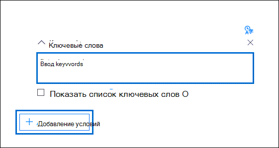

# Создание запросов коллекции поиска в Advanced eDiscovery

При создании поисковых запросов для сбора данных в случае Advanced eDiscovery можно использовать ключевые слова для поиска определенного контента и условий, чтобы сузить область поиска для возврата элементов, наиболее релевантных для расследования.

## Поиск по ключевым словам

Введите запрос ключевого слова в поле **"Ключевые** слова" в поисковом запросе. Можно указать ключевые слова, свойства сообщений электронной почты, например даты отправки и отправки, или свойства документа, например имена файлов или дату последнего изменения документа. Можно создавать более сложные запросы, включающие логические операторы, например **AND**, **OR**, **NOT** и **NEAR**. Вы также можете искать конфиденциальную информацию (например, номера социального страхования) в документах в SharePoint и OneDrive (не в сообщениях электронной почты) или искать документы, к которые был внешний доступ. Если оставить поле **"Ключевые** слова" пустым, весь контент, расположенный в указанных расположениях контента, будет в результатах поиска.

## Список ключевых слов

Кроме того, можно  выбрать в каждой строке список ключевых слов и ввести ключевое слово или ключевое слово. Ключевые слова в каждой строке соединены логическим оператором (который представлен как *c:s* в синтаксис поискового запроса), который по функциональности аналогичен оператору **OR** в созданном поисковом запросе. Это означает, что элементы, содержащие любое ключевое слово в любой строке, находятся в результатах поиска. В поисковых запросах Advanced eDiscovery можно добавить до 180 строк в список ключевых слов.

Зачем использовать список ключевых слов? Вы можете получить статистику, которая показывает, сколько элементов соответствует каждому ключевому слову в списке ключевых слов. Это поможет быстро определить ключевые слова, которые являются наиболее (и наименее) эффективными. Вы также можете использовать ключевое слово (в скобке) в строке в списке ключевых слов. Дополнительные сведения о статистике поиска см. в [статистике поиска.](search-statistics-in-advanced-ediscovery.md)

## Условия

Можно добавить условия поиска, чтобы сузить область поиска и получить более уточненный набор результатов. Каждое условие добавляет предложение к поисковому запросу, которое создается и запускается в начале поиска. Условие логически подключается к запросу ключевого слова, указанному в поле ключевого слова логическим оператором (который представлен как *c:c* в синтаксис поискового запроса), который по функциональности аналогичен оператору **AND.** Это означает, что элементы должны удовлетворять как запросу по ключевому слову, так и одному или одному или одному из условий, которые должны быть включены в результаты поиска. Таким образом условия помогают сузить область результатов поиска. Список и описание условий, которые можно использовать в поисковом запросе, см. в разделе "Условия поиска" в разделе "Запросы по ключевым словам и [условия поиска".](keyword-queries-and-search-conditions.md#search-conditions)
