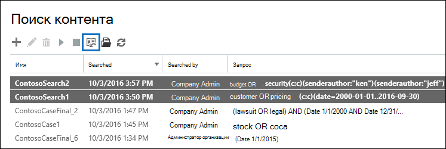

# Массовый редактирование поиска контентаBulk edit Content Searches

Редактор объемного поиска в средстве поиска контента можно использовать для редактирования нескольких поисков одновременно.You can use the Bulk Search Editor in the Content Search tool to edit multiple searches at the same time. С помощью этого средства можно быстро изменить расположение запросов и контента для одного или нескольких поисков.Using this tool lets you quickly change the query and content locations for one or more searches. Затем можно повторно перезахоранить поиск и получить новые предполагаемые результаты поиска для пересмотренных поисков.Then you can rerun the searches and get new estimated search results for the revised searches. Редактор также позволяет скопировать и вклеить запросы и расположения контента из Microsoft Excel или текстового файла.The editor also lets you copy and paste queries and content locations from a Microsoft Excel file or text file. Это означает, что вы можете использовать средство статистики поиска для просмотра статистики одного или нескольких поисков, экспорта статистики в CSV-файл, где можно изменить запросы и расположения контента в Excel.This means you can use the Search Statistics tool to view the statistics of one or more searches, export the statistics to a CSV file, where you can edit the queries and content locations in Excel. Затем с помощью редактора объемного поиска к поискам добавляются пересмотренные запросы и расположения контента.Then you use the Bulk Search Editor to add the revised queries and content locations to the searches. После изменения одного или более поисков можно перезапустить их и получить новые предполагаемые результаты поиска.After you've revised one or more searches, you can restart them and get new estimated search results.
  
Дополнительные сведения об использовании средства статистики поиска см. в статье Просмотр статистики ключевых слов [для результатов поиска контента.](view-keyword-statistics-for-content-search.md)For more information about using the Search Statistics tool, see [View keyword statistics for Content Search results](view-keyword-statistics-for-content-search.md).
  
## Изменение запросов с помощью редактора объемного поискаUse the Bulk Search Editor to change queries

1. Перейдите к [https://protection.office.com](https://protection.office.com) и выберите поиск по  \> **контенту поиска.**Go to [https://protection.office.com](https://protection.office.com), and then select **Search** \> **Content search**.
    
2. В списке поиска выберите один или несколько поисков, а затем выберите кнопку **Редактор** массовой поисковой рассылки. In the list of searches, select one or more searches, and then select **Bulk Search Editor** .
    
    
  
    Следующие сведения отображаются на странице **Запросы** редактора объемного поиска.The following information is displayed on the **Queries** page of the Bulk Search Editor. 
    
    
  
    а.a. В **столбце** Поиск отображается имя поиска контента.The **Search** column displays the name of the Content Search. Как уже говорилось ранее, запрос можно изменить для нескольких поисков.As previously stated, you can edit the query for multiple searches. 
    
    б.b. Столбец **Запрос** отображает запрос для поиска контента, перечисленный в **столбце Поиск.**The **Query** column displays the query for the Content Search listed in the **Search** column. Если запрос был создан с помощью функции списка ключевых слов, ключевые слова разделены текстом \*\* `(c:s)` **. Это означает, что ключевые слова подключены **оператором OR.** Кроме того, если запрос `(c:c)` содержит условия,** ключевые слова и условия разделены текстом \*\* .If the query was created using the keyword list feature, the keywords are separated by the text \*\* `(c:s)`**. This indicates that the keywords are connected by the **OR** operator. Additionally, if the query includes conditions, the keywords and the conditions are separated by the text \*\* `(c:c)`**. Это означает, что ключевые слова (или этапы ключевых слов) подключены к условиям оператора **AND.**This indicates that the keywords (or keyword phases) are connected to the conditions by the **AND** operator. Например, на предыдущем скриншоте для поиска ContosoSearch1 был бы эквивалентный запросу  `customer (c:s) pricing(c:c)(date=2000-01-01..2016-09-30)`  `(customer OR pricing) AND (date=2002-01-01..2016-09-30)` KQL.For example, in the previous screenshot the for search ContosoSearch1, the KQL query that is equivalent to  `customer (c:s) pricing(c:c)(date=2000-01-01..2016-09-30)` would be  `(customer OR pricing) AND (date=2002-01-01..2016-09-30)`.
    
3. Чтобы изменить запрос, выберите в ячейке запроса, который необходимо изменить, и сделать одно из следующих вещей.To edit a query, select in the cell of the query that you want to change and doing one of the following things. Ячейка граничит с синим полем при выборе.The cell is bordered by a blue box when you select it.
    
   - Введите новый запрос в ячейке.Type the new query in the cell. Вы не можете изменить часть запроса.You can't edit a portion of the query. Необходимо ввести весь запрос.You have to type the entire query.
    
      ИлиOr
    
    - Вклейте новый запрос в ячейку.Paste a new query in the cell. Это предполагает, что вы скопировали текст запроса из файла, например текстового файла или Excel файла.This assumes that you've copied the query text from a file, such as a text file or an Excel file.
    
4. После редактирования одного или более запросов на странице **Запросы** выберите **Сохранить**.After you've edited one or more queries on the **Queries** page, select **Save**.
    
    Пересмотренный запрос отображается в столбце **Запрос** для выбранного поиска.The revised query is displayed in the **Query** column for the selected search. 
    
5. Выберите **close** to close the Bulk Search Editor.Select **Close** to close the Bulk Search Editor. 
    
6. На странице **поиска контента** выберите измененный поиск  и выберите Пуск для перезапуска поиска с помощью пересмотренного запроса.On the **Content search** page, select the search that you edited, and select **Start** search to restart the search using the revised query. 
    
Вот несколько советов по редактированию запросов с помощью редактора массовых поисков:Here are some tips for editing queries using the Bulk Search Editor:
  
- Скопируйте существующий запрос (с помощью **Ctrl C)** в текстовый файл.Copy the existing query (by using **Ctrl C** ) to a text file. Изменить запрос в текстовом файле, а затем скопировать пересмотренный запрос и вклеить его (с помощью **Ctrl V)** обратно в ячейку на странице **Запросы.**Edit the query in the text file, and then copy the revised query and paste it (using **Ctrl V** ) back into the cell on the **Queries** page. 
    
- Можно также скопировать запросы из других приложений (например, Microsoft Word или Microsoft Excel).You can also copy queries from other applications (such as Microsoft Word or Microsoft Excel). Однако вы можете случайно добавить неподтверченные символы в запрос с помощью редактора массовых поисков.However, you might inadvertently add unsupported characters to a query using the Bulk Search Editor. Лучший способ предотвратить неподтверченные символы — просто ввести запрос в ячейке на странице **Запросы.**The best way to prevent unsupported characters is to just type the query in a cell on the **Queries** page. Или вы можете скопировать запрос из Word или Excel и вклеить его в файл в обычном текстовом редакторе, например Microsoft Блокнот.Or you can copy a query from Word or Excel and then paste it to file in a plain text editor, such as Microsoft Notepad. После этого сохраните текстовый файл и выберите **ANSI** в раскрывающемся списке **Кодировка**.Then save the text file and select **ANSI** in the **Encoding** drop-down list. Это удаляет любые форматирование и неподтверченные символы.This removes any formatting and unsupported characters. Затем можно скопировать и вклеить запрос из текстового файла на страницу **Запросы.**Then you can copy and paste the query from the text file to the **Queries** page. 
    
  
## Использование редактора массовой поисковой рассылки для изменения расположения контентаUse the Bulk Search Editor to change content locations

1. В редакторе "Массовый поиск" для одного или нескольких выбранных поисков выберите включить редактор с массовым расположением, а затем выберите ссылку **Locations,** отображаемую на странице.In the Bulk Search Editor for one or more selected searches, select **Enable bulk location editor**, and then select the **Locations** link that is displayed on the page. 
    
    Следующие сведения отображаются на странице **Расположения** редактора массовых поисков.The following information is displayed on the **Locations** page of the Bulk Search Editor. 
    
    
  
    а.a. **Почтовые ящики для поиска** В этом разделе отображается столбец для каждого выбранного поиска контента и строка для каждого почтового ящика, включенного в поиск.**Mailboxes to search** This section displays a column for each selected Content Search and a row for each mailbox that's included in the search. На чековом знаке указывается, что почтовый ящик включен в поиск.A check mark indicates that the mailbox is included in the search. Вы можете добавить почтовые ящики в поиск, введя электронный адрес почтового ящика в пустой строке, а затем выбрав поле для поиска контента, в который необходимо добавить его.You can add mailboxes to a search by typing the email address of the mailbox in a blank row and then selecting the check box for the Content Search that you want to add it to. Или вы можете удалить почтовый ящик из поиска путем очистки почтового ящика.Or you can remove a mailbox from a search by clearing the check box.
    
    б.b. **SharePoint сайтов для поиска** В этом разделе отображается строка для каждого SharePoint и OneDrive сайта, включенного в каждый выбранный поиск контента.**SharePoint sites to search** This section displays a row for each SharePoint and OneDrive site that's included in each selected Content Search. На чековом знаке указывается, что сайт включен в поиск.A check mark indicates that the site is included in the search. Вы можете добавить сайты в поиск, введя URL-адрес сайта в пустой строке, а затем выбрав поле для поиска контента, в который необходимо добавить его.You can add sites to a search by typing the URL for the site in a blank row and then selecting the check box for the Content Search that you want to add it to. Или вы можете удалить сайт из поиска, с помощью очистки контрольного окна.Or you can remove a site from a search by clearing the check box.
    
    в.c. **Другие параметры поиска** В этом разделе указывается, включены ли в поиск неиндексуалные элементы и общедоступные папки.**Other search options** This section indicates whether unindexed items and public folders are included in the search. Чтобы включить их, убедитесь, что выбрано поле.To include them, make sure the check box is selected. Чтобы удалить их, снимите чековую шкатулку.To remove them, clear the check box.
    
2. После редактирования одного или нескольких разделов на странице **Расположения** выберите **Сохранить**.After you've edited one or more of the sections on the **Locations** page, select **Save**.
    
    Пересмотренные расположения контента отображаются в соответствующем разделе для выбранных поисков.The revised content locations are displayed in the appropriate section for the selected searches.
    
3. Выберите **close** to close the Bulk Search Editor.Select **Close** to close the Bulk Search Editor. 
    
4. На странице **поиска контента** выберите измененный поиск  и выберите Пуск поиска для перезапуска поиска с помощью пересмотренных местоположений контента.On the **Content search** page, select the search that you edited, and select **Start** search to restart the search using the revised content locations. 
    
Вот несколько советов по редактированию расположения контента с помощью редактора массовых поисков:Here are some tips for editing content locations using the Bulk Search Editor:
  
- Вы можете изменить поиск контента для поиска всех почтовых ящиков или  сайтов в организации, введя все в пустой строке **в** почтовых ящиках для поиска или SharePoint сайтов для поиска и выбора контрольного окна. You can edit Content Searches to search all mailboxes or sites in the organization by typing **All** in a blank row in the **Mailboxes to search** or **SharePoint sites to search** section and then selecting the check box. 
    
- Можно добавить несколько местоположений контента в один или несколько поисков, скопив несколько строк из текстового файла или Excel файла, а затем вклеив их в раздел на странице **Locations.**You can add multiple content locations to one or more searches by copying multiple rows from a text file or an Excel file and then pasting them in a section on the **Locations** page. После добавления новых расположений обязательно выберите для каждого поиска, в который нужно добавить расположение.After you add new locations, be sure to select the check box for each search that you want add the location to. 
    
    > [!TIP]
    > Чтобы создать список адресов электронной почты для всех пользователей в организации, запустите команду PowerShell в шаге 2 на [шаге 2: Создание списка пользователей.](search-the-mailbox-and-onedrive-for-business-for-a-list-of-users.md#step-2-generate-a-list-of-users)To generate a list of email addresses for all the users in your organization, run the PowerShell command in Step 2 in [Step 2: Generate a list of users](search-the-mailbox-and-onedrive-for-business-for-a-list-of-users.md#step-2-generate-a-list-of-users). Или выполните действия в Списке всех [URL OneDrive](/onedrive/list-onedrive-urls) пользователей в организации, чтобы создать список всех OneDrive для бизнеса сайтов в организации.Or follow the steps in [Get a list of all user OneDrive URLs in your organization](/onedrive/list-onedrive-urls) to generate a list of all OneDrive for Business sites in your organization. Обратите внимание, что url-адрес для домена MySite организации (например, для OneDrive для бизнеса сайтов, созданных https://contoso-my.sharepoint.com) по сценарию.Note that you'll have to append the URL for your organization's MySite domain (for example, https://contoso-my.sharepoint.com) to the OneDrive for Business sites that's created by the script. После того как у вас есть список адресов электронной почты или OneDrive для бизнеса сайтов, их можно скопировать и вклеить на страницу **Locations** в редакторе массовых поисков.After you have list of email addresses or OneDrive for Business sites, you can copy and paste them to the **Locations** page in the Bulk Search Editor. 
  
- После выбора **Сохранить для** сохранения изменений в редакторе массовых поисков будет проверен адрес электронной почты для почтовых ящиков, добавленных в поиск.After you select **Save** to save changes in Bulk Search Editor, the email address for mailboxes that you added to a search will be validated. Если адреса электронной почты не существует, отображается сообщение об ошибке, в которое говорится, что почтовый ящик не может быть расположен.If the email address doesn't exist, an error message is displayed saying the mailbox can't be located. URL-адреса для сайтов не проверяются.URLs for sites aren't validated. 
