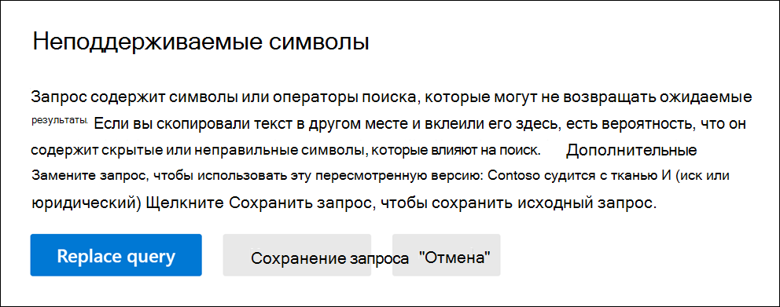

# Проверка запроса веб-части "Поиск контента" на ошибкиCheck your Content Search query for errors
  
Вот список неподтверченных символов, которые мы проверяем.Here's a list of the unsupported characters that we check for. Неподтвердимые символы часто скрыты, и они обычно вызывают ошибку поиска или возвращают непреднамеренные результаты.Unsupported characters are often hidden, and they typically cause a search error or return unintended results.
  
- **Смарт-кавычка** — смарт-одиночные и двойные кавычка (также называемые вьющимися кавычками) не поддерживаются.**Smart quotation marks** - Smart single and double quotation marks (also called curly quotes) aren't supported. В поисковом запросе можно использовать только прямые кавычки.Only straight quotation marks can be used in a search query. 

- **Непечатаемые** символы и символы управления — непечатные и неконтентируемые символы не представляют письменного символа, например альфа-числительный символ.**Non-printable and control characters** - Non-printable and control characters don't represent a written symbol, such as an alpha-numeric character. К непечатаемым и управляющим символам относятся символы, которые форматируют текст или разделяют его на строки.Examples of non-printable and control characters include characters that format text or separate lines of text. 

- **Метки** слева направо и справа налево — это знаки управления, используемые для указания направления текста для языков слева направо (таких как английский и испанский) и справа налево (например, арабского и иврита).**Left-to-right and right-to-left marks** - These marks are control characters used to indicate text direction for left-to-right languages (such as English and Spanish) and right-to-left languages (such as Arabic and Hebrew).

- **Операторы lowercase Boolean** . Если вы используете оператора Boolean,  например **AND,** **OR,** и не в запросе поиска, он должен быть верхним шкафом.**Lowercase Boolean operators** - If you use a Boolean operator, such as **AND**, **OR**, and **NOT** in a search query, it must be uppercase. При проверке запроса на опечатки синтаксис запросов часто указывает на то, что используется оператор Boolean, даже если могут использоваться операторы нижнего регистра; например,  `(WordA or WordB) and (WordC or WordD)` .When we check a query for typos, the query syntax will often indicate that a Boolean operator is being used even though lowercase operators might be used; for example,  `(WordA or WordB) and (WordC or WordD)`.

## Что произойдет, если запрос имеет неподтверченный символ?What happens if a query has an unsupported character?

Если в запросе находятся неподтверченные символы, отображается сообщение с предупреждением о том, что неподтверченные символы найдены, и предлагает альтернативу.If unsupported characters are found in your query, a warning message is displayed that says unsupported characters were found and suggests an alternative. Затем можно сохранить исходный запрос или заменить его предложенным пересмотренным запросом.You then have the option keep the original query or replace it with the suggested revised query.

Вот пример предупреждаемого сообщения, отображаемого после  нажатия запроса Проверить опечатки для запроса поиска на предыдущем скриншоте.Here's an example of the warning message that's displayed after you click **Check query for typos** for the search query in the previous screenshot. Обратите внимание, что в исходном запросе использовались интеллектуальные кавычка и операторы нижнего регистра boolean.Note the original query used smart quotes and lowercase Boolean operators.
  

  
## Предотвращение неподтверченных символов в поисковых запросахHow to prevent unsupported characters in your search queries

Неподтвержденные символы обычно добавляются в запрос при копировании запроса или частей запроса из других приложений (например, Microsoft Word или Microsoft Excel) и вклеить их в поле ключевого слова на странице запроса поиска контента.Unsupported characters are typically added to a query when you copy the query or parts of the query from other applications (such as Microsoft Word or Microsoft Excel) and paste them in the keyword box on the query page of a Content Search. Лучший способ избежать неподдерживаемых символов — просто ввести запрос в поле ключевых слов.The best way to prevent unsupported characters is to just type the query in the keyword box. Или вы можете скопировать запрос из Word или Excel, а затем вклеить его в обычный текстовый редактор, например Microsoft Notepad.Or you can copy a query from Word or Excel, and then paste it in a plain text editor, such as Microsoft Notepad. Сохраните текстовый файл и выберите **ANSI** в выпадаемом списке кодировок. Save the text file and select **ANSI** in the **Encoding** drop-down list. Так вы удалите все форматирование и неподдерживаемые символы.This will remove any formatting and unsupported characters. Затем вы можете скопировать запрос из текстового файла и вставить его в поле запроса по ключевым словам.Then you can copy and paste the query from the text file to the keyword query box. 
