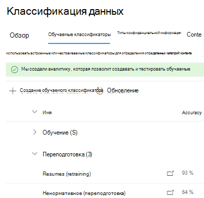

# Повторное обучение классификаторов в соответствии с требованиями к обмену даннымиHow to retrain a classifier in communications compliance

Обучаемый классификатор Microsoft 365 — это средство, которое можно обучить распознавать различные типы контента, предоставляя ему примеры для анализа.A Microsoft 365 trainable classifier is a tool you can train to recognize various types of content by giving it samples to look at. После обучения вы можете использовать его для определения элемента для применения меток конфиденциальности Office, политик соответствия коммуникациям и политик меток хранения.Once trained, you can use it to identify item for application of Office sensitivity labels, communications compliance policies, and retention label policies.

В этой статье показано, как повысить производительность настраиваемых обучаемых классификаторов и некоторых предварительно обученных классификаторов, предоставив им дополнительную обратную связь.This article shows you how to improve the performance of custom trainable classifiers and some pre-trained classifiers by providing them additional feedback.

Дополнительные информацию о различных типах классификаторов см. в дополнительных данных об обучаемых [классификаторах.](classifier-learn-about.md)To learn more about the different types of classifiers, see [Learn about trainable classifiers](classifier-learn-about.md).

## РазрешенияPermissions

Чтобы получить доступ к классификаторам в Центре соответствия требованиям Microsoft 365:To access classifiers in the Microsoft 365 Compliance center:

- Для обучения классификатора требуется роль администратора соответствия требованиям или администратора данных соответствия требованиямthe Compliance admin role or Compliance Data Administrator is required to train a classifier

Для использования классификаторов в таких сценариях необходимы учетные записи с этими разрешениями:You'll need accounts with these permissions to use classifiers in these scenarios:

- Сценарий политики соответствия коммуникациям: администратор управления рисками, администратор надзорной проверкиCommunication compliance policy scenario: Insider Risk Management Admin, Supervisory Review Administrator 

## Общий рабочий процессOverall workflow

> [!IMPORTANT]
> Вы предоставляете отзыв в решении для обеспечения соответствия требованиям, которое использует классификатор в качестве условия.You provide feedback in the compliance solution that is using the classifier as a condition. **Если у вас нет политики соответствия коммуникациям, использующей классификатор в качестве условия, остановите это.****If you don't have a communications compliance policy that uses a classifier as a condition, stop here.**

При использовании классификаторов может потребоваться повысить точность классификаций, которые они делают.As you use your classifiers, you may want to increase the precision of the classifications that they're making. Это можно сделать, оценив качество классификаций, сделанных для элементов, которые они определили как совпадающие или не совпадающие.You do this by evaluating the quality of the classifications made  for items it has identified as being a match or not a match. После того как вы сделаете 30 оценок для классификатора, он будет принимать этот отзыв и автоматически переучивать себя.After you make 30 evaluations for a classifier it takes that feedback and automatically retrains itself.

Подробнее об общем процессе переподготовки классификатора см. в процедуре переподготовки [классификатора.](classifier-learn-about.md#retraining-classifiers)To understand more about the overall workflow of retraining a classifier, see [Process flow for retraining a classifier](classifier-learn-about.md#retraining-classifiers).

> [!NOTE]
> Классификатор уже должен быть опубликован и используется, прежде чем его можно будет переучить.A classifier must already be published and in use before it can be retrained.

## Переподготовка классификатора в политиках соответствия коммуникациямHow to retrain a classifier in communication compliance policies

1. Откройте политику соответствия требованиям связи, которая использует классификатор в качестве  условия, и выберите один из идентифицированных элементов в списке "Ожидание".Open the Communication compliance policy that uses a classifier as a condition and choose one of the identified items from the **Pending** list.
2. Выберите многоязык и **усовершенствовать классификацию.**Choose the ellipsis and **Improve classification**.
3. В области **"Подробные отзывы",** если элемент имеет настоящий положительный результат, выберите "Соответствие". In the **Detailed feedback** pane, if the item is a true positive, choose, **Match**.  Если элемент имеет ложный срабатыв, то есть он был неправильно включен в категорию, выберите **"Не совпадать".**If the item is a false positive, that is it was incorrectly included in the category, choose **Not a match**.
4. Если есть другой классификатор, который больше подходит для элемента, его можно выбрать в списке "Предложить другие обучаемые **классификаторы".**If there is another classifier that would be more appropriate for the item, you can choose it from the **Suggest other trainable classifiers** list. Это активирует другой классификатор для оценки элемента.This will trigger the other classifier to evaluate the item.

> [!TIP]
> Вы можете одновременно предоставить отзывы о нескольких пунктах, выбрав их все, а затем выбрав пункт "Предоставить **подробный отзыв"** на панели команд.You can provide feedback on multiple items simultaneously by choosing them all and then choosing **Provide detailed feedback** in the command bar.

5. Choose **Send feedback** to send your evaluation of the , `match` `not a match` classifications and suggest other trainable classifiers.Choose **Send feedback** to send your evaluation of the `match`, `not a match` classifications and suggest other trainable classifiers. Когда вы предоставляете классификатору 30 экземпляров обратной связи, он автоматически переучен.When you've provided 30 instances of feedback to a classifier, it will automatically  retrain. Переподготовка может занять от 1 до 4 часов.Retraining can take from 1-4 hours. Классификаторы можно переподготовить только дважды в день.Classifiers can only be retrained twice per day.

> [!IMPORTANT]
> Эти сведения пойдут в классификатор в вашем клиенте и не будут **возвращаться в Корпорацию Майкрософт.**This information goes to the classifier in your tenant, **it does not go back to Microsoft**.

6.  Откройте **страницу классификации** данных в **Центре соответствия требованиям Microsoft 365.**Open the **Data classification** page in the **Microsoft 365 compliance center**.
7. Откройте **обучаемые классификаторы.**Open **Trainable classifiers**.
8. Классификатор, используемый в политике соответствия коммуникациям, будет отображаться под заголовком **"Повторное обучение".**The classifier that was used in your Communications compliance policy will appear under the **Re-training** heading.

9. После завершения переподготовки выберите классификатор, чтобы открыть обзор переподготовки.Once retraining completes, choose the classifier to open the retraining overview.

10. Просмотрите рекомендуемое действие и сравнение прогнозирования для повторной и опубликованной версии классификатора.Review the recommended action, and the prediction comparisons of the retrained and currently published versions of the classifier.
11. Если вы удовлетворены результатами переподготовки, выберите **"Переопубликовка".**If you satisfied with the results of the retraining, choose **Re-publish**.
12. Если вы не удовлетворены результатами переподготовки, вы можете предоставить дополнительные отзывы классификатору в интерфейсе соответствия коммуникациям и запустить еще один цикл переподготовки или ничего не делать, в этом случае опубликованная версия классификатора будет по-прежнему использоваться.If you are not satisfied with the results of the retraining, you can choose to provide additional feedback to the classifier in the Communications compliance interface and start another retraining cycle or do nothing in which case the currently published version of the classifier will continue to be used. 

## Подробные сведения о переопубликовывающих рекомендацияхDetails on republishing recommendations

Ниже немного информации о том, как мы сформулировали рекомендацию повторно опубликовать классификатор с переподготовленным классификатором или предложить дополнительную переподготовку.Here is a little information on how we formulate the recommendation to re-publish a retrained classifier or suggest further retraining. Для этого требуется более глубокое понимание работы обучаемых классификаторов.This requires a little deeper understanding of how trainable classifiers work.

После переподготовки мы оцениваем производительность классификатора как для элементов с обратной связью, так и для всех элементов, изначально используемых для обучения классификатора.After a retrain, we evaluate the classifier's performance on both the items with feedback as well as any items originally used to train the classifier. 

- Для встроенных моделей элементы, используемые для обучения классификатора, — это элементы, используемые корпорацией Майкрософт для создания модели.For built-in models, items used to train the classifier are the items used by Microsoft to build the model.
- Для пользовательских моделей элементы, используемые в исходном обучении классификатора, находятся на сайтах, добавленных для тестирования и проверки.For custom models, items used in the original training the classifier are from the sites you had added for test and review.

Мы сравниваем показатели производительности для обоих наборов элементов для классификатора с переподготовленным и опубликованным классификатором, чтобы дать рекомендации о том, были ли усовершенствования для повторной публикации.We compare the performance numbers on both sets of items for the retrained and published classifier to provide a recommendation on whether there was improvement to republish. 

## См. такжеSee also

- [Информация об обучаемых классификаторахLearn about trainable classifiers](classifier-learn-about.md)
- [Анализируемые типы файлов и расширения имен файлов для обхода по умолчанию в SharePoint ServerDefault crawled file name extensions and parsed file types in SharePoint Server](https://docs.microsoft.com/sharepoint/technical-reference/default-crawled-file-name-extensions-and-parsed-file-types)
