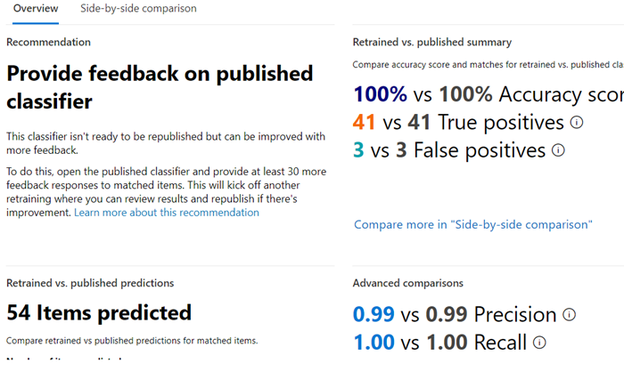

# Как переучить классификатор в соответствии с требованиями к связи (Предварительная версия)

Классификатор Microsoft 365, предназначенный для обучения, — это средство, которое можно обучить для распознавания различных типов контента, предоставляя ИТ-примерам возможность взглянуть на. После обучения вы можете использовать его для определения элемента для применения меток конфиденциальности Office, политик соответствия требованиям и политик меток хранения.

В этой статье показано, как увеличить производительность настраиваемых классификаторов и предварительно обученных классификаторов, предоставив им дополнительные отзывы.

Чтобы узнать больше о различных типах классификаторов, ознакомьтесь со статьей [сведения о классификаторах (Предварительная версия)](classifier-learn-about.md).

## Разрешения

Чтобы получить доступ к классификаторам в центре соответствия требованиям Microsoft 365:

- для обучения классификатора требуется роль администратора соответствия или администратор данных соответствия требованиям.

Учетные записи с этими разрешениями потребуются для использования классификаторов в следующих сценариях:

- Политика соответствия требованиям к общению: администратору управления рисками для участников программы, администратору Супервизорной проверки 

## Общий рабочий процесс

> [!IMPORTANT]
> Вы предоставляете отзыв в решении для обеспечения соответствия требованиям, которое использует классификатор в качестве условия. **Если у вас нет политики соответствия требованиям на связь, в которой используется классификатор в качестве условия, остановите отсюда.**

Когда вы используете классификаторы, вам может потребоваться увеличить точность этих классификаций. Для этого необходимо оценить качество классификаций, созданных для элементов, обнаруженных в качестве соответствия или не совпадающий. После выполнения 30 оценочных оценок для классификатора он выполняет обратную связь и автоматически выполняет его реобучение.

Чтобы узнать больше об общем рабочем процессе рекурсии классификатора, ознакомьтесь со статьей [поток обработки для рекурсии классификатора](classifier-learn-about.md#retraining-classifiers).

> [!NOTE]
> Классификатор должен быть уже опубликован и использован до его переподготовки.

## Реобучение классификатору в политиках обеспечения соответствия в общении (Предварительная версия)

1. Откройте политику соответствия для взаимодействия, в которой используется классификатор в качестве условия, и выберите один из идентифицированных элементов из списка **ожидания** .
2. Нажмите кнопку с многоточием и **улучшите классификацию**.
3. Если элемент имеет истинный положительный результат, в области **подробной обратной связи** выберите, **ПОИСКПОЗ**.  Если элемент является ложным положительным, он был ошибочно включен в категорию, выберите пункт **не найдено**.
4. Если имеется другой классификатор, который будет более подходящим для элемента, можно выбрать его в списке **предлагаемые классификаторы для обучения** . При этом другой классификатор будет активирован для оценки элемента.

> [!TIP]
> Вы можете предоставить отзывы сразу для нескольких элементов, выбрав их все, а затем указав **подробную обратную связь** на панели команд.

5. Нажмите кнопку **Отправить отзыв** , чтобы отправить результаты оценки `match` , `not a match` классификации и предложения других классификаторов, которые могут быть обучены. Когда вы предоставили классификатору 30 экземпляров обратной связи, он будет автоматически переучить. Для рекурсии может потребоваться от 1-4 часов. Классификаторы можно переучить только дважды в день.

> [!IMPORTANT]
> Эти сведения отправляются классификатору в клиенте, **поэтому он не возвращается в корпорацию Майкрософт**.

6.  Откройте страницу **классификация данных** в **центре соответствия требованиям Microsoft 365**.
7. Откройте **классификаторы, которые вы научитесь (Предварительная версия)**.
8. Классификатор, который использовался в политике соответствия требованиям, будет отображаться под заголовком " **повторное обучение** ".

9. После завершения переподготовки выберите классификатор, чтобы открыть обзор переподготовки.

10. Ознакомьтесь с рекомендуемым действием и сравнением прогноза для версий классификатора, переученных и опубликованных в настоящее время.
11. Если вы удовлетворены результатами повторного изучения, нажмите кнопку **повторно опубликовать**.
12. Если вы не удовлетворены результатами повторного изучения, вы можете предоставить дополнительную реакцию классификатора в интерфейсе обеспечения соответствия требованиям и запустить другой цикл повторного обучения или ничего не делать, если в данный момент опубликованная версия классификатора будет продолжать использоваться. 

## Сведения о повторной публикации рекомендаций

Ниже приведены некоторые сведения о том, как мы определяем рекомендацию для повторной публикации переназначенного классификатора или предложения дальнейших переработок. Это требует более глубокого понимания принципов работы классификаторов, предназначенных для обучения.

После переподготовки мы оцениваем производительность классификатора для элементов с обратной связью, а также для всех элементов, изначально использованных для обучения классификатора. 

- Для встроенных моделей элементы, используемые для обучения классификатора, это элементы, используемые корпорацией Майкрософт для создания модели.
- Для настраиваемых моделей элементы, используемые при исходном обучении классификатора, находятся на сайтах, добавленных для тестирования и рецензирования.

Мы сравниваем номера производительности в обоих наборах элементов для реученного и опубликованного классификатора, чтобы предоставить рекомендации о том, было ли возобновлено улучшение публикации. 

## См. также

- [Сведения о классификаторах для обучения (Предварительная версия)](classifier-learn-about.md)
- [Анализируемые типы файлов и расширения имен файлов для обхода по умолчанию в SharePoint Server](https://docs.microsoft.com/sharepoint/technical-reference/default-crawled-file-name-extensions-and-parsed-file-types)
