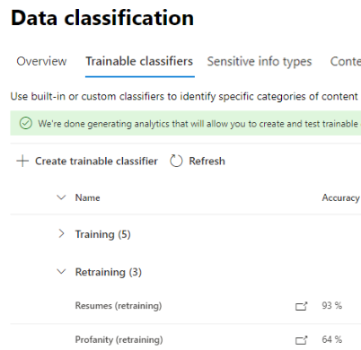

# Повторное обучение классификаторов в обозревателе содержимого

Обучаемый классификатор Microsoft 365 — это средство, которое можно обучить распознавать различные типы контента, предоставляя ему примеры для анализа. После обучения его можно использовать для определения элемента для применения меток конфиденциальности Office, политик соответствия коммуникациям и политик меток хранения.

В этой статье показано, как повысить производительность настраиваемых обучаемых классификаторов и некоторых предварительно обученных классификаторов, предоставив им дополнительную обратную связь.

Дополнительные информацию о различных типах классификаторов см. в дополнительных данных об обучаемых [классификаторах.](classifier-learn-about.md)

## Разрешения

Чтобы получить доступ к классификаторам в Центре соответствия требованиям Microsoft 365:

- Для обучения классификатора требуется роль администратора соответствия требованиям или администратора данных соответствия требованиям

Для использования классификаторов в таких сценариях необходимы учетные записи с этими разрешениями:

- Сценарий политики меток хранения: роли управления записями и управления хранением 

## Общий рабочий процесс

> [!IMPORTANT]
> Вы предоставляете отзыв в обозревателе содержимого для автоматического применения политик меток хранения к элементов Exchange и использует классификатор в качестве условия. **Если у вас нет политики хранения, которая автоматически применяет метку хранения к элементу Exchange и использует классификатор в качестве условия, остановите это.**

При использовании классификаторов может потребоваться повысить точность классификаций, которые они делают. Это делается путем оценки качества классификаций, сделанных для элементов, которые они определили как совпадающие или не совпадающие. После того как вы сделаете 30 оценок для классификатора, он будет принимать этот отзыв и автоматически переучивать себя.

Подробнее об общем процессе переподготовки классификатора см. в процедуре переподготовки [классификатора.](classifier-learn-about.md#retraining-classifiers)

> [!NOTE]
> Классификатор уже должен быть опубликован и используется, прежде чем его можно будет переучить.

## Повторное обучение классификаторов в обозревателе содержимого

1. Во sign in to Microsoft 365 compliance center with compliance admin or security admin role access and open **Microsoft 365 compliance center** Data  >  **classification**  >  **Content explorer.** 
2. В **списке фильтра по меткам,** типам информации или категориям разо расширении обучаемых **классификаторов.**

> [!IMPORTANT]
> Сводные элементы могут отображаться под заголовком обучаемых классификаторов в течение восьми дней.

3. Выберите обучаемый классификатор, используемый в политике автоматического применения меток хранения. Это обучаемый классификатор, на который вы будете давать отзывы.

> [!NOTE]
> Если элемент имеет запись  в столбце метки хранения, это означает, что элемент был классифицирован как `match` .  Если элемент не имеет записи  в столбце метки хранения, это означает, что он был классифицирован как `close match` . Вы можете повысить точность классификатора максимально, предоставив отзывы об `close match` элементе. 

4. Выберите элемент и откройте его.
 
 > [!TIP]
> Вы можете одновременно предоставить отзывы о нескольких пунктах, выбрав их все, а затем выбрав "Улучшить **классификацию"** на панели команд.

5. Choose **Provide feedback**.
6. В области **"Подробные отзывы",** если элемент является истинным положительным, выберите "Match" (Совпадение).   Если элемент имеет ложный срабатыв, то есть он был неправильно включен в категорию, выберите **"Не совпадать".**
7. Если есть другой классификатор, который больше подходит для элемента, его можно выбрать в списке "Предложить другие обучаемые **классификаторы".** Это активирует другой классификатор для оценки элемента.
8. Выберите **"Отправить отзыв",** чтобы отправить оценку классификаций и предложить другие обучаемые `match` `not a match` классификаторы. Когда вы предоставляете классификатору 30 экземпляров обратной связи, он автоматически переучен. Переподготовка может занять от одного до четырех часов. Классификаторы можно переподготовить только дважды в день.

> [!IMPORTANT]
> Эти сведения пойдут в классификатор в вашем клиенте и не будут **возвращаться в Корпорацию Майкрософт.**

9. Откройте **обучаемые классификаторы.**
10. Классификатор, используемый в политике соответствия коммуникациям, будет отображаться под заголовком **"Повторное обучение".**

11. После завершения переподготовки выберите классификатор, чтобы открыть обзор переподготовки.

12. Просмотрите рекомендуемое действие и сравнение прогнозирования для повторной и опубликованной версии классификатора.
13. Если вы удовлетворены результатами переподготовки, выберите **"Переопубликовка".**
14. Если вы не удовлетворены результатами переподготовки, вы можете предоставить дополнительные отзывы классификатору в интерфейсе соответствия коммуникациям и запустить еще один цикл переподготовки или ничего не делать, в этом случае опубликованная версия классификатора будет по-прежнему использоваться. 

## Подробные сведения о переопубликовывающих рекомендациях

Ниже немного информации о том, как мы сформулировали рекомендацию повторно опубликовать классификатор с переподготовленным классификатором или предложить дополнительную переподготовку. Для этого требуется более глубокое понимание работы обучаемых классификаторов.

После переподготовки мы оцениваем производительность классификатора как для элементов с обратной связью, так и для всех элементов, изначально используемых для обучения классификатора. 

- Для встроенных моделей элементы, используемые для обучения классификатора, — это элементы, используемые корпорацией Майкрософт для создания модели.
- Для пользовательских моделей элементы, используемые в исходном обучении классификатора, находятся на сайтах, добавленных для тестирования и проверки.

Мы сравниваем показатели производительности для обоих наборов элементов для классификатора с переподготовленным и опубликованным классификатором, чтобы дать рекомендации о том, были ли усовершенствования для повторной публикации. 

## См. также

- [Информация об обучаемых классификаторах](classifier-learn-about.md)
- [Анализируемые типы файлов и расширения имен файлов для обхода по умолчанию в SharePoint Server](https://docs.microsoft.com/sharepoint/technical-reference/default-crawled-file-name-extensions-and-parsed-file-types)
