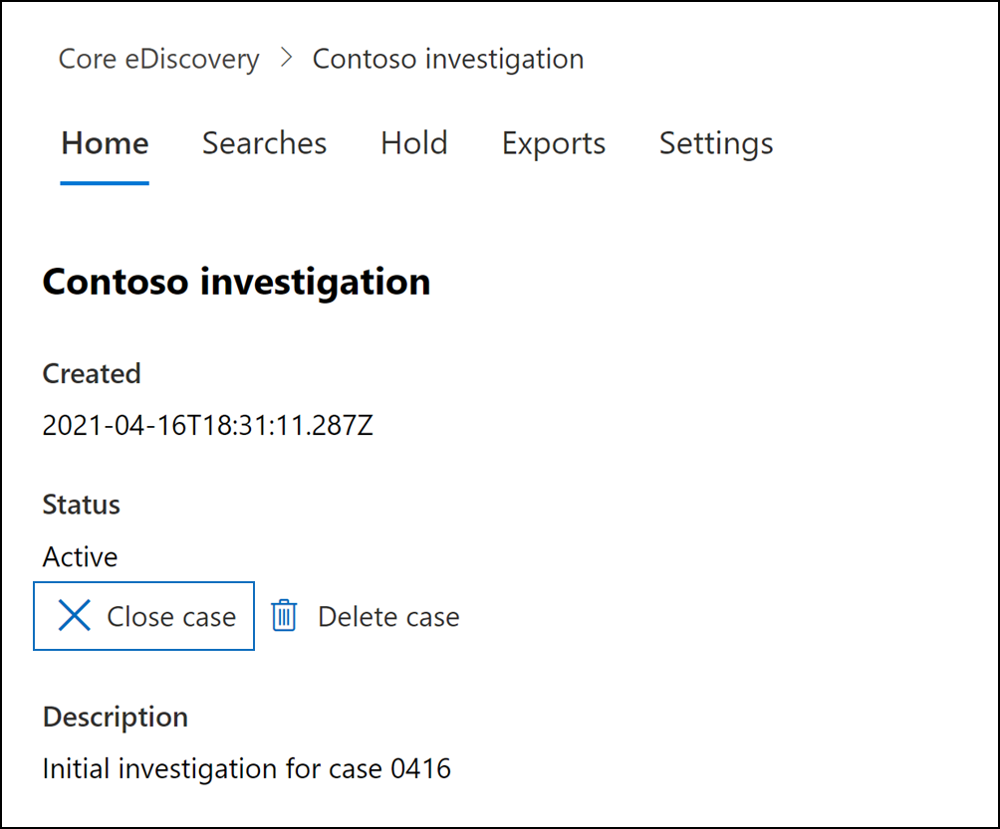

# Закрыть, открыть и удалить дело об обнаружении основных электронных данныхClose, reopen, and delete a Core eDiscovery case

В этой статье описывается, как закрыть, открыть и удалить случаи открытия основных электронных данных в Microsoft 365.This article describes how to close, reopen, and delete Core eDiscovery cases in Microsoft 365.

## Закрыть делоClose a case

По завершению судебного дела или расследования, поддерживаемого случаем проверки основных электронных расследований, вы можете закрыть дело.When the legal case or investigation supported by a Core eDiscovery case is completed, you can close the case. Вот что происходит при закрытии дела:Here's what happens when you close a case:
  
- Если в случае содержится любое удерживает eDiscovery, они будут отключены.If the case contains any eDiscovery holds, they will be turned off. После отключения удержания 30-дневный льготный период (называемый удержанием задержки) применяется к расположениям контента, которые были на удержании.After the hold is turned off, a 30-day grace period (called a *delay hold*) is applied to content locations that were on hold. Это позволяет предотвратить немедленное удаление контента и предоставляет администраторам возможность поиска и восстановления контента, прежде чем он может быть окончательно удален по истечении срока задержки.This helps prevent content from being immediately deleted and provides admins the opportunity to search for and restore content before it may be permanently deleted after the delay hold period expires. Дополнительные сведения см. в [статью Удаление местоположений контента из удержания электронных данных.](create-ediscovery-holds.md#removing-content-locations-from-an-ediscovery-hold)For more information, see [Removing content locations from an eDiscovery hold](create-ediscovery-holds.md#removing-content-locations-from-an-ediscovery-hold).

- Закрытие дела отключит только те хламы, которые связаны с этим случаем.Closing a case only turns off the holds that are associated with that case. Если другие удержания размещаются на расположении контента (например, удержание для судебного разбирательства, политика хранения или удержание из другого дела об обнаружении core eDiscovery), эти удержания по-прежнему будут сохранены.If other holds are placed on a content location (such as a Litigation Hold, a retention policy, or a hold from a different Core eDiscovery case) those holds will still be maintained.

- Случай по-прежнему указан на странице Core eDiscovery в центре Microsoft 365 соответствия требованиям.The case is still listed on the Core eDiscovery page in the Microsoft 365 compliance center. Сохраняются сведения, удержания, поиски и члены закрытого дела.The details, holds, searches, and members of a closed case are retained.

- Вы можете изменить дело после его закрытия.You can edit a case after it's closed. Например, можно добавлять или удалять участников, создавать поиски и экспортировать результаты поиска.For example, you can add or remove members, create searches, and export search results. Основное отличие между активными и закрытыми случаями состоит в том, что при закрытии дела отключается хлам для электронных обнаружений.The primary difference between active and closed cases is that eDiscovery holds are turned off when a case is closed.

Чтобы закрыть дело:To close a case:
  
1. В центре Microsoft 365 для проверки соответствия требованиям щелкните **ядро eDiscovery,** чтобы отобразить список случаев проверки основных электронных данных  >   в организации.In the Microsoft 365 compliance center, click **eDiscovery** > **Core** to display the list of Core eDiscovery cases in your organization.

2. Щелкните имя дела, которое нужно закрыть.Click the name of the case that you want to close.

   

3. На домашней странице в **статье Состояние** нажмите кнопку **Закрыть дело**.On the home page, under **Status**, click **Close case**.

    Отображается предупреждение о том, что хламы, связанные с случаем, будут отключены.A warning is displayed saying that the holds associated with the case will be turned off.

4. Нажмите **кнопку Да,** чтобы закрыть дело.Click **Yes** to close the case.

    Состояние на домашней странице дела изменено с **Active** на **Закрытие**.The status on the case home page is changed from **Active** to **Closing**.

5. На странице **Core eDiscovery** щелкните **Обновление,** чтобы обновить состояние закрытого дела.On the **Core eDiscovery** page, click **Refresh** to update the status of the closed case. Завершение процесса закрытия может занять до 60 минут.It might take up to 60 minutes for the closing process to complete.

    По завершению процесса состояние дела будет изменено на **Закрытое** на странице **Core eDiscovery.**When the process is complete, the status of the case is changed to **Closed** on the **Core eDiscovery** page.

## Повторное открытие закрытого делаReopen a closed case

При повторном открытии дела любые удерживаемые электронные ружье, которые были на месте при закрытии дела, не будут автоматически восстановлены.When you reopen a case, any eDiscovery holds that were in place when the case was closed won't be automatically reinstated. После повторного открытия дела необходимо перейти на страницу **Удерживает** и включить предыдущие удерживает.After the case is reopened, you'll have to go to the **Holds** page and turn on the previous holds. Чтобы включить удержание, выберите его, чтобы отобразить страницу вылетов, а затем установите флаггл **Status** **on**.To turn on a hold, select it to display the flyout page, and then set the **Status** toggle to **On**.
  
1. В центре Microsoft 365 для проверки соответствия требованиям щелкните **ядро eDiscovery,** чтобы отобразить список случаев проверки основных электронных данных  >   в организации.In the Microsoft 365 compliance center, click **eDiscovery** > **Core** to display the list of Core eDiscovery cases in your organization.

2. Щелкните имя случая, которое необходимо открыть.Click the name of the case that you want to reopen.

   

3. На домашней странице в статье Состояние нажмите **кнопку** **Открыть дело**.On the home page, under **Status**, click **Reopen case**.

    Отображается предупреждение о том, что holds, которые были связаны с случаем, когда он был закрыт, не будут автоматически включены.A warning is displayed saying that the holds that were associated with the case when it was closed won't be turned on automatically.

4. Щелкните **Да,** чтобы открыть дело.Click **Yes** to reopen the case.

    Состояние на странице вылетов домашней страницы дела изменено с **закрытой на** **активную.**The status on the case home page flyout page is changed from **Closed** to **Active**.

5. На странице **Core eDiscovery** щелкните **Обновление,** чтобы обновить состояние вновь открытого дела.On the **Core eDiscovery** page, click **Refresh** to update the status of the reopened case. Процесс открытия может занять до 60 минут.It might take up to 60 minutes for the reopening process to complete. 

    По завершению процесса состояние дела меняется на **Active** на странице **Core eDiscovery.**When the process is complete, the status of the case is changed to **Active** on the **Core eDiscovery** page.

7. (Необязательный) Чтобы включить все удержания, связанные с вновь открытым случаем, перейдите на  вкладку **Удержание,** выберите удержание, а затем выберите флажки под состоянием на странице флажка удержания.(Optional) To turn on any holds associated with the reopened case, go to **Holds** tab, select a hold, and then select the checkbox under **Status** on the hold flyout page.
  
## Удаление случаяDelete a case

Кроме того, можно удалить активные и закрытые кейсы по обнаружению основных электронных данных.You can also delete active and closed Core eDiscovery cases. При удалении дела все поиски и экспорты в этом случае удаляются, а дело удаляется из списка случаев на странице **Core eDiscovery** в центре Microsoft 365 соответствия требованиям.When you delete a case, all searches and exports in the case are deleted, and the case is removed from the list of cases on the **Core eDiscovery** page in the Microsoft 365 compliance center. Вы не можете открыть удаленный случай.You can't reopen a deleted case.

Прежде чем удалить случай (активен он или закрыт), сначала  необходимо удалить все хламы eDiscovery, связанные с этим случаем.Before you can delete a case (whether it's active or closed), you must first delete *all* eDiscovery holds associated with the case. Это включает удаление удерживающих данных со статусом **Off**.That includes deleting holds with a status of **Off**. 

Удаление удержания электронных данных:To delete an eDiscovery hold:

1. Перейдите **на вкладку Держит** в случае, если вы хотите удалить.Go the **Holds** tab in the case that you want to delete.

2. Выберите удержание, которое необходимо удалить.Select the hold that you want to delete.

3. На странице вылет нажмите кнопку **Удалить**.On the flyout page, click **Delete**.

      

Удаление случая:To delete a case:

1. В центре Microsoft 365 для проверки соответствия требованиям щелкните **ядро eDiscovery,** чтобы отобразить список случаев проверки основных электронных данных  >   в организации.In the Microsoft 365 compliance center, click **eDiscovery** > **Core** to display the list of Core eDiscovery cases in your organization.

2. Щелкните имя случая, которое необходимо удалить.Click the name of the case that you want to delete.

3. На домашней странице дела, в **статье Состояние,** нажмите **кнопку Удалить случае**.On the case home page, under **Status**, click **Delete case**.

      

Если случай, который вы пытаетесь удалить, по-прежнему содержит удерживает данные об обнаружении электронных данных, вы получите сообщение об ошибке.If the case you're trying to delete still contains eDiscovery holds, you'll receive an error message. Вам придется удалить все хламы, связанные с делом, а затем еще раз попытаться удалить дело.You'll have to delete all holds associated with the case and then try again to delete the case.
