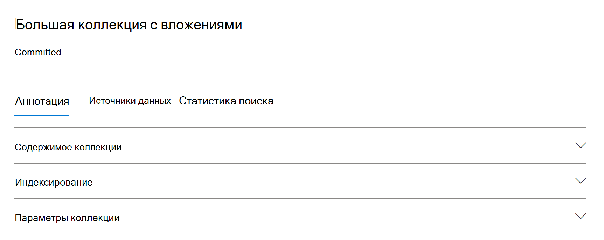

# Статистика коллекций и отчеты в Advanced eDiscovery

После создания коллекции черновиков можно просмотреть статистику извлеченных элементов, например расположения контента, которые содержат большинство элементов, соответствующих критериям поиска, и количество элементов, возвращенных запросом поиска. Вы также можете просмотреть подмножество результатов.

При выявлении набора документов, которые необходимо дополнительно изучить, можно добавить результаты поиска в набор отзывов для сбора и обработки.

## Статистика и отчеты по коллекциям черновиков

В этом разделе описываются статистические данные, доступные для черновиков коллекций. Эти статистические данные доступны на **вкладке Статистика поиска** на странице вылетов коллекции черновиков.

### Оценки коллекции

В этом разделе показана графическая сводка предполагаемых элементов, возвращенных коллекцией. Это указывает количество элементов, которые соответствуют критериям поиска коллекции. Эти сведения дают представление о предполагаемом количестве элементов, возвращенных коллекцией.

- **Предполагаемые элементы по расположениям:** общее число предполагаемых элементов, возвращенных коллекцией. Также отображается определенное количество элементов, расположенных в почтовых ящиках и расположенных на сайтах.

- **Предполагаемые расположения с хитами:** общее число местоположений контента, содержащих элементы, возвращаемые коллекцией. Также отображается определенное количество почтовых ящиков и расположения сайтов.

- **Объем данных по расположению (в МБ)**: общий размер всех предполагаемых элементов, возвращенных коллекцией. Также отображается определенный размер элементов почтовых ящиков и элементов сайта.

### Отчет о состоянии

В этом разделе отображаются статистические данные о запросе поиска коллекции и количестве предполагаемых элементов, совпадающих с различными частями поискового запроса. Эти статистические данные можно использовать для анализа количества элементов, которые соответствуют каждому компоненту поискового запроса. Это поможет вам уточнить критерии поиска для коллекции и при необходимости сузить область действия коллекции.

- **Тип расположения.** Тип расположения контента, к который применима статистика запросов. Значение Exchange **указывает** расположение почтового ящика; значение **SharePoint** указывает расположение сайта.

- **Часть.** Часть поискового запроса, к которая применима статистика. **Основной** указывает на весь поисковый запрос. **Ключевое** слово указывает, что статистика в строке для определенного ключевого слова. Если вы используете список ключевых слов, когда для поискового запроса в коллекции в эту таблицу включены статистические данные по каждому компоненту запроса.

- **Условие.** Фактический компонент (ключевое слово или условие) запроса поиска, который был подготовлен для коллекции черновиков, возвращающих статистику, отображаемую в соответствующей строке.

- **Расположения с хитами:** количество расположений контента (заданных столбцом типа Location), содержащих элементы, которые соответствуют основному или ключевому запросу, указанному в столбце **Condition.** 

- **Элементы.** Количество элементов (из указанного расположения контента), которые соответствуют запросу, указанному в столбце **Condition.** Как было объяснено ранее, если элемент содержит несколько экземпляров ключевого слова, которое находится в поиске, он учитывается только один раз в этом столбце.

- **Размер (МБ)**: общий размер всех найденных элементов (в указанном расположении контента), которые соответствуют запросу поиска в столбце **Condition.**

### Верхние расположения

В этом разделе отображаются статистические данные о конкретных расположениях контента с большинством элементов, возвращенных коллекцией.

- Имя имени расположения (адрес электронной почты почтовых ящиков и URL-адрес сайтов).

- Тип расположения (почтовый ящик или сайт).

- Предполагаемое количество элементов в расположении контента, возвращаемом коллекцией.

- Общий размер предполагаемых элементов в каждом расположении контента.

## Статистика и отчеты для совершенных коллекций

В этом разделе описываются статистические данные, доступные после фиксации коллекции в наборе отзывов, включая фактическое число элементов, добавленных в набор отзывов. Эти статистические данные (в дополнение к сведениям о наборе нагрузки) предоставляют исторические сведения о контенте, добавленного в дело.

После фиксации коллекции в наборе отзывов на странице вылетного подключения отображаются следующие вкладки. Каждая из этих вкладок содержит различные типы сведений о коллекции.

### Содержимое коллекции

В этом разделе вкладки **Сводка** содержится статистика и другие сведения о предметах, которые были собраны из источников данных в коллекции и добавлены в набор отзывов.

- **Общее количество извлеченных элементов.** Общее количество элементов, добавленных в набор отзывов. Это число указывает сумму родительских элементов и детских элементов, добавленных в набор отзывов.

  > [!TIP]
  > Наведите курсор на столбцы родительских или детских элементов, чтобы отобразить общее число родительских или детских элементов.

- **Родительские элементы**. Количество элементов, возвращаемого коллекцией, которая была использована для сбора элементов, добавленных в набор отзывов. Это число соответствует (и равно) предполагаемому числу элементов, отображаемого в разделе **Параметры** коллекции. Количество родительских элементов, которые он собирает для сбора элементов, добавленных в набор отзывов.
 
   Родительский элемент может содержать несколько элементов для детей. Например, сообщение электронной почты является родительским элементом, если оно содержит присоединенный файл или имеет облачную вложение. В этом случае присоединенный файл или целевой объект облачного вложения считаются детскими элементами. При фиксации коллекции родительские элементы и любые соответствующие детские элементы добавляются в набор отзывов в качестве отдельных элементов или файлов.

- **Детские элементы**. Количество детских элементов, добавленных в набор отзывов. Детские элементы — это вложения или другие части родительского элемента. Элементы для детей включают присоединенные файлы, облачные вложения, изображения и подписи электронной почты. При фиксации коллекции в набор отзывов детские элементы извлекаются, индексются и добавляются в набор отзывов в качестве отдельных файлов.

- **Уникальные элементы**. Количество уникальных элементов, добавленных в набор отзывов. Уникальные элементы уникальны для набора отзывов. Все элементы уникальны при добавлении первой коллекции в новый набор отзывов, так как предыдущих элементов в наборе отзывов не было.

- **Выявленные дублирующие элементы**. Количество элементов из коллекции, которые не были добавлены в набор отзывов, так как один и тот же элемент уже существует в наборе обзоров. Статистические данные о дублирующихся элементов могут помочь объяснить различия между числом предполагаемых элементов из коллекции черновиков и фактическим числом элементов, добавленных в набор обзоров.

### Индексирование

Раздел **Индексация** на вкладке **Сводка** набора совершенных обзоров содержит сведения об индексации элементов, добавленных в набор обзоров.

**Новые индексные элементы.** Количество элементов, которые были недавно проиндексировали перед их добавлением в набор отзывов. Пример нового индексного элемента — это детские элементы, извлеченные из родительского элемента, а затем индексироваться перед их добавлением в набор отзывов. Кроме того, элементы, не расположенные в источниках данных для хранения, и расположения контента без хранения, перечисленные на вкладке **Источники** данных в случае, индексируются перед их добавлением в обзор. Например, новые индексные элементы будут включать элементы, собранные из дополнительных местоположений.

**Обновленные индексные элементы**. Количество частично индексных элементов, которые были успешно индексироваться и добавлены в набор отзывов. Это позволит частично проиндексировать элементы из расположения  контента и расположения контента, которые были успешно индексироваться, когда коллекция была настроена на набор отзывов.

**Ошибки индексирования.** Количество частично индексных элементов, которые не удалось проиндексировать до того, как они были добавлены в набор отзывов. Эти элементы могут потребовать устранения ошибок.

### Параметры коллекции

В этом разделе отображаются сведения о коллекции, которые использовались для сбора элементов, добавленных в набор отзывов. На этой вкладке отображаются сведения, аналогичные сведениям на вкладке **Статистика поиска.** В этом разделе приводится быстрый снимок запроса поиска, используемого коллекцией, расположения контента, которые были в поиске, и предполагаемых результатов коллекции. Как уже объяснялось ранее, число оцено-ных элементов в этом разделе будет равно числу родительских элементов, показанных в разделе **Содержимое** коллекции.

### Вкладка статистики поиска

Статистические данные, отображаемые на вкладке **Статистика** поиска, являются той же статистикой, что и при последнем запуске коллекции черновиков. Это включает оценки коллекции, отчет об условиях и верхние расположения. Эти сведения сохраняются из коллекции черновиков для исторических ссылок и можно сравнить с фактической коллекцией, которая была установлена в наборе отзывов.

## Различия между оценками черновика коллекции и фактическим совершенным собранием

При запуске коллекции черновиков оценка количества элементов (и их общего размера), которые соответствуют критериям коллекции, отображается на  вкладке **Сводка** и в разделе **Оценки** коллекции вкладки Статистика поиска. После фиксации черновика коллекции в набор отзывов фактическое число элементов (и их общий размер) добавляет, что набор отзывов часто отличается от оценок. В большинстве случаев в набор отзывов добавляется больше элементов, чем было оценено из коллекции черновиков. В следующем списке описываются наиболее распространенные причины этих различий и советы по их выявлению:

- **Детские элементы**. Детские элементы, извлеченные из родительских элементов и добавленные в качестве отдельных файлов. Количество детских элементов может значительно увеличить количество элементов, которые фактически добавляются в набор отзывов. Как правило, число родительских элементов, идентифицированных в разделе **Содержимое** коллекции на вкладке **Сводка** для соответствующей коллекции, должно быть равно числу предполагаемых элементов из черновика коллекции.

- **Дублировать элементы**. Элементы из коллекции черновиков, которые уже были добавлены в набор отзывов в предыдущей коллекции, не будут добавлены. Как уже объяснялось ранее, количество дублирующих элементов в коллекции отображается в разделе **Содержимое коллекции** на вкладке **Сводка.**

- **Параметры конфигурации коллекции**. При фиксации черновика коллекции в набор отзывов необходимо включить потоки бесед, облачные вложения и версии документов. Все эти элементы, добавленные в набор отзывов, не включаются в оценки коллекции черновиков. Они идентифицированы и собираются только при фиксации коллекции. Выбор этих параметров, скорее всего, увеличит количество элементов, добавленных в набор отзывов. 

    Например, несколько версий SharePoint документов не включены в смету для коллекции черновиков. Но если при экспорте результатов поиска будет выбрана возможность включить все версии документов, это увеличит фактическое число (и общий размер) элементов, добавленных в набор отзывов. 

    Дополнительные сведения об этих параметрах см. в [документе Commit a draft collection to a review set.](commit-draft-collection.md#commit-a-draft-collection-to-a-review-set-in-advanced-ediscovery) 

Вот другие причины, по которым предполагаемые результаты из коллекции черновиков могут быть другими, чем фактические совершенные результаты.

- **Способ оценки результатов для коллекций черновиков.** Оценка результатов поиска, возвращаемого в черновике коллекции, — это оценка (а не фактическое число) элементов, которые соответствуют критериям запроса коллекции. Для компиляции оценки элементов электронной почты из базы данных Exchange список ID-адресов сообщений, которые соответствуют критериям поиска. Но когда вы настроили коллекцию на набор отзывов, коллекция будет повторно перезахораняться и фактические сообщения будут извлечены из Exchange базы данных. Поэтому различия могут возникнуть из-за того, как определяется предполагаемое количество элементов и фактическое число элементов.

- **Изменения, которые происходят между временем оценки и совершения проектов коллекций.** При фиксации коллекции черновиков в набор отзывов поиск повторно будет выполняться для сбора последних элементов в индексе поиска, которые соответствуют критериям поиска. Не исключено, что были созданы, отправлены или удалены дополнительные элементы, соответствующие критериям поиска, в период между последним запуском коллекции черновиков и когда коллекция черновиков будет настроена на набор отзывов. Кроме того, возможно, элементы, которые находились в индексе поиска при оценке результатов коллекции черновиков, больше не существуют, так как они были стерта из источника данных перед совершением коллекции. Один из способов устранить эту проблему — указать диапазон дат для коллекции. Другой способ — разместить удержание в расположениях контента, чтобы элементы сохранялись и не могли быть стерт.

- **Элементы unindexed**. Если в черновике коллекции содержится поиск Exchange почтовых ящиков или SharePoint сайтов, в набор отзывов будут добавлены только неиндексы из расположения контента, содержащие элементы, соответствующие критериям коллекции. Другими словами, если в почтовом ящике или на сайте результатов не обнаружено, в набор отзывов не будут добавлены какие-либо неиндексуалные элементы в этом почтовом ящике или на сайте. Тем не менее, неиндексуалные элементы из всех местоположений контента (даже те, которые не содержат элементов, которые соответствуют запросу коллекции) будут включены в предполагаемые результаты коллекции.

    Кроме того, если в черновике коллекции были указаны конкретные расположения контента  (это означает, что определенные почтовые ящики или сайты, указанные на странице Дополнительные расположения в мастере коллекции черновиков), то неиндексы (которые не исключаются критериями коллекции) из расположения контента, указанного в поиске, будут экспортироваться. В этом случае должно быть одинаковое число неиндексуальных элементов и количество неиндексуальных элементов, добавленных в набор отзывов.
