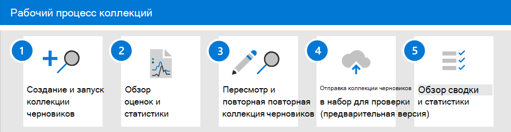

# Узнайте о коллекциях в advanced eDiscovery

> [!NOTE]
> Мы развертываем новый опыт коллекций в advanced eDiscovery, который описан в этой статье. Эта выкатка займет несколько недель, прежде чем она станет доступной для всех организаций. Если новый опыт коллекций не доступен в организации, вы все равно можете собирать содержимое кейсов с помощью средства поиска расширенных электронных [данных.](create-search-to-collect-data.md)

Когда организации сталкиваются с сбором сообщений и контента, которые могут иметь отношение к расследованию или потенциальному судебному разбирательству, они сталкиваются со значительной проблемой в лучших обстоятельствах. На современном рабочем месте объем, разнообразие и скорость контента позволяют инновации и удаленную работу, а также расширяют требования и процесс управления коллекциями для исследований по обнаружению электронных данных.

Рабочий процесс коллекции создает значительные технические проблемы в области извлечения контента из местных местоположений и источников. Это также критически важный момент в оценке и стратегии для общих сценариев судебного разбирательства или расследований. По мере того как организации начинают оценивать расследование, возникают первые вопросы о том, кто принимал участие в расследовании? После определения того, кто был вовлечен, эти хранители могут быстро быть помещены на удержание для сохранения соответствующего контента. Следующий вопрос: что произошло? Чтобы ответить на этот второй фундаментальный вопрос любого расследования, руководители должны обратиться к данным. Чтобы быстро оценить наиболее релевантный контент для вопроса о том, что произошло, руководители начинают уточнять цель вопроса, чтобы гарантировать, что результаты коллекции являются всеобъемлющими, не будучи слишком широкими.

Коллекции в advanced eDiscovery помогают менеджерам по обнаружению электронных данных быстро расширить поиск контента по электронной почте, документам и другому контенту в Microsoft 365. Коллекции предоставляют руководителям оценку контента, который может иметь отношение к делу. Это позволяет руководителям принимать быстрые и обоснованные решения о размере и области контента, соответствующего делу. Менеджеры по обнаружению электронных данных могут создать коллекцию для поиска источников данных для хранения данных (таких как почтовые ящики и сайты SharePoint) и с помощью определенных критериев поиска (таких как ключевые слова и диапазоны дат), чтобы быстро определить область их коллекции.

После определения коллекции руководители eDiscovery могут сохранять коллекцию в качестве черновика и получать оценки, в том числе оценки объема данных, расположения контента, содержащих результаты, и количество попаданий для состояния запроса поиска. Эти сведения могут помочь понять, следует ли пересмотреть коллекцию, чтобы сузить или расширить область коллекции, прежде чем двигаться по этапу проверки и анализа в рабочего процесса eDiscovery.

Если менеджер доволен областью коллекции и предполагаемым количеством контента, которое может быть отзывчивым, менеджер может добавить или зафиксировать содержимое в набор отзывов.  При вложении коллекции в набор отзывов этот менеджер также может включать беседы в чате, облачные вложения и версии документов. Содержимое в коллекции также проходит другой уровень обработки во время влияния в набор отзывов. и коллекция будет обновлена с итоговой сводки коллекции. После того как содержимое будет добавлено в набор отзывов, руководители eDiscovery могут продолжать запрашивать, группировать и уточнять содержимое, чтобы помочь с минимизацией и проверкой. Кроме того, коллекция обновляется с помощью сведений и статистики о контенте, который был установлен в наборе отзывов. В этом случае содержится историческая справка о контенте в коллекции.

После выпуска коллекций в центре предварительного поиска электронных данных вкладка **Searches** была переименована в **Collections** в случае предварительного поиска электронных данных в центре соответствия требованиям Microsoft 365. Действия по определению области и размера коллекции должны выполняться в том же процессе, что и поиск для определения расположения и условий. Сохранение в качестве проекта и получения предварительных оценок позволяет быстро проверку целевой области коллекций до совершения полного поиска и коллекции в набор обзоров. Это позволяет повысить качество управления заданиями и использовать целевые итерации для сведения к минимуму контента в процессе поиска и сбора.

## Рабочий процесс коллекций

Чтобы приступить к использованию коллекций в advanced eDiscovery, ниже описан базовый рабочий процесс и описания каждого шага процесса.

1. **Создание и запуск коллекции черновиков.** Первым шагом является создание черновика коллекции и определение источников данных для хранения и не-хранения для поиска. Вы также можете искать другие источники данных, которые не были добавлены в дело. После добавления источников данных можно настроить поисковый запрос для поиска источников данных для контента, соответствующего делу. Можно использовать ключевые слова, свойства и условия для создания поисковых запросов, возвращая контент, который, скорее всего, наиболее актуален для дела. Дополнительные сведения см. в [документе Create a draft collection.](create-draft-collection.md)

2. **Обзор оценок и статистики.** После создания черновика и запуска его следующий шаг — просмотреть статистику коллекций, чтобы проверить, находится ли релевантный контент, а также расположения контента с наибольшей частью просмотров. Вы также можете просмотреть пример результатов поиска, чтобы дополнительно определить, находится ли содержимое в области вашего исследования. Дополнительные сведения см. [в статистике и отчетах по черновикам коллекций.](collection-statistics-reports.md#statistics-and-reports-for-draft-collections)

3. **Пересмотр и повторная повторная коллекция черновиков.** На основе оценок и статистики, возвращаемой коллекцией, можно изменить коллекцию черновиков, изменив источники данных, которые ищутся, и запрос поиска, чтобы расширить или сузить коллекцию. Вы можете обновить и перезахоранить коллекцию черновиков, пока не будете уверены, что коллекция содержит контент, наиболее подходящий для вашего дела.

4. **Фиксация коллекции черновиков в набор отзывов.** Если вы будете удовлетворены тем, что коллекция возвращает содержимое типа, которое имеет отношение к делу, вы можете нафиксировать коллекцию в набор отзывов. При фиксации коллекции можно добавить в набор отзывов потоки бесед, облачные вложения и версии документов, которые могут иметь отношение к делу. При совершении коллекции происходят следующие вещи:

   - Детские элементы (например, вложения электронной почты, подписи электронной почты и изображения) извлекаются из родительского элемента (например, сообщения электронной почты, сообщения чата или документа), индексются (в процессе глубокой индексации) и добавляются в набор отзывов в виде отдельных файлов.

   - Глубокая индексация выполняется на элементы, собранные из дополнительных источников данных. Эти типы источников данных являются расположениями контента, помимо ранее добавленных в дело источников данных с хранением и без хранения.

   Дополнительные сведения см. [в документе Commit a draft collection to a review set.](commit-draft-collection.md)

5. **Обзор сводки и статистики коллекции**. После фиксации коллекции в наборе отзывов сохраняются сведения о коллекции, такие как статистика извлеченных элементов, глубокая индексация, поисковый запрос, используемый для коллекции, и расположения контента, из чего были собраны элементы. Кроме того, не могут быть изменены или перезахощены совершенные коллекции. Их можно только скопировать или удалить. Сохранение коллекций обеспечивает историческую запись собранных элементов, добавленных в набор отзывов. Дополнительные сведения см. [в статистике и отчетах по совершенным коллекциям.](collection-statistics-reports.md#statistics-and-reports-for-committed-collections)
