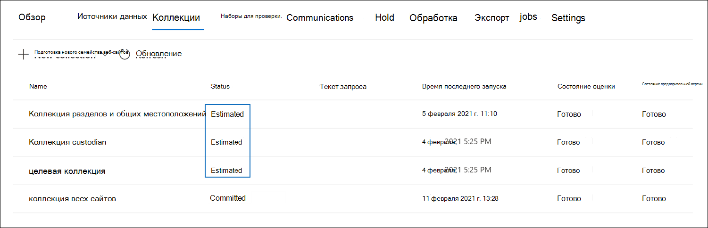

# Фиксация черновика коллекции в набор обзоров в advanced eDiscoveryCommit a draft collection to a review set in Advanced eDiscovery

Если вы удовлетворены элементами, собранными в коллекции черновиков, и готовы анализировать, теги и анализировать их, вы можете добавить коллекцию в набор отзывов в данном случае.When you're satisfied with the items you've collected in a draft collection and are ready to analyze, tag, and review them, you can add a collection to a review set in the case. При фиксации черновика коллекции в набор отзывов собранные элементы копируется из исходного расположения контента в Microsoft 365 в набор отзывов.When you commit a draft collection to a review set, collected items are copied from their original content location in Microsoft 365 to a review set. Набор отзывов — это безопасное хранилище Azure, предоставленное Майкрософт в облаке Microsoft.A review set is a secure, Microsoft-provided Azure Storage location in the Microsoft cloud.

## Фиксация коллекции черновиков в набор отзывовCommit a draft collection to a review set

1. В центре соответствия требованиям Microsoft 365 откройте дело Advanced eDiscovery, а затем выберите вкладку **Collections,** чтобы отобразить список коллекций в этом случае.In the Microsoft 365 compliance center, open the Advanced eDiscovery case, and then select the **Collections** tab to display a list of the collections in the case.

   

   > [!TIP]
   > Значение в `Estimated` столбце **Состояние** определяет черновики коллекций, которые можно добавить в набор отзывов.A value of `Estimated` in the **Status** column identifies the draft collections that can be added to a review set. Состояние `Committed` указывает, что коллекция уже добавлена в набор отзывов.A status of `Committed` indicates that a collection has already been added to a review set.

2. На странице **Коллекции выберите** черновик коллекции, который необходимо зафиксировать в наборе отзывов.On the **Collections** page, select the draft collection that you want to commit to a review set.

3. В нижней части страницы вылетов выберите коллекцию **Действия**  >  **Редактирование**.On the bottom of the flyout page, select **Actions** > **Edit collection**.

4. В мастере редактирования коллекции нажмите **кнопку Далее,** пока не будет отображаться черновик **сохранения** или страница сбора.In the edit collection wizard, click **Next** until the **Save draft or collect** page is displayed.

5. Настройте следующие параметры:Configure the following settings:

   1. Выберите **элементов Сбор и добавить в набор отзывов**.Select **Collect items and add to review set**.

   2. Решите, следует ли добавлять коллекцию в новый набор отзывов (который создается после отправки коллекции) или в существующий набор отзывов.Decide whether to add the collection to a new review set (which is created after you submit the collection) or to an existing review set. Заполните этот раздел в соответствии с вашим решением.Complete this section based on your decision.

   3. Настройка дополнительных параметров коллекции:Configure the additional collection settings:

       - **Teams and Yammer messages:** Select this option to add conversation threads to the collection that include the chat items returned by the search query in the collection.**Teams and Yammer messages**: Select this option to add conversation threads to the collection that include the chat items returned by the search query in the collection. Это означает, что диалог чата, содержащий элементы, которые соответствуют критериям поиска, реконструирован.This means that the chat conversation that contains items that match the search criteria is reconstructed. Это позволяет просмотреть элементы чата в контексте беседы взад и вперед.This lets you review chat items in the context of the back and forth conversation. Дополнительные сведения см. в дополнительных сведениях в потоке [Conversation in Advanced eDiscovery.](conversation-review-sets.md)For more information, see [Conversation threading in Advanced eDiscovery](conversation-review-sets.md).

       - **Облачные вложения.** Выберите этот параметр, чтобы включить современные вложения или связанные файлы при добавлении результатов коллекции в набор отзывов.**Cloud attachments**: Select this option to include modern attachments or linked files when the collection results are added to the review set. Это означает, что целевой файл современного вложения или связанного файла добавляется в набор отзывов.This means that the target file of a modern attachment or linked file is added to the review set.

       - **Версии SharePoint.** Выберите этот параметр, чтобы включить коллекцию всех версий документа SharePoint в пределах версии и параметрах поиска коллекции.**SharePoint versions**: Select this option to enable the collection of all version of a SharePoint document per the version limits and search parameters of the collection. Выбор этого параметра значительно увеличит размер элементов, добавленных в набор отзывов.Selecting this option will significantly increase the size of items that are added to the review set.

   4. Настройка параметров для определения масштабов коллекции для добавления в набор отзывов:Configure the settings to define the scale of the collection to add to the review set:

      - **Добавьте все результаты** коллекции: Выберите этот параметр, чтобы добавить в набор отзывов все элементы, которые соответствуют критериям поиска коллекции.**Add all collection results**: Select this option to add all the items that match the search criteria of the collection to the review set.

      - **Добавьте пример результатов** коллекции: Выберите этот параметр, чтобы добавить пример результатов коллекции в набор отзывов вместо добавления всех результатов.**Add a sample of the collection results**: Select this option to add a sample of the collection results to the review set instead of adding all results. Если вы выбрали этот параметр, нажмите **кнопку Изменить параметры выборки** и выберите один из следующих вариантов:If you select this option, click **Edit sample parameters** and choose one of the following options:

         - **Пример, основанный на** уверенности. Элементы из коллекции добавляются в набор отзывов, определяются по заданным статистическим параметрам.**Sample based on confidence**: Items from the collection are added to the review set will be determined by the statistical parameters that you set. Если при отборе результатов выборки обычно используется уровень доверия и интервал, укажите их в выпадаемом поле.If you typically use a confidence level and interval when sampling results, specify them in the drop-down boxes. В противном случае используйте параметры по умолчанию.Otherwise, use the default settings.

         - **Случайный пример.** Элементы из коллекции добавляются в набор отзывов на основе случайного выбора указанного процента от общего числа элементов, возвращаемого поиском.**Randomly sample**: Items from the collection are added to the review set based on a random selection of the specified percentage of the total number of items returned by the search.

6. На странице **Обзор коллекции** можно просмотреть параметры коллекции, настроенные на предыдущей странице.On the **Review your collection** page, you can review the collection settings that you configured on the previous page. Нажмите **кнопку Изменить,** если вы хотите изменить их.Click **Edit** if you want to change them.

7. Нажмите **Кнопку Отправить,** чтобы создать коллекцию черновиков.Click **Submit** to create the draft collection. Отображается страница, подтверждая, что коллекция создана.A page is displayed confirming that the collection was created.

## Что происходит после фиксации коллекции черновиковWhat happens after you commit a draft collection

При фиксации черновика коллекции в набор отзывов происходят следующие вещи:When you commit a draft collection to a review set, the following things happen:

- Запрос поиска коллекции снова запустится.The collection search query is run again. Это означает, что фактические результаты поиска, скопированные в набор отзывов, могут быть иными, чем предполагаемые результаты, возвращенные при последнем запуске поиска коллекции.This means the actual search results copied to the review set may be different than the estimated results that were returned when the collection search was last run.

- Все элементы в результатах поиска копируется из исходного источника данных в живой службе и копируется в безопасное хранилище Azure в облаке Microsoft.All items in the search results are copied from the original data source in the live service, and copied to a secure Azure Storage location in the Microsoft cloud.

- Все элементы (включая содержимое и метаданные), которые не находятся в источниках данных хранителя или не-хранителя, переиндексировать (в процессе, называемом глубокой индексализационной), чтобы все данные в наборе обзоров были полностью искомы во время проверки данных дела. All items (including the content and metadata) that aren't located in custodian or non-custodian data sources are reindexed (in a process called *deep indexing*) so that all data in the review set is fully searchable during the review of the case data. Повторное перенастройка контента в коллекции приводит к тщательному и быстрому поиску при поиске или фильтрации контента в обзоре, задамом во время расследования дела.Reindexing the content in a collection results in thorough and fast searches when you search or filter the content in the review set during the case investigation.

- Зашифрованные документы SharePoint и OneDrive, а также зашифрованные файлы, прикрепленные к сообщениям электронной почты, возвращаемой в результатах поиска, расшифровываются при фиксации коллекции в набор отзывов.Encrypted SharePoint and OneDrive documents and encrypted files attached email messages that's returned in the search results are decrypted when you commit the collection to a review set. Вы можете просмотреть и запросить расшифрованные файлы в наборе обзоров.You can review and query the decrypted files in the review set. Дополнительные сведения см. [в веб-сайте Расшифровка в средствах электронного разокрытия Microsoft 365.](ediscovery-decryption.md)For more information, see [Decryption in Microsoft 365 eDiscovery tools](ediscovery-decryption.md).

- Функции распознавания символов (OCR) извлекают текст из изображений и включают текст изображения с контентом, добавленным в набор отзывов.Optical character recognition (OCR) functionality extracts text from images, and includes the image text with the content that's added to a review set. Дополнительные сведения см. в разделе [Оптическое распознавание](#optical-character-recognition) символов в этой статье.For more information, see the [Optical character recognition](#optical-character-recognition) section in this article.

- После успешного завершения фиксации значение столбца состояния на вкладке **Collections** будет изменено на `Committed` .After the commit is successfully completed, the value of the status column of on the **Collections** tab is changed to `Committed`.

## Оптическое распознавание символовOptical character recognition

При фиксации коллекции на набор отзывов функции распознавания символов (OCR) в Advanced eDiscovery автоматически извлекают текст из изображений и включают текст изображения с контентом, добавленным в набор обзоров.When you commit a collection to a review set, optical character recognition (OCR) functionality in Advanced eDiscovery automatically extracts text from images, and includes the image text with the content that's added to a review set. Извлеченный текст можно просмотреть в текстовом представлении выбранного файла изображения в наборе обзоров.You can view the extracted text in the Text viewer of the selected image file in the review set. Это позволяет проводить дополнительные проверки и анализ текста на изображениях.This lets you conduct further review and analysis on text in images. OCR поддерживается для свободных файлов, вложений электронной почты и встроенных изображений.OCR is supported for loose files, email attachments, and embedded images. Список форматов файлов изображений, поддерживаемых для OCR, см. в списке Поддерживаемые типы файлов [в advanced eDiscovery.](supported-filetypes-ediscovery20.md#image)For a list of image file formats that are supported for OCR, see [Supported file types in Advanced eDiscovery](supported-filetypes-ediscovery20.md#image).

Необходимо включить функции OCR для каждого случая, который вы создаете в advanced eDiscovery.You have to enable OCR functionality for each case that you create in Advanced eDiscovery. Дополнительные сведения см. в настройках параметров поиска [и аналитики.](configure-search-and-analytics-settings-in-advanced-ediscovery.md#optical-character-recognition-ocr)For more information, see [Configure search and analytics settings](configure-search-and-analytics-settings-in-advanced-ediscovery.md#optical-character-recognition-ocr).
