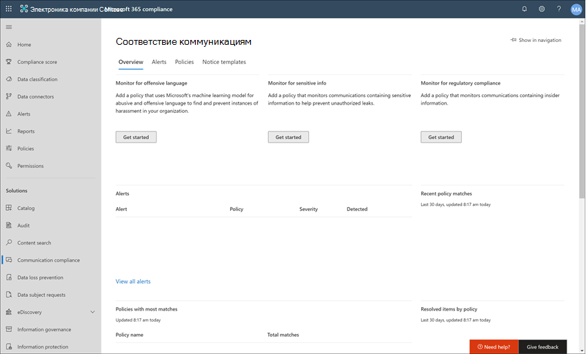
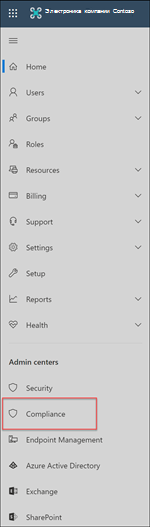
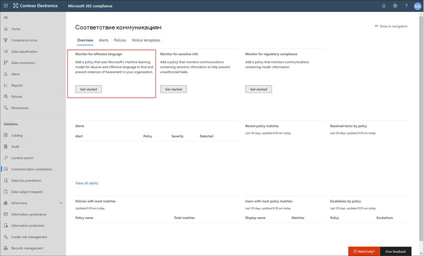

# Пример: Contoso быстро настраивает политику оскорбительных языков для microsoft Teams, Exchange и yammerCase study - Contoso quickly configures an offensive language policy for Microsoft Teams, Exchange, and Yammer communications

Соответствие коммуникации в Microsoft 365 помогает свести к минимуму риски для связи, помогая обнаруживать, захватывать и действовать над недопустимыми сообщениями в организации.Communication compliance in Microsoft 365 helps minimize communication risks by helping you detect, capture, and act on inappropriate messages in your organization. Предварительно определенные и настраиваемые политики позволяют проверять внутренние и внешние коммуникации на совпадения с политиками, чтобы их могли проверять назначенные рецензенты.Pre-defined and custom policies allow you to scan internal and external communications for policy matches so they can be examined by designated reviewers. Проверяющие могут изучить сканированную электронную почту, Microsoft Teams, Yammer или сторонние коммуникации в вашей организации и принять соответствующие меры по исправлению, чтобы убедиться, что они соответствуют стандартам вашей организации в отношении сообщений.Reviewers can investigate scanned email, Microsoft Teams, Yammer, or third-party communications in your organization and take appropriate remediation actions to make sure they're compliant with your organization's message standards.

Корпорация Contoso — это вымышленная организация, которая должна быстро настроить политику для отслеживания оскорбительных языков.The Contoso Corporation is a fictional organization that needs to quickly configure a policy to monitor for offensive language. Они в основном используют Microsoft 365 для поддержки электронной почты, Microsoft Teams и Yammer для своих пользователей, но предъявляют новые требования для применения политики компании в отношении запрета рабочих мест.They have been using Microsoft 365 primarily for email, Microsoft Teams, and Yammer support for their users but have new requirements to enforce company policy around workplace harassment. ИТ-администраторы Contoso и специалисты по обеспечению соответствия требованиям имеют базовое представление об основах работы с Microsoft 365 и ищут полное руководство по быстрому началу работы с соответствием требованиям к данным.Contoso IT administrators and compliance specialists have a basic understanding of the fundamentals of working with Microsoft 365 and are looking for end-to-end guidance for how to quickly get started with communication compliance.

В этом примере будут освещаться основные принципы быстрой настройки политики соответствия требованиям к коммуникациям для отслеживания сообщений на оскорбительные языки.This case study will cover the basics for quickly configuring a communication compliance policy to monitor communications for offensive language. В этом руководстве содержатся следующие рекомендации:This guidance includes:

- Шаг 1. Планирование соответствия требованиям к коммуникациямStep 1 - Planning for communication compliance
- Шаг 2. Доступ к требованиям для связи в Microsoft 365Step 2 - Accessing communication compliance in Microsoft 365
- Шаг 3. Настройка необходимых условий и создание политики соответствия требованиям к коммуникациямStep 3 - Configuring prerequisites and creating a communication compliance policy
- Шаг 4. Исследование и исправление оповещенийStep 4 - Investigation and remediation of alerts

## Шаг 1. Планирование соответствия требованиям к коммуникациямStep 1: Planning for communication compliance

ИТ-администраторы и специалисты по обеспечению соответствия требованиям компании Contoso участвовали в веб-вебинары по поводу решений для обеспечения соответствия требованиям в Microsoft 365 и решили, что политики соответствия требованиям к коммуникациям помогут им обеспечить соответствие обновленным требованиям корпоративной политики для сокращения рабочих мест.Contoso IT administrators and compliance specialists attended online webinars about compliance solutions in Microsoft 365 and decided that communication compliance policies will help them meet the updated corporate policy requirements for reducing workplace harassment. Совместно они разработали план создания и обеспечения соответствия требованиям к коммуникациям, который будет отслеживать оскорбительные языки для чатов, отправленных в Microsoft Teams, личных сообщений и бесед сообщества в Yammer, а также в сообщениях электронной почты, отправленных в Exchange Online.Working together, they've developed a plan to create and enable a communication compliance policy that will monitor for offensive language for chats sent in Microsoft Teams, private messages and community conversations in Yammer, and in email messages sent in Exchange Online. Их план включает определение:Their plan includes identifying:

- ИТ-администраторы, которые нуждаются в доступе к функциям соответствия требованиям к коммуникациям.The IT administrators that need access to communication compliance features.
- Специалисты по обеспечению соответствия требованиям, которые должны создавать политики связи и управлять ими.The compliance specialists that need to create and manage communication policies.
- Специалисты по обеспечению соответствия требованиям и другие коллеги из других отделов (отдел кадров, юридические отделы и т. д.), которые должны изучить и отлажить оповещения о соответствии коммуникации требованиям.The compliance specialists and other colleague in other departments (Human Resources, Legal, etc.) that need to investigate and remediate communication compliance alerts.
- Пользователи, которые будут в области применения политики оскорбительных языковых стандартов для соответствия коммуникациям.The users that will be in-scope for the communication compliance offensive language policy.

### ЛицензированиеLicensing

Сначала необходимо подтвердить, что лицензирование Microsoft 365 корпорации Contoso включает поддержку решения для обеспечения соответствия требованиям к данным.The first step is to confirm that Contoso's Microsoft 365 licensing includes support for the communication compliance solution. Чтобы получить доступ к требованиям и использовать соответствие требованиям к коммуникациям, ИТ-администраторам Contoso необходимо убедиться, что в contoso есть одно из следующих средств:To access and use communication compliance, Contoso IT administrators need to verify that Contoso has one of the following:

- Подписка microsoft 365 E5 (платная или пробная версия)Microsoft 365 E5 subscription (paid or trial version)
- Подписка microsoft 365 E3 + надстройка соответствия требованиям Microsoft 365 E5Microsoft 365 E3 subscription + the Microsoft 365 E5 Compliance add-on
- Подписка microsoft 365 E3 + надстройка Microsoft 365 E5 Insider Risk ManagementMicrosoft 365 E3 subscription + the Microsoft 365 E5 Insider Risk Management add-on
- Подписка на Microsoft 365 A5 (платная или пробная версия)Microsoft 365 A5 subscription (paid or trial version)
- Подписка на Microsoft 365 A3 + надстройка соответствия требованиям Microsoft 365 A5Microsoft 365 A3 subscription + the Microsoft 365 A5 Compliance add-on
- Подписка на Microsoft 365 A3 + надстройка microsoft 365 A5 Insider Risk ManagementMicrosoft 365 A3 subscription + the Microsoft 365 A5 Insider Risk Management add-on
- Подписка на Microsoft 365 G5 (платная или пробная версия)Microsoft 365 G5 subscription (paid or trial version)
- Подписка на Microsoft 365 G5 + надстройка соответствия требованиям Microsoft 365 G5Microsoft 365 G5 subscription + the Microsoft 365 G5 Compliance add-on
- Подписка на Microsoft 365 G5 + надстройка Microsoft 365 G5 Insider Risk ManagementMicrosoft 365 G5 subscription + the Microsoft 365 G5 Insider Risk Management add-on
- Подписка на Office 365 корпоративный E5 (платная или пробная версия)Office 365 Enterprise E5 subscription (paid or trial version)
- Подписка на Office 365 корпоративный E3 + надстройка Office 365 Advanced Compliance (больше недоступна для новых подписок, см. примечание)Office 365 Enterprise E3 subscription + the Office 365 Advanced Compliance add-on (no longer available for new subscriptions, see note)

Они также должны подтвердить, что пользователям, включенным в политики соответствия коммуникациям, должна быть назначена одна из вышеуказанных лицензий.They must also confirm that users included in communication compliance policies must be assigned one of the licenses above.

>[!IMPORTANT]
>Office 365 Advanced Compliance больше не продается в качестве автономных подписок.Office 365 Advanced Compliance is no longer sold as a standalone subscription. По истечении срока действия текущих подписок клиенты должны перейти на одну из вышеперечисленной подписки, которая содержит те же или дополнительные функции соответствия требованиям.When current subscriptions expire, customers should transition to one of the subscriptions above, which contain the same or additional compliance features.

ИТ-администраторы Contoso принимают следующие меры для проверки поддержки лицензирования для Contoso:Contoso IT administrators take the following steps to verify the licensing support for Contoso:

1. ИТ-администраторы войдите в Центр администрирования **Microsoft 365** [( https://admin.microsoft.com)](https://admin.microsoft.com) и перейдите в Центр администрирования Microsoft **365.**  >    >  IT administrators sign in to the **Microsoft 365 admin center** [(https://admin.microsoft.com)](https://admin.microsoft.com) and navigate to **Microsoft 365 admin center** > **Billing** > **Licenses**.

2. Здесь они подтверждают, что у них есть один из [вариантов](communication-compliance-configure.md#subscriptions-and-licensing) лицензирования, который включает поддержку соответствия коммуникаций.Here they confirm that they have one of the [license options](communication-compliance-configure.md#subscriptions-and-licensing) that includes support for communication compliance.

### Разрешения для обеспечения соответствия требованиям к коммуникациямPermissions for communication compliance

Существует пять групп ролей, используемых для настройки разрешений на управление функциями соответствия коммуникации требованиям.There are five role groups used to configure permissions to manage communication compliance features. Чтобы **сделать** соответствие требованиям к связи доступным в качестве меню в Центре соответствия требованиям Microsoft 365  и продолжить выполнение этих действий по настройке, администраторам Contoso назначена роль администратора соответствия требованиям связи.To make **Communication compliance** available as a menu option in Microsoft 365 compliance center and to continue with these configuration steps, Contoso administrators are assigned the *Communication Compliance Admin* role.

В компании Contoso  решили использовать группу ролей "Соответствие коммуникациям", назначив группе всех администраторов соответствия коммуникациям, аналитиков, следователей и посетителей.Contoso decides to use the *Communication Compliance* role group assign all the communication compliance administrators, analysts, investigators, and viewers  to the group. Это упрощает для Contoso быстрое начало работы и наилучшим образом отвечает их требованиям к управлению соответствием требованиям.This makes it easier for Contoso to get started quickly and best fits their compliance management requirements.

|**Role****Role**|**Разрешения роли****Role permissions**|
|:-----|:-----|
| **Соответствие требованиям к коммуникациям****Communication Compliance** | Используйте эту группу ролей для управления соответствием коммуникаций для организации в одной группе.Use this role group to manage communication compliance for your organization in a single group. Добавляя все учетные записи пользователей для назначенных администраторов, аналитиков, следователей и посетителей, вы можете настроить разрешения на соответствие коммуникациям в одной группе.By adding all user accounts for designated administrators, analysts, investigators, and viewers, you can configure communication compliance permissions in a single group. Эта группа ролей содержит все роли разрешений соответствия требованиям связи.This role group contains all the communication compliance permission roles. Эта конфигурация — самый простой способ быстро начать работу с соответствием требованиям к коммуникациям и подходит для организаций, не нуждающихся в отдельных разрешениях, определенных для отдельных групп пользователей.This configuration is the easiest way to quickly get started with communication compliance and is a good fit for organizations that do not need separate permissions defined for separate groups of users. |
| **Администратор соответствия требованиям к коммуникациям****Communication Compliance Admin** | Используйте эту группу ролей для первоначальной настройки соответствия коммуникации требованиям, а затем для разделения администраторов соответствия коммуникациям в определенную группу.Use this role group to initially configure communication compliance and later to segregate communication compliance administrators into a defined group. Пользователи, которые назначены этой группе ролей, могут создавать, читать, обновлять и удалять политики соответствия коммуникации, глобальные параметры и назначения групп ролей.Users assigned to this role group can create, read, update, and delete communication compliance policies, global settings, and role group assignments. Пользователи, которые назначены этой группе ролей, не могут просматривать оповещения о сообщениях.Users assigned to this role group cannot view message alerts. |
| **Аналитик соответствия коммуникациям****Communication Compliance Analyst** | Используйте эту группу для назначения разрешений пользователям, которые будут выступать в качестве аналитиков соответствия требованиям связи.Use this group to assign permissions to users that will act as communication compliance analysts. Пользователи, которые назначены этой группе ролей, могут просматривать политики, в которых они назначены в качестве проверяющих, просматривать метаданные сообщений (не содержимое сообщений), переададрастать на рассмотрение дополнительным рецензентам или отправлять уведомления пользователям.Users assigned to this role group can view policies where they are assigned as Reviewers, view message metadata (not message content), escalate to additional reviewers, or send notifications to users. Аналитики не могут разрешить ожидающих оповещений.Analysts cannot resolve pending alerts. |
| **Коммуникационный следователь по обеспечению соответствия требованиям****Communication Compliance Investigator** | Используйте эту группу для назначения разрешений пользователям, которые будут выступать в качестве следователей по обеспечению соответствия требованиям связи.Use this group to assign permissions to users that will act as communication compliance investigators. Пользователи, которые назначены этой группе ролей, могут просматривать метаданные и содержимое сообщений, довести их до дополнительных проверяющих, довести до дела Advanced eDiscovery, отправлять уведомления пользователям и разрешать оповещение.Users assigned to this role group can view message metadata and content, escalate to additional reviewers, escalate to an Advanced eDiscovery case, send notifications to users, and resolve the alert. |
| **Просмотр соответствия требованиям к коммуникациям****Communication Compliance Viewer** | Используйте эту группу для назначения разрешений пользователям, которые будут управлять отчетами о связи.Use this group to assign permissions to users that will manage communication reports. Пользователи, которые назначены этой группе ролей, могут получать доступ ко всем мини-приложениям отчетов на домашней странице соответствия требованиям связи и просматривать все отчеты о соответствии коммуникациям.Users assigned to this role group can access all reporting widgets on the communication compliance home page and can view all communication compliance reports. |

1. ИТ-администраторы Contoso во время входа на страницу разрешений Центра безопасности и соответствия требованиям **Office 365** [& (используя https://protection.office.com/permissions)](https://protection.office.com/permissions) учетные данные для учетной записи глобального администратора, и выберите ссылку для просмотра ролей в Microsoft 365 и управления ими.Contoso IT administrators sign into the **Office 365 Security & Compliance center** permissions page [(https://protection.office.com/permissions)](https://protection.office.com/permissions) using credentials for a global administrator account and select the link to view and manage roles in Microsoft 365.
2. В Центре **безопасности & соответствия** требованиям они  перейдите в "Разрешения" и выберите ссылку для просмотра и управления ролями в Office 365.In the **Security & Compliance Center**, they go to **Permissions** and select the link to view and manage roles in Office 365.
3. Администраторы выбирают группу ролей *"Соответствие* коммуникациям", а затем выбирают **"Изменить группу ролей".**The administrators select the *Communication Compliance* role group, then select **Edit role group**.
4. Администраторы выбирают **"Выбрать участников" в** левой области навигации, а затем выбирают **"Изменить".**The administrators select **Choose members** from the left navigation pane, then select **Edit**.
5. Они выбирают **"Добавить",** а затем установленный для всех пользователей Contoso, который будет управлять соответствием коммуникации требованиям, исследовать и проверять оповещения.They select **Add** and then select the checkbox for all Contoso users that will manage communication compliance, investigate, and review alerts.
6. Администраторы выбирают **"Добавить"** и **"Готово".**The administrators select **Add**, then select **Done**.
7. Они выбирают **"Сохранить",** чтобы добавить пользователей Contoso в группу ролей.They select **Save** to add Contoso users to the role group. Они выбирают **"Закрыть",** чтобы завершить действия.They select **Close** to complete the steps.

## Шаг 2. Доступ к обеспечению соответствия требованиям для связи в Microsoft 365Step 2: Accessing communication compliance in Microsoft 365

После настройки разрешений на соответствие коммуникациям ИТ-администраторы Contoso и специалисты по обеспечению соответствия требованиям, которые назначены группе ролей "Соответствие коммуникациям", могут получить доступ к решению для обеспечения соответствия требованиям в Microsoft 365.After configuring the permissions for communication compliance, Contoso IT administrators and compliance specialists assigned to the Communication Compliance role group can access the communication compliance solution in Microsoft 365. У ИТ-администраторов и специалистов по обеспечению соответствия требованиям Contoso есть несколько способов доступа к обеспечению соответствия требованиям связи и начала создания новой политики:Contoso IT administrators and compliance specialists have several ways to access communication compliance and get started creating a new policy:

- Запуск непосредственно из решения для обеспечения соответствия требованиям к коммуникациямStarting directly from the communication compliance solution
- Начиная с Центра соответствия требованиям Microsoft 365Starting from the Microsoft 365 compliance center
- Начиная с каталога решений Microsoft 365Starting from the Microsoft 365 solution catalog
- Начиная с Центра администрирования Microsoft 365Starting from the Microsoft 365 admin center

### Запуск непосредственно из решения для обеспечения соответствия требованиям к коммуникациямStarting directly from the communication compliance solution

Самый быстрый способ получить доступ к решению — войти непосредственно в решение для обеспечения соответствия требованиям к данным **(Communication** <https://compliance.microsoft.com/supervisoryreview> Compliance).The quickest way to access the solution is to sign in directly to the **Communication compliance** (<https://compliance.microsoft.com/supervisoryreview>) solution. По этой ссылке ИТ-администраторы и специалисты по обеспечению соответствия требованиям компании Contoso будут перенаправлены на информационную панель "Обзор соответствия требованиям связи", на которой можно быстро просмотреть состояние оповещений и создать новые политики из заранее определенных шаблонов.Using this link, Contoso IT administrators and compliance specialists will be directed to the communication compliance Overview dashboard where you can quickly review the status of alerts and create new policies from the pre-defined templates.

### Начиная с Центра соответствия требованиям Microsoft 365Starting from the Microsoft 365 compliance center

Еще один простой способ доступа к решению соответствия требованиям для ИТ-администраторов и специалистов по обеспечению соответствия требованиям contoso — войти непосредственно в Центр соответствия требованиям **Microsoft 365** [( https://compliance.microsoft.com)](https://compliance.microsoft.com).Another easy way for Contoso IT administrators and compliance specialists to access the communication compliance solution is to sign in directly to the **Microsoft 365 compliance center** [(https://compliance.microsoft.com)](https://compliance.microsoft.com). После выполнения входов пользователям просто  нужно выбрать "Показать все", чтобы  отобразить все решения для обеспечения соответствия требованиям, а затем выбрать решение для обеспечения соответствия требованиям для связи, чтобы начать работу.After signing in, users simply need to select the **Show all** control to display all the compliance solutions and then select the **Communication compliance** solution to get started.

### Начиная с каталога решений Microsoft 365Starting from the Microsoft 365 solution catalog

ИТ-администраторы Contoso и специалисты по обеспечению соответствия требованиям также могут получить доступ к решению для обеспечения соответствия требованиям связи, выбрав каталог решений Microsoft 365.Contoso IT administrators and compliance specialists could also choose to access the communication compliance solution by selecting the Microsoft 365 solution catalog. Выбрав раздел **"Каталог** в решениях" в левой области навигации в Центре соответствия требованиям **Microsoft 365,** они могут открыть каталог решений с описанием всех решений для обеспечения соответствия требованиям Microsoft 365. By selecting **Catalog** in **Solutions** section of the left navigation while in the **Microsoft 365 compliance center**, they can open the solution catalog listing all Microsoft 365 compliance solutions. Прокручивая вниз до раздела **"Управление** рисками для программы оценки риска", ИТ-администраторы Contoso могут выбрать соответствие требованиям к коммуникациям для начала работы.Scrolling down to the **Insider risk management** section, Contoso IT administrators can select Communication compliance to get started. ИТ-администраторы Contoso также решили использовать "Показать в области навигации", чтобы закрепить решение соответствия коммуникации в области навигации слева для более быстрого доступа при входе в систему.Contoso IT administrators also decide to use the Show in navigation control to pin the communication compliance solution to the left-navigation pane for quicker access when they sign in going forward.

### Начиная с Центра администрирования Microsoft 365Starting from the Microsoft 365 admin center

Чтобы получить доступ к требованиям связи при запуске из Центра администрирования Microsoft 365, ИТ-администраторы Contoso и специалисты по обеспечению соответствия требованиям войдите в Центр администрирования Microsoft 365 [ https://admin.microsoft.com) (](https://admin.microsoft.com) и перейдите в Центр администрирования **Microsoft 365**  >  **Compliance.**To access communication compliance when starting from the Microsoft 365 admin center, Contoso IT administrators and compliance specialists sign in to the Microsoft 365 admin center [(https://admin.microsoft.com)](https://admin.microsoft.com) and navigate to **Microsoft 365 admin center** > **Compliance**.

Это действие открывает Центр безопасности и соответствия требованиям **Office 365,** и им необходимо выбрать ссылку на Центр соответствия требованиям **Microsoft 365,** предоставленный в баннере в верхней части страницы.This action opens the **Office 365 Security and Compliance center**, and they must select the link to the **Microsoft 365 compliance center** provided in the banner at the top of the page.

Once in the **Microsoft 365 compliance center,** Contoso IT administrators select **Show all** to display the full list of compliance solutions.Once in the **Microsoft 365 compliance center**, Contoso IT administrators select **Show all** to display the full list of compliance solutions.

После выбора **"Показать все"** ИТ-администраторы Contoso могут получить доступ к решению соответствия требованиям к коммуникациям.After selecting **Show all**, the Contoso IT administrators can access the communication compliance solution.

## Шаг 3. Настройка необходимых условий и создание политики соответствия требованиям к коммуникациямStep 3: Configuring prerequisites and creating a communication compliance policy

Для начала работы с политикой соответствия коммуникациям ИТ-администраторам Contoso необходимо настроить несколько предварительных условий перед настройкой новой политики для отслеживания оскорбительных языков.To get started with a communication compliance policy, there are several prerequisites that Contoso IT administrators need to configure before setting up the new policy to monitor for offensive language. После выполнения этих предварительных условий ИТ-администраторы и специалисты по обеспечению соответствия требованиям компании Contoso могут настроить новую политику и специалисты по обеспечению соответствия требованиям, которые могут приступить к расследованию и исправлению любых созданных оповещений.After these prerequisites have been completed, Contoso IT administrators and compliance specialists can configure the new policy and compliance specialists can start investigation and remediating any generated alerts.

### Включение аудита в Microsoft 365Enabling auditing in Microsoft 365

Для обеспечения соответствия требованиям к связи требуются журналы аудита для показа оповещений и отслеживания действий по исправлению, принятых проверяющих.Communication compliance requires audit logs to show alerts and track remediation actions taken by reviewers. Журналы аудита — это сводка всех действий, связанных с определенной политикой организации или при любом изменении политики соответствия коммуникациям.The audit logs are a summary of all activities associated with a defined organizational policy or anytime there is a change to a communication compliance policy.

ИТ-администраторы Contoso  проверяют и заполняют пошаговую инструкцию по включению аудита.Contoso IT administrators review and complete the [step-by-step instructions](turn-audit-log-search-on-or-off.md) to turn on auditing. После того как они включут аудит, отобразилось сообщение о том, что журнал аудита находится в процессе подготовки и что они могут выполнить поиск через несколько часов после завершения подготовки.After they turn on auditing, a message is displayed that says the audit log is being prepared and that they can run a search in a couple of hours after the preparation is complete. ИТ-администраторы Contoso должны сделать это действие только один раз.The Contoso IT administrators only have to do this action once.

### Настройка клиента Yammer для работы в режиме nativeConfiguring Yammer tenant for Native Mode

Для обеспечения соответствия требованиям к коммуникациям необходимо, чтобы клиент Yammer для организации был в режиме native для отслеживания оскорбительных речи в личных сообщениях и общедоступных беседах сообщества.Communication compliance requires that the Yammer tenant for an organization is in Native Mode to monitor for offensive language in private messages and public community conversations.

ИТ-администраторы Contoso должны просмотреть сведения из статьи "Обзор нативного режима [Yammer" в Microsoft 365](https://docs.microsoft.com/yammer/configure-your-yammer-network/overview-native-mode) и следовать шагам по запуску средства миграции в статье "Настройка сети Yammer для нативного режима Для [Microsoft 365".](/yammer/configure-your-yammer-network/native-mode)Contoso IT administrators make sure they review the information in the [Overview of Yammer Native Mode in Microsoft 365 article](https://docs.microsoft.com/yammer/configure-your-yammer-network/overview-native-mode) and follow the steps for running the migration tool in the [Configure your Yammer network for Native Mode for Microsoft 365](/yammer/configure-your-yammer-network/native-mode) article.

### Настройка группы для пользователей, входящего в область действияSetting up a group for in-scope users

Специалисты по обеспечению соответствия требованиям Contoso хотят добавить всех пользователей в политику связи, которая будет отслеживать оскорбительные языки.Contoso compliance specialists want to add all users to the communication policy that will monitor for offensive language. Они могут добавить каждую учетную запись пользователя в политику отдельно, но решили, что это намного проще, и экономят время на использование группы рассылки **"Все** пользователи" для пользователей этой политики.They could decide to add each user account to the policy separately, but they've decided it is much easier and saves time to use an **All Users** distribution group for the users for this policy.

Им необходимо создать группу, включаемую всех пользователей Contoso, чтобы они могли предпринять следующие действия.They need to create a new group to include all Contoso users, so they take the following steps:

1. ИТ-администраторы Contoso войдите в Центр администрирования **Microsoft 365** [и https://admin.microsoft.com)](https://admin.microsoft.com) перейдите в Группу групп Центра администрирования Microsoft **365.**  >    >  Contoso IT administrators IT sign in to the **Microsoft 365 admin center** [(https://admin.microsoft.com)](https://admin.microsoft.com) and navigate to **Microsoft 365 admin center** > **Groups** > **Groups**.
2. Они выбирают **"Добавить группу"** и завершят мастер создания новой группы *Microsoft 365* или *группы рассылки.*They select **Add a group** and complete the wizard to create a new *Microsoft 365 group* or *Distribution group*.

    

3. После создания новой группы необходимо добавить в нее всех пользователей Contoso.After the new group is created, they need to add all Contoso users to the new group. Они открывают **Центр администрирования Exchange** [(и https://outlook.office365.com/ecp)](https://outlook.office365.com/ecp) переходят к группам получателей в Центре администрирования   >    >  **Exchange).**They open the **Exchange admin center** [(https://outlook.office365.com/ecp)](https://outlook.office365.com/ecp) and navigate to **Exchange admin center** > **recipients** > **groups**. ИТ-администраторы Contoso выбирают область членства и новую созданную  ими группу *"Все* сотрудники", а затем выберите "Изменить", чтобы добавить всех пользователей Contoso в новую группу в мастере.The Contoso IT administrators select the Membership area and the new *All Employees* group they created and select the **Edit** control to add all Contoso users to the new group in the wizard.

    

### Создание политики для отслеживания оскорбительных языковCreating the policy to monitor for offensive language

После выполнения всех необходимых условий ИТ-администраторы и специалисты по обеспечению соответствия требованиям в Компании Contoso готовы настроить политику соответствия требованиям к коммуникациям для отслеживания оскорбительных языков.With all the prerequisites completed, the IT administrators and the compliance specialists for Contoso are ready to configure the communication compliance policy to monitor for offensive language. С помощью нового шаблона политики оскорбительных языков настройка этой политики является простой и быстрой.Using the new offensive language policy template, configuring this policy is simple and quick.

1. ИТ-администраторы Contoso и специалисты по обеспечению соответствия требованиям  во время входов в Центр соответствия требованиям **Microsoft 365** и выбирают соответствие требованиям к коммуникациям в левой области навигации.The Contoso IT administrators and compliance specialists sign into the **Microsoft 365 compliance center** and select **Communication compliance** from the left navigation pane. Это действие открывает панель **мониторинга "Обзор"** с краткими ссылками на шаблоны политики соответствия требованиям к коммуникациям.This action opens the **Overview** dashboard that has quick links for communication compliance policy templates. Они выбирают шаблон **"Монитор для оскорбительных языков",** выбирая "Начало **работы"** для шаблона.They choose the **Monitor for offensive language** template by selecting **Get started** for the template.

    

2. В мастере шаблонов политик ИТ-администраторы Contoso и специалисты по обеспечению соответствия требованиям совместно заполняют три необходимых **поля:** имя **политики,** пользователи или группы для контроля и **рецензенты.**On the policy template wizard, the Contoso IT administrators and compliance specialists work together to complete the three required fields: **Policy name**, **Users or groups to supervise**, and **Reviewers**.
3. Так как мастер политики уже предлагает имя для политики, ИТ-администраторы и специалисты по обеспечению соответствия требованиям решили сохранить предложенное имя и сосредоточиться на остальных полях.Since the policy wizard has already suggested a name for the policy, the IT administrators and compliance specialists decide to keep the suggested name and focus on the remaining fields. Они выбирают группу *"Все* пользователи" для группы "Пользователи" или "Группы", чтобы контролировать поле, и выбирают специалистов по обеспечению соответствия требованиям, которые должны изучить и отлажить оповещения политики для поля **проверяющих.** They select the *All users* group for the **Users or groups to supervise** field and select the compliance specialists that should investigate and remediate policy alerts for the **Reviewers** field. Чтобы настроить политику и начать сбор сведений оповещений, выберите "Создать **политику".**The last step to configure the policy and start gathering alert information is to select **Create policy**.

    

## Шаг 4. Изучение и исправление оповещенийStep 4: Investigate and remediate alerts

После настройки политики соответствия требованиям к коммуникациям для отслеживания оскорбительных языков следующим шагом для специалистов по обеспечению соответствия требованиям Contoso будет исследование и исправление всех оповещений, созданных политикой.Now that the communication compliance policy to monitor for offensive language is configured, the next step for the Contoso compliance specialists will be to investigate and remediate any alerts generated by the policy. Чтобы политика полностью обработать коммуникации во всех каналах источника связи и отвести оповещения на информационной панели оповещений, необходимо до 24 **часов.**It will take up to 24 hours for the policy to fully process communications in all the communication source channels and for alerts to show up in the **Alert dashboard**.

После сгенерации оповещений специалисты  по обеспечению соответствия требованиям Contoso будут следовать инструкциям рабочего процесса для изучения и устранения проблем с оскорбительными языками.After alerts are generated, Contoso compliance specialists will follow the [workflow instructions](communication-compliance-investigate-remediate.md) to investigate and remediate offensive language issues.