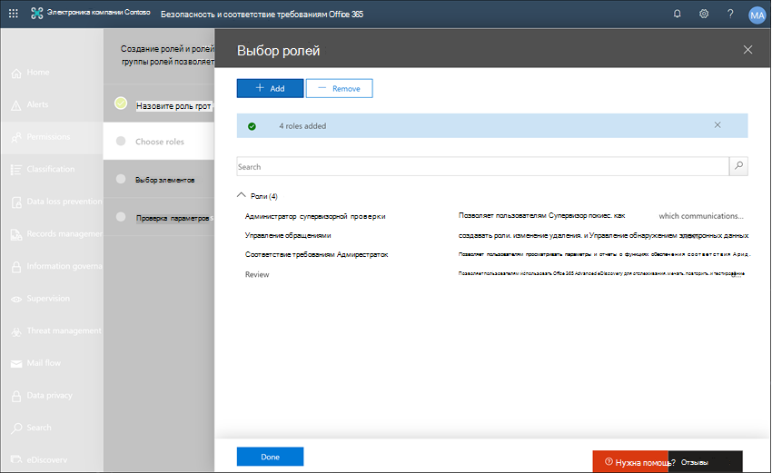
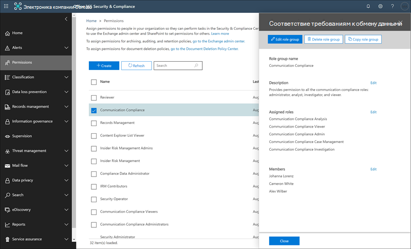

# Пример: компания Contoso быстро настраивает нежелательные языковые политики для Microsoft Teams и Exchange Communications.Case study - Contoso quickly configures an offensive language policy for Microsoft Teams and Exchange communications

Соответствие требованиям в Microsoft 365 помогает свести к минимуму риски для общения, помогая обнаруживать, записывать и устранять действия по устранению нежелательных сообщений в Организации.Communication compliance in Microsoft 365 helps minimize communication risks by helping you detect, capture, and take remediation actions for inappropriate messages in your organization. Предопределенные и настраиваемые политики позволяют сканировать внутренние и внешние коммуникации для соответствия политике, чтобы их можно было проверить при помощи определенных рецензентов.Pre-defined and custom policies allow you to scan internal and external communications for policy matches so they can be examined by designated reviewers. Рецензенты могут исследовать отсканированную электронную почту, Microsoft Teams или сторонние коммуникации в Организации, а также выполнять соответствующие действия по исправлению, чтобы убедиться, что они соответствуют стандартам сообщений Организации.Reviewers can investigate scanned email, Microsoft Teams, or third-party communications in your organization and take appropriate remediation actions to make sure they're compliant with your organization's message standards.

Contoso Corporation — это вымышленная организация, которая должна быстро настроить политику для отслеживания нежелательного языка.The Contoso Corporation is a fictional organization that needs to quickly configure a policy to monitor for offensive language. Они используют Microsoft 365 в первую очередь для поддержки своих сотрудников по электронной почте и Microsoft Teams, но имеют новые требования для применения политики компании к преследованию в рабочем месте.They have been using Microsoft 365 primarily for email and Microsoft Teams support for their employees but have new requirements to enforce company policy around workplace harassment. ИТ — администраторы и специалисты по обеспечению соответствия требованиям имеют базовую информацию об основных принципах работы с Microsoft 365 и ищет полное руководство по быстрому началу работы с обеспечением соответствия требованиям.Contoso IT administrators and compliance specialists have a basic understanding of the fundamentals of working with Microsoft 365 and are looking for end-to-end guidance for how to quickly get started with communication compliance.

В этом практическом примере рассматриваются основные принципы быстрой настройки политики соответствия требованиям на связь для отслеживания взаимодействия на оскорбительном языке.This case study will cover the basics for quickly configuring a communication compliance policy to monitor communications for offensive language. В этом руководстве рассматриваются следующие рекомендации.This guidance includes:

- Шаг 1: Планирование обеспечения соответствия требованиямStep 1 - Planning for communication compliance
- Этап 2: доступ к данным о совместимости в Microsoft 365Step 2 - Accessing communication compliance in Microsoft 365
- Шаг 3: Настройка необходимых компонентов и создание политики соответствия требованиям к связиStep 3 - Configuring prerequisites and creating a communication compliance policy
- Шаг 4: исследование и устранение оповещенийStep 4 - Investigation and remediation of alerts

## Шаг 1: Планирование обеспечения соответствия требованиямStep 1 - Planning for communication compliance

ИТ-администраторы Contoso и специалисты по обеспечению соответствия требованиям, которые проведут интерактивные семинары о решениях по обеспечению соответствия требованиям в Microsoft 365 и решили, что политики соответствия требованиям обеспечивают соблюдение обновленных требований корпоративной политики для сокращения рабочей области. преследования.Contoso IT administrators and compliance specialists attended online webinars about compliance solutions in Microsoft 365 and decided that communication compliance policies will help them meet the updated corporate policy requirements for reducing workplace harassment. Работая вместе, мы разработали план создания и включения политики соответствия требованиям к связи, которая будет отслеживать нежелательный язык для сеансов, отправляемых в Microsoft Teams в сообщениях электронной почты, отправленных в Exchange Online.Working together, they've developed a plan to create and enable a communication compliance policy that will monitor for offensive language for chats sent in Microsoft Teams in email messages sent in Exchange Online. Их план включает определение:Their plan includes identifying:

- ИТ администраторам, которым необходим доступ к функциям обеспечения соответствия требованиям.The IT administrators that need access to communication compliance features.
- Специалисты по обеспечению соответствия требованиям, которые необходимы для создания политик связи и управления ими.The compliance specialists that need to create and manage communication policies.
- Специалисты по обеспечению соответствия требованиям и другие коллеги в других отделах (Отдел кадров, юридические и т. д.), которые необходимы для исследования и исправления оповещений о соответствии в общении.The compliance specialists and other colleague in other departments (Human Resources, Legal, etc.) that need to investigate and remediate communication compliance alerts.
- Пользователи, которые будут находиться в области для политики "нежелательные требования к общению".The users that will be in-scope for the communication compliance offensive language policy.

### ЛицензированиеLicensing

Первым шагом является подтверждение того, что лицензирование Microsoft 365 для Contoso включает поддержку решения для обеспечения соответствия требованиям.The first step is to confirm that Contoso's Microsoft 365 licensing includes support for the communication compliance solution. Чтобы получить доступ к условиям связи и использовать ее, ИТ, администраторы Contoso должны убедиться в том, что у компании Contoso есть одно из следующих действий:To access and use communication compliance, Contoso IT administrators need to verify that Contoso has one of the following:

- Подписка на Microsoft 365 (платная или пробная версия)Microsoft 365 E5 subscription (paid or trial version)
- Лицензия на Office 365 корпоративный E3 с дополнительным соответствием требованиямOffice 365 Enterprise E3 license with the Advanced Compliance add-on
- Подписка на Office 365 корпоративный (платная или пробная версия)Office 365 Enterprise E5 subscription (paid or trial version)

Кроме того, необходимо убедиться, что пользователи, включенные в политики соответствия требованиям к связи, должны быть назначены одной из перечисленных выше лицензий.They must also confirm that users included in communication compliance policies must be assigned to one of the licenses listed above.

Для проверки поддержки лицензирования в компании Contoso ИТ Administrators должны выполнить следующие действия:Contoso IT administrators take the following steps to verify the licensing support for Contoso:

1. ИТ-администраторы входят в **центр администрирования Microsoft 365** [https://admin.microsoft.com) (](https://admin.microsoft.com) и отключаются**лицензии**на**выставление счетов** > для **центра** > администрирования Майкрософт 365.IT administrators sign in to the **Microsoft 365 admin center** [(https://admin.microsoft.com)](https://admin.microsoft.com) and navigate to **Microsoft 365 admin center** > **Billing** > **Licenses**.

2. Здесь мы подтверждаем, что у них есть один из [вариантов лицензирования](https://docs.microsoft.com/microsoft-365/compliance/communication-compliance-configure?view=o365-worldwide#before-you-begin) , включающий поддержку обеспечения соответствия связи.Here they confirm that they have one of the [license options](https://docs.microsoft.com/microsoft-365/compliance/communication-compliance-configure?view=o365-worldwide#before-you-begin) that includes support for communication compliance.

### Разрешения для обеспечения соответствия требованиямPermissions for communication compliance

По умолчанию глобальные администраторы не имеют доступа к функциям обеспечения соответствия требованиям.By default, Global Administrators do not have access to communication compliance features. [Разрешения должны быть настроены](https://docs.microsoft.com/microsoft-365/compliance/communication-compliance-configure?view=o365-worldwide#step-1-required-enable-permissions-for-communication-compliance) таким образом, чтобы администраторы ИТ и специалисты по обеспечению соответствия требованиям могли получать доступ к данным.[Permissions must be configured](https://docs.microsoft.com/microsoft-365/compliance/communication-compliance-configure?view=o365-worldwide#step-1-required-enable-permissions-for-communication-compliance) so that Contoso IT administrators and compliance specialists have access to communication compliance.

1. ИТ-администраторы Contoso подписываются на страницу разрешений **центра безопасности и соответствия требованиям Office 365** [(https://protection.office.com/permissions) ](https://protection.office.com/permissions) используя учетные данные для учетной записи глобального администратора и выбираете ссылку для просмотра ролей в Office 365 и управления ими.Contoso IT administrators sign into the **Office 365 Security and Compliance center** permissions page [(https://protection.office.com/permissions)](https://protection.office.com/permissions) using credentials for a global administrator account and select the link to view and manage roles in Office 365.
2. После выбора параметра **создать**назначьте новой группе ролей понятное имя "*соответствие условиям связи*" и нажмите кнопку **Далее**.After selecting **Create**, they give the new role group a friendly name of "*Communication compliance*" and select **Next**.
3. Выберите **пункт Выбрать роли** , а затем нажмите кнопку **Добавить**.They select **Choose roles** and then select **Add**. Они добавляют необходимые роли, устанавливая флажок для *администратора администратора*, *управления обращениями, управления обращениями*, *администратора соответствия требованиям*и *проверки*, а затем набирая " **Добавить**", " **Готово** " и " **Далее**".They add the required roles by selecting the checkbox for *Supervisory Review Administrator*, *Case Management*, *Compliance Administrator*, and *Review*, then they select **Add**, **Done,** and **Next**.

4. Затем ИТ — администраторы, выбрав **пункт Выбрать участников** , а затем нажмите кнопку **Добавить**.Next, the IT administrators select **Choose members** then select **Add**. Установите флажок для всех пользователей и групп, которым требуется создать политики, и управления сообщениями с соответствием политик.The select the checkbox for all the users and groups that they want to create policies and manage messages with policy matches. Они добавляют ИТ ИТ — администраторы, специалисты по обеспечению соответствия требованиям и другие коллеги в отделе кадров и юридических отделов, которые были идентифицированы в первоначальном планировании, а затем последовательно выберите пункты **Добавить**, **Готово**и **Далее**.They add the IT administrators, compliance specialists, and other colleagues in Human Resources and Legal departments that they identified in the initial planning, then select **Add**, **Done**, and **Next**.
5. Для завершения разрешений ИТ, администраторы могут выбрать команду **создать группу ролей** , чтобы завершить работу.To finalize the permissions, the IT administrators select **Create role group** to finish. Для эффективного использования ролей в службе Microsoft 365 в компании Contoso потребуется около 30 минут.It will take about 30 minutes for the roles to be effective in Contoso's Microsoft 365 service.

## Этап 2: доступ к данным о совместимости в Microsoft 365Step 2 - Accessing communication compliance in Microsoft 365

После настройки разрешений для обеспечения соответствия требованиям к общению администраторы и специалисты Contoso, определенные в новой группе ролей, могут получить доступ к решению для обеспечения соответствия требованиям в Microsoft 365.After configuring the permissions for communication compliance, Contoso IT administrators and compliance specialists defined in the new role group can access the communication compliance solution in Microsoft 365. ИТ — администраторы и специалисты по обеспечению соответствия требованиям имеют несколько способов доступа к обеспечению связи и приступить к созданию новой политики:Contoso IT administrators and compliance specialists have several ways to access communication compliance and get started creating a new policy:

- Запуск непосредственно из решения "соответствие условиям взаимодействия"Starting directly from the communication compliance solution
- Начиная с центра соответствия требованиям Microsoft 365Starting from the Microsoft 365 compliance center
- Начиная с каталога решений Microsoft 365Starting from the Microsoft 365 solution catalog
- Запуск из центра администрирования Microsoft 365Starting from the Microsoft 365 admin center

### Запуск непосредственно из решения "соответствие условиям взаимодействия"Starting directly from the communication compliance solution

Самый быстрый способ получить доступ к решению — выполнить вход непосредственно в решение " **соответствие требованиям** " (<https://compliance.microsoft.com/supervisoryreview>).The quickest way to access the solution is to sign in directly to the **Communication compliance** (<https://compliance.microsoft.com/supervisoryreview>) solution. С помощью этой ссылки администраторы и специалисты Contoso для ИТ будут направлены на информационную панель Обзор соответствия требованиям к общению, где можно быстро просмотреть состояние оповещений и создать новые политики на основе предварительно определенных шаблонов.Using this link, Contoso IT administrators and compliance specialists will be directed to the communication compliance Overview dashboard where you can quickly review the status of alerts and create new policies from the pre-defined templates.

### Начиная с центра соответствия требованиям Microsoft 365Starting from the Microsoft 365 compliance center

Другой простой способ доступа к решению для ИТ-администраторов и соответствия требованиям для ИТ-специалистов Contoso заключается в прямом входе в **центр соответствия требованиям Microsoft 365** [(https://compliance.microsoft.com)](https://compliance.microsoft.com).Another easy way for Contoso IT administrators and compliance specialists to access the communication compliance solution is to sign in directly to the **Microsoft 365 compliance center** [(https://compliance.microsoft.com)](https://compliance.microsoft.com). После входа пользователям просто необходимо выбрать элемент элемент управления **Показать все** , чтобы отобразить все решения для обеспечения соответствия требованиям, а затем выбрать решение **соответствие требованиям** , чтобы приступить к работе.After signing in, users simply need to select the **Show all** control to display all the compliance solutions and then select the **Communication compliance** solution to get started.

### Начиная с каталога решений Microsoft 365Starting from the Microsoft 365 solution catalog

Администраторы и специалисты для ИТ, ответственные за обеспечение соответствия требованиям, могут также получить доступ к решению для обеспечения соответствия требованиям, выбрав Каталог решений Microsoft 365.Contoso IT administrators and compliance specialists could also choose to access the communication compliance solution by selecting the Microsoft 365 solution catalog. Выбрав **Каталог** в разделе **решения** в левой панели навигации в **центре соответствия требованиям Microsoft 365**, пользователи могут открыть каталог решений со списком всех решений Microsoft 365 о соответствии требованиям.By selecting **Catalog** in **Solutions** section of the left navigation while in the **Microsoft 365 compliance center**, they can open the solution catalog listing all Microsoft 365 compliance solutions. При прокрутке до раздела **Управление рисками для оценки** ИТ, администраторы Contoso могут выбрать соответствие для начала работы.Scrolling down to the **Insider risk management** section, Contoso IT administrators can select Communication compliance to get started. ИТ-администраторы Contoso также решили использовать элемент управления "Показать в структуре навигации", чтобы закрепить решение для обеспечения соответствия требованиям в левой области навигации для быстрого доступа при входе.Contoso IT administrators also decide to use the Show in navigation control to pin the communication compliance solution to the left-navigation pane for quicker access when they sign in going forward.

### Запуск из центра администрирования Microsoft 365Starting from the Microsoft 365 admin center

Чтобы получить доступ к обеспечению связи при запуске из центра администрирования Microsoft 365, администраторы и специалисты Contoso ИТ-специалисты и специалисты по обеспечению соответствия входят в центр администрирования Майкрософт 365 [https://admin.microsoft.com) (](https://admin.microsoft.com) и перейдите к разделу **Microsoft 365** > для**обеспечения соответствия требованиям**в центре администрирования).To access communication compliance when starting from the Microsoft 365 admin center, Contoso IT administrators and compliance specialists sign in to the Microsoft 365 admin center [(https://admin.microsoft.com)](https://admin.microsoft.com) and navigate to **Microsoft 365 admin center** > **Compliance**.

Откроется **Центр безопасности и соответствия требованиям Office 365**, и необходимо выбрать ссылку на **центр соответствия требованиям Microsoft 365** , приведенный в баннере в верхней части страницы.This opens the **Office 365 Security and Compliance center**, and they must select the link to the **Microsoft 365 compliance center** provided in the banner at the top of the page.

В **центре соответствия требованиям Microsoft 365**администраторы ИТ, которым требуется отобразить полный список решений для обеспечения соответствия требованиям, выберите **Показать все** .Once in the **Microsoft 365 compliance center**, Contoso IT administrators select **Show all** to display the full list of compliance solutions.

После выбора пункта **Показать все**ИТ администраторы Contoso могут получать доступ к решению о соответствии требованиям.After selecting **Show all**, the Contoso IT administrators can access the communication compliance solution.

## Шаг 3: Настройка необходимых компонентов и создание политики соответствия требованиям к связиStep 3 - Configuring prerequisites and creating a communication compliance policy

Чтобы приступить к работе с политикой соответствия требованиям, существует несколько предварительных требований, которые необходимо настроить для ИТ, прежде чем настройка новой политики для отслеживания нежелательного языка.To get started with a communication compliance policy, there are several prerequisites that Contoso IT administrators need to configure before setting up the new policy to monitor for offensive language. После выполнения этих предварительных требований администраторы и специалисты компании Contoso могут настроить новые политики и специалисты по обеспечению соответствия требованиям, которые могут начать исследование и устранение любые созданные оповещения.After these prerequisites have been completed, Contoso IT administrators and compliance specialists can configure the new policy and compliance specialists can start investigation and remediating any generated alerts.

### Включение аудита в Office 365Enabling auditing in Office 365

Для обеспечения соответствия требованиям необходимы журналы аудита для отображения оповещений и отслеживания действий по исправлению, выполняемых рецензентами.Communication compliance requires audit logs to show alerts and track remediation actions taken by reviewers. Журналы аудита представляют собой сводку по всем действиям, связанным с определенной организационной политикой, а также в случае изменения политики соответствия требованиям.The audit logs are a summary of all activities associated with a defined organizational policy or anytime there is a change to a communication compliance policy.

Администраторы Contoso ИТ просматривают и завершают пошаговые [инструкции](https://docs.microsoft.com/microsoft-365/compliance/turn-audit-log-search-on-or-off) по включению аудита.Contoso IT administrators review and complete the [step-by-step instructions](https://docs.microsoft.com/microsoft-365/compliance/turn-audit-log-search-on-or-off) to turn on auditing. После включения аудита отображается сообщение с сообщением о том, что журнал аудита подготовлен и может выполняться поиск в течение нескольких часов после завершения подготовки.After they turn on auditing, a message is displayed that says the audit log is being prepared and that they can run a search in a couple of hours after the preparation is complete. Это действие необходимо выполнять только один раз для администраторов contoso.The Contoso IT administrators only have to do this action once.

### Настройка группы для пользователей в областиSetting up a group for in-scope users

Специалисты по обеспечению соответствия требованиям Contoso хотят добавить всех сотрудников в политику связи, которая будет отслеживать нежелательный язык.Contoso compliance specialists want to add all employee to the communication policy that will monitor for offensive language. Они могут добавить каждую учетную запись пользователя сотрудника в политику отдельно, но они значительно упрощаются и сохраняют немало времени для использования группы рассылки " **все сотрудники** " для пользователей этой политики.They could decide to add each employee user account to the policy separately, but they've decided it is much easier and saves a lot of time to use an **All Employees** distribution group for the users for this policy.

Для этого необходимо создать новую группу, включающую всех сотрудников Contoso, чтобы выполнить следующие действия:They need to create a new group to include all Contoso employees, so they take the following steps:

1. ИТ-администраторы Contoso. Войдите в **центр администрирования Microsoft 365** [https://admin.microsoft.com) (](https://admin.microsoft.com) и перейдите**Groups** > **группам** **центра** > администрирования Microsoft 365.Contoso IT administrators IT sign in to the **Microsoft 365 admin center** [(https://admin.microsoft.com)](https://admin.microsoft.com) and navigate to **Microsoft 365 admin center** > **Groups** > **Groups**.
2. Выберите команду **Добавить группу** и завершите работу мастера, чтобы создать *группу Office 365* или *группу рассылки*.They select **Add a group** and complete the wizard to create a new *Office 365 group* or *Distribution group*.

3. После создания новой группы необходимо добавить всех пользователей Contoso в новую группу.After the new group is created, they need to add all Contoso users to the new group. Откройте >  **центр** [https://outlook.office365.com/ecp) ](https://outlook.office365.com/ecp) администрирования Exchange и перейдите в раздел**группы\*\*\*\*получателей** >  **центра администрирования Exchange**.They open the **Exchange admin center** [(https://outlook.office365.com/ecp)](https://outlook.office365.com/ecp) and navigate to **Exchange admin center** > **recipients** > **groups**. Администраторы Contoso для ИТ выбирают область членства и новую группу *все сотрудники* , а затем выбирают элемент управления **редактированием** , чтобы добавить всех сотрудников Contoso в новую группу в мастере.The Contoso IT administrators select the Membership area and the new *All Employees* group they created and select the **Edit** control to add all Contoso employees to the new group in the wizard.

### Создание политики для отслеживания нежелательных языковCreating the policy to monitor for offensive language

После завершения всех необходимых условий ИТ ИТ и специалисты по обеспечению соответствия требованиям для Contoso готовы к настройке политики соответствия требованиям к связи для отслеживания нежелательного языка.With all the prerequisites completed, the IT administrators and the compliance specialists for Contoso are ready to configure the communication compliance policy to monitor for offensive language. С помощью нового шаблона "нежелательные языковые политики" Настройка этой политики проста и быстра.Using the new offensive language policy template, configuring this policy is simple and quick.

1. Администраторы и специалисты для ИТ, ответственные за обеспечение соответствия требованиям, подписываются в **центр соответствия требованиям Microsoft 365** и выбирают **соответствие** в левой области навигации.The Contoso IT administrators and compliance specialists sign into the **Microsoft 365 compliance center** and select **Communication compliance** from the left navigation pane. Это действие открывает панель мониторинга с **обзором** , которая содержит быстрые ссылки на шаблоны политики соответствия требованиям для связи.This action opens the **Overview** dashboard that has quick links for communication compliance policy templates. Выберите пункт **начать работу** с шаблоном **для нежелательного языка** .They choose the **Monitor for offensive language** template by selecting **Get started** for the template.

2. В мастере шаблонов политики сотрудники ИТ и соответствия требованиям Contoso работают вместе для заполнения трех обязательных полей: **имя политики**, **Пользователи или группы для**контроля и **проверяющих**.On the policy template wizard, the Contoso IT administrators and compliance specialists work together to complete the three required fields: **Policy name**, **Users or groups to supervise**, and **Reviewers**.
3. Так как мастер политики уже предложил имя для политики, ИТ, ИТ, администраторы и специалисты по обеспечению соответствия требованиям решили оставить предлагаемое имя и сосредоточиться на остальных полях.Since the policy wizard has already suggested a name for the policy, the IT administrators and compliance specialists decide to keep the suggested name and focus on the remaining fields. Они выбирают группу " *все сотрудники* " для поля " **Пользователи" или "группы" для** контроля и выбора специалистов по обеспечению соответствия требованиям, которые должны исследовать и исправлять оповещения политики для поля " **рецензенты** ".They select the *All employees* group for the **Users or groups to supervise** field and select the compliance specialists that should investigate and remediate policy alerts for the **Reviewers** field. Последний шаг для настройки политики и сбора сведений оповещения начинается с выбора параметра **создать политику**.The last step to configure the policy and start gathering alert information is to select **Create policy**.

## Шаг 4: исследование и исправление оповещенийStep 4 – Investigate and remediate alerts

Теперь, когда политика соответствия требованиям к общению для отслеживания для оскорбительного языка настроена, следующий шаг для специалистов по обеспечению соответствия требованиям Contoso будет проверять и исправлять все оповещения, созданные политикой.Now that the communication compliance policy to monitor for offensive language is configured, the next step for the Contoso compliance specialists will be to investigate and remediate any alerts generated by the policy. Для полной обработки взаимодействия во всех исходных каналах связи и отображения оповещений в **панели мониторинга оповещений**потребуется до 24 часов.It will take up to 24 hours for the policy to fully process communications in all the communication source channels and for alerts to show up in the **Alert dashboard**.

После создания оповещений специалисты по обеспечению соответствия требованиям в соответствии с инструкциями по работе с [рабочими процессами](https://docs.microsoft.com/microsoft-365/compliance/communication-compliance-investigate-remediate) помогут выявить и устранить проблемы с оскорбительным языком.After alerts are generated, Contoso compliance specialists will follow the [workflow instructions](https://docs.microsoft.com/microsoft-365/compliance/communication-compliance-investigate-remediate) to investigate and remediate offensive language issues.
