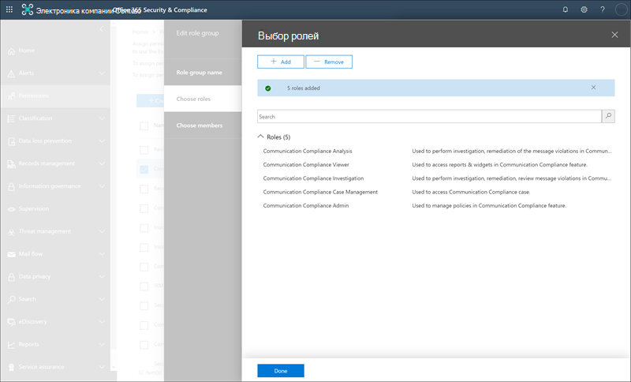

# Начало работы с соответствием требованиям к обмену даннымиGet started with communication compliance

Используйте политики соответствия требованиям для определения взаимодействия пользователей для изучения внутренними или внешними проверяющими.Use communication compliance policies to identify user communications for examination by internal or external reviewers. Для получения дополнительных сведений о том, как политики соответствия требованиям могут помочь отслеживать связи в Организации, ознакомьтесь со статьей [политики соответствия требованиям в Microsoft 365](communication-compliance.md).For more information about how communication compliance policies can help you monitor communications in your organization, see [communication compliance policies in Microsoft 365](communication-compliance.md). Если вы хотите узнать, как компания Contoso быстро настроила политику соответствия требованиям на связь для отслеживания нежелательных языков в Microsoft Teams, Exchange Online и коммуникаций в Yammer, ознакомьтесь со статьей этого [примера](communication-compliance-case-study.md).If you'd like to review how Contoso quickly configured a communication compliance policy to monitor for offensive language in Microsoft Teams, Exchange Online, and Yammer communications, check out this [case study](communication-compliance-case-study.md).

## Прежде чем начатьBefore you begin

Прежде чем приступить к работе с обеспечением соответствия требованиям, необходимо подтвердить вашу [подписку на Microsoft 365](https://www.microsoft.com/microsoft-365/compare-all-microsoft-365-plans) и все надстройки.Before you get started with communication compliance, you should confirm your [Microsoft 365 subscription](https://www.microsoft.com/microsoft-365/compare-all-microsoft-365-plans) and any add-ons. Чтобы получить доступ к условиям связи и использовать ее, ваша организация должна иметь одну из следующих подписок или надстроек:To access and use communication compliance, your organization must have one of the following subscriptions or add-ons:

- Подписка на Microsoft 365 (платная или пробная версия)Microsoft 365 E5 subscription (paid or trial version)
- Подписка на Microsoft 365 E3 + надстройка для обеспечения соответствия требованиям корпорации Майкрософт 365Microsoft 365 E3 subscription + the Microsoft 365 E5 Compliance add-on
- Подписка на Microsoft 365 E3 + надстройка "Управление рисками для Майкрософт 365 для участников программы предварительной оценки"Microsoft 365 E3 subscription + the Microsoft 365 E5 Insider Risk Management add-on
- Подписка на Microsoft 365 A5 (платная или пробная версия)Microsoft 365 A5 subscription (paid or trial version)
- Подписка на Microsoft 365 a3 и надстройка Microsoft 365 A5 для обеспечения соответствия требованиямMicrosoft 365 A3 subscription + the Microsoft 365 A5 Compliance add-on
- Подписка на Microsoft 365 a3 и надстройка "Управление рисками Майкрософт 365 A5"Microsoft 365 A3 subscription + the Microsoft 365 A5 Insider Risk Management add-on
- Подписка на Microsoft 365 G5 (платная или пробная версия)Microsoft 365 G5 subscription (paid or trial version)
- Подписка на Microsoft 365 G5 и надстройка для обеспечения соответствия требованиям корпорации Майкрософт 365 G5Microsoft 365 G5 subscription + the Microsoft 365 G5 Compliance add-on
- Подписка на Microsoft 365 G5 и надстройка "Управление рисками для Майкрософт 365 G5"Microsoft 365 G5 subscription + the Microsoft 365 G5 Insider Risk Management add-on
- Подписка на Office 365 корпоративный (платная или пробная версия)Office 365 Enterprise E5 subscription (paid or trial version)
- Подписка на Office 365 корпоративный E3 + расширенное соответствие требованиям Office 365 (для новых подписок больше недоступна. Примечание)Office 365 Enterprise E3 subscription + the Office 365 Advanced Compliance add-on (no longer available for new subscriptions, see note)

Пользователям, включенным в политики соответствия требованиям, должна быть назначена одна из указанных выше лицензий.Users included in communication compliance policies must be assigned one of the licenses above.

>[!IMPORTANT]
>Расширенное соответствие требованиям Office 365 больше не продается в виде автономной подписки.Office 365 Advanced Compliance is no longer sold as a standalone subscription. При истечении срока действия текущих подписок клиенты должны переходить на одну из упомянутых выше подписок, которые содержат одинаковые или дополнительные функции соответствия требованиям.When current subscriptions expire, customers should transition to one of the subscriptions above, which contain the same or additional compliance features.

Если у вас нет существующего плана Office 365 корпоративный, а вы хотите испытать ознакомительную версию управления рисками, вы можете [Добавить Microsoft 365](https://docs.microsoft.com/office365/admin/try-or-buy-microsoft-365) в существующую подписку или [зарегистрироваться для получения пробной](https://www.microsoft.com/microsoft-365/enterprise) версии Office 365 Enterprise ".If you don't have an existing Office 365 Enterprise E5 plan and want to try insider risk management, you can [add Microsoft 365](https://docs.microsoft.com/office365/admin/try-or-buy-microsoft-365) to your existing subscription or [sign up for a trial](https://www.microsoft.com/microsoft-365/enterprise) of Office 365 Enterprise E5.

## Шаг 1 (обязательный): Включение разрешений для обеспечения соответствия требованиямStep 1 (required): Enable permissions for communication compliance

>[!Important]
>По умолчанию глобальные администраторы не имеют доступа к функциям обеспечения соответствия требованиям.By default, Global Administrators do not have access to communication compliance features. Роли, назначенные на этом этапе, необходимы до того, как будут доступны все функции обеспечения соответствия для взаимодействия.The roles assigned in this step are required before any communication compliance features will be accessible.

Существует пять ролей, которые используются для настройки разрешений на управление функциями обеспечения соответствия в связи.There are five roles used to configure permissions to manage communication compliance features. Чтобы обеспечить **соответствие требованиям** в качестве варианта меню в центре соответствия требованиям Microsoft 365 и продолжить выполнение этих действий, необходимо назначить роль *администратора "соответствие требованиям"* .To make **Communication compliance** available as a menu option in Microsoft 365 compliance center and to continue with these configuration steps, you must be assigned the *Communication Compliance Admin* role.

В зависимости от того, как вы хотите управлять политиками связи и оповещениями, вам потребуется создать одну или несколько новых групп ролей для администраторов, проверяющих и обучений.Depending on how you wish to manage communication policies and alerts, you'll need to create one or more new role groups for administrators, reviewers, and investigators. Вы можете назначить пользователям определенные группы ролей для управления различными областями функций обеспечения соответствия.You have the option to assign users to specific role groups to manage different areas of communication compliance features. Вы также можете создать одну группу ролей и назначить все роли соответствия требованиям для группы.Or you may decide to create one role group and assign all the communication compliance roles to the group. Создайте одну группу ролей или несколько групп ролей, чтобы обеспечить соответствие требованиям к управлению соответствием требованиям.Create a single role group or multiple role groups to best fit your compliance management requirements.

Выберите эти параметры роли при настройке групп ролей "соответствие требованиям".Choose from these role options when configuring your communication compliance role groups:

|**Роль****Role**|**Разрешения роли****Role permissions**|
|:-----|:-----|
| **Администратор соответствия требованиям****Communication Compliance Admin** | Пользователи, которым назначена эта роль, могут создавать, читать, обновлять и удалять политики соответствия требованиям к связи, глобальные параметры и назначения групп ролей.Users assigned this role can create, read, update, and delete communication compliance policies, global settings, and role group assignments. Пользователи, которым назначена эта роль, не могут просматривать оповещения о сообщениях.Users assigned this role cannot view message alerts. |
| **Анализ соответствия требованиям****Communication Compliance Analysis** | Пользователи, которым назначена эта роль, могут просматривать политики, в которых они назначены рецензентами, просматривать метаданные сообщений (а не содержимое сообщений), повышать их до дополнительных рецензентов или отправлять уведомления пользователям.Users assigned this role can view policies where they are assigned as Reviewers, view message metadata (not message content), escalate to additional reviewers, or send notifications to users. Аналитики не могут разрешать ожидающие оповещения.Analysts cannot resolve pending alerts. |
| **Исследование соответствия требованиям****Communication Compliance Investigation** | Пользователи, которым назначена эта роль, могут просматривать метаданные и содержимое сообщений, повышать их до дополнительных проверяющих, расширялись до расширенного случая обнаружения электронных данных, отправки уведомлений пользователям и разрешения оповещения.Users assigned this role can view message metadata and content, escalate to additional reviewers, escalate to an Advanced eDiscovery case, send notifications to users, and resolve the alert. |
| **Средство просмотра соответствия требованиям****Communication Compliance Viewer** | Пользователи, которым назначена эта роль, могут получить доступ ко всем графическим элементам отчетов на домашней странице соответствия требованиям к связи и просматривать отчеты о соответствии требованиям.Users assigned this role can access all reporting widgets on the communication compliance home page and can view all communication compliance reports. |
| **Управление обращениями в отношении соответствия требованиям****Communication Compliance Case Management** | Пользователи, которым назначена эта роль, могут управлять обращениями и вести себя на оповещениях.Users assigned this role can manage cases and act on alerts. Эта роль необходима для создания пользовательских групп ролей для администраторов, аналитик и изучений.This role is required for when creating custom role groups for administrators, analysts, and investigators. Для настраиваемых групп для зрителей не требуется назначенная роль.Custom groups for viewers do not need this role assigned. |

### Вариант 1: создание новой группы ролей со всеми ролями соответствия требованиям к общениюOption 1: Create a new role group with all communication compliance roles

1. Войдите в систему [https://protection.office.com/permissions](https://protection.office.com/permissions) , используя учетные данные для учетной записи администратора в организации Microsoft 365.Sign into [https://protection.office.com/permissions](https://protection.office.com/permissions) using credentials for an admin account in your Microsoft 365 organization.

2. В центре безопасности &amp; и соответствия требованиям выберите **разрешения**.In the Security &amp; Compliance Center, go to **Permissions**. Выберите ссылку для просмотра ролей в Office 365 и управления ими.Select the link to view and manage roles in Office 365.

3. Нажмите **Создать**.Select **Create**.

4. В поле **имя** присвойте новой группе ролей понятное имя.In the **Name** field, give the new role group a friendly name. Нажмите кнопку **Далее**.Select **Next**.

5. Нажмите **кнопку Выбрать роли** , а затем нажмите кнопку **Добавить**.Select **Choose roles** and then select **Add**. Установите флажки для следующих ролей:Select the checkboxes for the following roles:

    - Администратор соответствия требованиямCommunication Compliance Admin
    - Анализ соответствия требованиямCommunication Compliance Analysis
    - Исследование соответствия требованиямCommunication Compliance Investigation
    - Средство просмотра соответствия требованиямCommunication Compliance Viewer
    - Управление обращениями в отношении соответствия требованиямCommunication Compliance Case Management

    

6. Выберите **Добавить** и **Готово**, а затем нажмите кнопку **Далее** , чтобы продолжить.select **Add** and **Done**, then select **Next** to continue.

7. Выберите **пункт Выбрать элементы** и нажмите кнопку **Добавить**.Select **Choose members** and then select **Add**. Установите флажок для всех пользователей и групп, для которых нужно создать политики, и управления сообщениями с соответствием политик, а затем нажмите кнопку **Добавить** и **выполнить**.Select the checkbox for all the users and groups you want create policies and manage messages with policy matches, then select **Add** and **Done**. Нажмите кнопку **Далее**.Select **Next**.

8. Выберите **создать группу ролей** для завершения.Select **Create role group** to finish.

### Вариант 2: создание новых групп ролей с разными ролями соответствия требованиям к общениюOption 2: Create new role groups with different communication compliance roles

Создайте несколько групп ролей, чтобы сегментировать доступ и обязанности по обеспечению связи между разными пользователями в Организации.Create multiple role groups to segment communication compliance access and responsibilities among different users in your organization. Для каждой новой группы ролей назначаются различные роли обеспечения соответствия требованиям.For each new role group, you'll assign different communication compliance roles.

1. Войдите в систему [https://protection.office.com/permissions](https://protection.office.com/permissions) , используя учетные данные для учетной записи администратора в организации Microsoft 365.Sign into [https://protection.office.com/permissions](https://protection.office.com/permissions) using credentials for an admin account in your Microsoft 365 organization.

2. В центре безопасности &amp; и соответствия требованиям выберите **разрешения**.In the Security &amp; Compliance Center, go to **Permissions**. Выберите ссылку для просмотра ролей в Office 365 и управления ими.Select the link to view and manage roles in Office 365.

3. Нажмите **Создать**.Select **Create**.

4. В поле **имя** присвойте новой группе ролей понятное имя.In the **Name** field, give the new role group a friendly name. Нажмите кнопку **Далее**.Select **Next**.

5. Нажмите **кнопку Выбрать роли** , а затем нажмите кнопку **Добавить**.Select **Choose roles** and then select **Add**. Установите флажок для ролей обеспечения связи, которые необходимо назначить этой группе.Select the checkbox for the communication compliance roles you want to assign to this group. Например, если эта группа ролей предназначена для аналитик соответствия требованиям в Организации, необходимо выбрать роли " *анализ соответствия требованиям на связь* " и " *Управление делами соответствия требованиям* ".For example, if this role group is for compliance analysts in your organization, you would select the *Communication Compliance Analysis* and *Communication Compliance Case Management* roles. Если эта группа ролей предназначена для исследований соответствия требованиям, выберите роли " *исследование соответствия требованиям* " и " *соответствие* требованиям".If this role group is for compliance investigators, you would select the *Communication Compliance Investigation* and *Communication Compliance Case Management* roles.

    

6. Выберите **Добавить** и **Готово**, а затем нажмите кнопку **Далее** , чтобы продолжить.Select **Add** and **Done**, then select **Next** to continue.

7. Выберите **пункт Выбрать элементы** и нажмите кнопку **Добавить**.Select **Choose members** and then select **Add**. Установите флажок для всех пользователей и групп, для которых нужно создать политики, и управления сообщениями с соответствием политик, а затем нажмите кнопку **Добавить** и **выполнить**.Select the checkbox for all the users and groups you want create policies and manage messages with policy matches, then select **Add** and **Done**. Нажмите кнопку **Далее**.Select **Next**.

8. Выберите **создать группу ролей** для завершения.Select **Create role group** to finish.

9. При необходимости создайте дополнительные группы ролей для обеспечения связи.Create additional communication compliance role groups as needed.

Дополнительные сведения о группах ролей и разрешениях см [в разделе разрешения в центре соответствия требованиям](../security/office-365-security/protect-against-threats.md).For more information about role groups and permissions, see [Permissions in the Compliance Center](../security/office-365-security/protect-against-threats.md).

## Шаг 2 (обязательный): Включение журнала аудитаStep 2 (required): Enable the audit log

Для обеспечения соответствия требованиям необходимы журналы аудита для отображения оповещений и отслеживания действий по исправлению, выполняемых рецензентами.Communication compliance requires audit logs to show alerts and track remediation actions taken by reviewers. Журналы аудита представляют собой сводку по всем действиям, связанным с определенной организационной политикой или в момент изменения политики соответствия.The audit logs are a summary of all activities associated with a defined organizational policy or anytime a communication compliance policy changes.

Пошаговые инструкции по включению аудита содержатся [в разделе Включение или отключение поиска в журнале аудита](turn-audit-log-search-on-or-off.md).For step-by-step instructions to turn on auditing, see [Turn audit log search on or off](turn-audit-log-search-on-or-off.md). После включения аудита отображается сообщение с сообщением о том, что журнал аудита подготавливается, и вы можете выполнить поиск в течение нескольких часов после завершения подготовки.After you turn on auditing, a message is displayed that says the audit log is being prepared and that you can run a search in a couple of hours after the preparation is complete. Это действие необходимо выполнить только один раз.You only have to do this action once. Для получения дополнительных сведений об использовании журнала аудита обратитесь к разделу [Поиск в журнале аудита](search-the-audit-log-in-security-and-compliance.md).For more information about the using the audit log, see [Search the audit log](search-the-audit-log-in-security-and-compliance.md).

## Шаг 3 (необязательно): Настройка групп для обеспечения соответствия требованиямStep 3 (optional): Set up groups for communication compliance

 При создании политики соответствия требованиям к общению вы определяете, кто просматривает свои сообщения и кто выполняет обзоры.When you create a communication compliance policy, you define who has their communications reviewed and who performs reviews. В политике адреса электронной почты используются для идентификации пользователей или групп людей.In the policy, you'll use email addresses to identify individuals or groups of people. Чтобы упростить настройку, вы можете создавать группы для пользователей, у которых есть свои сообщения и группы для людей, которые просматривают эти сообщения.To simplify your setup, you can create groups for people who have their communication reviewed and groups for people who review those communications. Если вы используете группы, вам может потребоваться несколько.If you're using groups, you may need several. Например, если вы хотите отслеживать связь между двумя отдельными группами людей или указать группу, которая не будет отслеживаться.For example, if you want to monitor communications between two distinct groups of people or if you want to specify a group that isn't going to be supervised.

Следующая диаграмма поможет настроить группы в Организации для политик соответствия требованиям.Use the following chart to help you configure groups in your organization for communication compliance policies:

| **Участник политики****Policy Member** | **Поддерживаемые группы****Supported Groups** | **Неподдерживаемые группы****Unsupported Groups** |
|:-----|:-----|:-----|
|Контролируемые пользователиSupervised users   Пользователи без прав на надзорNon-supervised users | Группы рассылкиDistribution groups   Группы Microsoft 365Microsoft 365 Groups | Динамические группы рассылкиDynamic distribution groups |
| РецензентыReviewers | НетNone | группы рассылки;Distribution groups   динамические группы рассылкиDynamic distribution groups   группы безопасности с включенной поддержкой почты.Mail-enabled security groups |
  
При назначении группы рассылки в политике она следит за всеми сообщениями электронной почты от каждого пользователя в группе рассылки.When you assign a distribution group in the policy, the policy monitors all emails from each user in distribution group. При назначении группы Microsoft 365 в политике политика отслеживает все сообщения электронной почты, отправляемые в эту группу, а не отдельные сообщения, полученные каждым участником группы.When you assign a Microsoft 365 group in the policy, the policy monitors all emails sent to that group, not the individual emails received by each group member.

Если вы работаете в Организации с локальным развертыванием Exchange или внешним поставщиком услуг электронной почты и хотите следить за обсуждениями Microsoft Teams для пользователей, необходимо создать группу рассылки для пользователей с локальными или внешними почтовыми ящиками, которые необходимо отслеживать.If you're an organization with an Exchange on-premises deployment or an external email provider and you want to monitor Microsoft Teams chats for your users, you must create a distribution group for the users with on-premises or external mailboxes to monitor. Далее в этих действиях вы назначаете эту группу рассылки в качестве выбранных в мастере политики **пользователей и групп** .Later in these steps, you'll assign this distribution group as the **Supervised users and groups** selection in the policy wizard.

>[!IMPORTANT]
>Необходимо создать запрос в службе поддержки Майкрософт, чтобы разрешить в Организации использование графического пользовательского интерфейса в центре безопасности & соответствия требованиям для поиска данных чата в Teams для локальных пользователей.You must file a request with Microsoft Support to enable your organization to use the graphical user interface in the Security & Compliance Center to search for Teams chat data for on-premises users. Дополнительные сведения см в разделе [Поиск в облачных почтовых ящиках для локальных пользователей](search-cloud-based-mailboxes-for-on-premises-users.md).For more information, see [Searching cloud-based mailboxes for on-premises users](search-cloud-based-mailboxes-for-on-premises-users.md).

Более подробную информацию о настройке групп можно узнать в следующих статьях:For more information about setting up groups, see:

- [Создание групп рассылки и управление имиCreate and manage distribution groups](https://docs.microsoft.com/Exchange/recipients-in-exchange-online/manage-distribution-groups/manage-distribution-groups)
- [Обзор групп Microsoft 365Overview of Microsoft 365 Groups](https://docs.microsoft.com/office365/admin/create-groups/office-365-groups?view=o365-worldwide)

## Шаг 4 (необязательно): Проверка того, что клиент Yammer работает в собственном режимеStep 4 (optional): Verify your Yammer tenant is in Native Mode

В собственном режиме все пользователи Yammer находятся в Azure Active Directory (AAD), все группы представляют собой группы Office 365, а все файлы хранятся в SharePoint Online.In Native Mode, all Yammer users are in Azure Active Directory (AAD), all groups are Office 365 Groups, and all files are stored in SharePoint Online. Клиент Yammer должен находиться в основном режиме для проверки и идентификации рискованных бесед в частных сообщениях и беседах сообщества в Yammer.Your Yammer tenant must be in Native Mode for communication compliance policies to scan and identify risky conversations in private messages and community conversations in Yammer.

Дополнительные сведения о настройке Yammer в собственном режиме можно найти в следующих статьях:For more information about configuring Yammer in Native Mode, see:

- [Обзор собственного режима Yammer в Microsoft 365Overview of Yammer Native Mode in Microsoft 365](https://docs.microsoft.com/yammer/configure-your-yammer-network/overview-native-mode)
- [Настройка сети Yammer для основного режима в Microsoft 365Configure your Yammer network for Native Mode for Microsoft 365](https://docs.microsoft.com/yammer/configure-your-yammer-network/native-mode)

## Шаг 5 (обязательный): Создание политики соответствия требованиям к общениюStep 5 (required): Create a communication compliance policy
  
>[!Important]
>Использование PowerShell для создания политик соответствия требованиям и управления ими не поддерживается.Using PowerShell to create and manage communication compliance policies is not supported. Для создания и управления этими политиками необходимо использовать элементы управления политикой управления политиками в [решении "соответствие требованиям Microsoft 365](https://compliance.microsoft.com/supervisoryreview)".To create and manage these policies, you must use the policy management controls in the [Microsoft 365 communication compliance solution](https://compliance.microsoft.com/supervisoryreview).

1. Войдите в систему [https://compliance.microsoft.com](https://compliance.microsoft.com) , используя учетные данные для учетной записи администратора в организации Microsoft 365.Sign into [https://compliance.microsoft.com](https://compliance.microsoft.com) using credentials for an admin account in your Microsoft 365 organization.

2. В центре соответствия требованиям Microsoft 365 выберите пункт **обеспечение соответствия условиям связи**.In the Microsoft 365 compliance center, select **Communication compliance**.
  
3. Перейдите на вкладку **политики** .Select the **Policies** tab.

4. Выберите **создать политику** , чтобы создать и настроить новую политику на основе шаблона или создать и настроить настраиваемую политику.Select **Create policy** to create and configure a new policy from a template or to create and configure a custom policy.

    Если вы выбрали шаблон политики для создания политики, вы будете:If you choose a policy template to create a policy, you will:

    - Подтвердите или обновите имя политики.Confirm or update the policy name. После создания политики имена политик не могут быть изменены.Policy names cannot be changed once the policy is created.
    - Выберите пользователей или группы для контролируемости, включая выбор пользователей или групп, которые вы хотите исключить.Choose the users or groups to supervise, including choosing users or groups you'd like to exclude.
    - Выберите проверяющих для политики.Choose the reviewers for the policy. Проверяющие являются отдельными пользователями, а все рецензенты должны размещать почтовые ящики в Exchange Online.Reviewers are individual users and all reviewers must have mailboxes hosted on Exchange Online. Рецензенты, добавленные здесь, это рецензенты, которые можно выбрать при эскалации оповещений в рабочем процессе расследования и исправлений.Reviewers added here are the reviewers that you can choose from when escalating an alert in the investigation and remediation workflow. Когда проверяющие добавляются в политику, они автоматически получают сообщение электронной почты с уведомлением о назначении на политику и предоставляет ссылки на сведения о процессе проверки.When reviewers are added to a policy, they automatically receive an email message that notifies them of the assignment to the policy and provides links to information about the review process.
    - Выберите ограниченное поле условия, обычно это тип конфиденциальной информации или словарь ключевых слов для применения к политике.Choose a limited condition field, usually a sensitive info type or keyword dictionary to apply to the policy.

    Если вы решили использовать мастер политик для создания настраиваемой политики, выполните следующие действия:If you choose to use the policy wizard to create a custom policy, you will:

    - Присвойте политике имя и описание.Give the policy a name and description. После создания политики имена политик изменить нельзя.Policy names can't be changed once the policy is created.
    - Выберите пользователей или группы для контролируемого, включая всех пользователей в Организации, отдельных пользователей и групп, а также других пользователей и групп, которые вы хотите исключить.Choose the users or groups to supervise, including all users in your organization, specific users and groups, or other users and groups you'd like to exclude.
    - Выберите проверяющих для политики.Choose the reviewers for the policy. Проверяющие являются отдельными пользователями, а все рецензенты должны размещать почтовые ящики в Exchange Online.Reviewers are individual users and all reviewers must have mailboxes hosted on Exchange Online. Рецензенты, добавленные здесь, это рецензенты, которые можно выбрать при эскалации оповещений в рабочем процессе расследования и исправлений.Reviewers added here are the reviewers that you can choose from when escalating an alert in the investigation and remediation workflow. Когда проверяющие добавляются в политику, они автоматически получают сообщение электронной почты с уведомлением о назначении на политику и предоставляет ссылки на сведения о процессе проверки.When reviewers are added to a policy, they automatically receive an email message that notifies them of the assignment to the policy and provides links to information about the review process.
    - Выберите каналы связи для сканирования, в том числе Exchange, Microsoft Teams, Yammer или Skype для бизнеса.Choose the communication channels to scan, including Exchange, Microsoft Teams, Yammer, or Skype for Business. Кроме того, вы можете проверить сторонние источники, если вы настроили соединитель в Microsoft 365.You'll also choose to scan third-party sources if you've configured a connector in Microsoft 365.
    - Выбор направления взаимодействия для отслеживания, в том числе входящих, исходящих или внутренних коммуникаций.Choose the communication direction to monitor, including inbound, outbound, or internal communications.
    - Определите [условия](communication-compliance-feature-reference.md#ConditionalSettings)политики соответствия требованиям к общению.Define the communication compliance policy [conditions](communication-compliance-feature-reference.md#ConditionalSettings). Можно выбрать адрес сообщения, ключевое слово, типы файлов и условия сравнения размеров.You can choose from message address, keyword, file types, and size match conditions.
    - Выберите, следует ли включить типы конфиденциальной информации.Choose if you'd like to include sensitive information types. На этом этапе можно выбрать стандартные и настраиваемые типы конфиденциальной информации.This step is where you can select default and custom sensitive info types. Выберите из существующих настраиваемых типов конфиденциальной информации или пользовательских словарей ключевых слов в мастере политики соответствия требованиям.Pick from existing custom sensitive information types or custom keyword dictionaries in the communication compliance policy wizard. Эти элементы можно создать перед запуском мастера, если это необходимо.You can create these items before running the wizard if needed. Вы также можете создавать новые типы конфиденциальной информации в мастере политики соответствия требованиям к общению.You can also create new sensitive information types from within the communication compliance policy wizard.
    - Выберите, если вы хотите включить классификаторы.Choose if you'd like to enable classifiers. Классификаторы могут обнаруживать недопустимые языки и изображения, отправленные или принятые в тексте сообщений электронной почты или других типах текста.Classifiers can detect inappropriate language and images sent or received in the body of email messages or other types of text. Можно выбрать следующие встроенные классификаторы: *угроза*, *ненормативность*, *целевые преследования*, *нежелательные*изображения, изображения *раци*и *изображения Гори*.You can choose the following built-in classifiers: *Threat*, *Profanity*, *Targeted harassment*, *Adult images*, *Racy images*, and *Gory images*.

    >[!CAUTION]
    >Мы не рекомендуем использовать встроенный классификатор **Оскорбительная лексика**, так как он генерировал большое количество ложных срабатываний.We are deprecating the **Offensive Language** built-in classifier because it has been producing a high number of false positives. Не используйте его и, если вы используете его в настоящее время, следует переместить бизнес-процессы из нее.Don't use it and if you are currently using it, you should move your business processes off of it. Вместо этого рекомендуется использовать встроенные классификаторы **угроз**, **ненормативного и ненормативного** **оттеснения** .We recommend using the **Threat**, **Profanity**, and **Targeted harassment** built-in classifiers instead.

    - Определение процента общения для проверки.Define the percentage of communications to review.
    - Просмотрите выбранные политики и создайте политику.Review your policy selections and create the policy.

5. Выберите **создать политику** при использовании шаблонов или при **отсылке** при использовании мастера настраиваемой политики.Select **Create policy** when using the templates or **Submit** when using the custom policy wizard.

6. На странице **создана политика** , на которой отображаются рекомендации по активации политики и сбору данных о связи.The **Your policy was created** page is displayed with guidelines on when policy will be activated and which communications will be captured.

## Шаг 6 (необязательно): создание шаблонов примечаний и настройка анонимности пользователейStep 6 (optional): Create notice templates and configure user anonymization

Если вы хотите отреагировать на предупреждение политики, отправив пользователю уведомление о напоминании, необходимо создать по крайней мере один шаблон уведомления в Организации.If you want to have the option of responding to a policy alert by sending a reminder notice to the associated user, you'll need to create at least one notice template in your organization. Поля шаблона уведомления можно редактировать перед их отправкой в рамках процесса исправления оповещений, и рекомендуется создать настраиваемый шаблон уведомления для каждой политики соответствия требованиям.The notice template fields are editable before they're sent as part of the alert remediation process, and creating a customized notice template for each communication compliance policy is recommended.

Вы также можете включить анонимную поддержку для отображаемых имен пользователей при исследовании соответствия политике и выполнении действий с сообщениями.You can also choose to enable anonymization for displayed usernames when investigating policy matches and taking action on messages.

1. Войдите в систему [https://compliance.microsoft.com](https://compliance.microsoft.com) , используя учетные данные для учетной записи администратора в организации Microsoft 365.Sign into [https://compliance.microsoft.com](https://compliance.microsoft.com) using credentials for an admin account in your Microsoft 365 organization.

2. В центре соответствия требованиям Microsoft 365 перейдите к разделу **соответствие требованиям к общению**.In the Microsoft 365 compliance center, go to **Communication compliance**.

3. Чтобы настроить анонимность для имен пользователей, перейдите на вкладку **Конфиденциальность** .To configure anonymization for usernames, select the **Privacy** tab.

4. Чтобы включить анонимность, выберите **Показать анонимные версии имен пользователей**.To enable anonymization, select **Show anonymized versions of usernames**.

5. Нажмите **Сохранить**.Select **Save**.

6. Перейдите на вкладку **шаблоны зауведомлений** и выберите **создать шаблон уведомления**.Navigate to the **Notice templates** tab and then select **Create notice template**.

7. На странице " **изменение шаблона уведомления** " заполните следующие поля:On the **Modify a notice template** page, complete the following fields:

    - Имя шаблона (обязательно)Template name (required)
    - Отправить от (обязательно)Send from (required)
    - CC и BCC (необязательно)Cc and Bcc (optional)
    - Subject (обязательный)Subject (required)
    - Текст сообщения (обязательно)Message body (required)

8. Нажмите кнопку **сохранить** , чтобы создать и сохранить шаблон уведомления.Select **Save** to create and save the notice template.

## Шаг 7 (необязательно): проверка политики соответствия требованиямStep 7 (optional): Test your communication compliance policy

После создания политики соответствия требованиям к общению рекомендуется протестировать ее, чтобы убедиться, что заданные вами условия правильно применяются политикой.After you create a communication compliance policy, it's a good idea to test it to make sure that the conditions you defined are being properly enforced by the policy. Кроме того, вы можете [проверить политики защиты от потери данных (DLP)](create-test-tune-dlp-policy.md) , если политики соответствия требованиям к связи включают типы конфиденциальной информации.You may also want to [test your data loss prevention (DLP) policies](create-test-tune-dlp-policy.md) if your communication compliance policies include sensitive information types. Убедитесь, что вы придаете политикам время для активации, чтобы данные, которые вы хотите проверить, были записаны.Make sure you give your policies time to activate so that the communications you want to test are captured.

Чтобы проверить политику соответствия требованиям, выполните указанные ниже действия.Follow these steps to test your communication compliance policy:

1. Откройте почтовый клиент, Microsoft Teams или Yammer, войдя в систему как зарегистрированный пользователь, определенный в политике, которую вы хотите протестировать.Open an email client, Microsoft Teams, or Yammer while signed in as a supervised user defined in the policy you want to test.
2. Отправьте сообщение электронной почты, Microsoft Teams Chat или сообщение Yammer, которое соответствует условиям, заданным в политике соответствия требованиям.Send an email, Microsoft Teams chat, or Yammer message that meets the criteria you've defined in the communication compliance policy. Этот тест может быть ключевым словом, размером вложения, доменом и т. д. Убедитесь, что вы определили, что настроенные условные параметры в политике слишком лениент или слишком ограничены.This test can be a keyword, attachment size, domain, etc. Make sure you determine if your configured conditional settings in the policy are too restrictive or too lenient.

    > [!NOTE]
    > Для полной обработки связи во всех исходных каналах может потребоваться до 24 часов.Communications in all source channels can take up to 24 hours to fully process in a policy.

3. Войдите в Microsoft 365 как проверяющий, назначенный в политике соответствия требованиям на связь.Sign in to Microsoft 365 as a reviewer designated in the communication compliance policy. Перейдите к разделу оповещения о **соответствии для обеспечения связи**  >  **Alerts** , чтобы просмотреть оповещения для политик.Navigate to **Communication compliance** > **Alerts** to view the alerts for your policies.

4. Исправьте оповещение с помощью средств контроля устранения неполадок и убедитесь, что предупреждение устранено правильно.Remediate the alert using the remediation controls and verify that the alert is properly resolved.

## Дальнейшие действияNext steps

После выполнения этих действий для создания первой политики соответствия требованиям вы начнете получать оповещения от индикаторов активности через 24 часа.After you've completed these steps to create your first communication compliance policy, you'll start to receive alerts from activity indicators after about 24 hours. Настройте дополнительные политики с помощью рекомендаций, описанных в шаге 5 этой статьи.Configure additional policies as needed using the guidance in Step 5 of this article.

Чтобы узнать больше об анализе оповещений о соответствии требованиям, ознакомьтесь со статьей [исследование и устранение оповещений о соответствии в общении](communication-compliance-investigate-remediate.md).To learn more about investigating communication compliance alerts, see [Investigate and remediate communication compliance alerts](communication-compliance-investigate-remediate.md).
