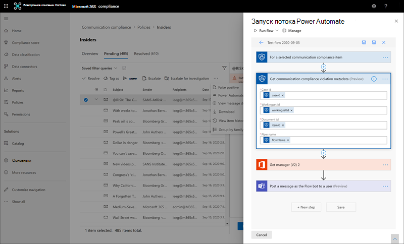

# <a name="communication-compliance-feature-reference"></a>Справочник по функции соответствия коммуникациям

## <a name="policies"></a>Политики

>[!Important]
>Использование PowerShell для создания политик соответствия требованиям к коммуникациям и управления ими не поддерживается. Чтобы создать эти политики и управлять ими, необходимо использовать средства управления политиками в решении соответствия требованиям к коммуникациям [Microsoft 365.](https://compliance.microsoft.com/supervisoryreview)

Вы создаете политики соответствия требованиям для связи для организаций Microsoft 365 в Центре соответствия требованиям Microsoft 365. Политики соответствия коммуникациям определяют, какие сообщения и пользователи подлежат проверке в вашей организации, определяют, какие настраиваемые условия должны соответствовать коммуникациям, и указать, кто должен делать проверки. Пользователи, которым  назначена роль администратора соответствия коммуникациям, могут настраивать  политики, а любой пользователь, которому назначена эта роль, может получить доступ к странице соответствия требованиям к коммуникациям и глобальным настройкам в Центре соответствия требованиям Microsoft 365. При необходимости вы можете экспортировать историю изменений в политику в CSV-файл, который также содержит состояние оповещений, ожидающих проверки, эскалации элементов и разрешенных элементов. Политики нельзя переименовать и удалить, если они больше не нужны.

>[!NOTE]
>Политики контроля, созданные в Центре безопасности & соответствия требованиям для подписок на Office 365, не могут быть перенесены в Microsoft 365. При переходе с подписки на Office 365 на подписку Microsoft 365 необходимо создать новые политики соответствия требованиям для связи, чтобы заменить существующие политики контроля.

## <a name="policy-templates"></a>Шаблоны политики

Шаблоны политик — это предварительно определенные параметры политики, которые можно использовать для быстрого создания политик для решения распространенных сценариев соответствия требованиям. Каждый из этих шаблонов имеет различия в условиях и области, и все шаблоны используют одинаковые типы сигналов сканирования. Можно выбрать один из следующих шаблонов политики:

|**Область**|**Шаблон политики**|**Details**|
|:-----|:-----|:-----|
| **Оскорбительные языки и противодействие оскорбительным выражениям** | Отслеживание сообщений на оскорбительные языки | - Расположения: Exchange Online, Microsoft Teams, Yammer, Skype для бизнеса <br> - Направление: входящий, исходящие, внутренние <br> - Процент отзывов: 100 % <br> - Условия: классификатор оскорбительных языков |
| **Конфиденциальная информация** | Отслеживание сообщений для конфиденциальной информации | - Расположения: Exchange Online, Microsoft Teams, Yammer, Skype для бизнеса <br> - Направление: входящий, исходящие, внутренние <br> - Процент отзывов: 10 % <br> - Условия: конфиденциальную информацию, шаблоны и типы содержимого, настраиваемый словарь, вложения размером более 1 МБ |
| **Соответствие нормативным требованиям** | Отслеживание коммуникаций на предмет информации, связанной с соблюдением финансовых нормативных требований | - Расположения: Exchange Online, Microsoft Teams, Yammer, Skype для бизнеса <br> - Направление: входящий, исходящие <br> - Процент отзывов: 10 % <br> - Условия: параметр пользовательского словаря, вложения размером более 1 МБ |
| **Конфликт интересов** | Мониторинг взаимодействия между двумя группами или двумя пользователями, чтобы избежать конфликтов интересов | - Расположения: Exchange Online, Microsoft Teams, Yammer, Skype для бизнеса <br> - Направление: внутренняя <br> - Процент отзывов: 100 % <br> - Условия: нет |

Сообщения проверяются каждые 24 часа после создания политик. Например, если вы создаете политику оскорбительных языков в 11:00, она будет ежедневно собирать сигналы соответствия требованиям к коммуникациям каждые 24 часа в 11:00. На этот раз изменение политики не меняется. Чтобы просмотреть дату и время последнего сканирования политики, перейдите в столбец *"Последняя* проверка политики" на **странице "Политика".** После создания новой политики может потребоваться до 24 часов, чтобы просмотреть дату и время первой проверки политики. Дата и время последней проверки будут преобразованы в часовой пояс локальной системы.

## <a name="permissions"></a>Разрешения

>[!Important]
>По умолчанию глобальные администраторы не имеют доступа к функциям соответствия требованиям к коммуникациям. Роли, которые назначены на этом шаге, необходимы для того, чтобы какие-либо функции обеспечения соответствия требованиям к коммуникациям были доступны.

Существует пять групп ролей, используемых для настройки разрешений на управление функциями соответствия коммуникации требованиям. Чтобы **обеспечить** соответствие требованиям к связи в качестве меню в Центре соответствия требованиям Microsoft 365  и  продолжить выполнение этих действий по настройке, необходимо быть назначены группам ролей "Соответствие коммуникациям" или "Соответствие требованиям связи". Чтобы получить доступ к функциям соответствия коммуникации и управлять ими после начальной настройки, пользователи должны быть членами хотя бы одной группы ролей соответствия коммуникациям.

В зависимости от того, как вы хотите управлять политиками и оповещениями связи, необходимо назначить пользователей определенным группам ролей. Вы можете назначить пользователей с различными обязанностями по обеспечению соответствия требованиям определенным группам ролей для управления различными областями функций соответствия коммуникациям. Вы также можете назначить все учетные записи пользователей назначенным администраторам, аналитикам, следователям и зрителям в группу ролей *"Соответствие* коммуникациям". Используйте одну или несколько групп ролей, чтобы наилучшим образом соответствовать требованиям управления соответствием требованиям.

Выберите один из этих параметров группы ролей при настройке соответствия коммуникации:

|**Группа ролей**|**Разрешения группы ролей**|
|:-----|:-----|
| **Соответствие требованиям к коммуникациям** | Используйте эту группу ролей для управления соответствием требованиям к коммуникациям для организации в одной группе. Добавляя все учетные записи пользователей для назначенных администраторов, аналитиков, следователей и посетителей, вы можете настроить разрешения на соответствие коммуникациям в одной группе. Эта группа ролей содержит все роли разрешений соответствия требованиям связи. Эта конфигурация — самый простой способ быстро начать работу с соответствием требованиям к коммуникациям и подходит для организаций, не нуждающихся в отдельных разрешениях, определенных для отдельных групп пользователей. |
| **Администратор соответствия требованиям к коммуникациям** | Используйте эту группу ролей для первоначальной настройки соответствия коммуникации требованиям, а затем для разделения администраторов соответствия коммуникациям в определенную группу. Пользователи, которые назначены этой группе ролей, могут создавать, читать, обновлять и удалять политики соответствия коммуникации, глобальные параметры и назначения групп ролей. Пользователи, которые назначены этой группе ролей, не могут просматривать оповещения о сообщениях. |
| **Аналитик соответствия коммуникациям** | Используйте эту группу для назначения разрешений пользователям, которые будут выступать в качестве аналитиков соответствия требованиям связи. Пользователи, которые назначены этой группе ролей, могут просматривать политики, в которых они назначены в качестве проверяющих, просматривать метаданные сообщений (не содержимое сообщений), переададрастать на рассмотрение дополнительным рецензентам или отправлять уведомления пользователям. Аналитики не могут разрешить ожидающих оповещений. |
| **Коммуникационный следователь по обеспечению соответствия требованиям** | Используйте эту группу для назначения разрешений пользователям, которые будут выступать в качестве следователей по обеспечению соответствия требованиям связи. Пользователи, которые назначены этой группе ролей, могут просматривать метаданные и содержимое сообщений, переадружать их дополнительным рецензентам, переадружать их в дело Advanced eDiscovery, отправлять уведомления пользователям и разрешать оповещение. |
| **Просмотр соответствия требованиям к коммуникациям** | Используйте эту группу для назначения разрешений пользователям, которые будут управлять отчетами о связи. Пользователи, которые назначены этой группе ролей, могут получать доступ ко всем мини-приложениям отчетов на домашней странице соответствия требованиям связи и просматривать все отчеты о соответствии коммуникациям. |

### <a name="for-organizations-using-the-original-permissions-and-role-groups"></a>Для организаций, использующих исходные разрешения и группы ролей

Новая структура группы ролей заменяет начальную структуру группы ролей для обеспечения соответствия коммуникации. Организациям, уже использующим соответствие требованиям в связи, необходимо иметь роль администратора надзорной проверки, чтобы начать работу с соответствием требованиям в Центре соответствия требованиям Microsoft 365. Кроме того, необходимо было создать группу ролей для проверяющих с ролями "Администратор надзорной проверки", "Управление делами", "Администратор соответствия требованиям" и "Проверка", чтобы исследовать и исправление сообщений с помощью соответствия политике. По сути, все администраторы и рецензенты были в одной группе ролей и у всех были одинаковые разрешения на доступ и управление. С помощью последних обновлений для обеспечения соответствия коммуникации следует запланировать переход от предыдущей структуры группы ролей к новой структуре группы ролей. Поддержка предыдущей структуры группы ролей будет поэтапной.

Чтобы помочь в планировании миграции, рассмотрим следующий пример. В настоящее время в вашей организации есть три типа пользователей: ИТ-администраторы, рассмотрения и рецензенты. Эти три типа пользователей находятся в предыдущей структуре группы ролей и являются членами одной группы ролей со следующими ролями:

- Администратор надзорной проверки
- Управление делами
- Администратор соответствия
- Проверка

Чтобы обновить роли этих пользователей для новой структуры группы ролей и разделить разрешения доступа и управления для пользователей, можно рассмотреть три новые группы и связанные назначения новых групп ролей:

- **ИТ-администраторы:** назначены новой группе ролей "Администратор соответствия требованиям к *коммуникациям".*
- **Triage**: Assigned to the *Communication Compliance Analyst role* group.
- **Рецензенты:** назначена новой группе ролей *"Обозреватель* соответствия коммуникациям".

## <a name="supervised-users"></a>Контролируемые пользователи

Прежде чем приступить к использованию соответствия коммуникации требованиям, необходимо определить, кому требуется проанализировать их сообщения. В политике адреса электронной почты пользователей определяют лиц или группы лиц, которые необходимо контролировать. Примеры таких групп: группы Microsoft 365, списки рассылки на основе Exchange, сообщества Yammer и каналы Microsoft Teams. Вы также можете исключить определенных пользователей или группы из сканирования с помощью определенной группы исключений или списка групп.

>[!IMPORTANT]
>Пользователи, на которые распространяется политика соответствия требованиям для связи, должны иметь лицензию на соответствие требованиям Microsoft 365 E5, лицензию Office 365 корпоративный E3 с надстройка Advanced Compliance или быть включены в подписку на Office 365 корпоративный E5. Если у вас нет корпоративного плана E5 и вы хотите попробовать соответствие требованиям, вы можете зарегистрироваться для пробной проверки [Office 365 корпоративный E5.](https://go.microsoft.com/fwlink/p/?LinkID=698279)

## <a name="reviewers"></a>Рецензенты

При создании политики соответствия требованиям к коммуникациям необходимо определить, кто просматривает сообщения контролируемых пользователей. В политике адреса электронной почты пользователей определяют отдельных лиц или группы пользователей для проверки сообщений, которые необходимо проконтролировать. У всех проверяющих должны быть почтовые ящики, которые будут  работать в Exchange Online, и они должны быть назначены ролям анализа соответствия коммуникаций или анализа соответствия *коммуникациям.* Рецензентам (аналитикам или следователям) также должна быть назначена роль управления делами соответствия требованиям.  Когда рецензенты добавляются в политику, они автоматически получают сообщение электронной почты о назначении политики и предоставляют ссылки на сведения о процессе проверки.

## <a name="groups-for-supervised-users-and-reviewers"></a>Группы для контролируемых пользователей и рецензентов

Чтобы упростить настройку, создайте группы для пользователей, которым требуется проверка их коммуникаций, и группы для пользователей, просматривавших эти сообщения. Если вы используете группы, вам может потребоваться несколько. Например, если вы хотите проверить связь между двумя отдельными группами людей или указать группу, которая не контролируется.

При назначении группы рассылки в политике политика отслеживает все сообщения электронной почты от каждого пользователя в группе рассылки. При назначении группы Microsoft 365 в политике политика отслеживает все сообщения электронной почты, отправленные этой группе, а не отдельные сообщения электронной почты, полученные каждым членом группы.

Добавление групп и списков рассылки в политики соответствия коммуникациям является частью общих условий и наборов правил, поэтому максимальное количество групп и списков рассылки, поддерживаемых политикой, зависит от количества условий, которые также добавляются в политику. Каждая политика должна поддерживать около 20 групп или списков рассылки в зависимости от количества дополнительных условий, присутствующих в политике.

## <a name="supported-communication-types"></a>Поддерживаемые типы связи

С помощью политик соответствия коммуникации вы можете проверять сообщения на одной или более из следующих платформ связи в качестве группы или в качестве автономных источников. Сообщения, захваченные на этих платформах, по умолчанию сохраняются в течение семи лет для каждой политики, даже если пользователи покидают организацию и их почтовые ящики удаляются.

- **Microsoft Teams**: можно сканировать сообщения чата как в общедоступных, так и в частных каналах Microsoft Teams, а также в отдельных чатах. Когда пользователям назначена политика соответствия коммуникации с выбранным охватом Microsoft Teams, сообщения в чате для пользователей автоматически отслеживаются во всех Microsoft Teams, в которых они являются членами. Охват Microsoft Teams автоматически включается для предварительно определенных шаблонов политики и выбирается по умолчанию в настраиваемом шаблоне политики. Обработка чатов Teams, которые соответствуют условиям политики соответствия коммуникациям, может занять до 48 часов. Используйте следующие конфигурации управления группами для надзора за индивидуальными чатами пользователей и каналами связи в Teams:

    - **Для общения в чате Teams:** Назначьте отдельных пользователей или [назначьте группу рассылки](https://support.office.com/article/Distribution-groups-E8BA58A8-FAB2-4AAF-8AA1-2A304052D2DE) политике соответствия коммуникациям. Этот параметр настраивается для отношений "один к одному" или "один к многим" для пользователей и чатов.
    - **Для взаимодействия с каналом Teams:** Назначьте каждому каналу Microsoft Teams или группе Microsoft 365, которые вы хотите сканировать с определенным пользователем, политике соответствия требованиям к коммуникациям. Если вы добавляете того же пользователя в другие каналы Microsoft Teams или группы Microsoft 365, обязательно добавьте эти новые каналы и группы в политику соответствия требованиям к связи.
    - **Для общения в** чате Teams с гибридными средами электронной почты: соответствие требованиям к обмену данными может отслеживать сообщения чата для пользователей в организациях с локальной средой Exchange или внешним поставщиком электронной почты, который включил Microsoft Teams. Необходимо создать группу рассылки для пользователей, для отслеживания в локальной или внешней почтовых ящиках. При создании политики соответствия требованиям к коммуникациям  вы назначаете эту группу рассылки в качестве надзорных пользователей и групп в мастере политики.

    >[!IMPORTANT]
    >Вы должны подать запрос в службу поддержки Майкрософт, чтобы в вашей организации для поиска данных чата Teams локальных пользователей мог использоваться графический пользовательский интерфейс в Центре безопасности и соответствия требованиям. Дополнительные сведения см. в поиске в облачных почтовых ящиках для [локального пользователя.](search-cloud-based-mailboxes-for-on-premises-users.md)

Вы должны подать запрос в службу поддержки Microsoft, чтобы ваша организация могла использовать графический интерфейс пользователя в Центре безопасности и соответствия требованиям для поиска данных чата команд в облачных почтовых ящиках для локальных пользователей.

- **Электронная** почта Exchange: все почтовые ящики, которые находятся в Exchange Online в рамках подписки на Microsoft 365 или Office 365, могут проходить проверку сообщений. Обработка сообщений электронной почты Exchange и вложений, которые соответствуют условиям политики соответствия требованиям, может занять до 24 часов. Поддерживаемые типы вложений для обеспечения соответствия коммуникации такие же, как типы файлов, поддерживаемые для проверки содержимого правил потока [почты Exchange.](/exchange/security-and-compliance/mail-flow-rules/inspect-message-attachments#supported-file-types-for-mail-flow-rule-content-inspection)

- **Yammer**: можно проверять личные сообщения, общедоступные беседы и связанные вложения в сообществах Yammer. При добавлении пользователя в политику соответствия требованиям к коммуникациям, которая включает Yammer в качестве определенного канала, в процесс сканирования включаются коммуникации между всеми сообществами Yammer, в которые входит пользователь. Обработка чатов и вложений Yammer, которые соответствуют условиям политики соответствия требованиям, может занять до 24 часов. Yammer должен быть в [режиме native для](/yammer/configure-your-yammer-network/overview-native-mode) политик соответствия требованиям к коммуникациям для отслеживания сообщений и вложений Yammer. В режиме Native все пользователи Yammer находятся в Azure Active Directory (AAD), все группы — это группы Office 365, а все файлы хранятся в SharePoint Online.

- **Skype для бизнеса Online:** взаимодействие с чатом и связанные вложения в Skype для бизнеса Online можно контролировать. Обработка чатов Skype для бизнеса Online, которые соответствуют условиям политики соответствия требованиям, может занять до 24 часов. Беседы в контролируемом чате из предыдущих бесед, сохраненных [в Skype для бизнеса Online.](https://support.office.com/article/Find-a-previous-Skype-for-Business-conversation-18892eba-5f18-4281-8c87-fd48bd72e6a2)  Используйте следующую конфигурацию управления группой для контроля взаимодействия пользователей с чатами в Skype для бизнеса Online:

    - **Для общения в чатах Skype для бизнеса Online:** назначьте отдельных пользователей или назначьте группу [рассылки](https://support.office.com/article/Distribution-groups-E8BA58A8-FAB2-4AAF-8AA1-2A304052D2DE) политике соответствия коммуникациям. Этот параметр настраивается для отношений "один к одному" или "один к многим" для пользователей и чатов.

- **Сторонние** источники: вы можете проверять сообщения на данные, импортируемые в почтовые ящики в организации Microsoft 365, из сторонних источников, таких как [Instant Bloomberg,](archive-instant-bloomberg-data.md) [Slack,](archive-slack-data.md) [Zoom,](archive-zoommeetings-data.md)SMS и многие другие. Полный список соединители, поддерживаемые в соответствии с соответствием требованиям, см. в архиве [сторонних данных.](archiving-third-party-data.md)

    Необходимо настроить сторонний соединители для своей организации Microsoft 365, прежде чем назначать соединители политике соответствия коммуникации. В **разделе "Сторонние** источники" мастера политики соответствия требованиям к коммуникациям отображаются только настроенные в данный момент сторонние соединители.

## <a name="transitioning-from-supervision-in-office-365"></a>Переход от контроля в Office 365

Организациям, использующим политики контроля в Office 365 и плану перехода на политики соответствия требованиям в отношении связи в Microsoft 365, необходимо понимать эти важные моменты:

- Оба решения могут использоваться рядом в организации, но политики, используемые в каждом решении, должны иметь уникальные имена политик. Группы и пользовательские словари ключевых слов могут совместно использовать решения в течение переходного периода.
- Сообщения, сохраненные в соответствии с политиками Office 365, не могут быть перемещены или общими для обеспечения соответствия требованиям к обмену сообщениями в Microsoft 365.
- Решение для контроля в Office 365 будет полностью заменено решением для обеспечения соответствия требованиям к коммуникациям в Microsoft 365. Для использования новых улучшений исследования и исправлений рекомендуется создать новые политики в соответствии с коммуникациями, которые имеют те же параметры, что и существующие политики контроля. При переходе на соответствие коммуникациям в Microsoft 365 следует запланировать экспорт данных отчетов из контроля в Office 365, если у вас есть внутренние требования к политике хранения соответствия.

Сведения о завершении контроля в Office 365 см. в стратегических планах [Microsoft 365.](https://www.microsoft.com/microsoft-365/roadmap)

## <a name="policy-settings"></a>Параметры политики

### <a name="users"></a>Пользователи

Вы можете выбрать  всех пользователей или определить определенных пользователей в политике соответствия требованиям к коммуникациям. Выбор команды **"Все пользователи"** применяет политику ко всем пользователям и всем группам, в которые входит любой пользователь в качестве участника. Определение определенных пользователей применяет политику к определенным пользователям и любым группам, в которые включены определенные пользователи в качестве участников.

### <a name="direction"></a>Direction

По умолчанию отображается **условие "Направление",** которое не может быть удалено. Параметры направления связи в политике выбираются по отдельности или вместе:

- **Входящие** сообщения: вы можете выбрать **"Входящие",** чтобы просмотреть сообщения, отправленные выбранным вами людям. 
- **Исходящие** сообщения: вы можете выбрать **исходящие** сообщения, если хотите просмотреть сообщения, отправленные от людей, которых вы выбрали для контроля. 
- **Внутренняя:** вы можете выбрать **"Внутренняя",** чтобы просмотреть сообщения, отправленные между людьми, которых вы определили в политике. 

### <a name="sensitive-information-types"></a>Типы конфиденциальной информации

Вы можете включить типы конфиденциальной информации в политику соответствия коммуникациям. Типы конфиденциальной информации — это предопределяемые или настраиваемые типы данных, которые могут помочь идентифицировать и защитить номера кредитных карт, банковских счетов, номера паспортов и другие данные. В рамках защиты от потери данных [конфигурация](data-loss-prevention-policies.md)конфиденциальной информации может использовать шаблоны, близость символов, уровни уверенности и даже пользовательские типы данных для идентификации и пометки содержимого, которое может быть конфиденциальным. Типы конфиденциальной информации по умолчанию:

- Финансы
- Медицинские и медицинские учреждения
- Конфиденциальность
- Пользовательский тип информации

Дополнительные сведения о конфиденциальной информации и шаблонах, включенных в типы по умолчанию, см. в определениях сущности типа [конфиденциальной информации.](sensitive-information-type-entity-definitions.md)

### <a name="custom-keyword-dictionaries"></a>Пользовательские словари ключевых слов

Настройте пользовательские словари ключевых слов (или словари), чтобы обеспечить простое управление ключевыми словами, характерными для вашей организации или отрасли. Словари ключевых слов поддерживают до 100 КБ терминов (после сжатия) в словаре и поддерживают любой язык. Ограничение клиента также составляет 100 КБ после сжатия. При необходимости можно применить несколько пользовательских словарей ключевых слов к одной политике или использовать один словарь ключевых слов для одной политики. Эти словари назначены в политике соответствия коммуникациям и могут быть источником из файла (например, CSV- или TXT-списка) или из списка, который можно импортировать в Центре соответствия [требованиям.](create-a-keyword-dictionary.md) Используйте пользовательские словари, если вам нужно поддерживать термины или языки, определенные в вашей организации и политиках.

### <a name="classifiers"></a>Классификаторы

Встроенные обучаемые и глобальные классификаторы сканируют отправленные или полученные сообщения по всем каналам связи в организации на предмет различных типов проблем соответствия требованиям. Классификаторы используют сочетание искусственного интеллекта и ключевых слов для определения языка в сообщениях, которые могут нарушать политики противодействия устрашениям. Встроенные классификаторы в настоящее время поддерживают в сообщениях только ключевые слова на английском языке.

Встроенные обучаемые и глобальные классификаторы для соответствия коммуникациям проверяют термины, изображения и тональность для следующих типов языка и содержимого:

- **Угроза**: сканирует на угрозы, чтобы фиксировать физическое или физическое ущерб человеку или свойству.
- **Целевое оскорбительные** действия: сканирование на оскорбительные действия в отношении людей, касающееся гонки, цвета, национальных происхождение.
- **Нецензурные** выражения: сканирует на нецензурные выражения, которые не поируют большинство людей.
- **Изображения для взрослых:** сканирование изображений, явно явных по своей природе.
- **Racy images**: Scans for images that are sexually suggestive in nature, but contain less explicit content than images deemed Adult.
- **Изображения Gory**: сканирование изображений, которые показывают сцены сцены и сцены.

*Классификаторы* изображений "Взрослый", "Раси" и  *"Gory"* сканируют файлы в . JPEG, . PNG, . GIF и . Форматы BMP. Размер файлов изображений должен быть меньше 4 мегабайт (МБ), а размеры изображений должны быть больше 50x50 пикселей и более 50 килобайт (КБ), чтобы изображение можно было пройти оценку. Идентификация изображений поддерживается для сообщений электронной почты Exchange Online, а также каналов и чатов Microsoft Teams.

Встроенные обучаемые и глобальные классификаторы не предоставляют исчерпывающий список терминов или изображений в этих областях. Кроме того, языковые и языковые стандарты постоянно меняются, и в связи с этими изменениями Корпорация Майкрософт оставляет за собой право обновлять классификаторы по своему усмотрению. Хотя классификаторы могут помочь организации в мониторинге этих областей, классификаторы не предназначены для предоставления единственным средствам отслеживания или обращения к таким языкам или изображениям в организации. Ваша организация, а не Корпорация Майкрософт, по-прежнему несет ответственность за все решения, связанные с мониторингом, сканированием и блокированием языка и изображений в этих областях, включая соблюдение требований местного законодательства о конфиденциальности и других применимых законов. Корпорация Майкрософт рекомендует консультации с юридическим консультантом перед развертыванием и использованием.

>[!NOTE]
>Политики, использующие классификаторы, будут проверять и оценивать сообщения со количеством слов не более шести. Сообщения, содержащие менее шести слов, не оцениваются в политиках с помощью классификаторов. Чтобы выявлять и принимать меры в отношении более коротких сообщений, содержащих несоответствующее содержимое, мы рекомендуем использовать пользовательский словарь ключевых слов в мониторинг политик соответствия коммуникациям для этого типа контента.

Сведения об обучаемых классификаторах в Microsoft 365 см. в теме "Начало работы с обучаемыми [классификаторами".](classifier-get-started-with.md)

### <a name="conditional-settings"></a>Условные параметры
<a name="ConditionalSettings"> </a>

Условия, которые вы выбираете для политики, применяются к сообщениям электронной почты и сторонних источников в организации (например, Instant Bloomberg).

В следующей таблице более подробно рассказывается о каждом условии.
  
|**Condition**|**Как использовать это условие**|
|:-----|:-----|
| **Содержимое соответствует любому из этих классификаторов** | Применяется к политике, если в сообщение включены или исключены какие-либо классификаторы. Некоторые классификаторы предварительно определены в клиенте, а настраиваемые классификаторы необходимо настроить отдельно, прежде чем они будут доступны для этого условия. В политике в качестве условия можно определить только один классификатор. Дополнительные сведения о настройке классификаторов см. в сведениях об обучаемых [классификаторах (предварительная версия).](classifier-learn-about.md) |
| **Контент содержит любой из этих типов конфиденциальной информации** | Применяется к политике, если в сообщение включены или исключены все типы конфиденциальной информации. Некоторые классификаторы предварительно определены в клиенте, а настраиваемые классификаторы можно настраивать отдельно или в рамках процесса назначения условий. Каждый тип конфиденциальной информации применяется отдельно, и только один из этих типов конфиденциальной информации должен применяться к политике для применения к сообщению. Дополнительные сведения о пользовательских типах конфиденциальной информации см. в дополнительных [сведениях о типах конфиденциальной информации.](sensitive-information-type-learn-about.md) |
| **Сообщение получено из любого из этих доменов**  <br><br> **Сообщение не получено ни от одного из этих доменов** | Применив политику, включайте или исключайте определенные домены или адреса электронной почты в полученных сообщениях. Введите каждый домен или адрес электронной почты и разделять несколько доменов или адресов электронной почты запятой. Каждый введенный домен или адрес электронной почты применяется отдельно, для применения политики к сообщению должен применяться только один домен или адрес электронной почты. <br><br> Если вы хотите сканировать всю электронную почту из определенного домена, но хотите исключить сообщения, которые не  требуют проверки (информационные бюллетени, объявления и т. п.), необходимо настроить сообщение не получено ни от одного из этих условий доменов, которое исключает адрес электронной почты (например, "newsletter@contoso.com"). |
| **Сообщение отправляется на любой из этих доменов**  <br><br> **Сообщения не отправляются ни на один из этих доменов** | Применив политику, включайте или исключайте определенные домены или адреса электронной почты в отправленных сообщениях. Введите каждый домен или адрес электронной почты и разделять несколько доменов или адресов электронной почты запятой. Каждый домен или адрес электронной почты применяется отдельно, для применения политики к сообщению должен применяться только один домен или адрес электронной почты. <br><br> Если вы хотите сканировать все сообщения электронной почты, отправленные на определенный домен, но хотите исключить отправленные сообщения, которые не требуют проверки, необходимо настроить два условия: <br> - **Сообщение отправляется в любое из этих** условий доменов, которое определяет домен ("contoso.com"), AND <br> - Сообщение **не отправляется ни на** одно из этих условий доменов, которое исключает адрес электронной почты ("subscriptions@contoso.com"). |
| **Сообщение классифицируется с помощью любой из этих меток**  <br><br> **Сообщение не классифицируется с помощью этих меток** | Чтобы применить политику, если в сообщение включены или исключены определенные метки хранения. Метки хранения необходимо настраивать отдельно, и в рамках этого условия выбираются метки. Каждая выбираемая метка применяется отдельно (только одна из этих меток должна применяться, чтобы политика применялась к сообщению). Дополнительные сведения о метах хранения см. в дополнительных сведениях о политиках [хранения и метах хранения.](retention.md)|
| **Сообщение содержит любое из этих слов**  <br><br> **Сообщение не содержит ни одного из этих слов** | Чтобы применить политику, когда в сообщение включены или исключены определенные слова или фразы, введите каждое слово, разделив его запятой. Для фраз из двух или более слов используйте кавычках вокруг этой фразы. Каждое введите слово или фразу применяется отдельно (для применения политики к сообщению должно применяться только одно слово). Дополнительные сведения о вводе слов или фраз см. в следующем разделе [Поиск слов и фраз в сообщениях или вложениях](communication-compliance-feature-reference.md#Matchwords).|
| **Вложение содержит любое из этих слов**  <br><br> **Вложение не содержит ни одного из этих слов** | Чтобы применить политику, когда определенные слова или фразы включены или исключены во вложении сообщения (например, в документе Word), введите каждое слово, разделив его запятой. Для фраз из двух или более слов используйте кавычках вокруг этой фразы. Каждое введите слово или фразу применяется отдельно (для применения политики к вложению должно применяться только одно слово). Дополнительные сведения о вводе слов или фраз см. в следующем разделе [Поиск слов и фраз в сообщениях или вложениях](communication-compliance-feature-reference.md#Matchwords).|
| **Вложение любого из этих типов файлов**  <br><br> **Вложение не является одним из этих типов файлов** | Чтобы контролировать сообщения, которые включают или исключают определенные типы вложений, введите расширения файлов (например, EXE или PDF). Если вы хотите включить или исключить несколько расширений файлов, введите их в отдельных строках. Чтобы применить политику, должно соответствовать только одному расширению вложения.|
| **Размер сообщения превышает**  <br><br> **Размер сообщения не превышает** | Чтобы просмотреть сообщения на основе определенного размера, используйте эти условия, чтобы указать максимальный или минимальный размер сообщения перед тем, как оно станет предметом проверки. Например, если вы  указываете, что размер сообщения превышает \> **1,0 МБ,** все сообщения размером 1,01 МБ и больше будут подлежать проверке. Для этого условия можно выбрать байты, килобайты, мегабайты или гигабайты.|
| **Размер вложения превышает**  <br><br> **Размер вложения не превышает** | Чтобы просмотреть сообщения в зависимости от размера вложений, укажите максимальный или минимальный размер вложения до того, как сообщение и его вложения будут подлежать проверке. Например, если указать, что размер вложения превышает  \> **2,0 МБ,** все сообщения с вложениями размером 2,01 МБ и более будут подлежать проверке. Для этого условия можно выбрать байты, килобайты, мегабайты или гигабайты.|
   
#### <a name="matching-words-and-phrases-to-emails-or-attachments"></a>Поиск слов и фраз в сообщениях или вложениях
<a name="Matchwords"> </a>

Каждое слово, которое вы вводите и отделяете запятой, применяется отдельно (только одно слово должно применяться, чтобы условие политики применялось к сообщению электронной почты или вложению). Например, давайте используем **условие,** сообщение содержит любое из этих слов, с ключевыми словами "банковское", "конфиденциальное" и "insider trading" разделено запятой (банковское, конфиденциальное, "insider trading"). Политика применяется к любому сообщению, которое включает слово "банковское", "конфиденциальное" или фразу "insider trading". Для применения этого условия политики достаточно наличия одного из этих слов или фраз. Слова в сообщении или вложении должны точно соответствовать вводиться.

>[!IMPORTANT]
>При импорте пользовательского файла словаря каждое слово или фраза должны быть разделены возвратом каретки и в отдельной строке. <br> Пример: <br><br>
>*досье* <br>
>*confidential* <br>
>*insider trading*

Чтобы сканировать сообщения электронной почты и вложения на одинаковые [](create-a-keyword-dictionary.md) ключевые слова, создайте политику защиты от потери данных с пользовательским словарем ключевых слов для терминов, которые вы хотите сканировать в сообщениях. [](create-test-tune-dlp-policy.md) Эта конфигурация политики определяет определенные ключевые слова, которые отображаются в сообщении электронной почты **или** во вложении электронной почты. Использование стандартных параметров условной политики *(сообщение* содержит любое из этих слов, а *"Вложение"* содержит любое из этих слов) для определения терминов в сообщениях и во вложениях требует, чтобы термины присутствовали как в сообщении, так и во вложении. 
  
#### <a name="enter-multiple-conditions"></a>Введите несколько условий

Если ввести несколько условий, Microsoft 365 использует все эти условия вместе, чтобы определить, когда применять политику соответствия требованиям к коммуникациям. Если настроено несколько условий, для применения политики должны быть выполнены все условия, если не ввести исключение. Например, необходима политика, которая применяется, если сообщение содержит слово "trade" и превышает 2 МБ. Однако если сообщение также содержит слова "Approved by Contoso financial", политика не должна применяться. В этом примере три условия будут определены следующим образом:
  
- **Сообщение содержит любое из этих слов** с ключевым словом "trade"
- **Размер сообщения превышает 2** МБ
- **Сообщение не содержит ни одного из этих** слов с ключевыми словами "Утверждено финансовой командой Contoso"

### <a name="review-percentage"></a>Процент отзывов

Если вы хотите уменьшить количество проверяемого контента, можно указать процент от всех коммуникаций, управляющих политикой соответствия требованиям к коммуникациям. Случайный пример содержимого в режиме реального времени выбирается из общего процента содержимого, которое соответствует выбранным условиям политики. Если вы хотите, чтобы проверяемые просматривали все элементы, вы можете настроить **100%** в политике соответствия требованиям к коммуникациям.

## <a name="privacy"></a>Конфиденциальность

Защита конфиденциальности пользователей, совмещающихся с политиками, важна и может помочь повысить объектность при анализе и анализе оповещений о соответствии коммуникации. Этот параметр применяется только к именам пользователей, на которых отображается решение для обеспечения соответствия требованиям. Это не влияет на то, как имена отображаются в других решениях для обеспечения соответствия требованиям или Центре администрирования.

Для пользователей с соответствием требованиям связи можно выбрать один из следующих параметров в параметрах соответствия **коммуникации:**

- **Показывать анонимные версии** имен пользователей: имена пользователей анонимизируются, чтобы пользователи из группы ролей аналитики соответствия требованиям к коммуникациям не видели, кто связан с оповещениями политики.  Пользователи в группе ролей *"Следствие* соответствия требованиям к коммуникациям" всегда будут видеть имена пользователей, а не анонимизированные версии. Например, во всех областях взаимодействия для обеспечения соответствия требованиям пользователю будет отображаться пользователь "Grace Grace Чтобы" со случайным псевдонимом, таким как AnonIS8-988. Выбор этого параметра анонимизирует всех пользователей с текущими и прошедшими политиками и применяется ко всем политикам. Сведения профиля пользователя в оповещении о соответствии коммуникации будут недоступны при выбранном варианте. Однако имена пользователей отображаются при добавлении новых пользователей в существующие политики или при назначении пользователей новым политикам. Если вы отключите этот параметр, имена пользователей будут отображаться для всех пользователей, которые имеют текущие или прошлые совпадения с политикой.
- **Не показывать анонимные версии** имен пользователей: имена пользователей отображаются для всех текущих и прошлых совпадений с политикой для оповещений о соответствии коммуникации требованиям. Сведения профиля пользователя (имя, название, псевдоним, организация или отдел) отображаются для пользователя для всех оповещений о соответствии коммуникации требованиям.

## <a name="notice-templates"></a>Шаблоны уведомлений

Шаблоны уведомлений можно создать, если вы хотите отправить пользователям уведомление с напоминанием о совпадениях политик в процессе решения проблемы. Уведомления можно отправлять только на адрес электронной почты пользователя, связанный с соответствием политики, которое вызвало определенное оповещение для устранения. При выборе шаблона уведомления для применения к нарушению политики в рамках рабочего процесса устранения можно принять значения полей, определенные в шаблоне, или переопределить поля при необходимости.

Шаблоны уведомлений — это настраиваемые шаблоны электронной почты, в которых можно определить следующие поля сообщений в области параметров **соответствия требованиям к коммуникациям:**

|**Field**|**Required**| **Details** |
|:-----|:-----|:-----|
|**Название шаблона** | Да | Удобное имя шаблона уведомления, который вы выберете в уведомлении рабочего процесса во время устранения, поддерживает текстовые символы. |
| **Адрес отправителя** | Да | Адрес одного или более пользователей или групп, отправив сообщение пользователю с помощью политики, выбранной в Active Directory для вашей подписки. |
| **Адреса CC и BCC** | Нет | Необязательные пользователи или группы, которые должны быть уведомлены о совпадении с политикой, выбранной в Active Directory для вашей подписки. |
| **Тема** | Да | Сведения, которые появляются в строке темы сообщения, поддерживают текстовые символы. |
| **Тело сообщения**. | Да | Сведения, которые появляются в тексте сообщения, поддерживают текстовые или HTML-значения. |

### <a name="html-for-notices"></a>HTML для уведомлений

Если вы хотите создать не просто текстовое сообщение электронной почты для уведомлений, вы можете создать более подробное сообщение с помощью HTML-кода в поле текста сообщения шаблона уведомления. В следующем примере предоставляется формат основного тела сообщения для базового шаблона уведомлений электронной почты на основе HTML:

```HTML
<!DOCTYPE html>
<html>
    <body>
        <h2>Action Required: Contoso Employee Code of Conduct Policy Training</h2>
        <p>A recent message you've sent has generated a policy alert for the Contoso Employee <a href='https://www.contoso.com'>Code of Conduct Policy</a>.</p>
        <p>You are required to attend the Contoso Employee Code of Conduct <a href='https://www.contoso.com'>training</a> within the next 14 days. Please contact <a href='mailto:hr@contoso.com'>Human Resources</a> with any questions about this training request.</p>
        <p>Thank you,</p>
        <p><em>Human Resources</em></p>
    </body>
</html>
```

>[!NOTE]
>Реализация атрибута HTML href в шаблонах уведомлений о соответствии коммуникации в настоящее время поддерживает только одиночные кавычка вместо двойных кавычках для ссылок на URL-адреса.

## <a name="filters"></a>Фильтры

Фильтры соответствия коммуникациям позволяют фильтровать и сортировать сообщения оповещений для более быстрого исследования и действий по исправлению. Фильтрация доступна на  вкладке "Ожидание" **и "Разрешено"** для каждой политики. Чтобы сохранить фильтр или набор фильтров в качестве сохраненного запроса фильтра, одно или несколько значений должны быть настроены как выбор фильтра. В следующей таблице описаны сведения о фильтре:

|**Фильтр**|**Details**|
|:-----|:-----|
| **Дата** | Дата, когда сообщение было отправлено или получено пользователем в вашей организации. Чтобы отфильтровать один день, выберите диапазон дат, который начинается с того дня, для который вы хотите получить результаты, и завершите следующий день. Например, если вы хотите отфильтровать результаты за 20.09.2020, необходимо выбрать диапазон дат фильтра от 20.09.2020 до 21.09.2020.|
| **Класс File** | Класс сообщения, основанный на типе сообщения, *сообщении или* *вложении.* |
| **Имеет вложение** | Наличие вложения в сообщении. |
| **Класс Item** | Источник сообщения на основе типа сообщения, электронной почты, чата Microsoft Team, Bloomberg и т. д. Дополнительные сведения о распространенных типах элементов и классах сообщений см. в статье ["Типы элементов и классы сообщений".](/office/vba/outlook/concepts/forms/item-types-and-message-classes) |
| **Домены получателей** | Домен, в который было отправлено сообщение. Обычно этот домен является вашим доменом подписки Microsoft 365 по умолчанию. |
| **Recipient** | Пользователь, которому было отправлено сообщение. |
| **Sender** | Отправивший сообщение. |
| **Домен отправителя** | Домен, отправив сообщение. |
| **Размер** | Размер сообщения в КБ. |
| **Тема/название** | Тема сообщения или название чата. |
| **Tags** | Теги, присвоенные сообщению: сомнительный, совместимый или не *соответствующий требованиям.* |
| **На эскалацию** | Имя пользователя, включенного в действие эскалации сообщений. |
| **Классификаторы** | Имя встроенных и настраиваемые классификаторы, которые применяются к сообщению. В качестве примеров можно *привести оскорбительные* языки, *целевые нецензурные действия,* нецензурные *выражения,* *угрозы* и другие.

## <a name="alert-policies"></a>Политики оповещений

После настройки политики автоматически создается соответствующая политика оповещений и оповещения для сообщений, соответствующих условиям, определенным в политике. По умолчанию всем триггерам оповещений, совпадает с политикой, в связанной политике оповещений назначен средний уровень серьезности. Оповещения создаются для политики соответствия коммуникации после того, как в связанной политике оповещений будет установлен пороговый уровень триггера агрегирования.

Для политик соответствия требованиям к коммуникациям по умолчанию настраиваются следующие значения политики оповещений:

|**Триггер политики оповещений**|**Значение, используемое по умолчанию**|
|:-----|:-----|
| Агрегация | Простое агрегирование |
| Порог | 4 действия |
| Окно | 60 минут |

>[!Note]
>Параметры запуска порогового значения политики оповещений для действий поддерживают минимальное значение 3 или более для политик соответствия требованиям к коммуникациям.

Вы можете изменить параметры по умолчанию для триггеров по количеству действий, периоду  для действий и для определенных пользователей в политиках оповещений на странице "Политики оповещений" в Центре безопасности & соответствия требованиям.

### <a name="change-the-severity-level-for-an-alert-policy"></a>Изменение уровня серьезности для политики оповещений

Если вы хотите изменить уровень серьезности, присвоенный политике оповещений для определенной политики соответствия коммуникациям, выполните следующие действия:

1. Во sign [https://compliance.microsoft.com](https://compliance.microsoft.com) into using credentials for an admin account in your Microsoft 365 organization.

2. В Центре соответствия требованиям Microsoft 365 перейдите в **"Политики".**

3. Выберите **оповещение Office 365** на  странице "Политики", чтобы открыть страницу "Политики оповещений" в Центре безопасности и соответствия & **Office 365.** 

4. Выберите для политики соответствия коммуникации, которая необходимо обновить, и выберите **"Изменить политику".**

5. На **вкладке "Описание"** выберите **впадаемый уровень** серьезности, чтобы настроить уровень оповещений политики.

6. Выберите **"Сохранить",** чтобы применить новый уровень серьезности к политике.

7. Выберите **"Закрыть",** чтобы выйти из страницы сведений о политике предупреждений.

## <a name="power-automate-flows"></a>Потоки Power Automate

[Microsoft Power Automate](/power-automate/getting-started) — это служба рабочего процесса, которая автоматизирует действия между приложениями и службами. Используя потоки шаблонов или созданные вручную, вы можете автоматизировать распространенные задачи, связанные с этими приложениями и службами. Когда вы включаете потоки Power Automate для обеспечения соответствия коммуникации, вы можете автоматизировать важные задачи для оповещений и пользователей. Вы можете настроить потоки Power Automate, чтобы уведомлять менеджеров о том, что у пользователей есть оповещения о соответствии коммуникации требованиям и другие приложения.

Клиентам с подписками На Microsoft 365, которые включают соответствие требованиям связи, не требуются дополнительные лицензии Power Automate, чтобы использовать рекомендуемый шаблон Power Automate для обеспечения соответствия коммуникациям по умолчанию. Шаблон по умолчанию можно настроить для поддержки организации и основных сценариев соответствия коммуникации. Если вы решили использовать в этих шаблонах дополнительные функции Power Automate, создать настраиваемый шаблон с помощью соединители соответствия Microsoft 365 или использовать шаблоны Power Automate для других областей соответствия требованиям в Microsoft 365, вам могут потребоваться дополнительные лицензии Power Automate.

>[!IMPORTANT]
>Вы получаете запросы на дополнительную проверку лицензии при тестировании потоков Power Automate? Возможно, ваша организация еще не получила обновления служб для этой предварительной версии функции. Обновления развертываются, и к 30 октября 2020 г. во всех организациях с подписками Microsoft 365, включающих соответствие требованиям связи, должна быть создана лицензия для потоков, созданных на основе рекомендуемых шаблонов Power Automate.



Клиентам предоставляется следующий шаблон Power Automate для поддержки автоматизации процессов для оповещений о соответствии коммуникации требованиям:

- **Уведомлять руководителя о** том, что у пользователя есть оповещение о соответствии коммуникации требованиям: в некоторых организациях может потребоваться немедленное уведомление об управлении, когда пользователь получает оповещение о соответствии коммуникации требованиям. Когда этот поток настроен и выбран, менеджеру пользователя дела отправляется сообщение электронной почты со следующими сведениями обо всех оповещениях:
    - Применимая политика для оповещения
    - Дата и время оповещения
    - Уровень серьезности оповещения

### <a name="create-a-power-automate-flow"></a>Создание потока Power Automate

Чтобы создать поток Power Automate на примере рекомендуемого шаблона по умолчанию,  используйте параметр "Управление потоками **Power Automate"** из автоматического управления при работе непосредственно в оповещении. Чтобы создать поток Power Automate с помощью управления потоками **Power Automate,** необходимо быть участником по крайней мере одной группы ролей соответствия коммуникациям.

Выполните следующие действия, чтобы создать поток Power Automate из шаблона по умолчанию:

1. В Центре соответствия требованиям Microsoft 365 перейдите к политикам соответствия требованиям для связи и выберите политику с оповещением,   >   о чем вы хотите узнать.
2. В политике выберите вкладку **"Ожидание"** и выберите ожидающих оповещений.
3. Выберите **Power Automate в** меню действий оповещений.
4. На странице **"Power Automate"** выберите шаблон по умолчанию в шаблонах соответствия требованиям к коммуникациям, которые могут быть **вам** нравится в разделе на странице.
5. Поток выводит список внедренных подключений, необходимых для потока, и отображает, доступны ли состояния подключений. При необходимости обновим все подключения, которые не отображаются как доступные. Выберите **"Продолжить"**.
6. По умолчанию рекомендуемые потоки предварительно настроены с помощью рекомендуемого соответствия коммуникации и полей данных службы Microsoft 365, необходимых для выполнения назначенной задачи для потока. При необходимости настройте компоненты потока  с помощью управления "Показать расширенные параметры" и настройте доступные свойства для компонента потока.
7. При необходимости добавьте дополнительные действия в поток, настроив кнопку **"Новый** шаг". В большинстве случаев это изменение не требуется для рекомендуемых шаблонов по умолчанию.
8. Выберите **"Сохранить черновик",** чтобы сохранить  поток для дальнейшей настройки, или выберите "Сохранить", чтобы завершить настройку для потока.
9. Выберите **"Закрыть",** чтобы вернуться на страницу потока Power Automate. Новый шаблон будет указан в качестве  потока на вкладке "Мои потоки" и будет автоматически доступен в средстве управления Power Automate для пользователя, создав поток при работе с оповещениями о соответствии коммуникации требованиям.

### <a name="share-a-power-automate-flow"></a>Совместное отключение потока Power Automate

По умолчанию потоки Power Automate, созданные пользователем, доступны только этому пользователю. Чтобы другие пользователи соответствия коммуникации получили доступ к потоку и использовали его, его должен использовать создатель потока. Чтобы поделиться потоком, вы будете использовать управление **Power Automate** при работе непосредственно в оповещении.

Чтобы совместно использовать поток Power Automate, необходимо быть участником по крайней мере одной группы ролей соответствия требованиям к коммуникациям.
Выполните следующие действия, чтобы поделиться потоком Power Automate:

1. В Центре соответствия требованиям Microsoft 365 перейдите к политикам соответствия требованиям для связи и выберите политику с оповещением,   >   о чем вы хотите узнать.
2. В политике выберите вкладку **"Ожидание"** и выберите ожидающих оповещений.
3. Выберите **Power Automate в** меню действий оповещений.
4. На странице **потоков Power Automate выберите** вкладку **"Мои потоки"** или **"Потоки команды".**
5. Выберите поток для обмена, а затем выберите **"Поделиться"** в меню параметров потока.
6. На странице общего доступа к потоку введите имя пользователя или группы, которые нужно добавить в качестве владельца для потока.
7. В **диалоговом окте** "Подключение **используется"** выберите "ОК", чтобы подтвердить, что добавленный пользователь или группа будут иметь полный доступ к потоку.

### <a name="edit-a-power-automate-flow"></a>Изменение потока Power Automate

Если вам нужно изменить поток, вы будете использовать управление **Power Automate** при работе непосредственно в оповещении. Чтобы изменить поток Power Automate, необходимо быть участником хотя бы одной группы ролей соответствия требованиям к коммуникациям.

Выполните следующие действия, чтобы изменить поток Power Automate:

1. В Центре соответствия требованиям Microsoft 365 перейдите к политикам соответствия требованиям для связи и выберите политику с оповещением,   >   о чем вы хотите узнать.
2. В политике выберите вкладку **"Ожидание"** и выберите ожидающих оповещений.
3. Выберите **Power Automate в** меню действий оповещений.
4. На странице **потоков Power Automate** выберите поток для редактирования. Выберите **"Изменить"** в меню управления потоком.
5. Выберите **"Параметры с** многолипсом", чтобы изменить параметр компонента потока или "Удалить с многолипки", чтобы  >   удалить   >   компонент потока.
6. Выберите **"Сохранить",** а затем "Закрыть", чтобы завершить редактирование потока. 

### <a name="delete-a-power-automate-flow"></a>Удаление потока Power Automate

Если вам нужно удалить поток, вы будете использовать управление **Power Automate** при работе непосредственно в оповещении. Чтобы удалить поток Power Automate, необходимо быть участником хотя бы одной группы ролей соответствия требованиям к коммуникациям.

Выполните следующие действия, чтобы удалить поток Power Automate:

1. В Центре соответствия требованиям Microsoft 365 перейдите к политикам соответствия требованиям для связи и выберите политику с оповещением,   >   о чем вы хотите узнать.
2. В политике выберите вкладку **"Ожидание"** и выберите ожидающих оповещений.
3. Выберите **Power Automate в** меню действий оповещений.
4. На странице **потоков Power Automate** выберите поток для удаления. Выберите **"Удалить"** в меню управления потоком.
5. В диалоговом окте подтверждения удаления выберите  "Удалить", чтобы удалить поток, или "Отмена", чтобы выйти из действия удаления. 

## <a name="reports-preview"></a>Отчеты (предварительная версия)

Новая панель **мониторинга отчетов** — это центральное расположение для просмотра всех отчетов о соответствии коммуникациям требованиям. Мини-приложения отчетов предоставляют краткое представление о статистике, наиболее часто необходимой для общей оценки состояния действий по обеспечению соответствия коммуникациям. Сведения, содержащиеся в мини-приложениях отчета, не экспортируются. Подробные отчеты предоставляют подробную информацию, связанную с определенными областями соответствия коммуникациям, и предоставляют возможность фильтровать, группировать, сортировать и экспортировать информацию при проверке.

Панель **мониторинга отчетов** содержит следующие виджеты отчетов и ссылки на подробные отчеты:

- **Последние совпадения с политикой** виджета: отображает количество совпадений активной политикой с течением времени.
- **Разрешенные элементы с помощью виджета** политики: отображает количество оповещений о совпадениях с политикой, разрешенных политикой с течением времени.
- **Пользователи с большинством виджетов с** совпадениями с политикой: отображают пользователей (или анонимные имена пользователей) и количество совпадений с политикой за заданный период.
- **Политика с большинством совпадений** виджета: отображает политики и количество совпадений за заданный период, ранж более высокий и самый низкий для совпадений.
- **Эскалации с помощью виджета** политики: отображает количество эскалаций для политики за заданный период времени.
- **Параметры** политики и подробный отчет о состоянии: подробный обзор конфигурации и параметров политики, а также общее состояние каждой политики (совпадений и действий) для сообщений. Используйте параметр *"Экспорт"* для создания . CSV-файл, содержащий сведения об отчете.
- **Элементы и действия для каждого подробного** отчета политики: просмотр и экспорт совпадающих элементов и действия по исправлению для политики. Используйте параметр *"Экспорт"* для создания . CSV-файл, содержащий сведения об отчете.
- **Подробный отчет по элементам** и действиям для каждого расположения: просмотр и экспорт совпадающих элементов и действия по исправлению для каждого расположения Microsoft 365. Используйте параметр *"Экспорт"* для создания . CSV-файл, содержащий сведения об отчете.

## <a name="audit"></a>Аудит

В некоторых случаях необходимо предоставить информацию аудиторам нормативов или соответствия требованиям, чтобы подтвердить контроль за действиями пользователей и коммуникациями. Эти сведения могут быть сводными сведениями обо всех действиях, связанных с определенной политикой организации, или при любом внесении изменений в политику соответствия коммуникациям. Политики соответствия требованиям к коммуникациям имеют встроенные отчеты аудита для полной готовности к внутреннему или внешнему аудиту. Подробные истории аудита всех действий по созданию, редактированию и удалянию фиксированы вашими политиками связи для подтверждения надзорных процедур.

>[!Important]
>Для записи событий соответствия коммуникациям в организации должен быть включен аудит. Чтобы включить аудит, см. ["Включить журнал аудита".](communication-compliance-configure.md#step-2-required-enable-the-audit-log)

Чтобы просмотреть действия по обновлению политики соответствия требованиям связи, выберите на главной странице для любой политики контроль обновлений политики экспорта.  Для экспорта действий  по  обновлению вам должны быть назначены роли глобального администратора или администратора соответствия коммуникациям. Это действие создает файл аудита в формате CSV, содержащий следующие сведения:

|**Field**|**Details**|
|:-----|:-----|
| **CreationDate** | Дата выполнения действия обновления в политике. |
| **UserIds** | Пользователь, выполнив обновление в политике. |
| **Operations** | Операции обновления, выполняемые с политикой. |
| **AuditData** | Это поле является основным источником данных для всех действий по обновлению политики. Все действия по обновлению записываюются и разделяются разделиями-запятами. |

Чтобы просмотреть действия по проверке  соответствия требованиям связи для политики, выберите на странице **"Обзор"** для определенной политики контроль действий по экспорту. Для экспорта действий  по  проверке вам должны быть назначены роли глобального администратора или администратора соответствия коммуникациям. Это действие создает файл аудита в формате CSV, содержащий следующие сведения:

|**Field**|**Details**|
|:-----|:-----|
| **CreationDate** | Дата выполнения действия проверки в политике. |
| **UserIds** | Пользователь, который выполнял действие проверки в политике. |
| **Operations** | Операции проверки, выполняемые с политикой. |
| **AuditData** | Это поле является основным источником данных для всех действий по проверке политики. Все действия проверки записываюются и разделяются разделиями-запятами. |

Вы также можете просматривать действия аудита в едином журнале аудита или с помощью [powerShell-лета Search-UnifiedAuditLog.](/powershell/module/exchange/search-unifiedauditlog)

Например, в следующем примере возвращаются действия для всех действий надзорной проверки (политики и правила):

```PowerShell
Search-UnifiedAuditLog -StartDate $startDate -EndDate $endDate -RecordType AeD -Operations SupervisoryReviewTag
```

В этом примере возвращаются действия по обновлению политик соответствия требованиям к коммуникациям:

```PowerShell
Search-UnifiedAuditLog -StartDate $startDate -EndDate $endDate -RecordType Discovery -Operations SupervisionPolicyCreated,SupervisionPolicyUpdated,SupervisionPolicyDeleted
```

## <a name="ready-to-get-started"></a>Готовы приступить к работе?

Чтобы настроить соответствие коммуникаций для организации Microsoft 365, см. "Настройка соответствия требованиям к связи для организации [Microsoft 365".](communication-compliance-configure.md)
