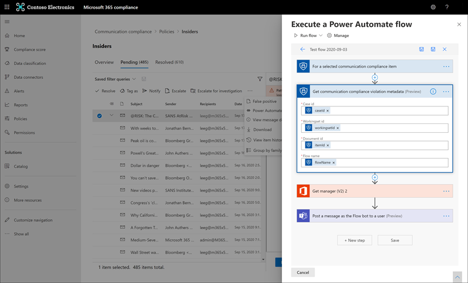

# <a name="communication-compliance-feature-reference"></a><span data-ttu-id="e355e-104">Справочник по функции соответствия коммуникациям</span><span class="sxs-lookup"><span data-stu-id="e355e-104">Communication compliance feature reference</span></span>

## <a name="policies"></a><span data-ttu-id="e355e-105">Политики</span><span class="sxs-lookup"><span data-stu-id="e355e-105">Policies</span></span>

>[!Important]
><span data-ttu-id="e355e-106">Использование PowerShell для создания политик соответствия требованиям к коммуникациям и управления ими не поддерживается.</span><span class="sxs-lookup"><span data-stu-id="e355e-106">Using PowerShell to create and manage communication compliance policies is not supported.</span></span> <span data-ttu-id="e355e-107">Чтобы создать эти политики и управлять ими, необходимо использовать средства управления политиками в решении соответствия требованиям к коммуникациям [Microsoft 365.](https://compliance.microsoft.com/supervisoryreview)</span><span class="sxs-lookup"><span data-stu-id="e355e-107">To create and manage these policies, you must use the policy management controls in the [Microsoft 365 communication compliance solution](https://compliance.microsoft.com/supervisoryreview).</span></span>

<span data-ttu-id="e355e-108">Вы создаете политики соответствия требованиям для связи для организаций Microsoft 365 в Центре соответствия требованиям Microsoft 365.</span><span class="sxs-lookup"><span data-stu-id="e355e-108">You create communication compliance policies for Microsoft 365 organizations in the Microsoft 365 compliance center.</span></span> <span data-ttu-id="e355e-109">Политики соответствия коммуникациям определяют, какие сообщения и пользователи подлежат проверке в вашей организации, определяют, какие настраиваемые условия должны соответствовать коммуникациям, и кто должен делать проверки.</span><span class="sxs-lookup"><span data-stu-id="e355e-109">Communication compliance policies define which communications and users are subject to review in your organization, define which custom conditions the communications must meet, and specify who should do reviews.</span></span> <span data-ttu-id="e355e-110">Пользователи, которым  назначена роль администратора соответствия требованиям к коммуникациям, могут  настраивать политики, а любой пользователь, которому назначена эта роль, может получить доступ к странице соответствия требованиям связи и глобальным настройкам в Центре соответствия требованиям Microsoft 365.</span><span class="sxs-lookup"><span data-stu-id="e355e-110">Users assigned the *Communication Compliance Admin* role can set up policies, and anyone who has this role assigned can access the **Communication compliance** page and global settings in the Microsoft 365 compliance center.</span></span> <span data-ttu-id="e355e-111">При необходимости вы можете экспортировать историю изменений в политику в CSV-файл, который также содержит состояние оповещений, ожидающих проверки, эскалации элементов и разрешенных элементов.</span><span class="sxs-lookup"><span data-stu-id="e355e-111">If needed, you can export the history of modifications to a policy to a .csv file that also includes the status of alerts pending review, escalated items, and resolved items.</span></span> <span data-ttu-id="e355e-112">Политики нельзя переименовать и удалить, если они больше не нужны.</span><span class="sxs-lookup"><span data-stu-id="e355e-112">Policies can't be renamed and can be deleted when no longer needed.</span></span>

>[!NOTE]
><span data-ttu-id="e355e-113">Политики контроля, созданные в Центре безопасности & соответствия требованиям для подписок на Office 365, не могут быть перенесены в Microsoft 365.</span><span class="sxs-lookup"><span data-stu-id="e355e-113">Supervision policies created in the Security & Compliance Center for Office 365 subscriptions cannot migrate to Microsoft 365.</span></span> <span data-ttu-id="e355e-114">При переходе с подписки на Office 365 на подписку Microsoft 365 необходимо создать новые политики соответствия требованиям для связи, чтобы заменить существующие политики контроля.</span><span class="sxs-lookup"><span data-stu-id="e355e-114">If you're migrating from an Office 365 subscription to a Microsoft 365 subscription, you'll need to create new communication compliance polices to replace existing Supervision policies.</span></span>

## <a name="policy-templates"></a><span data-ttu-id="e355e-115">Шаблоны политики</span><span class="sxs-lookup"><span data-stu-id="e355e-115">Policy templates</span></span>

<span data-ttu-id="e355e-116">Шаблоны политик — это предварительно определенные параметры политики, которые можно использовать для быстрого создания политик для решения распространенных сценариев соответствия требованиям.</span><span class="sxs-lookup"><span data-stu-id="e355e-116">Policy templates are pre-defined policy settings that you can use to quickly create policies to address common compliance scenarios.</span></span> <span data-ttu-id="e355e-117">Каждый из этих шаблонов имеет различия в условиях и области, и все шаблоны используют одинаковые типы сигналов сканирования.</span><span class="sxs-lookup"><span data-stu-id="e355e-117">Each of these templates has differences in conditions and scope, and all templates use the same types of scanning signals.</span></span> <span data-ttu-id="e355e-118">Можно выбрать один из следующих шаблонов политики:</span><span class="sxs-lookup"><span data-stu-id="e355e-118">You can choose from the following policy templates:</span></span>

|<span data-ttu-id="e355e-119">**Область**</span><span class="sxs-lookup"><span data-stu-id="e355e-119">**Area**</span></span>|<span data-ttu-id="e355e-120">**Шаблон политики**</span><span class="sxs-lookup"><span data-stu-id="e355e-120">**Policy Template**</span></span>|<span data-ttu-id="e355e-121">**Details**</span><span class="sxs-lookup"><span data-stu-id="e355e-121">**Details**</span></span>|
|:-----|:-----|:-----|
| <span data-ttu-id="e355e-122">**Оскорбительные языки и противодействие оскорбительным жестам**</span><span class="sxs-lookup"><span data-stu-id="e355e-122">**Offensive language and anti-harassment**</span></span> | <span data-ttu-id="e355e-123">Отслеживание сообщений на оскорбительные языки</span><span class="sxs-lookup"><span data-stu-id="e355e-123">Monitor communications for offensive language</span></span> | <span data-ttu-id="e355e-124">- Расположения: Exchange Online, Microsoft Teams, Yammer, Skype для бизнеса</span><span class="sxs-lookup"><span data-stu-id="e355e-124">- Locations: Exchange Online, Microsoft Teams, Yammer, Skype for Business</span></span> <br> <span data-ttu-id="e355e-125">- Направление: входящий, исходящие, внутренние</span><span class="sxs-lookup"><span data-stu-id="e355e-125">- Direction: Inbound, Outbound, Internal</span></span> <br> <span data-ttu-id="e355e-126">- Процент отзывов: 100 %</span><span class="sxs-lookup"><span data-stu-id="e355e-126">- Review Percentage: 100%</span></span> <br> <span data-ttu-id="e355e-127">- Условия: классификатор оскорбительных языков</span><span class="sxs-lookup"><span data-stu-id="e355e-127">- Conditions: Offensive language classifier</span></span> |
| <span data-ttu-id="e355e-128">**Конфиденциальная информация**</span><span class="sxs-lookup"><span data-stu-id="e355e-128">**Sensitive information**</span></span> | <span data-ttu-id="e355e-129">Отслеживание коммуникаций для конфиденциальной информации</span><span class="sxs-lookup"><span data-stu-id="e355e-129">Monitor communications for sensitive information</span></span> | <span data-ttu-id="e355e-130">- Расположения: Exchange Online, Microsoft Teams, Yammer, Skype для бизнеса</span><span class="sxs-lookup"><span data-stu-id="e355e-130">- Locations: Exchange Online, Microsoft Teams, Yammer, Skype for Business</span></span> <br> <span data-ttu-id="e355e-131">- Направление: входящий, исходящие, внутренние</span><span class="sxs-lookup"><span data-stu-id="e355e-131">- Direction: Inbound, Outbound, Internal</span></span> <br> <span data-ttu-id="e355e-132">- Процент отзывов: 10 %</span><span class="sxs-lookup"><span data-stu-id="e355e-132">- Review Percentage: 10%</span></span> <br> <span data-ttu-id="e355e-133">- Условия: конфиденциальную информацию, шаблоны и типы содержимого, настраиваемый словарь, вложения размером более 1 МБ</span><span class="sxs-lookup"><span data-stu-id="e355e-133">- Conditions: Sensitive information, out-of-the-box content patterns, and types, custom dictionary option, attachments larger than 1 MB</span></span> |
| <span data-ttu-id="e355e-134">**Соответствие нормативным требованиям**</span><span class="sxs-lookup"><span data-stu-id="e355e-134">**Regulatory compliance**</span></span> | <span data-ttu-id="e355e-135">Отслеживание коммуникаций на предмет информации, связанной с соблюдением финансовых нормативных требований</span><span class="sxs-lookup"><span data-stu-id="e355e-135">Monitor communications for info related to financial regulatory compliance</span></span> | <span data-ttu-id="e355e-136">- Расположения: Exchange Online, Microsoft Teams, Yammer, Skype для бизнеса</span><span class="sxs-lookup"><span data-stu-id="e355e-136">- Locations: Exchange Online, Microsoft Teams, Yammer, Skype for Business</span></span> <br> <span data-ttu-id="e355e-137">- Направление: входящий, исходящие</span><span class="sxs-lookup"><span data-stu-id="e355e-137">- Direction: Inbound, Outbound</span></span> <br> <span data-ttu-id="e355e-138">- Процент отзывов: 10 %</span><span class="sxs-lookup"><span data-stu-id="e355e-138">- Review Percentage: 10%</span></span> <br> <span data-ttu-id="e355e-139">- Условия: параметр пользовательского словаря, вложения размером более 1 МБ</span><span class="sxs-lookup"><span data-stu-id="e355e-139">- Conditions: custom dictionary option, attachments larger than 1 MB</span></span> |
| <span data-ttu-id="e355e-140">**Конфликт интересов**</span><span class="sxs-lookup"><span data-stu-id="e355e-140">**Conflict of interest**</span></span> | <span data-ttu-id="e355e-141">Мониторинг взаимодействия между двумя группами или двумя пользователями, чтобы избежать конфликтов интересов</span><span class="sxs-lookup"><span data-stu-id="e355e-141">Monitor communications between two groups or two users to help avoid conflicts of interest</span></span> | <span data-ttu-id="e355e-142">- Расположения: Exchange Online, Microsoft Teams, Yammer, Skype для бизнеса</span><span class="sxs-lookup"><span data-stu-id="e355e-142">- Locations: Exchange Online, Microsoft Teams, Yammer, Skype for Business</span></span> <br> <span data-ttu-id="e355e-143">- Направление: внутренняя</span><span class="sxs-lookup"><span data-stu-id="e355e-143">- Direction: Internal</span></span> <br> <span data-ttu-id="e355e-144">- Процент отзывов: 100 %</span><span class="sxs-lookup"><span data-stu-id="e355e-144">- Review Percentage: 100%</span></span> <br> <span data-ttu-id="e355e-145">- Условия: нет</span><span class="sxs-lookup"><span data-stu-id="e355e-145">- Conditions: None</span></span> |

<span data-ttu-id="e355e-146">Сообщения проверяются каждые 24 часа после создания политик.</span><span class="sxs-lookup"><span data-stu-id="e355e-146">Communications are scanned every 24 hours from the time policies are created.</span></span> <span data-ttu-id="e355e-147">Например, если вы создаете политику оскорбительных языков в 11:00, она будет ежедневно собирать сигналы соответствия требованиям к коммуникациям каждые 24 часа в 11:00.</span><span class="sxs-lookup"><span data-stu-id="e355e-147">For example, if you create an offensive language policy at 11:00 AM, the policy will gather communication compliance signals every 24 hours at 11:00 AM daily.</span></span> <span data-ttu-id="e355e-148">На этот раз изменение политики не меняется.</span><span class="sxs-lookup"><span data-stu-id="e355e-148">Editing a policy doesn't change this time.</span></span> <span data-ttu-id="e355e-149">Чтобы просмотреть дату и время последнего сканирования политики, перейдите в столбец *"Последняя* проверка политики" на **странице "Политика".**</span><span class="sxs-lookup"><span data-stu-id="e355e-149">To view the last scan date and time for a policy, navigate to the *Last policy scan* column on the **Policy** page.</span></span>

## <a name="permissions"></a><span data-ttu-id="e355e-150">Разрешения</span><span class="sxs-lookup"><span data-stu-id="e355e-150">Permissions</span></span>

>[!Important]
><span data-ttu-id="e355e-151">По умолчанию глобальные администраторы не имеют доступа к функциям соответствия требованиям к коммуникациям.</span><span class="sxs-lookup"><span data-stu-id="e355e-151">By default, Global Administrators do not have access to communication compliance features.</span></span> <span data-ttu-id="e355e-152">Роли, которые назначены на этом шаге, необходимы для того, чтобы какие-либо функции обеспечения соответствия требованиям к коммуникациям были доступны.</span><span class="sxs-lookup"><span data-stu-id="e355e-152">The roles assigned in this step are required before any communication compliance features will be accessible.</span></span>

<span data-ttu-id="e355e-153">Существует пять групп ролей, используемых для настройки разрешений на управление функциями соответствия коммуникациям.</span><span class="sxs-lookup"><span data-stu-id="e355e-153">There are five role groups used to configure permissions to manage communication compliance features.</span></span> <span data-ttu-id="e355e-154">Чтобы **обеспечить** соответствие требованиям к данным в качестве меню в Центре соответствия требованиям Microsoft 365  и  продолжить выполнение этих действий по настройке, вам должны быть назначены группы ролей "Соответствие коммуникациям" или "Соответствие требованиям к коммуникациям".</span><span class="sxs-lookup"><span data-stu-id="e355e-154">To make **Communication compliance** available as a menu option in Microsoft 365 compliance center and to continue with these configuration steps, you must be assigned to the *Communication Compliance* or *Communication Compliance Admin* role groups.</span></span> <span data-ttu-id="e355e-155">Чтобы получить доступ к функциям соответствия коммуникации и управлять ими после начальной настройки, пользователи должны быть членами хотя бы одной группы ролей соответствия коммуникациям.</span><span class="sxs-lookup"><span data-stu-id="e355e-155">To access and manage communication compliance features after initial configuration, users must be a member of at least one communication compliance role group.</span></span>

<span data-ttu-id="e355e-156">В зависимости от того, как вы хотите управлять политиками и оповещениями связи, необходимо назначить пользователей определенным группам ролей.</span><span class="sxs-lookup"><span data-stu-id="e355e-156">Depending on how you wish to manage communication policies and alerts, you'll need to assign users to specific role groups.</span></span> <span data-ttu-id="e355e-157">Вы можете назначить пользователей с различными обязанностями по обеспечению соответствия требованиям определенным группам ролей для управления различными областями функций соответствия коммуникациям.</span><span class="sxs-lookup"><span data-stu-id="e355e-157">You have the option to assign users with different compliance responsibilities to specific role groups to manage different areas of communication compliance features.</span></span> <span data-ttu-id="e355e-158">Вы также можете назначить все учетные записи пользователей назначенным администраторам, аналитикам, следователям и зрителям в группу ролей *"Соответствие* коммуникациям".</span><span class="sxs-lookup"><span data-stu-id="e355e-158">Or you may decide to assign all user accounts for designated administrators, analysts, investigators, and viewers to the *Communication Compliance* role group.</span></span> <span data-ttu-id="e355e-159">Используйте одну или несколько групп ролей, чтобы наилучшим образом соответствовать требованиям управления соответствием требованиям.</span><span class="sxs-lookup"><span data-stu-id="e355e-159">Use a single role group or multiple role groups to best fit your compliance management requirements.</span></span>

<span data-ttu-id="e355e-160">Выберите один из этих параметров группы ролей при настройке соответствия коммуникации:</span><span class="sxs-lookup"><span data-stu-id="e355e-160">Choose from these role group options when configuring communication compliance:</span></span>

|<span data-ttu-id="e355e-161">**Группа ролей**</span><span class="sxs-lookup"><span data-stu-id="e355e-161">**Role group**</span></span>|<span data-ttu-id="e355e-162">**Разрешения группы ролей**</span><span class="sxs-lookup"><span data-stu-id="e355e-162">**Role group permissions**</span></span>|
|:-----|:-----|
| <span data-ttu-id="e355e-163">**Соответствие требованиям к коммуникациям**</span><span class="sxs-lookup"><span data-stu-id="e355e-163">**Communication Compliance**</span></span> | <span data-ttu-id="e355e-164">Используйте эту группу ролей для управления соответствием требованиям к коммуникациям для организации в одной группе.</span><span class="sxs-lookup"><span data-stu-id="e355e-164">Use this role group to manage communication compliance for your organization in a single group.</span></span> <span data-ttu-id="e355e-165">Добавляя все учетные записи пользователей для назначенных администраторов, аналитиков, следователей и посетителей, вы можете настроить разрешения на соответствие коммуникациям в одной группе.</span><span class="sxs-lookup"><span data-stu-id="e355e-165">By adding all user accounts for designated administrators, analysts, investigators, and viewers, you can configure communication compliance permissions in a single group.</span></span> <span data-ttu-id="e355e-166">Эта группа ролей содержит все роли разрешений соответствия требованиям связи.</span><span class="sxs-lookup"><span data-stu-id="e355e-166">This role group contains all the communication compliance permission roles.</span></span> <span data-ttu-id="e355e-167">Эта конфигурация — самый простой способ быстро начать работу с соответствием требованиям к коммуникациям и подходит для организаций, не нуждающихся в отдельных разрешениях, определенных для отдельных групп пользователей.</span><span class="sxs-lookup"><span data-stu-id="e355e-167">This configuration is the easiest way to quickly get started with communication compliance and is a good fit for organizations that do not need separate permissions defined for separate groups of users.</span></span> |
| <span data-ttu-id="e355e-168">**Администратор соответствия требованиям к коммуникациям**</span><span class="sxs-lookup"><span data-stu-id="e355e-168">**Communication Compliance Admin**</span></span> | <span data-ttu-id="e355e-169">Используйте эту группу ролей для первоначальной настройки соответствия коммуникации требованиям, а затем для разделения администраторов соответствия коммуникациям в определенную группу.</span><span class="sxs-lookup"><span data-stu-id="e355e-169">Use this role group to initially configure communication compliance and later to segregate communication compliance administrators into a defined group.</span></span> <span data-ttu-id="e355e-170">Пользователи, которые назначены этой группе ролей, могут создавать, читать, обновлять и удалять политики соответствия коммуникации, глобальные параметры и назначения групп ролей.</span><span class="sxs-lookup"><span data-stu-id="e355e-170">Users assigned to this role group can create, read, update, and delete communication compliance policies, global settings, and role group assignments.</span></span> <span data-ttu-id="e355e-171">Пользователи, которые назначены этой группе ролей, не могут просматривать оповещения о сообщениях.</span><span class="sxs-lookup"><span data-stu-id="e355e-171">Users assigned to this role group cannot view message alerts.</span></span> |
| <span data-ttu-id="e355e-172">**Аналитик соответствия коммуникациям**</span><span class="sxs-lookup"><span data-stu-id="e355e-172">**Communication Compliance Analyst**</span></span> | <span data-ttu-id="e355e-173">Используйте эту группу для назначения разрешений пользователям, которые будут выступать в качестве аналитиков соответствия требованиям связи.</span><span class="sxs-lookup"><span data-stu-id="e355e-173">Use this group to assign permissions to users that will act as communication compliance analysts.</span></span> <span data-ttu-id="e355e-174">Пользователи, которые назначены этой группе ролей, могут просматривать политики, в которых они назначены в качестве рецензентов, просматривать метаданные сообщений (не содержимое сообщений), переададрастать на рассмотрение дополнительным рецензентам или отправлять уведомления пользователям.</span><span class="sxs-lookup"><span data-stu-id="e355e-174">Users assigned to this role group can view policies where they are assigned as Reviewers, view message metadata (not message content), escalate to additional reviewers, or send notifications to users.</span></span> <span data-ttu-id="e355e-175">Аналитики не могут разрешить ожидающих оповещений.</span><span class="sxs-lookup"><span data-stu-id="e355e-175">Analysts cannot resolve pending alerts.</span></span> |
| <span data-ttu-id="e355e-176">**Коммуникационный следователь по обеспечению соответствия требованиям**</span><span class="sxs-lookup"><span data-stu-id="e355e-176">**Communication Compliance Investigator**</span></span> | <span data-ttu-id="e355e-177">Используйте эту группу для назначения разрешений пользователям, которые будут выступать в качестве следователей по обеспечению соответствия требованиям связи.</span><span class="sxs-lookup"><span data-stu-id="e355e-177">Use this group to assign permissions to users that will act as communication compliance investigators.</span></span> <span data-ttu-id="e355e-178">Пользователи, которые назначены этой группе ролей, могут просматривать метаданные и содержимое сообщений, довести их до дополнительных проверяющих, довести до дела Advanced eDiscovery, отправлять уведомления пользователям и разрешать оповещение.</span><span class="sxs-lookup"><span data-stu-id="e355e-178">Users assigned to this role group can view message metadata and content, escalate to additional reviewers, escalate to an Advanced eDiscovery case, send notifications to users, and resolve the alert.</span></span> |
| <span data-ttu-id="e355e-179">**Просмотр соответствия требованиям к коммуникациям**</span><span class="sxs-lookup"><span data-stu-id="e355e-179">**Communication Compliance Viewer**</span></span> | <span data-ttu-id="e355e-180">Используйте эту группу для назначения разрешений пользователям, которые будут управлять отчетами о связи.</span><span class="sxs-lookup"><span data-stu-id="e355e-180">Use this group to assign permissions to users that will manage communication reports.</span></span> <span data-ttu-id="e355e-181">Пользователи, которые назначены этой группе ролей, могут получать доступ ко всем мини-приложениям отчетов на домашней странице соответствия требованиям связи и просматривать все отчеты о соответствии коммуникациям.</span><span class="sxs-lookup"><span data-stu-id="e355e-181">Users assigned to this role group can access all reporting widgets on the communication compliance home page and can view all communication compliance reports.</span></span> |

### <a name="for-organizations-using-the-original-permissions-and-role-groups"></a><span data-ttu-id="e355e-182">Для организаций, использующих исходные разрешения и группы ролей</span><span class="sxs-lookup"><span data-stu-id="e355e-182">For organizations using the original permissions and role groups</span></span>

<span data-ttu-id="e355e-183">Новая структура группы ролей заменяет начальную структуру группы ролей для обеспечения соответствия коммуникации.</span><span class="sxs-lookup"><span data-stu-id="e355e-183">The new role group structure replaces initial role group structure for communication compliance.</span></span> <span data-ttu-id="e355e-184">Для организаций, которые уже используют соответствие требованиям к коммуникациям, необходимо иметь роль администратора надзорной проверки, чтобы начать работу с соответствием требованиям в Центре соответствия требованиям Microsoft 365.</span><span class="sxs-lookup"><span data-stu-id="e355e-184">For organizations already using communication compliance, you needed to be assigned the Supervisory Review Administrator role to get started with communication compliance in the Microsoft 365 compliance center.</span></span> <span data-ttu-id="e355e-185">Кроме того, необходимо было создать группу ролей для проверяющих с ролями "Администратор надзорной проверки", "Управление делами", "Администратор соответствия требованиям" и "Проверка", чтобы исследовать и устранять совпадения с политиками.</span><span class="sxs-lookup"><span data-stu-id="e355e-185">Additionally, you had to create a new role group for reviewers with the Supervisory Review Administrator, Case Management, Compliance Administrator, and Review roles to investigate and remediate messages with policy matches.</span></span> <span data-ttu-id="e355e-186">По сути, все администраторы и рецензенты были в одной группе ролей и у всех были одинаковые разрешения на доступ и управление.</span><span class="sxs-lookup"><span data-stu-id="e355e-186">Essentially, all admins and reviewers were in a single role group and everyone had the same access and management permissions.</span></span> <span data-ttu-id="e355e-187">С помощью последних обновлений для обеспечения соответствия коммуникации следует запланировать переход от предыдущей структуры группы ролей к новой структуре группы ролей.</span><span class="sxs-lookup"><span data-stu-id="e355e-187">With the latest updates to communication compliance, you should plan to migrate from the previous role group structure to the new role group structure.</span></span> <span data-ttu-id="e355e-188">Поддержка предыдущей структуры группы ролей будет поэтапной.</span><span class="sxs-lookup"><span data-stu-id="e355e-188">Support for the previous role group structure will be phased out.</span></span>

<span data-ttu-id="e355e-189">Чтобы помочь в планировании миграции, рассмотрим следующий пример.</span><span class="sxs-lookup"><span data-stu-id="e355e-189">To help your migration planning, consider the following example.</span></span> <span data-ttu-id="e355e-190">В настоящее время в вашей организации есть три типа пользователей: ИТ-администраторы, рассмотрения и рецензенты.</span><span class="sxs-lookup"><span data-stu-id="e355e-190">You currently have three types of users in your organization, IT admins, triage, and reviewers.</span></span> <span data-ttu-id="e355e-191">Эти три типа пользователей находятся в предыдущей структуре группы ролей и являются членами одной группы ролей со следующими ролями:</span><span class="sxs-lookup"><span data-stu-id="e355e-191">These three types of users are in the previous role group structure and are all members of a single role group with the following roles assigned:</span></span>

- <span data-ttu-id="e355e-192">Администратор надзорной проверки</span><span class="sxs-lookup"><span data-stu-id="e355e-192">Supervisory Review Administrator</span></span>
- <span data-ttu-id="e355e-193">Управление делами</span><span class="sxs-lookup"><span data-stu-id="e355e-193">Case Management</span></span>
- <span data-ttu-id="e355e-194">Администратор соответствия</span><span class="sxs-lookup"><span data-stu-id="e355e-194">Compliance Administrator</span></span>
- <span data-ttu-id="e355e-195">Проверка</span><span class="sxs-lookup"><span data-stu-id="e355e-195">Review</span></span>

<span data-ttu-id="e355e-196">Чтобы обновить роли этих пользователей для новой структуры группы ролей и разделить разрешения доступа и управления для пользователей, можно рассмотреть три новые группы и связанные назначения новых групп ролей:</span><span class="sxs-lookup"><span data-stu-id="e355e-196">To update the roles for these users for the new role group structure, and to separate the access and management permissions for the users, you may consider three new groups and the associated new role group assignments:</span></span>

- <span data-ttu-id="e355e-197">**ИТ-администраторы:** назначены новой группе ролей "Администратор соответствия требованиям к *коммуникациям".*</span><span class="sxs-lookup"><span data-stu-id="e355e-197">**IT Admins**: Assigned to the new *Communication Compliance Admin* role group.</span></span>
- <span data-ttu-id="e355e-198">**Triage**: Assigned to the *Communication Compliance Analyst role* group.</span><span class="sxs-lookup"><span data-stu-id="e355e-198">**Triage**: Assigned to the *Communication Compliance Analyst* role group.</span></span>
- <span data-ttu-id="e355e-199">**Рецензенты:** назначена новой группе ролей *"Обозреватель* соответствия коммуникациям".</span><span class="sxs-lookup"><span data-stu-id="e355e-199">**Reviewers**: Assigned to the new *Communication Compliance Investigator* role group.</span></span>

## <a name="supervised-users"></a><span data-ttu-id="e355e-200">Контролируемые пользователи</span><span class="sxs-lookup"><span data-stu-id="e355e-200">Supervised users</span></span>

<span data-ttu-id="e355e-201">Прежде чем приступить к использованию соответствия коммуникации требованиям, необходимо определить, кому требуется проанализировать их сообщения.</span><span class="sxs-lookup"><span data-stu-id="e355e-201">Before you start using communication compliance, you must determine who needs their communications reviewed.</span></span> <span data-ttu-id="e355e-202">В политике адреса электронной почты пользователей определяют лиц или группы пользователей, которых необходимо контролировать.</span><span class="sxs-lookup"><span data-stu-id="e355e-202">In the policy, user email addresses identify individuals or groups of people to supervise.</span></span> <span data-ttu-id="e355e-203">Примеры таких групп: группы Microsoft 365, списки рассылки на основе Exchange, сообщества Yammer и каналы Microsoft Teams.</span><span class="sxs-lookup"><span data-stu-id="e355e-203">Some examples of these groups are Microsoft 365 Groups, Exchange-based distribution lists, Yammer communities, and Microsoft Teams channels.</span></span> <span data-ttu-id="e355e-204">Вы также можете исключить определенных пользователей или группы из сканирования с помощью определенной группы исключений или списка групп.</span><span class="sxs-lookup"><span data-stu-id="e355e-204">You also can exclude specific users or groups from scanning with a specific exclusion group or a list of groups.</span></span>

>[!IMPORTANT]
><span data-ttu-id="e355e-205">Пользователи, на которые распространяется политика соответствия требованиям для связи, должны иметь лицензию на соответствие требованиям Microsoft 365 E5, лицензию Office 365 корпоративный E3 с надстройка Advanced Compliance или быть включены в подписку на Office 365 корпоративный E5.</span><span class="sxs-lookup"><span data-stu-id="e355e-205">Users covered by communication compliance policies must have either a Microsoft 365 E5 Compliance license, an Office 365 Enterprise E3 license with the Advanced Compliance add-on, or be included in an Office 365 Enterprise E5 subscription.</span></span> <span data-ttu-id="e355e-206">Если у вас нет корпоративного плана E5 и вы хотите попробовать соответствие требованиям, вы можете зарегистрироваться для пробной проверки [Office 365 корпоративный E5.](https://go.microsoft.com/fwlink/p/?LinkID=698279)</span><span class="sxs-lookup"><span data-stu-id="e355e-206">If you don't have an existing Enterprise E5 plan and want to try communication compliance, you can [sign up for a trial of Office 365 Enterprise E5](https://go.microsoft.com/fwlink/p/?LinkID=698279).</span></span>

## <a name="reviewers"></a><span data-ttu-id="e355e-207">Рецензенты</span><span class="sxs-lookup"><span data-stu-id="e355e-207">Reviewers</span></span>

<span data-ttu-id="e355e-208">При создании политики соответствия требованиям к коммуникациям необходимо определить, кто просматривает сообщения контролируемых пользователей.</span><span class="sxs-lookup"><span data-stu-id="e355e-208">When you create a communication compliance policy, you must determine who reviews the messages of the supervised users.</span></span> <span data-ttu-id="e355e-209">В политике адреса электронной почты пользователей определяют отдельных лиц или группы пользователей для проверки сообщений, которые необходимо проконтролировать.</span><span class="sxs-lookup"><span data-stu-id="e355e-209">In the policy, user email addresses identify individuals or groups of people to review supervised communications.</span></span> <span data-ttu-id="e355e-210">У всех проверяющих должны быть почтовые ящики, которые будут  работать в Exchange Online, и они должны быть назначены ролям анализа соответствия коммуникаций или анализа соответствия *коммуникациям.*</span><span class="sxs-lookup"><span data-stu-id="e355e-210">All reviewers must have mailboxes hosted on Exchange Online and must be assigned to either the *Communication Compliance Analysis* or *Communication Compliance Investigation* roles.</span></span> <span data-ttu-id="e355e-211">Рецензентам (аналитикам или следователям) также должна быть назначена роль управления делами соответствия требованиям. </span><span class="sxs-lookup"><span data-stu-id="e355e-211">Reviewers (either analysts or investigators) must also have the *Communication Compliance Case Management* role assigned.</span></span> <span data-ttu-id="e355e-212">Когда рецензенты добавляются в политику, они автоматически получают сообщение электронной почты о назначении политики и предоставляют ссылки на сведения о процессе проверки.</span><span class="sxs-lookup"><span data-stu-id="e355e-212">When reviewers are added to a policy, they automatically receive an email message that notifies them of the assignment to the policy and provides links to information about the review process.</span></span>

## <a name="groups-for-supervised-users-and-reviewers"></a><span data-ttu-id="e355e-213">Группы для контролируемых пользователей и рецензентов</span><span class="sxs-lookup"><span data-stu-id="e355e-213">Groups for supervised users and reviewers</span></span>

<span data-ttu-id="e355e-214">Чтобы упростить настройку, создайте группы для пользователей, которым требуется проверка их коммуникаций, и группы для пользователей, просматривавших эти сообщения.</span><span class="sxs-lookup"><span data-stu-id="e355e-214">To simplify your setup, create groups for people who need their communications reviewed and groups for people who review those communications.</span></span> <span data-ttu-id="e355e-215">Если вы используете группы, вам может потребоваться несколько.</span><span class="sxs-lookup"><span data-stu-id="e355e-215">If you're using groups, you might need several.</span></span> <span data-ttu-id="e355e-216">Например, если вы хотите проверить связь между двумя отдельными группами людей или указать группу, которая не находится под контролем.</span><span class="sxs-lookup"><span data-stu-id="e355e-216">For example, if you want to scan communications between two distinct groups of people, or if you want to specify a group that isn't supervised.</span></span>

<span data-ttu-id="e355e-217">При назначении группы рассылки в политике политика отслеживает все сообщения электронной почты от каждого пользователя в группе рассылки.</span><span class="sxs-lookup"><span data-stu-id="e355e-217">When you assign a Distribution group in the policy, the policy monitors all emails from each user in Distribution group.</span></span> <span data-ttu-id="e355e-218">При назначении группы Microsoft 365 в политике политика отслеживает все сообщения электронной почты, отправленные этой группе, а не отдельные сообщения электронной почты, полученные каждым членом группы.</span><span class="sxs-lookup"><span data-stu-id="e355e-218">When you assign a Microsoft 365 group in the policy, the policy monitors all emails sent to that group, not the individual emails received by each group member.</span></span>

<span data-ttu-id="e355e-219">Добавление групп и списков рассылки в политики соответствия коммуникациям является частью общих условий и наборов правил, поэтому максимальное количество групп и списков рассылки, поддерживаемых политикой, зависит от количества условий, которые также добавляются в политику.</span><span class="sxs-lookup"><span data-stu-id="e355e-219">Adding groups and distribution lists to communication compliance policies are part of the overall conditions and rules set, so the maximum number of groups and distribution lists that a policy supports varies depending on the number of conditions also added to the policy.</span></span> <span data-ttu-id="e355e-220">Каждая политика должна поддерживать около 20 групп или списков рассылки в зависимости от количества дополнительных условий, присутствующих в политике.</span><span class="sxs-lookup"><span data-stu-id="e355e-220">Each policy should support approximately 20 groups or distribution lists, depending on the number of additional conditions present in the policy.</span></span>

## <a name="supported-communication-types"></a><span data-ttu-id="e355e-221">Поддерживаемые типы связи</span><span class="sxs-lookup"><span data-stu-id="e355e-221">Supported communication types</span></span>

<span data-ttu-id="e355e-222">С помощью политик соответствия коммуникации вы можете проверять сообщения на одной или более из следующих платформ связи в качестве группы или в качестве автономных источников.</span><span class="sxs-lookup"><span data-stu-id="e355e-222">With communication compliance policies, you can choose to scan messages in one or more of the following communication platforms as a group or as standalone sources.</span></span> <span data-ttu-id="e355e-223">Сообщения, захваченные на этих платформах, по умолчанию сохраняются в течение семи лет для каждой политики, даже если пользователи уйдут из организации и их почтовые ящики будут удалены.</span><span class="sxs-lookup"><span data-stu-id="e355e-223">Communications captured across these platforms are retained for seven years for each policy by default, even if users leave your organization and their mailboxes are deleted.</span></span>

- <span data-ttu-id="e355e-224">**Microsoft Teams**: можно сканировать сообщения чата как в общедоступных, так и в частных каналах Microsoft Teams, а также в отдельных чатах.</span><span class="sxs-lookup"><span data-stu-id="e355e-224">**Microsoft Teams**: Chat communications in both public and private Microsoft Teams channels and individual chats can be scanned.</span></span> <span data-ttu-id="e355e-225">Когда пользователям назначена политика соответствия коммуникации с выбранным охватом Microsoft Teams, сообщения в чате для пользователей автоматически отслеживаются во всех Microsoft Teams, в которых они являются членами.</span><span class="sxs-lookup"><span data-stu-id="e355e-225">When users are assigned to a communication compliance policy with Microsoft Teams coverage selected, chat communications for the users are automatically monitored across all Microsoft Teams where the users are a member.</span></span> <span data-ttu-id="e355e-226">Охват Microsoft Teams автоматически включается для предварительно определенных шаблонов политики и выбирается по умолчанию в настраиваемом шаблоне политики.</span><span class="sxs-lookup"><span data-stu-id="e355e-226">Microsoft Teams coverage is automatically included for pre-defined policy templates and is selected by default in the custom policy template.</span></span> <span data-ttu-id="e355e-227">Обработка чатов Teams, которые соответствуют условиям политики соответствия требованиям, может занять до 48 часов.</span><span class="sxs-lookup"><span data-stu-id="e355e-227">Teams chats matching communication compliance policy conditions may take up to 48 hours to process.</span></span> <span data-ttu-id="e355e-228">Используйте следующие конфигурации управления группами для надзора за индивидуальными чатами пользователей и каналами связи в Teams:</span><span class="sxs-lookup"><span data-stu-id="e355e-228">Use the following group management configurations to supervise individual user chats and channel communications in Teams:</span></span>

    - <span data-ttu-id="e355e-229">**Для общения в чате Teams:** Назначьте отдельных пользователей или [назначьте группу рассылки](https://support.office.com/article/Distribution-groups-E8BA58A8-FAB2-4AAF-8AA1-2A304052D2DE) политике соответствия коммуникациям.</span><span class="sxs-lookup"><span data-stu-id="e355e-229">**For Teams chat communications:** Assign individual users or assign a [distribution group](https://support.office.com/article/Distribution-groups-E8BA58A8-FAB2-4AAF-8AA1-2A304052D2DE) to the communication compliance policy.</span></span> <span data-ttu-id="e355e-230">Этот параметр настраивается для отношений "один к одному" или "один к многим" для пользователей и чатов.</span><span class="sxs-lookup"><span data-stu-id="e355e-230">This setting is for one-to-one or one-to-many user/chat relationships.</span></span>
    - <span data-ttu-id="e355e-231">**Для каналов Teams:** Назначьте каждому каналу Microsoft Teams или группе Microsoft 365, которые вы хотите сканировать с определенным пользователем, политике соответствия требованиям к коммуникациям.</span><span class="sxs-lookup"><span data-stu-id="e355e-231">**For Teams Channel communications:** Assign every Microsoft Teams channel or Microsoft 365 group you want to scan that contains a specific user to the communication compliance policy.</span></span> <span data-ttu-id="e355e-232">Если вы добавляете того же пользователя в другие каналы Microsoft Teams или группы Microsoft 365, обязательно добавьте эти новые каналы и группы в политику соответствия требованиям к связи.</span><span class="sxs-lookup"><span data-stu-id="e355e-232">If you add the same user to other Microsoft Teams channels or Microsoft 365 groups, be sure to add these new channels and groups to the communication compliance policy.</span></span>
    - <span data-ttu-id="e355e-233">**Для общения в** чате Teams с гибридными средами электронной почты: соответствие требованиям к обмену данными может отслеживать сообщения чата для пользователей в организациях с локальной средой Exchange или внешним поставщиком электронной почты, который включил Microsoft Teams.</span><span class="sxs-lookup"><span data-stu-id="e355e-233">**For Teams chat communications with hybrid email environments**: Communication compliance can monitor chat messages for users for organizations with an Exchange on-premises deployment or an external email provider that have enabled Microsoft Teams.</span></span> <span data-ttu-id="e355e-234">Необходимо создать группу рассылки для пользователей, для отслеживания в локальной или внешней почтовых ящиках.</span><span class="sxs-lookup"><span data-stu-id="e355e-234">You must create a distribution group for the users with on-premises or external mailboxes to monitor.</span></span> <span data-ttu-id="e355e-235">При создании политики соответствия требованиям к коммуникациям  вы назначаете эту группу рассылки в качестве надзорных пользователей и групп, которые будут выбираться в мастере политики.</span><span class="sxs-lookup"><span data-stu-id="e355e-235">When creating a communication compliance policy, you'll assign this distribution group as the **Supervised users and groups** selection in the policy wizard.</span></span>

    >[!IMPORTANT]
    ><span data-ttu-id="e355e-236">Вы должны подать запрос в службу поддержки Майкрософт, чтобы в вашей организации для поиска данных чата Teams локальных пользователей мог использоваться графический пользовательский интерфейс в Центре безопасности и соответствия требованиям.</span><span class="sxs-lookup"><span data-stu-id="e355e-236">You must file a request with Microsoft Support to enable your organization to use the graphical user interface in the Security & Compliance Center to search for Teams chat data for on-premises users.</span></span> <span data-ttu-id="e355e-237">Дополнительные сведения см. в поиске в облачных почтовых ящиках для [локального пользователя.](search-cloud-based-mailboxes-for-on-premises-users.md)</span><span class="sxs-lookup"><span data-stu-id="e355e-237">For more information, see [Searching cloud-based mailboxes for on-premises users](search-cloud-based-mailboxes-for-on-premises-users.md).</span></span>

<span data-ttu-id="e355e-238">Вы должны подать запрос в службу поддержки Microsoft, чтобы ваша организация могла использовать графический интерфейс пользователя в Центре безопасности и соответствия требованиям для поиска данных чата команд в облачных почтовых ящиках для локальных пользователей.</span><span class="sxs-lookup"><span data-stu-id="e355e-238">You must file a request with Microsoft Support to enable your organization to use the graphical user interface in the Security & Compliance Center to search for Teams chat data in the cloud-based mailboxes for on-premises users.</span></span>

- <span data-ttu-id="e355e-239">**Электронная** почта Exchange: все почтовые ящики, которые находятся в Exchange Online в рамках подписки на Microsoft 365 или Office 365, могут проходить проверку сообщений.</span><span class="sxs-lookup"><span data-stu-id="e355e-239">**Exchange email**: Mailboxes hosted on Exchange Online as part of your Microsoft 365 or Office 365 subscription are all eligible for message scanning.</span></span> <span data-ttu-id="e355e-240">Обработка сообщений электронной почты Exchange и вложений, которые соответствуют условиям политики соответствия требованиям, может занять до 24 часов.</span><span class="sxs-lookup"><span data-stu-id="e355e-240">Exchange email messages and attachments matching communication compliance policy conditions may take up to 24 hours to process.</span></span> <span data-ttu-id="e355e-241">Поддерживаемые типы вложений для обеспечения соответствия коммуникации такие же, как типы файлов, поддерживаемые для проверки содержимого правил потока [почты Exchange.](https://docs.microsoft.com/exchange/security-and-compliance/mail-flow-rules/inspect-message-attachments#supported-file-types-for-mail-flow-rule-content-inspection)</span><span class="sxs-lookup"><span data-stu-id="e355e-241">Supported attachment types for communication compliance are the same as the [file types supported for Exchange mail flow rule content inspections](https://docs.microsoft.com/exchange/security-and-compliance/mail-flow-rules/inspect-message-attachments#supported-file-types-for-mail-flow-rule-content-inspection).</span></span>

- <span data-ttu-id="e355e-242">**Yammer**: частные сообщения, общедоступные беседы и связанные вложения в сообществах Yammer можно проверять.</span><span class="sxs-lookup"><span data-stu-id="e355e-242">**Yammer**: Private messages and public conversations and associated attachments in Yammer communities can be scanned.</span></span> <span data-ttu-id="e355e-243">При добавлении пользователя в политику соответствия требованиям к коммуникациям, которая включает Yammer в качестве определенного канала, в процесс сканирования включаются коммуникации между всеми сообществами Yammer, в которые входит пользователь.</span><span class="sxs-lookup"><span data-stu-id="e355e-243">When a user is added to communication compliance policy that includes Yammer as a defined channel, communications across all Yammer communities that the user is a member of are included in the scanning process.</span></span> <span data-ttu-id="e355e-244">Обработка чатов и вложений Yammer, которые соответствуют условиям политики соответствия требованиям, может занять до 24 часов.</span><span class="sxs-lookup"><span data-stu-id="e355e-244">Yammer chats and attachments matching communication compliance policy conditions may take up to 24 hours to process.</span></span> <span data-ttu-id="e355e-245">Yammer должен быть в [режиме native для](https://docs.microsoft.com/yammer/configure-your-yammer-network/overview-native-mode) политик соответствия требованиям к коммуникациям для отслеживания сообщений и вложений Yammer.</span><span class="sxs-lookup"><span data-stu-id="e355e-245">Yammer must be in [Native Mode](https://docs.microsoft.com/yammer/configure-your-yammer-network/overview-native-mode) for communication compliance policies to monitor Yammer communications and attachments.</span></span> <span data-ttu-id="e355e-246">В режиме Native все пользователи Yammer находятся в Azure Active Directory (AAD), все группы — это группы Office 365, а все файлы хранятся в SharePoint Online.</span><span class="sxs-lookup"><span data-stu-id="e355e-246">In Native Mode, all Yammer users are in Azure Active Directory (AAD), all groups are Office 365 Groups, and all files are stored in SharePoint Online.</span></span>

- <span data-ttu-id="e355e-247">**Skype для бизнеса Online:** взаимодействие с чатом и связанные вложения в Skype для бизнеса Online можно контролировать.</span><span class="sxs-lookup"><span data-stu-id="e355e-247">**Skype for Business Online**: Chat communications and associated attachments in Skype for Business Online can be supervised.</span></span> <span data-ttu-id="e355e-248">Обработка чатов Skype для бизнеса Online, которые соответствуют условиям политики соответствия требованиям, может занять до 24 часов.</span><span class="sxs-lookup"><span data-stu-id="e355e-248">Skype for Business Online chats matching communication compliance policy conditions may take up to 24 hours to process.</span></span> <span data-ttu-id="e355e-249">Беседы в контролируемом чате из предыдущих бесед, сохраненных [в Skype для бизнеса Online.](https://support.office.com/article/Find-a-previous-Skype-for-Business-conversation-18892eba-5f18-4281-8c87-fd48bd72e6a2)</span><span class="sxs-lookup"><span data-stu-id="e355e-249">Supervised chat conversations are sourced from [previous conversations saved in Skype for Business Online](https://support.office.com/article/Find-a-previous-Skype-for-Business-conversation-18892eba-5f18-4281-8c87-fd48bd72e6a2).</span></span>  <span data-ttu-id="e355e-250">Используйте следующую конфигурацию управления группой для контроля взаимодействия пользователей с чатами в Skype для бизнеса Online:</span><span class="sxs-lookup"><span data-stu-id="e355e-250">Use the following group management configuration to supervise user chat communications in Skype for Business Online:</span></span>

    - <span data-ttu-id="e355e-251">**Для общения в чатах Skype для бизнеса Online:** назначьте отдельных пользователей или назначьте группу [рассылки](https://support.office.com/article/Distribution-groups-E8BA58A8-FAB2-4AAF-8AA1-2A304052D2DE) политике соответствия требованиям к коммуникациям.</span><span class="sxs-lookup"><span data-stu-id="e355e-251">**For Skype for Business Online chat communications**: Assign individual users or assign a [distribution group](https://support.office.com/article/Distribution-groups-E8BA58A8-FAB2-4AAF-8AA1-2A304052D2DE) to the communication compliance policy.</span></span> <span data-ttu-id="e355e-252">Этот параметр настраивается для отношений "один к одному" или "один к многим" для пользователей и чатов.</span><span class="sxs-lookup"><span data-stu-id="e355e-252">This setting is for one-to-one or one-to-many user/chat relationships.</span></span>

- <span data-ttu-id="e355e-253">Сторонние **источники:** вы можете проверять сообщения на данные, импортируемые в почтовые ящики в организации Microsoft 365, из сторонних источников, таких как [Instant Bloomberg,](archive-instant-bloomberg-data.md) [Slack,](archive-slack-data.md) [Zoom,](archive-zoommeetings-data.md)SMS и многие другие.</span><span class="sxs-lookup"><span data-stu-id="e355e-253">**Third-party sources**: You can scan communications for data imported into mailboxes in your Microsoft 365 organization from third-party sources like [Instant Bloomberg](archive-instant-bloomberg-data.md), [Slack](archive-slack-data.md), [Zoom](archive-zoommeetings-data.md), SMS, and many others.</span></span> <span data-ttu-id="e355e-254">Полный список соединитений, поддерживаемых в соответствии с соответствием коммуникациям, см. в архиве [сторонних данных.](archiving-third-party-data.md)</span><span class="sxs-lookup"><span data-stu-id="e355e-254">For a full list of connectors supported in communication compliance, see [Archive third-party data](archiving-third-party-data.md).</span></span>

    <span data-ttu-id="e355e-255">Необходимо настроить сторонний соединители для своей организации Microsoft 365, прежде чем назначать соединители политике соответствия коммуникации.</span><span class="sxs-lookup"><span data-stu-id="e355e-255">You must configure a third-party connector for your Microsoft 365 organization before you can assign the connector to a communication compliance policy.</span></span> <span data-ttu-id="e355e-256">В **разделе "Сторонние** источники" мастера политики соответствия требованиям к коммуникациям отображаются только настроенные в данный момент сторонние соединители.</span><span class="sxs-lookup"><span data-stu-id="e355e-256">The **Third-Party Sources** section of the communication compliance policy wizard only displays currently configured third-party connectors.</span></span>

## <a name="transitioning-from-supervision-in-office-365"></a><span data-ttu-id="e355e-257">Переход от контроля в Office 365</span><span class="sxs-lookup"><span data-stu-id="e355e-257">Transitioning from Supervision in Office 365</span></span>

<span data-ttu-id="e355e-258">Организациям, использующим политики контроля в Office 365 и плану перехода на политики соответствия требованиям в отношении связи в Microsoft 365, необходимо понимать эти важные моменты:</span><span class="sxs-lookup"><span data-stu-id="e355e-258">Organizations using supervision policies in Office 365 and planning to transition to communication compliance policies in Microsoft 365 need to understand these important points:</span></span>

- <span data-ttu-id="e355e-259">Оба решения могут использоваться рядом в организации, но политики, используемые в каждом решении, должны иметь уникальные имена политик.</span><span class="sxs-lookup"><span data-stu-id="e355e-259">Both solutions may be used side by side in your organization, but policies used in each solution must have unique policy names.</span></span> <span data-ttu-id="e355e-260">Группы и пользовательские словари ключевых слов могут совместно использовать решения в течение переходного периода.</span><span class="sxs-lookup"><span data-stu-id="e355e-260">Groups and custom keyword dictionaries can be shared between solutions during a transition period.</span></span>
- <span data-ttu-id="e355e-261">Сообщения, сохраненные в соответствии с политиками Office 365, не могут быть перемещены или общими для обеспечения соответствия требованиям к обмену сообщениями в Microsoft 365.</span><span class="sxs-lookup"><span data-stu-id="e355e-261">Messages saved in supervision in Office 365 policy matches cannot be moved or shared into communication compliance in Microsoft 365.</span></span>
- <span data-ttu-id="e355e-262">Решение для контроля в Office 365 будет полностью заменено решением для обеспечения соответствия требованиям к коммуникациям в Microsoft 365.</span><span class="sxs-lookup"><span data-stu-id="e355e-262">The supervision solution in Office 365 will be fully replaced by the communication compliance solution in Microsoft 365.</span></span> <span data-ttu-id="e355e-263">Для использования новых улучшений исследования и исправлений рекомендуется создать новые политики в соответствии с коммуникациями, которые имеют те же параметры, что и существующие политики контроля.</span><span class="sxs-lookup"><span data-stu-id="e355e-263">We recommend creating new policies in communication compliance that have the same settings as existing supervision policies to use the new investigation and remediation improvements.</span></span> <span data-ttu-id="e355e-264">При переходе на соответствие коммуникациям в Microsoft 365 следует запланировать экспорт данных отчетов из контроля в Office 365, если у вас есть внутренние требования к политике хранения соответствия.</span><span class="sxs-lookup"><span data-stu-id="e355e-264">When transitioning to communication compliance in Microsoft 365, you should plan to export reporting data from supervision in Office 365 if you have internal compliance retention policy requirements.</span></span>

<span data-ttu-id="e355e-265">Сведения о завершении контроля в Office 365 см. в стратегических планах [Microsoft 365.](https://www.microsoft.com/microsoft-365/roadmap)</span><span class="sxs-lookup"><span data-stu-id="e355e-265">For retirement information for supervision in Office 365, see the [Microsoft 365 Roadmap](https://www.microsoft.com/microsoft-365/roadmap) for details.</span></span>

## <a name="policy-settings"></a><span data-ttu-id="e355e-266">Параметры политики</span><span class="sxs-lookup"><span data-stu-id="e355e-266">Policy settings</span></span>

### <a name="users"></a><span data-ttu-id="e355e-267">Пользователи</span><span class="sxs-lookup"><span data-stu-id="e355e-267">Users</span></span>

<span data-ttu-id="e355e-268">Вы можете выбрать  всех пользователей или определить определенных пользователей в политике соответствия требованиям к коммуникациям.</span><span class="sxs-lookup"><span data-stu-id="e355e-268">You have the option to select **All users** or to define specific users in a communication compliance policy.</span></span> <span data-ttu-id="e355e-269">При выборе **команды "Все пользователи"** политика применяется ко всем пользователям и всем группам, в которые входит любой пользователь.</span><span class="sxs-lookup"><span data-stu-id="e355e-269">Selecting **All users** applies the policy to all users and all groups that any user is included in as a member.</span></span> <span data-ttu-id="e355e-270">Определение определенных пользователей применяет политику к определенным пользователям и любым группам, в которые включены определенные пользователи в качестве участников.</span><span class="sxs-lookup"><span data-stu-id="e355e-270">Defining specific users applies the policy to the defined users and any groups the defined users are included in as a member.</span></span>

### <a name="direction"></a><span data-ttu-id="e355e-271">Direction</span><span class="sxs-lookup"><span data-stu-id="e355e-271">Direction</span></span>

<span data-ttu-id="e355e-272">По умолчанию отображается **условие "Направление",** которое нельзя удалить.</span><span class="sxs-lookup"><span data-stu-id="e355e-272">By default, the **Direction is** condition is displayed and can't be removed.</span></span> <span data-ttu-id="e355e-273">Параметры направления связи в политике выбираются по отдельности или вместе:</span><span class="sxs-lookup"><span data-stu-id="e355e-273">Communication direction settings in a policy are chosen individually or together:</span></span>

- <span data-ttu-id="e355e-274">**Входящие** сообщения: вы можете выбрать **"Входящие",** чтобы просмотреть сообщения, отправленные выбранным вами людям. </span><span class="sxs-lookup"><span data-stu-id="e355e-274">**Inbound**: You can choose **Inbound** to review communications sent **to** the people you chose to supervise.</span></span>
- <span data-ttu-id="e355e-275">**Исходящие** сообщения: вы можете выбрать **исходящие** сообщения, если хотите просмотреть сообщения, отправленные от людей, которых вы выбрали для контроля. </span><span class="sxs-lookup"><span data-stu-id="e355e-275">**Outbound**: You can choose **Outbound** if you want to review communications sent **from** the people you chose to supervise.</span></span>
- <span data-ttu-id="e355e-276">**Внутренняя:** вы можете выбрать **"Внутренняя",** чтобы просмотреть сообщения, отправленные между людьми, которых вы определили в политике. </span><span class="sxs-lookup"><span data-stu-id="e355e-276">**Internal**: You can choose **Internal** to review communications sent **between** the people you identified in the policy.</span></span>

### <a name="sensitive-information-types"></a><span data-ttu-id="e355e-277">Типы конфиденциальной информации</span><span class="sxs-lookup"><span data-stu-id="e355e-277">Sensitive information types</span></span>

<span data-ttu-id="e355e-278">Вы можете включить типы конфиденциальной информации в политику соответствия коммуникациям.</span><span class="sxs-lookup"><span data-stu-id="e355e-278">You have the option of including sensitive information types as part of your communication compliance policy.</span></span> <span data-ttu-id="e355e-279">Типы конфиденциальной информации — это предопределяемые или настраиваемые типы данных, которые могут помочь идентифицировать и защитить номера кредитных карт, банковских счетов, номера паспортов и другие данные.</span><span class="sxs-lookup"><span data-stu-id="e355e-279">Sensitive information types are either pre-defined or custom data types that can help identify and protect credit card numbers, bank account numbers, passport numbers, and more.</span></span> <span data-ttu-id="e355e-280">В рамках защиты от потери данных [конфигурация](data-loss-prevention-policies.md)конфиденциальной информации может использовать шаблоны, близость символов, уровни уверенности и даже пользовательские типы данных для идентификации и пометки содержимого, которое может быть конфиденциальным.</span><span class="sxs-lookup"><span data-stu-id="e355e-280">As part of [data loss prevention (DLP)](data-loss-prevention-policies.md), the sensitive information configuration can use patterns, character proximity, confidence levels, and even custom data types to help identify and flag content that may be sensitive.</span></span> <span data-ttu-id="e355e-281">Типы конфиденциальной информации по умолчанию:</span><span class="sxs-lookup"><span data-stu-id="e355e-281">The default sensitive information types are:</span></span>

- <span data-ttu-id="e355e-282">Финансы</span><span class="sxs-lookup"><span data-stu-id="e355e-282">Financial</span></span>
- <span data-ttu-id="e355e-283">Медицинские и медицинские учреждения</span><span class="sxs-lookup"><span data-stu-id="e355e-283">Medical and health</span></span>
- <span data-ttu-id="e355e-284">Конфиденциальность</span><span class="sxs-lookup"><span data-stu-id="e355e-284">Privacy</span></span>
- <span data-ttu-id="e355e-285">Пользовательский тип информации</span><span class="sxs-lookup"><span data-stu-id="e355e-285">Custom information type</span></span>

<span data-ttu-id="e355e-286">Дополнительные сведения о конфиденциальной информации и шаблонах, включенных в типы по умолчанию, см. в определениях сущности типа [конфиденциальной информации.](sensitive-information-type-entity-definitions.md)</span><span class="sxs-lookup"><span data-stu-id="e355e-286">To learn more about sensitive information details and the patterns included in the default types, see [Sensitive information type entity definitions](sensitive-information-type-entity-definitions.md).</span></span>

### <a name="custom-keyword-dictionaries"></a><span data-ttu-id="e355e-287">Пользовательские словари ключевых слов</span><span class="sxs-lookup"><span data-stu-id="e355e-287">Custom keyword dictionaries</span></span>

<span data-ttu-id="e355e-288">Настройте пользовательские словари ключевых слов (или словари), чтобы обеспечить простое управление ключевыми словами, характерными для вашей организации или отрасли.</span><span class="sxs-lookup"><span data-stu-id="e355e-288">Configure custom keyword dictionaries (or lexicons) to provide simple management of keywords specific to your organization or industry.</span></span> <span data-ttu-id="e355e-289">Словари ключевых слов поддерживают до 100 КБ терминов (после сжатия) в словаре и поддерживают любой язык.</span><span class="sxs-lookup"><span data-stu-id="e355e-289">Keyword dictionaries support up to 100 KB of terms (post-compression) in the dictionary and support any language.</span></span> <span data-ttu-id="e355e-290">Ограничение клиента также составляет 100 КБ после сжатия.</span><span class="sxs-lookup"><span data-stu-id="e355e-290">The tenant limit is also 100 KB after compression.</span></span> <span data-ttu-id="e355e-291">При необходимости можно применить несколько пользовательских словарей ключевых слов к одной политике или использовать один словарь ключевых слов для одной политики.</span><span class="sxs-lookup"><span data-stu-id="e355e-291">If needed, you can apply multiple custom keyword dictionaries to a single policy or have a single keyword dictionary per policy.</span></span> <span data-ttu-id="e355e-292">Эти словари назначены в политике соответствия коммуникациям и могут быть источником из файла (например, CSV- или TXT-списка) или из списка, который можно импортировать в Центре соответствия [требованиям.](create-a-keyword-dictionary.md)</span><span class="sxs-lookup"><span data-stu-id="e355e-292">These dictionaries are assigned in a communication compliance policy and can be sourced from a file (such as a .csv or .txt list), or from a list you can [Import in the Compliance center](create-a-keyword-dictionary.md).</span></span> <span data-ttu-id="e355e-293">Используйте пользовательские словари, если вам нужно поддерживать термины или языки, определенные в вашей организации и политиках.</span><span class="sxs-lookup"><span data-stu-id="e355e-293">Use custom dictionaries when you need to support terms or languages specific to your organization and policies.</span></span>

### <a name="classifiers"></a><span data-ttu-id="e355e-294">Классификаторы</span><span class="sxs-lookup"><span data-stu-id="e355e-294">Classifiers</span></span>

<span data-ttu-id="e355e-295">Встроенные обучаемые и глобальные классификаторы сканируют отправленные или полученные сообщения по всем каналам связи в организации на предмет различных типов проблем соответствия требованиям.</span><span class="sxs-lookup"><span data-stu-id="e355e-295">Built-in trainable and global classifiers scan sent or received messages across all communication channels in your organization for different types of compliance issues.</span></span> <span data-ttu-id="e355e-296">Классификаторы используют сочетание искусственного интеллекта и ключевых слов для определения языка в сообщениях, которые могут нарушать политики противодействия устрашениям.</span><span class="sxs-lookup"><span data-stu-id="e355e-296">Classifiers use a combination of artificial intelligence and keywords to identify language in messages likely to violate anti-harassment policies.</span></span> <span data-ttu-id="e355e-297">Встроенные классификаторы в настоящее время поддерживают в сообщениях только ключевые слова на английском языке.</span><span class="sxs-lookup"><span data-stu-id="e355e-297">Built-in classifiers currently support only English keywords in messages.</span></span>

<span data-ttu-id="e355e-298">Встроенные обучаемые и глобальные классификаторы для соответствия коммуникациям проверяют термины, изображения и тональность для следующих типов языка и содержимого:</span><span class="sxs-lookup"><span data-stu-id="e355e-298">Communication compliance built-in trainable and global classifiers scan communications for terms, images, and sentiment for the following types of language and content:</span></span>

- <span data-ttu-id="e355e-299">**Угроза:** сканирует на угрозы, чтобы фиксировать физическое или физическое ущерб человеку или свойству.</span><span class="sxs-lookup"><span data-stu-id="e355e-299">**Threat**: Scans for threats to commit violence or physical harm to a person or property.</span></span>
- <span data-ttu-id="e355e-300">**Целевое оскорбительные** действия: сканирование на оскорбительные действия в отношении людей, касающееся гонки, цвета, национальных происхождение.</span><span class="sxs-lookup"><span data-stu-id="e355e-300">**Targeted harassment**: Scans for offensive conduct targeting people regarding race, color, religion, national origin.</span></span>
- <span data-ttu-id="e355e-301">**Нецензурные** выражения: сканирует на нецензурные выражения, которые докумируют большинство людей.</span><span class="sxs-lookup"><span data-stu-id="e355e-301">**Profanity**: Scans for profane expressions that embarrass most people.</span></span>
- <span data-ttu-id="e355e-302">**Изображения для взрослых:** сканирование изображений, явно явных по своей природе.</span><span class="sxs-lookup"><span data-stu-id="e355e-302">**Adult images**: Scans for images that are sexually explicit in nature.</span></span>
- <span data-ttu-id="e355e-303">**Racy images**: Scans for images that are sexually suggestive in nature, but contain less explicit content than images deemed Adult.</span><span class="sxs-lookup"><span data-stu-id="e355e-303">**Racy images**: Scans for images that are sexually suggestive in nature, but contain less explicit content than images deemed Adult.</span></span>
- <span data-ttu-id="e355e-304">**Изображения Gory**: сканирование изображений, которые показывают сцены сцены и сцены.</span><span class="sxs-lookup"><span data-stu-id="e355e-304">**Gory images**: Scans for images that depict violence and gore.</span></span>

<span data-ttu-id="e355e-305">*Классификаторы* изображений "Взрослый", *"Racy"* и *"Gory"* сканируют файлы в . JPEG, . PNG, . GIF и . Форматы BMP.</span><span class="sxs-lookup"><span data-stu-id="e355e-305">The *Adult*, *Racy*, and *Gory* image classifiers scan files in .JPEG, .PNG, .GIF, and .BMP formats.</span></span> <span data-ttu-id="e355e-306">Размер файлов изображений должен быть меньше 4 мегабайт (МБ), а размеры изображений должны быть больше 50x50 пикселей и более 50 килобайт (КБ), чтобы изображение можно было пройти оценку.</span><span class="sxs-lookup"><span data-stu-id="e355e-306">The size for image files must be less than 4 megabytes (MB) and the dimensions of the images must be greater than 50x50 pixels and greater than 50 kilobytes (KB) for the image to qualify for evaluation.</span></span> <span data-ttu-id="e355e-307">Идентификация изображений поддерживается для сообщений электронной почты Exchange Online, а также каналов и чатов Microsoft Teams.</span><span class="sxs-lookup"><span data-stu-id="e355e-307">Image identification is supported for Exchange Online email messages and Microsoft Teams channels and chats.</span></span>

<span data-ttu-id="e355e-308">Встроенные обучаемые и глобальные классификаторы не предоставляют исчерпывающий список терминов или изображений в этих областях.</span><span class="sxs-lookup"><span data-stu-id="e355e-308">The built-in trainable and global classifiers don't provide an exhaustive list of terms or images across these areas.</span></span> <span data-ttu-id="e355e-309">Кроме того, языковые и культурные стандарты постоянно меняются, и в связи с этими изменениями Корпорация Майкрософт оставляет за собой право обновлять классификаторы по своему усмотрению.</span><span class="sxs-lookup"><span data-stu-id="e355e-309">Further, language and cultural standards continually change, and in light of these realities, Microsoft reserves the right to update classifiers at its discretion.</span></span> <span data-ttu-id="e355e-310">Хотя классификаторы могут помочь вашей организации в мониторинге этих областей, классификаторы не предназначены для предоставления единственным средствам отслеживания или обращения к таким языкам или изображениям в организации.</span><span class="sxs-lookup"><span data-stu-id="e355e-310">While classifiers may assist your organization in monitoring these areas, classifiers aren't intended to provide your organization's sole means of monitoring or addressing such language or imagery.</span></span> <span data-ttu-id="e355e-311">Ваша организация, а не Корпорация Майкрософт, по-прежнему несет ответственность за все решения, связанные с мониторингом, сканированием и блокированием языка и изображений в этих областях, включая соблюдение требований местного законодательства о конфиденциальности и других применимых законов.</span><span class="sxs-lookup"><span data-stu-id="e355e-311">Your organization, not Microsoft, remains responsible for all decisions related to monitoring, scanning, and blocking language and images in these areas, including compliance with local privacy and other applicable laws.</span></span> <span data-ttu-id="e355e-312">Корпорация Майкрософт рекомендует консультации с юридическим консультантом перед развертыванием и использованием.</span><span class="sxs-lookup"><span data-stu-id="e355e-312">Microsoft encourages consulting with legal counsel before deployment and use.</span></span>

>[!NOTE]
><span data-ttu-id="e355e-313">Политики, использующие классификаторы, будут проверять и оценивать сообщения со количеством слов не более шести.</span><span class="sxs-lookup"><span data-stu-id="e355e-313">Policies using classifiers will inspect and evaluate messages with a word count of six or greater.</span></span> <span data-ttu-id="e355e-314">Сообщения, содержащие менее шести слов, не оцениваются в политиках с помощью классификаторов.</span><span class="sxs-lookup"><span data-stu-id="e355e-314">Messages containing less than six words aren't evaluated in policies using classifiers.</span></span> <span data-ttu-id="e355e-315">Чтобы выявлять и принимать меры в отношении более коротких сообщений, содержащих несоответствующее содержимое, мы рекомендуем использовать пользовательский словарь ключевых слов в мониторинг политик соответствия коммуникациям для этого типа контента.</span><span class="sxs-lookup"><span data-stu-id="e355e-315">To identify and take action on shorter messages containing inappropriate content, we recommend including a custom keyword dictionary to communication compliance policies monitoring for this type of content.</span></span>

<span data-ttu-id="e355e-316">Сведения об обучаемых классификаторах в Microsoft 365 см. в сведениях о том, как начать работу с [обучаемыми классификаторами.](classifier-get-started-with.md)</span><span class="sxs-lookup"><span data-stu-id="e355e-316">For information about trainable classifiers in Microsoft 365, see [Getting started with trainable classifiers](classifier-get-started-with.md).</span></span>

### <a name="conditional-settings"></a><span data-ttu-id="e355e-317">Условные параметры</span><span class="sxs-lookup"><span data-stu-id="e355e-317">Conditional settings</span></span>
<span data-ttu-id="e355e-318"><a name="ConditionalSettings"> </a></span><span class="sxs-lookup"><span data-stu-id="e355e-318"><a name="ConditionalSettings"> </a></span></span>

<span data-ttu-id="e355e-319">Условия, которые вы выбираете для политики, применяются к сообщениям электронной почты и сторонних источников в организации (например, Instant Bloomberg).</span><span class="sxs-lookup"><span data-stu-id="e355e-319">The conditions you choose for the policy apply to communications from both email and third-party sources in your organization (like from Instant Bloomberg).</span></span>

<span data-ttu-id="e355e-320">В следующей таблице более подробно рассказывается о каждом условии.</span><span class="sxs-lookup"><span data-stu-id="e355e-320">The following table explains more about each condition.</span></span>
  
|<span data-ttu-id="e355e-321">**Condition**</span><span class="sxs-lookup"><span data-stu-id="e355e-321">**Condition**</span></span>|<span data-ttu-id="e355e-322">**Как использовать это условие**</span><span class="sxs-lookup"><span data-stu-id="e355e-322">**How to use this condition**</span></span>|
|:-----|:-----|
| <span data-ttu-id="e355e-323">**Содержимое соответствует любому из этих классификаторов**</span><span class="sxs-lookup"><span data-stu-id="e355e-323">**Content matches any of these classifiers**</span></span> | <span data-ttu-id="e355e-324">Применяется к политике, если в сообщение включены или исключены какие-либо классификаторы.</span><span class="sxs-lookup"><span data-stu-id="e355e-324">Apply to the policy when any classifiers are included or excluded in a message.</span></span> <span data-ttu-id="e355e-325">Некоторые классификаторы предварительно определены в клиенте, а настраиваемые классификаторы необходимо настроить отдельно, прежде чем они будут доступны для этого условия.</span><span class="sxs-lookup"><span data-stu-id="e355e-325">Some classifiers are pre-defined in your tenant, and custom classifiers must be configured separately before they're available for this condition.</span></span> <span data-ttu-id="e355e-326">В политике в качестве условия можно определить только один классификатор.</span><span class="sxs-lookup"><span data-stu-id="e355e-326">Only one classifier can be defined as a condition in a policy.</span></span> <span data-ttu-id="e355e-327">Дополнительные сведения о настройке классификаторов см. в сведениях об обучаемых [классификаторах (предварительная версия).](classifier-learn-about.md)</span><span class="sxs-lookup"><span data-stu-id="e355e-327">For more information about configuring classifiers, see [Learn about trainable classifiers (preview)](classifier-learn-about.md).</span></span> |
| <span data-ttu-id="e355e-328">**Контент содержит любой из этих типов конфиденциальной информации**</span><span class="sxs-lookup"><span data-stu-id="e355e-328">**Content contains any of these sensitive info types**</span></span> | <span data-ttu-id="e355e-329">Применяется к политике, если в сообщение включены или исключены все типы конфиденциальной информации.</span><span class="sxs-lookup"><span data-stu-id="e355e-329">Apply to the policy when any sensitive information types are included or excluded in a message.</span></span> <span data-ttu-id="e355e-330">Некоторые классификаторы предварительно определены в клиенте, а настраиваемые классификаторы можно настраивать отдельно или в рамках процесса назначения условий.</span><span class="sxs-lookup"><span data-stu-id="e355e-330">Some classifiers are pre-defined in your tenant, and custom classifiers can be configured separately or as part of the condition assignment process.</span></span> <span data-ttu-id="e355e-331">Каждый тип конфиденциальной информации применяется отдельно, и только один из этих типов конфиденциальной информации должен применяться, чтобы политика применялась к сообщению.</span><span class="sxs-lookup"><span data-stu-id="e355e-331">Each sensitive information type you choose is applied separately and only one of these sensitive information types must apply for the policy to apply to the message.</span></span> <span data-ttu-id="e355e-332">Дополнительные сведения о пользовательских типах конфиденциальной информации см. в дополнительных [сведениях о типах конфиденциальной информации.](sensitive-information-type-learn-about.md)</span><span class="sxs-lookup"><span data-stu-id="e355e-332">For more information about custom sensitive information types, see [Learn about sensitive information types](sensitive-information-type-learn-about.md).</span></span> |
| <span data-ttu-id="e355e-333">**Сообщение получено из любого из этих доменов**</span><span class="sxs-lookup"><span data-stu-id="e355e-333">**Message is received from any of these domains**</span></span>  <br><br> <span data-ttu-id="e355e-334">**Сообщение не получено ни от одного из этих доменов**</span><span class="sxs-lookup"><span data-stu-id="e355e-334">**Message is not received from any of these domains**</span></span> | <span data-ttu-id="e355e-335">Применив политику, включайте или исключайте определенные домены или адреса электронной почты в полученных сообщениях.</span><span class="sxs-lookup"><span data-stu-id="e355e-335">Apply the policy to include or exclude specific domains or email addresses in received messages.</span></span> <span data-ttu-id="e355e-336">Введите каждый домен или адрес электронной почты и разделять несколько доменов или адресов электронной почты запятой.</span><span class="sxs-lookup"><span data-stu-id="e355e-336">Enter each domain or email address and separate multiple domains or email addresses with a comma.</span></span> <span data-ttu-id="e355e-337">Каждый введенный домен или адрес электронной почты применяется отдельно, для применения политики к сообщению должен применяться только один домен или адрес электронной почты.</span><span class="sxs-lookup"><span data-stu-id="e355e-337">Each domain or email address entered is applied separately, only one domain or email address must apply for the policy to apply to the message.</span></span> <br><br> <span data-ttu-id="e355e-338">Если вы хотите сканировать всю электронную почту из определенного домена, но хотите исключить сообщения, которые не  требуют проверки (информационные бюллетени, объявления и т. п.), необходимо настроить сообщение не получено ни от одного из этих условий доменов, которое исключает адрес электронной почты (например, "newsletter@contoso.com").</span><span class="sxs-lookup"><span data-stu-id="e355e-338">If you want to scan all email from a specific domain, but want to exclude messages that don't need review (newsletters, announcements, and so on), you must configure a **Message is not received from any of these domains** condition that excludes the email address (example "newsletter@contoso.com").</span></span> |
| <span data-ttu-id="e355e-339">**Сообщение отправляется на любой из этих доменов**</span><span class="sxs-lookup"><span data-stu-id="e355e-339">**Message is sent to any of these domains**</span></span>  <br><br> <span data-ttu-id="e355e-340">**Сообщение не отправляется ни на один из этих доменов**</span><span class="sxs-lookup"><span data-stu-id="e355e-340">**Message is not sent to any of these domains**</span></span> | <span data-ttu-id="e355e-341">Применив политику, включайте или исключайте определенные домены или адреса электронной почты в отправленных сообщениях.</span><span class="sxs-lookup"><span data-stu-id="e355e-341">Apply the policy to include or exclude specific domains or email addresses in sent messages.</span></span> <span data-ttu-id="e355e-342">Введите каждый домен или адрес электронной почты и разделять несколько доменов или адресов электронной почты запятой.</span><span class="sxs-lookup"><span data-stu-id="e355e-342">Enter each domain or email address and separate multiple domains or email addresses with a comma.</span></span> <span data-ttu-id="e355e-343">Каждый домен или адрес электронной почты применяется отдельно, для применения политики к сообщению должен применяться только один домен или адрес электронной почты.</span><span class="sxs-lookup"><span data-stu-id="e355e-343">Each domain or email address is applied separately, only one domain or email address must apply for the policy to apply to the message.</span></span> <br><br> <span data-ttu-id="e355e-344">Если вы хотите сканировать все сообщения электронной почты, отправленные на определенный домен, но хотите исключить отправленные сообщения, которые не требуют проверки, необходимо настроить два условия:</span><span class="sxs-lookup"><span data-stu-id="e355e-344">If you want to scan all email sent to a specific domain, but want to exclude sent messages that don't need review, you must configure two conditions:</span></span> <br> <span data-ttu-id="e355e-345">- **Сообщение отправляется в любое из этих** условий доменов, которое определяет домен ("contoso.com"), AND</span><span class="sxs-lookup"><span data-stu-id="e355e-345">- A **Message is sent to any of these domains** condition that defines the domain ("contoso.com"), AND</span></span> <br> <span data-ttu-id="e355e-346">- Сообщение **не отправляется ни на** одно из этих условий доменов, которое исключает адрес электронной почты ("subscriptions@contoso.com").</span><span class="sxs-lookup"><span data-stu-id="e355e-346">- A **Message is not sent to any of these domains** condition that excludes the email address ("subscriptions@contoso.com").</span></span> |
| <span data-ttu-id="e355e-347">**Сообщение классифицируется с любой из этих меток**</span><span class="sxs-lookup"><span data-stu-id="e355e-347">**Message is classified with any of these labels**</span></span>  <br><br> <span data-ttu-id="e355e-348">**Сообщение не классифицируется с помощью этих меток**</span><span class="sxs-lookup"><span data-stu-id="e355e-348">**Message is not classified with any of these labels**</span></span> | <span data-ttu-id="e355e-349">Чтобы применить политику, если в сообщение включены или исключены определенные метки хранения.</span><span class="sxs-lookup"><span data-stu-id="e355e-349">To apply the policy when certain retention labels are included or excluded in a message.</span></span> <span data-ttu-id="e355e-350">Метки хранения необходимо настраивать отдельно, и в рамках этого условия выбираются метки.</span><span class="sxs-lookup"><span data-stu-id="e355e-350">Retention labels must be configured separately and configured labels are chosen as part of this condition.</span></span> <span data-ttu-id="e355e-351">Каждая выбираемая метка применяется отдельно (только одна из этих меток должна применяться, чтобы политика применялась к сообщению).</span><span class="sxs-lookup"><span data-stu-id="e355e-351">Each label you choose is applied separately (only one of these labels must apply for the policy to apply to the message).</span></span> <span data-ttu-id="e355e-352">Дополнительные сведения о метах хранения см. в дополнительных сведениях о политиках [хранения и метах хранения.](retention.md)</span><span class="sxs-lookup"><span data-stu-id="e355e-352">For more information about retention labels, see [Learn about retention policies and retention labels](retention.md).</span></span>|
| <span data-ttu-id="e355e-353">**Сообщение содержит любое из этих слов**</span><span class="sxs-lookup"><span data-stu-id="e355e-353">**Message contains any of these words**</span></span>  <br><br> <span data-ttu-id="e355e-354">**Сообщение не содержит ни одного из этих слов**</span><span class="sxs-lookup"><span data-stu-id="e355e-354">**Message contains none of these words**</span></span> | <span data-ttu-id="e355e-355">Чтобы применить политику, когда в сообщение включены или исключены определенные слова или фразы, введите каждое слово, разделив его запятой.</span><span class="sxs-lookup"><span data-stu-id="e355e-355">To apply the policy when certain words or phrases are included or excluded in a message, enter each word separated with a comma.</span></span> <span data-ttu-id="e355e-356">Для фраз из двух или более слов используйте кавычках вокруг этой фразы.</span><span class="sxs-lookup"><span data-stu-id="e355e-356">For phrases of two words or more, use quotation marks around the phrase.</span></span> <span data-ttu-id="e355e-357">Каждое введите слово или фразу применяется отдельно (для применения политики к сообщению должно применяться только одно слово).</span><span class="sxs-lookup"><span data-stu-id="e355e-357">Each word or phrase you enter is applied separately (only one word must apply for the policy to apply to the message).</span></span> <span data-ttu-id="e355e-358">Дополнительные сведения о вводе слов или фраз см. в следующем разделе [Поиск слов и фраз в сообщениях или вложениях](communication-compliance-feature-reference.md#Matchwords).</span><span class="sxs-lookup"><span data-stu-id="e355e-358">For more information about entering words or phrases, see the next section [Matching words and phrases to emails or attachments](communication-compliance-feature-reference.md#Matchwords).</span></span>|
| <span data-ttu-id="e355e-359">**Вложение содержит любое из этих слов**</span><span class="sxs-lookup"><span data-stu-id="e355e-359">**Attachment contains any of these words**</span></span>  <br><br> <span data-ttu-id="e355e-360">**Вложение не содержит ни одного из этих слов**</span><span class="sxs-lookup"><span data-stu-id="e355e-360">**Attachment contains none of these words**</span></span> | <span data-ttu-id="e355e-361">Чтобы применить политику, когда определенные слова или фразы включены или исключены во вложении сообщения (например, в документе Word), введите каждое слово, разделив его запятой.</span><span class="sxs-lookup"><span data-stu-id="e355e-361">To apply the policy when certain words or phrases are included or excluded in a message attachment (such as a Word document), enter each word separated with a comma.</span></span> <span data-ttu-id="e355e-362">Для фраз из двух или более слов используйте кавычках вокруг этой фразы.</span><span class="sxs-lookup"><span data-stu-id="e355e-362">For phrases of two words or more, use quotation marks around the phrase.</span></span> <span data-ttu-id="e355e-363">Каждое введите слово или фразу применяется отдельно (для применения политики к вложению должно применяться только одно слово).</span><span class="sxs-lookup"><span data-stu-id="e355e-363">Each word or phrase you enter is applied separately (only one word must apply for the policy to apply to the attachment).</span></span> <span data-ttu-id="e355e-364">Дополнительные сведения о вводе слов или фраз см. в следующем разделе [Поиск слов и фраз в сообщениях или вложениях](communication-compliance-feature-reference.md#Matchwords).</span><span class="sxs-lookup"><span data-stu-id="e355e-364">For more information about entering words or phrases, see the next section [Matching words and phrases to emails or attachments](communication-compliance-feature-reference.md#Matchwords).</span></span>|
| <span data-ttu-id="e355e-365">**Вложение любого из этих типов файлов**</span><span class="sxs-lookup"><span data-stu-id="e355e-365">**Attachment is any of these file types**</span></span>  <br><br> <span data-ttu-id="e355e-366">**Вложение не является одним из этих типов файлов**</span><span class="sxs-lookup"><span data-stu-id="e355e-366">**Attachment is none of these file types**</span></span> | <span data-ttu-id="e355e-367">Чтобы контролировать сообщения, которые включают или исключают определенные типы вложений, введите расширения файлов (например, EXE или PDF).</span><span class="sxs-lookup"><span data-stu-id="e355e-367">To supervise communications that include or exclude specific types of attachments, enter the file extensions (such as .exe or .pdf).</span></span> <span data-ttu-id="e355e-368">Если вы хотите включить или исключить несколько расширений файлов, введите их в отдельных строках.</span><span class="sxs-lookup"><span data-stu-id="e355e-368">If you want to include or exclude multiple file extensions, enter these on separate lines.</span></span> <span data-ttu-id="e355e-369">Чтобы применить политику, должно соответствовать только одному расширению вложения.</span><span class="sxs-lookup"><span data-stu-id="e355e-369">Only one attachment extension must match for the policy to apply.</span></span>|
| <span data-ttu-id="e355e-370">**Размер сообщения превышает**</span><span class="sxs-lookup"><span data-stu-id="e355e-370">**Message size is larger than**</span></span>  <br><br> <span data-ttu-id="e355e-371">**Размер сообщения не превышает**</span><span class="sxs-lookup"><span data-stu-id="e355e-371">**Message size is not larger than**</span></span> | <span data-ttu-id="e355e-372">Чтобы просмотреть сообщения на основе определенного размера, используйте эти условия, чтобы указать максимальный или минимальный размер сообщения, прежде чем оно станет предметом проверки.</span><span class="sxs-lookup"><span data-stu-id="e355e-372">To review messages based on a certain size, use these conditions to specify the maximum or minimum size a message can be before it's subject to review.</span></span> <span data-ttu-id="e355e-373">Например, если вы  указываете, что размер сообщения превышает \> **1,0 МБ,** все сообщения размером 1,01 МБ и больше будут подлежать проверке.</span><span class="sxs-lookup"><span data-stu-id="e355e-373">For example, if you specify **Message size is larger than** \> **1.0 MB**, all messages that are 1.01 MB and larger are subject to review.</span></span> <span data-ttu-id="e355e-374">Для этого условия можно выбрать байты, килобайты, мегабайты или гигабайты.</span><span class="sxs-lookup"><span data-stu-id="e355e-374">You can choose bytes, kilobytes, megabytes, or gigabytes for this condition.</span></span>|
| <span data-ttu-id="e355e-375">**Размер вложения превышает**</span><span class="sxs-lookup"><span data-stu-id="e355e-375">**Attachment is larger than**</span></span>  <br><br> <span data-ttu-id="e355e-376">**Размер вложения не превышает**</span><span class="sxs-lookup"><span data-stu-id="e355e-376">**Attachment is not larger than**</span></span> | <span data-ttu-id="e355e-377">Чтобы просмотреть сообщения в зависимости от размера вложений, укажите максимальный или минимальный размер вложения до того, как сообщение и его вложения будут подлежать проверке.</span><span class="sxs-lookup"><span data-stu-id="e355e-377">To review messages based on the size of their attachments, specify the maximum or minimum size an attachment can be before the message and its attachments are subject to review.</span></span> <span data-ttu-id="e355e-378">Например, если указать, что размер вложения превышает  \> **2,0 МБ,** все сообщения с вложениями размером 2,01 МБ и более будут подлежать проверке.</span><span class="sxs-lookup"><span data-stu-id="e355e-378">For example, if you specify **Attachment is larger than** \> **2.0 MB**, all messages with attachments 2.01 MB and over are subject to review.</span></span> <span data-ttu-id="e355e-379">Для этого условия можно выбрать байты, килобайты, мегабайты или гигабайты.</span><span class="sxs-lookup"><span data-stu-id="e355e-379">You can choose bytes, kilobytes, megabytes, or gigabytes for this condition.</span></span>|
   
#### <a name="matching-words-and-phrases-to-emails-or-attachments"></a><span data-ttu-id="e355e-380">Поиск слов и фраз в сообщениях или вложениях</span><span class="sxs-lookup"><span data-stu-id="e355e-380">Matching words and phrases to emails or attachments</span></span>
<span data-ttu-id="e355e-381"><a name="Matchwords"> </a></span><span class="sxs-lookup"><span data-stu-id="e355e-381"><a name="Matchwords"> </a></span></span>

<span data-ttu-id="e355e-382">Каждое слово, которое вы вводите и отделяете запятой, применяется отдельно (только одно слово должно применяться, чтобы условие политики применялось к сообщению электронной почты или вложению).</span><span class="sxs-lookup"><span data-stu-id="e355e-382">Each word you enter and separate with a comma is applied separately (only one word must apply for the policy condition to apply to the email or attachment).</span></span> <span data-ttu-id="e355e-383">Например, давайте используем **условие,** сообщение содержит любое из этих слов, с ключевыми словами "банковское", "конфиденциальное" и "insider trading", разделенное запятой (банковское, конфиденциальное, "insider trading").</span><span class="sxs-lookup"><span data-stu-id="e355e-383">For example, let's use the condition, **Message contains any of these words**, with the keywords "banker", "confidential", and "insider trading" separated by a comma (banker, confidential,"insider trading").</span></span> <span data-ttu-id="e355e-384">Политика применяется к любому сообщению, которое включает слово "банковское", "конфиденциальное" или фразу "insider trading".</span><span class="sxs-lookup"><span data-stu-id="e355e-384">The policy applies to any messages that includes the word "banker", "confidential", or the phrase "insider trading".</span></span> <span data-ttu-id="e355e-385">Для применения этого условия политики достаточно наличия одного из этих слов или фраз.</span><span class="sxs-lookup"><span data-stu-id="e355e-385">Only one of these words or phrases must occur for this policy condition to apply.</span></span> <span data-ttu-id="e355e-386">Слова в сообщении или вложении должны точно соответствовать вводиться.</span><span class="sxs-lookup"><span data-stu-id="e355e-386">Words in the message or attachment must exactly match what you enter.</span></span>

>[!IMPORTANT]
><span data-ttu-id="e355e-387">При импорте пользовательского файла словаря каждое слово или фраза должны быть разделены возвратом каретки и в отдельной строке.</span><span class="sxs-lookup"><span data-stu-id="e355e-387">When importing a custom dictionary file, each word or phrase must be separated with a carriage return and on a separate line.</span></span> <br> <span data-ttu-id="e355e-388">Например,</span><span class="sxs-lookup"><span data-stu-id="e355e-388">For example:</span></span> <br><br>
><span data-ttu-id="e355e-389">*досье*</span><span class="sxs-lookup"><span data-stu-id="e355e-389">*banker*</span></span> <br>
><span data-ttu-id="e355e-390">*confidential*</span><span class="sxs-lookup"><span data-stu-id="e355e-390">*confidential*</span></span> <br>
><span data-ttu-id="e355e-391">*insider trading*</span><span class="sxs-lookup"><span data-stu-id="e355e-391">*insider trading*</span></span>

<span data-ttu-id="e355e-392">Чтобы сканировать сообщения электронной почты и вложения на одинаковые [](create-a-keyword-dictionary.md) ключевые слова, создайте политику защиты от потери данных с пользовательским словарем ключевых слов для терминов, которые вы хотите сканировать в сообщениях. [](create-test-tune-dlp-policy.md)</span><span class="sxs-lookup"><span data-stu-id="e355e-392">To scan both email messages and attachments for the same keywords, create a [data loss prevention policy](create-test-tune-dlp-policy.md) with a [custom keyword dictionary](create-a-keyword-dictionary.md) for the terms you wish to scan in messages.</span></span> <span data-ttu-id="e355e-393">Эта конфигурация политики определяет определенные ключевые слова, которые отображаются в сообщении электронной почты **или** во вложении электронной почты.</span><span class="sxs-lookup"><span data-stu-id="e355e-393">This policy configuration identifies defined keywords that appear in either the email message **OR** in the email attachment.</span></span> <span data-ttu-id="e355e-394">Использование стандартных параметров условной политики *(* сообщение содержит любое из этих слов, а *"Вложение"* содержит любое из этих  слов) для идентификации терминов в сообщениях и во вложениях требует, чтобы термины присутствовали как в сообщении, так и во вложении.</span><span class="sxs-lookup"><span data-stu-id="e355e-394">Using the standard conditional policy settings (*Message contains any of these words* and *Attachment contains any of these words*) to identify terms in messages and in attachments requires the terms to be present in **BOTH** the message and the attachment.</span></span>
  
#### <a name="enter-multiple-conditions"></a><span data-ttu-id="e355e-395">Введите несколько условий</span><span class="sxs-lookup"><span data-stu-id="e355e-395">Enter multiple conditions</span></span>

<span data-ttu-id="e355e-396">Если ввести несколько условий, Microsoft 365 использует все условия вместе, чтобы определить, когда применять политику соответствия требованиям к вопросам связи.</span><span class="sxs-lookup"><span data-stu-id="e355e-396">If you enter multiple conditions, Microsoft 365 uses all the conditions together to determine when to apply the communication compliance policy to communication items.</span></span> <span data-ttu-id="e355e-397">Если настроено несколько условий, для применения политики должны быть выполнены все условия, если не ввести исключение.</span><span class="sxs-lookup"><span data-stu-id="e355e-397">When you set up multiple conditions, all conditions must be met for the policy to apply, unless you enter an exception.</span></span> <span data-ttu-id="e355e-398">Например, необходима политика, применяемая, если сообщение содержит слово "trade" и превышает 2 МБ.</span><span class="sxs-lookup"><span data-stu-id="e355e-398">For example, you need a policy that applies if a message contains the word "trade", and is larger than 2 MB.</span></span> <span data-ttu-id="e355e-399">Однако если сообщение также содержит слова "Approved by Contoso financial", политика не должна применяться.</span><span class="sxs-lookup"><span data-stu-id="e355e-399">However, if the message also contains the words "Approved by Contoso financial", the policy shouldn't apply.</span></span> <span data-ttu-id="e355e-400">В этом примере три условия будут определены следующим образом:</span><span class="sxs-lookup"><span data-stu-id="e355e-400">In this example, the three conditions would be defined as follows:</span></span>
  
- <span data-ttu-id="e355e-401">**Сообщение содержит любое из этих слов** с ключевым словом "trade"</span><span class="sxs-lookup"><span data-stu-id="e355e-401">**Message contains any of these words**, with the keyword "trade"</span></span>
- <span data-ttu-id="e355e-402">**Размер сообщения превышает 2** МБ</span><span class="sxs-lookup"><span data-stu-id="e355e-402">**Message size is larger than**, with the value 2 MB</span></span>
- <span data-ttu-id="e355e-403">**Сообщение не содержит ни одного из этих слов** с ключевыми словами "Утверждено финансовой командой Contoso"</span><span class="sxs-lookup"><span data-stu-id="e355e-403">**Message contains none of these words**, with the keywords "Approved by Contoso financial team"</span></span>

### <a name="review-percentage"></a><span data-ttu-id="e355e-404">Процент отзывов</span><span class="sxs-lookup"><span data-stu-id="e355e-404">Review percentage</span></span>

<span data-ttu-id="e355e-405">Если вы хотите уменьшить количество проверяемого контента, можно указать процент от всех коммуникаций, управляющих политикой соответствия требованиям к коммуникациям.</span><span class="sxs-lookup"><span data-stu-id="e355e-405">If you want to reduce the amount of content to review, you can specify a percentage of all the communications governed by a communication compliance policy.</span></span> <span data-ttu-id="e355e-406">Случайный пример содержимого в режиме реального времени выбирается из общего процента контента, который соответствует выбранным условиям политики.</span><span class="sxs-lookup"><span data-stu-id="e355e-406">A real-time, random sample of content is selected from the total percentage of content that matches chosen policy conditions.</span></span> <span data-ttu-id="e355e-407">Если вы хотите, чтобы проверяемые просматривали все элементы, вы можете настроить **100%** в политике соответствия требованиям к коммуникациям.</span><span class="sxs-lookup"><span data-stu-id="e355e-407">If you want reviewers to review all items, you can configure **100%** in a communication compliance policy.</span></span>

## <a name="privacy"></a><span data-ttu-id="e355e-408">Конфиденциальность</span><span class="sxs-lookup"><span data-stu-id="e355e-408">Privacy</span></span>

<span data-ttu-id="e355e-409">Защита конфиденциальности пользователей, совмещающихся с политиками, важна и может помочь повысить объектность при анализе и анализе оповещений о соответствии коммуникации.</span><span class="sxs-lookup"><span data-stu-id="e355e-409">Protecting the privacy of users that have policy matches is important and can help promote objectivity in data investigation and analysis reviews for communication compliance alerts.</span></span> <span data-ttu-id="e355e-410">Этот параметр применяется только к именам пользователей, на которых отображается решение для обеспечения соответствия требованиям.</span><span class="sxs-lookup"><span data-stu-id="e355e-410">This setting applies only to user names displayed the communication compliance solution.</span></span> <span data-ttu-id="e355e-411">Это не влияет на то, как имена отображаются в других решениях для обеспечения соответствия требованиям или Центре администрирования.</span><span class="sxs-lookup"><span data-stu-id="e355e-411">It does not affect how names are displayed in other compliance solutions or admin center.</span></span>

<span data-ttu-id="e355e-412">Для пользователей с соответствием требованиям связи можно выбрать один из следующих параметров в параметрах соответствия **коммуникации:**</span><span class="sxs-lookup"><span data-stu-id="e355e-412">For users with a communication compliance match, you can choose one of the following settings in **Communication compliance settings**:</span></span>

- <span data-ttu-id="e355e-413">**Показывать анонимные версии** имен пользователей: имена пользователей анонимизируются, чтобы пользователи из группы ролей аналитики соответствия требованиям к коммуникациям не видели, кто связан с оповещениями политики. </span><span class="sxs-lookup"><span data-stu-id="e355e-413">**Show anonymized versions of usernames**: User names are anonymized to prevent users in *Communication Compliance Analyst* role group from seeing who is associated with policy alerts.</span></span> <span data-ttu-id="e355e-414">Пользователи в группе ролей *"Следствие* соответствия требованиям к коммуникациям" всегда будут видеть имена пользователей, а не анонимизированные версии.</span><span class="sxs-lookup"><span data-stu-id="e355e-414">Users in the *Communication Compliance Investigator* role group will always see user names, not the anonymized versions.</span></span> <span data-ttu-id="e355e-415">Например, во всех областях взаимодействия для обеспечения соответствия требованиям пользователю будет отображаться пользователь "Grace Grace Чтобы" со случайным псевдонимом, таким как "AnonIS8-988".</span><span class="sxs-lookup"><span data-stu-id="e355e-415">For example, a user 'Grace Taylor' would appear with a randomized pseudonym such as 'AnonIS8-988' in all areas of the communication compliance experience.</span></span> <span data-ttu-id="e355e-416">Выбор этого параметра анонимизирует всех пользователей с текущими и прошедшими политиками и применяется ко всем политикам.</span><span class="sxs-lookup"><span data-stu-id="e355e-416">Choosing this setting anonymizes all users with current and past policy matches and applies to all policies.</span></span> <span data-ttu-id="e355e-417">Сведения профиля пользователя в оповещении о соответствии коммуникации будут недоступны при выбранном варианте.</span><span class="sxs-lookup"><span data-stu-id="e355e-417">User profile information in the communication compliance alert details will not be available when this option is chosen.</span></span> <span data-ttu-id="e355e-418">Однако имена пользователей отображаются при добавлении новых пользователей в существующие политики или при назначении пользователей новым политикам.</span><span class="sxs-lookup"><span data-stu-id="e355e-418">However, user names are displayed when adding new users to existing policies or when assigning users to new policies.</span></span> <span data-ttu-id="e355e-419">Если вы отключите этот параметр, имена пользователей будут отображаться для всех пользователей, которые имеют текущие или прошлые совпадения с политикой.</span><span class="sxs-lookup"><span data-stu-id="e355e-419">If you choose to turn off this setting, user names are displayed for all users that have current or past policy matches.</span></span>
- <span data-ttu-id="e355e-420">**Не показывать анонимные версии** имен пользователей: имена пользователей отображаются для всех текущих и прошлых совпадений с политикой для оповещений о соответствии коммуникации требованиям.</span><span class="sxs-lookup"><span data-stu-id="e355e-420">**Do not show anonymized versions of usernames**: User names are displayed for all current and past policy matches for communication compliance alerts.</span></span> <span data-ttu-id="e355e-421">Сведения профиля пользователя (имя, название, псевдоним, организация или отдел) отображаются для пользователя для всех оповещений о соответствии коммуникации требованиям.</span><span class="sxs-lookup"><span data-stu-id="e355e-421">User profile information (the name, title, alias, and organization or department) is displayed for the user for all communication compliance alerts.</span></span>

## <a name="notice-templates"></a><span data-ttu-id="e355e-422">Шаблоны уведомлений</span><span class="sxs-lookup"><span data-stu-id="e355e-422">Notice templates</span></span>

<span data-ttu-id="e355e-423">Шаблоны уведомлений можно создать, если вы хотите отправить пользователям уведомление с напоминанием о совпадениях политик в процессе решения проблемы.</span><span class="sxs-lookup"><span data-stu-id="e355e-423">You can create notice templates if you want to send users an email reminder notice for policy matches as part of the issue resolution process.</span></span> <span data-ttu-id="e355e-424">Уведомления можно отправлять только на адрес электронной почты пользователя, связанный с соответствием политики, которое вызвало определенное оповещение для устранения.</span><span class="sxs-lookup"><span data-stu-id="e355e-424">Notices can only be sent to the user email address associated with the policy match that generated the specific alert for remediation.</span></span> <span data-ttu-id="e355e-425">При выборе шаблона уведомления для применения к нарушению политики в рамках рабочего процесса устранения можно принять значения полей, определенные в шаблоне, или переопределить поля при необходимости.</span><span class="sxs-lookup"><span data-stu-id="e355e-425">When selecting a notice template to apply to a policy violation as part of the remediation workflow, you can choose to accept the field values defined in the template or overwrite the fields as needed.</span></span>

<span data-ttu-id="e355e-426">Шаблоны уведомлений — это настраиваемые шаблоны электронной почты, в которых можно определить следующие поля сообщений в области параметров **соответствия требованиям к коммуникациям:**</span><span class="sxs-lookup"><span data-stu-id="e355e-426">Notices templates are custom email templates where you can define the following message fields in the **Communication compliance settings** area:</span></span>

|<span data-ttu-id="e355e-427">**Field**</span><span class="sxs-lookup"><span data-stu-id="e355e-427">**Field**</span></span>|<span data-ttu-id="e355e-428">**Required**</span><span class="sxs-lookup"><span data-stu-id="e355e-428">**Required**</span></span>| <span data-ttu-id="e355e-429">**Details**</span><span class="sxs-lookup"><span data-stu-id="e355e-429">**Details**</span></span> |
|:-----|:-----|:-----|
|<span data-ttu-id="e355e-430">**Название шаблона**</span><span class="sxs-lookup"><span data-stu-id="e355e-430">**Template name**</span></span> | <span data-ttu-id="e355e-431">Да</span><span class="sxs-lookup"><span data-stu-id="e355e-431">Yes</span></span> | <span data-ttu-id="e355e-432">Удобное имя шаблона уведомления, который вы выберете в уведомлении рабочего процесса во время устранения, поддерживает текстовые символы.</span><span class="sxs-lookup"><span data-stu-id="e355e-432">Friendly name for the notice template that you'll select in the notify workflow during remediation, supports text characters.</span></span> |
| <span data-ttu-id="e355e-433">**Адрес отправителя**</span><span class="sxs-lookup"><span data-stu-id="e355e-433">**Sender address**</span></span> | <span data-ttu-id="e355e-434">Да</span><span class="sxs-lookup"><span data-stu-id="e355e-434">Yes</span></span> | <span data-ttu-id="e355e-435">Адрес одного или более пользователей или групп, отправив сообщение пользователю с помощью политики, выбранной в Active Directory для вашей подписки.</span><span class="sxs-lookup"><span data-stu-id="e355e-435">The address of one or more users or groups that send the message to the user with a policy match, selected from the Active Directory for your subscription.</span></span> |
| <span data-ttu-id="e355e-436">**Адреса CC и BCC**</span><span class="sxs-lookup"><span data-stu-id="e355e-436">**CC and BCC addresses**</span></span> | <span data-ttu-id="e355e-437">Нет</span><span class="sxs-lookup"><span data-stu-id="e355e-437">No</span></span> | <span data-ttu-id="e355e-438">Необязательные пользователи или группы, которые должны быть уведомлены о совпадении с политикой, выбранной в Active Directory для вашей подписки.</span><span class="sxs-lookup"><span data-stu-id="e355e-438">Optional users or groups to be notified of the policy match, selected from the Active Directory for your subscription.</span></span> |
| <span data-ttu-id="e355e-439">**Тема**</span><span class="sxs-lookup"><span data-stu-id="e355e-439">**Subject**</span></span> | <span data-ttu-id="e355e-440">Да</span><span class="sxs-lookup"><span data-stu-id="e355e-440">Yes</span></span> | <span data-ttu-id="e355e-441">Сведения, которые появляются в строке темы сообщения, поддерживают текстовые символы.</span><span class="sxs-lookup"><span data-stu-id="e355e-441">Information that appears in the subject line of the message, supports text characters.</span></span> |
| <span data-ttu-id="e355e-442">**Тело сообщения**.</span><span class="sxs-lookup"><span data-stu-id="e355e-442">**Message body**</span></span> | <span data-ttu-id="e355e-443">Да</span><span class="sxs-lookup"><span data-stu-id="e355e-443">Yes</span></span> | <span data-ttu-id="e355e-444">Сведения, которые появляются в тексте сообщения, поддерживают текстовые или HTML-значения.</span><span class="sxs-lookup"><span data-stu-id="e355e-444">Information that appears in the message body, supports text or HTML values.</span></span> |

### <a name="html-for-notices"></a><span data-ttu-id="e355e-445">HTML для уведомлений</span><span class="sxs-lookup"><span data-stu-id="e355e-445">HTML for notices</span></span>

<span data-ttu-id="e355e-446">Если вы хотите создать не просто текстовое сообщение электронной почты для уведомлений, вы можете создать более подробное сообщение с помощью HTML-кода в поле текста сообщения шаблона уведомления.</span><span class="sxs-lookup"><span data-stu-id="e355e-446">If you'd like to create more than a simple text-based email message for notifications, you can create a more detailed message by using HTML in the message body field of a notice template.</span></span> <span data-ttu-id="e355e-447">В следующем примере предоставляется формат основного тела сообщения для базового шаблона уведомлений электронной почты на основе HTML:</span><span class="sxs-lookup"><span data-stu-id="e355e-447">The following example provides the message body format for a basic HTML-based email notification template:</span></span>

```HTML
<!DOCTYPE html>
<html>
    <body>
        <h2>Action Required: Contoso Employee Code of Conduct Policy Training</h2>
        <p>A recent message you've sent has generated a policy alert for the Contoso Employee <a href='https://www.contoso.com'>Code of Conduct Policy</a>.</p>
        <p>You are required to attend the Contoso Employee Code of Conduct <a href='https://www.contoso.com'>training</a> within the next 14 days. Please contact <a href='mailto:hr@contoso.com'>Human Resources</a> with any questions about this training request.</p>
        <p>Thank you,</p>
        <p><em>Human Resources</em></p>
    </body>
</html>
```

>[!NOTE]
><span data-ttu-id="e355e-448">Реализация атрибута HTML href в шаблонах уведомлений о соответствии коммуникации в настоящее время поддерживает только одиночные кавычка вместо двойных кавычках для ссылок на URL-адреса.</span><span class="sxs-lookup"><span data-stu-id="e355e-448">HTML href attribute implementation in the communication compliance notification templates currently support only single quotation marks instead of double quotation marks for URL references.</span></span>

## <a name="filters"></a><span data-ttu-id="e355e-449">Фильтры</span><span class="sxs-lookup"><span data-stu-id="e355e-449">Filters</span></span>

<span data-ttu-id="e355e-450">Фильтры соответствия коммуникациям позволяют фильтровать и сортировать сообщения оповещений для более быстрого исследования и действий по исправлению.</span><span class="sxs-lookup"><span data-stu-id="e355e-450">Communication compliance filters allow you to filter and sort alert messages for quicker investigation and remediation actions.</span></span> <span data-ttu-id="e355e-451">Фильтрация доступна на  вкладке "Ожидание" **и "Разрешено"** для каждой политики.</span><span class="sxs-lookup"><span data-stu-id="e355e-451">Filtering is available on the **Pending** and **Resolved** tabs for each policy.</span></span> <span data-ttu-id="e355e-452">Чтобы сохранить фильтр или набор фильтров в качестве сохраненного запроса фильтра, одно или несколько значений должны быть настроены как выбор фильтра.</span><span class="sxs-lookup"><span data-stu-id="e355e-452">To save a filter or filter set as a saved filter query, one or more values must be configured as filter selections.</span></span> <span data-ttu-id="e355e-453">В следующей таблице описаны сведения о фильтре:</span><span class="sxs-lookup"><span data-stu-id="e355e-453">The following table outlines filter details:</span></span>

|<span data-ttu-id="e355e-454">**Фильтр**</span><span class="sxs-lookup"><span data-stu-id="e355e-454">**Filter**</span></span>|<span data-ttu-id="e355e-455">**Details**</span><span class="sxs-lookup"><span data-stu-id="e355e-455">**Details**</span></span>|
|:-----|:-----|
| <span data-ttu-id="e355e-456">**Дата**</span><span class="sxs-lookup"><span data-stu-id="e355e-456">**Date**</span></span> | <span data-ttu-id="e355e-457">Дата, когда сообщение было отправлено или получено пользователем в вашей организации.</span><span class="sxs-lookup"><span data-stu-id="e355e-457">The date the message was sent or received by a user in your organization.</span></span> <span data-ttu-id="e355e-458">Чтобы отфильтровать один день, выберите диапазон дат, который начинается с того дня, для который вы хотите получить результаты, и завершите следующий день.</span><span class="sxs-lookup"><span data-stu-id="e355e-458">To filter for a single day, select a date range that starts with the day you want results for and end with the following day.</span></span> <span data-ttu-id="e355e-459">Например, если вы хотите отфильтровать результаты за 20.09.2020, необходимо выбрать диапазон дат фильтра от 20.09.2020 до 21.09.2020.</span><span class="sxs-lookup"><span data-stu-id="e355e-459">For example, if you wanted to filter results for 9/20/2020, you would choose a filter date range of 9/20/2020-9/21/2020.</span></span>|
| <span data-ttu-id="e355e-460">**Класс File**</span><span class="sxs-lookup"><span data-stu-id="e355e-460">**File class**</span></span> | <span data-ttu-id="e355e-461">Класс сообщения, основанный на типе сообщения, *сообщении или* *вложении.*</span><span class="sxs-lookup"><span data-stu-id="e355e-461">The class of the message based on the message type, either *message* or *attachment*.</span></span> |
| <span data-ttu-id="e355e-462">**Имеет вложение**</span><span class="sxs-lookup"><span data-stu-id="e355e-462">**Has attachment**</span></span> | <span data-ttu-id="e355e-463">Наличие вложения в сообщении.</span><span class="sxs-lookup"><span data-stu-id="e355e-463">The attachment presence in the message.</span></span> |
| <span data-ttu-id="e355e-464">**Класс Item**</span><span class="sxs-lookup"><span data-stu-id="e355e-464">**Item class**</span></span> | <span data-ttu-id="e355e-465">Источник сообщения на основе типа сообщения, электронной почты, чата Microsoft Team, Bloomberg и т. д. Дополнительные сведения о распространенных типах элементов и классах сообщений см. в статье ["Типы элементов и классы сообщений".](https://docs.microsoft.com/office/vba/outlook/concepts/forms/item-types-and-message-classes)</span><span class="sxs-lookup"><span data-stu-id="e355e-465">The source of the message based on the message type, email, Microsoft Team chat, Bloomberg, etc. For more information on common Item Types and Message Classes, see [Item Types and Message Classes](https://docs.microsoft.com/office/vba/outlook/concepts/forms/item-types-and-message-classes).</span></span> |
| <span data-ttu-id="e355e-466">**Домены получателей**</span><span class="sxs-lookup"><span data-stu-id="e355e-466">**Recipient domains**</span></span> | <span data-ttu-id="e355e-467">Домен, в который было отправлено сообщение.</span><span class="sxs-lookup"><span data-stu-id="e355e-467">The domain to which the message was sent.</span></span> <span data-ttu-id="e355e-468">Обычно этот домен является вашим доменом подписки Microsoft 365 по умолчанию.</span><span class="sxs-lookup"><span data-stu-id="e355e-468">This domain is normally your Microsoft 365 subscription domain by default.</span></span> |
| <span data-ttu-id="e355e-469">**Recipient**</span><span class="sxs-lookup"><span data-stu-id="e355e-469">**Recipient**</span></span> | <span data-ttu-id="e355e-470">Пользователь, которому было отправлено сообщение.</span><span class="sxs-lookup"><span data-stu-id="e355e-470">The user to which the message was sent.</span></span> |
| <span data-ttu-id="e355e-471">**Sender**</span><span class="sxs-lookup"><span data-stu-id="e355e-471">**Sender**</span></span> | <span data-ttu-id="e355e-472">Отправивший сообщение.</span><span class="sxs-lookup"><span data-stu-id="e355e-472">The person who sent the message.</span></span> |
| <span data-ttu-id="e355e-473">**Домен отправителя**</span><span class="sxs-lookup"><span data-stu-id="e355e-473">**Sender domain**</span></span> | <span data-ttu-id="e355e-474">Домен, отправив сообщение.</span><span class="sxs-lookup"><span data-stu-id="e355e-474">The domain that sent the message.</span></span> |
| <span data-ttu-id="e355e-475">**Размер**</span><span class="sxs-lookup"><span data-stu-id="e355e-475">**Size**</span></span> | <span data-ttu-id="e355e-476">Размер сообщения в КБ.</span><span class="sxs-lookup"><span data-stu-id="e355e-476">The size of the message in KB.</span></span> |
| <span data-ttu-id="e355e-477">**Тема/название**</span><span class="sxs-lookup"><span data-stu-id="e355e-477">**Subject/Title**</span></span> | <span data-ttu-id="e355e-478">Тема сообщения или название чата.</span><span class="sxs-lookup"><span data-stu-id="e355e-478">The message subject or chat title.</span></span> |
| <span data-ttu-id="e355e-479">**Tags**</span><span class="sxs-lookup"><span data-stu-id="e355e-479">**Tags**</span></span> | <span data-ttu-id="e355e-480">Теги, присвоенные сообщению: сомнительный, совместимый или не *соответствующий требованиям.*</span><span class="sxs-lookup"><span data-stu-id="e355e-480">The tags assigned to a message, either *Questionable*, *Compliant*, or *Non-compliant*.</span></span> |
| <span data-ttu-id="e355e-481">**До эскалации**</span><span class="sxs-lookup"><span data-stu-id="e355e-481">**Escalated To**</span></span> | <span data-ttu-id="e355e-482">Имя пользователя, включенного в действие эскалации сообщений.</span><span class="sxs-lookup"><span data-stu-id="e355e-482">The user name of the person included as part of a message escalation action.</span></span> |
| <span data-ttu-id="e355e-483">**Классификаторы**</span><span class="sxs-lookup"><span data-stu-id="e355e-483">**Classifiers**</span></span> | <span data-ttu-id="e355e-484">Имя встроенных и настраиваемые классификаторы, которые применяются к сообщению.</span><span class="sxs-lookup"><span data-stu-id="e355e-484">The name of built-in and custom classifiers that apply to the message.</span></span> <span data-ttu-id="e355e-485">В качестве примеров можно *привести оскорбительные* языки, *целевые нецензурные действия,* нецензурные *выражения,* *угрозы* и другие.</span><span class="sxs-lookup"><span data-stu-id="e355e-485">Some examples include *Offensive Language*, *Targeted Harassment*, *Profanity*, *Threat*, and more.</span></span>

## <a name="alert-policies"></a><span data-ttu-id="e355e-486">Политики оповещений</span><span class="sxs-lookup"><span data-stu-id="e355e-486">Alert policies</span></span>

<span data-ttu-id="e355e-487">После настройки политики автоматически создается соответствующая политика оповещений и оповещения для сообщений, соответствующих условиям, определенным в политике.</span><span class="sxs-lookup"><span data-stu-id="e355e-487">After you configure a policy, a corresponding alert policy is automatically created and alerts are generated for messages that match conditions defined in the policy.</span></span> <span data-ttu-id="e355e-488">По умолчанию всем триггерам оповещений, совпадает с политикой, в связанной политике оповещений назначен средний уровень серьезности.</span><span class="sxs-lookup"><span data-stu-id="e355e-488">By default, all policy matches alert triggers are assigned a severity level of medium in the associated alert policy.</span></span> <span data-ttu-id="e355e-489">Оповещения создаются для политики соответствия коммуникации после соблюдения порогового значения триггера агрегации в связанной политике оповещений.</span><span class="sxs-lookup"><span data-stu-id="e355e-489">Alerts are generated for a communication compliance policy once the aggregation trigger threshold level is met in the associated alert policy.</span></span>

<span data-ttu-id="e355e-490">Для политик соответствия требованиям к коммуникациям по умолчанию настраиваются следующие значения политики оповещений:</span><span class="sxs-lookup"><span data-stu-id="e355e-490">For communication compliance policies, the following alert policy values are configured by default:</span></span>

|<span data-ttu-id="e355e-491">**Триггер политики оповещений**</span><span class="sxs-lookup"><span data-stu-id="e355e-491">**Alert policy trigger**</span></span>|<span data-ttu-id="e355e-492">**Значение, используемое по умолчанию**</span><span class="sxs-lookup"><span data-stu-id="e355e-492">**Default value**</span></span>|
|:-----|:-----|
| <span data-ttu-id="e355e-493">Агрегация</span><span class="sxs-lookup"><span data-stu-id="e355e-493">Aggregation</span></span> | <span data-ttu-id="e355e-494">Простое агрегирование</span><span class="sxs-lookup"><span data-stu-id="e355e-494">Simple aggregation</span></span> |
| <span data-ttu-id="e355e-495">Порог</span><span class="sxs-lookup"><span data-stu-id="e355e-495">Threshold</span></span> | <span data-ttu-id="e355e-496">4 действия</span><span class="sxs-lookup"><span data-stu-id="e355e-496">4 activities</span></span> |
| <span data-ttu-id="e355e-497">Окно</span><span class="sxs-lookup"><span data-stu-id="e355e-497">Window</span></span> | <span data-ttu-id="e355e-498">60 минут</span><span class="sxs-lookup"><span data-stu-id="e355e-498">60 minutes</span></span> |

>[!Note]
><span data-ttu-id="e355e-499">Параметры запуска порогового значения политики оповещений для действий поддерживают минимальное значение 3 или более для политик соответствия требованиям к коммуникациям.</span><span class="sxs-lookup"><span data-stu-id="e355e-499">The alert policy threshold trigger settings for activities supports a minimum value of 3 or higher for communication compliance policies.</span></span>

<span data-ttu-id="e355e-500">Вы можете изменить параметры по умолчанию для триггеров по количеству действий, периоду  для действий и для определенных пользователей в политиках оповещений на странице "Политики оповещений" в Центре безопасности & соответствия требованиям.</span><span class="sxs-lookup"><span data-stu-id="e355e-500">You can change the default settings for triggers on number of activities, period for the activities, and for specific users in alert policies on the **Alert policies** page in the Security & Compliance Center.</span></span>

### <a name="change-the-severity-level-for-an-alert-policy"></a><span data-ttu-id="e355e-501">Изменение уровня серьезности для политики оповещений</span><span class="sxs-lookup"><span data-stu-id="e355e-501">Change the severity level for an alert policy</span></span>

<span data-ttu-id="e355e-502">Если вы хотите изменить уровень серьезности, присвоенный политике оповещений для определенной политики соответствия коммуникациям, выполните следующие действия:</span><span class="sxs-lookup"><span data-stu-id="e355e-502">If you'd like to change the severity level assigned in an alert policy for a specific communication compliance policy, complete the following steps:</span></span>

1. <span data-ttu-id="e355e-503">Во sign [https://compliance.microsoft.com](https://compliance.microsoft.com) into using credentials for an admin account in your Microsoft 365 organization.</span><span class="sxs-lookup"><span data-stu-id="e355e-503">Sign into [https://compliance.microsoft.com](https://compliance.microsoft.com) using credentials for an admin account in your Microsoft 365 organization.</span></span>

2. <span data-ttu-id="e355e-504">В Центре соответствия требованиям Microsoft 365 перейдите в **"Политики".**</span><span class="sxs-lookup"><span data-stu-id="e355e-504">In the Microsoft 365 compliance center, go to **Policies**.</span></span>

3. <span data-ttu-id="e355e-505">Выберите **оповещение Office 365** на  странице "Политики", чтобы открыть страницу "Политики оповещений" в Центре безопасности и соответствия & **Office 365.** </span><span class="sxs-lookup"><span data-stu-id="e355e-505">Select **Office 365 alert** on the **Policies** page to open the **Alerts policies** page in the **Office 365 Security & Compliance center**.</span></span>

4. <span data-ttu-id="e355e-506">Выберите для политики соответствия коммуникации, которая вы хотите обновить, и выберите **"Изменить политику".**</span><span class="sxs-lookup"><span data-stu-id="e355e-506">Select the checkbox for the communication compliance policy you want to update, then select **Edit policy**.</span></span>

5. <span data-ttu-id="e355e-507">На **вкладке "Описание"** выберите **впадаемый уровень** серьезности, чтобы настроить уровень оповещений политики.</span><span class="sxs-lookup"><span data-stu-id="e355e-507">On the **Description** tab, select the **Severity** dropdown to configure the policy alert level.</span></span>

6. <span data-ttu-id="e355e-508">Выберите **"Сохранить",** чтобы применить новый уровень серьезности к политике.</span><span class="sxs-lookup"><span data-stu-id="e355e-508">Select **Save** to apply the new severity level to the policy.</span></span>

7. <span data-ttu-id="e355e-509">Выберите **"Закрыть",** чтобы закрыть страницу сведений о политике предупреждений.</span><span class="sxs-lookup"><span data-stu-id="e355e-509">Select **Close** to exit the alert policy details page.</span></span>

## <a name="power-automate-flows"></a><span data-ttu-id="e355e-510">Потоки Power Automate</span><span class="sxs-lookup"><span data-stu-id="e355e-510">Power Automate flows</span></span>

<span data-ttu-id="e355e-511">[Microsoft Power Automate](https://docs.microsoft.com/power-automate/getting-started) — это служба рабочего процесса, которая автоматизирует действия между приложениями и службами.</span><span class="sxs-lookup"><span data-stu-id="e355e-511">[Microsoft Power Automate](https://docs.microsoft.com/power-automate/getting-started) is a workflow service that automates actions across applications and services.</span></span> <span data-ttu-id="e355e-512">Используя потоки шаблонов или созданные вручную, вы можете автоматизировать распространенные задачи, связанные с этими приложениями и службами.</span><span class="sxs-lookup"><span data-stu-id="e355e-512">By using flows from templates or created manually, you can automate common tasks associated with these applications and services.</span></span> <span data-ttu-id="e355e-513">Когда вы включаете потоки Power Automate для обеспечения соответствия коммуникации, вы можете автоматизировать важные задачи для оповещений и пользователей.</span><span class="sxs-lookup"><span data-stu-id="e355e-513">When you enable Power Automate flows for communication compliance, you can automate important tasks for alerts and users.</span></span> <span data-ttu-id="e355e-514">Вы можете настроить потоки Power Automate, чтобы уведомлять менеджеров о том, что у пользователей есть оповещения о соответствии коммуникации требованиям и другие приложения.</span><span class="sxs-lookup"><span data-stu-id="e355e-514">You can configure Power Automate flows to notify managers when users have communication compliance alerts and other applications.</span></span>

<span data-ttu-id="e355e-515">Клиентам с подписками На Microsoft 365, которые включают соответствие требованиям связи, не требуются дополнительные лицензии Power Automate, чтобы использовать рекомендуемый шаблон Power Automate для обеспечения соответствия коммуникациям по умолчанию.</span><span class="sxs-lookup"><span data-stu-id="e355e-515">Customers with Microsoft 365 subscriptions that include communication compliance do not need additional Power Automate licenses to use the recommended default communication compliance Power Automate template.</span></span> <span data-ttu-id="e355e-516">Шаблон по умолчанию можно настроить для поддержки организации и основных сценариев соответствия коммуникации.</span><span class="sxs-lookup"><span data-stu-id="e355e-516">The default template can be customized to support your organization and cover core communication compliance scenarios.</span></span> <span data-ttu-id="e355e-517">Если вы решите использовать в этих шаблонах дополнительные функции Power Automate, создайте настраиваемый шаблон с помощью соединители соответствия Требованиям Microsoft 365 или используйте шаблоны Power Automate для других областей соответствия требованиям в Microsoft 365, вам могут потребоваться дополнительные лицензии Power Automate.</span><span class="sxs-lookup"><span data-stu-id="e355e-517">If you choose to use premium Power Automate features in these templates, create a custom template using the Microsoft 365 compliance connector, or use Power Automate templates for other compliance areas in Microsoft 365, you may need additional Power Automate licenses.</span></span>

>[!IMPORTANT]
><span data-ttu-id="e355e-518">Вы получаете запросы на дополнительную проверку лицензии при тестировании потоков Power Automate?</span><span class="sxs-lookup"><span data-stu-id="e355e-518">Are you receiving prompts for additional license validation when testing Power Automate flows?</span></span> <span data-ttu-id="e355e-519">Возможно, ваша организация еще не получила обновления служб для этой предварительной версии функции.</span><span class="sxs-lookup"><span data-stu-id="e355e-519">Your organization may not have received service updates for this preview feature yet.</span></span> <span data-ttu-id="e355e-520">Обновления развертываются, и к 30 октября 2020 г. во всех организациях с подписками Microsoft 365, включающих соответствие требованиям связи, должна быть создана лицензия для потоков, созданных на основе рекомендуемых шаблонов Power Automate.</span><span class="sxs-lookup"><span data-stu-id="e355e-520">Updates are being deployed and all organizations with Microsoft 365 subscriptions that include communication compliance should have license support for flows created from the recommended Power Automate templates by October 30, 2020.</span></span>



<span data-ttu-id="e355e-522">Клиентам предоставляется следующий шаблон Power Automate для поддержки автоматизации процессов для оповещений о соответствии коммуникации требованиям:</span><span class="sxs-lookup"><span data-stu-id="e355e-522">The following Power Automate template is provided to customers to support process automation for communication compliance alerts:</span></span>

- <span data-ttu-id="e355e-523">**Уведомлять руководителя о** том, что у пользователя есть оповещение о соответствии коммуникации требованиям: в некоторых организациях может потребоваться немедленное уведомление об управлении, если пользователь получает оповещение о соответствии коммуникации требованиям.</span><span class="sxs-lookup"><span data-stu-id="e355e-523">**Notify manager when a user has a communication compliance alert**: Some organizations may need to have immediate management notification when a user has a communication compliance alert.</span></span> <span data-ttu-id="e355e-524">Когда этот поток настроен и выбран, менеджеру пользователя дела отправляется сообщение электронной почты со следующими сведениями обо всех оповещениях:</span><span class="sxs-lookup"><span data-stu-id="e355e-524">When this flow is configured and selected, the manager for the case user is sent an email message with the following information about all alerts:</span></span>
    - <span data-ttu-id="e355e-525">Применимая политика для оповещения</span><span class="sxs-lookup"><span data-stu-id="e355e-525">Applicable policy for the alert</span></span>
    - <span data-ttu-id="e355e-526">Дата и время оповещения</span><span class="sxs-lookup"><span data-stu-id="e355e-526">Date/Time of the alert</span></span>
    - <span data-ttu-id="e355e-527">Уровень серьезности оповещения</span><span class="sxs-lookup"><span data-stu-id="e355e-527">Severity level of the alert</span></span>

### <a name="create-a-power-automate-flow"></a><span data-ttu-id="e355e-528">Создание потока Power Automate</span><span class="sxs-lookup"><span data-stu-id="e355e-528">Create a Power Automate flow</span></span>

<span data-ttu-id="e355e-529">Чтобы создать поток Power Automate из рекомендуемого шаблона по умолчанию, используйте параметр  управления потоками **Power Automate** из автоматического управления при работе непосредственно в оповещении.</span><span class="sxs-lookup"><span data-stu-id="e355e-529">To create a Power Automate flow from a recommended default template, you'll use the **Manage Power Automate flows** option from the **Automate** control when working directly in an alert.</span></span> <span data-ttu-id="e355e-530">Чтобы создать поток Power Automate с помощью управления потоками **Power Automate,** необходимо быть участником по крайней мере одной группы ролей соответствия коммуникациям.</span><span class="sxs-lookup"><span data-stu-id="e355e-530">To create a Power Automate flow with **Manage Power Automate flows**, you must be a member of at least one communication compliance role group.</span></span>

<span data-ttu-id="e355e-531">Выполните следующие действия, чтобы создать поток Power Automate из шаблона по умолчанию:</span><span class="sxs-lookup"><span data-stu-id="e355e-531">Complete the following steps to create a Power Automate flow from a default template:</span></span>

1. <span data-ttu-id="e355e-532">В Центре соответствия требованиям Microsoft 365 перейдите к политикам соответствия требованиям для связи и выберите политику с оповещением,   >   о чем вы хотите узнать.</span><span class="sxs-lookup"><span data-stu-id="e355e-532">In the Microsoft 365 compliance center, go to **Communication compliance** > **Policies** and select the policy with the alert you want review.</span></span>
2. <span data-ttu-id="e355e-533">В политике выберите вкладку **"Ожидание"** и выберите ожидающих оповещений.</span><span class="sxs-lookup"><span data-stu-id="e355e-533">From the policy, select the **Pending** tab and select a pending alert.</span></span>
3. <span data-ttu-id="e355e-534">Выберите **Power Automate в** меню действий оповещений.</span><span class="sxs-lookup"><span data-stu-id="e355e-534">Select **Power Automate** from the alert action menu.</span></span>
4. <span data-ttu-id="e355e-535">На странице **"Power Automate"** выберите шаблон по умолчанию в шаблонах соответствия требованиям к коммуникациям, которые могут быть **вам** нравится.</span><span class="sxs-lookup"><span data-stu-id="e355e-535">On the **Power Automate** page, select a default template from the **Communication compliance templates you may like** section on the page.</span></span>
5. <span data-ttu-id="e355e-536">Поток выводит список внедренных подключений, необходимых для потока, и отображает, доступны ли состояния подключений.</span><span class="sxs-lookup"><span data-stu-id="e355e-536">The flow will list the embedded connections needed for the flow and will display if the connection statuses are available.</span></span> <span data-ttu-id="e355e-537">При необходимости обновим все подключения, которые не отображаются как доступные.</span><span class="sxs-lookup"><span data-stu-id="e355e-537">If needed, update any connections that aren't displayed as available.</span></span> <span data-ttu-id="e355e-538">Выберите **"Продолжить"**.</span><span class="sxs-lookup"><span data-stu-id="e355e-538">Select **Continue**.</span></span>
6. <span data-ttu-id="e355e-539">По умолчанию рекомендуемые потоки предварительно настроены с помощью рекомендуемого соответствия коммуникации и полей данных службы Microsoft 365, необходимых для выполнения назначенной задачи для потока.</span><span class="sxs-lookup"><span data-stu-id="e355e-539">By default, the recommended flows are pre-configured with the recommended communication compliance and Microsoft 365 service data fields required to complete the assigned task for the flow.</span></span> <span data-ttu-id="e355e-540">При необходимости настройте компоненты потока  с помощью управления "Показать расширенные параметры" и настройте доступные свойства для компонента потока.</span><span class="sxs-lookup"><span data-stu-id="e355e-540">If needed, customize the flow components by using the **Show advanced options** control and configuring the available properties for the flow component.</span></span>
7. <span data-ttu-id="e355e-541">При необходимости добавьте дополнительные действия в поток, настроив кнопку **"Новый шаг".**</span><span class="sxs-lookup"><span data-stu-id="e355e-541">If needed, add any additional steps to the flow by selecting the **New step** button.</span></span> <span data-ttu-id="e355e-542">В большинстве случаев это изменение не требуется для рекомендуемых шаблонов по умолчанию.</span><span class="sxs-lookup"><span data-stu-id="e355e-542">In most cases, this change should not be needed for the recommended default templates.</span></span>
8. <span data-ttu-id="e355e-543">Выберите **"Сохранить черновик",** чтобы сохранить  поток для дальнейшей настройки, или выберите "Сохранить", чтобы завершить настройку потока.</span><span class="sxs-lookup"><span data-stu-id="e355e-543">Select **Save draft** to save the flow for further configuration later, or select **Save** to complete the configuration for the flow.</span></span>
9. <span data-ttu-id="e355e-544">Выберите **"Закрыть",** чтобы вернуться на страницу потока Power Automate.</span><span class="sxs-lookup"><span data-stu-id="e355e-544">Select **Close** to return to the Power Automate flow page.</span></span> <span data-ttu-id="e355e-545">Новый шаблон будет указан в качестве  потока на вкладке "Мои потоки" и будет автоматически доступен в средстве управления Power Automate для пользователя, создав поток при работе с оповещениями о соответствии коммуникации требованиям.</span><span class="sxs-lookup"><span data-stu-id="e355e-545">The new template will be listed as a flow on the **My flows** tab and is automatically available from the Power Automate control for the user that created the flow when working with communication compliance alerts.</span></span>

### <a name="share-a-power-automate-flow"></a><span data-ttu-id="e355e-546">Совместное отключение потока Power Automate</span><span class="sxs-lookup"><span data-stu-id="e355e-546">Share a Power Automate flow</span></span>

<span data-ttu-id="e355e-547">По умолчанию потоки Power Automate, созданные пользователем, доступны только этому пользователю.</span><span class="sxs-lookup"><span data-stu-id="e355e-547">By default, Power Automate flows created by a user are only available to that user.</span></span> <span data-ttu-id="e355e-548">Чтобы другие пользователи, которые должны обеспечить соответствие коммуникации требованиям, получили доступ к потоку и использовали его, создатель потока должен совместно использовать этот поток.</span><span class="sxs-lookup"><span data-stu-id="e355e-548">For other communication compliance users to have access and use a flow, the flow must be shared by the flow creator.</span></span> <span data-ttu-id="e355e-549">Чтобы поделиться потоком, вы будете использовать управление **Power Automate** при работе непосредственно в оповещении.</span><span class="sxs-lookup"><span data-stu-id="e355e-549">To share a flow, you'll use the **Power Automate** control when working directly in an alert.</span></span>

<span data-ttu-id="e355e-550">Чтобы совместно использовать поток Power Automate, необходимо быть участником по крайней мере одной группы ролей соответствия требованиям к коммуникациям.</span><span class="sxs-lookup"><span data-stu-id="e355e-550">To share a Power Automate flow, you must be a member of at least one communication compliance role group.</span></span>
<span data-ttu-id="e355e-551">Выполните следующие действия, чтобы поделиться потоком Power Automate:</span><span class="sxs-lookup"><span data-stu-id="e355e-551">Complete the following steps to share a Power Automate flow:</span></span>

1. <span data-ttu-id="e355e-552">В Центре соответствия требованиям Microsoft 365 перейдите к политикам соответствия требованиям для связи и выберите политику с оповещением,   >   о чем вы хотите узнать.</span><span class="sxs-lookup"><span data-stu-id="e355e-552">In the Microsoft 365 compliance center, go to **Communication compliance** > **Policies** and select the policy with the alert you want review.</span></span>
2. <span data-ttu-id="e355e-553">В политике выберите вкладку **"Ожидание"** и выберите ожидающих оповещений.</span><span class="sxs-lookup"><span data-stu-id="e355e-553">From the policy, select the **Pending** tab and select a pending alert.</span></span>
3. <span data-ttu-id="e355e-554">Выберите **Power Automate в** меню действий оповещений.</span><span class="sxs-lookup"><span data-stu-id="e355e-554">Select **Power Automate** from the alert action menu.</span></span>
4. <span data-ttu-id="e355e-555">На странице **потоков Power Automate выберите** вкладку **"Мои потоки"** или **"Потоки команды".**</span><span class="sxs-lookup"><span data-stu-id="e355e-555">On the **Power Automate flows** page, select the **My flows** or **Team flows** tab.</span></span>
5. <span data-ttu-id="e355e-556">Выберите поток для обмена, а затем выберите **"Поделиться"** в меню параметров потока.</span><span class="sxs-lookup"><span data-stu-id="e355e-556">Select the flow to share, then select **Share** from the flow options menu.</span></span>
6. <span data-ttu-id="e355e-557">На странице общего доступа к потоку введите имя пользователя или группы, которые нужно добавить в качестве владельца для потока.</span><span class="sxs-lookup"><span data-stu-id="e355e-557">On the flow sharing page, enter the name of the user or group you want to add as an owner for the flow.</span></span>
7. <span data-ttu-id="e355e-558">В **диалоговом окте** "Подключение **используется"** выберите "ОК", чтобы подтвердить, что добавленный пользователь или группа будут иметь полный доступ к потоку.</span><span class="sxs-lookup"><span data-stu-id="e355e-558">On the **Connection Used** dialog, select **OK** to acknowledge that the added user or group will have full access to the flow.</span></span>

### <a name="edit-a-power-automate-flow"></a><span data-ttu-id="e355e-559">Изменение потока Power Automate</span><span class="sxs-lookup"><span data-stu-id="e355e-559">Edit a Power Automate flow</span></span>

<span data-ttu-id="e355e-560">Если вам нужно изменить поток, вы будете использовать управление **Power Automate** при работе непосредственно в оповещении.</span><span class="sxs-lookup"><span data-stu-id="e355e-560">If you need to edit a flow, you'll use the **Power Automate** control when working directly in an alert.</span></span> <span data-ttu-id="e355e-561">Чтобы изменить поток Power Automate, необходимо быть участником хотя бы одной группы ролей соответствия требованиям к коммуникациям.</span><span class="sxs-lookup"><span data-stu-id="e355e-561">To edit a Power Automate flow, you must be a member of at least one communication compliance role group.</span></span>

<span data-ttu-id="e355e-562">Выполните следующие действия, чтобы изменить поток Power Automate:</span><span class="sxs-lookup"><span data-stu-id="e355e-562">Complete the following steps to edit a Power Automate flow:</span></span>

1. <span data-ttu-id="e355e-563">В Центре соответствия требованиям Microsoft 365 перейдите к политикам соответствия требованиям для связи и выберите политику с оповещением,   >   о чем вы хотите узнать.</span><span class="sxs-lookup"><span data-stu-id="e355e-563">In the Microsoft 365 compliance center, go to **Communication compliance** > **Policies** and select the policy with the alert you want review.</span></span>
2. <span data-ttu-id="e355e-564">В политике выберите  вкладку "Ожидание" и выберите ожидающих оповещений.</span><span class="sxs-lookup"><span data-stu-id="e355e-564">From the policy, select the **Pending** tab and select a pending alert.</span></span>
3. <span data-ttu-id="e355e-565">Выберите **Power Automate в** меню действий оповещений.</span><span class="sxs-lookup"><span data-stu-id="e355e-565">Select **Power Automate** from the alert action menu.</span></span>
4. <span data-ttu-id="e355e-566">На странице **потоков Power Automate** выберите поток для редактирования.</span><span class="sxs-lookup"><span data-stu-id="e355e-566">On the **Power Automate flows** page, select flow to edit.</span></span> <span data-ttu-id="e355e-567">Выберите **"Изменить"** в меню управления потоком.</span><span class="sxs-lookup"><span data-stu-id="e355e-567">Select **Edit** from the flow control menu.</span></span>
5. <span data-ttu-id="e355e-568">Выберите **"Параметры с** многоязыковой диагональю", чтобы изменить параметр компонента потока или "Удалить" для удаления  >     >   компонента потока.</span><span class="sxs-lookup"><span data-stu-id="e355e-568">Select the **ellipsis** > **Settings** to change a flow component setting or **ellipsis** > **Delete** to delete a flow component.</span></span>
6. <span data-ttu-id="e355e-569">Выберите **"Сохранить",** а затем "Закрыть", чтобы завершить редактирование потока. </span><span class="sxs-lookup"><span data-stu-id="e355e-569">Select **Save** and then **Close** to complete editing the flow.</span></span>

### <a name="delete-a-power-automate-flow"></a><span data-ttu-id="e355e-570">Удаление потока Power Automate</span><span class="sxs-lookup"><span data-stu-id="e355e-570">Delete a Power Automate flow</span></span>

<span data-ttu-id="e355e-571">Если вам нужно удалить поток, при работе непосредственно в оповещении вы будете использовать управление **Power Automate.**</span><span class="sxs-lookup"><span data-stu-id="e355e-571">If you need to delete a flow, you'll use the **Power Automate** control when working directly in an alert.</span></span> <span data-ttu-id="e355e-572">Чтобы удалить поток Power Automate, необходимо быть участником хотя бы одной группы ролей соответствия требованиям к коммуникациям.</span><span class="sxs-lookup"><span data-stu-id="e355e-572">To delete a Power Automate flow, you must be a member of at least one communication compliance role group.</span></span>

<span data-ttu-id="e355e-573">Выполните следующие действия, чтобы удалить поток Power Automate:</span><span class="sxs-lookup"><span data-stu-id="e355e-573">Complete the following steps to delete a Power Automate flow:</span></span>

1. <span data-ttu-id="e355e-574">В Центре соответствия требованиям Microsoft 365 перейдите к политикам соответствия требованиям для связи и выберите политику с оповещением,   >   о чем вы хотите узнать.</span><span class="sxs-lookup"><span data-stu-id="e355e-574">In the Microsoft 365 compliance center, go to **Communication compliance** > **Policies** and select the policy with the alert you want review.</span></span>
2. <span data-ttu-id="e355e-575">В политике выберите  вкладку "Ожидание" и выберите ожидающих оповещений.</span><span class="sxs-lookup"><span data-stu-id="e355e-575">From the policy, select the **Pending** tab and select a pending alert.</span></span>
3. <span data-ttu-id="e355e-576">Выберите **Power Automate в** меню действий оповещений.</span><span class="sxs-lookup"><span data-stu-id="e355e-576">Select **Power Automate** from the alert action menu.</span></span>
4. <span data-ttu-id="e355e-577">На странице **потоков Power Automate** выберите поток для удаления.</span><span class="sxs-lookup"><span data-stu-id="e355e-577">On the **Power Automate flows** page, select flow to delete.</span></span> <span data-ttu-id="e355e-578">Выберите **"Удалить"** в меню управления потоком.</span><span class="sxs-lookup"><span data-stu-id="e355e-578">Select **Delete** from the flow control menu.</span></span>
5. <span data-ttu-id="e355e-579">В диалоговом окте подтверждения удаления выберите  "Удалить", чтобы удалить поток, или "Отмена", чтобы выйти из действия удаления. </span><span class="sxs-lookup"><span data-stu-id="e355e-579">On the deletion confirmation dialog, select **Delete** to remove the flow or select **Cancel** to exit the deletion action.</span></span>

## <a name="reports-preview"></a><span data-ttu-id="e355e-580">Отчеты (предварительная версия)</span><span class="sxs-lookup"><span data-stu-id="e355e-580">Reports (preview)</span></span>

<span data-ttu-id="e355e-581">Новая панель **мониторинга отчетов** — это центральное расположение для просмотра всех отчетов о соответствии коммуникациям требованиям.</span><span class="sxs-lookup"><span data-stu-id="e355e-581">The new **Reports** dashboard is the central location for viewing all communication compliance reports.</span></span> <span data-ttu-id="e355e-582">Мини-приложения отчетов предоставляют краткое представление о статистике, наиболее часто необходимой для общей оценки состояния действий по обеспечению соответствия коммуникациям.</span><span class="sxs-lookup"><span data-stu-id="e355e-582">Report widgets provide a quick view of insights most commonly needed for an overall assessment of the status of communication compliance activities.</span></span> <span data-ttu-id="e355e-583">Сведения, содержащиеся в мини-приложениях отчета, не экспортируются.</span><span class="sxs-lookup"><span data-stu-id="e355e-583">Information contained in the report widgets is not exportable.</span></span> <span data-ttu-id="e355e-584">Подробные отчеты предоставляют подробную информацию, связанную с определенными областями соответствия коммуникациям, и предоставляют возможность фильтровать, группировать, сортировать и экспортировать информацию при проверке.</span><span class="sxs-lookup"><span data-stu-id="e355e-584">Detailed reports provide in-depth information related to specific communication compliance areas and offer the ability to filter, group, sort, and export information while reviewing.</span></span>

<span data-ttu-id="e355e-585">Панель **мониторинга отчетов** содержит следующие виджеты отчетов и ссылки на подробные отчеты:</span><span class="sxs-lookup"><span data-stu-id="e355e-585">The **Reports dashboard** contains the following report widgets and detailed reports links:</span></span>

- <span data-ttu-id="e355e-586">**Последние совпадения с политикой** виджета: отображает количество совпадений активной политики с течением времени.</span><span class="sxs-lookup"><span data-stu-id="e355e-586">**Recent policy matches** widget: displays the number of matches by active policy over time.</span></span>
- <span data-ttu-id="e355e-587">**Разрешенные элементы с помощью виджета** политики: отображает количество оповещений о совпадениях с политикой, разрешенных политикой с течением времени.</span><span class="sxs-lookup"><span data-stu-id="e355e-587">**Resolved items by policy** widget: displays the number of policy match alerts resolved by policy over time.</span></span>
- <span data-ttu-id="e355e-588">**Пользователи с большинством виджетов с** совпадениями с политикой: отображают пользователей (или анонимные имена пользователей) и количество совпадений с политикой за заданный период.</span><span class="sxs-lookup"><span data-stu-id="e355e-588">**Users with most policy match** widget: displays the users (or anonymized usernames) and number of policy matches for a given period.</span></span>
- <span data-ttu-id="e355e-589">**Политика с большинством совпадений** виджета: отображает политики и количество совпадений за заданный период, ранж более высокий и самый низкий для совпадений.</span><span class="sxs-lookup"><span data-stu-id="e355e-589">**Policy with most matches** widget: displays the policies and the number of matches for a given period, ranked highest to lowest for matches.</span></span>
- <span data-ttu-id="e355e-590">**Эскалации с помощью виджета** политики: отображает количество эскалаций для политики за заданный период времени.</span><span class="sxs-lookup"><span data-stu-id="e355e-590">**Escalations by policy** widget: displays the number of escalations per policy over a given time.</span></span>
- <span data-ttu-id="e355e-591">**Параметры** политики и подробный отчет о состоянии: подробный обзор конфигурации и параметров политики, а также общее состояние каждой политики (совпадений и действий) для сообщений.</span><span class="sxs-lookup"><span data-stu-id="e355e-591">**Policy settings and status** detailed report: provides a detailed look at policy configuration and settings, as well as the general status for each of the policy (matches and actions) on messages.</span></span> <span data-ttu-id="e355e-592">Используйте параметр *"Экспорт"* для создания . CSV-файл, содержащий сведения об отчете.</span><span class="sxs-lookup"><span data-stu-id="e355e-592">Use the *Export* option to create a .CSV file containing the report details.</span></span>
- <span data-ttu-id="e355e-593">**Элементы и действия для каждого подробного** отчета политики: просмотр и экспорт совпадающих элементов и действия по исправлению для политики.</span><span class="sxs-lookup"><span data-stu-id="e355e-593">**Items and actions per policy** detailed report: Review and export matching items and remediation actions per policy.</span></span> <span data-ttu-id="e355e-594">Используйте параметр *"Экспорт"* для создания . CSV-файл, содержащий сведения об отчете.</span><span class="sxs-lookup"><span data-stu-id="e355e-594">Use the *Export* option to create a .CSV file containing the report details.</span></span>
- <span data-ttu-id="e355e-595">**Подробный отчет по элементам** и действиям для каждого расположения: просмотр и экспорт совпадающих элементов и действия по исправлению для каждого расположения Microsoft 365.</span><span class="sxs-lookup"><span data-stu-id="e355e-595">**Item and actions per location** detailed report: Review and export matching items and remediation actions per Microsoft 365 location.</span></span> <span data-ttu-id="e355e-596">Используйте параметр *"Экспорт"* для создания . CSV-файл, содержащий сведения об отчете.</span><span class="sxs-lookup"><span data-stu-id="e355e-596">Use the *Export* option to create a .CSV file containing the report details.</span></span>

## <a name="audit"></a><span data-ttu-id="e355e-597">Аудит</span><span class="sxs-lookup"><span data-stu-id="e355e-597">Audit</span></span>

<span data-ttu-id="e355e-598">В некоторых случаях необходимо предоставить информацию аудиторам нормативов или соответствия требованиям, чтобы подтвердить контроль за действиями пользователей и коммуникациями.</span><span class="sxs-lookup"><span data-stu-id="e355e-598">In some instances, you must provide information to regulatory or compliance auditors to prove supervision of user activities and communications.</span></span> <span data-ttu-id="e355e-599">Эти сведения могут быть сводными сведениями обо всех действиях, связанных с определенной политикой организации, или в любое время, когда изменяется политика соответствия коммуникациям.</span><span class="sxs-lookup"><span data-stu-id="e355e-599">This information may be a summary of all activities associated with a defined organizational policy or anytime a communication compliance policy changes.</span></span> <span data-ttu-id="e355e-600">Политики соответствия требованиям к коммуникациям имеют встроенные отчеты аудита для полной готовности к внутреннему или внешнему аудиту.</span><span class="sxs-lookup"><span data-stu-id="e355e-600">Communication compliance policies have built-in audit trails for complete readiness for internal or external audits.</span></span> <span data-ttu-id="e355e-601">Подробные истории аудита всех действий по созданию, редактированию и удалянию фиксированы вашими политиками связи для подтверждения надзорных процедур.</span><span class="sxs-lookup"><span data-stu-id="e355e-601">Detailed audit histories of every create, edit, and delete action are captured by your communication policies to provide proof of supervisory procedures.</span></span>

>[!Important]
><span data-ttu-id="e355e-602">Для записи событий соответствия требованиям к коммуникациям в организации должен быть включен аудит.</span><span class="sxs-lookup"><span data-stu-id="e355e-602">Auditing must be enabled for your organization before communication compliance events will be recorded.</span></span> <span data-ttu-id="e355e-603">Чтобы включить аудит, см. ["Включить журнал аудита".](communication-compliance-configure.md#step-2-required-enable-the-audit-log)</span><span class="sxs-lookup"><span data-stu-id="e355e-603">To enable auditing, see [Enable the audit log](communication-compliance-configure.md#step-2-required-enable-the-audit-log).</span></span>

<span data-ttu-id="e355e-604">Чтобы просмотреть действия по обновлению политики соответствия требованиям связи, выберите на главной странице для любой политики контроль обновлений политики экспорта. </span><span class="sxs-lookup"><span data-stu-id="e355e-604">To view communication compliance policy update activities, select the **Export policy updates** control on the main page for any policy.</span></span> <span data-ttu-id="e355e-605">Для экспорта действий  по  обновлению вам должны быть назначены роли глобального администратора или администратора соответствия коммуникациям.</span><span class="sxs-lookup"><span data-stu-id="e355e-605">You must be assigned the *Global Admin* or *Communication Compliance Admin* roles to export update activities.</span></span> <span data-ttu-id="e355e-606">Это действие создает файл аудита в формате CSV, содержащий следующие сведения:</span><span class="sxs-lookup"><span data-stu-id="e355e-606">This action generates an audit file in the .csv format that contains the following information:</span></span>

|<span data-ttu-id="e355e-607">**Field**</span><span class="sxs-lookup"><span data-stu-id="e355e-607">**Field**</span></span>|<span data-ttu-id="e355e-608">**Details**</span><span class="sxs-lookup"><span data-stu-id="e355e-608">**Details**</span></span>|
|:-----|:-----|
| <span data-ttu-id="e355e-609">**CreationDate**</span><span class="sxs-lookup"><span data-stu-id="e355e-609">**CreationDate**</span></span> | <span data-ttu-id="e355e-610">Дата выполнения действия обновления в политике.</span><span class="sxs-lookup"><span data-stu-id="e355e-610">The date the update activity was performed in a policy.</span></span> |
| <span data-ttu-id="e355e-611">**UserIds**</span><span class="sxs-lookup"><span data-stu-id="e355e-611">**UserIds**</span></span> | <span data-ttu-id="e355e-612">Пользователь, выполнив обновление в политике.</span><span class="sxs-lookup"><span data-stu-id="e355e-612">The user that performed the update activity in a policy.</span></span> |
| <span data-ttu-id="e355e-613">**Operations**</span><span class="sxs-lookup"><span data-stu-id="e355e-613">**Operations**</span></span> | <span data-ttu-id="e355e-614">Операции обновления, выполняемые с политикой.</span><span class="sxs-lookup"><span data-stu-id="e355e-614">The update operations performed on the policy.</span></span> |
| <span data-ttu-id="e355e-615">**AuditData**</span><span class="sxs-lookup"><span data-stu-id="e355e-615">**AuditData**</span></span> | <span data-ttu-id="e355e-616">Это поле является основным источником данных для всех действий по обновлению политики.</span><span class="sxs-lookup"><span data-stu-id="e355e-616">This field is the main data source for all policy update activities.</span></span> <span data-ttu-id="e355e-617">Все действия по обновлению записывают и разделяются разделиями-запятами.</span><span class="sxs-lookup"><span data-stu-id="e355e-617">All update activities are recorded and separated by comma delimiters.</span></span> |

<span data-ttu-id="e355e-618">Чтобы просмотреть действия по проверке  соответствия требованиям связи для политики, выберите на странице **"Обзор"** для определенной политики контроль действий по экспорту.</span><span class="sxs-lookup"><span data-stu-id="e355e-618">To view communication compliance review activities for a policy, select the **Export review activities** control on the **Overview** page for a specific policy.</span></span> <span data-ttu-id="e355e-619">Для экспорта действий  по  проверке вам должны быть назначены роли глобального администратора или администратора соответствия коммуникациям.</span><span class="sxs-lookup"><span data-stu-id="e355e-619">You must be assigned the *Global Admin* or *Communication Compliance Admin* roles to export review activities.</span></span> <span data-ttu-id="e355e-620">Это действие создает файл аудита в формате CSV, содержащий следующие сведения:</span><span class="sxs-lookup"><span data-stu-id="e355e-620">This action generates an audit file in the .csv format that contains the following information:</span></span>

|<span data-ttu-id="e355e-621">**Field**</span><span class="sxs-lookup"><span data-stu-id="e355e-621">**Field**</span></span>|<span data-ttu-id="e355e-622">**Details**</span><span class="sxs-lookup"><span data-stu-id="e355e-622">**Details**</span></span>|
|:-----|:-----|
| <span data-ttu-id="e355e-623">**CreationDate**</span><span class="sxs-lookup"><span data-stu-id="e355e-623">**CreationDate**</span></span> | <span data-ttu-id="e355e-624">Дата выполнения действия проверки в политике.</span><span class="sxs-lookup"><span data-stu-id="e355e-624">The date the review activity was performed in a policy.</span></span> |
| <span data-ttu-id="e355e-625">**UserIds**</span><span class="sxs-lookup"><span data-stu-id="e355e-625">**UserIds**</span></span> | <span data-ttu-id="e355e-626">Пользователь, который выполнял действие проверки в политике.</span><span class="sxs-lookup"><span data-stu-id="e355e-626">The user that performed the review activity in a policy.</span></span> |
| <span data-ttu-id="e355e-627">**Operations**</span><span class="sxs-lookup"><span data-stu-id="e355e-627">**Operations**</span></span> | <span data-ttu-id="e355e-628">Операции проверки, выполняемые с политикой.</span><span class="sxs-lookup"><span data-stu-id="e355e-628">The review operations performed on the policy.</span></span> |
| <span data-ttu-id="e355e-629">**AuditData**</span><span class="sxs-lookup"><span data-stu-id="e355e-629">**AuditData**</span></span> | <span data-ttu-id="e355e-630">Это поле является основным источником данных для всех действий по проверке политики.</span><span class="sxs-lookup"><span data-stu-id="e355e-630">This field is the main data source for all policy review activities.</span></span> <span data-ttu-id="e355e-631">Все действия проверки записываюются и разделяются разделиями-запятами.</span><span class="sxs-lookup"><span data-stu-id="e355e-631">All review activities are recorded and separated by comma delimiters.</span></span> |

<span data-ttu-id="e355e-632">Вы также можете просматривать действия аудита в едином журнале аудита или с помощью [powerShell-лета Search-UnifiedAuditLog.](https://docs.microsoft.com/powershell/module/exchange/search-unifiedauditlog)</span><span class="sxs-lookup"><span data-stu-id="e355e-632">You can also view audit activities in the unified audit log or with the [Search-UnifiedAuditLog](https://docs.microsoft.com/powershell/module/exchange/search-unifiedauditlog) PowerShell cmdlet.</span></span>

<span data-ttu-id="e355e-633">Например, в следующем примере возвращаются действия для всех действий надзорной проверки (политики и правила):</span><span class="sxs-lookup"><span data-stu-id="e355e-633">For example, the following example returns the activities for all the supervisory review activities (policies and rules):</span></span>

```PowerShell
Search-UnifiedAuditLog -StartDate $startDate -EndDate $endDate -RecordType AeD -Operations SupervisoryReviewTag
```

<span data-ttu-id="e355e-634">В этом примере возвращаются действия по обновлению политик соответствия требованиям к коммуникациям:</span><span class="sxs-lookup"><span data-stu-id="e355e-634">This example returns the update activities for your communication compliance policies:</span></span>

```PowerShell
Search-UnifiedAuditLog -StartDate $startDate -EndDate $endDate -RecordType Discovery -Operations SupervisionPolicyCreated,SupervisionPolicyUpdated,SupervisionPolicyDeleted
```

## <a name="ready-to-get-started"></a><span data-ttu-id="e355e-635">Готовы приступить к работе?</span><span class="sxs-lookup"><span data-stu-id="e355e-635">Ready to get started?</span></span>

<span data-ttu-id="e355e-636">Чтобы настроить соответствие коммуникаций для организации Microsoft 365, см. "Настройка соответствия требованиям к связи для организации [Microsoft 365".](communication-compliance-configure.md)</span><span class="sxs-lookup"><span data-stu-id="e355e-636">To configure communication compliance for your Microsoft 365 organization, see [Configure communication compliance for your Microsoft 365 organization](communication-compliance-configure.md).</span></span>
