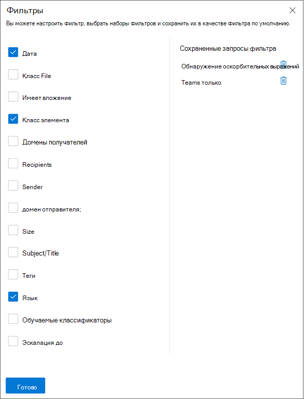
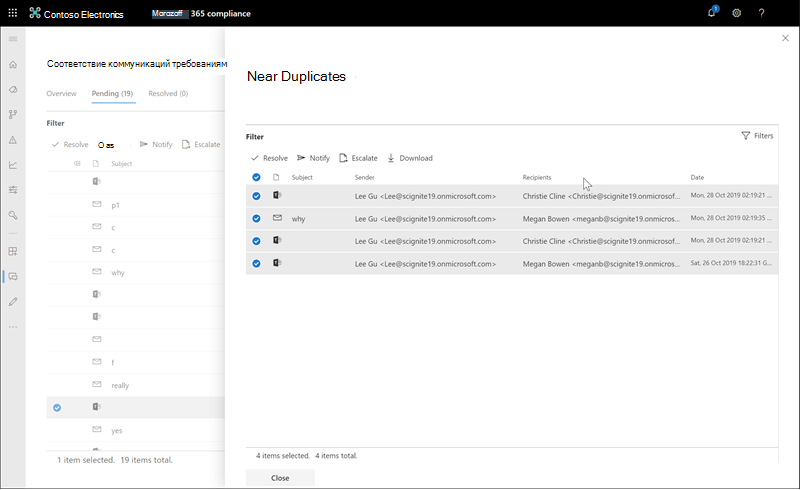
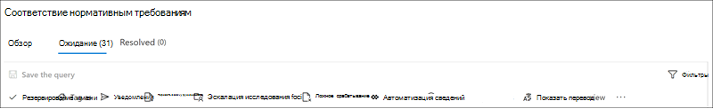
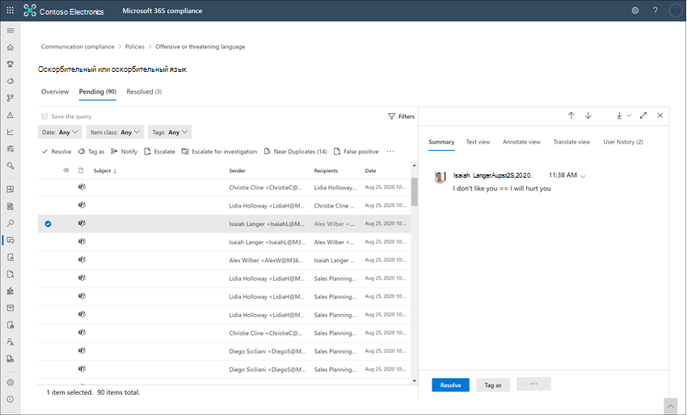

# Анализ и устранений оповещений соответствия требованиям к обмену даннымиInvestigate and remediate communication compliance alerts

После настройки политик соответствия требованиям связи вы начнете получать оповещения в Центр соответствия требованиям Microsoft 365 сообщений, которые соответствуют условиям политики.After you've configured your communication compliance policies, you'll start to receive alerts in the Microsoft 365 compliance center for message issues that match your policy conditions. Следуйте инструкциям рабочего процесса, чтобы исследовать и устранять проблемы оповещения.Follow the workflow instructions here to investigate and remediate alert issues.

## Исследование оповещенийInvestigate alerts

Первым шагом к расследованию проблем, обнаруженных политиками, является проверка оповещений о соответствии требованиям связи в Центр соответствия требованиям Microsoft 365.The first step to investigate issues detected by your policies is to review communication compliance alerts in the Microsoft 365 compliance center. В области решений по обеспечению соответствия требованиям связи существует несколько областей, которые помогут вам быстро изучить оповещения в зависимости от того, как вы предпочитаете просматривать группу оповещения:There are several areas in the communication compliance solution area to help you to quickly investigate alerts, depending on how you prefer to view alert grouping:

- **Страница политики** соответствия требованиям связи. При входе на страницу политики соответствия требованиям к использованию учетных данных для учетной записи администратора в Microsoft 365 организации выберите соответствие коммуникации, чтобы отобразить страницу политики соответствия [https://compliance.microsoft.com](https://compliance.microsoft.com) требованиям.  **Communication compliance policy page**: When you sign in to [https://compliance.microsoft.com](https://compliance.microsoft.com) using credentials for an admin account in your Microsoft 365 organization, select **Communication compliance** to display the communication compliance **Policy** page. На этой странице отображаются политики соответствия требованиям связи, настроенные для Microsoft 365 организации, и ссылки на рекомендуемые шаблоны политики.This page displays communication compliance policies configured for your Microsoft 365 organization and links to recommended policy templates. Каждая указанная политика включает в себя количество оповещений, которые требуют проверки, количество элементов эскалации и разрешения, состояние политики, а также дату и время последнего сканирования политики.Each policy listed includes the count of alerts that need review, the number of escalated and resolved items, status of the policy, and the date and time of the last policy scan. При выборе политики отображаются все ожидающие оповещения о соответствиях политике. Выберите конкретное оповещение, чтобы открыть страницу сведений о политике и выполнить действия по исправлению.Selecting a policy displays all the pending alerts for matches to the policy, select a specific alert to launch the policy details page and to start remediation actions.
- **Оповещения.** Перейдите **к** оповещению о соответствии требованиям связи, чтобы отобразить последние 30 дней оповещений,  >   сгруппироваться по совпадениям политик.**Alerts**: Navigate to **Communication compliance** > **Alerts** to display the last 30 days of alerts grouped by policy matches. Это представление позволяет быстро просмотреть политики соответствия требованиям к обмену данными, создающие наибольшее количество оповещений, упорядоченных по степени серьезности.This view allows you to quickly see which communication compliance policies are generating the most alerts ordered by severity. Чтобы начать действия по исправлению, выберите политику, связанную с оповещением, чтобы запустить страницу сведения **политики.**To start remediation actions, select the policy associated with the alert to launch the **Policy details** page. На странице **Сведения** о политике можно просмотреть сводку действий на странице **Обзор,** просмотреть и действовать в отношении сообщений оповещения на странице Ожидание или просмотреть историю закрытых оповещений на странице  **Resolved.**From the **Policy details** page, you can review a summary of the activities on the **Overview** page, review and act on alert messages on the **Pending** page, or review the history of closed alerts on the **Resolved** page.
- **Отчеты.** Перейдите к **отчетам о** соответствии требованиям связи,  >   чтобы отобразить виджеты отчетов о соответствии.**Reports**: Navigate to **Communication compliance** > **Reports** to display communication compliance report widgets. Каждый виджет предоставляет обзор действий и статусов соответствия требованиям связи, включая доступ к более глубоким сведениям о совпадениях политики и действиях по исправлению.Each widget provides an overview of communication compliance activities and statuses, including access to deeper insights about policy matches and remediation actions.

### Использование фильтровUsing filters

Далее необходимо отсортировать сообщения, чтобы упростить исследование оповещений.The next step is to sort the messages so that it's easier for you to investigate alerts. На странице **Сведения о** политике соответствие требованиям связи поддерживает многоуровневую фильтрацию для нескольких полей сообщений, чтобы помочь вам быстро исследовать и просмотреть сообщения с помощью совпадений политик.From the **Policy details** page, communication compliance supports multi-level filtering for several message fields to help you quickly investigate and review messages with policy matches. Фильтрация доступна для ожидающих и разрешенных элементов для каждой настроенной политики.Filtering is available for pending and resolved items for each configured policy. Вы можете настроить запросы фильтра для политики или настроить и сохранить пользовательские и стандартные запросы фильтра для каждой конкретной политики.You can configure filter queries for a policy or configure and save custom and default filter queries for use in each specific policy. После настройки поля фильтра отобразятся в верхней части очереди оповещений, для которых можно настроить определенные значения фильтра.After configuring fields for a filter, you'll see the filter fields displayed on the top of the alert message queue that you can configure for specific filter values.

Полный список фильтров и сведений о поле см. в статье [Filters](communication-compliance-feature-reference.md#filters) in the feature reference.For a complete list of filters and field details, see [Filters](communication-compliance-feature-reference.md#filters) in the feature reference article.

#### Настройка фильтраTo configure a filter

1. [https://compliance.microsoft.com](https://compliance.microsoft.com)Впишитесь в использование учетных данных для учетной записи администратора в Microsoft 365 организации.Sign into [https://compliance.microsoft.com](https://compliance.microsoft.com) using credentials for an admin account in your Microsoft 365 organization.

2. В Центр соответствия требованиям Microsoft 365 перейдите к **соблюдению правил связи.**In the Microsoft 365 compliance center, go to **Communication compliance**.

3. Выберите **вкладку Политики** и выберите политику для исследования, дважды щелкните, чтобы открыть страницу **Политика.**Select the **Policies** tab and then select a policy for investigation, double-click to open the **Policy** page.

4. На странице **Политика** выберите вкладку **"Ожидание"** или **"Разрешено",** чтобы отобразить элементы для фильтрации.On the **Policy** page, select either the **Pending** or **Resolved** tab to display the items for filtering.

5. Выберите управление **Фильтры,** чтобы открыть **страницу сведений о фильтрах.**Select the **Filters** control to open the **Filters** details page.

6. Выберите один или несколько контрольных ящиков, чтобы включить фильтры для этих оповещений.Select one or more checkboxes to enable filters for these alerts. Вы можете выбрать из множества фильтров, в том числе *Date,* *Sender,* *Subject/Title,* *Classifiers,* *Language* и других.You can choose from numerous filters, including *Date*, *Sender*, *Subject/Title*, *Classifiers*, *Language*, and more.

7. Если вы хотите сохранить фильтр, выбранный в качестве фильтра по умолчанию, выберите **Сохранить по умолчанию.**If you'd like to save the filter selected as the default filter, select **Save as default**. Если вы хотите использовать этот фильтр в качестве сохраненного фильтра, выберите **Готово**.If you want to use this filter as a saved filter, select **Done**.

8. Если вы хотите сохранить выбранные фильтры в качестве запроса фильтра, выберите **Сохранить** управление запросом после настройки по крайней мере одного значения фильтра.If you'd like to save the selected filters as a filter query, select **Save the query** control after you've configured at least one filter value. Введите имя запроса фильтра и выберите **Сохранить**.Enter a name for the filter query and select **Save**. Этот фильтр доступен только для этой политики и  указан в разделе Сохраненные запросы фильтра на странице **Сведения Фильтры.**This filter is available to use for only this policy and is listed in the **Saved filter queries** section of the **Filters** details page.

    

### Анализ неполных и полных дубликатовUsing near and exact duplicate analysis

Политики соответствия требованиям к обмену данными автоматически сканируют и предварительно группируют неполные и полные дубликаты сообщений без дополнительных действий по настройке.Communication compliance policies automatically scan and pre-group near and exact message duplicates without any additional configuration steps. Это представление позволяет быстро действовать по похожим сообщениям по одному или в группе, уменьшая нагрузку на исследование сообщений для рецензентов.This view allows you to quickly act on similar messages one-by-one or as a group, reducing the message investigation burden for reviewers. При обнаружении дубликатов на панели инструментов действий по исправлению отображаются элементы управления **Неполными дубликатами** и (или) **Полными дубликатами**.As duplicates are detected, the **Near Duplicates** and/or the **Exact Duplicates** controls are displayed in the remediation action toolbar. Это представление не доступно, если не найдены ближайшие или точные дубликаты.This view isn't available if near or exact duplicates aren't found.

#### Исправление дубликатовTo remediate duplicates

1. [https://compliance.microsoft.com](https://compliance.microsoft.com)Впишитесь в использование учетных данных для учетной записи администратора в Microsoft 365 организации.Sign into [https://compliance.microsoft.com](https://compliance.microsoft.com) using credentials for an admin account in your Microsoft 365 organization.

2. В Центр соответствия требованиям Microsoft 365 перейдите к **соблюдению правил связи.**In the Microsoft 365 compliance center, go to **Communication compliance**.

3. Выберите **вкладку Политики** и выберите политику для исследования, дважды щелкните, чтобы открыть страницу **Политика.**Select the **Policies** tab and then select a policy for investigation, double-click to open the **Policy** page.

4. На странице **Политика** выберите вкладку **"Ожидание"** или **"Разрешено",** чтобы отобразить дублирующиеся сообщения.On the **Policy** page, select either the **Pending** or **Resolved** tab to display duplicate messages.

5. Выберите элементы **управления Near Duplicates** или **Exact Duplicates,** чтобы открыть страницу сведений о дубликатах.Select the **Near Duplicates** or **Exact Duplicates** controls to open the duplicates details page.

6. Выберите одно или несколько сообщений для управления действиями по исправлению этих сообщений.Select one or more messages to remediation action controls for these messages.

7. Выберите **решение,** **уведомление,** **эскалацию** или **скачивание,** чтобы применить действие к выбранным дублирующим сообщениям в качестве фильтра по умолчанию.Select **Resolve**, **Notify**, **Escalate**, or **Download** to apply the action to the selected duplicate messages as the default filter.

8. Выберите **Закрыть** после выполнения действий по исправлению сообщений.Select **Close** after completing the remediation actions on the messages.

    

## Исправление оповещенийRemediate alerts

Независимо от вкладки, на которой просматриваются оповещения, или настроек фильтрации, следующий шаг заключается в принятии мер по исправлению оповещений.No matter where you start to review alerts or the filtering you configure, the next step is to take action to remediate the alert. Начните исправление оповещений с помощью следующего рабочего процесса на страницах **Политики** или **Оповещений.**Start your alert remediation using the following workflow on the **Policy** or **Alerts** pages.

### Шаг 1. Изучение основ сообщенийStep 1: Examine the message basics

 Иногда из источника или субъекта очевидно, что сообщение может быть немедленно исправлено.Sometimes it's obvious from the source or subject that a message can be immediately remediated. Вполне возможно, что сообщение является ложным или неправильно совпадает с политикой, и оно должно быть разрешено неправильно.It may be that the message is spurious or incorrectly matched to a policy and it should be resolved as misclassified. Выберите отчет в качестве неправильно **классифицированного** управления, чтобы поделиться несекретным контентом с Microsoft, немедленно устранить предупреждение и удалить из очереди ожидающих оповещения.Select the **Report as misclassified** control to share misclassified content with Microsoft, immediately resolve the alert, and remove from the pending alert queue. Из сведений об источнике или отправителе можно узнать, как перенаправить или обработать сообщение в данных обстоятельствах.From the source or sender information, you may already know how the message should be routed or handled in these circumstances. Рассмотрите возможность использования элементов управления **Пометить как** или **Передать на обработку**, чтобы назначить тег соответствующим сообщениям или отправить сообщения назначенному проверяющему.Consider using the **Tag as** or **Escalate** controls to assign a tag to applicable messages or to send messages to a designated reviewer.

### Шаг 2. Изучение сведений о сообщенииStep 2: Examine the message details

После изучения основ сообщения пришло время открыть сообщение, чтобы изучить сведения и определить дальнейшие действия по исправлению.After reviewing the message basics, it's time to open a message to examine the details and to determine further remediation actions. Выберите сообщение, чтобы полностью просмотреть его заголовок и текст.Select a message to view the complete message header and body information. Доступно несколько различных представлений, позволяющих определить правильный порядок действий.Several different views are available to help you decide the proper course of action:

- **Представление источника**. Это стандартное представление сообщений, обычно используемое в большинстве веб-платформ обмена сообщениями.**Source view**: This view is the standard message view commonly seen in most web-based messaging platforms. Сведения о заголовке отформатированы в обычном стиле, а тело сообщения поддерживает imbeddeded графические файлы и текст с завернутой словом.The header information is formatted in the normal style and the message body supports imbedded graphic files and word-wrapped text. Если для политики включено оптическое распознавание символов [(OCR),](communication-compliance-feature-reference.md#optical-character-recognition-ocr) изображения, содержащие печатный или рукописный текст, который соответствует условной политике, рассматриваются в качестве детского элемента для связанного сообщения в этом представлении.If [optical character recognition (OCR)](communication-compliance-feature-reference.md#optical-character-recognition-ocr) is enabled for the policy, images containing printed or handwritten text that match policy conditional are viewed as a child item for the associated message in this view.
- Представление **текста.** В текстовом представлении отображается только текстовое представление сообщения с номером строки, а также ключевые слова, выделяющиеся в сообщениях и вложениях для конфиденциальных терминов или ключевых слов, совпадающих с связанной политикой соответствия требованиям к коммуникации.**Text view**: Text view displays a line-numbered text-only view of the message and includes keyword highlighting in messages and attachments for sensitive info type terms or keywords matched in the associated communication compliance policy. Выделение ключевых слов поможет быстро сканировать длинные сообщения и вложения в интересующие области.Keyword highlighting can help you quickly scan long messages and attachments for the area of interest. В некоторых случаях выделенный текст может быть только в вложениях для сообщений, совпадающих с условиями политики.In some cases, highlighted text may be only in attachments for messages matching policy conditions. Выделение ключевого слова не поддерживается для терминов, идентифицированных встроенными классификаторами, назначенной политике.Keyword highlighting isn't supported for terms identified by built-in classifiers assigned to a policy. Встроенные файлы не отображаются, а строка с номером этого представления полезна для ссылок на подробные сведения из нескольких рецензентов.Embedded files aren't displayed and the line numbering this view is helpful for referencing pertinent details among multiple reviewers.
- **Представление для заметок**. Это представление позволяет проверяющим добавлять заметки непосредственно в сообщение, которые сохраняются в его представлении.**Annotate view**: This view allows reviewers to add annotations directly on the message that are saved to the view of the message. Если для политики включенА [OCR,](communication-compliance-feature-reference.md#optical-character-recognition-ocr) изображения, содержащие печатный или рукописный текст, которые соответствуют условной политике, рассматриваются в качестве детского элемента для связанного сообщения в этом представлении и могут быть аннотированы.If [OCR is enabled](communication-compliance-feature-reference.md#optical-character-recognition-ocr) for the policy, images containing printed or handwritten text that match policy conditional are viewed as a child item for the associated message in this view and may be annotated.
- **Представление беседы (предварительный просмотр)**: Доступно для Microsoft Teams сообщений чата, это представление отображает до пяти сообщений до и после оповещения, чтобы помочь рецензентам просматривать действия в диалоговом контексте.**Conversation view (preview)**: Available for Microsoft Teams chat messages, this view displays up to five messages before and after an alert message to help reviewers view the activity in the conversational context. Этот контекст помогает рецензентам быстро оценивать сообщения и принимать более обоснованные решения по разрешению сообщений.This context helps reviewers to quickly evaluate messages and make more informed message resolution decisions. В режиме реального времени отображаются добавления сообщений к беседам, включая все изображения, смайлики и наклейки, доступные в Teams.Real-time message additions to conversations are displayed, including all inline images, emojis, and stickers available in Teams. Вложения изображений или текстовых файлов в сообщения не отображаются.Image or text file attachments to messages aren't displayed. Уведомления автоматически отображаются для сообщений, которые были отредактированы, или для сообщений, удаленных из окна беседы.Notifications are automatically displayed for messages that have been edited or for messages that have been deleted from the conversation window. Когда сообщение будет разрешено, связанные беседные сообщения не сохраняются с разрешенным сообщением.When a message is resolved, the associated conversational messages aren't retained with the resolved message. Сообщения беседы доступны в течение 60 дней после идентифицированного оповещения.Conversation messages are available for up to 60 days after the alert message is identified.
- **Журнал пользователей**. В представлении журнала пользователей отображаются все остальные оповещения, созданные политикой соответствия требованиям к обмену данными для пользователя, отправляющего сообщение.**User history**: User history view displays all other alerts generated by any communication compliance policy for the user sending the message.
- **Уведомление об обнаружении** шаблона. Многие действия, преследующие и запугивая пользователей, со временем включают повторную передачу экземпляров одного и того же поведения пользователя.**Pattern detected notification**: Many harassing and bullying actions over time and involve reoccurring instances of the same behavior by a user. Уведомление *об обнаружении шаблона* отображается в сведениях оповещений и повышает внимание к оповещению.The *Pattern detected* notification is displayed in the alert details and raises attention to the alert. Обнаружение шаблонов происходит на основе политики и оценивает поведение в течение последних 30 дней, когда отправитель отправляет по крайней мере два сообщения одному получателю.Detection of patterns is on a per-policy basis and evaluates behavior over the last 30 days when at least two messages are sent to the same recipient by a sender. Следователи и рецензенты могут использовать это уведомление, чтобы определить повторяющееся поведение для оценки оповещений по мере необходимости.Investigators and reviewers can use this notification to identify repeated behavior to evaluate the alert as appropriate.
- **Показать представление Translate.** Это представление автоматически преобразует текст сообщения оповещения  в язык, настроенный в параметре Отображаемый язык в подписке Microsoft 365 для каждого рецензента.**Show Translate view**: This view automatically converts alert message text to the language configured in the *Displayed language* setting in the Microsoft 365 subscription for each reviewer. Представление Translate помогает расширить поддержку расследований для организаций с многоязычными пользователями и устраняет необходимость в дополнительных службах перевода за пределами процесса проверки соответствия требованиям к связи.The Translate view helps broaden investigative support for organizations with multilingual users and eliminates the need for additional translation services outside of the communication compliance review process. С помощью служб Microsoft Translate представление Translate может быть включено и отключено по мере необходимости и поддерживает широкий диапазон языков.Using Microsoft Translate services, the Translate view can be turned on and off as needed and supports a wide range of languages. Полный список поддерживаемых языков см. в Переводчик Майкрософт [Languages.](https://www.microsoft.com/translator/business/languages/)For a complete list of supported languages, see [Microsoft Translator Languages](https://www.microsoft.com/translator/business/languages/). Языки, *перечисленные в Переводчик языковом списке,* поддерживаются в представлении Translate.Languages listed in the *Translator Language List* are supported in the Translate view.

    

### Шаг 3. Решение о действии по исправлениюStep 3: Decide on a remediation action

Теперь, когда вы рассмотрели сведения о сообщении для оповещения, вы можете выбрать несколько действий по исправлению:Now that you've reviewed the details of the message for the alert, you can choose several remediation actions:

- **Решение.** Выбор управления **Разрешением** немедленно удаляет  сообщение из очереди ожидающих оповещений, и никаких дальнейших действий по сообщению не может быть принято.**Resolve**: Selecting the **Resolve** control immediately removes the message from the **Pending alerts** queue and no further action can be taken on the message. Выбрав **Решение,** вы, по сути, закрыли оповещение без дополнительной классификации и его нельзя открыть для дальнейших действий.By selecting **Resolve**, you've essentially closed the alert without further classification and it can't be reopened for further actions. Все разрешенные сообщения отображаются на вкладке **Resolved.**All resolved messages are displayed in the **Resolved** tab.
- **Отчет как неправильно классифицированный (предварительный просмотр).** Всегда можно разрешить сообщение как неправильно классифицированное в любой момент во время рабочего процесса проверки сообщений.**Report as misclassified (preview)**: You can always resolve a message as misclassified at any point during the message review workflow. Неправильное классификация означает, что оповещение не является действием или что оповещение было неправильно сгенерировано процессом оповещения и любыми классификаторами, которые можно обучить.Misclassified signifies that the alert was non-actionable or that the alert was incorrectly generated by the alerting process and any trainable classifiers. Устранение неправильно классифицированного элемента отправляет содержимое сообщения, вложения и объект сообщения (в том числе метаданные) в Корпорацию Майкрософт для улучшения классификаторов, которые можно обучить.Resolving the item as misclassified sends message content, attachments, and the message subject (including metadata) to Microsoft to help improve trainable classifiers. Данные, отосланные в Корпорацию Майкрософт, не содержат сведений, которые могут идентифицировать или использоваться для идентификации пользователей в вашей организации.Data that is sent to Microsoft does not contain information that may identify or be used to identify any users in your organization. Дальнейшие действия не могут быть приняты в сообщении, и все неправильно классифицированные сообщения отображаются на вкладке **Resolved.**Further actions cannot be taken on the message and all misclassified messages are displayed in the **Resolved** tab.
- **Power Automate (предварительный просмотр)**: используйте поток Power Automate для автоматизации задач процесса для оповещения.**Power Automate (preview)**: Use a Power Automate flow to automate process tasks for an alert message. По умолчанию соответствие требованиям  связи включает диспетчер уведомлений, когда у пользователя есть шаблон оповещений о соответствии требованиям, который рецензенты могут использовать для автоматизации процесса уведомлений для пользователей с помощью оповещений.By default, communication compliance includes the *Notify manager when a user has a communication compliance alert* flow template that reviewers can use to automate the notification process for users with message alerts. Дополнительные сведения о создании и управлении потоками Power Automate связи см. в статье Справочная статья о соответствии требованиям к [средствам](communication-compliance-feature-reference.md#power-automate-flows) связи.For more information about creating and managing Power Automate flows in communication compliance, see the [Communication compliance feature reference](communication-compliance-feature-reference.md#power-automate-flows) article.
- **Тег как**: Тег сообщения как совместимый, не  совместимый *,* или как сомнительный, как это относится к политикам и стандартам для вашей организации. **Tag as**: Tag the message as *compliant*, *non-compliant*, or as *questionable* as it relates to the policies and standards for your organization. Добавление тегов и комментариев по тегам помогает предупреждать политику микрофильтров для эскалаций или в рамках других внутренних процессов проверки.Adding tags and tagging comments helps you micro-filter policy alerts for escalations or as part of other internal review processes. После завершения пометки можно также разрешить сообщение, чтобы переместить его из очереди ожидающих проверки.After tagging is complete, you can also choose to resolve the message to move it out of the pending review queue.
- **Уведомление.** Вы можете использовать управление **Notify,** чтобы назначить настраиваемый шаблон уведомлений оповещению и отправить предупреждение пользователю.**Notify**: You can use the **Notify** control to assign a custom notice template to the alert and to send a warning notice to the user. Выберите подходящий шаблон уведомлений, настроенный в области параметров соответствия требованиям связи, и выберите **Отправить** по электронной почте напоминание пользователю, который отправил сообщение, и устранить проблему. Choose the appropriate notice template configured in the **Communication compliance settings** area and select **Send** to email a reminder to the user that sent the message and to resolve the issue.
- **Escalate.** С помощью управления **Escalate** можно выбрать, кому еще в организации следует просмотреть сообщение.**Escalate**: Using the **Escalate** control, you can choose who else in your organization should review the message. Выберите список рецензентов, настроенных в политике соответствия требованиям связи, чтобы отправить уведомление по электронной почте с просьбой дополнительно просмотреть оповещение о сообщении.Choose from a list of reviewers configured in the communication compliance policy to send an email notification requesting additional review of the message alert. Выбранный проверяющий может использовать ссылку в электронном уведомлении, чтобы перейти непосредственно к элементам, переданным ему на проверку.The selected reviewer can use a link in the email notification to go directly to items escalated to them for review.
- **Эскалация для расследования**  . Использование эскалации для контроля  расследования, вы можете создать новый Advanced eDiscovery для одного или нескольких сообщений.**Escalate for investigation**: Using the **Escalate for investigation** control, you can create a new [Advanced eDiscovery case](overview-ediscovery-20.md) for single or multiple messages. Вы предоставите имя и заметки для нового дела, и пользователь, отправивший сообщение, совпадающий с политикой, автоматически назначен хранителю дела.You'll provide a name and notes for the new case, and user who sent the message matching the policy is automatically assigned as the case custodian. Дополнительные разрешения для управления случаем не требуются.You don't need any additional permissions to manage the case. Создание случая не устраняет и не создает новый тег для сообщения.Creating a case does not resolve or create a new tag for the message. Вы можете выбрать в общей сложности 100 сообщений при создании Advanced eDiscovery в процессе восстановления.You can select a total of 100 messages when creating an Advanced eDiscovery case during the remediation process. Поддерживается поддержка сообщений во всех каналах связи, отслеживаемых соблюдением требований к связи.Messages in all communication channels monitored by communication compliance are supported. Например, вы можете выбрать 50 Microsoft Teams чатов, 25 Exchange Online сообщений электронной почты и 25 Yammer сообщений при открываемом Advanced eDiscovery случае для пользователя.For example, you could select 50 Microsoft Teams chats, 25 Exchange Online email messages, and 25 Yammer messages when you open a new Advanced eDiscovery case for a user.
- **Удаление** сообщения в Teams :  Использование удаления сообщения в Teams управления, вы можете блокировать нежелательные сообщения и контент, идентифицированные в оповещениях из Microsoft Teams каналов и 1:1 и групповых чатов.**Remove message in Teams**: Using the **Remove message in Teams** control, you can block inappropriate messages and content identified in alerts from Microsoft Teams channels and 1:1 and group chats. Удаляемые сообщения и содержимое заменяются подсказкой политики, которая объясняет, что она заблокирована, и политикой, применяемой к его удалению из представления.Removed messages and content are replaced with a policy tip that explains that it is blocked and the policy that applies to its removal from view. Получателям предоставляется ссылка в подсказке политики, чтобы узнать больше о применимой политике и процессе проверки.Recipients are provided a link in the policy tip to learn more about the applicable policy and the review process. Отправитель получает подсказку политики для заблокированного сообщения и контента, но может просмотреть сведения о заблокированных сообщениях и контенте для контекста, касающегося удаления.The sender receives a policy tip for the blocked message and content but can review the details of the blocked message and content for context regarding the removal.

    

### Шаг 4. Определите, следует ли архивировать сведения о сообщениях вне соответствия требованиям связи.Step 4: Determine if message details should be archived outside of communication compliance

Сведения о сообщениях можно экспортировать или скачивать, если требуется архивировать сообщения в отдельном решении хранилища.Message details can be exported or downloaded if you need to archive the messages in a separate storage solution. При выборе элемента управления **Скачать** выбранные сообщения будут автоматически добавлены в ZIP-файл, который можно сохранить в хранилище за пределами Microsoft 365.Selecting the **Download** control automatically adds selected messages to a .ZIP file that can be saved to storage outside of Microsoft 365.
