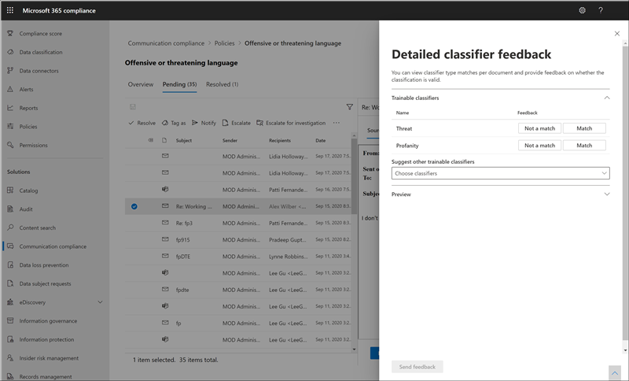

# Анализ и устранений оповещений соответствия требованиям к обмену даннымиInvestigate and remediate communication compliance alerts

После настройки политик соответствия требованиям к общению вы начнете получать оповещения в центре соответствия требованиям Microsoft 365 о проблемах с сообщениями, которые соответствуют условиям политики.After you've configured your communication compliance policies, you'll start to receive alerts in the Microsoft 365 compliance center for message issues that match your policy conditions. Следуйте инструкциям по работе с рабочим процессом для изучения и исправления проблем с оповещениями.Follow the workflow instructions here to investigate and remediate alert issues.

## Анализ оповещенийInvestigate alerts

Первый шаг к исследованию проблем, обнаруженных политиками, состоит в рассмотрении оповещений о соответствии требованиям в центре соответствия требованиям Microsoft 365.The first step to investigate issues detected by your policies is to review communication compliance alerts in the Microsoft 365 compliance center. В области решения для обеспечения соответствия требованиям существует несколько областей, которые помогут быстро изучить оповещения в зависимости от того, как вы предпочитаете просматривать группу оповещений:There are several areas in the communication compliance solution area to help you to quickly investigate alerts, depending on how you prefer to view alert grouping:

- **Страница "политика соответствия требованиям к общению**": при входе в учетную [https://compliance.microsoft.com](https://compliance.microsoft.com) запись администратора в организации Microsoft 365 выберите элемент " **соответствие требованиям** ", чтобы отобразить страницу " **Политика** соответствия требованиям к общению".**Communication compliance policy page**: When you sign in to [https://compliance.microsoft.com](https://compliance.microsoft.com) using credentials for an admin account in your Microsoft 365 organization, select **Communication compliance** to display the communication compliance **Policy** page. На этой странице отображаются политики соответствия требованиям для связи, настроенные для организации Microsoft 365, и ссылки на рекомендуемые шаблоны политики.This page displays communication compliance policies configured for your Microsoft 365 organization and links to recommended policy templates. Каждая указанная политика включает в себя количество оповещений, которые необходимо просмотреть, число расширенных и разрешенных элементов, а также текущее состояние политики.Each policy listed includes the count of alerts that need review, the number of escalated and resolved items, and the current status of the policy. При выборе политики отображаются все ожидающие оповещения для соответствующих политик, выберите конкретное оповещение для запуска страницы сведений о политике и для запуска действий по исправлению.Selecting a policy displays all the pending alerts for matches to the policy, select a specific alert to launch the policy details page and to start remediation actions.
- **Alerts**: выберите **Communication compliance**пункт  >  **оповещения о** соответствии в связи для отображения последних 30 дней оповещений, сгруппированных по совпадениям политик.**Alerts**: Navigate to **Communication compliance** > **Alerts** to display the last 30 days of alerts grouped by policy matches. Это представление позволяет быстро просмотреть, какие политики соответствия требованиям на связь создают большинство оповещений, упорядоченных по степени серьезности.This view allows you to quickly see which communication compliance policies are generating the most alerts ordered by severity. Чтобы запустить действия по исправлению, выберите политику, связанную с оповещением, чтобы открыть страницу **сведений о политике** .To start remediation actions, select the policy associated with the alert to launch the **Policy details** page. На странице **сведения о политике** можно просмотреть сводку по действиям на странице **Обзор** , просмотреть и выполнить оповещения на странице " **ожидается** ", а также просмотреть историю закрытых оповещений на странице " **разрешено** ".From the **Policy details** page, you can review a summary of the activities on the **Overview** page, review and act on alert messages on the **Pending** page, or review the history of closed alerts on the **Resolved** page.
- **Reports**: переход **Communication compliance**к  >  **отчетам** о соответствии для взаимодействия для отображения мини – отчетов о соответствии требованиям.**Reports**: Navigate to **Communication compliance** > **Reports** to display communication compliance report widgets. В каждом мини-приложении представлены общие сведения о действиях и состояниях обеспечения соответствия требованиям, в том числе доступ к более глубокой информации о сопоставлениях политик и действиях по исправлению.Each widget provides an overview of communication compliance activities and statuses, including access to deeper insights about policy matches and remediation actions.

### Использование фильтровUsing filters

Следующий шаг — сортировка сообщений для упрощения изучения оповещений.The next step is to sort the messages so that it's easier for you to investigate alerts. На странице " **сведения о политике** " соответствие соответствия требованиям поддерживает Многоуровневая фильтрация для нескольких полей сообщений, позволяющих быстро изучить и просмотреть сообщения с соответствием политик.From the **Policy details** page, communication compliance supports multi-level filtering for several message fields to help you quickly investigate and review messages with policy matches. Фильтрация доступна для ожидающих и разрешенных элементов для каждой настроенной политики.Filtering is available for pending and resolved items for each configured policy. Можно настроить запросы фильтрации для политики, а также настроить и сохранить пользовательские запросы фильтра и фильтры по умолчанию для использования в каждой конкретной политике.You can configure filter queries for a policy or configure and save custom and default filter queries for use in each specific policy. После настройки полей для фильтра вы увидите поля фильтра, отображаемые в верхней части очереди предупредительных сообщений, которую можно настроить для определенных значений фильтра.After configuring fields for a filter, you'll see the filter fields displayed on the top of the alert message queue that you can configure for specific filter values.

Полный список фильтров и сведения о полях можно найти в статье [Справочник по](communication-compliance-feature-reference.md#filters) функциям.For a complete list of filters and field details, see [Filters](communication-compliance-feature-reference.md#filters) in the feature reference article.

#### Настройка фильтраTo configure a filter

1. Войдите в систему [https://compliance.microsoft.com](https://compliance.microsoft.com) , используя учетные данные для учетной записи администратора в организации Microsoft 365.Sign into [https://compliance.microsoft.com](https://compliance.microsoft.com) using credentials for an admin account in your Microsoft 365 organization.

2. В центре соответствия требованиям Microsoft 365 перейдите к разделу **соответствие требованиям к общению**.In the Microsoft 365 compliance center, go to **Communication compliance**.

3. Перейдите на вкладку **политики** и выберите политику для исследования, дважды щелкните, чтобы открыть страницу **Политика** .Select the **Policies** tab and then select a policy for investigation, double-click to open the **Policy** page.

4. На странице **Политика** выберите вкладку **ожидающие** или **Разрешенные** , чтобы отобразить элементы для фильтрации.On the **Policy** page, select either the **Pending** or **Resolved** tab to display the items for filtering.

5. Выберите элемент управления " **фильтры** ", чтобы открыть страницу "сведения о **фильтрах** ".Select the **Filters** control to open the **Filters** details page.

6. Выберите один или несколько флажков, чтобы включить фильтры для этих оповещений.Select one or more checkboxes to enable filters for these alerts. Можно выбрать один из многочисленных фильтров, в том числе *дату*, *отправитель*, *Тема/должность*, *классификаторы*и многое другое.You can choose from numerous filters, including *Date*, *Sender*, *Subject/Title*, *Classifiers*, and more.

7. Если вы хотите сохранить фильтр, выбранный в качестве фильтра по умолчанию, выберите пункт **Сохранить как используемый по умолчанию**.If you'd like to save the filter selected as the default filter, select **Save as default**. Если вы хотите использовать этот фильтр в качестве сохраненного фильтра, нажмите кнопку **Готово**.If you want to use this filter as a saved filter, select **Done**.

8. Если вы хотите сохранить выбранные фильтры как запрос фильтра, выберите сохранить элемент управления **запросом** после настройки по крайней мере одного значения фильтра.If you'd like to save the selected filters as a filter query, select **Save the query** control after you've configured at least one filter value. Введите имя запроса фильтра и нажмите кнопку **сохранить**.Enter a name for the filter query and select **Save**. Этот фильтр можно использовать только для этой политики и отображается в разделе **сохраненные запросы фильтра** на странице "сведения о **фильтрах** ".This filter is available to use for only this policy and is listed in the **Saved filter queries** section of the **Filters** details page.

    

### Использование почти и точного анализа повторяющихся данныхUsing near and exact duplicate analysis

Политики соответствия требованиям автоматически проверяют и передают повторяющиеся копии сообщений, не требуя дополнительных действий по настройке.Communication compliance policies automatically scan and pre-group near and exact message duplicates without any additional configuration steps. Это представление позволяет быстро работать с аналогичными сообщениями одним или несколькими группами, уменьшая нагрузку на сообщения для рецензентов.This view allows you to quickly act on similar messages one-by-one or as a group, reducing the message investigation burden for reviewers. По мере обнаружения дубликатов в панели инструментов действие по исправлению отображаются **почти повторяющиеся** элементы и/или точные элементы управления **дубликатами** .As duplicates are detected, the **Near Duplicates** and/or the **Exact Duplicates** controls are displayed in the remediation action toolbar. Это представление недоступно, если не найдены близкие или точные дубликаты.This view isn't available if near or exact duplicates aren't found.

#### Исправление дубликатовTo remediate duplicates

1. Войдите в систему [https://compliance.microsoft.com](https://compliance.microsoft.com) , используя учетные данные для учетной записи администратора в организации Microsoft 365.Sign into [https://compliance.microsoft.com](https://compliance.microsoft.com) using credentials for an admin account in your Microsoft 365 organization.

2. В центре соответствия требованиям Microsoft 365 перейдите к разделу **соответствие требованиям к общению**.In the Microsoft 365 compliance center, go to **Communication compliance**.

3. Перейдите на вкладку **политики** и выберите политику для исследования, дважды щелкните, чтобы открыть страницу **Политика** .Select the **Policies** tab and then select a policy for investigation, double-click to open the **Policy** page.

4. На странице **Политика** выберите вкладку **ожидающие** или **Разрешенные** , чтобы отобразить повторяющиеся сообщения.On the **Policy** page, select either the **Pending** or **Resolved** tab to display duplicate messages.

5. Чтобы открыть страницу "сведения о дубликатах", выберите **соседние элементы управления повторениями** или **точные дубликаты** .Select the **Near Duplicates** or **Exact Duplicates** controls to open the duplicates details page.

6. Выберите одно или несколько сообщений для управления действиями по исправлению этих сообщений.Select one or more messages to remediation action controls for these messages.

7. Выберите **Разрешить**, **уведомить**, **эскалировать**или **скачать** , чтобы применить действие к выбранным копиям сообщений в качестве фильтра по умолчанию.Select **Resolve**, **Notify**, **Escalate**, or **Download** to apply the action to the selected duplicate messages as the default filter.

8. Нажмите кнопку **Закрыть** после завершения действий по исправлению сообщений.Select **Close** after completing the remediation actions on the messages.

    

## Исправление оповещенийRemediate alerts

Если вы не хотите просматривать оповещения или параметры фильтрации, то следующим шагом будет выполнение действий по исправлению оповещения.No matter where you start to review alerts or the filtering you configure, the next step is to take action to remediate the alert. Начните устранение неполадок оповещений с помощью следующего рабочего процесса на страницах **политики** или **оповещений** .Start your alert remediation using the following workflow on the **Policy** or **Alerts** pages.

### Шаг 1: изучение основы сообщенияStep 1: Examine the message basics

 Иногда это очевидно от источника или темы, что сообщение может быть немедленно исправлено.Sometimes it's obvious from the source or subject that a message can be immediately remediated. Может быть, что сообщение является ложным или неправильно сопоставлено с политикой и должно быть распознано как ложное срабатывание.It may be that the message is spurious or incorrectly matched to a policy and it should be resolved as a false positive. Выберите элемент управления **ложного срабатывания** , чтобы немедленно разрешить оповещение и удалить его из очереди ожидающих оповещений.Select the **False Positive** control to immediately resolve the alert and remove from the pending alert queue. Из сведений об источнике или отправителю вы, возможно, уже знаете, как сообщение должно быть перенаправлено или обработано в таких обстоятельствах.From the source or sender information, you may already know how the message should be routed or handled in these circumstances. Рассмотрите возможность использования **тега в качестве** или **эскалации** элементов управления для назначения тега применимым сообщениям или отправки сообщений назначенному рецензенту.Consider using the **Tag as** or **Escalate** controls to assign a tag to applicable messages or to send messages to a designated reviewer.

### Шаг 2: Проверка сведений о сообщенииStep 2: Examine the message details

После проверки основ сообщений можно открыть сообщение, чтобы просмотреть сведения и определить дальнейшие действия по исправлению.After reviewing the message basics, it's time to open a message to examine the details and to determine further remediation actions. Выберите сообщение, чтобы просмотреть полный заголовок и сведения о тексте сообщения.Select a message to view the complete message header and body information. Существует несколько различных представлений, которые помогут вам правильно определить действие:Several different views are available to help you decide the proper course of action:

- **Представление исходного кода**: данное представление является стандартным представлением сообщений, которое обычно отображается на большинстве платформ обмена сообщениями на основе Интернета.**Source view**: This view is the standard message view commonly seen in most web-based messaging platforms. Сведения о заголовке форматируются в стиле Normal, а текст сообщения поддерживает внедренные графические файлы и текст с переносом по словам.The header information is formatted in the normal style and the message body supports imbedded graphic files and word-wrapped text.
- **Представление текста**: в текстовом представлении отображается текстовое представление сообщения с числовым номером и включает выделение ключевых слов для терминов, соответствующих политике обеспечения соответствия требованиям на связь.**Text view**: Text view displays a line-numbered text-only view of the message and includes keyword highlighting for terms matched in the associated communication compliance policy. Выделение ключевых слов помогает быстро сканировать длинные сообщения для интересующей области.Keyword highlighting can help you quickly scan long messages for the area of interest. Внедренные файлы не отображаются, а нумерация строк это представление полезно для ссылки на нужные сведения среди нескольких рецензентов.Embedded files aren't displayed and the line numbering this view is helpful for referencing pertinent details among multiple reviewers.
- **Представление "Примечания**": это представление позволяет проверяющим добавлять заметки непосредственно к сообщению, сохраненному в представлении сообщения.**Annotate view**: This view allows reviewers to add annotations directly on the message that are saved to the view of the message.
- **Журнал пользователей**: в представлении "журнал пользователя" отображаются все остальные оповещения, созданные любой политикой соответствия требованиям для обмена данными для пользователя, отправляющего сообщение.**User history**: User history view displays all other alerts generated by any communication compliance policy for the user sending the message.
- **Подробное представление сообщения**: Расширенный просмотр метаданных сообщения и сведений о конфигурации.**Message detail view**: Advanced view of message metadata and configuration information.
- **Pattern — обнаружено уведомление (Предварительная версия)**: множество притеснения и Буллинг действий с течением времени и включают в себя выполнение экземпляров аналогичного поведения пользователем.**Pattern detected notification (preview)**: Many harassing and bullying actions over time and involve reoccurring instances of the same behavior by a user. *Шаблон, обнаруженный* в сообщении, отображается в подробных сведениях оповещения и вызывает внимание на оповещение.The *Pattern detected* notification is displayed in the alert details and raises attention to the alert. Определение шаблонов выполняется отдельно для каждой политики и оценивает поведение за последние 30 дней, когда по крайней мере два сообщения отправляются одному получателю отправителю.Detection of patterns is on a per-policy basis and evaluates behavior over the last 30 days when at least two messages are sent to the same recipient by a sender. С помощью этого уведомления вы можете выявить и отправить уведомления, чтобы определить, какое поведение необходимо для оценки.Investigators and reviewers can use this notification to identify repeated behavior to evaluate the alert as appropriate.

    

### Шаг 3: выбор действия по исправлениюStep 3: Decide on a remediation action

Теперь, когда вы проверили сведения о сообщении для оповещения, вы можете выбрать несколько действий по исправлению:Now that you've reviewed the details of the message for the alert, you can choose several remediation actions:

- **Решение**: при выборе элемента управления **разрешите** немедленно удаляется сообщение из очереди **ожидающих оповещений** , и дальнейшие действия с сообщением не могут быть выполнены.**Resolve**: Selecting the **Resolve** control immediately removes the message from the **Pending alerts** queue and no further action can be taken on the message. При выборе параметра **Разрешить**вы закрыли оповещение без дополнительной классификации и не сможете повторно открыть их для дальнейших действий.By selecting **Resolve**, you've essentially closed the alert without further classification and it can't be reopened for further actions. Все разрешенные сообщения отображаются на вкладке **Разрешенные** .All resolved messages are displayed in the **Resolved** tab.
- **Ложное срабатывание**: сообщение всегда можно разрешить как ложное срабатывание в любой момент в рабочем процессе проверки сообщения.**False Positive**: You can always resolve a message as a false positive at any point during the message review workflow. Ложное срабатывание означает, что предупреждение не является действием или оповещение ошибочно создано в ходе процесса оповещения.False positive signifies that the alert was non-actionable or that the alert was incorrectly generated by the alerting process. Сообщение не может быть открыто повторно и все ложные положительные сообщения отображаются на вкладке **разрешено** .The message cannot be reopened and all false positive messages are displayed in the **Resolved** tab.
- **Автоматизация управления питанием (Предварительная версия)**: используйте автоматизированный блок Power для автоматизации задач процесса оповещения.**Power Automate (preview)**: Use a Power Automate flow to automate process tasks for an alert message. По умолчанию соответствие условиям связи включает *Диспетчер уведомлений, когда у пользователя есть* шаблон для обработки соответствия требованиям, который проверяющие могут использовать для автоматизации процесса уведомления для пользователей, у которых есть оповещения о сообщениях.By default, communication compliance includes the *Notify manager when a user has a communication compliance alert* flow template that reviewers can use to automate the notification process for users with message alerts. Для получения дополнительных сведений о создании и управлении потоками автоматизации управления питанием в целях обеспечения соответствия требованиям обратитесь к [справочной статье по функции соответствия требованиям](communication-compliance-feature-reference.md#power-automate-flows-preview) .For more information about creating and managing Power Automate flows in communication compliance, see the [Communication compliance feature reference](communication-compliance-feature-reference.md#power-automate-flows-preview) article.
- **Пометить как**: пометить сообщение как *удовлетворяющее требованиям*, *не соответствующим требованиям или как несоответствие*требованиям, связанным *с политиками* и стандартами Организации.**Tag as**: Tag the message as *compliant*, *non-compliant*, or as *questionable* as it relates to the policies and standards for your organization. Добавление тегов и комментариев с помощью тегов помогает отфильтровать оповещения политики в микрофильтрах для укрупнений или в рамках других процессов внутреннего рассмотрения.Adding tags and tagging comments helps you micro-filter policy alerts for escalations or as part of other internal review processes. После завершения маркировки также можно сопоставить сообщение, чтобы переместить его из ожидающей очереди рецензирования.After tagging is complete, you can also choose to resolve the message to move it out of the pending review queue.
- **Уведомлять**: вы можете использовать элемент управления **уведомлением** , чтобы назначить оповещение настраиваемому шаблону уведомления и отправить пользователю уведомление о предупреждении.**Notify**: You can use the **Notify** control to assign a custom notice template to the alert and to send a warning notice to the user. Выберите соответствующий шаблон уведомлений, настроенный в области **Параметры соответствия для общения** , и нажмите кнопку **Отправить** , чтобы отправить напоминание пользователю, который отправил сообщение и устранить эту проблему.Choose the appropriate notice template configured in the **Communication compliance settings** area and select **Send** to email a reminder to the user that sent the message and to resolve the issue.
- **Эскалация**: с помощью элемента управления **эскалации** вы можете выбрать, кто еще в вашей организации должен проанализировать это сообщение.**Escalate**: Using the **Escalate** control, you can choose who else in your organization should review the message. Выберите из списка проверяющих, настроенных в политике соответствия требованиям на связь, для отправки уведомлений по электронной почте, запрашивающих дополнительную проверку оповещения о сообщении.Choose from a list of reviewers configured in the communication compliance policy to send an email notification requesting additional review of the message alert. Выбранный проверяющий может использовать ссылку в уведомлении по электронной почте, чтобы перейти непосредственно к элементам, которые были переданы для просмотра.The selected reviewer can use a link in the email notification to go directly to items escalated to them for review.
- **Эскалация для изучения**: с помощью функции **укрупнения для расследования** вы можете создать новое [Расширенное дело обнаружения электронных](overview-ediscovery-20.md) данных для одного или нескольких сообщений.**Escalate for investigation**: Using the **Escalate for investigation** control, you can create a new [Advanced eDiscovery case](overview-ediscovery-20.md) for single or multiple messages. Вы будете предоставлять имя и примечания для нового случая, а пользователь, который отправил сообщение, соответствующее политике, автоматически назначается в качестве случая хранитель.You'll provide a name and notes for the new case, and user who sent the message matching the policy is automatically assigned as the case custodian. Для управления обращением не требуются дополнительные разрешения.You don't need any additional permissions to manage the case. Создание обращения не приводит к разрешению или созданию нового тега для сообщения.Creating a case does not resolve or create a new tag for the message. Вы можете выбрать общее количество сообщений 100 при создании расширенного случая обнаружения электронных данных в ходе процесса исправления.You can select a total of 100 messages when creating an Advanced eDiscovery case during the remediation process. Поддерживаются сообщения во всех коммуникационных каналах, отслеживаемых с помощью обеспечения соответствия связи.Messages in all communication channels monitored by communication compliance are supported. Например, вы можете выбрать пункты 50 Microsoft Teams, 25 сообщений электронной почты в Exchange Online и 25 сообщений Yammer при открытии нового расширенного дела eDiscovery для пользователя.For example, you could select 50 Microsoft Teams chats, 25 Exchange Online email messages, and 25 Yammer messages when you open a new Advanced eDiscovery case for a user.
- **Улучшенная классификация (Предварительная версия)**: оповещения, созданные с помощью совпадений типа классификатора, могут потребовать обратной связи для сокращения ложных срабатываний в Организации.**Improve classification (preview)**: Alerts created from classifier type matches may need feedback to help minimize false positives in your organization. Используйте элемент управления " **оптимизировать классификацию** ", чтобы оставить отзыв, если классификация соответствия требованиям к связи действительна, или вы хотите предложить других классификаторов, предназначенных для обучения, для этого типа соответствия.Use the **Improve classification** control to provide feedback on if the communication compliance classification is valid or to suggest other trainable classifiers for this type of match. Вы можете убедиться в том, что классификаторы *совпадают* или *не совпадают*, или предложить другим классификаторам, которые должны быть связаны с этим типом действий оповещений в будущем.You can confirm that the classifiers are either a *Match* or *Not a match*, or suggest other trainable classifiers to associate with this type of alert activity in the future.

    1. Выберите сообщение из списка оповещений.Select a message from the alert list.
    2. Нажмите кнопку с многоточием и выберите пункт **увеличить классификацию**.Choose the ellipsis and select **Improve classification**.
    3. Если элемент имеет истинный положительный результат классификатора, нажмите кнопку **найти**в области **обратных отзывов** .In the **Detailed classifier feedback** pane, if the item is a true positive, choose **Match**.  Если элемент был ошибочно включен в категорию как ложное срабатывание, выберите пункт **не совпадает**.If the item was incorrectly included in the category as a false positive, choose **Not a match**.
    4. Если имеется другой классификатор, который будет лучше подходящим для элемента, выберите его в списке **предлагаемые классификаторы для обучения** .If there is another classifier that would be more appropriate for the item, choose it from the **Suggest other trainable classifiers** list. Эта обратная связь запускает другой классификатор для оценки элемента.This feedback triggers the other classifier to evaluate the item.

    > [!TIP]
    > Вы можете предоставить отзывы сразу для нескольких элементов, выбрав их все, а затем указав **подробную обратную связь** на панели команд.You can provide feedback on multiple items simultaneously by choosing them all and then choosing **Provide detailed feedback** in the command bar.

    5. Нажмите кнопку **Отправить отзыв** , чтобы отправить оценку **согласования** , а не классификаций, и предложите других классификаторов, которые могут **быть** обучены.Choose **Send feedback** to send your evaluation of the **Match** and **Not a match** classifications and suggest other trainable classifiers. Если вы предоставили классификатору 30 экземпляров обратной связи, он будет автоматически реучен.When you've provided 30 instances of feedback to a classifier, it automatically retrains. Для выполнения переподготовки может потребоваться 1-4 часов.Retraining may take 1-4 hours to complete. Классификаторы можно переучить только дважды в день.Classifiers can only be retrained twice per day.

    > [!IMPORTANT]
    > Эти сведения отправляются классификатору в клиенте, **поэтому он не возвращается в корпорацию Майкрософт**.This information goes to the classifier in your tenant, **it does not go back to Microsoft**.

    Чтобы узнать больше об классификаторе переподготовки для обеспечения соответствия требованиям, ознакомьтесь с разработкой [классификатора в статье соответствие требованиям к](classifier-how-to-retrain-comms-compliance.md) общению.To learn more about retraining classifier for communication compliance, see the [How to retrain a classifier in communications compliance](classifier-how-to-retrain-comms-compliance.md) article.

    

- **Удалить сообщение в Teams**: с помощью **сообщения об удалении в Teams** вы можете заблокировать ненужные сообщения и содержимое, определенные в оповещениях из каналов Microsoft Teams, а также из 1:1 и групповых чатов.**Remove message in Teams**: Using the **Remove message in Teams** control, you can block inappropriate messages and content identified in alerts from Microsoft Teams channels and 1:1 and group chats. Удаленные сообщения и содержимое заменяются подсказкой политики, в которой объясняется, что она заблокирована, и политика, которая применяется к ее удалению из представления.Removed messages and content are replaced with a policy tip that explains that it is blocked and the policy that applies to its removal from view. Получателям предоставляется ссылка в подсказке политики, чтобы узнать больше о применяемой политике и процессе проверки.Recipients are provided a link in the policy tip to learn more about the applicable policy and the review process. Отправитель получает подсказку политики для заблокированных сообщений и содержимого, но может просмотреть сведения о заблокированном сообщении и содержимом для контекста, относящегося к удалению.The sender receives a policy tip for the blocked message and content but can review the details of the blocked message and content for context regarding the removal.

    

### Шаг 4: определение необходимости архивации сведений о сообщениях вне соответствия требованиям к общениюStep 4: Determine if message details should be archived outside of communication compliance

Сведения о сообщении можно экспортировать или загружать, если необходимо архивировать сообщения в отдельном решении хранения.Message details can be exported or downloaded if you need to archive the messages in a separate storage solution. При выборе элемента управления **скачиванием** выбранные сообщения автоматически добавляются в файл. ZIP-файл, который можно сохранить в хранилище вне Microsoft 365.Selecting the **Download** control automatically adds selected messages to a .ZIP file that can be saved to storage outside of Microsoft 365.
