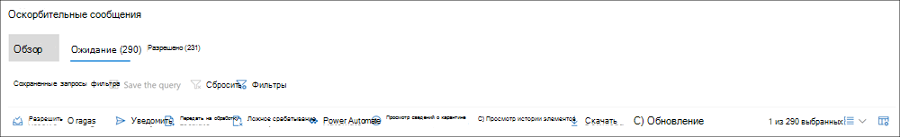

# Анализ и устранений оповещений соответствия требованиям к обмену данными

После настройки политик соответствия требованиям к общению вы начнете получать оповещения в центре соответствия требованиям Microsoft 365 о проблемах с сообщениями, которые соответствуют условиям политики. Следуйте инструкциям по работе с рабочим процессом для изучения и исправления проблем с оповещениями.

## Анализ оповещений

Первый шаг к исследованию проблем, обнаруженных политиками, состоит в рассмотрении оповещений о соответствии требованиям в центре соответствия требованиям Microsoft 365. В области решения для обеспечения соответствия требованиям существует несколько областей, которые помогут быстро изучить оповещения в зависимости от того, как вы предпочитаете просматривать группу оповещений:

- **Страница "политика соответствия требованиям к общению**": при входе в учетную [https://compliance.microsoft.com](https://compliance.microsoft.com) запись администратора в организации Microsoft 365 выберите элемент " **соответствие требованиям** ", чтобы отобразить страницу " **Политика** соответствия требованиям к общению". На этой странице отображаются политики соответствия требованиям для связи, настроенные для организации Microsoft 365, и ссылки на рекомендуемые шаблоны политики. Каждая указанная политика включает в себя количество оповещений, которые необходимо просмотреть, число расширенных и разрешенных элементов, а также текущее состояние политики. При выборе политики отображаются все ожидающие оповещения для соответствующих политик, выберите конкретное оповещение для запуска страницы сведений о политике и для запуска действий по исправлению.
- **Alerts**: выберите **Communication compliance**пункт  >  **оповещения о** соответствии в связи для отображения последних 30 дней оповещений, сгруппированных по совпадениям политик. Это представление позволяет быстро просмотреть, какие политики соответствия требованиям на связь создают большинство оповещений, упорядоченных по степени серьезности. Чтобы запустить действия по исправлению, выберите политику, связанную с оповещением, чтобы открыть страницу **сведений о политике** . На странице **сведения о политике** можно просмотреть сводку по действиям на странице **Обзор** , просмотреть и выполнить оповещения на странице " **ожидается** ", а также просмотреть историю закрытых оповещений на странице " **разрешено** ".
- **Reports**: переход **Communication compliance**к  >  **отчетам** о соответствии для взаимодействия для отображения мини – отчетов о соответствии требованиям. В каждом мини-приложении представлены общие сведения о действиях и состояниях обеспечения соответствия требованиям, в том числе доступ к более глубокой информации о сопоставлениях политик и действиях по исправлению.

### Использование фильтров

Следующий шаг — сортировка сообщений для упрощения изучения оповещений. На странице " **сведения о политике** " соответствие соответствия требованиям поддерживает Многоуровневая фильтрация для нескольких полей сообщений, позволяющих быстро изучить и просмотреть сообщения с соответствием политик. Фильтрация доступна для ожидающих и разрешенных элементов для каждой настроенной политики. Можно настроить запросы фильтрации для политики, а также настроить и сохранить пользовательские запросы фильтра и фильтры по умолчанию для использования в каждой конкретной политике. После настройки полей для фильтра вы увидите поля фильтра, отображаемые в верхней части очереди предупредительных сообщений, которую можно настроить для определенных значений фильтра.

Полный список фильтров и сведения о полях можно найти в статье [Справочник по](communication-compliance-feature-reference.md#filters) функциям.

#### Настройка фильтра

1. Войдите в систему [https://compliance.microsoft.com](https://compliance.microsoft.com) , используя учетные данные для учетной записи администратора в организации Microsoft 365.

2. В центре соответствия требованиям Microsoft 365 перейдите к разделу **соответствие требованиям к общению**.

3. Перейдите на вкладку **политики** и выберите политику для исследования, дважды щелкните, чтобы открыть страницу **Политика** .

4. На странице **Политика** выберите вкладку **ожидающие** или **Разрешенные** , чтобы отобразить элементы для фильтрации.

5. Выберите элемент управления " **фильтры** ", чтобы открыть страницу "сведения о **фильтрах** ".

6. Выберите один или несколько флажков, чтобы включить фильтры для этих оповещений. Можно выбрать один из многочисленных фильтров, в том числе *дату*, *отправитель*, *Тема/должность*, *классификаторы*и многое другое.

7. Если вы хотите сохранить фильтр, выбранный в качестве фильтра по умолчанию, выберите пункт **Сохранить как используемый по умолчанию**. Если вы хотите использовать этот фильтр в качестве сохраненного фильтра, нажмите кнопку **Готово**.

8. Если вы хотите сохранить выбранные фильтры как запрос фильтра, выберите сохранить элемент управления **запросом** после настройки по крайней мере одного значения фильтра. Введите имя запроса фильтра и нажмите кнопку **сохранить**. Этот фильтр можно использовать только для этой политики и отображается в разделе **сохраненные запросы фильтра** на странице "сведения о **фильтрах** ".

    

### Использование почти и точного анализа повторяющихся данных

Политики соответствия требованиям автоматически проверяют и передают повторяющиеся копии сообщений, не требуя дополнительных действий по настройке. Это представление позволяет быстро работать с аналогичными сообщениями одним или несколькими группами, уменьшая нагрузку на сообщения для рецензентов. По мере обнаружения дубликатов в панели инструментов действие по исправлению отображаются **почти повторяющиеся** элементы и/или точные элементы управления **дубликатами** . Это представление недоступно, если не найдены близкие или точные дубликаты.

#### Исправление дубликатов

1. Войдите в систему [https://compliance.microsoft.com](https://compliance.microsoft.com) , используя учетные данные для учетной записи администратора в организации Microsoft 365.

2. В центре соответствия требованиям Microsoft 365 перейдите к разделу **соответствие требованиям к общению**.

3. Перейдите на вкладку **политики** и выберите политику для исследования, дважды щелкните, чтобы открыть страницу **Политика** .

4. На странице **Политика** выберите вкладку **ожидающие** или **Разрешенные** , чтобы отобразить повторяющиеся сообщения.

5. Чтобы открыть страницу "сведения о дубликатах", выберите **соседние элементы управления повторениями** или **точные дубликаты** .

6. Выберите одно или несколько сообщений для управления действиями по исправлению этих сообщений.

7. Выберите **Разрешить**, **уведомить**, **эскалировать**или **скачать** , чтобы применить действие к выбранным копиям сообщений в качестве фильтра по умолчанию.

8. Нажмите кнопку **Закрыть** после завершения действий по исправлению сообщений.

    

## Исправление оповещений

Если вы не хотите просматривать оповещения или параметры фильтрации, то следующим шагом будет выполнение действий по исправлению оповещения. Начните устранение неполадок оповещений с помощью следующего рабочего процесса на страницах **политики** или **оповещений** :

1. **Изучите основные сведения о сообщениях**: иногда это очевидно от источника или темы, что сообщение может быть немедленно исправлено. Может быть, что сообщение является ложным или неправильно сопоставлено с политикой и должно быть распознано как ложное срабатывание. Выберите элемент управления **ложного срабатывания** , чтобы немедленно разрешить оповещение и удалить его из очереди ожидающих оповещений. Из сведений об источнике или отправителю вы, возможно, уже знаете, как сообщение должно быть перенаправлено или обработано в таких обстоятельствах. Рассмотрите возможность использования **тега в качестве** или **эскалации** элементов управления для назначения тега применимым сообщениям или отправки сообщений назначенному рецензенту.

    

2. **Изучите сведения о сообщении**: проверив основные сведения о сообщениях, откройте сообщение, чтобы просмотреть сведения и определить дальнейшие действия по исправлению. Выберите сообщение, чтобы просмотреть полный заголовок и сведения о тексте сообщения. Существует несколько различных представлений, которые помогут вам правильно определить действие:

    - **Представление исходного кода**: данное представление является стандартным представлением сообщений, которое обычно отображается на большинстве платформ обмена сообщениями на основе Интернета. Сведения о заголовке форматируются в стиле Normal, а текст сообщения поддерживает внедренные графические файлы и текст с переносом по словам.
    - **Представление текста**: в текстовом представлении отображается текстовое представление сообщения с числовым номером и включает выделение ключевых слов для терминов, соответствующих политике обеспечения соответствия требованиям на связь. Выделение ключевых слов помогает быстро сканировать длинные сообщения для интересующей области. Внедренные файлы не отображаются, а нумерация строк это представление полезно для ссылки на нужные сведения среди нескольких рецензентов.
    - **Представление "Примечания**": это представление позволяет проверяющим добавлять заметки непосредственно к сообщению, сохраненному в представлении сообщения.
    - **Журнал пользователей**: в представлении "журнал пользователя" отображаются все остальные оповещения, созданные любой политикой соответствия требованиям для обмена данными для пользователя, отправляющего сообщение.
    - **Подробное представление сообщения**: Расширенный просмотр метаданных сообщения и сведений о конфигурации.
    - **Pattern — обнаружено уведомление (Предварительная версия)**: множество притеснения и Буллинг действий с течением времени и включают в себя выполнение экземпляров аналогичного поведения пользователем. *Шаблон, обнаруженный* в сообщении, отображается в подробных сведениях оповещения и вызывает внимание на оповещение. Определение шаблонов выполняется отдельно для каждой политики и оценивает поведение за последние 30 дней, когда по крайней мере два сообщения отправляются одному получателю отправителю. С помощью этого уведомления вы можете выявить и отправить уведомления, чтобы определить, какое поведение необходимо для оценки.

    

3. **Примите решение об исправлении**: Теперь, когда вы проверили сведения о сообщении для оповещения, вы можете выбрать несколько действий по исправлению:

    - **Решение**: при выборе элемента управления **разрешите** немедленно удаляется сообщение из очереди **ожидающих оповещений** , и дальнейшие действия с сообщением не могут быть выполнены. При выборе параметра **Разрешить**вы закрыли оповещение без дополнительной классификации и не сможете повторно открыть их для дальнейших действий. Все разрешенные сообщения отображаются на вкладке **Разрешенные** .
    - **Ложное срабатывание**: сообщение всегда можно разрешить как ложное срабатывание в любой момент в рабочем процессе проверки сообщения. Ложное срабатывание означает, что предупреждение не является действием или оповещение ошибочно создано в ходе процесса оповещения. Сообщение не может быть открыто повторно и все ложные положительные сообщения отображаются на вкладке **разрешено** .
    - **Пометить как**: пометить сообщение как *удовлетворяющее требованиям*, *не соответствующим требованиям или как несоответствие*требованиям, связанным *с политиками* и стандартами Организации. Добавление тегов и комментариев с помощью тегов помогает отфильтровать оповещения политики в микрофильтрах для укрупнений или в рамках других процессов внутреннего рассмотрения. После завершения маркировки также можно сопоставить сообщение, чтобы переместить его из ожидающей очереди рецензирования.
    - **Уведомлять**: вы можете использовать элемент управления **уведомлением** , чтобы назначить оповещение настраиваемому шаблону уведомления и отправить пользователю уведомление о предупреждении. Выберите соответствующий шаблон уведомлений, настроенный в области **Параметры соответствия для общения** , и нажмите кнопку **Отправить** , чтобы отправить напоминание пользователю, который отправил сообщение и устранить эту проблему.
    - **Эскалация**: с помощью элемента управления **эскалации** вы можете выбрать, кто еще в вашей организации должен проанализировать это сообщение. Выберите из списка проверяющих, настроенных в политике соответствия требованиям на связь, для отправки уведомлений по электронной почте, запрашивающих дополнительную проверку оповещения о сообщении. Выбранный проверяющий может использовать ссылку в уведомлении по электронной почте, чтобы перейти непосредственно к элементам, которые были переданы для просмотра.
    - **Эскалация для изучения**: с помощью функции **укрупнения для расследования** вы можете создать новое [Расширенное дело обнаружения электронных](overview-ediscovery-20.md) данных для одного или нескольких сообщений. Вы будете предоставлять имя и примечания для нового случая, а пользователь, который отправил сообщение, соответствующее политике, автоматически назначается в качестве случая хранитель. Для управления обращением не требуются дополнительные разрешения. Создание обращения не приводит к разрешению или созданию нового тега для сообщения. Вы можете выбрать общее количество сообщений 100 при создании расширенного случая обнаружения электронных данных в ходе процесса исправления. Поддерживаются сообщения во всех коммуникационных каналах, отслеживаемых с помощью обеспечения соответствия связи. Например, вы можете выбрать пункты 50 Microsoft Teams, 25 сообщений электронной почты в Exchange Online и 25 сообщений Yammer при открытии нового расширенного дела eDiscovery для пользователя.
    - **Удалить сообщение в Teams (Предварительная версия)**: с помощью команды " **Удалить сообщение" в разделе управления Teams** можно заблокировать ненужные сообщения и содержимое, определенные в оповещениях каналов Microsoft Teams, а также в 1:1 и беседах групп. Удаленные сообщения и содержимое заменяются подсказкой политики, в которой объясняется, что она заблокирована, и политика, которая применяется к ее удалению из представления. Получателям предоставляется ссылка в подсказке политики, чтобы узнать больше о применяемой политике и процессе проверки. Отправитель получает подсказку политики для заблокированных сообщений и содержимого, но может просмотреть сведения о заблокированном сообщении и содержимом для контекста, относящегося к удалению.

    

4. **Определите, следует ли архивировать сведения о сообщениях вне системы соответствия требованиям**: сведения о сообщении можно экспортировать или загружать, если необходимо архивировать сообщения в отдельном решении хранения. При выборе элемента управления **скачиванием** выбранные сообщения автоматически добавляются в файл. ZIP-файл, который можно сохранить в хранилище вне Microsoft 365.
