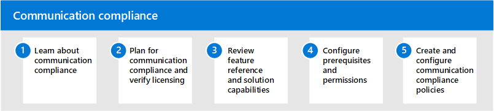

# Соответствие требованиям к коммуникациям в Microsoft 365Communication compliance in Microsoft 365

Защита конфиденциальной информации, обнаружение инцидентов нарушения безопасности на рабочем месте и их выполнение являются важной частью соблюдения внутренних политик и стандартов.Protecting sensitive information and detecting and acting on workplace harassment incidents is an important part of compliance with internal policies and standards. Соответствие коммуникациям в Microsoft 365 помогает свести к минимуму эти риски, помогая быстро обнаруживать, захватывать и принимать меры по исправлению сообщений электронной почты и Microsoft Teams.Communication compliance in Microsoft 365 helps minimize these risks by helping you quickly detect, capture, and take remediation actions for email and Microsoft Teams communications. К ним относятся недопустимые коммуникации, содержащие неносящееся, угрозы, а также запрещение и общение, которые совместно содержат конфиденциальную информацию внутри и за пределами организации.These include inappropriate communications containing profanity, threats, and harassment and communications that share sensitive information inside and outside of your organization.

## Настройка соответствия требованиям к коммуникациям для Microsoft 365Configure communication compliance for Microsoft 365

Чтобы настроить соответствие коммуникаций для организации, с помощью следующих действий:Use the following steps to configure communication compliance for your organization:

1. Узнайте о [соответствии коммуникаций](communication-compliance.md) требованиям в Microsoft 365Learn about [communication compliance](communication-compliance.md) in Microsoft 365
2. Планирование соответствия [требованиям к коммуникациям](communication-compliance-plan.md) [и проверка лицензирования](communication-compliance-configure.md#subscriptions-and-licensing)Plan for [communication compliance](communication-compliance-plan.md) and [verify licensing](communication-compliance-configure.md#subscriptions-and-licensing)
3. Обзор [справочных функций и возможностей решения](communication-compliance-feature-reference.md)Review [feature reference and solution capabilities](communication-compliance-feature-reference.md)
4. Настройка [необходимых условий](communication-compliance-configure.md#step-2-required-enable-the-audit-log) и [разрешений](communication-compliance-configure.md#step-1-required-enable-permissions-for-communication-compliance)Configure [prerequisites](communication-compliance-configure.md#step-2-required-enable-the-audit-log) and [permissions](communication-compliance-configure.md#step-1-required-enable-permissions-for-communication-compliance)
5. Создание и настройка политик [соответствия требованиям к коммуникациям](communication-compliance-configure.md#step-5-required-create-a-communication-compliance-policy)Create and configure [communication compliance policies](communication-compliance-configure.md#step-5-required-create-a-communication-compliance-policy)

## Дополнительные сведения о соответствии коммуникаций требованиямMore information about communication compliance

- [Изучение и исправление оповещенийInvestigate and remediate alerts](communication-compliance-investigate-remediate.md)
- [Пример: Contoso быстро настраивает политику оскорбительных языков для microsoft Teams, Exchange и yammerCase study - Contoso quickly configures an offensive language policy for Microsoft Teams, Exchange, and Yammer communications](communication-compliance-case-study.md)