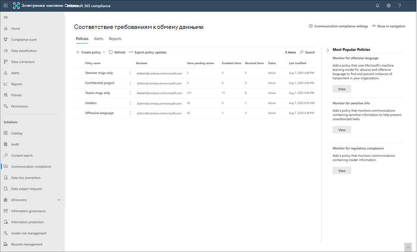
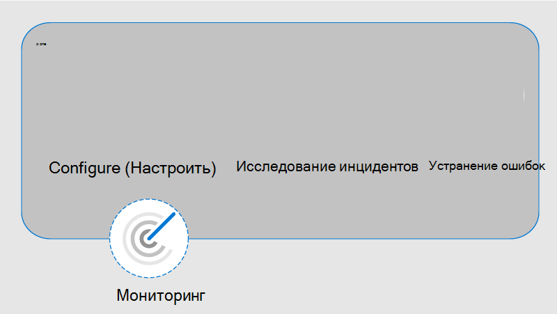

# Соответствие требованиям в Microsoft 365

Соответствие требованиям — это решение о риске для оценки в Microsoft 365, помогающее минимизировать риски в общении, помогая обнаруживать, записывать и обрабатывать неуместные сообщения в Организации. Предопределенные и настраиваемые политики позволяют сканировать внутренние и внешние коммуникации для соответствия политике, чтобы их можно было проверить при помощи определенных рецензентов. Рецензенты могут исследовать отсканированную электронную почту, Microsoft Teams, Yammer или сторонние коммуникации в Организации и выполнять соответствующие действия, чтобы убедиться, что они соответствуют стандартам сообщений Организации.

Политики соответствия требованиям в Microsoft 365 помогают преодолеть многие современные проблемы, связанные с соответствием требованиям и внутренними и внешними связями, в том числе:

- Сканирование увеличенных типов каналов связи
- Увеличивающийся объем данных сообщения
- Обеспечение соответствия нормативным требованиям и риск для штрафов

Кроме того, может быть разделение обязанностей между ИТ ИТ и группой управления соответствием требованиям. Соответствие требованиям обеспечивает разделение между конфигурацией политик и исследованием и просмотром сообщений. Например, Группа ИТ для вашей организации может отвечать за настройку разрешений, групп и политик обеспечения соответствия требованиям для обеспечения соответствия требованиям, а также групп, а также для оценки и проверки сообщений, которые могут быть ответственны за действия по рассмотрению и устранению проблем.

Чтобы получить краткий обзор обеспечения соответствия требованиям, ознакомьтесь [с Разявлением притеснения в рабочем месте и ответ на обеспечение соответствия требованиям в microsoft 365](https://youtu.be/z33ji7a7Zho) Video в [канале Microsoft механика](https://www.youtube.com/user/OfficeGarageSeries).

## Сценарии обеспечения соответствия связи

Политики соответствия требованиям могут помочь при просмотре сообщений в Организации в нескольких важных областях обеспечения соответствия требованиям.

- **Корпоративные политики**

    Пользователи должны соблюдать приемлемые варианты использования, стандарты этического характера и другие корпоративные политики во всех связанных с бизнес-сообщениях. Политики соответствия требованиям могут обнаруживать соответствие политике и помогают принять меры по исправлению этих типов инцидентов. Например, вы можете просканировать взаимодействие с пользователями в Организации для потенциальных проблем с персоналом, таких как преследование или использование неуместного или оскорбительного языка.

- **Управление рисками**

    Организации несут ответственность за все коммуникации, распределенные по инфраструктуре и корпоративным сетевым системам. Использование политик соответствия требованиям для определения и управления потенциальной юридической уязвимости и рисками поможет снизить риски, прежде чем они могут повредить корпоративные операции. Например, вы можете сканировать сообщения в Организации для несанкционированных коммуникаций о конфиденциальных проектах, таких как предстоящие приобретения, слияния, Неразглашенные выпуски, реорганизация и изменение группы руководства.

- **Соответствие нормативным требованиям**

    Большинство организаций должны соблюдать некоторые стандарты соответствия нормативным требованиям в рамках обычных рабочих процедур. В этих нормативах часто требуется, чтобы организациям было проще реализовать некоторый тип супервизора или переработки для обмена сообщениями, которые подходят для своей отрасли. 3110 правило ФИНРА в финансовой отрасли () — это хороший пример требования к организациям для выполнения процедур супервизора для проверки взаимодействия пользователей и типов предприятий, в которых она работает. Другой пример может понадобиться проанализировать связи брокера с брокером в Организации, чтобы защититься от возможных денег на деньги, торговых лаундеринг, коллусион или выа. Политики соответствия требованиям могут помочь Организации удовлетворить эти требования, предоставляя процесс сканирования и отправки отчетов об корпоративной связи. Для получения дополнительных сведений о поддержке финансовых организаций ознакомьтесь с [основными требованиями к безопасности и соображениям безопасности для банковских и капитальных рынков США](../solutions/financial-services-secure-collaboration.md).

## Новые возможности

Для обеспечения соответствия требованиям в Microsoft 365 существует несколько важных функций, которые помогают решать вопросы соответствия платформам обмена сообщениями:

- Интеллектуальные настраиваемые шаблоны
- Гибкие рабочие процессы по исправлению
- Подробные сведения о действиях

### Интеллектуальные настраиваемые шаблоны

Интеллектуальные настраиваемые шаблоны в соответствии с обеспечением соответствия связи позволяют применять машинное обучение для интеллектуального обнаружения нарушений связи в Организации.

- **Настраиваемые предварительно настроенные шаблоны**: новые шаблоны политик помогают устранить наиболее распространенные риски для общения. Создание начальной политики и дальнейшие действия по обновлению теперь выполняются быстрее с заранее определенными нежелательными и оскорбительными сведениями о языке, конфиденциальной информации и шаблонах соответствия нормативным требованиям.
- **Новая поддержка машинного обучения**: встроенная угроза, преследования, ненормативность и [классификаторы](classifier-get-started-with.md) изображений помогают сократить ложные срабатывания в отсканированных сообщениях, сохранив время рецензентов во время расследования и исправления.
- **Улучшенный Построитель условий**: Настройка условий политики теперь упрощена в едином интегрированном интерфейсе мастера политики, что снижает путаницу при применении условий к политикам.

### Гибкие рабочие процессы по исправлению

Встроенные рабочие процессы устранения неполадок позволяют быстро определять и предпринимать действия с сообщениями, которые соответствуют политикам в Организации. Следующие новые функции повышают эффективность расследования и исправления действий:

- **Гибкий рабочий процесс исправления**: новый рабочий процесс исправления помогает быстро выполнить действия, соответствующие политикам, в том числе новые параметры для укрупнения сообщений для других проверяющих и отправки уведомлений пользователям с соответствием политик.
- **Цепочки обсуждений**: сообщения теперь визуально группируются по исходному сообщению и всем связанным ответным сообщениям, что позволяет улучшить контекст во время расследования и исправления.
- **Выделение ключевых слов**: условия политики проверки условий на совпадение выделены в представлении текста сообщения, чтобы помочь проверяющим быстро находить и исправлять оповещения политики.
- **Точное и почти совпадающее обнаружение повторяющихся**данных: Помимо сканирования для политик соответствия требованиям строгого поиска терминов, рядом с поиском повторяющихся групп схожие термины и сообщения помогают ускорить процесс проверки.
- **Новые фильтры**: исследование и устранение оповещений политики ускоряется с помощью фильтров сообщений для нескольких полей, включая отправителя, получателя, дату, домены и многое другое.
- **Улучшенные представления сообщений**: действия по исследованию и исправлению теперь выполняются быстрее с помощью новых представлений источника сообщений, текста и примечаний. Вложения сообщений теперь доступны для просмотра при выполнении действий по исправлению.
- **Представление журнала пользователя**: исторический Просмотр всех действий по исправлению пользовательских сообщений, таких как предыдущие уведомления и эскалация для соответствия политике, теперь предоставляет проверяющим дополнительный контекст в ходе рабочего процесса исправления. Время первого или повторения совпадений политик для пользователей теперь архивируется и легко можно просмотреть.
- **Pattern — обнаружено уведомление (Предварительная версия)**: многие притеснения и Буллинг действия выполняются с течением времени и включают в себя повторение экземпляров аналогичного поведения пользователем. При обнаружении нового шаблона уведомление, отображаемое в подробных сведениях оповещений, поможет привлечь внимание к этим оповещениям и такому типу поведения.

### Подробные сведения о действиях

Новые интерактивные панели мониторинга для оповещений, политик соответствия политик, действий и тенденций помогают быстро просмотреть состояние ожидающих и разрешенных оповещений в Организации.

- **Упреждающие интеллектуальные оповещения**: оповещения о политиках, требующих немедленного внимания, включают новые панели мониторинга для ожидающих элементов, отсортированные по степени серьезности, и новые автоматические уведомления электронной почты, отправляемые определенным проверяющим.
- **Интерактивные панели мониторинга**: новые панели мониторинга отображают соответствия политик, ожидающие и разрешенные действия, а тенденции по пользователям и политикам.
- **Поддержка аудита**: полный журнал действий политики и проверки легко экспортировать из центра соответствия требованиям Microsoft 365, чтобы обеспечить поддержку запросов на проверку аудита.

## Интеграция со службами Microsoft 365

Политики обеспечения соответствия требованиям проверяют и фиксируют сообщения в нескольких коммуникационных каналах, что позволяет быстро просматривать и устранять проблемы, связанные с соответствием.

- **Microsoft Teams**: беседы в чате для общедоступных и частных каналов [Microsoft Teams](https://docs.microsoft.com/MicrosoftTeams/Teams-overview) и отдельных сеансов связи поддерживаются в связи с несамостоятельным источником канала или с другими службами Microsoft 365. Необходимо вручную добавить отдельных пользователей, группы рассылки или конкретные каналы Microsoft Teams, если выбран пункт Пользователи и группы, для которых требуется политика соответствия требованиям.
- **Exchange Online**: все почтовые ящики, размещенные в [Exchange Online](https://docs.microsoft.com/Exchange/exchange-online) в организации Microsoft 365, могут сканироваться. Сообщения электронной почты и вложения, удовлетворяющие условиям политики соответствия требованиям, немедленно доступны для мониторинга и в отчетах о соответствии требованиям. Exchange Online теперь является необязательным исходным каналом и больше не нужен в политиках обеспечения соответствия для связи.
- **Yammer**: конфиденциальные сообщения и общедоступные беседы сообщества в [Yammer](https://docs.microsoft.com/yammer/yammer-landing-page) поддерживаются в политиках обеспечения соответствия для связи. Yammer — это необязательный канал, который должен находиться в [собственном режиме](https://docs.microsoft.com/yammer/configure-your-yammer-network/overview-native-mode) для поддержки сканирования сообщений и вложений.
- **Skype для бизнеса Online**: политики соответствия требованиям к связи поддерживают сканирование общения и связанных вложений в [Skype для бизнеса Online](https://docs.microsoft.com/SkypeForBusiness/skype-for-business-online).
- **Сторонние источники**: вы можете сканировать сообщения из [сторонних источников](archiving-third-party-data.md) для данных, импортированных в почтовые ящики в организации Microsoft 365. Соответствие требованиям связи поддерживает подключения к нескольким популярным платформам, в том числе Bloomberg и другим.

Дополнительные сведения о поддержке каналов обмена сообщениями в политиках обеспечения соответствия требованиям приведены в разделе [Поддерживаемые типы связи](communication-compliance-feature-reference.md#supported-communication-types).

## Рабочий процесс

Соответствие требованиям помогает устранить распространенные точки, связанные с соответствием внутренними политиками и требованиями соответствия нормативным требованиям. С помощью политик отсортированных и гибких рабочих процессов можно быстро устранять обнаруженные проблемы соответствия требованиям.

При определении и устранении проблем с соответствием требованиям для обеспечения соответствия требованиям в Microsoft 365 используется следующий рабочий процесс:

### Настройка

На этом шаге рабочего процесса вы идентифицируете требования соответствия требованиям и настраиваете применяемые политики соответствия требованиям к связи. Шаблоны политик — это отличный способ не только быстрой настройки новой политики соответствия требованиям, но и для быстрого изменения и обновления политик при изменении требований. Например, вам может потребоваться быстро протестировать политику для нежелательного языка и защиты от нежелательной информации для небольшой группы пользователей перед настройкой политики для всех пользователей в Организации.

>[!Important]
>По умолчанию глобальные администраторы не имеют доступа к функциям обеспечения соответствия требованиям. Чтобы включить разрешения для функций обеспечения соответствия требованиям, ознакомьтесь со [статьей обеспечение соответствия требованиям в Организации](communication-compliance-configure.md#step-1-required-enable-permissions-for-communication-compliance).

Вы можете выбрать один из следующих шаблонов политики в центре соответствия требованиям Microsoft 365:

- **Нежелательный или угрожающие материалы язык**: Используйте этот шаблон для быстрого создания политики, использующей встроенные классификаторы для автоматического обнаружения контента, который может считаться оскорбительным или оскорбительным.
- **Конфиденциальные сведения**: Используйте этот шаблон для создания политики для сканирования связи с определенными типами конфиденциальной информации или ключевыми словами, чтобы убедиться, что важные данные не являются общими для пользователей, которым не требуется доступ.
- **Соответствие нормативным требованиям**: Используйте этот шаблон для создания политики для сканирования связи со ссылками на стандартные финансовые термины, связанные с нормативными стандартами.
- **Настраиваемая политика**: Используйте этот шаблон, чтобы настроить конкретные каналы связи, условия обнаружения и объем контента для мониторинга и проверки в Организации.

### Исследование

На этом этапе выполняется более подробное рассмотрение проблем, обнаруженных в соответствии с вашими политиками соответствия требованиям. Этот шаг включает в себя следующие действия, доступные в центре соответствия требованиям Microsoft 365:

- **Alerts**: Если сообщение соответствует условию политики, автоматически создается оповещение. Для каждого оповещения можно просмотреть состояние, степень серьезности, время обнаружения и, если назначено расширенное дело обнаружения электронных данных и его состояние. Новые оповещения отображаются на домашней странице "соответствие требованиям для связи" и " **оповещения** " и перечислены в порядке серьезности.
- **Управление проблемами**: для каждого оповещения можно выполнить исследование действий, которые помогут устранить проблему, обнаруженную в сообщении.
- **Рецензирование документов**: в ходе исследования проблемы можно использовать несколько представлений сообщения, чтобы помочь правильно оценить обнаруженную ошибку. К представлениям относятся сводка беседы, текстовые, аннотированные и подробные представления беседы о связи.
- **Обзор журнала активности пользователей**: Просмотр истории действий и действий по исправлению пользователей, таких как предыдущие уведомления и эскалация, для соответствия политике.
- **Фильтры**: используйте такие фильтры, как отправитель, получатель, Дата и тема, чтобы быстро сузить оповещения о сообщениях, которые нужно просмотреть.

### Устранение ошибок

Следующий шаг — устранение проблем с соответствием условиям связи, которые вы узнали с помощью следующих параметров:

- **Решение**: после рассмотрения проблемы можно исправить это предупреждение. При разрешении оповещения оно удаляется из очереди ожидающих оповещений, а действие сохраняется в виде записи в разрешенной очереди для соответствующей политики. Оповещения автоматически разрешаются после пометки оповещения как ложного срабатывания, отправки уведомления пользователю о предупреждении или открытия нового обращения для этого оповещения.
- **Пометить сообщение**: в рамках решения проблемы вы можете отметить обнаруженное сообщение как удовлетворяющее требованиям, не соответствующим требованиям, а также определить вопросы, связанные с политиками и стандартами Организации. Теги могут помочь вам в фильтрации оповещений политики для укрупнения или в рамках других процессов внутреннего рассмотрения.
- **Уведомлять пользователя**: часто пользователи случайно или случайно нарушают политику соответствия требованиям. С помощью функции уведомления вы можете предоставить пользователю уведомление о предупреждении и решить эту проблему.
- **Эскалация другому**рецензенту: иногда у первого рецензента проблемы требуется ввод данных от других рецензентов, чтобы помочь в решении инцидента. Вы можете легко эскалировать проблемы с сообщениями проверяющих в других областях Организации в рамках процесса разрешения конфликтов.
- **Пометить как ложное срабатывание**: сообщения, неправильно обнаруживаемые в соответствии с политиками соответствия требованиям, периодически заменяются на процесс проверки. Вы можете пометить эти типы оповещений как ложные срабатывания и автоматически решить проблему.
- **Удаление сообщения в Teams (Предварительная версия)**: недопустимые сообщения могут быть удалены из каналов Microsoft Teams, а также сообщений о личных и групповых сеансах беседы. Неуместные сообщения заменяются на уведомление о том, что сообщение было удалено для нарушения политики.
- **Эскалация для изучения**: в большинстве серьезных ситуаций может потребоваться совместное использование сведений о соответствии с другими проверяющими в Организации. Обеспечение соответствия требованиям к связи тесно интегрировано с другими функциями обеспечения соответствия требованиям Microsoft 365, чтобы обеспечить полное разрешение риска. Эскалация обращения для расследования позволяет перенести данные и управлять обращением в расширенные функции обнаружения электронных данных в Microsoft 365. Расширенное обнаружение электронных данных предоставляет сквозной рабочий процесс для сохранения, сбора, проверки, анализа и экспорта содержимого, которое отвечает за внутреннее и внешнее расследования вашей организации. Она позволяет юридическим группам управлять всем рабочим процессом уведомления об удержаниях. Дополнительные сведения о дополнительных возможностях обнаружения электронных данных приведены [в статье обзор расширенного обнаружения электронных данных в Microsoft 365](overview-ediscovery-20.md).

### Отслеживать

Отслеживание и управление проблемами соответствия требованиям, определенным политиками соответствия требованиям, охватывает весь рабочий процесс. По мере создания оповещений и выполнения действий по их исследованию и исправлению существующие политики могут требовать проверки и обновления, а также может потребоваться создать новые политики.

- **Мониторинг и составление отчетов**: использование мини – компонентов панели мониторинга соответствия требованиям к связи, экспорт журналов и событий, записанных в едином журнале аудита, для непрерывного оценки и оптимизации для обеспечения соответствия требованиям.

## Готовы приступить к работе?

- Сведения о планировании приведены в статье [Plan for Communication для обеспечения соответствия требованиям](communication-compliance-plan.md).
- Ознакомьтесь с [практическими примерами для Contoso](communication-compliance-case-study.md) и Узнайте, как быстро настроили политику соответствия требованиям к связи для отслеживания нежелательных языков в Microsoft Teams, Exchange Online и коммуникаций в Yammer.
- Чтобы настроить соответствие требованиям для организации Microsoft 365, ознакомьтесь со статьей [Настройка соответствия требованиям для microsoft 365](communication-compliance-configure.md).
