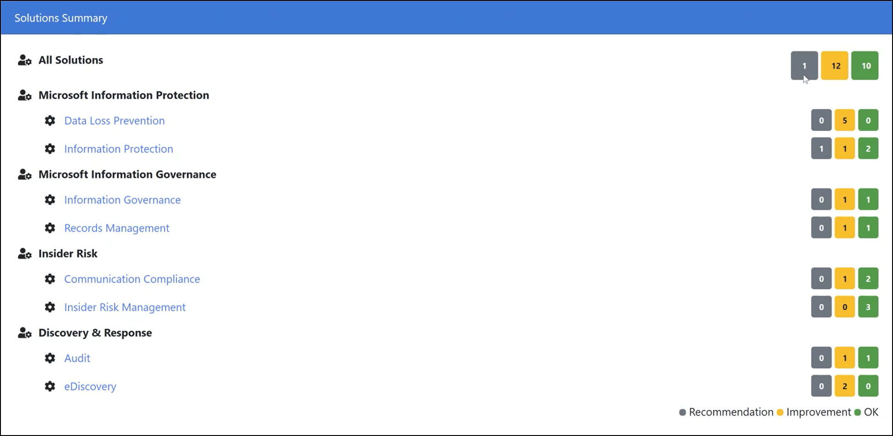

# <a name="microsoft-compliance-configuration-analyzer-for-compliance-manager-preview"></a><span data-ttu-id="023b8-103">Анализатор конфигурации соответствия требованиям Майкрософт для диспетчера соответствия требованиям (предварительный просмотр)</span><span class="sxs-lookup"><span data-stu-id="023b8-103">Microsoft Compliance Configuration Analyzer for Compliance Manager (preview)</span></span>

<span data-ttu-id="023b8-104">**В этой статье:** Узнайте, как установить и запустить средство Microsoft Compliance Configure Analyzer, чтобы быстро начать работу с microsoft Compliance Manger.</span><span class="sxs-lookup"><span data-stu-id="023b8-104">**In this article:** Learn how to install and run the Microsoft Compliance Configure Analyzer tool to get quickly started with Microsoft Compliance Manger.</span></span>

## <a name="microsoft-compliance-configuration-analyzer-mcca-preview-overview"></a><span data-ttu-id="023b8-105">Обзор анализатора конфигурации соответствия требованиям Майкрософт (MCCA) (предварительный просмотр)</span><span class="sxs-lookup"><span data-stu-id="023b8-105">Microsoft Compliance Configuration Analyzer (MCCA) (preview) overview</span></span>

<span data-ttu-id="023b8-106">Анализатор конфигурации соответствия требованиям Майкрософт (MCCA) — это средство предварительного просмотра, которое поможет вам начать работу с [Microsoft Compliance Manager.](compliance-manager.md)</span><span class="sxs-lookup"><span data-stu-id="023b8-106">The Microsoft Compliance Configuration Analyzer (MCCA) is a preview tool that can help you get started with [Microsoft Compliance Manager](compliance-manager.md).</span></span> <span data-ttu-id="023b8-107">MCCA — это утилита на основе PowerShell, которая будет получать текущие конфигурации организации и проверять их в отношении рекомендуемых методов Microsoft 365.</span><span class="sxs-lookup"><span data-stu-id="023b8-107">MCCA is a PowerShell-based utility that will fetch your organization’s current configurations and validate them against Microsoft 365 recommended best practices.</span></span> <span data-ttu-id="023b8-108">Эти методы основаны на наборе элементов управления, которые включают ключевые правила и стандарты для защиты данных и управления данными.</span><span class="sxs-lookup"><span data-stu-id="023b8-108">These best practices are based on a set of controls that include key regulations and standards for data protection and data governance.</span></span>

<span data-ttu-id="023b8-109">MCCA поможет вам быстро узнать, какие действия по улучшению в Яслях соответствия требованиям применяются к текущей среде Microsoft 365.</span><span class="sxs-lookup"><span data-stu-id="023b8-109">MCCA can help you quickly see which improvement actions in Compliance Manger apply to your current Microsoft 365 environment.</span></span> <span data-ttu-id="023b8-110">Каждое действие, которое определено MCCA, даст вам рекомендации по реализации с прямыми ссылками на диспетчер соответствия требованиям и применимым решением для начала принятия коррективных действий.</span><span class="sxs-lookup"><span data-stu-id="023b8-110">Each action identified by MCCA will give you recommendations for implementation, with direct links to Compliance Manager and the applicable solution to start taking corrective action.</span></span>

<span data-ttu-id="023b8-111">Дополнительным ресурсом для понимания MCCA является посещение инструкций [README на сайте GitHub.](https://github.com/OfficeDev/MCCA#overview)</span><span class="sxs-lookup"><span data-stu-id="023b8-111">An additional resource for understanding MCCA is by visiting the [README instructions on GitHub](https://github.com/OfficeDev/MCCA#overview).</span></span> <span data-ttu-id="023b8-112">На этой странице данная страница содержит подробные сведения о необходимых предпосылках и содержит полные инструкции по установке.</span><span class="sxs-lookup"><span data-stu-id="023b8-112">This page provides detailed information about prerequisites and gives full installation instructions.</span></span> <span data-ttu-id="023b8-113">Для доступа к этой странице не требуется учетная запись GitHub.</span><span class="sxs-lookup"><span data-stu-id="023b8-113">You don’t need a GitHub account to access this page.</span></span>

<span data-ttu-id="023b8-114">**Доступность.** MCCA доступна всем организациям с лицензиями Office 365 и Microsoft 365, а также клиентам с умеренными и высокими уровнями GCC и GCC, в планах по расширению службы для клиентов DOD.</span><span class="sxs-lookup"><span data-stu-id="023b8-114">**Availability**: MCCA is available to all organizations with Office 365 and Microsoft 365 licenses and US Government Community (GCC) Moderate and GCC High customers, with plans underway to expand service to DOD customers.</span></span>

## <a name="install-mcca-and-run-a-report"></a><span data-ttu-id="023b8-115">Установка MCCA и запуск отчета</span><span class="sxs-lookup"><span data-stu-id="023b8-115">Install MCCA and run a report</span></span>

<span data-ttu-id="023b8-116">Инструмент MCCA можно установить с помощью Windows PowerShell.</span><span class="sxs-lookup"><span data-stu-id="023b8-116">You can install the MCCA tool using Windows PowerShell.</span></span> <span data-ttu-id="023b8-117">После загрузки и установки средства не нужно повторять эти действия для запуска отчетов.</span><span class="sxs-lookup"><span data-stu-id="023b8-117">Once you download and install the tool, you don’t need to repeat those steps in order to run reports.</span></span> <span data-ttu-id="023b8-118">Каждый раз, когда вы открываете MCCA, он будет спрашивать у вас учетные данные входа, и он будет генерировать новый обновленный отчет.</span><span class="sxs-lookup"><span data-stu-id="023b8-118">Each time you open MCCA, it will ask you for your login credentials, and it will generate a new, updated report.</span></span>

#### <a name="step-1-install-windows-powershell"></a><span data-ttu-id="023b8-119">Шаг 1. Установка Windows PowerShell</span><span class="sxs-lookup"><span data-stu-id="023b8-119">Step 1: Install Windows PowerShell</span></span>
<span data-ttu-id="023b8-120">Для начала вам потребуется модуль PowerShell Exchange Online (v2.0.3 или более), доступный в галерее PowerShell.</span><span class="sxs-lookup"><span data-stu-id="023b8-120">To begin, you'll need the Exchange Online PowerShell module (v2.0.3 or higher) that's available in the PowerShell gallery.</span></span> <span data-ttu-id="023b8-121">[Получить инструкции по установке](https://www.powershellgallery.com/packages/ExchangeOnlineManagement/2.0.3).</span><span class="sxs-lookup"><span data-stu-id="023b8-121">[Get installation instructions](https://www.powershellgallery.com/packages/ExchangeOnlineManagement/2.0.3).</span></span>

#### <a name="step-2-install-mcca"></a><span data-ttu-id="023b8-122">Шаг 2. Установка MCCA</span><span class="sxs-lookup"><span data-stu-id="023b8-122">Step 2: Install MCCA</span></span>

<span data-ttu-id="023b8-123">Чтобы установить MCCA, начните с использования PowerShell в режиме администратора.</span><span class="sxs-lookup"><span data-stu-id="023b8-123">To install MCCA, start by using PowerShell in administrator mode.</span></span> <span data-ttu-id="023b8-124">Выполните следующие действия:</span><span class="sxs-lookup"><span data-stu-id="023b8-124">Follow the steps below:</span></span>

1. <span data-ttu-id="023b8-125">Выберите кнопку Windows **Start.**</span><span class="sxs-lookup"><span data-stu-id="023b8-125">Select the Windows **Start** button.</span></span>
2. <span data-ttu-id="023b8-126">Введите **PowerShell,** щелкните правой кнопкой мыши **по Windows PowerShell,** а затем выберите **Выполнить в качестве администратора**.</span><span class="sxs-lookup"><span data-stu-id="023b8-126">Type **PowerShell**, right-click on **Windows PowerShell**, then select **Run as administrator**.</span></span>
1. <span data-ttu-id="023b8-127">В командной строке введите следующие команды:</span><span class="sxs-lookup"><span data-stu-id="023b8-127">At the command prompt, type:</span></span>

    ```powershell
    Install-Module -Name MCCAPreview
    ```

#### <a name="step-3-run-a-report"></a><span data-ttu-id="023b8-128">Шаг 3. Запуск отчета</span><span class="sxs-lookup"><span data-stu-id="023b8-128">Step 3: Run a report</span></span>

<span data-ttu-id="023b8-129">После установки MCCA можно запустить MCCA и создать отчет.</span><span class="sxs-lookup"><span data-stu-id="023b8-129">After you install MCCA, you can run MCCA and generate a report.</span></span> <span data-ttu-id="023b8-130">Для запуска отчета:</span><span class="sxs-lookup"><span data-stu-id="023b8-130">To run a report:</span></span>

1. <span data-ttu-id="023b8-131">Open PowerShell</span><span class="sxs-lookup"><span data-stu-id="023b8-131">Open PowerShell</span></span>
2. <span data-ttu-id="023b8-132">Запустите cmdlet:</span><span class="sxs-lookup"><span data-stu-id="023b8-132">Run the cmdlet:</span></span>

    ```powershell
    Get-MCCAReport
    ```
   <span data-ttu-id="023b8-133">Если вы клиент GCC High, вам потребуется предоставить дополнительный параметр ввода для запуска отчета:</span><span class="sxs-lookup"><span data-stu-id="023b8-133">If you're a GCC High customer, you'll need to provide an additional input parameter to run the report:</span></span>

    ```powershell
    Get-MCCAReport -ExchangeEnvironmentName O365USGovGCCHigh
    ```

3. <span data-ttu-id="023b8-134">После того как MCCA запускается, он выполняет проверку начальной версии и запросит учетные данные.</span><span class="sxs-lookup"><span data-stu-id="023b8-134">Once MCCA runs, it does an initial version check and ask for credentials.</span></span> <span data-ttu-id="023b8-135">На вводе подсказки имени пользователя вопишитесь в адрес электронной почты учетной записи Microsoft 365 (просмотреть роли, подходящие[для создания отчетов).](#role-based-reporting)</span><span class="sxs-lookup"><span data-stu-id="023b8-135">At the Input the user name prompt, sign in with your Microsoft 365 account email address ([view the roles eligible to create reports](#role-based-reporting)).</span></span> <span data-ttu-id="023b8-136">Затем введите пароль по запросу пароля.</span><span class="sxs-lookup"><span data-stu-id="023b8-136">Then enter your password at the password prompt.</span></span>

<span data-ttu-id="023b8-137">Затем на создание отчета уйма времени займет около 2-5 минут.</span><span class="sxs-lookup"><span data-stu-id="023b8-137">Your report will then take approximately 2-5 minutes to generate.</span></span> <span data-ttu-id="023b8-138">Когда это будет сделано, откроется окно браузера и будет отображаться отчет ПО HTML.</span><span class="sxs-lookup"><span data-stu-id="023b8-138">When it’s done, a browser window opens and displays your HTML report.</span></span> <span data-ttu-id="023b8-139">Каждый раз, когда вы запустите средство, он будет спрашивать учетные данные и создавать новый отчет.</span><span class="sxs-lookup"><span data-stu-id="023b8-139">Every time you run the tool, it will ask for your credentials and generate a new report.</span></span> <span data-ttu-id="023b8-140">Этот отчет хранится локально в следующем каталоге:</span><span class="sxs-lookup"><span data-stu-id="023b8-140">This report is stored locally in the following directory:</span></span>

<span data-ttu-id="023b8-141">C:\Users \<username> \AppData\Local\Microsoft\MCCA.</span><span class="sxs-lookup"><span data-stu-id="023b8-141">C:\Users\<username>\AppData\Local\Microsoft\MCCA.</span></span> 

<span data-ttu-id="023b8-142">Вы можете получить доступ к ранее созданным отчетам из этого каталога.</span><span class="sxs-lookup"><span data-stu-id="023b8-142">You can access previously generated reports from this directory.</span></span>

## <a name="understanding-your-report"></a><span data-ttu-id="023b8-143">Понимание отчета</span><span class="sxs-lookup"><span data-stu-id="023b8-143">Understanding your report</span></span>

<span data-ttu-id="023b8-144">Отчет отражает данные, основанные на дате и времени его сгенерировании.</span><span class="sxs-lookup"><span data-stu-id="023b8-144">Your report reflects data based on the date and time at which it was generated.</span></span> <span data-ttu-id="023b8-145">В верхнем разделе приводится подробная информация о том, когда он был создан, имя организации и ID клиента.</span><span class="sxs-lookup"><span data-stu-id="023b8-145">The top section provides details on when it was generated, your organization name, and tenant ID.</span></span>

#### <a name="geolocation-based-reporting"></a><span data-ttu-id="023b8-146">Отчеты на основе геолокации</span><span class="sxs-lookup"><span data-stu-id="023b8-146">Geolocation-based reporting</span></span>

<span data-ttu-id="023b8-147">В **разделе Примечание** показано, что отчет настраивается в зависимости от географического расположения клиента.</span><span class="sxs-lookup"><span data-stu-id="023b8-147">The **Note** section shows that your report is customized based on the geographic location of your tenant.</span></span> <span data-ttu-id="023b8-148">Рекомендации, перечисленные в этом средстве, будут специфи перечислены в вашей стране или регионе.</span><span class="sxs-lookup"><span data-stu-id="023b8-148">Recommendations listed in the tool will be specific to your country or region.</span></span>

<span data-ttu-id="023b8-149">Выбор геолокации используется для оценки типов конфиденциальной информации (SITs), которые имеют отношение к этой геолокации, и создания отчета, соответствующего вашей стране или региону.</span><span class="sxs-lookup"><span data-stu-id="023b8-149">Your geolocation selection is used to assess sensitive information types (SITs) which are relevant to that geolocation and generate a report that aligns to your country or region.</span></span> <span data-ttu-id="023b8-150">Выберите геолокации на основе данных, которые имеются в клиенте.</span><span class="sxs-lookup"><span data-stu-id="023b8-150">Choose geolocations based on data you have in your tenant.</span></span>

<span data-ttu-id="023b8-151">Чтобы изменить сведения о расположении отчета, необходимо предоставить параметр ввода geolocation (-Geo).</span><span class="sxs-lookup"><span data-stu-id="023b8-151">To change your report's location information, you need provide a geolocation (-Geo) input parameter.</span></span> <span data-ttu-id="023b8-152">Вы можете выбрать одно или несколько геолокаций, применимых к вашему клиенту.</span><span class="sxs-lookup"><span data-stu-id="023b8-152">You can choose either one or multiple geolocations applicable for your tenant.</span></span>

<span data-ttu-id="023b8-153">Следуйте инструкциям по запуску отчета на основе определенного расположения:</span><span class="sxs-lookup"><span data-stu-id="023b8-153">Follow these instructions to run a report based on a specific location:</span></span>

1. <span data-ttu-id="023b8-154">Open PowerShell</span><span class="sxs-lookup"><span data-stu-id="023b8-154">Open PowerShell</span></span>
2. <span data-ttu-id="023b8-155">Чтобы указать определенный регион, вы запустите cmdlet с помощью номеров из таблицы ниже, соответствующих стране или региону.</span><span class="sxs-lookup"><span data-stu-id="023b8-155">To specify a certain region, you’ll run a cmdlet using the numbers from the table below that correspond to the country or region.</span></span> <span data-ttu-id="023b8-156">Введите несколько номеров, разделив их с запятой.</span><span class="sxs-lookup"><span data-stu-id="023b8-156">Enter multiple numbers by separating them with a comma.</span></span> <span data-ttu-id="023b8-157">Например, в смдлете ниже будет работать настраиваемый отчет для Asia-Pacific и Японии:</span><span class="sxs-lookup"><span data-stu-id="023b8-157">For example, the cmdlet below will run a customized report for Asia-Pacific and Japan:</span></span>

    ```powershell
    Get-MCCAReport -Geo @(1,7)
    ```
  | <span data-ttu-id="023b8-158">Input</span><span class="sxs-lookup"><span data-stu-id="023b8-158">Input</span></span> |  <span data-ttu-id="023b8-159">Страна</span><span class="sxs-lookup"><span data-stu-id="023b8-159">Country or Region</span></span> | 
  | :------------- | :------------: |
  | <span data-ttu-id="023b8-160">1 </span><span class="sxs-lookup"><span data-stu-id="023b8-160">1</span></span> | <span data-ttu-id="023b8-161">Азиатско-Тихоокеанский регион</span><span class="sxs-lookup"><span data-stu-id="023b8-161">Asia-Pacific</span></span> |
  | <span data-ttu-id="023b8-162">2 </span><span class="sxs-lookup"><span data-stu-id="023b8-162">2</span></span> | <span data-ttu-id="023b8-163">Австралия</span><span class="sxs-lookup"><span data-stu-id="023b8-163">Australia</span></span> |
  | <span data-ttu-id="023b8-164">3 </span><span class="sxs-lookup"><span data-stu-id="023b8-164">3</span></span> | <span data-ttu-id="023b8-165">Канада</span><span class="sxs-lookup"><span data-stu-id="023b8-165">Canada</span></span> |
  | <span data-ttu-id="023b8-166">4 </span><span class="sxs-lookup"><span data-stu-id="023b8-166">4</span></span> | <span data-ttu-id="023b8-167">Европа (за исключением Франции) / Ближний Восток / Африка</span><span class="sxs-lookup"><span data-stu-id="023b8-167">Europe (excluding France) / Middle East / Africa</span></span> |
  | <span data-ttu-id="023b8-168">5 </span><span class="sxs-lookup"><span data-stu-id="023b8-168">5</span></span> | <span data-ttu-id="023b8-169">Франция</span><span class="sxs-lookup"><span data-stu-id="023b8-169">France</span></span> |
  | <span data-ttu-id="023b8-170">6 </span><span class="sxs-lookup"><span data-stu-id="023b8-170">6</span></span> | <span data-ttu-id="023b8-171">Индия</span><span class="sxs-lookup"><span data-stu-id="023b8-171">India</span></span> |
  | <span data-ttu-id="023b8-172">7 </span><span class="sxs-lookup"><span data-stu-id="023b8-172">7</span></span> | <span data-ttu-id="023b8-173">Япония</span><span class="sxs-lookup"><span data-stu-id="023b8-173">Japan</span></span> |
  | <span data-ttu-id="023b8-174">8 </span><span class="sxs-lookup"><span data-stu-id="023b8-174">8</span></span> | <span data-ttu-id="023b8-175">Республика Корея</span><span class="sxs-lookup"><span data-stu-id="023b8-175">Korea</span></span> |
  | <span data-ttu-id="023b8-176">9 </span><span class="sxs-lookup"><span data-stu-id="023b8-176">9</span></span> | <span data-ttu-id="023b8-177">Северная Америка (за исключением Канады)</span><span class="sxs-lookup"><span data-stu-id="023b8-177">North America (excluding Canada)</span></span> |
  | <span data-ttu-id="023b8-178">10 </span><span class="sxs-lookup"><span data-stu-id="023b8-178">10</span></span> | <span data-ttu-id="023b8-179">Южная Америка</span><span class="sxs-lookup"><span data-stu-id="023b8-179">South America</span></span> |
  | <span data-ttu-id="023b8-180">11</span><span class="sxs-lookup"><span data-stu-id="023b8-180">11</span></span> | <span data-ttu-id="023b8-181">Южная Африка</span><span class="sxs-lookup"><span data-stu-id="023b8-181">South Africa</span></span> |
  | <span data-ttu-id="023b8-182">12 </span><span class="sxs-lookup"><span data-stu-id="023b8-182">12</span></span> | <span data-ttu-id="023b8-183">Швейцария</span><span class="sxs-lookup"><span data-stu-id="023b8-183">Switzerland</span></span> |
  | <span data-ttu-id="023b8-184">13 </span><span class="sxs-lookup"><span data-stu-id="023b8-184">13</span></span> | <span data-ttu-id="023b8-185">Объединенные Арабские Эмираты</span><span class="sxs-lookup"><span data-stu-id="023b8-185">United Arab Emirates</span></span> |
  | <span data-ttu-id="023b8-186">14 </span><span class="sxs-lookup"><span data-stu-id="023b8-186">14</span></span> | <span data-ttu-id="023b8-187">Великобритания</span><span class="sxs-lookup"><span data-stu-id="023b8-187">United Kingdom</span></span> |


 > [!NOTE]
> <span data-ttu-id="023b8-188">В отчете всегда будут включены поддерживаемые MCCA международные типы конфиденциальной информации, такие как код SWIFT, номер кредитной карты и т. д.</span><span class="sxs-lookup"><span data-stu-id="023b8-188">The report will always include MCCA supported international sensitive information types such as SWIFT code, credit card number, etc.</span></span>

#### <a name="role-based-reporting"></a><span data-ttu-id="023b8-189">Отчеты на основе ролей</span><span class="sxs-lookup"><span data-stu-id="023b8-189">Role-based reporting</span></span>

<span data-ttu-id="023b8-190">Отчет также будет настраиваться в зависимости от роли.</span><span class="sxs-lookup"><span data-stu-id="023b8-190">Your report will also be customized based on your role.</span></span>

<span data-ttu-id="023b8-191">В таблице ниже показано, какие роли имеют доступ к разделам отчета.</span><span class="sxs-lookup"><span data-stu-id="023b8-191">The table below shows which roles have access to which sections of the report.</span></span> <span data-ttu-id="023b8-192">Другие роли в организации (не указанные в таблице ниже) могут не работать с инструментом, а также могут запускать средство и иметь ограниченный доступ к сведениям в итоговом отчете.</span><span class="sxs-lookup"><span data-stu-id="023b8-192">Other roles within your organization (not listed in the table below) may not be able to run the tool, or they may run the tool and have limited access to information in the final report.</span></span>

<span data-ttu-id="023b8-193"></span><span class="sxs-lookup"><span data-stu-id="023b8-193"></span></span>

<span data-ttu-id="023b8-194">Ниже перечислены исключения для этой ситуации.</span><span class="sxs-lookup"><span data-stu-id="023b8-194">Exceptions:</span></span>
1. <span data-ttu-id="023b8-195">Пользователь не сможет создавать отчет для IP, кроме раздела "Использование IRM для Exchange Online".</span><span class="sxs-lookup"><span data-stu-id="023b8-195">User won't be able to generate report for IP apart from “Use IRM for Exchange Online” section.</span></span>
2. <span data-ttu-id="023b8-196">Пользователь сможет создавать отчет для IP отдельно от раздела "Использование IRM для Exchange Online".</span><span class="sxs-lookup"><span data-stu-id="023b8-196">User will be able to generate report for IP apart from “Use IRM for Exchange Online” section.</span></span>
3. <span data-ttu-id="023b8-197">Пользователь сможет создавать отчет для IP отдельно от раздела "Включить соответствие требованиям связи в O365".</span><span class="sxs-lookup"><span data-stu-id="023b8-197">User will be able to generate report for IP apart from “Enable Communication Compliance in O365” section.</span></span>
4. <span data-ttu-id="023b8-198">Пользователь не сможет создавать отчеты для IP, кроме раздела "Включить аудит в Office 365".</span><span class="sxs-lookup"><span data-stu-id="023b8-198">User won't be able to generate report for IP apart from “Enable Auditing in Office 365” section.</span></span>
5. <span data-ttu-id="023b8-199">Пользователь сможет создавать отчет для IP отдельно от раздела "Включить аудит в Office 365".</span><span class="sxs-lookup"><span data-stu-id="023b8-199">User will be able generate report for IP apart from “Enable Auditing in Office 365” section.</span></span>

#### <a name="solutions-summary-section"></a><span data-ttu-id="023b8-200">Раздел Сводка решений</span><span class="sxs-lookup"><span data-stu-id="023b8-200">Solutions Summary section</span></span>

<span data-ttu-id="023b8-201">В **разделе Сводка** решений в отчете представлен обзор действий по улучшению, которые ваша организация может принять в диспетчере соответствия требованиям, чтобы улучшить вашу осанку соответствия требованиям.</span><span class="sxs-lookup"><span data-stu-id="023b8-201">The **Solutions Summary** section of the report gives an overview of improvement actions that your organization can take in Compliance Manager to help improve your compliance posture.</span></span>

<span data-ttu-id="023b8-202"></span><span class="sxs-lookup"><span data-stu-id="023b8-202"></span></span>

<span data-ttu-id="023b8-203">MCCA оценивает текущие конфигурации в соответствии с рекомендуемой мерой по улучшению в Диспетчере соответствия требованиям.</span><span class="sxs-lookup"><span data-stu-id="023b8-203">MCCA evaluates your current configurations against the recommended improvement actions in Compliance Manager.</span></span> <span data-ttu-id="023b8-204">Любое действие по улучшению, которое будет определено средством MCCA как необходимое внимание, будет перечислены в этом разделе.</span><span class="sxs-lookup"><span data-stu-id="023b8-204">Any improvement action identified by the MCCA tool as needing attention will be listed in this section.</span></span>

<span data-ttu-id="023b8-205">Рядом с каждым решением Майкрософт находятся цветные поля с указанием количества элементов, соответствующих действиям по улучшению в диспетчере соответствия требованиям.</span><span class="sxs-lookup"><span data-stu-id="023b8-205">Next to each Microsoft solution are color-coded boxes indicating the number of items that correspond to improvement actions in Compliance Manager.</span></span> <span data-ttu-id="023b8-206">Действия разбиты на три состояния:</span><span class="sxs-lookup"><span data-stu-id="023b8-206">The actions are broken down into three status states:</span></span>

- <span data-ttu-id="023b8-207">**OK:** действия, которые соответствуют рекомендуемые условия и не требуют внимания в настоящее время</span><span class="sxs-lookup"><span data-stu-id="023b8-207">**OK**: the actions that meet recommended conditions and need no attention at this time</span></span>
- <span data-ttu-id="023b8-208">**Улучшение:** действия, которые требуют внимания</span><span class="sxs-lookup"><span data-stu-id="023b8-208">**Improvement**: actions that need attention</span></span>
- <span data-ttu-id="023b8-209">**Рекомендация:** действия, которые не требуют внимания, но для которых мы рекомендуем рекомендации</span><span class="sxs-lookup"><span data-stu-id="023b8-209">**Recommendation**: actions that don’t need attention, but for which we recommend best practices</span></span>
 
<span data-ttu-id="023b8-210">Выберите поле для просмотра улучшений и рекомендаций.</span><span class="sxs-lookup"><span data-stu-id="023b8-210">Select a box to view improvements and recommendations.</span></span>

<span data-ttu-id="023b8-211">**Элементы с состоянием Улучшения**</span><span class="sxs-lookup"><span data-stu-id="023b8-211">**Items with the Improvement status**</span></span>

<span data-ttu-id="023b8-212">Выберите отсев рядом со меткой **Улучшение** справа от действия улучшения.</span><span class="sxs-lookup"><span data-stu-id="023b8-212">Select the dropdown next to the **Improvement** label to the right of the improvement action.</span></span> <span data-ttu-id="023b8-213">Вы увидите краткие сводки и сведения о текущих параметрах и рекомендуемых действиях по улучшению.</span><span class="sxs-lookup"><span data-stu-id="023b8-213">You’ll see a quick summary and details about your current settings and the recommended improvement actions.</span></span> <span data-ttu-id="023b8-214">Сводка включает прямые ссылки на диспетчер соответствия требованиям, применимое решение в центре соответствия требованиям Microsoft 365 и соответствующую документацию.</span><span class="sxs-lookup"><span data-stu-id="023b8-214">The summary includes direct links into Compliance Manager, the applicable solution in the Microsoft 365 compliance center, and relevant documentation.</span></span>

<span data-ttu-id="023b8-215">Нажав на ссылку Диспетчер соответствия требованиям, вы сможете отфильтровать все действия по улучшению в этом решении, которое еще не реализовано.</span><span class="sxs-lookup"><span data-stu-id="023b8-215">Clicking on the Compliance Manager link takes you to a filtered view of all the improvement actions within that solution that you have not yet implemented.</span></span> <span data-ttu-id="023b8-216">Оттуда можно увидеть количество баллов, которые можно достичь для увеличения показателей соответствия [требованиям,](compliance-score-calculation.md)а также применяемых ими оценок, а также применимых правил и сертификатов.</span><span class="sxs-lookup"><span data-stu-id="023b8-216">From there, you can see the number of points you can achieve to increase your [compliance score](compliance-score-calculation.md), and the assessments they apply to, and the applicable regulations and certifications.</span></span>

<span data-ttu-id="023b8-217">Для DLP существует кнопка **Сценарий** восстановления, которая предоставляет предварительно созданный скрипт PowerShell на основе рекомендуемых.</span><span class="sxs-lookup"><span data-stu-id="023b8-217">For DLP, there’s a **Remediation Script** button that gives you a pre-generated PowerShell script based on what’s recommended.</span></span> <span data-ttu-id="023b8-218">Вы можете скопировать и вклеить его непосредственно в консоли PowerShell.</span><span class="sxs-lookup"><span data-stu-id="023b8-218">You can copy and paste it directly in your PowerShell console.</span></span> <span data-ttu-id="023b8-219">Он создаст политику DLP в тестовом режиме</span><span class="sxs-lookup"><span data-stu-id="023b8-219">It will create a DLP policy in test mode</span></span>

<span data-ttu-id="023b8-220">**Элементы со статусом Рекомендации**</span><span class="sxs-lookup"><span data-stu-id="023b8-220">**Items with Recommendation status**</span></span>

<span data-ttu-id="023b8-221">Выберите отсев рядом со **меткой Рекомендации** справа от действия по улучшению.</span><span class="sxs-lookup"><span data-stu-id="023b8-221">Select the dropdown next to the **Recommendation** label to the right of the improvement action.</span></span> <span data-ttu-id="023b8-222">Вы увидите сводку текущей среды Microsoft 365 организации, связанную с действием по улучшению, а также рекомендуемые рекомендации.</span><span class="sxs-lookup"><span data-stu-id="023b8-222">You’ll see a summary of your organization’s current Microsoft 365 environment related to the improvement action, along with recommended best practices.</span></span>

## <a name="resources"></a><span data-ttu-id="023b8-223">Ресурсы</span><span class="sxs-lookup"><span data-stu-id="023b8-223">Resources</span></span>

<span data-ttu-id="023b8-224">Дополнительные сведения об установке, настройке и использовании MCCA см. в инструкции README в [GitHub](https://github.com/OfficeDev/MCCA#overview) (не требуется учетная запись GitHub).</span><span class="sxs-lookup"><span data-stu-id="023b8-224">For more detailed information on installing, setting up, and using MCCA, see the [README instructions on GitHub](https://github.com/OfficeDev/MCCA#overview) (no GitHub account required).</span></span>

<span data-ttu-id="023b8-225">Дополнительные сведения о Windows PowerShell, начните с использования [документации PowerShell.](https://docs.microsoft.com/powershell/scripting/how-to-use-docs?view=powershell-7)</span><span class="sxs-lookup"><span data-stu-id="023b8-225">For more information on Windows PowerShell, start at [How to use the PowerShell documentation](https://docs.microsoft.com/powershell/scripting/how-to-use-docs?view=powershell-7).</span></span> <span data-ttu-id="023b8-226">См. также [начало Windows PowerShell](https://docs.microsoft.com/powershell/scripting/windows-powershell/starting-windows-powershell?view=powershell-7).</span><span class="sxs-lookup"><span data-stu-id="023b8-226">See also [Starting Windows PowerShell](https://docs.microsoft.com/powershell/scripting/windows-powershell/starting-windows-powershell?view=powershell-7).</span></span>
