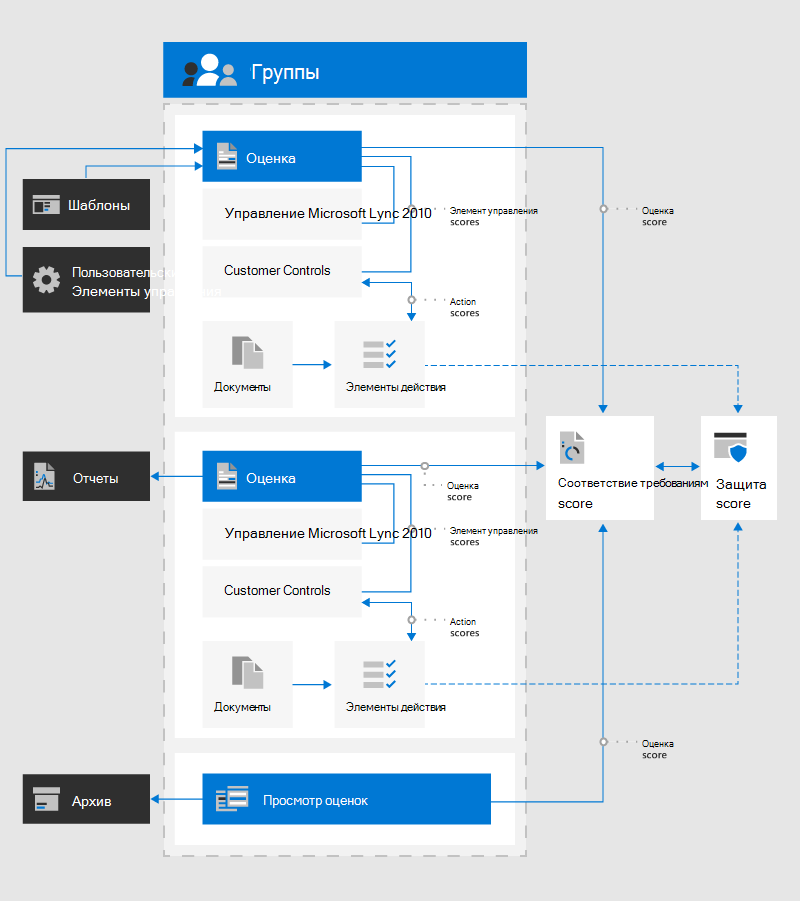

# Оценка соответствия требованиям Майкрософт (Предварительная версия)Microsoft Compliance Score (Preview)

Оценка соответствия требованиям корпорации Майкрософт помогает упростить способ управления соответствием и снизить риски, связанные с обеспечением соответствия требованиям, с помощью дружественного интерфейса пользователя.Microsoft Compliance Score helps to simplify the way you manage compliance and reduce compliance risks through a user-friendly experience. Оценка соответствия теперь доступна для общедоступной предварительной версии в [центре соответствия требованиям Microsoft 365](microsoft-365-compliance-center.md).Compliance Score is now available for public preview in the  [Microsoft 365 compliance center](microsoft-365-compliance-center.md).

**В этой статье:** В этой статье приводятся сведения о показателях соответствия требованиям и способах его настройки в Организации.**In this article:** Read this article to understand what Compliance Score is and how to set it up for your organization.

**Сведения об обновлениях:** Чтобы просмотреть новые и известные проблемы с предварительной версией оценки соответствия требованиям, перейдите к [заметкам выпусков оценки соответствия требованиям](compliance-score-release-notes.md) .**Learn about updates:** Go to the [Compliance Score release notes](compliance-score-release-notes.md) to see what's new and known issues with the preview version of Compliance Score.

## Что такое оценка соответствия требованиямWhat is Compliance Score

Оценка соответствия требованиям Майкрософт является ознакомительной функцией в центре соответствия требованиям Microsoft 365, которая поможет вам понять уровень соответствия требованиям Организации.Microsoft Compliance Score is a preview feature in the Microsoft 365 compliance center to help you understand your organization’s compliance posture. Он вычисляет оценку, основанную на рисках, для выполнения действий, которые помогают уменьшить риски, связанные с защитой данных и нормативными стандартами.It calculates a risk-based score measuring your progress in completing actions that help reduce risks around data protection and regulatory standards.

Вы можете использовать оценку соответствия требованиям в качестве средства для отслеживания всех оценок риска.You can use Compliance Score as a tool to track all of your risk assessments. Он предоставляет возможности рабочих процессов, которые помогают эффективно выполнять оценку риска с помощью общего средства.It provides workflow capabilities to help you efficiently complete your risk assessments through a common tool.

Если вы используете [Диспетчер соответствия требованиям](compliance-manager-overview.md), вы заметите, что показатель соответствия теперь является самостоятельным компонентом с более простой и удобной для пользователя конструкцией, помогающим упростить управление соответствием.If you currently use [Compliance Manager](compliance-manager-overview.md), you’ll notice that Compliance Score is now a standalone feature with a simpler, more user-friendly design to help you manage compliance more easily. 

Основная страница оценки соответствия требованиям — настраиваемая панель мониторинга.The main Compliance Score page is your custom dashboard. В этом примере показан текущий рейтинг, что позволяет понять, что нужно уделить внимание, и пошаговые инструкции по улучшению оценки.It shows your current score, helps you see what needs attention, and guides you to actions to improve your score. Панель мониторинга оценки соответствия требованиям будет выглядеть следующим образом:Your Compliance Score dashboard will look like this:

### Упрощенное управление соответствием требованиямSimplified compliance management

Оценка соответствия помогает упростить управление соответствием требованиям, предоставляя следующие компоненты:Compliance Score helps simplify compliance management by providing:

- **Непрерывная оценка**: автоматически сканирует среды Microsoft 365 для обнаружения и отслеживания эффективности управления защитой данных в системе**Continuous assessments**: automatically scans through your Microsoft 365 environments to detect and monitor the effectiveness of data protection controls in your system
- **Рекомендуемые действия**: содержит рекомендации и пошаговые инструкции по внедрению элементов управления для достижения максимальной оценки**Recommended actions**: provides recommendations and step-by-step guidance for how to implement controls to maximize your score
-  **Встроенное сопоставление элементов управления**: помогает обеспечить актуальную структуру соответствия требованиям, предоставляя встроенную стандартную структуру управления**Built-in control mapping**: helps you stay current with the evolving compliance landscape by providing a built-in common control framework

> [!IMPORTANT] 
> Показатель соответствия требованиям не является абсолютным показателем соответствия требованиям организации конкретным стандартам или нормативным требованиям.Compliance Score does not express an absolute measure of organizational compliance with any particular standard or regulation. Он выражает область, к которой вы предприняли элементы управления, которые могут снизить риски для персональных данных и индивидуальной конфиденциальности.It expresses the extent to which you have adopted controls which can reduce the risks to personal data and individual privacy. Рекомендации от оценки соответствия требованиям и диспетчера соответствия требованиям не следует рассматривать как гарантию соответствия требованиям.Recommendations from Compliance Score and Compliance Manager should not be interpreted as a guarantee of compliance. Эта служба в настоящее время находится в режиме предварительной версии и подчиняется условиям и условиям в [терминах веб-служб](https://go.microsoft.com/fwlink/?linkid=2108910).This service is currently in preview and is subject to the terms and conditions in the [Online Services Terms](https://go.microsoft.com/fwlink/?linkid=2108910).

## Отношение к диспетчеру соответствия требованиямRelationship to Compliance Manager

Оценка соответствия требованиям является упрощенной версией диспетчера соответствия требованиям.Think of Compliance Score as a simplified version of Compliance Manager. Несмотря на то, что они существуют как отдельные, но интегрированные средства, показатель соответствия позволяет упростить отслеживание общей оценки соответствия требованиям и предпринять меры по их улучшению.While the two exist as distinct yet integrated tools, Compliance Score makes it easier to monitor your overall compliance posture and take steps to improve it.

Оценка соответствия использует один и тот же сервер в диспетчере соответствия требованиям, поэтому все данные, которые могут быть уже есть в диспетчере соответствия требованиям, будут отображаться в рейтинге соответствия требованиям.Compliance Score shares the same backend with Compliance Manager, so any data you may already have in Compliance Manager will show in Compliance Score.

Во время общедоступной предварительной версии некоторые функции остаются исключительно в диспетчере соответствия требованиям, например для управления оценками и создания шаблонов.During public preview, some functionality remains solely in Compliance Manager, such as managing assessments and creating templates. Мы рекомендуем начать все действия по управлению соответствием требованиям в рейтинге соответствия требованиям.We recommend beginning all of your compliance management activities in Compliance Score. Когда вы переходите к функциям, обрабатываемым диспетчером соответствия требованиям, вы будете посвящены этому средству.When you come to functions handled by Compliance Manager, you will be guided to that tool. По этой причине некоторые из этой документации направлены на разделы, посвященные диспетчеру соответствия требованиям.For that reason, some of this documentation directs you to Compliance Manager topics.

Узнайте больше о связи между рейтингом соответствия требованиям и диспетчером соответствия требованиям в [заметках о выпуске оценки соответствия требованиям](compliance-score-release-notes.md).Learn more about the relationship between Compliance Score and Compliance Manager in the [Compliance Score release notes](compliance-score-release-notes.md).

## Общие сведения о рейтингеUnderstanding your score

Оценка соответствия дает вам начальный балл, основанный на базовом уровне защиты данных (Майкрософт) 365.Compliance Score gives you an initial score based on the Microsoft 365 data protection baseline. Этот базовый план представляет собой набор элементов управления, включающих распространенные отраслевые нормы и стандарты.This baseline is a set of controls that includes common industry regulations and standards. Хотя этот показатель является хорошей отправной точкой для оценки степени соответствия требованиям, рейтинг соответствия становится более мощным, когда вы добавляете оценки, более релевантные для вашей организации.While this score is a good starting point for assessing your compliance posture, Compliance Score becomes more powerful once you add assessments that are more relevant to your organization.

Например, если ваша организация принадлежит промышленным финансовым службам, вы можете добавить оценку ФФИЕК.For example, if your organization belongs to the financial services industry, you may want to add the FFIEC assessment. Если ваша организация принадлежит к сфере здравоохранения, вы можете добавить оценку HIPAA/HITECH.If your organization belongs to the healthcare industry, you can add the HIPAA/HITECH assessment. Узнайте, как [добавлять оценки в диспетчере соответствия требованиям](working-with-compliance-manager.md#assessments).Learn how to [add assessments in Compliance Manager](working-with-compliance-manager.md#assessments).

Узнайте больше о [том, как вычисляется и постоянно отслеживается рейтинг соответствия требованиям](compliance-score-methodology.md).Learn more about [how your compliance score is calculated and continuously monitored](compliance-score-methodology.md).

## Ключевые компоненты: элементы управления, оценки, шаблоны, группыKey components: controls, assessments, templates, groups

Оценка соответствия использует несколько компонентов, которые помогут вам управлять действиями по обеспечению соответствия требованиям.Compliance Score uses several components to help you manage your compliance activities. При использовании оценки соответствия требованиям для назначения, тестирования и отслеживания действий, соответствующих требованиям, полезно иметь базовое представление об этих ключевых компонентах.As you use Compliance Score to assign, test, and monitor compliance activities, it’s helpful to have a basic understanding of these key components. На этом рисунке показаны отношения между ними:This diagram shows the relationships among them:

### Элементы управленияControls

Элемент управления определяет способ оценки и управления конфигурацией системы, организационным процессом и учетом людей для удовлетворения определенных требований к нормативным, стандартным или внутренним политикам.A control defines how you assess and manage system configuration, organizational process, and people accountability to meet a specific requirement of a regulation, standard, or internal policy.

Оценка соответствия отслеживает два типа элементов управления:Compliance Score tracks two types of controls:

1. **Управляемые корпорацией Майкрософт элементы управления**: элементы управления для облачных служб (Майкрософт), ответственные за реализацию**Microsoft-managed controls**: controls for Microsoft cloud services, which Microsoft is responsible for implementing
2. **Управляемые пользователями элементы управления**: элементы управления, управляемые вашей организацией, которые несут ответственность за реализацию**Customer-managed controls**: controls managed by your organization, which you are responsible for implementing
 
### ОценкиAssessments

Оценка — это Оценка шаблона, который инициирует процесс оценки в Организации.An assessment is an evaluation of a template that initiates the scoring process for your organization. Группа оценок. действия, необходимые для удовлетворения требований стандартного, нормативного или нормативного законодательства.Assessments group the actions necessary to meet the requirements of a standard, regulation, or law. Например, вы можете оценить, что после выполнения всех действий, описанных в этой среде, переводит параметры Office 365 в соответствие с требованиями ISO 27001.For example, you may have an assessment that, when you complete all actions within it, brings your Office 365 settings in line with ISO 27001 requirements.

По умолчанию Оценка соответствия требованиям Организации является оценкой на основе базового уровня защиты данных Microsoft 365, рекомендации по уменьшению защиты данных и рисков соответствия требованиям (дополнительные[сведения](compliance-score-methodology.md#initial-score-based-on-microsoft-365-data-protection-baseline)).By default, Compliance Score provides your organization with an assessment based on the Microsoft 365 data protection baseline, a recommendation for reducing your data protection and compliance risks ([learn more](compliance-score-methodology.md#initial-score-based-on-microsoft-365-data-protection-baseline)).

Оценки включают несколько компонентов:Assessments include several components:

- **Службы в области**: определенный набор служб Майкрософт, применяемый для оценки.**In-scope services**: the specific set of Microsoft services applicable to the assessment
- **Управляемые корпорацией Майкрософт элементы управления**: элементы управления, реализованные и протестированные корпорацией Майкрософт**Microsoft-managed controls**: controls that Microsoft implemented and tested
- **Управляемые пользователем элементы управления**: элементы управления, которыми вы управляете**Customer-managed controls**: controls that you manage
- Оценка **оценки**: процент баллов, достигнутый за счет выполнения действий, выполняемых в рамках этой оценки.**Assessment score**: the percentage of the points achieved by completing actions within that assessment

> [!NOTE]
> Оценка соответствия требованиям отображает ваши оценки и то, как они делятся на общий рейтинг.Compliance Score displays your assessments and how they factor into your overall score. Однако во время общедоступной предварительной версии вы будете направлены к диспетчеру соответствия требованиям, чтобы управлять оценкой.However, during public preview you will be directed to Compliance Manager to manage your assessments.

Просмотрите подробные инструкции по [работе с оценками в диспетчере соответствия требованиям](working-with-compliance-manager.md#assessments).View detailed instructions for [working with assessments in Compliance Manager](working-with-compliance-manager.md#assessments).

### ШаблоныTemplates

Оценка соответствия предоставляет предварительно настроенные шаблоны для оценки.Compliance Score provides pre-configured templates for assessments. Оценка соответствия позволяет также создавать шаблоны для собственных оценок в соответствии с вашими потребностями.Compliance Score also allows you to create templates for your own assessments to suit your needs. Например, можно создать шаблон для элемента управления бизнес-процесса или шаблон для региональных настроек защиты данных или соответствия требованиям, которые не охватывают один из предварительно настроенных шаблонов.For example, you can create a template for your business process control, or a template for a regional data protection or compliance standard that isn’t covered by one of the pre-configured templates.  Создавая собственные шаблоны, вы можете создавать пользовательские оценки, чтобы убедиться, что оценки соответствия должны отслеживать не только оценки Microsoft Cloud, но и другие оценки рисков в области для вашей организации.By creating your own templates, you can create custom assessments to ensure that Compliance Score tracks not only Microsoft cloud assessments, but also any other risk assessments in scope for your organization.

Вы можете создавать новые шаблоны, скопировав существующий шаблон или импортировав информацию об элементах управления из файла Excel.You can create new templates by copying an existing template, or by importing controls information from an Excel file. Просмотрите подробные инструкции по [созданию шаблонов в диспетчере соответствия требованиям](working-with-compliance-manager.md#templates).View detailed instructions for [creating templates in Compliance Manager](working-with-compliance-manager.md#templates).

Предварительно настроенные шаблоны для оценки соответствия:The pre-configured templates for Compliance Score are:

1. [Общий закон по защите данных в Бразилии (ЛГПД)Brazil General Data Protection Law (LGPD)](https://go.microsoft.com/fwlink/?linkid=2115387)
2. [Закон о конфиденциальности для потребителей в Калифорнии (ККПА)](https://go.microsoft.com/fwlink/?linkid=2108871) (Предварительная версия)[California Consumer Privacy Act (CCPA)](https://go.microsoft.com/fwlink/?linkid=2108871) (Preview)
3. [Cloud Controls Alliance (CSA) Cloud Controls (CCM) 3.0.1Cloud Security Alliance (CSA) Cloud Controls Matrix (CCM) 3.0.1](https://go.microsoft.com/fwlink/?linkid=2109076)
4. [GDPR Европейского союзаEuropean Union GDPR](https://go.microsoft.com/fwlink/?linkid=2108870)
5. [Буклет информационный Совет по отчетности по федеральным финансовым учреждениям (ФФИЕК)Federal Financial Institutions Examination Council (FFIEC) Information Security Booklet](https://go.microsoft.com/fwlink/?linkid=2109077)
6. [FedRAMP среднийFedRAMP Moderate](https://go.microsoft.com/fwlink/?linkid=2108869)
7. [HIPAA](https://go.microsoft.com/fwlink/?linkid=2109078) / [HiTech](https://go.microsoft.com/fwlink/?linkid=2109079)[HIPAA](https://go.microsoft.com/fwlink/?linkid=2109078) / [HITECH](https://go.microsoft.com/fwlink/?linkid=2109079)
8. [Ирап](https://go.microsoft.com/fwlink/?linkid=2113709) / [Австралийский правительством ISM](https://go.microsoft.com/fwlink/?linkid=2113024) (ознакомительная версия)[IRAP](https://go.microsoft.com/fwlink/?linkid=2113709) / [Australian Government ISM](https://go.microsoft.com/fwlink/?linkid=2113024) (Preview)
9. [ISO 27001:2013ISO 27001:2013](https://go.microsoft.com/fwlink/?linkid=2109073)
10. [ISO 27018:2014ISO 27018:2014](https://go.microsoft.com/fwlink/?linkid=2109074)
11. [ISO 27701:2019ISO 27701:2019](https://go.microsoft.com/fwlink/?linkid=2113025)
12. [Базовый план защиты данных (Майкрософт) 365Microsoft 365 Data Protection Baseline](compliance-score-methodology.md#initial-score-based-on-microsoft-365-data-protection-baseline)
13. [NIST 800-53 Rev. 4NIST 800-53 Rev. 4](https://go.microsoft.com/fwlink/?linkid=2109075)
14. [NIST 800-171NIST 800-171](https://go.microsoft.com/fwlink/?linkid=2108867)
15. [Инфраструктура NIST Циберсекурити (CSF)NIST Cybersecurity Framework (CSF)](https://go.microsoft.com/fwlink/?linkid=2108868)
16. [SOC 1;SOC 1](https://go.microsoft.com/fwlink/?linkid=2115184)
17. [SOC 2;SOC 2](https://go.microsoft.com/fwlink/?linkid=2115184)

> [!NOTE]
> Во время общедоступной предварительной версии перейдите к диспетчеру соответствия требованиям, чтобы создать шаблоны и управлять ими.During public preview, go to Compliance Manager to create and manage your templates.

### ГруппыGroups

Группы позволяют упорядочивать оценки логически для вас.Groups allow you to organize assessments in a way that is logical to you. Например, вы можете выбрать способ группировки оценок по годам, стандарту соответствия требованиям, обслуживанию, командам в организации или другим способам.For example, you may choose to group assessments by year, compliance standard, service, teams within your organization, or some other way.

Когда две различные оценки в одной группе совместно используют действия, выполняемые с учетом клиентов, выполнение сведений о реализации, проверки и состояния действия в одной оценке автоматически синхронизируется с одним действием в любой другой оценке в группе.When two different assessments in the same group share customer-managed actions, the completion of implementation details, testing, and status for the action in one assessment automatically synchronizes to the same action in any other assessment in the group. Это объединяет назначенные действия по улучшению в группе и сокращает объем работ по дублированию.This unifies the assigned improvement actions across the group and reduces duplicating work.

Узнайте, как [создавать группы в диспетчере соответствия требованиям](working-with-compliance-manager.md#groups).Learn how to [create groups in Compliance Manager](working-with-compliance-manager.md#groups). Создав группы, вы можете [отфильтровать панель мониторинга оценки соответствия требованиям](compliance-score-setup.md#filtering-your-dashboard-view) , чтобы просмотреть рейтинг по одной или нескольким группам.Once you create groups, you can [filter you Compliance Score dashboard](compliance-score-setup.md#filtering-your-dashboard-view) to view your score by one or more groups.

## Следующий шаг: запуск программы установкиNext step: begin setup

Узнайте, как выполнить вход, настроить разрешения и настроить обновления и представления панели мониторинга при [настройке оценки соответствия требованиям](compliance-score-setup.md).Learn how to sign in, set up permissions, and configure updates and dashboard views at [Compliance Score setup](compliance-score-setup.md).
