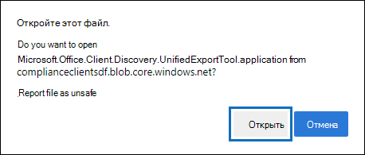
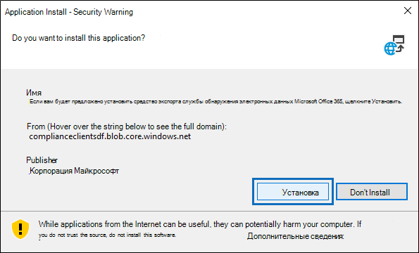

# Используйте средство экспорта электронных открытий в Microsoft EdgeUse the eDiscovery Export Tool in Microsoft Edge

В результате недавних изменений в новейшей версии Microsoft Edge поддержка ClickOnce больше не включена по умолчанию.As a result of recent changes to the newest version of Microsoft Edge, ClickOnce support is no longer enabled by default. Чтобы продолжить использование экспортного средства eDiscovery для загрузки результатов поиска контента или поиска по электронной информации, необходимо либо использовать [Microsoft Internet Explorer,](https://support.microsoft.com/help/17621/internet-explorer-downloads) либо включить ClickOnce поддержку в самой новой версии Microsoft Edge.To continue using the eDiscovery Export Tool to download Content Search or eDiscovery search results, you either need to use [Microsoft Internet Explorer](https://support.microsoft.com/help/17621/internet-explorer-downloads) or enable ClickOnce support in the newest version of Microsoft Edge.

## Включить ClickOnce в Microsoft EdgeEnable ClickOnce support in Microsoft Edge

1. В Microsoft Edge перейдите **в edge://flags/#edge-click-once**.In Microsoft Edge, go to **edge://flags/#edge-click-once**.

2. Если существующее значение за установлено по **умолчанию** или **отключено** в списке выпаданий, измените его на **Включено.**If the existing value is set to **Default** or **Disabled** in the dropdown list, change it to **Enabled**.

   

3. Прокрутите вниз в нижней части окна браузера и нажмите **кнопку Перезапустить,** чтобы перезапустить Edge.Scroll down to the bottom of the browser window and click **Restart** to restart Edge.

   

**Примечание:** Организации могут использовать групповую политику для отключения ClickOnce поддержки.**Note:** Organizations can use Group Policy to disable ClickOnce support. Чтобы проверить, существует ли организационной политики ClickOnce поддержки, перейдите в **edge://policy**.To check if there is an organizational policy for ClickOnce support, go to **edge://policy**. На следующем скриншоте показано ClickOnce включена вся организация.The following screenshot shows that ClickOnce is enabled across the entire organization. Если это значение политики установлено как **ложное,** необходимо обратиться к администратору в организации.If this policy value is set to **false**, you will need to contact an admin in your organization.

## Установка и запуск экспортного средства eDiscoveryInstall and run the eDiscovery Export Tool

1. Нажмите **кнопку Скачать** результаты на странице вылет экспорта в поиске контента или случае поиска электронной информации.Click **Download results** on the flyout page of an export in Content Search or an eDiscovery case.

   

2. Вам будет предложено подтверждение о запуске средства Нажмите кнопку **Открыть**.You will be prompted with a confirmation to launch the tool, Click **Open**.

   

   Если средство экспорта электронных данных не установлено, вам будет предложено предупреждение о безопасности,If the eDiscovery Export Tool isn't installed, you will be prompted with a Security Warning, 

   

3. Нажать кнопку **Установить**.Click **Install**. После установки средство экспорта запускается автоматически.After it's installed, the export tool will launch automatically.

Дополнительную информацию см. в следующих статьях:For more information, see the following topics:

- [Экспорт результатов поиска контентаExport Content Search results](export-search-results.md)

- [Как включить флаги эксперимента в Microsoft EdgeHow to enable experiment flags in Microsoft Edge](https://microsoftedgesupport.microsoft.com/hc/articles/360034075294-How-to-enable-experiment-flags-in-Microsoft-Edge-Insider-channels)
