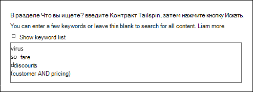
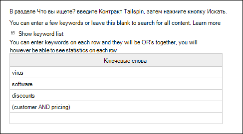
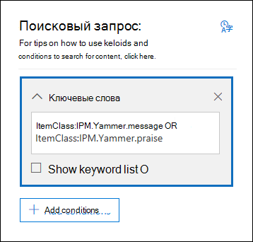
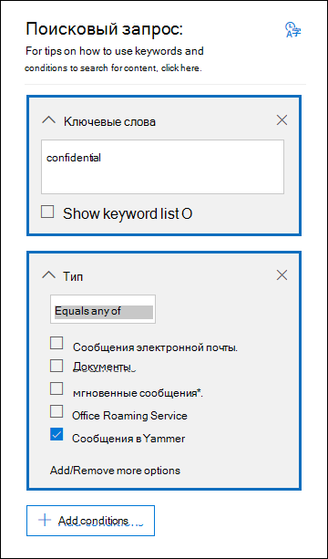

# <a name="content-search-reference"></a>Справочник по поиску контента

## <a name="content-search-limits"></a>Ограничения поиска контента

- Описание ограничений, применяемых к функции поиска контента, см. в статье [Ограничения для поиска контента](limits-for-content-search.md).
  
- Майкрософт собирает данные о скорости выполнения запросов на поиск контента, создаваемых во всех организациях в службе. Хотя сложность запроса тоже влияет на скорость его выполнения, главным фактором, определяющим время поиска, является число почтовых ящиков, в которых он ведется. Хотя время поиска не подкрепляется соглашением об уровне обслуживания, доступны примерные результаты для разного числа почтовых ящиков, включенных в запрос.
  
  |**Число почтовых ящиков**|**Среднее время поиска**|
  |:-----|:-----|
  |100  <br/> |30 секунд  <br/> |
  |1000  <br/> |45 секунд  <br/> |
  |10 000  <br/> |4 минуты  <br/> |
  |25 000   <br/> |10 минут  <br/> |
  |50 000  <br/> |20 минут  <br/> |
  |100 000  <br/> |25 минут  <br/> |
  |||
  
## <a name="building-a-search-query"></a>Создание поискового запроса

Подробные сведения о создании поискового запроса, использовании логических операторов поиска и условий поиска, а также о поиске типов конфиденциальной информации и контента, к которому предоставлен доступ пользователям за пределами вашей организации, см. в статье [Запросы ключевых слов и условия поиска контента](keyword-queries-and-search-conditions.md).
  
При использовании списка ключевых слов для создания поискового запроса учитывайте указанные ниже моменты.
  
- Чтобы создать поисковый запрос, ключевые слова (или фразы) в котором соединены с помощью оператора **OR**, установите флажок **Отобразить список ключевых слов** и введите каждое ключевое слово в отдельной строке. Если вставить в поле список ключевых слов или нажимать клавишу **ВВОД** после ввода ключевых слов, они не будут соединены с помощью оператора **OR**. Ниже приведены примеры неправильного и правильного добавления списка ключевых слов.
    
    **Неправильный вариант**
    
    
  
    **Правильный вариант**
    
    
  
- Вы также можете подготовить список ключевых слов или фраз в файле Excel или обычном текстовом файле, а затем скопировать и вставить список в поле для ключевых слов. Для этого нужно установить флажок **Отобразить список ключевых слов**. После этого щелкните первую строку в списке ключевых слов и вставьте список. Каждая строка из файла Excel или текстового файла вставляется в отдельную строку в списке ключевых слов. 
    
- После создания поискового запроса с помощью списка ключевых слов рекомендуется проверить его синтаксис. В поисковом запросе, отображаемом в области сведений под надписью **Запрос**, ключевые слова разделяются текстом **(c:s)**. Это означает, что ключевые слова объединены с помощью логического оператора, аналогичного по функциональности оператору **OR**. Аналогичным образом, если поисковый запрос содержит условия, они отделены от ключевых слов текстом **(c:c)**. Это означает, что ключевые слова объединены с условиями с помощью логического оператора, схожего по функциональности с оператором **AND**. Ниже приведен пример поискового запроса (отображаемого в области сведений), который был создан с использованием списка ключевых слов и условия. 
    
    
  
- Когда вы выполняете поиск контента, Microsoft 365 автоматически проверяет ваш поисковый запрос на наличие логических операторов, которые могут быть записаны строчными буквами, и неподдерживаемых символов. Неподдерживаемые символы часто скрыты, а их наличие обычно приводит к ошибке поиска или возврату неверных результатов. Дополнительные сведения о неподдерживаемых символах, наличие которых проверяется, см. в статье [Проверка запроса веб-части "Поиск контента" на ошибки](check-your-content-search-query-for-errors.md).
    
- Если имеется поисковый запрос, содержащий ключевые слова из символов, отсутствующих в английском алфавите (например, китайских символов), вы можете щелкнуть значок **Зарос языка и страны/региона** и выбрать значение региональных параметров для поиска. По умолчанию используется нейтральный язык и регион. Как определить, нужно ли изменить параметры языка для поиска контента? Если вы уверены, что расположения контента содержат искомые символы, отсутствующие в английском алфавите, но поиск не возвращает результатов, причиной могут быть параметры языка. 
  
## <a name="searching-onedrive-accounts"></a>Поиск в учетных записях OneDrive

- Чтобы собрать список URL-адресов сайтов OneDrive в организации, см. статью [Создание списка всех расположений OneDrive в организации](/onedrive/list-onedrive-urls)/ Скрипт в этой статье создает текстовый файл, содержащий список всех сайтов OneDrive. Чтобы запустить этот скрипт, требуется установить и использовать командную консоль SharePoint Online. Не забудьте добавить URL-адрес домена личного сайта вашей организации к каждому сайту OneDrive, на котором нужно выполнить поиск. Это домен, содержащий все хранилище OneDrive. Пример: `https://contoso-my.sharepoint.com`. Вот пример URL-адреса для сайта OneDrive пользователя: `https://contoso-my.sharepoint.com/personal/sarad_contoso_onmicrosoft.com`.
    
    В редких случаях, когда имя участника-пользователя (UPN) изменено, URL-адрес его расположения OneDrive изменяется с учетом нового имени участника-пользователя. В этом случае требуется изменить поиск контента, добавив новый URL-адрес OneDrive пользователя и удалив старый. Дополнительные сведения см. в разделе [Как изменения UPN влияют на URL-адрес OneDrive](/onedrive/upn-changes).
  
## <a name="searching-microsoft-teams-and-microsoft-365-groups"></a>Поиск в Microsoft Teams и группах Microsoft 365

Вы можете выполнять поиск в почтовом ящике, связанном с группой Microsoft 365 или командой Microsoft Teams. Поскольку команды Microsoft Teams создаются на основе групп Microsoft 365, поиск в них выполняется одинаково. В обоих случаях поиск выполняется только в почтовом ящике группы или команды. Поиск в почтовых ящиках участников группы или команды не выполняется. Чтобы выполнить поиск в них, необходимо добавить их в поисковый запрос.
  
При поиске контента в Microsoft Teams и группах Microsoft 365 следует учитывать указанные ниже моменты.
  
- Для поиска контента в командах Teams и группах Microsoft 365 необходимо указать почтовый ящик и сайт SharePoint, связанный с командой или группой.

- Содержимое из закрытых каналов хранится в почтовых ящиках каждого пользователя, а не в почтовом ящике команды. Сведения о поиске содержимого в закрытых каналах см. в разделе [Обнаружение электронных данных в закрытых каналах](/microsoftteams/ediscovery-investigation#ediscovery-of-private-channels).
    
- Чтобы просмотреть свойства команды или группы Microsoft 365, запустите командлет **Get-UnifiedGroup** в Exchange Online. Это удобный способ узнать URL-адрес сайта, связанного с командой или группой. Например, следующая команда отображает выбранные свойства для группы Microsoft 365 с именем "Senior Leadership Team": 
    
  ```text
  Get-UnifiedGroup "Senior Leadership Team" | FL DisplayName,Alias,PrimarySmtpAddress,SharePointSiteUrl
  DisplayName            : Senior Leadership Team
  Alias                  : seniorleadershipteam
  PrimarySmtpAddress     : seniorleadershipteam@contoso.onmicrosoft.com
  SharePointSiteUrl      : https://contoso.sharepoint.com/sites/seniorleadershipteam
  ```

    > [!NOTE]
    > Чтобы запустить командлет **Get-UnifiedGroup**, в Exchange Online вам должна быть назначена роль "получатели только для чтения" или вы должны входить в группу пользователей, которым она назначена. 
  
- Поиск, выполняемый в почтовом ящике пользователя, не распространяется на команды и группы Microsoft 365, в которые входит этот пользователь. Кроме того, когда поиск выполняется в команде или группе Microsoft 365, он осуществляется только в указанном вами почтовом ящике группы и на сайте группы. Поиск в почтовых ящиках и учетных записях OneDrive для бизнеса участников группы не выполняется, если не включить их явным образом в поиск.

- Список участников команды или группы Microsoft 365 можно просмотреть в разделе свойств на странице **Главная \> Группы** в Центре администрирования Microsoft 365. Или можно выполнить следующую команду в Exchange Online PowerShell: 

  ```powershell
  Get-UnifiedGroupLinks <group or team name> -LinkType Members | FL DisplayName,PrimarySmtpAddress
  ```

    > [!NOTE]
    > Чтобы запустить командлет **Get-UnifiedGroupLinks**, в Exchange Online вам должна быть назначена роль "получатели только для чтения" или вы должны входить в группу пользователей, которым она назначена. 
  
- Беседы в канале Teams хранятся в почтовом ящике, связанном с командой. Файлы, которыми обмениваются участники команды, также сохраняются на сайте команды SharePoint. Таким образом, чтобы выполнить поиск бесед и файлов канала, необходимо в качестве расположения содержимого указать почтовый ящик команды и сайт SharePoint.
    
- Беседы в списке чатов в Teams хранятся в почтовом ящике Exchange Online пользователей, участвующих в чате. Файлы, к которым пользователь предоставляет общий доступ в беседах чата, сохраняются в его учетной записи OneDrive для бизнеса. Таким образом, чтобы выполнить поиск бесед и файлов в списке чатов, необходимо в качестве расположений содержимого указать почтовые ящики и учетные записи OneDrive для бизнеса отдельных пользователей.
    
    > [!NOTE]
    > При гибридном развертывании Exchange пользователи с локальным почтовым ящиком могут участвовать в беседах из списка чатов в Teams. В этом случае контент этих бесед также можно найти, так как он сохраняется в облачной области хранилища (называемой *облачным почтовым ящиком для локальных пользователей*) для пользователей с локальным почтовым ящиком. Дополнительные сведения см. в статье [Поиск данных в разделе "чат" для локальных пользователей](search-cloud-based-mailboxes-for-on-premises-users.md).
  
- Каждая команда и канал команды содержат вики-сайт для создания заметок и совместной работы. Содержимое вики-сайта автоматически сохраняется в файле формата MHT. Этот файл хранится в библиотеке документов Teams Wiki Data на сайте команды в SharePoint. Вы можете использовать средство "Поиск контента" для поиска на вики-сайте, указав сайт SharePoint команды в качестве расположения контента.

    > [!NOTE]
    > Возможность поиска на вики-сайте команды или канала (при поиске на сайте SharePoint команды) была выпущена 22 июня 2017 г. Для поиска доступны вики-страницы, сохраненные или обновленные в этот день или позднее. Вики-страницы, сохраненные или обновленные до этой даты, недоступны для поиска.

- Обобщенные сведения о собраниях и звонках в канале Teams также хранятся в почтовых ящиках пользователей, присоединявшихся к собранию или звонку. Это означает, что вы можете использовать средство "Поиск контента" для поиска этих сводных записей. К обобщенным сведениям относятся:
  
  - Дата, время начала, время окончания и длительность собрания или звонка

  - Дата и время, когда каждый участник присоединился или покинул собрание или звонок.

  - Звонки, отправленные в голосовую почту

  - Пропущенные или неотвеченные звонки

  - Переключения звонков, представленные двумя отдельными звонками

  Чтобы сводные записи собраний и звонков стали доступны для поиска, может потребоваться до 8 часов.

  В результатах поиска сводка по собраниям обозначается как **Собрание** в поле **Тип**, а сводка по звонкам обозначается как **Звонок**. Кроме того, беседы из канала Teams и чатов обозначаются как **Мгновенное сообщение** в поле **Тип**.
  
  

   Подробнее см. в статье [Запуск eDiscovery в Microsoft Teams для звонков и собраний](https://techcommunity.microsoft.com/t5/microsoft-teams-blog/microsoft-teams-launches-ediscovery-for-calling-and-meetings/ba-p/210947).

- Содержимое карточек, созданное приложениями в каналах Teams, в беседах 1:1 и беседах 1xN хранится в почтовых ящиках и его можно искать. *Карточка* — это контейнер пользовательского интерфейса для коротких фрагментов контента. Карточки могут иметь множество свойств и вложений, а также кнопки, которыми можно запускать действия с карточками. Дополнительные сведения см. в разделе [Карточки](/microsoftteams/platform/task-modules-and-cards/what-are-cards).

  Как и другое содержимое Teams, место хранения содержимого карточки зависит от того, где она была использована. Содержимое карточек, используемых в канале Teams, хранится в почтовом ящике группы Teams. Содержимое карточек для чатов 1:1 и 1xN хранится в почтовых ящиках участников беседы.

  Чтобы найти содержимое карточки, можно использовать условие поиска `kind:microsoftteams` или `itemclass:IPM.SkypeTeams.Message`. При просмотре результатов поиска содержимое карточки, созданное с помощью программ-роботов в канале Teams, имеет свойство **отправителей и авторов** электронной почты в `<appname>@teams.microsoft.com`, где `appname` — это название приложения, создавшего содержимое карточки. Если содержимое карточки было создано пользователем, значение **отправителей и авторов** идентифицирует пользователя.

  При просмотре содержимого карточки в результатах поиска контента оно отображается в виде вложения в сообщение. Вложение называется `appname.html`, где `appname` — название приложения, создавшего содержимое карточки. На приведенных ниже снимках экрана показано, как содержимое карточки (на примере приложения Asana) отображается в Teams и результатах поиска.

  **Содержимое карточки в Teams**

  

  **Содержимое карточки в результатах поиска**
  
  

  > [!NOTE]
  > Чтобы в настоящий момент отобразить изображения из карточки в результатах поиска (например, "галочки" на предыдущем снимке экрана), необходимо войти в Teams (https://teams.microsoft.com) на другой вкладке в том же сеансе браузера, который используется для просмотра результатов поиска. В противном случае отображаются заполнители изображения.

- Чтобы специально выполнить поиск контента Teams, можно использовать свойство электронной почты **Kind** или условие поиска **Тип сообщения**.
  
  - Чтобы использовать свойство **Kind** в составе поискового запроса по ключевым словам, в поле **Ключевые слова** запроса введите `kind:microsoftteams`.

    
  
  - Чтобы использовать условие поиска, добавьте условие **Тип сообщения** и используйте значение `microsoftteams`.

    

   Условия логически связаны с запросом по ключевому слову с помощью оператора **AND**. Это означает, что для возвращения в результатах поиска элемент должен соответствовать как запросу по ключевому слову, так и условию поиска. Дополнительные сведения см. в разделе "Рекомендации по использованию условий" статьи [Запросы ключевых слов и условия поиска контента](keyword-queries-and-search-conditions.md#guidelines-for-using-conditions).
  
## <a name="searching-yammer-groups"></a>Поиск в группах Yammer

Чтобы специально выполнить поиск элементов бесед в группах Yammer, можно использовать свойство электронной почты **ItemClass** или условие поиска **Тип**.

  - Чтобы использовать свойство **ItemClass** в составе поискового запроса по ключевым словам, в поле **Ключевые слова** запроса можно ввести одну (или все) из следующих пар свойство:значение.

     - ItemClass:IPM.Yammer.message
     - ItemClass:IPM.Yammer.poll
     - ItemClass:IPM.Yammer.praise
     - ItemClass:IPM.Yammer.question
  
    Например, с помощью следующего поискового запроса можно возвратить сообщения Yammer и элементы благодарности Yammer:

    
  
  - Или можно использовать условие электронной почты **Тип** и выбрать вариант **Сообщения Yammer**, чтобы возвратить элементы Yammer. Например, следующий поисковый запрос возвращает все элементы бесед Yammer, содержащие ключевое слово "конфиденциально". 

    

## <a name="searching-inactive-mailboxes"></a>Поиск в неактивных почтовых ящиках

При поиске контента можно выполнять поиск в неактивных почтовых ящиках. Чтобы получить список неактивных почтовых ящиков в организации, выполните команду `Get-Mailbox -InactiveMailboxOnly` в  Exchange Online PowerShell. Или выберите **Управление информацией** \> **Хранение** в Центре безопасности и соответствия требованиям и щелкните **Дополнительно** \> **Неактивные почтовые ящики**.
  
Вот несколько моментов, которые следует помнить при поиске в неактивных почтовых ящиках:

- Если существующий поиск контента выполняется в почтовом ящике пользователя, и этот почтовый ящик становится неактивным, при повторном запуске поиск в нем все равно будет выполняться.

- Иногда возникают ситуации, когда у активного и неактивного почтовых ящиков одинаковый SMTP-адрес. В этом случае поиск осуществляется только в выбранном вами почтовом ящике. Другими словами, если добавляется почтовый ящик пользователя для поиска, нельзя предполагать, что поиск выполняется как в активном, так и неактивном почтовом ящике. Поиск выполняется только в почтовом ящике, который явным образом добавлен в поисковый запрос.

- Чтобы выполнить поиск контента в неактивном почтовом ящике, можно использовать оболочку PowerShell в Центре безопасности и соответствия требованиям Для этого требуется добавить точку ( . ) перед адресом неактивного почтового ящика. Например, следующая команда позволяет создать запрос на поиск контента в неактивном почтовом ящике с адресом pavelb@contoso.onmicrosoft.com:

   ```powershell
   New-ComplianceSearch -Name InactiveMailboxSearch -ExchangeLocation .pavelb@contoso.onmicrosoft.com -AllowNotFoundExchangeLocationsEnabled $true
   ```

- Мы настоятельно рекомендуем избегать ситуаций, когда у активного и неактивного почтовых ящиков одинаковый SMTP-адрес. Если вы хотите повторно использовать SMTP-адрес, назначенный неактивному почтовому ящику, мы рекомендуем выполнить возврат неактивного почтового ящика или восстановить содержимое неактивного почтового ящика в активном почтовом ящике (или архиве активного почтового ящика), а затем удалить неактивный почтовый ящик. Дополнительные сведения см. в следующих статьях:

  - [Возврат неактивного почтового ящика в Office 365](recover-an-inactive-mailbox.md)

  - [Восстановление неактивного почтового ящика в Office 365](restore-an-inactive-mailbox.md)

  - [Удаление неактивного почтового ящика в Office 365](delete-an-inactive-mailbox.md)

## <a name="searching-disconnected-or-de-licensed-mailboxes"></a>Поиск в отключенных или нелицензированных почтовых ящиках

Если лицензия на Exchange Online (или лицензия на весь Microsoft 365) удаляется из учетной записи пользователя или из Azure Active Directory, почтовый ящик пользователя становится *отключенным* почтовым ящиком. Это означает, что почтовый ящик больше не связан с учетной записью пользователя. Ниже описано, что происходит при поиске в отключенных почтовых ящиках.

- Если лицензия удаляется из почтового ящика, то возможность поиска для него более недоступна. 

- Если существующий поиск контента выполняется в почтовом ящике, из которого удалена лицензия, при повторном запуске поиска контента не будут возвращаться результаты из отключенного почтового ящика.

- Если вы используете командлет **New-ComplianceSearch** для создания поиска контента и указываете в качестве расположения контента Exchange отключенный почтовый ящик, поиск контента не будет возвращать какие-либо результаты поиска из отключенного почтового ящика.

Если вам нужно сохранить данные в отключенном почтовом ящике, чтобы для него была обеспечена возможность поиска, перед удалением лицензии необходимо поместить почтовый ящик в режим хранения. Это позволит сохранить данные и обеспечит возможность поиска для отключенного почтового ящика до тех пор, пока режим удержания не будет снят. Дополнительные сведения о режиме удержания см. в статье [Как определить тип удержания, примененного для почтового ящика Exchange Online](identify-a-hold-on-an-exchange-online-mailbox.md)

## <a name="partially-indexed-items"></a>Частично индексированные элементы

- Как указано выше, в предполагаемые результаты поиска включаются частично индексированные элементы почтовых ящиков. В предполагаемые результаты поиска не включаются частично индексированные элементы из SharePoint и OneDrive.

- Если частично индексированный элемент совпадает с поисковым запросом (так как другие свойства сообщения или документа соответствуют условиям поиска), он не включается в предполагаемое число неиндексированных элементов. Если частично индексированный элемент исключен по условиям поиска, он не включается в предполагаемое число неиндексированных элементов. Дополнительные сведения см. в статье [Частично индексированные элементы в средстве "Поиск контента" в Office 365](partially-indexed-items-in-content-search.md).

## <a name="searching-for-content-in-a-sharepoint-multi-geo-environment"></a>Поиск контента в среде SharePoint с поддержкой нескольких регионов

Если диспетчеру eDiscovery необходимо искать контент в SharePoint и OneDrive в различных регионах в [среде SharePoint с поддержкой нескольких регионов](../enterprise/multi-geo-capabilities-in-onedrive-and-sharepoint-online-in-microsoft-365.md), для этого нужно выполнить следующие действия:

1. Создайте отдельную учетную запись пользователя для каждого вспомогательного географического расположения, поиск в котором требуется диспетчеру eDiscovery. Чтобы найти контент на сайтах в этом географическом расположении, диспетчер eDiscovery должен войти в учетную запись, которую вы создали для этого расположения, и затем выполнить поиск контента.

2. Создайте фильтр разрешений поиска для каждого вспомогательного географического расположения (и соответствующей учетной записи пользователя), поиск в котором должен выполнить диспетчер eDiscovery. Каждый из этих фильтров разрешений поиска ограничивает область поиска контента определенным географическим расположением, когда диспетчер eDiscovery вошел в учетную запись пользователя, связанную с этим местоположением.

> [!TIP]
> Следовать этой стратегии при использовании средства поиска в [Advanced eDiscovery](overview-ediscovery-20.md) не обязательно. Это объясняется тем, что при поиске на сайтах SharePoint и в учетных записях OneDrive в Advanced eDiscovery поиск выполняется по всем центрам обработки данных. Эту стратегию работы с учетными записями пользователей с определенным регионом и фильтрами разрешения на поиск нужно использовать только в том случае, если вы используете средство поиска контента и выполняете поиск, связанный с досье [eDiscovery](./get-started-core-ediscovery.md).

Предположим, что диспетчер eDiscovery должен найти контент SharePoint и OneDrive в периферийных расположениях в Северной Америке, Европе и Азиатско-Тихоокеанском регионе. В первую очередь необходимо создать три учетных записи пользователей, по одной для каждого расположения. Следующий этап — создание трех фильтров разрешений поиска: по одному для каждого расположения *и* соответствующей учетной записи. Ниже приведены примеры трех фильтров разрешений поиска для этого сценария. В каждом из этих примеров **Регион** означает местоположение центра обработки данных SharePoint для этого географического расположения, а параметр **Пользователи** означает соответствующую учетную запись пользователя.

**Северная Америка**

```powershell
New-ComplianceSecurityFilter -FilterName "SPMultiGeo-NAM" -Users ediscovery-nam@contoso.com -Region NAM -Action ALL
```

**Европа**

```powershell
New-ComplianceSecurityFilter -FilterName "SPMultiGeo-EUR" -Users ediscovery-eur@contoso.com -Region EUR -Action ALL
```

**Азиатско-Тихоокеанский регион**

```powershell
New-ComplianceSecurityFilter -FilterName "SPMultiGeo-APC" -Users ediscovery-apc@contoso.com -Region APC -Action ALL
```

При использовании фильтров разрешений на поиск контента в средах с поддержкой нескольких географических регионов учитывайте перечисленные ниже моменты.

- Параметр **Регион** направляет поиск в указанное вспомогательное расположении. Если диспетчер eDiscovery ищет только сайты SharePoint и OneDrive за пределами региона, указанного в фильтре разрешения поиска, результаты поиска не возвращаются. 

- Параметр **Регион** не управляет поиском в почтовых ящиках Exchange. При поиске в почтовых ящиках будет выполняться поиск во всех центрах обработки данных.

Дополнительные сведения об использовании фильтров разрешений поиска в средах с поддержкой нескольких регионов см. в разделе "Поиск и экспорт контента в средах с поддержкой нескольких регионов" статьи [Настройка границ соответствия для расследований дел обнаружения электронных данных](set-up-compliance-boundaries.md#searching-and-exporting-content-in-multi-geo-environments).
