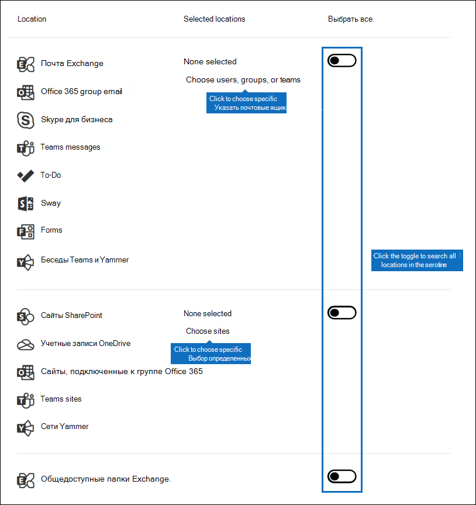

# <a name="content-search"></a><span data-ttu-id="bb033-103">Поиск контента</span><span class="sxs-lookup"><span data-stu-id="bb033-103">Content Search</span></span>

<span data-ttu-id="bb033-104">Средство обнаружения электронных данных (eDiscovery) "Поиск контента" можно использовать в Центре соответствия требованиям в Office 365 или Microsoft 365 для поиска элементов на месте, таких как электронная почта, документы и беседы с мгновенными сообщениями, в организации.</span><span class="sxs-lookup"><span data-stu-id="bb033-104">You can use the Content search eDiscovery tool in the compliance center in Office 365 or Microsoft 365 to search for in-place items such as email, documents, and instant messaging conversations in your organization.</span></span> <span data-ttu-id="bb033-105">Это средство можно использовать для поиска элементов в следующих службах:</span><span class="sxs-lookup"><span data-stu-id="bb033-105">Use this tool to search for items in these services:</span></span>
  
- <span data-ttu-id="bb033-106">Почтовые ящики Exchange Online.</span><span class="sxs-lookup"><span data-stu-id="bb033-106">Exchange Online mailboxes</span></span>

- <span data-ttu-id="bb033-107">Сайты SharePoint Online и учетные записи OneDrive для бизнеса</span><span class="sxs-lookup"><span data-stu-id="bb033-107">SharePoint Online sites and OneDrive for Business accounts</span></span>

- <span data-ttu-id="bb033-108">Microsoft Teams</span><span class="sxs-lookup"><span data-stu-id="bb033-108">Microsoft Teams</span></span>

- <span data-ttu-id="bb033-109">Группы Microsoft 365</span><span class="sxs-lookup"><span data-stu-id="bb033-109">Microsoft 365 Groups</span></span>

- <span data-ttu-id="bb033-110">Группы Yammer</span><span class="sxs-lookup"><span data-stu-id="bb033-110">Yammer Groups</span></span>

- <span data-ttu-id="bb033-111">Беседы через Skype для бизнеса</span><span class="sxs-lookup"><span data-stu-id="bb033-111">Skype for Business conversations</span></span>

<span data-ttu-id="bb033-112">После выполнения поиска контента количество расположений контента и приблизительное число результатов поиска отображаются в статистике поиска.</span><span class="sxs-lookup"><span data-stu-id="bb033-112">After you run a Content search, the number of content locations and an estimated number of search results are displayed in the search statistics.</span></span> <span data-ttu-id="bb033-113">Кроме того, можно быстро просмотреть статистику, например расположение контента, в котором есть большинство элементов, соответствующих поисковому запросу.</span><span class="sxs-lookup"><span data-stu-id="bb033-113">You can also quickly view statistics, such as the content locations that have the most items that match the search query.</span></span> <span data-ttu-id="bb033-114">После выполнения поиска можно предварительно просмотреть результаты или экспортировать их на локальный компьютер.</span><span class="sxs-lookup"><span data-stu-id="bb033-114">After you run a search, you can preview the results or export them to a local computer.</span></span>

## <a name="create-a-search"></a><span data-ttu-id="bb033-115">Создание поискового запроса</span><span class="sxs-lookup"><span data-stu-id="bb033-115">Create a search</span></span>

<span data-ttu-id="bb033-116">Чтобы получить доступ к странице **Поиск контента** для выполнения поиска содержимого с предварительным просмотром и экспортом результатов, администратор, сотрудник, ответственный за обеспечение соответствия требованиям, или диспетчер по обнаружению электронных данных должны входить в группу ролей "Менеджер по обнаружению электронных данных" в Центре безопасности и соответствия требованиям.</span><span class="sxs-lookup"><span data-stu-id="bb033-116">To have access to the **Content search** page to run searches and preview and export search results, an administrator, compliance officer, or eDiscovery manager must be a member of the eDiscovery Manager role group in the Security & Compliance Center.</span></span> <span data-ttu-id="bb033-117">Дополнительные сведения см. в статье [Назначение разрешений на обнаружение электронных данных](assign-ediscovery-permissions.md).</span><span class="sxs-lookup"><span data-stu-id="bb033-117">For more information, see [Assign eDiscovery permissions](assign-ediscovery-permissions.md).</span></span>
  
1. <span data-ttu-id="bb033-118">Перейдите на сайт [https://compliance.microsoft.com](https://compliance.microsoft.com) и войдите с помощью адреса электронной почты Microsoft и пароля.</span><span class="sxs-lookup"><span data-stu-id="bb033-118">Go to [https://compliance.microsoft.com](https://compliance.microsoft.com) and sign in using your Microsoft email address and password.</span></span>

2. <span data-ttu-id="bb033-119">В расположенной слева области Центра соответствия требованиям Microsoft 365 щелкните **Показать все** и выберите **Поиск контента**.</span><span class="sxs-lookup"><span data-stu-id="bb033-119">In the left navigation pane of the Microsoft 365 compliance center, click **Show all**, and then click **Content search**.</span></span>
    
3. <span data-ttu-id="bb033-120">На странице **Поиск контента** выберите **Новый поиск**.</span><span class="sxs-lookup"><span data-stu-id="bb033-120">On the **Content search** page, click **New search**.</span></span>
  
    <span data-ttu-id="bb033-121">Кроме того, вы можете выбрать один из других вариантов поиска:</span><span class="sxs-lookup"><span data-stu-id="bb033-121">You can also choose one of the other search options:</span></span>
    
    - <span data-ttu-id="bb033-122">**Интерактивный поиск**. При выборе этого параметра запускается мастер с инструкциями по созданию поискового запроса.</span><span class="sxs-lookup"><span data-stu-id="bb033-122">**Guided search:** This option starts a wizard that guides you through the creating the search.</span></span> <span data-ttu-id="bb033-123">Пользовательский интерфейс для выбора расположений контента и создания поискового запроса аналогичен параметру **Новый поиск**.</span><span class="sxs-lookup"><span data-stu-id="bb033-123">The user interface to select content locations and build the search query are the same as the **New search** option.</span></span>
    
    - <span data-ttu-id="bb033-124">**Поиск по списку идентификаторов.** Этот параметр позволяет искать определенные сообщения электронной почты и другие элементы почтового ящика с помощью списка идентификаторов Exchange.</span><span class="sxs-lookup"><span data-stu-id="bb033-124">**Search by ID list:** This option lets you search for specific email messages and other mailbox items using a list of Exchange IDs.</span></span> <span data-ttu-id="bb033-125">Чтобы создать поиск по списку идентификаторов, нужно отправить CSV-файл, в котором указаны конкретные элементы почтового ящика для поиска.</span><span class="sxs-lookup"><span data-stu-id="bb033-125">To create an ID list search, you submit a comma-separated value (CSV) file that identifies the specific mailbox items to search for.</span></span> <span data-ttu-id="bb033-126">Инструкции см. в статье [Подготовка CSV-файла для поиска контента по списку идентификаторов](csv-file-for-an-id-list-content-search.md).</span><span class="sxs-lookup"><span data-stu-id="bb033-126">For instructions, see [Prepare a CSV file for an ID list search](csv-file-for-an-id-list-content-search.md).</span></span> 
    
4. <span data-ttu-id="bb033-127">В разделе **Поисковый запрос** укажите следующие элементы.</span><span class="sxs-lookup"><span data-stu-id="bb033-127">Under **Search query**, specify the following things:</span></span>
    
    
  
   - <span data-ttu-id="bb033-129">**Ключевые слова для поиска**. Введите поисковый запрос в поле **Ключевые слова**.</span><span class="sxs-lookup"><span data-stu-id="bb033-129">**Keywords to search for:** Type a search query in **Keywords** box.</span></span> <span data-ttu-id="bb033-130">Вы можете указать ключевые слова или свойства сообщений, например даты отправки и получения, или свойства документов, например имена файлов или дату последнего изменения.</span><span class="sxs-lookup"><span data-stu-id="bb033-130">You can specify keywords, message properties such as sent and received dates, or document properties such as file names or the date that a document was last changed.</span></span> <span data-ttu-id="bb033-131">Можно создавать более сложные запросы, включающие логические операторы, например **AND**, **OR**, **NOT** и **NEAR**.</span><span class="sxs-lookup"><span data-stu-id="bb033-131">You can use more complex queries that use a Boolean operator, such as **AND**, **OR**, **NOT**, and **NEAR**.</span></span> <span data-ttu-id="bb033-132">Кроме того, возможен поиск конфиденциальной информации (например, номера социального страхования) в документах или поиск документов, доступ к которым получали внешние пользователи.</span><span class="sxs-lookup"><span data-stu-id="bb033-132">You can also search for sensitive information (such as social security numbers) in documents, or search for documents that have been shared externally.</span></span> <span data-ttu-id="bb033-133">Если оставить незаполненным поле для ввода ключевых слов, в результаты поиска будет включено все содержимое из указанных расположений контента.</span><span class="sxs-lookup"><span data-stu-id="bb033-133">If you leave the keyword box empty, all content located in the specified content locations is included in the search results.</span></span>

      <span data-ttu-id="bb033-134">Кроме того, вы можете установить флажок **Отобразить список ключевых слов** и вводить ключевые слова в каждой строке.</span><span class="sxs-lookup"><span data-stu-id="bb033-134">Alternatively, you can click the **Show keyword list** checkbox and the type a keyword in each row.</span></span> <span data-ttu-id="bb033-135">В этом случае в создаваемом поисковом запросе ключевые слова из каждой строки будут соединены логическим оператором (**c:s**), аналогичным по функциональности оператору **OR**.</span><span class="sxs-lookup"><span data-stu-id="bb033-135">If you do this, the keywords on each row are connected by a logical operator (**c:s**) that is similar in functionality to the **OR** operator in the search query that's created.</span></span> 
    
      <span data-ttu-id="bb033-136">Зачем использовать список ключевых слов?</span><span class="sxs-lookup"><span data-stu-id="bb033-136">Why use the keyword list?</span></span> <span data-ttu-id="bb033-137">Вы можете получить статистические сведения о том, сколько элементов соответствует каждому ключевому слову.</span><span class="sxs-lookup"><span data-stu-id="bb033-137">You can get statistics that show how many items match each keyword.</span></span> <span data-ttu-id="bb033-138">Это поможет быстро определить, какие ключевые слова наиболее (и наименее) эффективны.</span><span class="sxs-lookup"><span data-stu-id="bb033-138">This can help you quickly identify which keywords are the most (and least) effective.</span></span> <span data-ttu-id="bb033-139">В строке можно также использовать ключевую фразу (в скобках).</span><span class="sxs-lookup"><span data-stu-id="bb033-139">You can also use a keyword phrase (surrounded by parentheses) in a row.</span></span> <span data-ttu-id="bb033-140">Дополнительные сведения о статистике поиска см. в статье [Просмотр статистики ключевых слов для результатов поиска контента](view-keyword-statistics-for-content-search.md).</span><span class="sxs-lookup"><span data-stu-id="bb033-140">For more information about search statistics, see [View keyword statistics for Content Search results](view-keyword-statistics-for-content-search.md).</span></span>

     > [!NOTE]
     > <span data-ttu-id="bb033-141">Чтобы сократить ошибки, связанные с крупными списками ключевых слов, в списке ключевых слов теперь можно указать не более 20 строк.</span><span class="sxs-lookup"><span data-stu-id="bb033-141">To help reduce issues caused by large keyword lists, you're now limited to a maximum of 20 rows in the keyword list.</span></span>
    
    - <span data-ttu-id="bb033-142">**Условия**. Вы можете добавить условия поиска, чтобы сузить область поиска и получить более точные результаты.</span><span class="sxs-lookup"><span data-stu-id="bb033-142">**Conditions:** You can add search conditions to narrow a search and return a more refined set of results.</span></span> <span data-ttu-id="bb033-143">Каждое условие добавляет предложение к поисковому запросу, которое создается и запускается в начале поиска.</span><span class="sxs-lookup"><span data-stu-id="bb033-143">Each condition adds a clause to the search query that is created and run when you start the search.</span></span> <span data-ttu-id="bb033-144">Условие логически связано с запросом по ключевым словам, указанным в поле для ввода ключевых слов, с помощью логического оператора (**c:c**), аналогичного по функциональности оператору **AND**.</span><span class="sxs-lookup"><span data-stu-id="bb033-144">A condition is logically connected to the keyword query (specified in the keyword box) by a logical operator (**c:c**) that is similar in functionality to the **AND** operator.</span></span> <span data-ttu-id="bb033-145">Это означает, что элементы попадают в результаты поиска, если соответствуют как запросу по ключевому слову, так и одному или нескольким условиям.</span><span class="sxs-lookup"><span data-stu-id="bb033-145">That means that items have to satisfy both the keyword query and one or more conditions to be included in the results.</span></span> <span data-ttu-id="bb033-146">Таким образом условия помогают сузить область результатов поиска.</span><span class="sxs-lookup"><span data-stu-id="bb033-146">This is how conditions help to narrow your results.</span></span> <span data-ttu-id="bb033-147">Список и описание условий, которые можно использовать в поисковом запросе, см. в разделе "Условия поиска" статьи [Запросы ключевых слов и условия поиска контента](keyword-queries-and-search-conditions.md#search-conditions).</span><span class="sxs-lookup"><span data-stu-id="bb033-147">For a list and description of conditions that you can use in a search query, see the "Search conditions" section in [Keyword queries and search conditions for Content Search](keyword-queries-and-search-conditions.md#search-conditions).</span></span>
    
       - <span data-ttu-id="bb033-148">**Расположения**. Выберите расположения контента для поиска.</span><span class="sxs-lookup"><span data-stu-id="bb033-148">**Locations:** Choose the content locations to search.</span></span>
    
      - <span data-ttu-id="bb033-149">**Все расположения**. Используйте этот параметр для поиска во всех расположениях контента в организации.</span><span class="sxs-lookup"><span data-stu-id="bb033-149">**All locations:** Use this option to search all content locations in your organization.</span></span> <span data-ttu-id="bb033-150">Сюда входит почта во всех почтовых ящиках Exchange (включая все неактивные почтовые ящики и почтовые ящики для всех команд Microsoft Teams, групп Yammer и групп Microsoft 365), все беседы через Skype для бизнеса, все сайты SharePoint и OneDrive для бизнеса (включая сайты для всех команд Microsoft Teams, групп Yammer и групп Microsoft 365) и элементы во всех общедоступных папках Exchange.</span><span class="sxs-lookup"><span data-stu-id="bb033-150">This includes email in all Exchange mailboxes (including all inactive mailboxes, and mailboxes for all Microsoft Teams, Yammer Groups, and Microsoft 365 Groups), all Skype for Business conversations, all SharePoint and OneDrive for Business sites (including the sites for all Microsoft Teams, Yammer Groups, and Microsoft 365 Groups), and items in all Exchange public folders.</span></span>
    
      - <span data-ttu-id="bb033-151">**Определенные расположения**. Используйте этот параметр для поиска в определенных расположениях контента.</span><span class="sxs-lookup"><span data-stu-id="bb033-151">**Specific locations:** Use this option to search specific content locations.</span></span> <span data-ttu-id="bb033-152">Вы можете выполнять поиск во всех расположениях контента для определенной службы Office 365 (например, поиск во всех почтовых ящиках Exchange или поиск по всем сайтам SharePoint) или выполнять поиск контента в определенных расположениях любой отображаемой службы Office 365.</span><span class="sxs-lookup"><span data-stu-id="bb033-152">You can search all content locations for a specific Office 365 service (such as searching all Exchange mailboxes or search all SharePoint sites) or you can search for content in specific locations of any of the Office 365 services that are displayed.</span></span> 
    
        
  
         <span data-ttu-id="bb033-154">В список почтовых ящиков Exchange для поиска вы также можете добавить группы рассылки.</span><span class="sxs-lookup"><span data-stu-id="bb033-154">You can also add distribution groups to the list of Exchange mailboxes to search.</span></span> <span data-ttu-id="bb033-155">В этом случае поиск выполняется в почтовых ящиках участников группы.</span><span class="sxs-lookup"><span data-stu-id="bb033-155">For distribution groups, the mailboxes of group members are searched.</span></span> <span data-ttu-id="bb033-156">Динамические группы рассылки не поддерживаются.</span><span class="sxs-lookup"><span data-stu-id="bb033-156">Dynamic distribution groups aren't supported.</span></span>
    
       > [!NOTE]
       > <span data-ttu-id="bb033-157">Если поиск выполняется во всех или только в определенных почтовых ящиках, данные из других приложений Office 365, сохраненные в почтовых ящиках пользователей, включаются при экспорте результатов поиска контента.</span><span class="sxs-lookup"><span data-stu-id="bb033-157">When you search all mailbox locations or just specific mailboxes, data from other Office 365 applications that's saved to user mailboxes is included when you export the results of a Content Search.</span></span> <span data-ttu-id="bb033-158">Эти данные не включаются в предполагаемые результаты поиска и недоступны для предварительного просмотра.</span><span class="sxs-lookup"><span data-stu-id="bb033-158">This data won't be included in the estimated search results and isn't available for preview.</span></span> <span data-ttu-id="bb033-159">Они включаются при экспорте и скачивании результатов поиска.</span><span class="sxs-lookup"><span data-stu-id="bb033-159">It is included when you export and download the search results.</span></span> <span data-ttu-id="bb033-160">Дополнительные сведения см. в статье [Контент, хранящийся в почтовых ящиках Exchange Online](what-is-stored-in-exo-mailbox.md).</span><span class="sxs-lookup"><span data-stu-id="bb033-160">For more information, see [Content stored in Exchange Online mailboxes](what-is-stored-in-exo-mailbox.md).</span></span>
   
5. <span data-ttu-id="bb033-161">После настройки поискового запроса нажмите кнопку **Сохранить и выполнить**.</span><span class="sxs-lookup"><span data-stu-id="bb033-161">After you've set up your search query, click **Save & run**.</span></span>
    
6. <span data-ttu-id="bb033-162">На странице **Сохранить поисковый запрос** введите название поискового запроса и необязательное описание, помогающее определить его.</span><span class="sxs-lookup"><span data-stu-id="bb033-162">On the **Save search** page, type a name for the search, and an optional description that helps identify the search.</span></span> <span data-ttu-id="bb033-163">Название поискового запроса должно быть уникальным в пределах организации.</span><span class="sxs-lookup"><span data-stu-id="bb033-163">The name of the search has to be unique in your organization.</span></span> 
    
7. <span data-ttu-id="bb033-164">Нажмите кнопку **Сохранить**, чтобы начать поиск.</span><span class="sxs-lookup"><span data-stu-id="bb033-164">Click **Save** to start the search.</span></span> 
    
    <span data-ttu-id="bb033-165">После сохранения и выполнения поиска все результаты поиска отображаются в области результатов.</span><span class="sxs-lookup"><span data-stu-id="bb033-165">After you save and run the search, any results returned by the search are displayed in the results pane.</span></span> <span data-ttu-id="bb033-166">В зависимости от настроенного параметра предварительного просмотра, отображаются результаты поиска или требуется щелкнуть **Просмотр результатов**, чтобы отобразить их.</span><span class="sxs-lookup"><span data-stu-id="bb033-166">Depending on how you have the preview setting configured, the search results are display or you have to click **Preview results** to view them.</span></span> <span data-ttu-id="bb033-167">Подробнее см. в следующем разделе.</span><span class="sxs-lookup"><span data-stu-id="bb033-167">See the next section for details.</span></span> 
    
<span data-ttu-id="bb033-168">Чтобы снова открыть этот поисковый запрос или открыть другие поисковые запросы, перечисленные на странице **Поиск контента**, выберите поисковый запрос и щелкните **Открыть**.</span><span class="sxs-lookup"><span data-stu-id="bb033-168">To access this content search again or access other content searches listed on the **Content search** page, select the search and then click **Open**.</span></span> 
  
<span data-ttu-id="bb033-169">Чтобы очистить результаты или создать другой поисковый запрос, нажмите кнопку  **Новый поиск**.</span><span class="sxs-lookup"><span data-stu-id="bb033-169">To clear the results or create another search, click  **New search**.</span></span>
  
## <a name="preview-search-results"></a><span data-ttu-id="bb033-170">Предварительный просмотр результатов поиска</span><span class="sxs-lookup"><span data-stu-id="bb033-170">Preview search results</span></span>

<span data-ttu-id="bb033-171">Для просмотра результатов поиска существует два параметра конфигурации.</span><span class="sxs-lookup"><span data-stu-id="bb033-171">There are two configuration settings for previewing search results.</span></span> <span data-ttu-id="bb033-172">После выполнения нового поиска или открытия существующего щелкните **Отдельные результаты**, чтобы отобразить следующие параметры просмотра:</span><span class="sxs-lookup"><span data-stu-id="bb033-172">After you run a new search or open an existing search, click **Individual results** to view the following preview settings:</span></span> 
  

  
1. <span data-ttu-id="bb033-174">**Автоматический предварительный просмотр результатов.** Этот параметр отображает результаты поиска после выполнения поискового запроса.</span><span class="sxs-lookup"><span data-stu-id="bb033-174">**Preview results automatically:** This setting displays the search results after you run a search.</span></span>
    
2. <span data-ttu-id="bb033-175">**Выводить результаты вручную**. Этот параметр отображает заполнители в области результатов поиска и выводит кнопку **Просмотр результатов**, которую нужно нажать, чтобы отобразить результаты поиска.</span><span class="sxs-lookup"><span data-stu-id="bb033-175">**Preview results manually:** This setting displays placeholders in the search results pane, and displays the **Preview results** button that you have to click to display the search results.</span></span> <span data-ttu-id="bb033-176">Это значение по умолчанию.</span><span class="sxs-lookup"><span data-stu-id="bb033-176">This is the default setting.</span></span> <span data-ttu-id="bb033-177">Это позволяет повысить производительность поиска, не отображая результаты поиска автоматически при открытии существующего поискового запроса.</span><span class="sxs-lookup"><span data-stu-id="bb033-177">It helps enhance search performance by not automatically displaying the search results when you open an existing search.</span></span> 
    
<span data-ttu-id="bb033-178">Существуют ограничения, связанные с числом элементов, доступных для предварительного просмотра.</span><span class="sxs-lookup"><span data-stu-id="bb033-178">There are limits related to how many items are available to be previewed.</span></span> <span data-ttu-id="bb033-179">Дополнительные сведения см. в статье [Ограничения для поиска контента](limits-for-content-search.md).</span><span class="sxs-lookup"><span data-stu-id="bb033-179">For more information, see [Limits for Content Search](limits-for-content-search.md).</span></span> 
  
<span data-ttu-id="bb033-180">Список поддерживаемых типов файлов, доступных для предварительного просмотра, см. в подразделе [Предварительный просмотр результатов поиска](#previewing-search-results) раздела "Дополнительные сведения о поиске контента".</span><span class="sxs-lookup"><span data-stu-id="bb033-180">For a list of supported file types that can be previewed, see [Previewing search results](#previewing-search-results) in the "More information about content search" section.</span></span> <span data-ttu-id="bb033-181">Если предварительный просмотр файла этого типа не поддерживается или вам нужно скачать его копию на компьютер, нажмите кнопку **Скачать исходный файл**.</span><span class="sxs-lookup"><span data-stu-id="bb033-181">If a file type isn't supported for preview or to download a copy of a document, you can click **Download original file** to download it to your local computer.</span></span> <span data-ttu-id="bb033-182">Включается URL-адрес веб-страницы формата ASPX, но у вас может не быть разрешений на доступ к ней.</span><span class="sxs-lookup"><span data-stu-id="bb033-182">For .aspx Web pages, the URL for the page is included though you might not have permissions to access the page.</span></span> 
  
<span data-ttu-id="bb033-183">Также обратите внимание, что неиндексированные элементы недоступны для предварительного просмотра.</span><span class="sxs-lookup"><span data-stu-id="bb033-183">Also note that unindexed items aren't available for previewing.</span></span>
  
## <a name="view-information-and-statistics-about-a-search"></a><span data-ttu-id="bb033-184">Просмотр сведений и статистики о поиске</span><span class="sxs-lookup"><span data-stu-id="bb033-184">View information and statistics about a search</span></span>

<span data-ttu-id="bb033-185">После создания и выполнения поиска контента вы можете просмотреть статистику о предполагаемых результатах поиска.</span><span class="sxs-lookup"><span data-stu-id="bb033-185">After you create and run a content search, you can view statistics about the estimated search results.</span></span> <span data-ttu-id="bb033-186">Она включает общую сводку результатов поиска, статистику по запросу, такую как количество расположений контента с элементами, соответствующими поисковому запросу, и названия расположений контента, в которых больше всего соответствующих элементов.</span><span class="sxs-lookup"><span data-stu-id="bb033-186">This includes a summary of the search results, the query statistics such as the number of content locations with items that match the search query, and the name of content locations that have the most matching items.</span></span> <span data-ttu-id="bb033-187">Вы можете вывести статистику по одному или нескольким поискам контента.</span><span class="sxs-lookup"><span data-stu-id="bb033-187">You can display statistics for one or more content searches.</span></span> <span data-ttu-id="bb033-188">Это позволяет быстро сравнить результаты нескольких поисков и определить эффективность запросов.</span><span class="sxs-lookup"><span data-stu-id="bb033-188">This lets you quickly compare the results for multiple searches and make decisions about the effectiveness of your search queries.</span></span>
  
<span data-ttu-id="bb033-189">Вы также можете скачать статистику по поискам и ключевым словам в виде CSV-файла,</span><span class="sxs-lookup"><span data-stu-id="bb033-189">You can also download the search statistics and keyword statistics to a CSV file.</span></span> <span data-ttu-id="bb033-190">чтобы сравнить результаты с помощью функций фильтрации и сортировки в Excel или подготовить отчеты.</span><span class="sxs-lookup"><span data-stu-id="bb033-190">This lets you use the filtering and sorting features in Excel to compare results, and prepare reports for your search results.</span></span>
  
<span data-ttu-id="bb033-191">Чтобы просмотреть статистику поиска:</span><span class="sxs-lookup"><span data-stu-id="bb033-191">To view search statistics:</span></span>
  
1. <span data-ttu-id="bb033-192">На странице **Поиск контента** щелкните **Открыть** и выберите поисковый запрос, для которого нужно просмотреть статистику.</span><span class="sxs-lookup"><span data-stu-id="bb033-192">On the **Content search** page, click **Open** and then click the search that you want to view the statistic for.</span></span>
  
2. <span data-ttu-id="bb033-193">На всплывающей странице щелкните **Открыть запрос**.</span><span class="sxs-lookup"><span data-stu-id="bb033-193">On the flyout page, click **Open query**.</span></span> 
  
3. <span data-ttu-id="bb033-194">В раскрывающемся списке **Отдельные результаты** выберите пункт **Статистика поиска**.</span><span class="sxs-lookup"><span data-stu-id="bb033-194">In the **Individual results** drop down list, click **Search statistics**.</span></span>
  
4. <span data-ttu-id="bb033-195">В раскрывающемся списке **Тип** выберите один из следующих вариантов в зависимости от статистики поиска, которую нужно просмотреть:</span><span class="sxs-lookup"><span data-stu-id="bb033-195">In the **Type** drop down list, click one of the following options depending on the search statistics you want to view:</span></span>
  
    - <span data-ttu-id="bb033-196">**Сводка**. Отображает статистику для каждого типа расположений контента, в которых выполнен поиск.</span><span class="sxs-lookup"><span data-stu-id="bb033-196">**Summary:** Displays statistics for each type of content locations searched.</span></span> <span data-ttu-id="bb033-197">Здесь указывается число расположений контента, содержащих элементы, соответствующие поисковому запросу, а также общее количество и размер элементов результатов поиска.</span><span class="sxs-lookup"><span data-stu-id="bb033-197">This contents the number of content locations that contained items that matched the search query, and the total number and size of search result items.</span></span> <span data-ttu-id="bb033-198">Это значение по умолчанию.</span><span class="sxs-lookup"><span data-stu-id="bb033-198">This is the default setting.</span></span>

    - <span data-ttu-id="bb033-199">**Запросы**. Отображается статистика по поисковому запросу.</span><span class="sxs-lookup"><span data-stu-id="bb033-199">**Queries:** Displays statistics about the search query.</span></span> <span data-ttu-id="bb033-200">Сюда включается тип расположения контента, к которому относится статистика запроса, часть поискового запроса, к которой относится статистика (обратите внимание, что параметр **Основной** указывает на весь поисковый запрос), число расположений контента, содержащих элементы, которые соответствуют поисковому запросу, а также общее количество и размер найденных элементов (в указанном расположении контента), соответствующих поисковому запросу.</span><span class="sxs-lookup"><span data-stu-id="bb033-200">This includes the type of content location the query statistics are applicable to, part of the search query the statistics are applicable to (note that **Primary** indicates the entire search query), the number of the content locations that contain items that match the search query, and the total number and size and items that were found (in the specified content location) that match the search query.</span></span> <span data-ttu-id="bb033-201">Также отображается статистика для неиндексированных элементов (другое название — *частично индексированные элементы*).</span><span class="sxs-lookup"><span data-stu-id="bb033-201">Statistics for unindexed items (also called *partially indexed items*) are also displayed.</span></span> <span data-ttu-id="bb033-202">Однако в статистику включаются только частично индексированные элементы из почтовых ящиков.</span><span class="sxs-lookup"><span data-stu-id="bb033-202">However, only partially indexed items from mailboxes are included in the statistics.</span></span> <span data-ttu-id="bb033-203">В статистику не включаются частично индексированные элементы из SharePoint и OneDrive.</span><span class="sxs-lookup"><span data-stu-id="bb033-203">Partially indexed items from SharePoint and OneDrive are not included in the statistics.</span></span>

    - <span data-ttu-id="bb033-204">**Основные расположения**. Выводится статистика по числу элементов, соответствующих поисковому запросу, в каждом расположении контента.</span><span class="sxs-lookup"><span data-stu-id="bb033-204">**Top locations:** Displays statistics about the number of items that match the search query in each content location.</span></span> <span data-ttu-id="bb033-205">Выводится первая 1000 расположений.</span><span class="sxs-lookup"><span data-stu-id="bb033-205">The top 1,000 locations are displayed.</span></span>

<span data-ttu-id="bb033-206">Более подробные сведения о статистике поиска см. в статье [Просмотр статистики ключевых слов для результатов поиска контента](view-keyword-statistics-for-content-search.md).</span><span class="sxs-lookup"><span data-stu-id="bb033-206">For more detailed information about search statistics, see [View keyword statistics for Content Search results](view-keyword-statistics-for-content-search.md).</span></span>
  
## <a name="export-search-results"></a><span data-ttu-id="bb033-207">Экспорт результатов поиска</span><span class="sxs-lookup"><span data-stu-id="bb033-207">Export search results</span></span>

<span data-ttu-id="bb033-208">После успешного поиска можно экспортировать результаты поиска на локальный компьютер.</span><span class="sxs-lookup"><span data-stu-id="bb033-208">After a search is successfully run, you can export the search results to a local computer.</span></span> <span data-ttu-id="bb033-209">При экспорте результатов поиска в почте их можно скачать на компьютер в виде PST-файлов или отдельных сообщений (MSG-файлов).</span><span class="sxs-lookup"><span data-stu-id="bb033-209">When you export email results, they can be downloaded to your computer as PST files or as individual messages (.msg files).</span></span> <span data-ttu-id="bb033-210">При экспорте контента с сайтов SharePoint и OneDrive будут экспортированы копии документов Office.</span><span class="sxs-lookup"><span data-stu-id="bb033-210">When you export content from SharePoint and OneDrive sites, copies of native Office documents are exported.</span></span> <span data-ttu-id="bb033-211">Кроме того, имеются другие документы и отчеты, включаемые в экспортируемые результаты поиска.</span><span class="sxs-lookup"><span data-stu-id="bb033-211">There are also other documents and reports that are included with the exported search results.</span></span> <span data-ttu-id="bb033-212">Вы также можете экспортировать отчет с результатами поиска, а не сами элементы.</span><span class="sxs-lookup"><span data-stu-id="bb033-212">You can also export the search results report and not the actual items.</span></span>
  
<span data-ttu-id="bb033-213">Чтобы экспортировать результаты поиска:</span><span class="sxs-lookup"><span data-stu-id="bb033-213">To export search results:</span></span>
  
1. <span data-ttu-id="bb033-214">На странице **Поиск контента** щелкните поиск, для которого нужно экспортировать результаты.</span><span class="sxs-lookup"><span data-stu-id="bb033-214">On the **Content search** page, click the search that you want to export the search results for.</span></span> 

2. <span data-ttu-id="bb033-215">На всплывающей странице выберите **Экспорт результатов**.</span><span class="sxs-lookup"><span data-stu-id="bb033-215">On the flyout page, click **Export results**.</span></span> <span data-ttu-id="bb033-216">Вы также можете экспортировать отчет о результатах поиска.</span><span class="sxs-lookup"><span data-stu-id="bb033-216">You can also export a search results report.</span></span>

3. <span data-ttu-id="bb033-217">Заполните разделы на всплывающей странице **Экспорт результатов**.</span><span class="sxs-lookup"><span data-stu-id="bb033-217">Complete the sections on the **Export results** fly out page.</span></span> <span data-ttu-id="bb033-218">Чтобы просмотреть все параметры экспорта, используйте полосу прокрутки.</span><span class="sxs-lookup"><span data-stu-id="bb033-218">Be sure to use the scroll bar to view all export options.</span></span>

<span data-ttu-id="bb033-219">Более подробные инструкции и советы по устранению неполадок см. в следующих статьях:</span><span class="sxs-lookup"><span data-stu-id="bb033-219">For more detailed instructions and troubleshooting tips, see:</span></span>
  
- [<span data-ttu-id="bb033-220">Экспорт результатов поиска контента</span><span class="sxs-lookup"><span data-stu-id="bb033-220">Export Content search results</span></span>](export-search-results.md)

- [<span data-ttu-id="bb033-221">Экспорт отчета о поиске контента</span><span class="sxs-lookup"><span data-stu-id="bb033-221">Export a Content search report</span></span>](export-a-content-search-report.md)

## <a name="more-information-about-content-search"></a><span data-ttu-id="bb033-222">Дополнительные сведения о поиске контента</span><span class="sxs-lookup"><span data-stu-id="bb033-222">More information about content search</span></span>

<span data-ttu-id="bb033-223">В следующих разделах содержатся дополнительные сведения о поиске контента.</span><span class="sxs-lookup"><span data-stu-id="bb033-223">See the following sections for more information about Content searches.</span></span>
  
[<span data-ttu-id="bb033-224">Ограничения поиска контента</span><span class="sxs-lookup"><span data-stu-id="bb033-224">Content search limits</span></span>](#content-search-limits)
  
[<span data-ttu-id="bb033-225">Создание поискового запроса</span><span class="sxs-lookup"><span data-stu-id="bb033-225">Building a search query</span></span>](#building-a-search-query)
  
[<span data-ttu-id="bb033-226">Поиск в учетных записях OneDrive</span><span class="sxs-lookup"><span data-stu-id="bb033-226">Searching OneDrive accounts</span></span>](#searching-onedrive-accounts)
  
[<span data-ttu-id="bb033-227">Поиск в Microsoft Teams и группах Microsoft 365</span><span class="sxs-lookup"><span data-stu-id="bb033-227">Searching Microsoft Teams and Microsoft 365 Groups</span></span>](#searching-microsoft-teams-and-microsoft-365-groups)

[<span data-ttu-id="bb033-228">Поиск в группах Yammer</span><span class="sxs-lookup"><span data-stu-id="bb033-228">Searching Yammer Groups</span></span>](#searching-yammer-groups)
  
[<span data-ttu-id="bb033-229">Поиск в неактивных почтовых ящиках</span><span class="sxs-lookup"><span data-stu-id="bb033-229">Searching inactive mailboxes</span></span>](#searching-inactive-mailboxes)
  
[<span data-ttu-id="bb033-230">Поиск в отключенных или нелицензированных почтовых ящиках</span><span class="sxs-lookup"><span data-stu-id="bb033-230">Searching disconnected or de-licensed mailboxes</span></span>](#searching-disconnected-or-de-licensed-mailboxes)

[<span data-ttu-id="bb033-231">Предварительный просмотр результатов поиска</span><span class="sxs-lookup"><span data-stu-id="bb033-231">Previewing search results</span></span>](#previewing-search-results)
  
[<span data-ttu-id="bb033-232">Частично индексированные элементы</span><span class="sxs-lookup"><span data-stu-id="bb033-232">Partially indexed items</span></span>](#partially-indexed-items)

[<span data-ttu-id="bb033-233">Поиск контента в среде SharePoint с поддержкой нескольких регионов</span><span class="sxs-lookup"><span data-stu-id="bb033-233">Searching for content in a SharePoint Multi-Geo environment</span></span>](#searching-for-content-in-a-sharepoint-multi-geo-environment)
  
### <a name="content-search-limits"></a><span data-ttu-id="bb033-234">Ограничения поиска контента</span><span class="sxs-lookup"><span data-stu-id="bb033-234">Content search limits</span></span>

- <span data-ttu-id="bb033-235">Описание ограничений, применяемых к функции поиска контента, см. в статье [Ограничения для поиска контента](limits-for-content-search.md).</span><span class="sxs-lookup"><span data-stu-id="bb033-235">For a description of the limits that are applied to Content search, see [Limits for Content search](limits-for-content-search.md).</span></span>
  
- <span data-ttu-id="bb033-236">Майкрософт собирает данные о скорости выполнения запросов на поиск контента, создаваемых во всех организациях.</span><span class="sxs-lookup"><span data-stu-id="bb033-236">Microsoft collects performance information for Content searches run by all organizations.</span></span> <span data-ttu-id="bb033-237">Хотя сложность запроса тоже влияет на скорость его выполнения, главным фактором, определяющим время поиска, является число почтовых ящиков, в которых он ведется.</span><span class="sxs-lookup"><span data-stu-id="bb033-237">While the complexity of the search query can impact search times, the biggest factor that affects how long searches take is the number of mailboxes searched.</span></span> <span data-ttu-id="bb033-238">Хотя время поиска не подкрепляется соглашением об уровне обслуживания, доступны примерные результаты для разного числа почтовых ящиков, включенных в запрос.</span><span class="sxs-lookup"><span data-stu-id="bb033-238">Although Microsoft doesn't provide a Service Level Agreement for search times, the following table lists average search times for a Content Search based on the number of mailboxes included in the search.</span></span>
  
  |<span data-ttu-id="bb033-239">**Число почтовых ящиков**</span><span class="sxs-lookup"><span data-stu-id="bb033-239">**Number of mailboxes**</span></span>|<span data-ttu-id="bb033-240">**Среднее время поиска**</span><span class="sxs-lookup"><span data-stu-id="bb033-240">**Average search time**</span></span>|
  |:-----|:-----|
  |<span data-ttu-id="bb033-241">100</span><span class="sxs-lookup"><span data-stu-id="bb033-241">100</span></span>  <br/> |<span data-ttu-id="bb033-242">30 секунд</span><span class="sxs-lookup"><span data-stu-id="bb033-242">30 seconds</span></span>  <br/> |
  |<span data-ttu-id="bb033-243">1000</span><span class="sxs-lookup"><span data-stu-id="bb033-243">1,000</span></span>  <br/> |<span data-ttu-id="bb033-244">45 секунд</span><span class="sxs-lookup"><span data-stu-id="bb033-244">45 seconds</span></span>  <br/> |
  |<span data-ttu-id="bb033-245">10 000</span><span class="sxs-lookup"><span data-stu-id="bb033-245">10,000</span></span>  <br/> |<span data-ttu-id="bb033-246">4 минуты</span><span class="sxs-lookup"><span data-stu-id="bb033-246">4 minutes</span></span>  <br/> |
  |<span data-ttu-id="bb033-247">25 000 </span><span class="sxs-lookup"><span data-stu-id="bb033-247">25,000</span></span>  <br/> |<span data-ttu-id="bb033-248">10 минут</span><span class="sxs-lookup"><span data-stu-id="bb033-248">10 minutes</span></span>  <br/> |
  |<span data-ttu-id="bb033-249">50 000</span><span class="sxs-lookup"><span data-stu-id="bb033-249">50,000</span></span>  <br/> |<span data-ttu-id="bb033-250">20 минут</span><span class="sxs-lookup"><span data-stu-id="bb033-250">20 minutes</span></span>  <br/> |
  |<span data-ttu-id="bb033-251">100 000</span><span class="sxs-lookup"><span data-stu-id="bb033-251">100,000</span></span>  <br/> |<span data-ttu-id="bb033-252">25 минут</span><span class="sxs-lookup"><span data-stu-id="bb033-252">25 minutes</span></span>  <br/> |
  |||
  
### <a name="building-a-search-query"></a><span data-ttu-id="bb033-253">Создание поискового запроса</span><span class="sxs-lookup"><span data-stu-id="bb033-253">Building a search query</span></span>

<span data-ttu-id="bb033-254">Подробные сведения о создании поискового запроса, использовании логических операторов поиска и условий поиска, а также о поиске типов конфиденциальной информации и контента, к которому предоставлен доступ пользователям за пределами вашей организации, см. в статье [Запросы ключевых слов и условия поиска контента](keyword-queries-and-search-conditions.md).</span><span class="sxs-lookup"><span data-stu-id="bb033-254">For detailed information about creating a search query, using Boolean search operators and search conditions, and searching for sensitive information types and content shared with users outside your organization, see [Keyword queries and search conditions for Content Search ](keyword-queries-and-search-conditions.md).</span></span>
  
<span data-ttu-id="bb033-255">При использовании списка ключевых слов для создания поискового запроса учитывайте указанные ниже моменты.</span><span class="sxs-lookup"><span data-stu-id="bb033-255">Keep the following things in mind when using the keyword list to create a search query.</span></span>
  
- <span data-ttu-id="bb033-256">Чтобы создать поисковый запрос, ключевые слова (или фразы) в котором соединены с помощью оператора **OR**, установите флажок **Отобразить список ключевых слов** и введите каждое ключевое слово в отдельной строке.</span><span class="sxs-lookup"><span data-stu-id="bb033-256">You have to select the **Show keyword list** checkbox and then type each keyword in a separate row to create a search query where the keywords (or keyword phrases) in each row are connected by the **OR** operator.</span></span> <span data-ttu-id="bb033-257">Если вставить в поле список ключевых слов или нажимать клавишу **ВВОД** после ввода ключевых слов, они не будут соединены с помощью оператора **OR**.</span><span class="sxs-lookup"><span data-stu-id="bb033-257">If you paste a list of keywords in the keyword box or press the **Enter** key after typing a keyword, they won't be connected by the **OR** operator.</span></span> <span data-ttu-id="bb033-258">Ниже приведены примеры неправильного и правильного добавления списка ключевых слов.</span><span class="sxs-lookup"><span data-stu-id="bb033-258">Here are incorrect and correct examples of how to add a list of keywords.</span></span> 
    
    <span data-ttu-id="bb033-259">**Неправильный вариант**</span><span class="sxs-lookup"><span data-stu-id="bb033-259">**Incorrect**</span></span>
    
    
  
    <span data-ttu-id="bb033-261">**Правильный вариант**</span><span class="sxs-lookup"><span data-stu-id="bb033-261">**Correct**</span></span>
    
    
  
- <span data-ttu-id="bb033-263">Вы также можете подготовить список ключевых слов или фраз в файле Excel или обычном текстовом файле, а затем скопировать и вставить список в поле для ключевых слов.</span><span class="sxs-lookup"><span data-stu-id="bb033-263">You can also prepare a list of keywords or keyword phrases in an Excel file or a plain text file, and then copy and paste your list into the keyword list.</span></span> <span data-ttu-id="bb033-264">Для этого нужно установить флажок **Отобразить список ключевых слов**.</span><span class="sxs-lookup"><span data-stu-id="bb033-264">To do this, you have to select the **Show keyword list** check box.</span></span> <span data-ttu-id="bb033-265">После этого щелкните первую строку в списке ключевых слов и вставьте список.</span><span class="sxs-lookup"><span data-stu-id="bb033-265">Then, click the first row in the keyword list and paste your list.</span></span> <span data-ttu-id="bb033-266">Каждая строка из файла Excel или текстового файла вставляется в отдельную строку в списке ключевых слов.</span><span class="sxs-lookup"><span data-stu-id="bb033-266">Each line from the Excel or text file is pasted into separate row in the keyword list.</span></span> 
    
- <span data-ttu-id="bb033-267">После создания поискового запроса с помощью списка ключевых слов рекомендуется проверить его синтаксис.</span><span class="sxs-lookup"><span data-stu-id="bb033-267">After you create a query using the keyword list, it's a good idea to verify the search query syntax to make the search query is what you intended.</span></span> <span data-ttu-id="bb033-268">В поисковом запросе, отображаемом в области сведений под надписью **Запрос**, ключевые слова разделяются текстом **(c:s)**.</span><span class="sxs-lookup"><span data-stu-id="bb033-268">In the search query that's displayed under **Query** in the details pane, the keywords are separated by the text **(c:s)**.</span></span> <span data-ttu-id="bb033-269">Это означает, что ключевые слова объединены с помощью логического оператора, аналогичного по функциональности оператору **OR**.</span><span class="sxs-lookup"><span data-stu-id="bb033-269">This indicates that the keywords are connected by a logical operator similar in functionality to the **OR** operator.</span></span> <span data-ttu-id="bb033-270">Аналогичным образом, если поисковый запрос содержит условия, они отделены от ключевых слов текстом **(c:c)**.</span><span class="sxs-lookup"><span data-stu-id="bb033-270">Similarly, if your search query includes conditions, the keywords and the conditions are separated by the text **(c:c)**.</span></span> <span data-ttu-id="bb033-271">Это означает, что ключевые слова объединены с условиями с помощью логического оператора, схожего по функциональности с оператором **AND**.</span><span class="sxs-lookup"><span data-stu-id="bb033-271">This indicates that the keywords are connected to the conditions with a logical operator similar in functionality to the **AND** operator.</span></span> <span data-ttu-id="bb033-272">Ниже приведен пример поискового запроса (отображаемого в области сведений), который был создан с использованием списка ключевых слов и условия.</span><span class="sxs-lookup"><span data-stu-id="bb033-272">Here's an example of the search query (displayed in the Details pane) that results when using the keyword list and a condition.</span></span> 
    
    
  
- <span data-ttu-id="bb033-274">Когда вы выполняете поиск контента, Microsoft 365 автоматически проверяет ваш поисковый запрос на наличие логических операторов, которые могут быть записаны строчными буквами, и неподдерживаемых символов.</span><span class="sxs-lookup"><span data-stu-id="bb033-274">When you run a content search, Microsoft 365 automatically checks your search query for unsupported characters and for Boolean operators that may not be capitalized.</span></span> <span data-ttu-id="bb033-275">Неподдерживаемые символы часто скрыты, а их наличие обычно приводит к ошибке поиска или возврату неверных результатов.</span><span class="sxs-lookup"><span data-stu-id="bb033-275">Unsupported characters are often hidden and typically cause a search error or return unintended results.</span></span> <span data-ttu-id="bb033-276">Дополнительные сведения о неподдерживаемых символах, наличие которых проверяется, см. в статье [Проверка запроса веб-части "Поиск контента" на ошибки](check-your-content-search-query-for-errors.md).</span><span class="sxs-lookup"><span data-stu-id="bb033-276">For more information about the unsupported characters that are checked, see [Check your Content Search query for errors](check-your-content-search-query-for-errors.md).</span></span>
    
- <span data-ttu-id="bb033-277">Если имеется поисковый запрос, содержащий ключевые слова из символов, отсутствующих в английском алфавите (например, китайских символов), вы можете щелкнуть значок **Зарос языка и страны/региона** и выбрать значение региональных параметров для поиска.</span><span class="sxs-lookup"><span data-stu-id="bb033-277">If you have a search query that contains keywords for non-English characters (such as Chinese characters), you can click **Query language-country/region** and select a language-country culture code value for the search.</span></span> <span data-ttu-id="bb033-278">По умолчанию используется нейтральный язык и регион.</span><span class="sxs-lookup"><span data-stu-id="bb033-278">The default language/region is neutral.</span></span> <span data-ttu-id="bb033-279">Как определить, нужно ли изменить параметры языка для поиска контента?</span><span class="sxs-lookup"><span data-stu-id="bb033-279">How can you tell if you need to change the language setting for a content search?</span></span> <span data-ttu-id="bb033-280">Если вы уверены, что расположения контента содержат искомые символы, отсутствующие в английском алфавите, но поиск не возвращает результатов, причиной могут быть параметры языка.</span><span class="sxs-lookup"><span data-stu-id="bb033-280">If you're certain content locations contain the non-English characters you're searching for, but the search returns no results, the language setting may be the cause.</span></span> 
  
### <a name="searching-onedrive-accounts"></a><span data-ttu-id="bb033-281">Поиск в учетных записях OneDrive</span><span class="sxs-lookup"><span data-stu-id="bb033-281">Searching OneDrive accounts</span></span>

- <span data-ttu-id="bb033-282">Чтобы собрать список URL-адресов сайтов OneDrive в организации, см. статью [Создание списка всех расположений OneDrive в организации](https://docs.microsoft.com/onedrive/list-onedrive-urls)/</span><span class="sxs-lookup"><span data-stu-id="bb033-282">To collect a list of the URLs for the OneDrive sites in your organization, see [Create a list of all OneDrive locations in your organization](https://docs.microsoft.com/onedrive/list-onedrive-urls).</span></span> <span data-ttu-id="bb033-283">Скрипт в этой статье создает текстовый файл, содержащий список всех сайтов OneDrive.</span><span class="sxs-lookup"><span data-stu-id="bb033-283">This script in this article creates a text file that contains a list of all OneDrive sites.</span></span> <span data-ttu-id="bb033-284">Чтобы запустить этот скрипт, требуется установить и использовать командную консоль SharePoint Online.</span><span class="sxs-lookup"><span data-stu-id="bb033-284">To run this script, you have to install and use the SharePoint Online Management Shell.</span></span> <span data-ttu-id="bb033-285">Не забудьте добавить URL-адрес домена личного сайта вашей организации к каждому сайту OneDrive, на котором нужно выполнить поиск.</span><span class="sxs-lookup"><span data-stu-id="bb033-285">Be sure to append the URL for your organization's MySite domain to each OneDrive site that you want to search.</span></span> <span data-ttu-id="bb033-286">Это домен, содержащий все хранилище OneDrive. Пример: `https://contoso-my.sharepoint.com`.</span><span class="sxs-lookup"><span data-stu-id="bb033-286">This is the domain that contains all your OneDrive; for example,  `https://contoso-my.sharepoint.com`.</span></span> <span data-ttu-id="bb033-287">Вот пример URL-адреса для сайта OneDrive пользователя: `https://contoso-my.sharepoint.com/personal/sarad_contoso_onmicrosoft.com`.</span><span class="sxs-lookup"><span data-stu-id="bb033-287">Here's an example of a URL for a user's OneDrive site:  `https://contoso-my.sharepoint.com/personal/sarad_contoso_onmicrosoft.com`.</span></span>
    
    <span data-ttu-id="bb033-288">В редких случаях, когда имя участника-пользователя (UPN) изменено, URL-адрес его расположения OneDrive изменяется с учетом нового имени участника-пользователя.</span><span class="sxs-lookup"><span data-stu-id="bb033-288">In the rare case of a person's user principal name (UPN) being changed, the URL for their OneDrive location is changed to incorporate the new UPN.</span></span> <span data-ttu-id="bb033-289">В этом случае требуется изменить поиск контента, добавив новый URL-адрес OneDrive пользователя и удалив старый.</span><span class="sxs-lookup"><span data-stu-id="bb033-289">If this happens, you have to modify a content search by adding the user's new OneDrive URL and removing the old one.</span></span> <span data-ttu-id="bb033-290">Дополнительные сведения см. в разделе [Как изменения UPN влияют на URL-адрес OneDrive](https://docs.microsoft.com/onedrive/upn-changes).</span><span class="sxs-lookup"><span data-stu-id="bb033-290">For more information, see [How UPN changes affect the OneDrive URL](https://docs.microsoft.com/onedrive/upn-changes).</span></span>
  
### <a name="searching-microsoft-teams-and-microsoft-365-groups"></a><span data-ttu-id="bb033-291">Поиск в Microsoft Teams и группах Microsoft 365</span><span class="sxs-lookup"><span data-stu-id="bb033-291">Searching Microsoft Teams and Microsoft 365 Groups</span></span>

<span data-ttu-id="bb033-292">Вы можете выполнять поиск в почтовом ящике, связанном с группой Microsoft 365 или командой Microsoft Teams.</span><span class="sxs-lookup"><span data-stu-id="bb033-292">You can search the mailbox that's associated with a Microsoft Team or Microsoft 365 Group.</span></span> <span data-ttu-id="bb033-293">Поскольку команды Microsoft Teams создаются на основе групп Microsoft 365, поиск в них выполняется одинаково.</span><span class="sxs-lookup"><span data-stu-id="bb033-293">Because Microsoft Teams is built on Microsoft 365 Groups, searching them is similar.</span></span> <span data-ttu-id="bb033-294">В обоих случаях поиск выполняется только в почтовом ящике группы или команды.</span><span class="sxs-lookup"><span data-stu-id="bb033-294">In both cases, only the group or team mailbox is searched.</span></span> <span data-ttu-id="bb033-295">Поиск в почтовых ящиках участников группы или команды не выполняется.</span><span class="sxs-lookup"><span data-stu-id="bb033-295">The mailboxes of the group or team members aren't searched.</span></span> <span data-ttu-id="bb033-296">Чтобы выполнить поиск в них, необходимо добавить их в поисковый запрос.</span><span class="sxs-lookup"><span data-stu-id="bb033-296">To search them, you have to specifically add them to the search.</span></span>
  
<span data-ttu-id="bb033-297">При поиске контента в Microsoft Teams и группах Microsoft 365 следует учитывать указанные ниже моменты.</span><span class="sxs-lookup"><span data-stu-id="bb033-297">Keep the following things in mind when searching for content in Microsoft Teams and Microsoft 365 Groups.</span></span>
  
- <span data-ttu-id="bb033-298">Для поиска контента в командах Teams и группах Microsoft 365 необходимо указать почтовый ящик и сайт SharePoint, связанный с командой или группой.</span><span class="sxs-lookup"><span data-stu-id="bb033-298">To search for content located in Teams and Microsoft 365 Groups, you have to specify the mailbox and SharePoint site that are associated with a team or group.</span></span>

- <span data-ttu-id="bb033-299">Содержимое из закрытых каналов хранится в почтовых ящиках каждого пользователя, а не в почтовом ящике команды.</span><span class="sxs-lookup"><span data-stu-id="bb033-299">Content from private channels is stored in each user's mailbox, not the team mailbox.</span></span> <span data-ttu-id="bb033-300">Сведения о поиске содержимого в закрытых каналах см. в разделе [Обнаружение электронных данных в закрытых каналах](https://docs.microsoft.com/microsoftteams/ediscovery-investigation#ediscovery-of-private-channels).</span><span class="sxs-lookup"><span data-stu-id="bb033-300">To search for content in private channels, see [eDiscovery of private channels](https://docs.microsoft.com/microsoftteams/ediscovery-investigation#ediscovery-of-private-channels).</span></span>
    
- <span data-ttu-id="bb033-301">Чтобы просмотреть свойства команды или группы Microsoft 365, запустите командлет **Get-UnifiedGroup** в Exchange Online.</span><span class="sxs-lookup"><span data-stu-id="bb033-301">Run the **Get-UnifiedGroup** cmdlet in Exchange Online to view properties for a team or a Microsoft 365 Group.</span></span> <span data-ttu-id="bb033-302">Это удобный способ узнать URL-адрес сайта, связанного с командой или группой.</span><span class="sxs-lookup"><span data-stu-id="bb033-302">This is a good way to get the URL for the site that's associated with a team or a group.</span></span> <span data-ttu-id="bb033-303">Например, следующая команда отображает выбранные свойства для группы Microsoft 365 с именем "Senior Leadership Team":</span><span class="sxs-lookup"><span data-stu-id="bb033-303">For example, the following command displays selected properties for a Microsoft 365 Group named Senior Leadership Team:</span></span> 
    
  ```text
  Get-UnifiedGroup "Senior Leadership Team" | FL DisplayName,Alias,PrimarySmtpAddress,SharePointSiteUrl
  DisplayName            : Senior Leadership Team
  Alias                  : seniorleadershipteam
  PrimarySmtpAddress     : seniorleadershipteam@contoso.onmicrosoft.com
  SharePointSiteUrl      : https://contoso.sharepoint.com/sites/seniorleadershipteam
  ```

    > [!NOTE]
    > <span data-ttu-id="bb033-304">Чтобы запустить командлет **Get-UnifiedGroup**, в Exchange Online вам должна быть назначена роль "получатели только для чтения" или вы должны входить в группу пользователей, которым она назначена.</span><span class="sxs-lookup"><span data-stu-id="bb033-304">To run the **Get-UnifiedGroup** cmdlet, you have to be assigned the View-Only Recipients role in Exchange Online or be a member of a role group that's assigned the View-Only Recipients role.</span></span> 
  
- <span data-ttu-id="bb033-305">Поиск, выполняемый в почтовом ящике пользователя, не распространяется на команды и группы Microsoft 365, в которые входит этот пользователь.</span><span class="sxs-lookup"><span data-stu-id="bb033-305">When a user's mailbox is searched, any team or Microsoft 365 Group that the user is a member of won't be searched.</span></span> <span data-ttu-id="bb033-306">Кроме того, когда поиск выполняется в команде или группе Microsoft 365, он осуществляется только в указанном вами почтовом ящике группы и на сайте группы.</span><span class="sxs-lookup"><span data-stu-id="bb033-306">Similarly, when you search a team or a Microsoft 365 Group, only the group mailbox and group site that you specify is searched.</span></span> <span data-ttu-id="bb033-307">Поиск в почтовых ящиках и учетных записях OneDrive для бизнеса участников группы не выполняется, если не включить их явным образом в поиск.</span><span class="sxs-lookup"><span data-stu-id="bb033-307">The mailboxes and OneDrive for Business accounts of group members aren't searched unless you explicitly add them to the search.</span></span>

- <span data-ttu-id="bb033-308">Список участников команды или группы Microsoft 365 можно просмотреть в разделе свойств на странице **Главная \> Группы** в Центре администрирования Microsoft 365.</span><span class="sxs-lookup"><span data-stu-id="bb033-308">To get a list of the members of a team or a Microsoft 365 Group, you can view the properties on the **Home \> Groups** page in the Microsoft 365 admin center.</span></span> <span data-ttu-id="bb033-309">Или можно выполнить следующую команду в Exchange Online PowerShell:</span><span class="sxs-lookup"><span data-stu-id="bb033-309">Alternatively, you can run the following command in Exchange Online PowerShell:</span></span> 

  ```powershell
  Get-UnifiedGroupLinks <group or team name> -LinkType Members | FL DisplayName,PrimarySmtpAddress
  ```

    > [!NOTE]
    > <span data-ttu-id="bb033-310">Чтобы запустить командлет **Get-UnifiedGroupLinks**, в Exchange Online вам должна быть назначена роль "получатели только для чтения" или вы должны входить в группу пользователей, которым она назначена.</span><span class="sxs-lookup"><span data-stu-id="bb033-310">To run the **Get-UnifiedGroupLinks** cmdlet, you have to be assigned the View-Only Recipients role in Exchange Online or be a member of a role group that's assigned the View-Only Recipients role.</span></span> 
  
- <span data-ttu-id="bb033-311">Беседы в канале Teams хранятся в почтовом ящике, связанном с командой.</span><span class="sxs-lookup"><span data-stu-id="bb033-311">Conversations that are part of a Teams channel are stored in the mailbox that's associated with the team.</span></span> <span data-ttu-id="bb033-312">Файлы, которыми обмениваются участники команды, также сохраняются на сайте команды SharePoint.</span><span class="sxs-lookup"><span data-stu-id="bb033-312">Similarly, files that team members share in a channel are stored on the team's SharePoint site.</span></span> <span data-ttu-id="bb033-313">Таким образом, чтобы выполнить поиск бесед и файлов канала, необходимо в качестве расположения содержимого указать почтовый ящик команды и сайт SharePoint.</span><span class="sxs-lookup"><span data-stu-id="bb033-313">Therefore, you have to add the team mailbox and SharePoint site as a content location to search conversations and files in a channel.</span></span>
    
- <span data-ttu-id="bb033-314">Беседы в списке чатов в Teams хранятся в почтовом ящике Exchange Online пользователей, участвующих в чате.</span><span class="sxs-lookup"><span data-stu-id="bb033-314">Alternatively, conversations that are part of the Chat list in Teams are stored in the Exchange Online mailbox of the users who participate in the chat.</span></span> <span data-ttu-id="bb033-315">Файлы, к которым пользователь предоставляет общий доступ в беседах чата, сохраняются в его учетной записи OneDrive для бизнеса.</span><span class="sxs-lookup"><span data-stu-id="bb033-315">And files that a user shares in Chat conversations are stored in the OneDrive for Business account of the user who shares the file.</span></span> <span data-ttu-id="bb033-316">Таким образом, чтобы выполнить поиск бесед и файлов в списке чатов, необходимо в качестве расположений содержимого указать почтовые ящики и учетные записи OneDrive для бизнеса отдельных пользователей.</span><span class="sxs-lookup"><span data-stu-id="bb033-316">Therefore, you have to add the individual user mailboxes and OneDrive for Business accounts as content locations to search conversations and files in the Chat list.</span></span>
    
    > [!NOTE]
    > <span data-ttu-id="bb033-317">При гибридном развертывании Exchange пользователи с локальным почтовым ящиком могут участвовать в беседах из списка чатов в Teams.</span><span class="sxs-lookup"><span data-stu-id="bb033-317">In an Exchange hybrid deployment, users with an on-premises mailbox might participate in conversations that are part of the Chat list in Teams.</span></span> <span data-ttu-id="bb033-318">В этом случае контент этих бесед также можно найти, так как он сохраняется в облачной области хранилища (называемой *облачным почтовым ящиком для локальных пользователей*) для пользователей с локальным почтовым ящиком.</span><span class="sxs-lookup"><span data-stu-id="bb033-318">In this case, content from these conversations is also searchable because it's saved to a cloud-based storage area (called a *cloud-based mailbox for on-premises users*) for users who have an on-premises mailbox.</span></span> <span data-ttu-id="bb033-319">Дополнительные сведения см. в статье [Поиск данных в разделе "чат" для локальных пользователей](search-cloud-based-mailboxes-for-on-premises-users.md).</span><span class="sxs-lookup"><span data-stu-id="bb033-319">For more information, see [Search for Teams chat data for on-premises users](search-cloud-based-mailboxes-for-on-premises-users.md).</span></span>
  
- <span data-ttu-id="bb033-320">Каждая команда и канал команды содержат вики-сайт для создания заметок и совместной работы.</span><span class="sxs-lookup"><span data-stu-id="bb033-320">Every team or team channel contains a Wiki for note-taking and collaboration.</span></span> <span data-ttu-id="bb033-321">Содержимое вики-сайта автоматически сохраняется в файле формата MHT.</span><span class="sxs-lookup"><span data-stu-id="bb033-321">The Wiki content is automatically saved to a file with a .mht format.</span></span> <span data-ttu-id="bb033-322">Этот файл хранится в библиотеке документов Teams Wiki Data на сайте команды в SharePoint.</span><span class="sxs-lookup"><span data-stu-id="bb033-322">This file is stored in the Teams Wiki Data document library on the team's SharePoint site.</span></span> <span data-ttu-id="bb033-323">Вы можете использовать средство "Поиск контента" для поиска на вики-сайте, указав сайт SharePoint команды в качестве расположения контента.</span><span class="sxs-lookup"><span data-stu-id="bb033-323">You can use the Content Search tool to search the Wiki by specifying the team's SharePoint site as the content location to search.</span></span>

    > [!NOTE]
    > <span data-ttu-id="bb033-324">Возможность поиска на вики-сайте команды или канала (при поиске на сайте SharePoint команды) была выпущена 22 июня 2017 г.</span><span class="sxs-lookup"><span data-stu-id="bb033-324">The capability to search the Wiki for a team or channel (when you search the team's SharePoint site) was released on June 22, 2017.</span></span> <span data-ttu-id="bb033-325">Для поиска доступны вики-страницы, сохраненные или обновленные в этот день или позднее.</span><span class="sxs-lookup"><span data-stu-id="bb033-325">Wiki pages that were saved or updated on that date or after are available to be searched.</span></span> <span data-ttu-id="bb033-326">Вики-страницы, сохраненные или обновленные до этой даты, недоступны для поиска.</span><span class="sxs-lookup"><span data-stu-id="bb033-326">Wiki pages last saved or updated before that date aren't available for search.</span></span>

- <span data-ttu-id="bb033-327">Обобщенные сведения о собраниях и звонках в канале Teams также хранятся в почтовых ящиках пользователей, присоединявшихся к собранию или звонку.</span><span class="sxs-lookup"><span data-stu-id="bb033-327">Summary information for meetings and calls in a Teams channel are also stored in the mailboxes of users who dialed into the meeting or call.</span></span> <span data-ttu-id="bb033-328">Это означает, что вы можете использовать средство "Поиск контента" для поиска этих сводных записей.</span><span class="sxs-lookup"><span data-stu-id="bb033-328">This means you can use Content Search to search these summary records.</span></span> <span data-ttu-id="bb033-329">К обобщенным сведениям относятся:</span><span class="sxs-lookup"><span data-stu-id="bb033-329">Summary information includes:</span></span>
  
  - <span data-ttu-id="bb033-330">Дата, время начала, время окончания и длительность собрания или звонка</span><span class="sxs-lookup"><span data-stu-id="bb033-330">Date, start time, end time, and duration of a meeting or call</span></span>

  - <span data-ttu-id="bb033-331">Дата и время, когда каждый участник присоединился или покинул собрание или звонок.</span><span class="sxs-lookup"><span data-stu-id="bb033-331">The date and time when each participant joined or left the meeting or call</span></span>

  - <span data-ttu-id="bb033-332">Звонки, отправленные в голосовую почту</span><span class="sxs-lookup"><span data-stu-id="bb033-332">Calls sent to voice mail</span></span>

  - <span data-ttu-id="bb033-333">Пропущенные или неотвеченные звонки</span><span class="sxs-lookup"><span data-stu-id="bb033-333">Missed or unanswered calls</span></span>

  - <span data-ttu-id="bb033-334">Переключения звонков, представленные двумя отдельными звонками</span><span class="sxs-lookup"><span data-stu-id="bb033-334">Call transfers, which are represented as two separate calls</span></span>

  <span data-ttu-id="bb033-335">Чтобы сводные записи собраний и звонков стали доступны для поиска, может потребоваться до 8 часов.</span><span class="sxs-lookup"><span data-stu-id="bb033-335">It can take up to 8 hours for meeting and call summary records to be available to be searched.</span></span>

  <span data-ttu-id="bb033-336">В результатах поиска сводка по собраниям обозначается как **Собрание** в поле **Тип**, а сводка по звонкам обозначается как **Звонок**.</span><span class="sxs-lookup"><span data-stu-id="bb033-336">In the search results, meeting summaries are identified as **Meeting** in the **Type field**, and call summaries are identified as **Call**.</span></span> <span data-ttu-id="bb033-337">Кроме того, беседы из канала Teams и чатов обозначаются как **Мгновенное сообщение** в поле **Тип**.</span><span class="sxs-lookup"><span data-stu-id="bb033-337">Also, conversations that are part of a Teams channel and 1xN chats are identified as **IM** in the **Type** field.</span></span>
  
  

   <span data-ttu-id="bb033-339">Подробнее см. в статье [Запуск eDiscovery в Microsoft Teams для звонков и собраний](https://techcommunity.microsoft.com/t5/microsoft-teams-blog/microsoft-teams-launches-ediscovery-for-calling-and-meetings/ba-p/210947).</span><span class="sxs-lookup"><span data-stu-id="bb033-339">For more information, see [Microsoft Teams launches eDiscovery for calls and meetings](https://techcommunity.microsoft.com/t5/microsoft-teams-blog/microsoft-teams-launches-ediscovery-for-calling-and-meetings/ba-p/210947).</span></span>

- <span data-ttu-id="bb033-340">Содержимое карточек, созданное приложениями в каналах Teams, в беседах 1:1 и беседах 1xN хранится в почтовых ящиках и его можно искать.</span><span class="sxs-lookup"><span data-stu-id="bb033-340">Card content generated by apps in Teams channels, 1:1 chats, and 1xN chats is stored in mailboxes and can be searched.</span></span> <span data-ttu-id="bb033-341">*Карточка* — это контейнер пользовательского интерфейса для коротких фрагментов контента.</span><span class="sxs-lookup"><span data-stu-id="bb033-341">A *card* is a UI container for short pieces of content.</span></span> <span data-ttu-id="bb033-342">Карточки могут иметь множество свойств и вложений, а также кнопки, которыми можно запускать действия с карточками.</span><span class="sxs-lookup"><span data-stu-id="bb033-342">Cards can have multiple properties and attachments, and can include buttons that can trigger card actions.</span></span> <span data-ttu-id="bb033-343">Дополнительные сведения см. в разделе [Карточки](https://docs.microsoft.com/microsoftteams/platform/task-modules-and-cards/what-are-cards).</span><span class="sxs-lookup"><span data-stu-id="bb033-343">For more information, see [Cards](https://docs.microsoft.com/microsoftteams/platform/task-modules-and-cards/what-are-cards)</span></span>

  <span data-ttu-id="bb033-344">Как и другое содержимое Teams, место хранения содержимого карточки зависит от того, где она была использована.</span><span class="sxs-lookup"><span data-stu-id="bb033-344">Like other Teams content, where card content is stored is based on where the card was used.</span></span> <span data-ttu-id="bb033-345">Содержимое карточек, используемых в канале Teams, хранится в почтовом ящике группы Teams.</span><span class="sxs-lookup"><span data-stu-id="bb033-345">Content for cards used in a Teams channel is stored in the Teams group mailbox.</span></span> <span data-ttu-id="bb033-346">Содержимое карточек для чатов 1:1 и 1xN хранится в почтовых ящиках участников беседы.</span><span class="sxs-lookup"><span data-stu-id="bb033-346">Card content for 1:1 and 1xN chats are stored in the mailboxes of the chat participants.</span></span>

  <span data-ttu-id="bb033-347">Чтобы найти содержимое карточки, можно использовать условие поиска `kind:microsoftteams` или `itemclass:IPM.SkypeTeams.Message`.</span><span class="sxs-lookup"><span data-stu-id="bb033-347">To search for card content, you can use the `kind:microsoftteams` or `itemclass:IPM.SkypeTeams.Message` search conditions.</span></span> <span data-ttu-id="bb033-348">При просмотре результатов поиска содержимое карточки, созданное с помощью программ-роботов в канале Teams, имеет свойство **отправителей и авторов** электронной почты в `<appname>@teams.microsoft.com`, где `appname` — это название приложения, создавшего содержимое карточки.</span><span class="sxs-lookup"><span data-stu-id="bb033-348">When reviewing search results, card content generated by bots in a Teams channel have the **Sender/Author** email property as `<appname>@teams.microsoft.com`, where `appname` is the name of the app that generated the card content.</span></span> <span data-ttu-id="bb033-349">Если содержимое карточки было создано пользователем, значение **отправителей и авторов** идентифицирует пользователя.</span><span class="sxs-lookup"><span data-stu-id="bb033-349">If card content was generated by a user, the value of **Sender/Author** identifies the user.</span></span>

  <span data-ttu-id="bb033-350">При просмотре содержимого карточки в результатах поиска контента оно отображается в виде вложения в сообщение.</span><span class="sxs-lookup"><span data-stu-id="bb033-350">When viewing card content in Content search results, the content appears as an attachment to the message.</span></span> <span data-ttu-id="bb033-351">Вложение называется `appname.html`, где `appname` — название приложения, создавшего содержимое карточки.</span><span class="sxs-lookup"><span data-stu-id="bb033-351">The attachment is named `appname.html`, where `appname` is the name of the app that generated the card content.</span></span> <span data-ttu-id="bb033-352">На приведенных ниже снимках экрана показано, как содержимое карточки (на примере приложения Asana) отображается в Teams и результатах поиска.</span><span class="sxs-lookup"><span data-stu-id="bb033-352">The following screenshots show how card content (for an app named Asana) appears in Teams and in the results of a search.</span></span>

  <span data-ttu-id="bb033-353">**Содержимое карточки в Teams**</span><span class="sxs-lookup"><span data-stu-id="bb033-353">**Card content in Teams**</span></span>

  

  <span data-ttu-id="bb033-355">**Содержимое карточки в результатах поиска**</span><span class="sxs-lookup"><span data-stu-id="bb033-355">**Card content in search results**</span></span>
  
  

  > [!NOTE]
  > <span data-ttu-id="bb033-357">Чтобы в настоящий момент отобразить изображения из карточки в результатах поиска (например, "галочки" на предыдущем снимке экрана), необходимо войти в Teams (https://teams.microsoft.com) на другой вкладке в том же сеансе браузера, который используется для просмотра результатов поиска.</span><span class="sxs-lookup"><span data-stu-id="bb033-357">To display images from card content in search results at this time (such as the checkmarks in the previous screenshot), you have to be signed into Teams (at https://teams.microsoft.com) in a different tab in the same browser session that you use to view the search results.</span></span> <span data-ttu-id="bb033-358">В противном случае отображаются заполнители изображения.</span><span class="sxs-lookup"><span data-stu-id="bb033-358">Otherwise, image placeholders are displayed.</span></span>

- <span data-ttu-id="bb033-359">Чтобы специально выполнить поиск контента Teams, можно использовать свойство электронной почты **Kind** или условие поиска **Тип сообщения**.</span><span class="sxs-lookup"><span data-stu-id="bb033-359">You can use the **Kind** email property or the **Message kind** search condition to search specifically for content in Teams.</span></span>
  
  - <span data-ttu-id="bb033-360">Чтобы использовать свойство **Kind** в составе поискового запроса по ключевым словам, в поле **Ключевые слова** запроса введите `kind:microsoftteams`.</span><span class="sxs-lookup"><span data-stu-id="bb033-360">To use the **Kind** property as part of the keyword search query, in the **Keywords** box of a search query, type `kind:microsoftteams`.</span></span>

    
  
  - <span data-ttu-id="bb033-362">Чтобы использовать условие поиска, добавьте условие **Тип сообщения** и используйте значение `microsoftteams`.</span><span class="sxs-lookup"><span data-stu-id="bb033-362">To use a search condition, add the **Message kind** condition and use the value `microsoftteams`.</span></span>

    

   <span data-ttu-id="bb033-364">Условия логически связаны с запросом по ключевому слову с помощью оператора **AND**.</span><span class="sxs-lookup"><span data-stu-id="bb033-364">Conditions are logically connected to the keyword query by the **AND** operator.</span></span> <span data-ttu-id="bb033-365">Это означает, что для возвращения в результатах поиска элемент должен соответствовать как запросу по ключевому слову, так и условию поиска.</span><span class="sxs-lookup"><span data-stu-id="bb033-365">That means an item must match both the keyword query and the search condition to be returned in the search results.</span></span> <span data-ttu-id="bb033-366">Дополнительные сведения см. в разделе "Рекомендации по использованию условий" статьи [Запросы ключевых слов и условия поиска контента](keyword-queries-and-search-conditions.md#guidelines-for-using-conditions).</span><span class="sxs-lookup"><span data-stu-id="bb033-366">For more information, see the "Guidelines for using conditions" section in [Keyword queries and search conditions for Content Search.](keyword-queries-and-search-conditions.md#guidelines-for-using-conditions)</span></span>
  
### <a name="searching-yammer-groups"></a><span data-ttu-id="bb033-367">Поиск в группах Yammer</span><span class="sxs-lookup"><span data-stu-id="bb033-367">Searching Yammer Groups</span></span>

<span data-ttu-id="bb033-368">Чтобы специально выполнить поиск элементов бесед в группах Yammer, можно использовать свойство электронной почты **ItemClass** или условие поиска **Тип**.</span><span class="sxs-lookup"><span data-stu-id="bb033-368">You can use the **ItemClass** email property or the **Type** search condition to search specifically for conversation items in Yammer Groups.</span></span>

  - <span data-ttu-id="bb033-369">Чтобы использовать свойство **ItemClass** в составе поискового запроса по ключевым словам, в поле **Ключевые слова** запроса можно ввести одну (или все) из следующих пар свойство:значение.</span><span class="sxs-lookup"><span data-stu-id="bb033-369">To use the **ItemClass** property as part of the keyword search query, in the **Keywords** box of a search query, you can type one (or all) of the following property:value pairs:</span></span>

     - <span data-ttu-id="bb033-370">ItemClass:IPM.Yammer.message</span><span class="sxs-lookup"><span data-stu-id="bb033-370">ItemClass:IPM.Yammer.message</span></span>
     - <span data-ttu-id="bb033-371">ItemClass:IPM.Yammer.poll</span><span class="sxs-lookup"><span data-stu-id="bb033-371">ItemClass:IPM.Yammer.poll</span></span>
     - <span data-ttu-id="bb033-372">ItemClass:IPM.Yammer.praise</span><span class="sxs-lookup"><span data-stu-id="bb033-372">ItemClass:IPM.Yammer.praise</span></span>
     - <span data-ttu-id="bb033-373">ItemClass:IPM.Yammer.question</span><span class="sxs-lookup"><span data-stu-id="bb033-373">ItemClass:IPM.Yammer.question</span></span>
  
    <span data-ttu-id="bb033-374">Например, с помощью следующего поискового запроса можно возвратить сообщения Yammer и элементы благодарности Yammer:</span><span class="sxs-lookup"><span data-stu-id="bb033-374">For example, you can use the following search query to return Yammer messages and Yammer praise items:</span></span>

    
  
  - <span data-ttu-id="bb033-376">Или можно использовать условие электронной почты **Тип** и выбрать вариант **Сообщения Yammer**, чтобы возвратить элементы Yammer.</span><span class="sxs-lookup"><span data-stu-id="bb033-376">Alternatively, you can use the **Type** email condition and select **Yammer messages** to return Yammer items.</span></span> <span data-ttu-id="bb033-377">Например, следующий поисковый запрос возвращает все элементы бесед Yammer, содержащие ключевое слово "конфиденциально".</span><span class="sxs-lookup"><span data-stu-id="bb033-377">For example, the following search query will return all Yammer conversation items that contain the keyword "confidential".</span></span> 

    

### <a name="searching-inactive-mailboxes"></a><span data-ttu-id="bb033-379">Поиск в неактивных почтовых ящиках</span><span class="sxs-lookup"><span data-stu-id="bb033-379">Searching inactive mailboxes</span></span>

<span data-ttu-id="bb033-380">При поиске контента можно выполнять поиск в неактивных почтовых ящиках.</span><span class="sxs-lookup"><span data-stu-id="bb033-380">You can search inactive mailboxes in a content search.</span></span> <span data-ttu-id="bb033-381">Чтобы получить список неактивных почтовых ящиков в организации, выполните команду `Get-Mailbox -InactiveMailboxOnly` в  Exchange Online PowerShell.</span><span class="sxs-lookup"><span data-stu-id="bb033-381">To get a list of the inactive mailboxes in your organization, run the command  `Get-Mailbox -InactiveMailboxOnly` in Exchange Online PowerShell.</span></span> <span data-ttu-id="bb033-382">Или выберите **Управление информацией** \> **Хранение** в Центре безопасности и соответствия требованиям и щелкните **Дополнительно** \> **Неактивные почтовые ящики**.</span><span class="sxs-lookup"><span data-stu-id="bb033-382">Alternatively, you can go to **Information governance** \> **Retention** in the Security & Compliance Center, and then click **More** \> **Inactive mailboxes**.</span></span>
  
<span data-ttu-id="bb033-383">Вот несколько моментов, которые следует помнить при поиске в неактивных почтовых ящиках:</span><span class="sxs-lookup"><span data-stu-id="bb033-383">Here are a few things to keep in mind when searching inactive mailboxes.</span></span>

- <span data-ttu-id="bb033-384">Если существующий поиск контента выполняется в почтовом ящике пользователя, и этот почтовый ящик становится неактивным, при повторном запуске поиск в нем все равно будет выполняться.</span><span class="sxs-lookup"><span data-stu-id="bb033-384">If an existing content search includes a user mailbox and that mailbox is made inactive, the content search will continue to search the inactive mailbox when you rerun the search after it becomes inactive.</span></span>

- <span data-ttu-id="bb033-385">Иногда возникают ситуации, когда у активного и неактивного почтовых ящиков одинаковый SMTP-адрес.</span><span class="sxs-lookup"><span data-stu-id="bb033-385">Sometimes a user may have an active mailbox and an inactive mailbox that have the same SMTP address.</span></span> <span data-ttu-id="bb033-386">В этом случае поиск осуществляется только в выбранном вами почтовом ящике.</span><span class="sxs-lookup"><span data-stu-id="bb033-386">In this case, only the specific mailbox that you select as a location for a content search is searched.</span></span> <span data-ttu-id="bb033-387">Другими словами, если добавляется почтовый ящик пользователя для поиска, нельзя предполагать, что поиск выполняется как в активном, так и неактивном почтовом ящике.</span><span class="sxs-lookup"><span data-stu-id="bb033-387">In other words, if you add a user's mailbox to a search, you can't assume that both their active and inactive mailboxes are searched.</span></span> <span data-ttu-id="bb033-388">Поиск выполняется только в почтовом ящике, который явным образом добавлен в поисковый запрос.</span><span class="sxs-lookup"><span data-stu-id="bb033-388">Only the mailbox that you explicitly add to the search is searched.</span></span>

- <span data-ttu-id="bb033-389">Чтобы выполнить поиск контента в неактивном почтовом ящике, можно использовать оболочку PowerShell в Центре безопасности и соответствия требованиям</span><span class="sxs-lookup"><span data-stu-id="bb033-389">You can use Security & Compliance Center PowerShell to create a content search to search an inactive mailbox.</span></span> <span data-ttu-id="bb033-390">Для этого требуется добавить точку ( .</span><span class="sxs-lookup"><span data-stu-id="bb033-390">To do this, you have to pre-append a period ( .</span></span> <span data-ttu-id="bb033-391">) перед адресом неактивного почтового ящика.</span><span class="sxs-lookup"><span data-stu-id="bb033-391">) to the email address of the inactive mailbox.</span></span> <span data-ttu-id="bb033-392">Например, следующая команда позволяет создать запрос на поиск контента в неактивном почтовом ящике с адресом pavelb@contoso.onmicrosoft.com:</span><span class="sxs-lookup"><span data-stu-id="bb033-392">For example, the following command creates a content search that searches an inactive mailbox with the email address pavelb@contoso.onmicrosoft.com:</span></span>

   ```powershell
   New-ComplianceSearch -Name InactiveMailboxSearch -ExchangeLocation .pavelb@contoso.onmicrosoft.com -AllowNotFoundExchangeLocationsEnabled $true
   ```

- <span data-ttu-id="bb033-393">Мы настоятельно рекомендуем избегать ситуаций, когда у активного и неактивного почтовых ящиков одинаковый SMTP-адрес.</span><span class="sxs-lookup"><span data-stu-id="bb033-393">We strongly recommend that you avoid having an active mailbox and inactive mailbox with the same SMTP address.</span></span> <span data-ttu-id="bb033-394">Если вы хотите повторно использовать SMTP-адрес, назначенный неактивному почтовому ящику, мы рекомендуем выполнить возврат неактивного почтового ящика или восстановить содержимое неактивного почтового ящика в активном почтовом ящике (или архиве активного почтового ящика), а затем удалить неактивный почтовый ящик.</span><span class="sxs-lookup"><span data-stu-id="bb033-394">If you need to reuse the SMTP address that is assigned to an inactive mailbox, we recommend that you recover the inactive mailbox or restore the contents of an inactive mailbox to an active mailbox (or the archive of an active mailbox), and then delete the inactive mailbox.</span></span> <span data-ttu-id="bb033-395">Дополнительные сведения см. в следующих статьях:</span><span class="sxs-lookup"><span data-stu-id="bb033-395">For more information, see one of the following topics:</span></span>

  - [<span data-ttu-id="bb033-396">Возврат неактивного почтового ящика в Office 365</span><span class="sxs-lookup"><span data-stu-id="bb033-396">Recover an inactive mailbox in Office 365</span></span>](recover-an-inactive-mailbox.md)

  - [<span data-ttu-id="bb033-397">Восстановление неактивного почтового ящика в Office 365</span><span class="sxs-lookup"><span data-stu-id="bb033-397">Restore an inactive mailbox in Office 365</span></span>](restore-an-inactive-mailbox.md)

  - [<span data-ttu-id="bb033-398">Удаление неактивного почтового ящика в Office 365</span><span class="sxs-lookup"><span data-stu-id="bb033-398">Delete an inactive mailbox in Office 365</span></span>](delete-an-inactive-mailbox.md)

### <a name="searching-disconnected-or-de-licensed-mailboxes"></a><span data-ttu-id="bb033-399">Поиск в отключенных или нелицензированных почтовых ящиках</span><span class="sxs-lookup"><span data-stu-id="bb033-399">Searching disconnected or de-licensed mailboxes</span></span>

<span data-ttu-id="bb033-400">Если лицензия на Exchange Online (или лицензия на весь Microsoft 365) удаляется из учетной записи пользователя или из Azure Active Directory, почтовый ящик пользователя становится *отключенным* почтовым ящиком.</span><span class="sxs-lookup"><span data-stu-id="bb033-400">If the Exchange Online license (or the entire Microsoft 365 license) is removed from a user account or in Azure Active Directory, the user's mailbox becomes a *disconnected* mailbox.</span></span> <span data-ttu-id="bb033-401">Это означает, что почтовый ящик больше не связан с учетной записью пользователя.</span><span class="sxs-lookup"><span data-stu-id="bb033-401">This means that the mailbox is no longer associated with the user account.</span></span> <span data-ttu-id="bb033-402">Ниже описано, что происходит при поиске в отключенных почтовых ящиках.</span><span class="sxs-lookup"><span data-stu-id="bb033-402">Here's what happens when searching disconnected mailboxes:</span></span>

- <span data-ttu-id="bb033-403">Если лицензия удаляется из почтового ящика, то возможность поиска для него более недоступна.</span><span class="sxs-lookup"><span data-stu-id="bb033-403">If the license is removed from a mailbox, the mailbox is no longer searchable.</span></span> 

- <span data-ttu-id="bb033-404">Если существующий поиск контента выполняется в почтовом ящике, из которого удалена лицензия, при повторном запуске поиска контента не будут возвращаться результаты из отключенного почтового ящика.</span><span class="sxs-lookup"><span data-stu-id="bb033-404">If an existing content search includes a mailbox in which the license is removed, no search results from the disconnected mailbox will be returned if you rerun the content search.</span></span>

- <span data-ttu-id="bb033-405">Если вы используете командлет **New-ComplianceSearch** для создания поиска контента и указываете в качестве расположения контента Exchange отключенный почтовый ящик, поиск контента не будет возвращать какие-либо результаты поиска из отключенного почтового ящика.</span><span class="sxs-lookup"><span data-stu-id="bb033-405">If you use the **New-ComplianceSearch** cmdlet to create a content search and specify a disconnected mailbox as the Exchange content location to search, the content search won't return any search results from the disconnected mailbox.</span></span>

<span data-ttu-id="bb033-406">Если вам нужно сохранить данные в отключенном почтовом ящике, чтобы для него была обеспечена возможность поиска, перед удалением лицензии необходимо поместить почтовый ящик в режим хранения.</span><span class="sxs-lookup"><span data-stu-id="bb033-406">If you need to preserve the data in a disconnected mailbox so that it's searchable, you must place a hold on the mailbox before removing the license.</span></span> <span data-ttu-id="bb033-407">Это позволит сохранить данные и обеспечит возможность поиска для отключенного почтового ящика до тех пор, пока режим удержания не будет снят.</span><span class="sxs-lookup"><span data-stu-id="bb033-407">This preserves the data and keeps the disconnected mailbox searchable until the hold is removed.</span></span> <span data-ttu-id="bb033-408">Дополнительные сведения о режиме удержания см. в статье [Как определить тип удержания, примененного для почтового ящика Exchange Online](identify-a-hold-on-an-exchange-online-mailbox.md)</span><span class="sxs-lookup"><span data-stu-id="bb033-408">For more information about holds, see [How to identify the type of hold placed on an Exchange Online mailbox](identify-a-hold-on-an-exchange-online-mailbox.md).</span></span>

### <a name="previewing-search-results"></a><span data-ttu-id="bb033-409">Предварительный просмотр результатов поиска</span><span class="sxs-lookup"><span data-stu-id="bb033-409">Previewing search results</span></span>

<span data-ttu-id="bb033-410">Файлы поддерживаемых типов можно просматривать в области предварительного просмотра.</span><span class="sxs-lookup"><span data-stu-id="bb033-410">You can preview supported file types in the preview pane.</span></span> <span data-ttu-id="bb033-411">Если тип файла не поддерживается, требуется скачать его копию для просмотра на компьютере.</span><span class="sxs-lookup"><span data-stu-id="bb033-411">If a file type isn't supported, you have to download a copy of the file to your local computer to view it.</span></span> <span data-ttu-id="bb033-412">Следующие поддерживаемые типы файлов можно просматривать в области результатов поиска.</span><span class="sxs-lookup"><span data-stu-id="bb033-412">The following file types are supported and can be previewed in the search results pane.</span></span>
  
- <span data-ttu-id="bb033-413">TXT, HTML, MHTML</span><span class="sxs-lookup"><span data-stu-id="bb033-413">.txt, .html, .mhtml</span></span>
    
- <span data-ttu-id="bb033-414">EML</span><span class="sxs-lookup"><span data-stu-id="bb033-414">.eml</span></span>
    
- <span data-ttu-id="bb033-415">DOC, DOCX, DOCM</span><span class="sxs-lookup"><span data-stu-id="bb033-415">.doc, .docx, .docm</span></span>
    
- <span data-ttu-id="bb033-416">PPTM, PPTX</span><span class="sxs-lookup"><span data-stu-id="bb033-416">.pptm, .pptx</span></span>
    
- <span data-ttu-id="bb033-417">PDF</span><span class="sxs-lookup"><span data-stu-id="bb033-417">.pdf</span></span>
    
<span data-ttu-id="bb033-418">Также поддерживаются следующие типы файлов контейнера.</span><span class="sxs-lookup"><span data-stu-id="bb033-418">Also, the following file container types are supported.</span></span> <span data-ttu-id="bb033-419">Списки файлов контейнера можно просматривать в области предварительного просмотра.</span><span class="sxs-lookup"><span data-stu-id="bb033-419">You can view the list of files in the container in the preview pane.</span></span>
  
- <span data-ttu-id="bb033-420">ZIP</span><span class="sxs-lookup"><span data-stu-id="bb033-420">.zip</span></span>

- <span data-ttu-id="bb033-421">GZIP</span><span class="sxs-lookup"><span data-stu-id="bb033-421">.gzip</span></span>

### <a name="partially-indexed-items"></a><span data-ttu-id="bb033-422">Частично индексированные элементы</span><span class="sxs-lookup"><span data-stu-id="bb033-422">Partially indexed items</span></span>

- <span data-ttu-id="bb033-423">Как указано выше, в предполагаемые результаты поиска включаются частично индексированные элементы почтовых ящиков.</span><span class="sxs-lookup"><span data-stu-id="bb033-423">As previously explained, partially indexed items in mailboxes are included in the estimated search results.</span></span> <span data-ttu-id="bb033-424">В предполагаемые результаты поиска не включаются частично индексированные элементы из SharePoint и OneDrive.</span><span class="sxs-lookup"><span data-stu-id="bb033-424">Partially indexed items from SharePoint and OneDrive aren't included in the estimated search results.</span></span>

- <span data-ttu-id="bb033-425">Если частично индексированный элемент совпадает с поисковым запросом (так как другие свойства сообщения или документа соответствуют условиям поиска), он не включается в предполагаемое число неиндексированных элементов.</span><span class="sxs-lookup"><span data-stu-id="bb033-425">If a partially indexed item matches the search query (because other message or document properties meet the search criteria), it isn't included in the estimated number of unindexed items.</span></span> <span data-ttu-id="bb033-426">Если частично индексированный элемент исключен по условиям поиска, он не включается в предполагаемое число неиндексированных элементов.</span><span class="sxs-lookup"><span data-stu-id="bb033-426">If a partially indexed item is excluded by the search criteria, it isn't included in the estimated number of unindexed items.</span></span> <span data-ttu-id="bb033-427">Дополнительные сведения см. в статье [Частично индексированные элементы в средстве "Поиск контента" в Office 365](partially-indexed-items-in-content-search.md).</span><span class="sxs-lookup"><span data-stu-id="bb033-427">For more information, see [Partially indexed items in Content Search in Office 365](partially-indexed-items-in-content-search.md).</span></span>

### <a name="searching-for-content-in-a-sharepoint-multi-geo-environment"></a><span data-ttu-id="bb033-428">Поиск контента в среде SharePoint с поддержкой нескольких регионов</span><span class="sxs-lookup"><span data-stu-id="bb033-428">Searching for content in a SharePoint Multi-Geo environment</span></span>

<span data-ttu-id="bb033-429">Если диспетчеру eDiscovery необходимо искать контент в SharePoint и OneDrive в различных регионах в [среде SharePoint с поддержкой нескольких регионов](https://go.microsoft.com/fwlink/?linkid=860840), для этого нужно выполнить следующие действия:</span><span class="sxs-lookup"><span data-stu-id="bb033-429">If it's necessary for an eDiscovery manager to search for content in SharePoint and OneDrive in different regions in a [SharePoint multi-geo environment](https://go.microsoft.com/fwlink/?linkid=860840), then you need to do the following things to make that happen:</span></span>

1. <span data-ttu-id="bb033-430">Создайте отдельную учетную запись пользователя для каждого вспомогательного географического расположения, поиск в котором требуется диспетчеру eDiscovery.</span><span class="sxs-lookup"><span data-stu-id="bb033-430">Create a separate user account for each satellite geo location that the eDiscovery manager needs to search.</span></span> <span data-ttu-id="bb033-431">Чтобы найти контент на сайтах в этом географическом расположении, диспетчер eDiscovery должен войти в учетную запись, которую вы создали для этого расположения, и затем выполнить поиск контента.</span><span class="sxs-lookup"><span data-stu-id="bb033-431">To search for content in sites in that geo location, the eDiscovery manager must sign in to the account you created for that location and then run a content search.</span></span>

2. <span data-ttu-id="bb033-432">Создайте фильтр разрешений поиска для каждого вспомогательного географического расположения (и соответствующей учетной записи пользователя), поиск в котором должен выполнить диспетчер eDiscovery.</span><span class="sxs-lookup"><span data-stu-id="bb033-432">Create a search permissions filter for each satellite geo location (and corresponding user account) the eDiscovery manager needs to search.</span></span> <span data-ttu-id="bb033-433">Каждый из этих фильтров разрешений поиска ограничивает область поиска контента определенным географическим расположением, когда диспетчер eDiscovery вошел в учетную запись пользователя, связанную с этим местоположением.</span><span class="sxs-lookup"><span data-stu-id="bb033-433">Each of these search permissions filters limits the scope of the content search to a specific geo location when the eDiscovery manager is signed in to the user account associated with that location.</span></span>

> [!TIP]
> <span data-ttu-id="bb033-434">Следовать этой стратегии при использовании средства поиска в [Advanced eDiscovery](overview-ediscovery-20.md) не обязательно.</span><span class="sxs-lookup"><span data-stu-id="bb033-434">You don't have to use this strategy when using the search tool in [Advanced eDiscovery](overview-ediscovery-20.md).</span></span> <span data-ttu-id="bb033-435">Это объясняется тем, что при поиске на сайтах SharePoint и в учетных записях OneDrive в Advanced eDiscovery поиск выполняется по всем центрам обработки данных.</span><span class="sxs-lookup"><span data-stu-id="bb033-435">That's because all datacenters are searched when you search SharePoint sites and OneDrive accounts in Advanced eDiscovery.</span></span> <span data-ttu-id="bb033-436">Эту стратегию работы с учетными записями пользователей с определенным регионом и фильтрами разрешения на поиск нужно использовать только в том случае, если вы используете средство поиска контента и выполняете поиск, связанный с досье [eDiscovery](ediscovery-cases.md).</span><span class="sxs-lookup"><span data-stu-id="bb033-436">You have to use this strategy of region-specific user accounts and search permissions filters only when using the Content Search tool and running searches associated with [eDiscovery cases](ediscovery-cases.md).</span></span>

<span data-ttu-id="bb033-437">Предположим, что диспетчер eDiscovery должен найти контент SharePoint и OneDrive в периферийных расположениях в Северной Америке, Европе и Азиатско-Тихоокеанском регионе.</span><span class="sxs-lookup"><span data-stu-id="bb033-437">For example, let's say that an eDiscovery manager needs to search for SharePoint and OneDrive content in satellite locations in North American, Europe, and Asia Pacific.</span></span> <span data-ttu-id="bb033-438">В первую очередь необходимо создать три учетных записи пользователей, по одной для каждого расположения.</span><span class="sxs-lookup"><span data-stu-id="bb033-438">The first step is to create three users accounts, one for each location.</span></span> <span data-ttu-id="bb033-439">Следующий этап — создание трех фильтров разрешений поиска: по одному для каждого расположения *и* соответствующей учетной записи.</span><span class="sxs-lookup"><span data-stu-id="bb033-439">The next step is to create three search permissions filters, one for each location *and* corresponding user account.</span></span> <span data-ttu-id="bb033-440">Ниже приведены примеры трех фильтров разрешений поиска для этого сценария.</span><span class="sxs-lookup"><span data-stu-id="bb033-440">Here are examples of the three search permissions filters for this scenario.</span></span> <span data-ttu-id="bb033-441">В каждом из этих примеров **Регион** означает местоположение центра обработки данных SharePoint для этого географического расположения, а параметр **Пользователи** означает соответствующую учетную запись пользователя.</span><span class="sxs-lookup"><span data-stu-id="bb033-441">In each of these examples, the **Region** specifies the SharePoint datacenter location for that geo and the **Users** parameter specifies the corresponding user account.</span></span>

<span data-ttu-id="bb033-442">**Северная Америка**</span><span class="sxs-lookup"><span data-stu-id="bb033-442">**North America**</span></span>

```powershell
New-ComplianceSecurityFilter -FilterName "SPMultiGeo-NAM" -Users ediscovery-nam@contoso.com -Region NAM -Action ALL
```

<span data-ttu-id="bb033-443">**Европа**</span><span class="sxs-lookup"><span data-stu-id="bb033-443">**Europe**</span></span>

```powershell
New-ComplianceSecurityFilter -FilterName "SPMultiGeo-EUR" -Users ediscovery-eur@contoso.com -Region EUR -Action ALL
```

<span data-ttu-id="bb033-444">**Азиатско-Тихоокеанский регион**</span><span class="sxs-lookup"><span data-stu-id="bb033-444">**Asia Pacific**</span></span>

```powershell
New-ComplianceSecurityFilter -FilterName "SPMultiGeo-APC" -Users ediscovery-apc@contoso.com -Region APC -Action ALL
```

<span data-ttu-id="bb033-445">При использовании фильтров разрешений на поиск контента в средах с поддержкой нескольких географических регионов учитывайте перечисленные ниже моменты.</span><span class="sxs-lookup"><span data-stu-id="bb033-445">Keep the following things in mind when using search permissions filters to search for content in multi-geo environments:</span></span>

- <span data-ttu-id="bb033-446">Параметр **Регион** направляет поиск в указанное вспомогательное расположении.</span><span class="sxs-lookup"><span data-stu-id="bb033-446">The **Region** parameter directs searches to the specified satellite location.</span></span> <span data-ttu-id="bb033-447">Если диспетчер eDiscovery ищет только сайты SharePoint и OneDrive за пределами региона, указанного в фильтре разрешения поиска, результаты поиска не возвращаются.</span><span class="sxs-lookup"><span data-stu-id="bb033-447">If an eDiscovery manager only searches SharePoint and OneDrive sites outside of the region specified in the search permissions filter, no search results are returned.</span></span> 

- <span data-ttu-id="bb033-448">Параметр **Регион** не управляет поиском в почтовых ящиках Exchange.</span><span class="sxs-lookup"><span data-stu-id="bb033-448">The **Region** parameter doesn't control searches of Exchange mailboxes.</span></span> <span data-ttu-id="bb033-449">При поиске в почтовых ящиках будет выполняться поиск во всех центрах обработки данных.</span><span class="sxs-lookup"><span data-stu-id="bb033-449">All datacenters are searched when you search mailboxes.</span></span>

<span data-ttu-id="bb033-450">Дополнительные сведения об использовании фильтров разрешений поиска в средах с поддержкой нескольких регионов см. в разделе "Поиск и экспорт контента в средах с поддержкой нескольких регионов" статьи [Настройка границ соответствия для расследований дел обнаружения электронных данных](set-up-compliance-boundaries.md#searching-and-exporting-content-in-multi-geo-environments).</span><span class="sxs-lookup"><span data-stu-id="bb033-450">For more information about using search permissions filters in a multi-geo environment, see the "Searching and exporting content in Multi-Geo environments" section in [Set up compliance boundaries for eDiscovery investigations](set-up-compliance-boundaries.md#searching-and-exporting-content-in-multi-geo-environments).</span></span>
