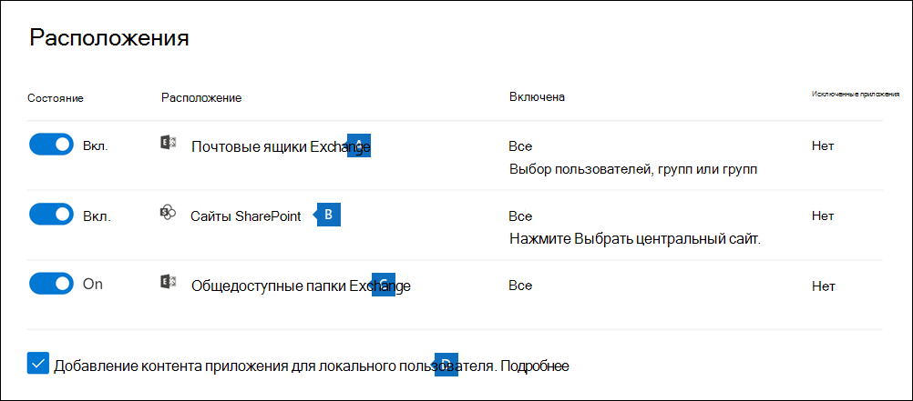
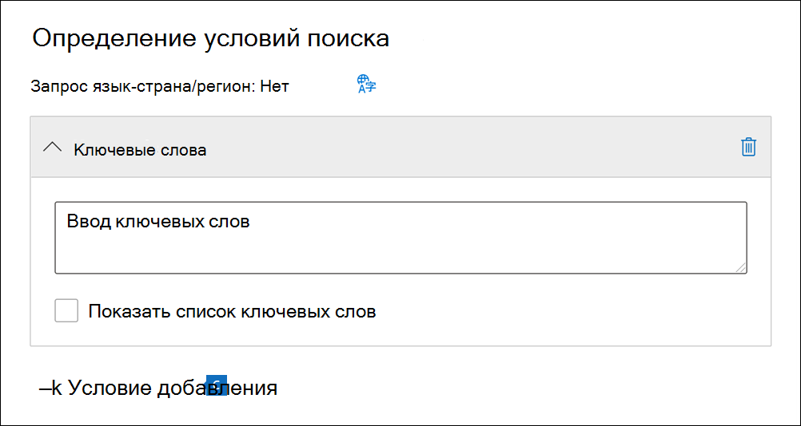

# Создание "Поиска контента"

Средство обнаружения электронных данных "Поиск контента" можно использовать в Центре соответствия требованиям в Microsoft 365 для поиска контента на месте, такого как электронная почта, документы и беседы с мгновенными сообщениями, в организации. Используйте это средство для поиска контента в следующих источниках данных Microsoft 365:
  
- Почтовые ящики Exchange Online.

- Сайты SharePoint Online и учетные записи OneDrive для бизнеса

- Microsoft Teams

- Группы Microsoft 365

- Группы Yammer

После выполнения поиска количество расположений контента и приблизительное число результатов поиска отображаются на всплывающей странице поиска. Можно быстро просмотреть статистику, например расположение контента, в котором есть большинство элементов, соответствующих поисковому запросу. После выполнения поиска можно предварительно просмотреть результаты или экспортировать их на локальный компьютер.

## Создание и запуск поиска

Чтобы получить доступ к странице **Поиск контента** в Центре соответствия требованиям Microsoft 365 (для выполнения поиска содержимого с предварительным просмотром и экспортом результатов), администратор, сотрудник, ответственный за обеспечение соответствия требованиям, или диспетчер по обнаружению электронных данных должны входить в группу ролей "Менеджер по обнаружению электронных данных" в Центре безопасности и соответствия требованиям. Дополнительные сведения см. в статье [Назначение разрешений на обнаружение электронных данных](assign-ediscovery-permissions.md).
  
1. Перейдите на страницу <https://compliance.microsoft.com> и войдите, используя данные учетной записи, для которой назначены соответствующие разрешения.

2. В расположенной слева области Центра соответствия требованиям Microsoft 365 щелкните **Показать все** и выберите **Поиск контента**.

3. На странице **Поиск контента** выберите **Новый поиск**.

   > [!NOTE]
   > Параметр **Поиск по списку идентификаторов** позволяет искать определенные сообщения электронной почты и другие элементы почтового ящика с помощью списка идентификаторов Exchange. Чтобы создать поиск по списку идентификаторов, нужно отправить CSV-файл, в котором указаны конкретные элементы почтового ящика для поиска. Инструкции см. в статье [Подготовка CSV-файла для поиска контента по списку идентификаторов](csv-file-for-an-id-list-content-search.md).

4. Введите название поискового запроса и необязательное описание, помогающее определить его. Название поискового запроса должно быть уникальным в пределах организации.

5. На странице **Расположения** выберите расположения контента, которые необходимо найти. Можно выполнять поиск в почтовых ящиках и общедоступных папках.

    
  
   1. **Почтовые ящики Exchange**: установите переключатель **Вкл.** и нажмите **Выбрать пользователей, группы или команды**, чтобы указать почтовые ящики для удержания. Для поиска почтовых ящиков пользователей и групп рассылки, которые необходимо поставить на удержание (чтобы поставить почтовые ящики членов групп на удержание), воспользуйтесь полем поиска. Вы также можете искать в почтовом ящике, связанном с командой Microsoft (для сообщений канала), группой Office 365 и группой Yammer. Дополнительные сведения о данных приложений, хранимых в почтовых ящиках, см. в разделе [Контент, хранимый в почтовых ящиках для обнаружения электронных данных](what-is-stored-in-exo-mailbox.md).

   2. **Сайты SharePoint**: установите переключатель **Вкл.** и нажмите **Выбрать сайты**, чтобы указать сайты SharePoint и учетные записи OneDrive для удержания. Укажите URL-адрес каждого сайта, который вы хотите поставить на удержание. Вы также можете добавить URL-адрес сайта SharePoint для команды Microsoft, группы Office 365 или группы Yammer.
  
   3. **Общедоступные папки Exchange**: установите переключатель **Вкл.**, чтобы поместить все общедоступные папки в организации Exchange Online на удержание. Вы не можете выбрать определенные общедоступные папки для удержания. Оставьте переключатель выключенным, если вы не хотите помещать на удержание общедоступные папки.
  
   4. Чтобы найти контент Teams для локального пользователя, оставьте этот флажок. Например, если вы проводите поиск по всем почтовым ящикам Exchange в организации и у вас установлен этот параметр, облачное хранилище, используемое для хранения данных чата Teams для локальных пользователей, будет включено в область поиска. Дополнительные сведения см. в статье [Поиск данных в чате Teams для локальных пользователей](search-cloud-based-mailboxes-for-on-premises-users.md).

6. На странице **Определить условия поиска** введите запрос по ключевым словам и при необходимости добавьте условия в поисковый запрос.

   

   1. Укажите ключевые слова или свойства сообщений, например даты отправки и получения, или свойства документов, например имена файлов или дату последнего изменения. Можно создавать более сложные запросы, включающие логические операторы, например **AND**, **OR**, **NOT** и **NEAR**. Если оставить незаполненным поле для ввода ключевых слов, в результаты поиска будет включено все содержимое из указанных расположений контента. Дополнительные сведения см. в статье [Запросы по ключевым словам и условия для обнаружения электронных данных](keyword-queries-and-search-conditions.md).

   2. Кроме того, вы можете установить флажок **Отобразить список ключевых слов** и вводить ключевые слова в каждой строке. В этом случае в создаваемом поисковом запросе ключевые слова из каждой строки будут соединены логическим оператором (**c:s**), аналогичным по функциональности оператору **OR**.

      Зачем использовать список ключевых слов? Вы можете получить статистические сведения о том, сколько элементов соответствует каждому ключевому слову. Это поможет быстро определить, какие ключевые слова наиболее (и наименее) эффективны. В строке можно также использовать ключевую фразу (в скобках). Дополнительные сведения о списках ключевых слов и статистике поиска см. в статье [Получение статистики ключевых слов для результатов поиска](view-keyword-statistics-for-content-search.md#get-keyword-statistics-for-searches).

      > [!NOTE]
      > Чтобы сократить ошибки, связанные с крупными списками ключевых слов, в списке ключевых слов можно указать не более 20 строк.

   3. Вы можете добавить условия поиска, чтобы сузить область поиска и получить более точные результаты. Каждое условие добавляет предложение к поисковому запросу, которое создается и запускается в начале поиска. Условие логически связано с запросом по ключевым словам, указанным в поле для ввода ключевых слов, с помощью логического оператора (**c:c**), аналогичного по функциональности оператору **AND**. Это означает, что элементы попадают в результаты поиска, если соответствуют как запросу по ключевому слову, так и одному или нескольким условиям. Таким образом условия помогают сузить область результатов поиска. Перечень и описание условий, которые можно использовать в поисковом запросе, см. в статье [условия поиска](keyword-queries-and-search-conditions.md#search-conditions).

7. Просмотрите параметры поиска (и при необходимости отредактируете их), а затем отправьте запрос, чтобы начать поиск.
  
Чтобы снова открыть этот поисковый запрос или открыть другие поисковые запросы, перечисленные на странице **Поиск контента**, выберите поисковый запрос и щелкните **Открыть**.
  
## Дальнейшие действия

Ознакомьтесь со списком дальнейших действий, которые необходимо выполнить после создания и запуска поиска контента.

- [Предварительный просмотр результатов поиска](preview-ediscovery-search-results.md)

- [Просмотр статистики для результатов поиска](view-keyword-statistics-for-content-search.md)

- [Экспорт результатов поиска](export-search-results.md)

- [Экспорт отчета о поиске](export-a-content-search-report.md)
