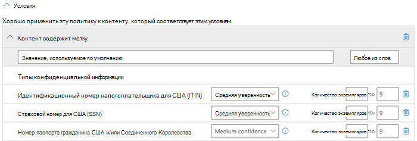
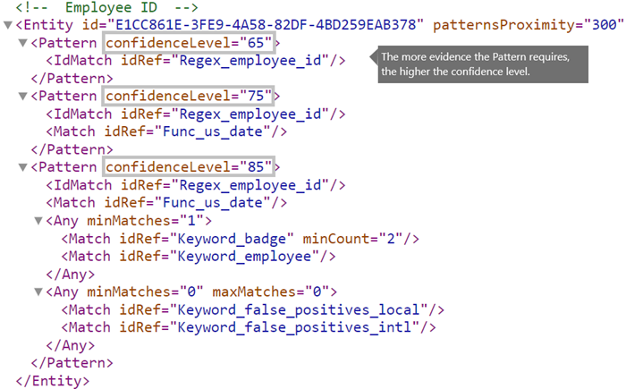

# <a name="create-a-custom-sensitive-information-type-using-powershell"></a><span data-ttu-id="ebc29-103">Создание пользовательского типа конфиденциальной информации с помощью PowerShell</span><span class="sxs-lookup"><span data-stu-id="ebc29-103">Create a custom sensitive information type using PowerShell</span></span>

<span data-ttu-id="ebc29-104">В этой статье показано, как с помощью PowerShell создать файл XML *с пакетом правил*, определяющий собственные пользовательские [ типы конфиденциальных данных](sensitive-information-type-entity-definitions.md).</span><span class="sxs-lookup"><span data-stu-id="ebc29-104">This topic shows you how to use PowerShell to create an XML *rule package* file that defines your own custom [sensitive information types](sensitive-information-type-entity-definitions.md).</span></span> <span data-ttu-id="ebc29-105">Для этого вам нужно уметь составлять регулярные выражения.</span><span class="sxs-lookup"><span data-stu-id="ebc29-105">You need to know how to create a regular expression.</span></span> <span data-ttu-id="ebc29-106">В качестве примера в этой статье определяется пользовательский тип конфиденциальной информации, соответствующий коду сотрудника.</span><span class="sxs-lookup"><span data-stu-id="ebc29-106">As an example, this topic creates a custom sensitive information type that identifies an employee ID.</span></span> <span data-ttu-id="ebc29-107">XML из этого примера можно взять за исходный образец для собственного XML-файла.</span><span class="sxs-lookup"><span data-stu-id="ebc29-107">You can use this example XML as a starting point for your own XML file.</span></span> <span data-ttu-id="ebc29-108">Если вы не знакомы с типами конфиденциальной информации, см. статью [Сведения о типах конфиденциальных данных](sensitive-information-type-learn-about.md).</span><span class="sxs-lookup"><span data-stu-id="ebc29-108">If you are new to sensitive information types, see [Learn about sensitive information types](sensitive-information-type-learn-about.md).</span></span>

<span data-ttu-id="ebc29-p102">Создав XML-документ правильного формата, вы можете отправить его в Microsoft 365 с помощью Microsoft 365 PowerShell. Затем вы сможете использовать этот пользовательский тип конфиденциальных данных в своих политиках и проверить, обнаруживает ли система конфиденциальные данные так, как вы задумали.</span><span class="sxs-lookup"><span data-stu-id="ebc29-p102">After you've created a well-formed XML file, you can upload it to Microsoft 365 by using Microsoft 365 PowerShell. Then you're ready to use your custom sensitive information type in your policies and test that it's detecting the sensitive information as you intended.</span></span>

> [!NOTE]
> <span data-ttu-id="ebc29-111">Если вам не нужно точное управление, предоставляемое PowerShell, вы можете создать пользовательские типы конфиденциальной информации в центре соответствия требованиям.</span><span class="sxs-lookup"><span data-stu-id="ebc29-111">If you don't need the fine grained control that PowerShell provides, you can create custom sensitive information types in the Compliance center.</span></span> <span data-ttu-id="ebc29-112">Дополнительные сведения см. в статье [Создание пользовательского типа конфиденциальной информации](create-a-custom-sensitive-information-type.md).</span><span class="sxs-lookup"><span data-stu-id="ebc29-112">For more information, see [Create a custom sensitive information type](create-a-custom-sensitive-information-type.md).</span></span>

## <a name="important-disclaimer"></a><span data-ttu-id="ebc29-113">Отказ от ответственности</span><span class="sxs-lookup"><span data-stu-id="ebc29-113">Important disclaimer</span></span>

<span data-ttu-id="ebc29-p104"> В связи с разнообразием сред клиентов и требований к соответствию контента служба поддержки Майкрософт не может помочь в определении заданного клиентом соответствия контента, например в определении пользовательских классов или шаблонов регулярных выражений (также называемых RegEx). В вопросах разработки, тестирования и отладки совпадений содержимого пользователям Microsoft 365 придется рассчитывать только на внутренние ИТ-ресурсы. Кроме того, можно использовать внешние консультационные ресурсы, такие как Консультационные службы Майкрософт (MCS). Специалисты службы поддержки могут в некоторой степени помочь настроить функцию, но они не гарантируют, что разработка в области совпадений содержимого будет соответствовать требованиям или обязательствам клиента. Примером такой возможной поддержки может служить предоставление шаблона регулярного выражения для проведения тестирования. В службе поддержки также могут помочь устранить неполадки в уже имеющемся шаблоне, который не срабатывает должным образом в одном конкретном примере сравнения содержимого.</span><span class="sxs-lookup"><span data-stu-id="ebc29-p104">Due to the variances in customer environments and content match requirements, Microsoft Support cannot assist in providing custom content-matching definitions; e.g., defining custom classifications or regular expression (also known as RegEx) patterns. For custom content-matching development, testing, and debugging, Microsoft 365 customers will need to rely upon internal IT resources, or use an external consulting resource such as Microsoft Consulting Services (MCS). Support engineers can provide limited support for the feature, but cannot provide assurances that any custom content-matching development will fulfill the customer's requirements or obligations.  As an example of the type of support that can be provided, sample regular expression patterns may be provided for testing purposes. Or, support can assist with troubleshooting an existing RegEx pattern which is not triggering as expected with a single specific content example.</span></span>

<span data-ttu-id="ebc29-119">См. раздел [Проблемы, которые могут возникнуть при проверке](#potential-validation-issues-to-be-aware-of) в этой статье.</span><span class="sxs-lookup"><span data-stu-id="ebc29-119">See [Potential validation issues to be aware of](#potential-validation-issues-to-be-aware-of) in this topic.</span></span>

<span data-ttu-id="ebc29-120">Дополнительные сведения о модуле Boost.RegEx (прежнее название — RegEx++), который используется для обработки текста, см. на странице [Boost.Regex 5.1.3](https://www.boost.org/doc/libs/1_68_0/libs/regex/doc/html/).</span><span class="sxs-lookup"><span data-stu-id="ebc29-120">For more information about the Boost.RegEx (formerly known as RegEx++) engine that's used for processing the text, see [Boost.Regex 5.1.3](https://www.boost.org/doc/libs/1_68_0/libs/regex/doc/html/).</span></span>

> [!NOTE]
> <span data-ttu-id="ebc29-121">Если вы используете символ ampersand (&) в качестве ключевого слова в настраиваемом типе конфиденциальной информации, обратите внимание, что существует известная проблема.</span><span class="sxs-lookup"><span data-stu-id="ebc29-121">If you use an ampersand character (&) as part of a keyword in your custom sensitive information type, please note that there is a known issue.</span></span> <span data-ttu-id="ebc29-122">Необходимо добавить дополнительный термин с пробелами вокруг символа, чтобы убедиться, что символ правильно идентифицирован, например L & P _не_ L&P.</span><span class="sxs-lookup"><span data-stu-id="ebc29-122">You should add an additional term with spaces around the character to make sure that the character is properly identified, for example, L & P _not_ L&P.</span></span>

## <a name="sample-xml-of-a-rule-package"></a><span data-ttu-id="ebc29-123">Пример XML-файла пакета правил</span><span class="sxs-lookup"><span data-stu-id="ebc29-123">Sample XML of a rule package</span></span>

<span data-ttu-id="ebc29-p106">Вот пример XML-файла пакета правил, который мы создадим в этой статье. Его элементы и атрибуты описаны в разделах ниже.</span><span class="sxs-lookup"><span data-stu-id="ebc29-p106">Here's the sample XML of the rule package that we'll create in this topic. Elements and attributes are explained in the sections below.</span></span>
  
```xml
<?xml version="1.0" encoding="UTF-16"?>
<RulePackage xmlns="http://schemas.microsoft.com/office/2011/mce">
<RulePack id="DAD86A92-AB18-43BB-AB35-96F7C594ADAA">
  <Version build="0" major="1" minor="0" revision="0"/>
  <Publisher id="619DD8C3-7B80-4998-A312-4DF0402BAC04"/>
  <Details defaultLangCode="en-us">
    <LocalizedDetails langcode="en-us">
      <PublisherName>Contoso</PublisherName>
      <Name>Employee ID Custom Rule Pack</Name>
      <Description>
      This rule package contains the custom Employee ID entity.
      </Description>
    </LocalizedDetails>
  </Details>
</RulePack>
<Rules>
<!-- Employee ID -->
  <Entity id="E1CC861E-3FE9-4A58-82DF-4BD259EAB378" patternsProximity="300" recommendedConfidence="75">
    <Pattern confidenceLevel="65">
      <IdMatch idRef="Regex_employee_id"/>
    </Pattern>
    <Pattern confidenceLevel="75">
      <IdMatch idRef="Regex_employee_id"/>
      <Match idRef="Func_us_date"/>
    </Pattern>
    <Pattern confidenceLevel="85">
      <IdMatch idRef="Regex_employee_id"/>
      <Match idRef="Func_us_date"/>
      <Any minMatches="1">
        <Match idRef="Keyword_badge" minCount="2"/>
        <Match idRef="Keyword_employee"/>
      </Any>
      <Any minMatches="0" maxMatches="0">
        <Match idRef="Keyword_false_positives_local"/>
        <Match idRef="Keyword_false_positives_intl"/>
      </Any>
    </Pattern>
  </Entity>
  <Regex id="Regex_employee_id">(\s)(\d{9})(\s)</Regex>
  <Keyword id="Keyword_employee">
    <Group matchStyle="word">
      <Term>Identification</Term>
      <Term>Contoso Employee</Term>
    </Group>
  </Keyword>
  <Keyword id="Keyword_badge">
    <Group matchStyle="string">
      <Term>card</Term>
      <Term>badge</Term>
      <Term caseSensitive="true">ID</Term>
    </Group>
  </Keyword>
  <Keyword id="Keyword_false_positives_local">
    <Group matchStyle="word">
      <Term>credit card</Term>
      <Term>national ID</Term>
    </Group>
  </Keyword>
  <Keyword id="Keyword_false_positives_intl">
    <Group matchStyle="word">
      <Term>identity card</Term>
      <Term>national ID</Term>
      <Term>EU debit card</Term>
    </Group>
  </Keyword>
  <LocalizedStrings>
    <Resource idRef="E1CC861E-3FE9-4A58-82DF-4BD259EAB378">
      <Name default="true" langcode="en-us">Employee ID</Name>
      <Description default="true" langcode="en-us">
      A custom classification for detecting Employee IDs.
      </Description>
      <Description default="false" langcode="de-de">
      Description for German locale.
      </Description>
    </Resource>
  </LocalizedStrings>
</Rules>
</RulePackage>
```

## <a name="what-are-your-key-requirements-rule-entity-pattern-elements"></a><span data-ttu-id="ebc29-p107">Каковы ваши основные требования? [Элементы Rule, Entity, Pattern]</span><span class="sxs-lookup"><span data-stu-id="ebc29-p107">What are your key requirements? [Rule, Entity, Pattern elements]</span></span>

<span data-ttu-id="ebc29-128">Прежде чем приступать к работе, желательно разобраться в базовой структуре схемы XML правила и понять, как с помощью этой структуры определять собственные типы конфиденциальных данных для обнаружения необходимого контента.</span><span class="sxs-lookup"><span data-stu-id="ebc29-128">Before you get started, it's helpful to understand the basic structure of the XML schema for a rule, and how you can use this structure to define your custom sensitive information type so that it will identify the right content.</span></span>
  
<span data-ttu-id="ebc29-p108">Правило определяет одну или несколько сущностей (типов конфиденциальной информации), а каждая сущность — один или несколько шаблонов. Шаблоном называется описание информации, которую политика ищет в содержимом (например, в электронной почте и документах).</span><span class="sxs-lookup"><span data-stu-id="ebc29-p108">A rule defines one or more entities (sensitive information types), and each entity defines one or more patterns. A pattern is what a policy looks for when it evaluates content such as email and documents.</span></span>

<span data-ttu-id="ebc29-p109">В этой статье при обсуждении XML-разметки под правилом подразумеваются шаблоны, которые определяют ту или иную сущность, т. е. тип конфиденциальной информации. Таким образом, встретив в этой статье слово "правило", знайте, что речь идет о сущности или типе конфиденциальной информации, а не об условиях или действиях.</span><span class="sxs-lookup"><span data-stu-id="ebc29-p109">In this topic, the XML markup uses rule to mean the patterns that define an entity, also known as a sensitive information type. So in this topic, when you see rule, think entity or sensitive information type, not conditions and actions.</span></span>
  
### <a name="simplest-scenario-entity-with-one-pattern"></a><span data-ttu-id="ebc29-133">Простейший сценарий: объект с одним шаблоном</span><span class="sxs-lookup"><span data-stu-id="ebc29-133">Simplest scenario: entity with one pattern</span></span>

<span data-ttu-id="ebc29-p110">Рассмотрим простейший сценарий. Предположим, вам требуется с помощью политики выявлять содержимое, в котором фигурирует код сотрудника вашей организации в формате девятизначного числа. Таким образом, под шаблоном понимается содержащееся в правиле регулярное выражение, которое позволяет выявлять девятизначные числа. Любое содержимое, в котором есть девятизначное число, удовлетворяет шаблону.</span><span class="sxs-lookup"><span data-stu-id="ebc29-p110">Here's the simplest scenario. You want your policy to identify content that contains your organization's employee ID, which is formatted as a nine-digit number. So the pattern refers to a regular expression contained in the rule that identifies nine-digit numbers. Any content containing a nine-digit number satisfies the pattern.</span></span>
  

  
<span data-ttu-id="ebc29-139">Из-за своей простоты этот шаблон может часто приводить к ложным срабатываниям, обнаруживая контент, который содержит любые девятизначные числа. Такие числа не всегда являются идентификаторами сотрудников.</span><span class="sxs-lookup"><span data-stu-id="ebc29-139">However, while simple, this pattern may identify many false positives by matching content that contains any nine-digit number that is not necessarily an employee ID.</span></span>
  
### <a name="more-common-scenario-entity-with-multiple-patterns"></a><span data-ttu-id="ebc29-140">Более распространенный сценарий: объект с несколькими шаблонами</span><span class="sxs-lookup"><span data-stu-id="ebc29-140">More common scenario: entity with multiple patterns</span></span>

<span data-ttu-id="ebc29-141">По этой причине для определения объекта чаще используют несколько шаблонов, и эти шаблоны обнаруживают подтверждающие признаки (например, ключевые слова или даты) в дополнение к объекту (например, девятизначному номеру).</span><span class="sxs-lookup"><span data-stu-id="ebc29-141">For this reason, it's more common to define an entity by using more than one pattern, where the patterns identify supporting evidence (such as a keyword or date) in addition to the entity (such as a nine-digit number).</span></span>
  
<span data-ttu-id="ebc29-142">Например, чтобы повысить вероятность обнаружения контента, содержащего идентификатор сотрудника, вы можете определить еще один шаблон, который помимо девятизначного числа обнаруживает дату найма сотрудника на работу либо дату найма и какие-либо ключевые слова (например, "идентификатор сотрудника").</span><span class="sxs-lookup"><span data-stu-id="ebc29-142">For example, to increase the likelihood of identifying content that contains an employee ID, you can define another pattern that also identifies a hire date, and define yet another pattern that identifies both a hire date and a keyword (such as "employee ID"), in addition to the nine-digit number.</span></span>
  

  
<span data-ttu-id="ebc29-144">Обратите внимание на некоторые указанные ниже важные аспекты этой структуры.</span><span class="sxs-lookup"><span data-stu-id="ebc29-144">Note a couple of important aspects of this structure:</span></span>
  
- <span data-ttu-id="ebc29-p111">Шаблоны, требующие наличия дополнительных признаков, имеют более высокий уровень доверия. Это удобно, так как когда вы будете использовать этот тип конфиденциальных данных в политике, вы сможете применять действия с более строгими ограничениями (например, блокировать контент) c помощью одного соответствия с высоким уровнем надежности и действия с не очень строгими ограничениями (например, отправлять уведомления) для соответствий с низким уровнем надежности.</span><span class="sxs-lookup"><span data-stu-id="ebc29-p111">Patterns that require more evidence have a higher confidence level. This is useful because when you later use this sensitive information type in a policy, you can use more restrictive actions (such as block content) with only the higher-confidence matches, and you can use less restrictive actions (such as send notification) with the lower-confidence matches.</span></span>

- <span data-ttu-id="ebc29-p112">Вспомогательные элементы IdMatch и Match ссылаются на регулярные выражения и ключевые слова, которые фактически являются дочерними элементами элемента Rule, а не элемента Pattern. Элемент Pattern ссылается на эти вспомогательные элементы, но они входят в состав элемента Rule. Это означает, что на одно определение вспомогательного элемента, например регулярного выражения или списка ключевых слов, может ссылаться несколько объектов и шаблонов.</span><span class="sxs-lookup"><span data-stu-id="ebc29-p112">The supporting IdMatch and Match elements reference regexes and keywords that are actually children of the Rule element, not the Pattern. These supporting elements are referenced by the Pattern but included in the Rule. This means that a single definition of a supporting element, like a regular expression or a keyword list, can be referenced by multiple entities and patterns.</span></span>

## <a name="what-entity-do-you-need-to-identify-entity-element-id-attribute"></a><span data-ttu-id="ebc29-p113">Какой объект вам необходимо определить? [Элемент Entity, атрибут id]</span><span class="sxs-lookup"><span data-stu-id="ebc29-p113">What entity do you need to identify? [Entity element, id attribute]</span></span>

<span data-ttu-id="ebc29-p114">Объект — это тип конфиденциальной информации, например номер кредитной карты, имеющий правильно определенный шаблон. У каждого объекта имеется уникальный GUID, используемый в качестве идентификатора объекта.</span><span class="sxs-lookup"><span data-stu-id="ebc29-p114">An entity is a sensitive information type, such as a credit card number, that has a well-defined pattern. Each entity has a unique GUID as its ID.</span></span>
  
### <a name="name-the-entity-and-generate-its-guid"></a><span data-ttu-id="ebc29-154">Присваивание объекту имени и создание GUID для него</span><span class="sxs-lookup"><span data-stu-id="ebc29-154">Name the entity and generate its GUID</span></span>

1. <span data-ttu-id="ebc29-155">В выбранном вами редакторе XML-кода добавьте элементы Rules и Entity.</span><span class="sxs-lookup"><span data-stu-id="ebc29-155">In your XML editor of choice, add the Rules and Entity elements.</span></span>
2. <span data-ttu-id="ebc29-p115">Добавьте примечание, содержащее имя созданной вами пользовательской сущности — в нашем примере это Employee ID (код сотрудника). Позже вы добавите имя объекта в раздел локализованных строк, и это имя будет отображаться в пользовательском интерфейсе при создании политики.</span><span class="sxs-lookup"><span data-stu-id="ebc29-p115">Add a comment that contains the name of your custom entity — in this example, Employee ID. Later, you'll add the entity name to the localized strings section, and that name is what appears in the UI when you create a policy.</span></span>
3. <span data-ttu-id="ebc29-158">Затем создайте GUID для элемента Entity.</span><span class="sxs-lookup"><span data-stu-id="ebc29-158">Generate a GUID for your entity.</span></span> <span data-ttu-id="ebc29-159">Существует несколько способов создания GUID, но вы можете легко это сделать в PowerShell, введя **[guid]::NewGuid()**.</span><span class="sxs-lookup"><span data-stu-id="ebc29-159">There are several ways to generate GUIDs, but you can do it easily in PowerShell by typing **[guid]::NewGuid()**.</span></span> <span data-ttu-id="ebc29-160">Позже вы добавите GUID элемента Entity в раздел локализованных строк.</span><span class="sxs-lookup"><span data-stu-id="ebc29-160">Later, you'll also add the entity GUID to the localized strings section.</span></span>
  

  
## <a name="what-pattern-do-you-want-to-match-pattern-element-idmatch-element-regex-element"></a><span data-ttu-id="ebc29-p117">Соответствие какому шаблону необходимо проверять? [Элемент Pattern, элемент IdMatch, элемент Regex]</span><span class="sxs-lookup"><span data-stu-id="ebc29-p117">What pattern do you want to match? [Pattern element, IdMatch element, Regex element]</span></span>

<span data-ttu-id="ebc29-p118">Шаблон содержит список того, для поиска чего следует использовать тип конфиденциальной информации. Он может включать регулярные выражения, ключевые слова и встроенные функции (которые предназначены для различных задач, например они могут выполнять регулярные выражения для поиска дат или адресов). Типы конфиденциальных данных могут иметь несколько шаблонов с уникальными уровнями надежности.</span><span class="sxs-lookup"><span data-stu-id="ebc29-p118">The pattern contains the list of what the sensitive information type is looking for. This can include regexes, keywords, and built-in functions (which perform tasks like running regexes to find dates or addresses). Sensitive information types can have multiple patterns with unique confidences.</span></span>
  
<span data-ttu-id="ebc29-p119">Все указанные ниже шаблоны объединяет то, что они ссылаются на одно и то же регулярное выражение, которое выполняет поиск девятизначного числа (\d{9}) с пробелами в начале и в конце (\s) … (\s). На это регулярное выражение ссылается элемент IdMatch, и оно представляет собой общее требование для всех шаблонов, которые выполняют поиск объекта Employee ID. IdMatch — это идентификатор, соответствие которому пытается найти шаблон, например идентификатор сотрудника, номер кредитной карты или номер социального страхования. У элемента Pattern должен быть строго один элемент IdMatch.</span><span class="sxs-lookup"><span data-stu-id="ebc29-p119">What all of the below patterns have in common is that they all reference the same regular expression, which looks for a nine-digit number (\d{9}) surrounded by white space (\s) … (\s). This regular expression is referenced by the IdMatch element and is the common requirement for all patterns that look for the Employee ID entity. IdMatch is the identifier that the pattern is to trying to match, such as Employee ID or credit card number or social security number. A Pattern element must have exactly one IdMatch element.</span></span>
  

  
<span data-ttu-id="ebc29-p120">Если найдены совпадения с шаблоном, возвращается количество совпадений и значение уровня доверия, которые вы можете использовать для проверки выполнения условий в политике. При выполнении условия шаблон возвращает значения количества и уровня вероятности, которые вы можете использовать в условиях политик. Добавляя условие для обнаружения типа конфиденциальной информации в политику защиты от потери данных, вы можете изменить значения количества и уровня вероятности, как показано на следующей схеме: понятие уровня доверия (другое название — точность совпадения) разъясняется далее в этой статье.</span><span class="sxs-lookup"><span data-stu-id="ebc29-p120">When satisfied, a pattern returns a count and confidence level, which you can use in the conditions in your policy. When you add a condition for detecting a sensitive information type to a policy, you can edit the count and confidence level as shown here. Confidence level (also called match accuracy) is explained later in this topic.</span></span>
  

  
<span data-ttu-id="ebc29-p121">Составляя регулярное выражение, вы должны иметь в виду, что имеется ряд потенциальных проблем, о которых вам следует знать. Например, если вы напишете и отправите регулярное выражение, которое обнаруживает слишком большое количество контента, это может ухудшить производительность. Дополнительные сведения об этих потенциальных проблемах см. в разделе [Проблемы, которые могут возникнуть при проверке](#potential-validation-issues-to-be-aware-of) ниже.</span><span class="sxs-lookup"><span data-stu-id="ebc29-p121">When you create your regular expression, keep in mind that there are potential issues to be aware of. For example, if you write and upload a regex that identifies too much content, this can impact performance. To learn more about these potential issues, see the later section [Potential validation issues to be aware of](#potential-validation-issues-to-be-aware-of).</span></span>
  
## <a name="do-you-want-to-require-additional-evidence-match-element-mincount-attribute"></a><span data-ttu-id="ebc29-p122">Необходимо ли вам требовать дополнительные признаки? [Элемент Match, атрибут minCount]</span><span class="sxs-lookup"><span data-stu-id="ebc29-p122">Do you want to require additional evidence? [Match element, minCount attribute]</span></span>

<span data-ttu-id="ebc29-182">Помимо элемента IdMatch в шаблоне можно использовать элемент Match, чтобы требовать дополнительные подтверждающие признаки, например ключевое слово, регулярное выражение, дату или адрес.</span><span class="sxs-lookup"><span data-stu-id="ebc29-182">In addition to the IdMatch, a pattern can use the Match element to require additional supporting evidence, such as a keyword, regex, date, or address.</span></span>
  
<span data-ttu-id="ebc29-p123">Элемент Pattern может содержать несколько элементов Match. Их можно включить непосредственно в элемент Pattern либо объединить с помощью элемента Any. Для объединения элементов Match используется неявный оператор AND. Чтобы сработал шаблон, должны быть выполнены условия всех элементов Match. Чтобы использовать операторы AND или OR, можно применить элемент Any (более подробные сведения об этом см. в следующем разделе).</span><span class="sxs-lookup"><span data-stu-id="ebc29-p123">A Pattern can include multiple Match elements; they can be included directly in the Pattern element or combined by using the Any element. Match elements are joined by an implicit AND operator; all Match elements must be satisfied for the pattern to be matched. You can use the Any element to introduce AND or OR operators (more on that in a later section).</span></span>
  
<span data-ttu-id="ebc29-p124">С помощью необязательного атрибута minCount вы можете указать количество экземпляров соответствия, которые необходимо найти для каждого элемента Match. Например, вы можете указать, что шаблон срабатывает, только если найдено не менее двух ключевых слов из списка ключевых слов.</span><span class="sxs-lookup"><span data-stu-id="ebc29-p124">You can use the optional minCount attribute to specify how many instances of a match need to be found for each of the Match elements. For example, you can specify that a pattern is satisfied only when at least two keywords from a keyword list are found.</span></span>
  

  
### <a name="keywords-keyword-group-and-term-elements-matchstyle-and-casesensitive-attributes"></a><span data-ttu-id="ebc29-189">Ключевые слова [элементы Keyword, Group и Term, атрибуты matchStyle и caseSensitive]</span><span class="sxs-lookup"><span data-stu-id="ebc29-189">Keywords [Keyword, Group, and Term elements, matchStyle and caseSensitive attributes]</span></span>

<span data-ttu-id="ebc29-p125">При выявлении конфиденциальной информации, например ИД сотрудника, часто требуется искать ключевые слова, служащие дополнительными признаками. Например, помимо девятизначного числа, имеет смысл искать слова наподобие "карта", "значок" или "ИД". Для этого используется элемент Keyword. У элемента Keyword есть атрибут ИД, на который могут ссылаться несколько элементов Match из различных шаблонов или сущностей.</span><span class="sxs-lookup"><span data-stu-id="ebc29-p125">When you identify sensitive information, like an employee ID, you often want to require keywords as corroborative evidence. For example, in addition to matching a nine-digit number, you may want to look for words like "card", "badge", or "ID". To do this, you use the Keyword element. The Keyword element has an ID attribute that can be referenced by multiple Match elements in multiple patterns or entities.</span></span>
  
<span data-ttu-id="ebc29-p126">Ключевые слова добавляют в виде списка элементов Term в элементе Group. У элемента Group есть атрибут matchStyle, который может принимать два указанных ниже значения.</span><span class="sxs-lookup"><span data-stu-id="ebc29-p126">Keywords are included as a list of Term elements in a Group element. The Group element has a matchStyle attribute with two possible values:</span></span>
  
- <span data-ttu-id="ebc29-p127">**matchStyle="word"**. Соответствие word позволяет обнаруживать целые слова с пробелами или другими разделителями слева и справа. Вам всегда следует использовать соответствие word кроме случаев, когда необходимо находить соответствия частям слов или словам в азиатских языках.</span><span class="sxs-lookup"><span data-stu-id="ebc29-p127">**matchStyle="word"** Word match identifies whole words surrounded by white space or other delimiters. You should always use word unless you need to match parts of words or match words in Asian languages.</span></span> 
    
- <span data-ttu-id="ebc29-p128">**matchStyle="string"** Соответствие string позволяет обнаруживать строки независимо от того, какие символы расположены слева и справа от них. Например, строке "кон" будут соответствовать выражения "консул" и "закон". Используйте соответствие string, только если вам необходимо находить соответствия словам на азиатских языках либо если ключевое слово может быть в составе других строк.</span><span class="sxs-lookup"><span data-stu-id="ebc29-p128">**matchStyle="string"** String match identifies strings no matter what they're surrounded by. For example, "id" will match "bid" and "idea". Use string only when you need to match Asian words or if your keyword may be included as part of other strings.</span></span> 
    
<span data-ttu-id="ebc29-201">И, наконец, с помощью атрибута caseSensitive элемента Term вы можете указать, что контент должен точно соответствовать ключевому слову с учетом регистра символов.</span><span class="sxs-lookup"><span data-stu-id="ebc29-201">Finally, you can use the caseSensitive attribute of the Term element to specify that the content must match the keyword exactly, including lower- and upper-case letters.</span></span>
  

  
### <a name="regular-expressions-regex-element"></a><span data-ttu-id="ebc29-203">Регулярные выражения [элемент Regex]</span><span class="sxs-lookup"><span data-stu-id="ebc29-203">Regular expressions [Regex element]</span></span>

<span data-ttu-id="ebc29-p129">В этом примере в объекте идентификатора сотрудника уже используется элемент IdMatch для ссылки на регулярное выражение для шаблона — девятизначное число с пробелами слева и справа. Помимо этого, в шаблоне можно использовать элемент Match для ссылки на дополнительный элемент Regex, чтобы обнаруживать подтверждающие признаки, например пяти- или шестизначные числа в формате почтового индекса США.</span><span class="sxs-lookup"><span data-stu-id="ebc29-p129">In this example, the employee ID entity already uses the IdMatch element to reference a regex for the pattern — a nine-digit number surrounded by whitespace. In addition, a pattern can use a Match element to reference an additional Regex element to identify corroborative evidence, such as a five- or nine-digit number in the format of a US zip code.</span></span>
  
### <a name="additional-patterns-such-as-dates-or-addresses-built-in-functions"></a><span data-ttu-id="ebc29-206">Дополнительные шаблоны, например даты или адреса [встроенные функции]</span><span class="sxs-lookup"><span data-stu-id="ebc29-206">Additional patterns such as dates or addresses [built-in functions]</span></span>

<span data-ttu-id="ebc29-p130">Помимо встроенных типов конфиденциальных данных другие типы конфиденциальных данных могут использовать встроенные функции, которые могут обнаруживать подтверждающие признаки, например даты в формате США, даты в формате ЕС, даты окончания сроков действия или адреса в США. Microsoft 365 не предусматривает возможности добавлять пользовательские функции, но если вы создадите пользовательский тип конфиденциальной информации, то из соответствующей сущности сможете ссылаться на встроенные функции.</span><span class="sxs-lookup"><span data-stu-id="ebc29-p130">In addition to the built-in sensitive information types, sensitive information types can also use built-in functions that can identify corroborative evidence such as a US date, EU date, expiration date, or US address. Microsoft 365 does not support uploading your own custom functions, but when you create a custom sensitive information type, your entity can reference the built-in functions.</span></span>
  
<span data-ttu-id="ebc29-209">Например, на эмблеме с идентификатором сотрудника имеется дата найма сотрудника на работу, поэтому этот пользовательский объект может использовать встроенную функцию `Func_us_date`, чтобы обнаруживать дату в формате, обычно применяемом в США.</span><span class="sxs-lookup"><span data-stu-id="ebc29-209">For example, an employee ID badge has a hire date on it, so this custom entity can use the built-in function  `Func_us_date` to identify a date in the format commonly used in the US.</span></span> 
  
<span data-ttu-id="ebc29-210">Дополнительные сведения см. в статье [Сведения, для обнаружения которых используются функции защиты от потери данных](what-the-dlp-functions-look-for.md).</span><span class="sxs-lookup"><span data-stu-id="ebc29-210">For more information, see [What the DLP functions look for](what-the-dlp-functions-look-for.md).</span></span>
  

  
## <a name="different-combinations-of-evidence-any-element-minmatches-and-maxmatches-attributes"></a><span data-ttu-id="ebc29-212">Различные сочетания признаков [элемент Any, атрибуты minMatches и maxMatches]</span><span class="sxs-lookup"><span data-stu-id="ebc29-212">Different combinations of evidence [Any element, minMatches and maxMatches attributes]</span></span>

<span data-ttu-id="ebc29-p131">В элементе Pattern все элементы IdMatch и Match соединены неявным оператором AND: чтобы сработал шаблон, необходимо, чтобы имели место все совпадения. Тем не менее вы можете создать более гибкую логику совпадений, группируя элементы Match с помощью элемента Any. Например, вы можете использовать элемент Any для соответствия всем, никаким или конкретному подмножеству его дочерних элементов Match.</span><span class="sxs-lookup"><span data-stu-id="ebc29-p131">In a Pattern element, all IdMatch and Match elements are joined by an implicit AND operator — all of the matches must be satisfied before the pattern can be satisfied. However, you can create more flexible matching logic by using the Any element to group Match elements. For example, you can use the Any element to match all, none, or an exact subset of its children Match elements.</span></span>
  
<span data-ttu-id="ebc29-p132">У элемента Any имеется необязательные атрибуты minMatches и maxMatches, с помощью которых вы можете указать, сколько дочерних элементов Match необходимо выполнить, чтобы сработал шаблон. Учтите, что эти атрибуты определяют количество элементов Match, которые необходимо выполнить, а не количество признаков, обнаруженных для соответствий. Чтобы определить минимальное количество экземпляров для определенного совпадения, например два ключевых слова из списка, используйте атрибут minCount для элемента Match (см. выше).</span><span class="sxs-lookup"><span data-stu-id="ebc29-p132">The Any element has optional minMatches and maxMatches attributes that you can use to define how many of the children Match elements must be satisfied before the pattern is matched. Note that these attributes define the number of Match elements that must be satisfied, not the number of instances of evidence found for the matches. To define a minimum number of instances for a specific match, such as two keywords from a list, use the minCount attribute for a Match element (see above).</span></span>
  
### <a name="match-at-least-one-child-match-element"></a><span data-ttu-id="ebc29-219">Совпадение для хотя бы одного дочернего элемента Match</span><span class="sxs-lookup"><span data-stu-id="ebc29-219">Match at least one child Match element</span></span>

<span data-ttu-id="ebc29-p133">Если необходимо, чтобы выполнялось только минимальное количество элементов Match, можно использовать атрибут minMatches. По сути, эти элементы Match соединены неявным оператором OR. Этот элемент Any выполняется при обнаружении даты в формате США или ключевого слова из любого списка.</span><span class="sxs-lookup"><span data-stu-id="ebc29-p133">If you want to require that only a minimum number of Match elements must be met, you can use the minMatches attribute. In effect, these Match elements are joined by an implicit OR operator. This Any element is satisfied if a US-formatted date or a keyword from either list is found.</span></span>

```xml
<Any minMatches="1" >
     <Match idRef="Func_us_date" />
     <Match idRef="Keyword_employee" />
     <Match idRef="Keyword_badge" />
</Any>
```
    
### <a name="match-an-exact-subset-of-any-children-match-elements"></a><span data-ttu-id="ebc29-223">Точное соответствие подмножеству любых дочерних элементов Match</span><span class="sxs-lookup"><span data-stu-id="ebc29-223">Match an exact subset of any children Match elements</span></span>

<span data-ttu-id="ebc29-p134">Если необходимо, чтобы выполнялось строго определенное количество элементов Match, вы можете задать одинаковые значения для элементов minMatches и maxMatches. Этот элемент Any будет выполняться только при обнаружении строго одной даты или одного ключевого слова. При обнаружении нескольких дат или ключевых слов шаблон не сработает.</span><span class="sxs-lookup"><span data-stu-id="ebc29-p134">If you want to require that an exact number of Match elements must be met, you can set minMatches and maxMatches to the same value. This Any element is satisfied only if exactly one date or keyword is found — any more than that, and the pattern won't be matched.</span></span>

```xml
<Any minMatches="1" maxMatches="1" >
     <Match idRef="Func_us_date" />
     <Match idRef="Keyword_employee" />
     <Match idRef="Keyword_badge" />
</Any>
```
  
### <a name="match-none-of-children-match-elements"></a><span data-ttu-id="ebc29-226">Несоответствие никаким дочерним элементам Match</span><span class="sxs-lookup"><span data-stu-id="ebc29-226">Match none of children Match elements</span></span>

<span data-ttu-id="ebc29-p135">Если необходимо, чтобы не выполнялся ни один определенный признак для шаблона, вы можете задать для элементов minMatches и maxMatches значение 0. Это может быть удобно, если у вас есть список ключевых слов либо другой признак, которые, скорее всего, приведут к ложному срабатыванию.</span><span class="sxs-lookup"><span data-stu-id="ebc29-p135">If you want to require the absence of specific evidence for a pattern to be satisfied, you can set both minMatches and maxMatches to 0. This can be useful if you have a keyword list or other evidence that are likely to indicate a false positive.</span></span>
  
<span data-ttu-id="ebc29-p136">Например, объект идентификатора сотрудника выполняет поиск ключевого слова "карта", так как это слово может быть связано с выражением "идентификационная карта". Тем не менее если слово "карта" появляется только во фразе "кредитная карта", то в этом контексте маловероятно, что оно будет означать "идентификационная карта". Поэтому вы можете добавить выражение "кредитная карта" в качестве ключевого слова в список терминов, для которых не должно быть совпадений, чтобы сработал шаблон.</span><span class="sxs-lookup"><span data-stu-id="ebc29-p136">For example, the employee ID entity looks for the keyword "card" because it might refer to an "ID card". However, if card appears only in the phrase "credit card", "card" in this content is unlikely to mean "ID card". So you can add "credit card" as a keyword to a list of terms that you want to exclude from satisfying the pattern.</span></span>
  
```xml
<Any minMatches="0" maxMatches="0" >
    <Match idRef="Keyword_false_positives_local" />
    <Match idRef="Keyword_false_positives_intl" />
</Any>
```

### <a name="match-a-number-of-unique-terms"></a><span data-ttu-id="ebc29-232">Соответствие нескольким уникальным терминам</span><span class="sxs-lookup"><span data-stu-id="ebc29-232">Match a number of unique terms</span></span>

<span data-ttu-id="ebc29-233">Если нужно обеспечить соответствие нескольким уникальными терминам, используйте параметр *uniqueResults*, присвоив ему значение *true*, как показано в следующем примере.</span><span class="sxs-lookup"><span data-stu-id="ebc29-233">If you want to match a number of unique terms, use the *uniqueResults* parameter, set to *true*, as shown in the following example:</span></span>

```xml
<Pattern confidenceLevel="75">
    <IdMatch idRef="Salary_Revision_terms" />
    <Match idRef=" Salary_Revision_ID " minCount="3" uniqueResults="true" />
</Pattern>
```

<span data-ttu-id="ebc29-234">В этом примере определен шаблон для исправления заработной платы с использованием не менее трех уникальных совпадений.</span><span class="sxs-lookup"><span data-stu-id="ebc29-234">In this example, a pattern is defined for salary revision using at least three unique matches.</span></span> 
  
## <a name="how-close-to-the-entity-must-the-other-evidence-be-patternsproximity-attribute"></a><span data-ttu-id="ebc29-p137">Насколько близко к объекту должен находиться другой признак? [Атрибут patternsProximity]</span><span class="sxs-lookup"><span data-stu-id="ebc29-p137">How close to the entity must the other evidence be? [patternsProximity attribute]</span></span>

<span data-ttu-id="ebc29-p138">Ваш тип конфиденциальных данных используется для поиска шаблона, который представляет идентификатор сотрудника, и в рамках этого шаблона также выполняется поиск подтверждающего признака, например ключевого слова "ID". Это логично, так как чем ближе этот признак, тем больше вероятность того, что шаблон окажется реальным идентификатором сотрудника. Вы можете указать, насколько близко должен находиться другой признак в шаблоне к объекту, используя обязательный атрибут patternsProximity элемента Entity.</span><span class="sxs-lookup"><span data-stu-id="ebc29-p138">Your sensitive information type is looking for a pattern that represents an employee ID, and as part of that pattern it's also looking for corroborative evidence like a keyword such as "ID". It makes sense that the closer together this evidence is, the more likely the pattern is to be an actual employee ID. You can determine how close other evidence in the pattern must be to the entity by using the required patternsProximity attribute of the Entity element.</span></span>
  

  
<span data-ttu-id="ebc29-p139">Для каждого шаблона в объекте значение атрибута patternsProximity определяет расстояние (в количестве символов Юникод) от расположения элемента IdMatch для всех остальных элементов Matches, указанных для этого элемента Pattern. Интервал вероятности закрепляется расположением элемента IdMatch, при этом интервал простирается влево и вправо от этого элемента.</span><span class="sxs-lookup"><span data-stu-id="ebc29-p139">For each pattern in the entity, the patternsProximity attribute value defines the distance (in Unicode characters) from the IdMatch location for all other Matches specified for that Pattern. The proximity window is anchored by the IdMatch location, with the window extending to the left and right of the IdMatch.</span></span>
  

  
<span data-ttu-id="ebc29-p140">В примере ниже показано, как интервал вероятности влияет на соответствие шаблону, в котором для элемента IdMatch пользовательского объекта идентификатора сотрудника требуется хотя бы одно подтверждающее соответствие ключевому слову или дате. Срабатывает только соответствие ID1, так как для соответствий ID2 и ID3 не найдено подтверждающих признаков либо найдены частичные подтверждающие признаки в пределах интервала вероятности.</span><span class="sxs-lookup"><span data-stu-id="ebc29-p140">The example below illustrates how the proximity window affects the pattern matching where IdMatch element for the employee ID custom entity requires at least one corroborating match of keyword or date. Only ID1 matches because for ID2 and ID3, either no or only partial corroborating evidence is found within the proximity window.</span></span>
  

  
<span data-ttu-id="ebc29-p141">Обратите внимание, что в случае электронного письма тело сообщения и все вложения обрабатываются как отдельные элементы. Это означает, что интервал вероятности не распространяется за пределы каждого из этих элементов. В каждом элементе (вложении или теле) должен быть и элемент idMatch, и подтверждающий признак.</span><span class="sxs-lookup"><span data-stu-id="ebc29-p141">Note that for email, the message body and each attachment are treated as separate items. This means that the proximity window does not extend beyond the end of each of these items. For each item (attachment or body), both the idMatch and corroborative evidence needs to reside in that item.</span></span>
  
## <a name="what-are-the-right-confidence-levels-for-different-patterns-confidencelevel-attribute-recommendedconfidence-attribute"></a><span data-ttu-id="ebc29-p142">Каков должен быть уровень надежности для различных шаблонов? [Атрибуты confidenceLevel и recommendedConfidence]</span><span class="sxs-lookup"><span data-stu-id="ebc29-p142">What are the right confidence levels for different patterns? [confidenceLevel attribute, recommendedConfidence attribute]</span></span>

<span data-ttu-id="ebc29-p143">Чем больше признаков требуется для шаблона, тем выше уровень надежности обнаружения необходимого объекта (например, идентификатора сотрудника) при срабатывании шаблона. Например, уровень надежности шаблона, для которого требуется девятизначное число идентификатора, дата найма сотрудника на работу и ключевое слово в непосредственной близости, выше уровня надежности шаблона, для которого требуется только девятизначное число идентификатора.</span><span class="sxs-lookup"><span data-stu-id="ebc29-p143">The more evidence that a pattern requires, the more confidence you have that an actual entity (such as employee ID) has been identified when the pattern is matched. For example, you have more confidence in a pattern that requires a nine-digit ID number, hire date, and keyword in close proximity, than you do in a pattern that requires only a nine-digit ID number.</span></span>
  
<span data-ttu-id="ebc29-p144">У элемента Pattern есть обязательный атрибут confidenceLevel. Его значение (целое число от 1 до 100) можно рассматривать как уникальный идентификатор отдельного шаблона в составе сущности: каждому из шаблонов должен быть присвоен свой уровень доверия, уникальный в пределах сущности. Точное значение не играет роли; просто выберите такие числа, которые имеют смысл для вашей группы проверки соблюдения требований. После того как вы добавите свой пользовательский тип конфиденциальной информации и создадите политику, вы сможете ссылаться на эти уровни доверия в условиях создаваемых вами правил.</span><span class="sxs-lookup"><span data-stu-id="ebc29-p144">The Pattern element has a required confidenceLevel attribute. You can think of the value of confidenceLevel (an integer between 1 and 100) as a unique ID for each pattern in an entity — the patterns in an entity must have different confidence levels that you assign. The precise value of the integer doesn't matter — simply pick numbers that make sense to your compliance team. After you upload your custom sensitive information type and then create a policy, you can reference these confidence levels in the conditions of the rules that you create.</span></span>
  

  
<span data-ttu-id="ebc29-259">Помимо атрибута confidenceLevel, у каждого элемента Pattern имеется также атрибут recommendedConfidence.</span><span class="sxs-lookup"><span data-stu-id="ebc29-259">In addition to confidenceLevel for each Pattern, the Entity has a recommendedConfidence attribute.</span></span> <span data-ttu-id="ebc29-260">Его можно рассматривать как уровень доверия по умолчанию для данного правила.</span><span class="sxs-lookup"><span data-stu-id="ebc29-260">The recommended confidence attribute can be thought of as the default confidence level for the rule.</span></span> <span data-ttu-id="ebc29-261">Когда вы создаете правило политики и при этом не указываете для него уровень доверия явным образом, к совпадениям по этому правилу будет применяться рекомендуемый для данной сущности уровень доверия.</span><span class="sxs-lookup"><span data-stu-id="ebc29-261">When you create a rule in a policy, if you don't specify a confidence level for the rule to use, that rule will match based on the recommended confidence level for the entity.</span></span> <span data-ttu-id="ebc29-262">Обратите внимание, что атрибут recommendedConfidence является обязательным для каждого идентификатора объекта в пакете правил. Если он отсутствует, вы не сможете сохранять политики, использующие конфиденциальный тип информации.</span><span class="sxs-lookup"><span data-stu-id="ebc29-262">Please note that the recommendedConfidence attribute is mandatory for each Entity ID in the Rule Package, if missing you won't be able to save policies that use the Sensitive Information Type.</span></span> 
  
## <a name="do-you-want-to-support-other-languages-in-the-ui-of-the-compliance-center-localizedstrings-element"></a><span data-ttu-id="ebc29-p146">Хотите ли вы обеспечить поддержку других языков в пользовательском интерфейсе центра соответствия требованиям? [Элемент LocalizedStrings]</span><span class="sxs-lookup"><span data-stu-id="ebc29-p146">Do you want to support other languages in the UI of the Compliance center? [LocalizedStrings element]</span></span>

<span data-ttu-id="ebc29-p147">Если группа обеспечения соответствия требованиям вашей организации использует центр соответствия требованиям Microsoft 365 для создания политик для различных языковых стандартов и различных языков, вы можете предоставить локализованные версии имени и описания вашего пользовательского типа конфиденциальных данных. При работе с Microsoft 365 на поддерживаемом вами языке члены вашей группы соответствия требованиям будут видеть локализованные имена в пользовательском интерфейсе.</span><span class="sxs-lookup"><span data-stu-id="ebc29-p147">If your compliance team uses the Microsoft 365 Compliance center to create polices policies in different locales and in different languages, you can provide localized versions of the name and description of your custom sensitive information type. When your compliance team uses Microsoft 365 in a language that you support, they'll see the localized name in the UI.</span></span>
  

  
<span data-ttu-id="ebc29-p148">Элемент Rules должен содержать элемент LocalizedStrings, который содержит элемент Resource, ссылающийся на GUID вашего пользовательского объекта. В свою очередь, каждый элемент Resource содержит один или несколько элементов Name и Description, в каждом из которых с помощью атрибута langcode предоставляется локализованная строка для определенного языка.</span><span class="sxs-lookup"><span data-stu-id="ebc29-p148">The Rules element must contain a LocalizedStrings element, which contains a Resource element that references the GUID of your custom entity. In turn, each Resource element contains one or more Name and Description elements that each use the langcode attribute to provide a localized string for a specific language.</span></span>
  

  
<span data-ttu-id="ebc29-p149">Обратите внимание, что локализованные строки определяют только способ отображения пользовательского типа конфиденциальных данных в пользовательском интерфейсе центра соответствия требованиям. Вам не удастся использовать локализованные строки для предоставления различных локализованных версий списка ключевых слов или регулярного выражения.</span><span class="sxs-lookup"><span data-stu-id="ebc29-p149">Note that you use localized strings only for how your custom sensitive information type appears in the UI of the Compliance center. You can't use localized strings to provide different localized versions of a keyword list or regular expression.</span></span>
  
## <a name="other-rule-package-markup-rulepack-guid"></a><span data-ttu-id="ebc29-273">Еще одна разметка пакета правил [GUID RulePack]</span><span class="sxs-lookup"><span data-stu-id="ebc29-273">Other rule package markup [RulePack GUID]</span></span>

<span data-ttu-id="ebc29-p150">В начале каждого элемента RulePackage содержатся общие сведения, которые вам необходимо внести. Вы можете использовать показанную ниже разметку в качестве шаблона и заменить заполнители ". . ." собственной информацией.</span><span class="sxs-lookup"><span data-stu-id="ebc29-p150">Finally, the beginning of each RulePackage contains some general information that you need to fill in. You can use the following markup as a template and replace the ". . ." placeholders with your own info.</span></span>
  
<span data-ttu-id="ebc29-p151">Самое важное — создать GUID для элемента RulePackage. Ранее вы создали GUID для объекта; это второй GUID для элемента RulePackage. Создавать идентификаторы GUID можно несколькими способами, но проще всего это сделать в PowerShell, введя [guid]::NewGuid().</span><span class="sxs-lookup"><span data-stu-id="ebc29-p151">Most importantly, you'll need to generate a GUID for the RulePack. Above, you generated a GUID for the entity; this is a second GUID for the RulePack. There are several ways to generate GUIDs, but you can do it easily in PowerShell by typing [guid]::NewGuid().</span></span>
  
<span data-ttu-id="ebc29-p152">Элемент Version также важен. Когда вы в первый раз отправляете свой пакет правил, Microsoft 365 запоминает номер версии. Если затем вы измените пакет правил и отправите его новую версию, не забудьте изменить номер версии. В противном случае Microsoft 365 не сможет развернуть пакет правил.</span><span class="sxs-lookup"><span data-stu-id="ebc29-p152">The Version element is also important. When you upload your rule package for the first time, Microsoft 365 notes the version number. Later, if you update the rule package and upload a new version, make sure to update the version number or Microsoft 365 won't deploy the rule package.</span></span>
  
```xml
<?xml version="1.0" encoding="utf-16"?>
<RulePackage xmlns="http://schemas.microsoft.com/office/2011/mce">
  <RulePack id=". . .">
    <Version major="1" minor="0" build="0" revision="0" />
    <Publisher id=". . ." /> 
    <Details defaultLangCode=". . .">
      <LocalizedDetails langcode=" . . . ">
         <PublisherName>. . .</PublisherName>
         <Name>. . .</Name>
         <Description>. . .</Description>
      </LocalizedDetails>
    </Details>
  </RulePack>
  
 <Rules>
  . . .
 </Rules>
</RulePackage>

```

<span data-ttu-id="ebc29-285">По завершении этих действий элемент RulePack должен выглядеть, как показано ниже.</span><span class="sxs-lookup"><span data-stu-id="ebc29-285">When complete, your RulePack element should look like this.</span></span>
  


## <a name="validators"></a><span data-ttu-id="ebc29-287">Валидаторы</span><span class="sxs-lookup"><span data-stu-id="ebc29-287">Validators</span></span>

<span data-ttu-id="ebc29-288">Microsoft 365 предоставляет обработчики функций для часто используемых SITs в качестве валидаторов.</span><span class="sxs-lookup"><span data-stu-id="ebc29-288">Microsoft 365 exposes function processors for commonly used SITs as validators.</span></span> <span data-ttu-id="ebc29-289">Вот их список.</span><span class="sxs-lookup"><span data-stu-id="ebc29-289">Here's a list of them.</span></span> 

### <a name="list-of-validators-currently-available"></a><span data-ttu-id="ebc29-290">Список доступных в настоящее время валидаторов</span><span class="sxs-lookup"><span data-stu-id="ebc29-290">List of validators currently available</span></span>

- <span data-ttu-id="ebc29-291">Func_credit_card</span><span class="sxs-lookup"><span data-stu-id="ebc29-291">Func_credit_card</span></span>
- <span data-ttu-id="ebc29-292">Func_ssn</span><span class="sxs-lookup"><span data-stu-id="ebc29-292">Func_ssn</span></span>
- <span data-ttu-id="ebc29-293">Func_unformatted_ssn</span><span class="sxs-lookup"><span data-stu-id="ebc29-293">Func_unformatted_ssn</span></span>
- <span data-ttu-id="ebc29-294">Func_randomized_formatted_ssn</span><span class="sxs-lookup"><span data-stu-id="ebc29-294">Func_randomized_formatted_ssn</span></span>
- <span data-ttu-id="ebc29-295">Func_randomized_unformatted_ssn</span><span class="sxs-lookup"><span data-stu-id="ebc29-295">Func_randomized_unformatted_ssn</span></span>
- <span data-ttu-id="ebc29-296">Func_aba_routing</span><span class="sxs-lookup"><span data-stu-id="ebc29-296">Func_aba_routing</span></span>
- <span data-ttu-id="ebc29-297">Func_south_africa_identification_number</span><span class="sxs-lookup"><span data-stu-id="ebc29-297">Func_south_africa_identification_number</span></span>
- <span data-ttu-id="ebc29-298">Func_brazil_cpf</span><span class="sxs-lookup"><span data-stu-id="ebc29-298">Func_brazil_cpf</span></span>
- <span data-ttu-id="ebc29-299">Func_iban</span><span class="sxs-lookup"><span data-stu-id="ebc29-299">Func_iban</span></span>
- <span data-ttu-id="ebc29-300">Func_brazil_cnpj</span><span class="sxs-lookup"><span data-stu-id="ebc29-300">Func_brazil_cnpj</span></span>
- <span data-ttu-id="ebc29-301">Func_swedish_national_identifier</span><span class="sxs-lookup"><span data-stu-id="ebc29-301">Func_swedish_national_identifier</span></span>
- <span data-ttu-id="ebc29-302">Func_india_aadhaar</span><span class="sxs-lookup"><span data-stu-id="ebc29-302">Func_india_aadhaar</span></span>
- <span data-ttu-id="ebc29-303">Func_uk_nhs_number</span><span class="sxs-lookup"><span data-stu-id="ebc29-303">Func_uk_nhs_number</span></span>
- <span data-ttu-id="ebc29-304">Func_Turkish_National_Id</span><span class="sxs-lookup"><span data-stu-id="ebc29-304">Func_Turkish_National_Id</span></span>
- <span data-ttu-id="ebc29-305">Func_australian_tax_file_number</span><span class="sxs-lookup"><span data-stu-id="ebc29-305">Func_australian_tax_file_number</span></span>
- <span data-ttu-id="ebc29-306">Func_usa_uk_passport</span><span class="sxs-lookup"><span data-stu-id="ebc29-306">Func_usa_uk_passport</span></span>
- <span data-ttu-id="ebc29-307">Func_canadian_sin</span><span class="sxs-lookup"><span data-stu-id="ebc29-307">Func_canadian_sin</span></span>
- <span data-ttu-id="ebc29-308">Func_formatted_itin</span><span class="sxs-lookup"><span data-stu-id="ebc29-308">Func_formatted_itin</span></span>
- <span data-ttu-id="ebc29-309">Func_unformatted_itin</span><span class="sxs-lookup"><span data-stu-id="ebc29-309">Func_unformatted_itin</span></span>
- <span data-ttu-id="ebc29-310">Func_dea_number_v2</span><span class="sxs-lookup"><span data-stu-id="ebc29-310">Func_dea_number_v2</span></span>
- <span data-ttu-id="ebc29-311">Func_dea_number</span><span class="sxs-lookup"><span data-stu-id="ebc29-311">Func_dea_number</span></span>
- <span data-ttu-id="ebc29-312">Func_japanese_my_number_personal</span><span class="sxs-lookup"><span data-stu-id="ebc29-312">Func_japanese_my_number_personal</span></span>
- <span data-ttu-id="ebc29-313">Func_japanese_my_number_corporate</span><span class="sxs-lookup"><span data-stu-id="ebc29-313">Func_japanese_my_number_corporate</span></span>

<span data-ttu-id="ebc29-314">Это позволяет определить собственный regex и проверить их.</span><span class="sxs-lookup"><span data-stu-id="ebc29-314">This gives you the ability to define your own regex and validate them.</span></span> <span data-ttu-id="ebc29-315">Чтобы использовать валидаторы, определите собственный regex и при определении regex используйте свойство валидатора, чтобы добавить обработчик функций по вашему выбору.</span><span class="sxs-lookup"><span data-stu-id="ebc29-315">To use validators, define your own regex and while defining the regex use the validator property to add the function processor of your choice.</span></span> <span data-ttu-id="ebc29-316">После определения можно использовать этот regex в sit.</span><span class="sxs-lookup"><span data-stu-id="ebc29-316">Once defined, you can use this regex in an SIT.</span></span> 

<span data-ttu-id="ebc29-317">В приведенном ниже примере для кредитной Regex_credit_card_AdditionalDelimiters определяется регулярное выражение , которое затем проверяется с помощью функции checksum для кредитной карты с помощью Func_credit_card в качестве валидатора.</span><span class="sxs-lookup"><span data-stu-id="ebc29-317">In the example below, a regular expression - Regex_credit_card_AdditionalDelimiters is defined for Credit card which is then validated using the checksum function for credit card by using Func_credit_card as a validator.</span></span>

```xml
<Regex id="Regex_credit_card_AdditionalDelimiters" validators="Func_credit_card"> (?:^|[\s,;\:\(\)\[\]"'])([0-9]{4}[ -_][0-9]{4}[ -_][0-9]{4}[ -_][0-9]{4})(?:$|[\s,;\:\(\)\[\]"'])</Regex>
<Entity id="675634eb7-edc8-4019-85dd-5a5c1f2bb085" patternsProximity="300" recommendedConfidence="85">
<Pattern confidenceLevel="85">
<IdMatch idRef="Regex_credit_card_AdditionalDelimiters" />
<Any minMatches="1">
<Match idRef="Keyword_cc_verification" />
<Match idRef="Keyword_cc_name" />
<Match idRef="Func_expiration_date" />
</Any>
</Pattern>
</Entity>
```

<span data-ttu-id="ebc29-318">Microsoft 365 предоставляет два общих валидатора</span><span class="sxs-lookup"><span data-stu-id="ebc29-318">Microsoft 365 provides two generic validators</span></span>

### <a name="checksum-validator"></a><span data-ttu-id="ebc29-319">Валидатор проверки</span><span class="sxs-lookup"><span data-stu-id="ebc29-319">Checksum validator</span></span>

<span data-ttu-id="ebc29-320">В этом примере для проверки regex для EmployeeID определяется валидатор проверки для удостоверения сотрудника.</span><span class="sxs-lookup"><span data-stu-id="ebc29-320">In this example, a checksum validator for employee ID is defined to validate the regex for EmployeeID.</span></span>

```xml
<Validators id="EmployeeIDChecksumValidator">
<Validator type="Checksum">
<Param name="Weights">2, 2, 2, 2, 2, 1</Param>
<Param name="Mod">28</Param>
<Param name="CheckDigit">2</Param> <!-- Check 2nd digit -->
<Param name="AllowAlphabets">1</Param> <!— 0 if no Alphabets -->
</Validator>
</Validators>
<Regex id="Regex_EmployeeID" validators="ChecksumValidator">(\d{5}[A-Z])</Regex>
<Entity id="675634eb7-edc8-4019-85dd-5a5c1f2bb085" patternsProximity="300" recommendedConfidence="85">
<Pattern confidenceLevel="85">
<IdMatch idRef="Regex_EmployeeID"/>
</Pattern>
</Entity>
```

### <a name="date-validator"></a><span data-ttu-id="ebc29-321">Валикатор даты</span><span class="sxs-lookup"><span data-stu-id="ebc29-321">Date Validator</span></span>

<span data-ttu-id="ebc29-322">В этом примере для части regex, которая является датой, определяется валидатор дат.</span><span class="sxs-lookup"><span data-stu-id="ebc29-322">In this example, a date validator is defined for a regex part of which is date.</span></span>

```xml
<Validators id="date_validator_1"> <Validator type="DateSimple"> <Param name="Pattern">DDMMYYYY</Param> <!—supported patterns DDMMYYYY, MMDDYYYY, YYYYDDMM, YYYYMMDD, DDMMYYYY, DDMMYY, MMDDYY, YYDDMM, YYMMDD --> </Validator> </Validators>
<Regex id="date_regex_1" validators="date_validator_1">\d{8}</Regex>
```
  
## <a name="changes-for-exchange-online"></a><span data-ttu-id="ebc29-323">Изменения для Exchange Online</span><span class="sxs-lookup"><span data-stu-id="ebc29-323">Changes for Exchange Online</span></span>

<span data-ttu-id="ebc29-p155">Ранее вы могли использовать Exchange Online PowerShell для импорта собственных типов конфиденциальной информации для защиты от потери данных. Теперь такие типы можно использовать в центре администрирования Exchange и центре соответствия требованиям. При этом для импорта собственных типов конфиденциальной информации требуется использовать оболочку PowerShell центра соответствия требованиям: оболочка PowerShell Exchange больше не поддерживается. Пользовательские типы конфиденциальной информации будут работать так же, как раньше, но изменения, внесенные в них в центре соответствия требования, могут быть отражены в центре администрирования Exchange не сразу, а в течение часа.</span><span class="sxs-lookup"><span data-stu-id="ebc29-p155">Previously, you might have used Exchange Online PowerShell to import your custom sensitive information types for DLP. Now your custom sensitive information types can be used in both the Exchange admin center and the Compliance center. As part of this improvement, you should use Compliance center PowerShell to import your custom sensitive information types — you can't import them from the Exchange PowerShell anymore. Your custom sensitive information types will continue to work just like before; however, it may take up to one hour for changes made to custom sensitive information types in the Compliance center to appear in the Exchange admin center.</span></span>
  
<span data-ttu-id="ebc29-328">Обратите внимание, что для отправки пакета правил в центре соответствия требованиям можно использовать командлет **[New-DlpSensitiveInformationTypeRulePackage](/powershell/module/exchange/new-dlpsensitiveinformationtyperulepackage)**.</span><span class="sxs-lookup"><span data-stu-id="ebc29-328">Note that in the Compliance center, you use the **[New-DlpSensitiveInformationTypeRulePackage](/powershell/module/exchange/new-dlpsensitiveinformationtyperulepackage)** cmdlet to upload a rule package.</span></span> <span data-ttu-id="ebc29-329">(Ранее в центре администрирования Exchange использовался командлет **ClassificationRuleCollection**\`.)</span><span class="sxs-lookup"><span data-stu-id="ebc29-329">(Previously, in the Exchange admin center, you used the  **ClassificationRuleCollection**\` cmdlet.)</span></span> 
  
## <a name="upload-your-rule-package"></a><span data-ttu-id="ebc29-330">Отправка пакета правил</span><span class="sxs-lookup"><span data-stu-id="ebc29-330">Upload your rule package</span></span>

<span data-ttu-id="ebc29-331">Чтобы отправить пакет правил, выполните указанные ниже действия.</span><span class="sxs-lookup"><span data-stu-id="ebc29-331">To upload your rule package, do the following steps:</span></span>
  
1. <span data-ttu-id="ebc29-332">Сохраните правило в виде XML-файла с кодировкой Юникод.</span><span class="sxs-lookup"><span data-stu-id="ebc29-332">Save it as an .xml file with Unicode encoding.</span></span>
    
2. [<span data-ttu-id="ebc29-333">Подключение к центру соответствия требованиям PowerShell</span><span class="sxs-lookup"><span data-stu-id="ebc29-333">Connect to Compliance center PowerShell</span></span>](/powershell/exchange/exchange-online-powershell)
    
3. <span data-ttu-id="ebc29-334">Используйте указанный ниже синтаксис.</span><span class="sxs-lookup"><span data-stu-id="ebc29-334">Use the following syntax:</span></span>

   ```powershell
   New-DlpSensitiveInformationTypeRulePackage -FileData (Get-Content -Path "PathToUnicodeXMLFile" -Encoding Byte -ReadCount 0)
   ```

   <span data-ttu-id="ebc29-335">В этом примере выполняется отправка XML-файла с кодировкой Юникод под названием MyNewRulePack.xml из папки C:\My Documents.</span><span class="sxs-lookup"><span data-stu-id="ebc29-335">This example uploads the Unicode XML file named MyNewRulePack.xml from C:\My Documents.</span></span>

   ```powershell
   New-DlpSensitiveInformationTypeRulePackage -FileData (Get-Content -Path "C:\My Documents\MyNewRulePack.xml" -Encoding Byte -ReadCount 0)
   ```

   <span data-ttu-id="ebc29-336">Дополнительные сведения о синтаксисе и параметрах см. в статье [New-DlpSensitiveInformationTypeRulePackage](/powershell/module/exchange/new-dlpsensitiveinformationtyperulepackage).</span><span class="sxs-lookup"><span data-stu-id="ebc29-336">For detailed syntax and parameter information, see [New-DlpSensitiveInformationTypeRulePackage](/powershell/module/exchange/new-dlpsensitiveinformationtyperulepackage).</span></span>

   > [!NOTE]
   > <span data-ttu-id="ebc29-337">Максимальное количество поддерживаемых пакетов правил — 10, но каждый пакет может содержать определение нескольких типов конфиденциальной информации.</span><span class="sxs-lookup"><span data-stu-id="ebc29-337">The maximum number of rule packages supported is 10, but each package can contain the definition of multiple sensitive information types.</span></span>

4. <span data-ttu-id="ebc29-338">Чтобы убедиться, что вы успешно создали новый тип конфиденциальной информации, выполните любое из указанных ниже действий.</span><span class="sxs-lookup"><span data-stu-id="ebc29-338">To verify that you've successfully created a new sensitive information type, do any of the following steps:</span></span>

   - <span data-ttu-id="ebc29-339">Выполните командлет [Get-DlpSensitiveInformationTypeRulePackage](/powershell/module/exchange/get-dlpsensitiveinformationtyperulepackage), чтобы проверить наличие нового пакета правил:</span><span class="sxs-lookup"><span data-stu-id="ebc29-339">Run the [Get-DlpSensitiveInformationTypeRulePackage](/powershell/module/exchange/get-dlpsensitiveinformationtyperulepackage) cmdlet to verify the new rule package is listed:</span></span>

     ```powershell
     Get-DlpSensitiveInformationTypeRulePackage
     ``` 

   - <span data-ttu-id="ebc29-340">Выполните командлет [Get-DlpSensitiveInformationType](/powershell/module/exchange/get-dlpsensitiveinformationtype), чтобы проверить наличие типа конфиденциальных данных:</span><span class="sxs-lookup"><span data-stu-id="ebc29-340">Run the [Get-DlpSensitiveInformationType](/powershell/module/exchange/get-dlpsensitiveinformationtype) cmdlet to verify the sensitive information type is listed:</span></span>

     ```powershell
     Get-DlpSensitiveInformationType
     ``` 

     <span data-ttu-id="ebc29-341">Для пользовательских типов конфиденциальных данных значение свойства Publisher будет отличаться от "Корпорация Майкрософт".</span><span class="sxs-lookup"><span data-stu-id="ebc29-341">For custom sensitive information types, the Publisher property value will be something other than Microsoft Corporation.</span></span>

   - <span data-ttu-id="ebc29-342">Замените \<Name\> значением Name типа конфиденциальных данных (например, Employee ID) и выполните командлет [Get-DlpSensitiveInformationType](/powershell/module/exchange/get-dlpsensitiveinformationtype):</span><span class="sxs-lookup"><span data-stu-id="ebc29-342">Replace \<Name\> with the Name value of the sensitive information type (example: Employee ID) and run the [Get-DlpSensitiveInformationType](/powershell/module/exchange/get-dlpsensitiveinformationtype) cmdlet:</span></span>

     ```powershell
     Get-DlpSensitiveInformationType -Identity "<Name>"
     ```
    
## <a name="potential-validation-issues-to-be-aware-of"></a><span data-ttu-id="ebc29-343">Проблемы, которые могут возникнуть при проверке</span><span class="sxs-lookup"><span data-stu-id="ebc29-343">Potential validation issues to be aware of</span></span>

<span data-ttu-id="ebc29-p157">Когда вы отправляете XML-файл пакета правил, система проверяет XML и ищет известные неправильные фрагменты и очевидные проблемы производительности. Ниже перечислен ряд известных проблем, возникающих при проверке и связанных с регулярными выражениями.</span><span class="sxs-lookup"><span data-stu-id="ebc29-p157">When you upload your rule package XML file, the system validates the XML and checks for known bad patterns and obvious performance issues. Here are some known issues that the validation checks for — a regular expression:</span></span>
  
- <span data-ttu-id="ebc29-346">Выражение не должно начинаться или заканчиваться альтернатором |, который имеет универсальное соответствие, так как он считается пустым совпадением.</span><span class="sxs-lookup"><span data-stu-id="ebc29-346">Cannot begin or end with alternator "|", which matches everything because it's considered an empty match.</span></span>
    
  <span data-ttu-id="ebc29-347">Например, выражения "|a" или "b|" не пройдут проверку.</span><span class="sxs-lookup"><span data-stu-id="ebc29-347">For example, "|a" or "b|" will not pass validation.</span></span>
    
- <span data-ttu-id="ebc29-348">Выражение не должно начинаться или заканчиваться шаблоном ".{0,m}", у которого нет функциональной цели и который только снижает производительность.</span><span class="sxs-lookup"><span data-stu-id="ebc29-348">Cannot begin or end with a ".{0,m}" pattern, which has no functional purpose and only impairs performance.</span></span>
    
  <span data-ttu-id="ebc29-349">Например, выражение ".{0,50}ASDF" или "ASDF.{0,50}" не пройдет проверку.</span><span class="sxs-lookup"><span data-stu-id="ebc29-349">For example, ".{0,50}ASDF" or "ASDF.{0,50}" will not pass validation.</span></span>
    
- <span data-ttu-id="ebc29-350">Выражение не должно содержать фрагменты ".{0,m}" или ".{1,m}" в группах, и в нем не должно быть фрагментов ".\*" или ".+" в группах.</span><span class="sxs-lookup"><span data-stu-id="ebc29-350">Cannot have ".{0,m}" or ".{1,m}" in groups, and cannot have ".\*" or ".+" in groups.</span></span>
    
  <span data-ttu-id="ebc29-351">Например, выражение "(.{0,50000})" не пройдет проверку.</span><span class="sxs-lookup"><span data-stu-id="ebc29-351">For example, "(.{0,50000})" will not pass validation.</span></span>
    
- <span data-ttu-id="ebc29-352">Выражение не должно содержать знаки с повторителями "{0,m}" или "{1,m}" в группах.</span><span class="sxs-lookup"><span data-stu-id="ebc29-352">Cannot have any character with "{0,m}" or "{1,m}" repeaters in groups.</span></span>
    
  <span data-ttu-id="ebc29-353">Например, выражение "(a\*)" не пройдет проверку.</span><span class="sxs-lookup"><span data-stu-id="ebc29-353">For example, "(a\*)" will not pass validation.</span></span>
    
- <span data-ttu-id="ebc29-354">Выражение не должно начинаться с фрагмента ".{1,m}". Вместо него используйте выражение ".".</span><span class="sxs-lookup"><span data-stu-id="ebc29-354">Cannot begin or end with ".{1,m}"; instead, use just "."</span></span>
    
  <span data-ttu-id="ebc29-355">Например, выражение ".{1,m}asdf" не пройдет проверку. Вместо него используйте выражение ".asdf".</span><span class="sxs-lookup"><span data-stu-id="ebc29-355">For example, ".{1,m}asdf" will not pass validation; instead, use just ".asdf".</span></span>
    
- <span data-ttu-id="ebc29-356">В выражении не должно быть неограниченного повторителя (например, "\*" или "+") в группе.</span><span class="sxs-lookup"><span data-stu-id="ebc29-356">Cannot have an unbounded repeater (such as "\*" or "+") on a group.</span></span>
    
  <span data-ttu-id="ebc29-357">Например, выражения "(xx)\*" и "(xx)+" не пройдут проверку.</span><span class="sxs-lookup"><span data-stu-id="ebc29-357">For example, "(xx)\*" and "(xx)+" will not pass validation.</span></span>
  
- <span data-ttu-id="ebc29-358">Длина ключевых слов не должна превышать 50 символов.</span><span class="sxs-lookup"><span data-stu-id="ebc29-358">Keywords have a maximum of 50 characters in Length.</span></span>  <span data-ttu-id="ebc29-359">Если в группе есть ключевое слово, которое превышает это значение, рекомендуется создать группу терминов в виде [словаря ключевых слов](./create-a-keyword-dictionary.md) и ссылаться на его GUID в структуре XML в рамках объекта для поиска совпадения Match или idMatch в файле.</span><span class="sxs-lookup"><span data-stu-id="ebc29-359">If you have a keyword within a Group exceeding this, a suggested solution is to create the Group of terms as a [Keyword Dictionary](./create-a-keyword-dictionary.md) and reference the GUID of the Keyword Dictionary within the XML structure as part of the Entity for Match or idMatch in the file.</span></span>

- <span data-ttu-id="ebc29-360">Каждый настраиваемый тип конфиденциальной информации не должен превышать 2048 ключевых слов.</span><span class="sxs-lookup"><span data-stu-id="ebc29-360">Each Custom Sensitive Information Type can have a maximum of 2048 keywords total.</span></span>

- <span data-ttu-id="ebc29-361">Максимальный размер словаря ключевых слов в одном клиенте составляет 1 МБ в сжатом виде.</span><span class="sxs-lookup"><span data-stu-id="ebc29-361">The maximum size of Keyword Dictionaries in a single tenant is 1 MB compressed.</span></span> <span data-ttu-id="ebc29-362">При создании настраиваемых типов конфиденциальной информации ссылайтесь на один и тот же словарь столько раз, сколько необходимо.</span><span class="sxs-lookup"><span data-stu-id="ebc29-362">Reference the same dictionary as many times as necessary when creating custom sensitive information types.</span></span> <span data-ttu-id="ebc29-363">Начните с создания настраиваемых списков ключевых слов в типе конфиденциальной информации и используйте словари ключевых слов, если в списке ключевых слов их больше чем 2048 или если длина ключевого слова превышает 50 символов.</span><span class="sxs-lookup"><span data-stu-id="ebc29-363">Start with creating custom keyword lists in the sensitive information type and use keyword dictionaries if you have more than 2048 keywords in a keyword list or a keyword is larger than 50 characters in length.</span></span>

- <span data-ttu-id="ebc29-364">В клиенте разрешено использовать не более 50 типов конфиденциальной информации на основе словаря ключевых слов.</span><span class="sxs-lookup"><span data-stu-id="ebc29-364">A maximum of 50 keyword dictionary based sensitive information types are allowed in a tenant.</span></span>

- <span data-ttu-id="ebc29-365">Убедитесь, что каждая сущность элемента содержит атрибут recommendedConfidence.</span><span class="sxs-lookup"><span data-stu-id="ebc29-365">Ensure each Entity element contains a recommendedConfidence attribute.</span></span>

- <span data-ttu-id="ebc29-366">При использовании командлета PowerShell максимальный размер возвращаемых десериализованных данных составляет примерно 1 мегабайт.</span><span class="sxs-lookup"><span data-stu-id="ebc29-366">When using the PowerShell Cmdlet there is a maximum return size of the Deserialized Data of approximately 1 megabyte.</span></span>   <span data-ttu-id="ebc29-367">Это влияет на размер XML-файла пакета правил.</span><span class="sxs-lookup"><span data-stu-id="ebc29-367">This will affect the size of your rule pack XML file.</span></span> <span data-ttu-id="ebc29-368">Не следует превышать рекомендуемый лимит максимального размера загруженного файла (770 мегабайт) для получения стабильных результатов без ошибок при обработке.</span><span class="sxs-lookup"><span data-stu-id="ebc29-368">Keep the uploaded file limited to a 770 kilobyte maximum as a suggested limit for consistent results without error when processing.</span></span>

- <span data-ttu-id="ebc29-369">Структура XML не требует символов форматирования, таких как пробелы, табуляция или записи возврата каретки или перевода строки.</span><span class="sxs-lookup"><span data-stu-id="ebc29-369">The XML structure does not require formatting characters such as spaces, tabs, or carriage return/linefeed entries.</span></span>  <span data-ttu-id="ebc29-370">Обратите внимание на это при оптимизации места для загрузки.</span><span class="sxs-lookup"><span data-stu-id="ebc29-370">Take note of this when optimizing for space on uploads.</span></span> <span data-ttu-id="ebc29-371">Такие инструменты, как Microsoft Visual Code, предоставляют функции линии связи для сжатия XML-файла.</span><span class="sxs-lookup"><span data-stu-id="ebc29-371">Tools such as Microsoft Visual Code provide join line features to compact the XML file.</span></span>
    
<span data-ttu-id="ebc29-372">Если в пользовательском типе конфиденциальных данных имеется проблема, которая может снизить производительность, этот тип не будет отправлен, и, возможно, будет отображено одно из указанных ниже сообщений об ошибке.</span><span class="sxs-lookup"><span data-stu-id="ebc29-372">If a custom sensitive information type contains an issue that may affect performance, it won't be uploaded and you may see one of these error messages:</span></span>
  
- <span data-ttu-id="ebc29-373">**Универсальные квантификаторы, соответствующие большему количеству контента, чем ожидалось (например, +, \*)**</span><span class="sxs-lookup"><span data-stu-id="ebc29-373">**Generic quantifiers which match more content than expected (e.g., '+', '\*')**</span></span>
    
- <span data-ttu-id="ebc29-374">**Окрестные утверждения**</span><span class="sxs-lookup"><span data-stu-id="ebc29-374">**Lookaround assertions**</span></span>
    
- <span data-ttu-id="ebc29-375">**Сочетание сложной группировки с общими квантификаторами**</span><span class="sxs-lookup"><span data-stu-id="ebc29-375">**Complex grouping in conjunction with general quantifiers**</span></span>
    
## <a name="recrawl-your-content-to-identify-the-sensitive-information"></a><span data-ttu-id="ebc29-376">Повторный обход контента для обнаружения конфиденциальных данных</span><span class="sxs-lookup"><span data-stu-id="ebc29-376">Recrawl your content to identify the sensitive information</span></span>

<span data-ttu-id="ebc29-p162">Microsoft 365 использует поисковую программу-обходчик для выявления и классификации конфиденциальной информации в контенте сайта. Повторный обход контента на сайтах SharePoint Online и OneDrive для бизнеса выполняется автоматически при каждом обновлении содержимого. Но для выявления во всем имеющемся контенте элементов, относящихся к новому пользовательскому типу конфиденциальной информации, необходимо заново выполнить его обход.</span><span class="sxs-lookup"><span data-stu-id="ebc29-p162">Microsoft 365 uses the search crawler to identify and classify sensitive information in site content. Content in SharePoint Online and OneDrive for Business sites is recrawled automatically whenever it's updated. But to identify your new custom type of sensitive information in all existing content, that content must be recrawled.</span></span>
  
<span data-ttu-id="ebc29-380">В Microsoft 365 вам не удастся вручную запросить повторный обход всего клиента, но вы можете сделать это для набора сайтов, списка или библиотеки. См. статью [Ручной запрос обхода контента и переиндексации сайта, библиотеки или списка](/sharepoint/crawl-site-content).</span><span class="sxs-lookup"><span data-stu-id="ebc29-380">In Microsoft 365, you can't manually request a recrawl of an entire tenant, but you can do this for a site collection, list, or library — see [Manually request crawling and re-indexing of a site, a library or a list](/sharepoint/crawl-site-content).</span></span>
  
## <a name="reference-rule-package-xml-schema-definition"></a><span data-ttu-id="ebc29-381">Справка: определение схемы XML пакета правил</span><span class="sxs-lookup"><span data-stu-id="ebc29-381">Reference: Rule package XML schema definition</span></span>

<span data-ttu-id="ebc29-382">Вы можете скопировать эту разметку, сохранить ее в виде XSD-файла и использовать для проверки XML-файла пакета правил.</span><span class="sxs-lookup"><span data-stu-id="ebc29-382">You can copy this markup, save it as an XSD file, and use it to validate your rule package XML file.</span></span>
  
```xml
<?xml version="1.0" encoding="utf-8"?>
<xs:schema xmlns:mce="http://schemas.microsoft.com/office/2011/mce"
           targetNamespace="http://schemas.microsoft.com/office/2011/mce"
           xmlns:xs="https://www.w3.org/2001/XMLSchema"
           elementFormDefault="qualified"
           attributeFormDefault="unqualified"
           id="RulePackageSchema">
  <!-- Use include if this schema has the same target namespace as the schema being referenced, otherwise use import -->
  <xs:element name="RulePackage" type="mce:RulePackageType"/>
  <xs:simpleType name="LangType">
    <xs:union memberTypes="xs:language">
      <xs:simpleType>
        <xs:restriction base="xs:string">
          <xs:enumeration value=""/>
        </xs:restriction>
      </xs:simpleType>
    </xs:union>
  </xs:simpleType>
  <xs:simpleType name="GuidType" final="#all">
    <xs:restriction base="xs:token">
      <xs:pattern value="[0-9a-fA-F]{8}\-([0-9a-fA-F]{4}\-){3}[0-9a-fA-F]{12}"/>
    </xs:restriction>
  </xs:simpleType>
  <xs:complexType name="RulePackageType">
    <xs:sequence>
      <xs:element name="RulePack" type="mce:RulePackType"/>
      <xs:element name="Rules" type="mce:RulesType">
        <xs:key name="UniqueRuleId">
          <xs:selector xpath="mce:Entity|mce:Affinity|mce:Version/mce:Entity|mce:Version/mce:Affinity"/>
          <xs:field xpath="@id"/>
        </xs:key>
        <xs:key name="UniqueProcessorId">
          <xs:selector xpath="mce:Regex|mce:Keyword|mce:Fingerprint"></xs:selector>
          <xs:field xpath="@id"/>
        </xs:key>
        <xs:key name="UniqueResourceIdRef">
          <xs:selector xpath="mce:LocalizedStrings/mce:Resource"/>
          <xs:field xpath="@idRef"/>
        </xs:key>
        <xs:keyref name="ReferencedRuleMustExist" refer="mce:UniqueRuleId">
          <xs:selector xpath="mce:LocalizedStrings/mce:Resource"/>
          <xs:field xpath="@idRef"/>
        </xs:keyref>
        <xs:keyref name="RuleMustHaveResource" refer="mce:UniqueResourceIdRef">
          <xs:selector xpath="mce:Entity|mce:Affinity|mce:Version/mce:Entity|mce:Version/mce:Affinity"/>
          <xs:field xpath="@id"/>
        </xs:keyref>
      </xs:element>
    </xs:sequence>
  </xs:complexType>
  <xs:complexType name="RulePackType">
    <xs:sequence>
      <xs:element name="Version" type="mce:VersionType"/>
      <xs:element name="Publisher" type="mce:PublisherType"/>
      <xs:element name="Details" type="mce:DetailsType">
        <xs:key name="UniqueLangCodeInLocalizedDetails">
          <xs:selector xpath="mce:LocalizedDetails"/>
          <xs:field xpath="@langcode"/>
        </xs:key>
        <xs:keyref name="DefaultLangCodeMustExist" refer="mce:UniqueLangCodeInLocalizedDetails">
          <xs:selector xpath="."/>
          <xs:field xpath="@defaultLangCode"/>
        </xs:keyref>
      </xs:element>
      <xs:element name="Encryption" type="mce:EncryptionType" minOccurs="0" maxOccurs="1"/>
    </xs:sequence>
    <xs:attribute name="id" type="mce:GuidType" use="required"/>
  </xs:complexType>
  <xs:complexType name="VersionType">
    <xs:attribute name="major" type="xs:unsignedShort" use="required"/>
    <xs:attribute name="minor" type="xs:unsignedShort" use="required"/>
    <xs:attribute name="build" type="xs:unsignedShort" use="required"/>
    <xs:attribute name="revision" type="xs:unsignedShort" use="required"/>
  </xs:complexType>
  <xs:complexType name="PublisherType">
    <xs:attribute name="id" type="mce:GuidType" use="required"/>
  </xs:complexType>
  <xs:complexType name="LocalizedDetailsType">
    <xs:sequence>
      <xs:element name="PublisherName" type="mce:NameType"/>
      <xs:element name="Name" type="mce:RulePackNameType"/>
      <xs:element name="Description" type="mce:OptionalNameType"/>
    </xs:sequence>
    <xs:attribute name="langcode" type="mce:LangType" use="required"/>
  </xs:complexType>
  <xs:complexType name="DetailsType">
    <xs:sequence>
      <xs:element name="LocalizedDetails" type="mce:LocalizedDetailsType" maxOccurs="unbounded"/>
    </xs:sequence>
    <xs:attribute name="defaultLangCode" type="mce:LangType" use="required"/>
  </xs:complexType>
  <xs:complexType name="EncryptionType">
    <xs:sequence>
      <xs:element name="Key" type="xs:normalizedString"/>
      <xs:element name="IV" type="xs:normalizedString"/>
    </xs:sequence>
  </xs:complexType>
  <xs:simpleType name="RulePackNameType">
    <xs:restriction base="xs:token">
      <xs:minLength value="1"/>
      <xs:maxLength value="64"/>
    </xs:restriction>
  </xs:simpleType>
  <xs:simpleType name="NameType">
    <xs:restriction base="xs:normalizedString">
      <xs:minLength value="1"/>
      <xs:maxLength value="256"/>
    </xs:restriction>
  </xs:simpleType>
  <xs:simpleType name="OptionalNameType">
    <xs:restriction base="xs:normalizedString">
      <xs:minLength value="0"/>
      <xs:maxLength value="256"/>
    </xs:restriction>
  </xs:simpleType>
  <xs:simpleType name="RestrictedTermType">
    <xs:restriction base="xs:string">
      <xs:minLength value="1"/>
      <xs:maxLength value="100"/>
    </xs:restriction>
  </xs:simpleType>
  <xs:complexType name="RulesType">
    <xs:sequence>
      <xs:choice maxOccurs="unbounded">
        <xs:element name="Entity" type="mce:EntityType"/>
        <xs:element name="Affinity" type="mce:AffinityType"/>
        <xs:element name="Version" type="mce:VersionedRuleType"/>
      </xs:choice>
      <xs:choice minOccurs="0" maxOccurs="unbounded">
        <xs:element name="Regex" type="mce:RegexType"/>
        <xs:element name="Keyword" type="mce:KeywordType"/>
        <xs:element name="Fingerprint" type="mce:FingerprintType"/>
        <xs:element name="ExtendedKeyword" type="mce:ExtendedKeywordType"/>
      </xs:choice>
      <xs:element name="LocalizedStrings" type="mce:LocalizedStringsType"/>
    </xs:sequence>
  </xs:complexType>
  <xs:complexType name="EntityType">
    <xs:sequence>
      <xs:element name="Pattern" type="mce:PatternType" maxOccurs="unbounded"/>
      <xs:element name="Version" type="mce:VersionedPatternType" minOccurs="0" maxOccurs="unbounded" />
    </xs:sequence>
    <xs:attribute name="id" type="mce:GuidType" use="required"/>
    <xs:attribute name="patternsProximity" type="mce:ProximityType" use="required"/>
    <xs:attribute name="recommendedConfidence" type="mce:ProbabilityType"/>
    <xs:attribute name="workload" type="mce:WorkloadType"/>
  </xs:complexType>
  <xs:complexType name="PatternType">
    <xs:sequence>
      <xs:element name="IdMatch" type="mce:IdMatchType"/>
      <xs:choice minOccurs="0" maxOccurs="unbounded">
        <xs:element name="Match" type="mce:MatchType"/>
        <xs:element name="Any" type="mce:AnyType"/>
      </xs:choice>
    </xs:sequence>
    <xs:attribute name="confidenceLevel" type="mce:ProbabilityType" use="required"/>
  </xs:complexType>
  <xs:complexType name="AffinityType">
    <xs:sequence>
      <xs:element name="Evidence" type="mce:EvidenceType" maxOccurs="unbounded"/>
      <xs:element name="Version" type="mce:VersionedEvidenceType" minOccurs="0" maxOccurs="unbounded" />
    </xs:sequence>
    <xs:attribute name="id" type="mce:GuidType" use="required"/>
    <xs:attribute name="evidencesProximity" type="mce:ProximityType" use="required"/>
    <xs:attribute name="thresholdConfidenceLevel" type="mce:ProbabilityType" use="required"/>
    <xs:attribute name="workload" type="mce:WorkloadType"/>
  </xs:complexType>
  <xs:complexType name="EvidenceType">
    <xs:sequence>
      <xs:choice maxOccurs="unbounded">
        <xs:element name="Match" type="mce:MatchType"/>
        <xs:element name="Any" type="mce:AnyType"/>
      </xs:choice>
    </xs:sequence>
    <xs:attribute name="confidenceLevel" type="mce:ProbabilityType" use="required"/>
  </xs:complexType>
  <xs:complexType name="IdMatchType">
    <xs:attribute name="idRef" type="xs:string" use="required"/>
  </xs:complexType>
  <xs:complexType name="MatchType">
    <xs:attribute name="idRef" type="xs:string" use="required"/>
    <xs:attribute name="minCount" type="xs:positiveInteger" use="optional"/>
    <xs:attribute name="uniqueResults" type="xs:boolean" use="optional"/>
  </xs:complexType>
  <xs:complexType name="AnyType">
    <xs:sequence>
      <xs:choice maxOccurs="unbounded">
        <xs:element name="Match" type="mce:MatchType"/>
        <xs:element name="Any" type="mce:AnyType"/>
      </xs:choice>
    </xs:sequence>
    <xs:attribute name="minMatches" type="xs:nonNegativeInteger" default="1"/>
    <xs:attribute name="maxMatches" type="xs:nonNegativeInteger" use="optional"/>
  </xs:complexType>
  <xs:simpleType name="ProximityType">
    <xs:union>
      <xs:simpleType>
        <xs:restriction base='xs:string'>
          <xs:enumeration value="unlimited"/>
        </xs:restriction>
      </xs:simpleType>
      <xs:simpleType>
        <xs:restriction base="xs:positiveInteger">
          <xs:minInclusive value="1"/>
        </xs:restriction>
      </xs:simpleType>
    </xs:union>
  </xs:simpleType>
  <xs:simpleType name="ProbabilityType">
    <xs:restriction base="xs:integer">
      <xs:minInclusive value="1"/>
      <xs:maxInclusive value="100"/>
    </xs:restriction>
  </xs:simpleType>
  <xs:simpleType name="WorkloadType">
    <xs:restriction base="xs:string">
      <xs:enumeration value="Exchange"/>
      <xs:enumeration value="Outlook"/>
    </xs:restriction>
  </xs:simpleType>
  <xs:simpleType name="EngineVersionType">
    <xs:restriction base="xs:token">
      <xs:pattern value="^\d{2}\.01?\.\d{3,4}\.\d{1,3}$"/>
    </xs:restriction>
  </xs:simpleType>
  <xs:complexType name="VersionedRuleType">
    <xs:choice maxOccurs="unbounded">
      <xs:element name="Entity" type="mce:EntityType"/>
      <xs:element name="Affinity" type="mce:AffinityType"/>
    </xs:choice>
    <xs:attribute name="minEngineVersion" type="mce:EngineVersionType" use="required" />
  </xs:complexType>
  <xs:complexType name="VersionedPatternType">
    <xs:sequence>
      <xs:element name="Pattern" type="mce:PatternType" maxOccurs="unbounded"/>
    </xs:sequence>
    <xs:attribute name="minEngineVersion" type="mce:EngineVersionType" use="required" />
  </xs:complexType>
  <xs:complexType name="VersionedEvidenceType">
    <xs:sequence>
      <xs:element name="Evidence" type="mce:EvidenceType" maxOccurs="unbounded"/>
    </xs:sequence>
    <xs:attribute name="minEngineVersion" type="mce:EngineVersionType" use="required" />
  </xs:complexType>
  <xs:simpleType name="FingerprintValueType">
    <xs:restriction base="xs:string">
      <xs:minLength value="2732"/>
      <xs:maxLength value="2732"/>
    </xs:restriction>
  </xs:simpleType>
  <xs:complexType name="FingerprintType">
    <xs:simpleContent>
      <xs:extension base="mce:FingerprintValueType">
        <xs:attribute name="id" type="xs:token" use="required"/>
        <xs:attribute name="threshold" type="mce:ProbabilityType" use="required"/>
        <xs:attribute name="shingleCount" type="xs:positiveInteger" use="required"/>
        <xs:attribute name="description" type="xs:string" use="optional"/>
      </xs:extension>
    </xs:simpleContent>
  </xs:complexType>
  <xs:complexType name="RegexType">
    <xs:simpleContent>
      <xs:extension base="xs:string">
        <xs:attribute name="id" type="xs:token" use="required"/>
      </xs:extension>
    </xs:simpleContent>
  </xs:complexType>
  <xs:complexType name="KeywordType">
    <xs:sequence>
      <xs:element name="Group" type="mce:GroupType" maxOccurs="unbounded"/>
    </xs:sequence>
    <xs:attribute name="id" type="xs:token" use="required"/>
  </xs:complexType>
  <xs:complexType name="GroupType">
    <xs:sequence>
      <xs:choice>
        <xs:element name="Term" type="mce:TermType" maxOccurs="unbounded"/>
      </xs:choice>
    </xs:sequence>
    <xs:attribute name="matchStyle" default="word">
      <xs:simpleType>
        <xs:restriction base="xs:NMTOKEN">
          <xs:enumeration value="word"/>
          <xs:enumeration value="string"/>
        </xs:restriction>
      </xs:simpleType>
    </xs:attribute>
  </xs:complexType>
  <xs:complexType name="TermType">
    <xs:simpleContent>
      <xs:extension base="mce:RestrictedTermType">
        <xs:attribute name="caseSensitive" type="xs:boolean" default="false"/>
      </xs:extension>
    </xs:simpleContent>
  </xs:complexType>
  <xs:complexType name="ExtendedKeywordType">
    <xs:simpleContent>
      <xs:extension base="xs:string">
        <xs:attribute name="id" type="xs:token" use="required"/>
      </xs:extension>
    </xs:simpleContent>
  </xs:complexType>
  <xs:complexType name="LocalizedStringsType">
    <xs:sequence>
      <xs:element name="Resource" type="mce:ResourceType" maxOccurs="unbounded">
      <xs:key name="UniqueLangCodeUsedInNamePerResource">
        <xs:selector xpath="mce:Name"/>
        <xs:field xpath="@langcode"/>
      </xs:key>
      <xs:key name="UniqueLangCodeUsedInDescriptionPerResource">
        <xs:selector xpath="mce:Description"/>
        <xs:field xpath="@langcode"/>
      </xs:key>
    </xs:element>
    </xs:sequence>
  </xs:complexType>
  <xs:complexType name="ResourceType">
    <xs:sequence>
      <xs:element name="Name" type="mce:ResourceNameType" maxOccurs="unbounded"/>
      <xs:element name="Description" type="mce:DescriptionType" minOccurs="0" maxOccurs="unbounded"/>
    </xs:sequence>
    <xs:attribute name="idRef" type="mce:GuidType" use="required"/>
  </xs:complexType>
  <xs:complexType name="ResourceNameType">
    <xs:simpleContent>
      <xs:extension base="xs:string">
        <xs:attribute name="default" type="xs:boolean" default="false"/>
        <xs:attribute name="langcode" type="mce:LangType" use="required"/>
      </xs:extension>
    </xs:simpleContent>
  </xs:complexType>
  <xs:complexType name="DescriptionType">
    <xs:simpleContent>
      <xs:extension base="xs:string">
        <xs:attribute name="default" type="xs:boolean" default="false"/>
        <xs:attribute name="langcode" type="mce:LangType" use="required"/>
      </xs:extension>
    </xs:simpleContent>
  </xs:complexType>
</xs:schema>
```

## <a name="more-information"></a><span data-ttu-id="ebc29-383">Дополнительные сведения</span><span class="sxs-lookup"><span data-stu-id="ebc29-383">More information</span></span>

- [<span data-ttu-id="ebc29-384">Сведения о защите от потери данных</span><span class="sxs-lookup"><span data-stu-id="ebc29-384">Learn about data loss prevention</span></span>](dlp-learn-about-dlp.md)

- [<span data-ttu-id="ebc29-385">Определения объектов типов конфиденциальной информации</span><span class="sxs-lookup"><span data-stu-id="ebc29-385">Sensitive information type entity definitions</span></span>](sensitive-information-type-entity-definitions.md)

- [<span data-ttu-id="ebc29-386">Сведения, для обнаружения которых используются функции защиты от потери данных</span><span class="sxs-lookup"><span data-stu-id="ebc29-386">What the DLP functions look for</span></span>](what-the-dlp-functions-look-for.md)
