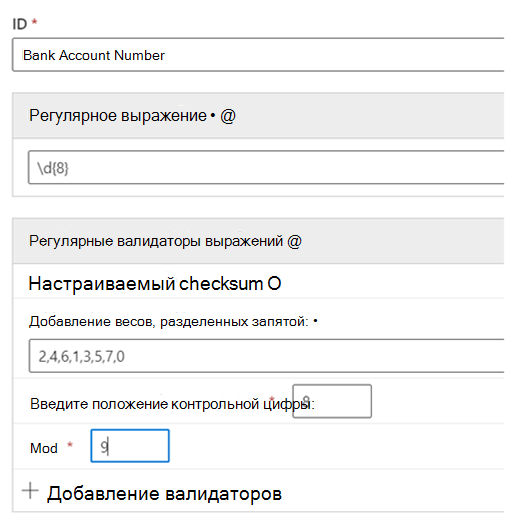

# <a name="get-started-with-custom-sensitive-information-types"></a>Начало работы с пользовательскими типами конфиденциальной информации

Если предварительно настроенные типы конфиденциальной информации не соответствуют вашим требованиям, вы можете создать собственные пользовательские типы либо путем полного их определения, либо путем копирования и последующего изменения одного из предварительно настроенных типов.

Создаваемые таким образом пользовательские типы конфиденциальной информации добавляются в пакет правил `Microsoft.SCCManaged.CustomRulePack`.

Существует два способа создания нового типа конфиденциальной информации:

- [с нуля; в этом случае вы полностью определите все элементы](#create-a-custom-sensitive-information-type)
- [путем копирования и изменения имеющегося типа конфиденциальной информации](#copy-and-modify-a-sensitive-information-type)


## <a name="before-you-begin"></a>Подготовка к работе

- Вам следует ознакомиться с типами конфиденциальной информации и тем, из чего они состоят. См. [дополнительные сведения о типах конфиденциальной информации](sensitive-information-type-learn-about.md). Очень важно понимать роли:
    - [регулярных выражений](https://www.boost.org/doc/libs/1_68_0/libs/regex/doc/html/): типы конфиденциальной информации Microsoft 365 используют модуль Boost.RegEx 5.1.3;
    - списков ключевых слов: вы можете создать собственный список при определении своего типа конфиденциальной информации или выбрать из существующих списков ключевых слов.
    - [словаря ключевых слов](create-a-keyword-dictionary.md)
    - [функций](what-the-dlp-functions-look-for.md)
    - [доверительных уровней](sensitive-information-type-learn-about.md#more-on-confidence-levels)
 
- Чтобы создать, тестировать и развернуть собственный тип конфиденциальной информации с помощью пользовательского интерфейса, необходимы разрешения глобального администратора или администратора соответствия требованиям. См. [сведения о ролях администраторов](/office365/admin/add-users/about-admin-roles) в Office 365.

- У вашей организации должна быть подписка, например на Office 365 корпоративный, включающая защиту от потери данных (DLP). См. статью [Описание политики обмена сообщениями и соответствия требованиям](/office365/servicedescriptions/exchange-online-protection-service-description/messaging-policy-and-compliance-servicedesc). 


> [!IMPORTANT]
> Центр обслуживания клиентов Майкрософт не может оказывать помощь при создании пользовательских категорий или шаблонов регулярных выражений. Инженеры службы поддержки могут оказывать ограниченную поддержку по этой функции, например предоставлять примеры шаблонов регулярных выражений для тестирования или помогать с устранением неполадок имеющегося шаблона, который не срабатывает должным образом, но не могут гарантировать, что то или иное решение для сопоставления контента будет соответствовать вашим требованиям или обязательствам.

## <a name="create-a-custom-sensitive-information-type"></a>Создание пользовательского типа конфиденциальной информации

Выполните указанные ниже действия, чтобы создать новый тип конфиденциальной информации, который полностью определите вы сами. 

1. В Центре соответствия перейдите в раздел **Классификация данных** \> **Типы конфиденциальной информации** и выберите пункт **Создание типа информации**.
2. Заполните значения **Название** и **Описание** и выберите **Далее**.
3. Нажмите кнопку **Создать шаблон**. При определении нового типа конфиденциальной информации вы можете создать несколько шаблонов, каждый со своими элементами и доверительными уровнями.
4. Выберите для шаблона значение доверительного уровня по умолчанию. Используются значения **Низкий доверительный уровень**, **Средний доверительный уровень** и **Высокий доверительный уровень**.
5. Выберите и определите **Основной элемент**.  Основным элементом может быть **регулярное выражение** с необязательным средством проверки, **список ключевых слов**, **словарь ключевых слов** или одна из предварительно настроенных **Функций**. Дополнительные сведения о функциях защиты от потери данных см. в статье [Что ищут функции защиты от потери данных](what-the-dlp-functions-look-for.md). Дополнительные сведения о дате и валидаторах проверки см. в дополнительных сведениях о [регулярных валидаторах выражений.](#more-information-on-regular-expression-validators)
6. Заполните значение **Расстояние между символами**.
7. (Необязательно.) Добавьте вспомогательные элементы, если они есть. Вспомогательными элементами может быть регулярное выражение с необязательным средством проверки, список ключевых слов, словарь ключевых слов или одна из предварительно настроенных функций. Вспомогательные элементы могут иметь собственную конфигурацию **близости символа.** 
8. (Необязательно) Добавьте [**дополнительные проверки**](#more-information-on-additional-checks) из списка доступных проверок.
9. Нажмите кнопку **Создать**.
10. Нажмите кнопку **Далее**.
11. Выберите **рекомендуемый доверительный уровень** для этого типа конфиденциальной информации.
12. Проверьте параметры и нажмите кнопку **Отправить**.

> [!IMPORTANT]
> Microsoft 365 использует поисковую программу-обходчик для выявления и классификации конфиденциальной информации на сайтах SharePoint Online и OneDrive для бизнеса. Для выявления в имеющемся контенте элементов, относящихся к новому пользовательскому типу конфиденциальной информации, необходимо заново выполнить его обход. Обход контента выполняется по расписанию, но вы можете повторно выполнить обход контента вручную для семейства веб-сайтов, списка или библиотеки. Дополнительные сведения см. в статье [Ручной запрос обхода контента и переиндексации сайта, библиотеки или списка](/sharepoint/crawl-site-content).

13. На странице **Классификации данных** вы увидите список всех типов конфиденциальной информации. Выберите пункт **Обновить**, затем воспользуйтесь инструментом поиска, чтобы найти созданный тип конфиденциальной информации, или перейдите к нему самостоятельно.

## <a name="test-a-sensitive-information-type"></a>Тестирование типа конфиденциальной информации

Вы можете протестировать любой тип конфиденциальной информации из списка. Мы рекомендуем тестировать каждый создаваемый вами тип конфиденциальной информации перед его использованием в политике.

1. Приготовьте два файла, например документ Word. В одном документе поместите контент, который соответствует элементам, указанным в вашем типе конфиденциальной информации, а во втором — который не соответствует.
2. В Центре соответствия требованиям перейдите в раздел **Классификации данных** \> **Типы конфиденциальной информации** и выберите из списка тип конфиденциальной информации, чтобы открыть область сведений, а затем нажмите **Тестировать**.
3. Добавьте файл и нажмите кнопку **Тестировать**.
4. На странице **Результаты совпадений** проверьте результаты и нажмите кнопку **Готово**.

## <a name="modify-custom-sensitive-information-types-in-the-compliance-center"></a>Редактирование пользовательских типов конфиденциальной информации в Центре соответствия требованиям

1. В Центре соответствия требованиям перейдите в раздел **Классификация данных** \> **Типы конфиденциальной информации** и выберите из списка тип конфиденциальной информации, который вы хотите редактировать, а затем нажмите **Редактировать**.
2. Вы можете добавить другие шаблоны с уникальными основными и вспомогательными элементами, доверительными уровнями, расстоянием между символами и [**дополнительными проверками**](#more-information-on-additional-checks), а также редактировать либо удалить уже существующие.

## <a name="remove-custom-sensitive-information-types-in-the-compliance-center"></a>Удаление пользовательских типов конфиденциальной информации в Центре соответствия требованиям 

> [!NOTE]
> Удалять можно только пользовательские типы конфиденциальной информации. Удалить встроенный тип невозможно.

> [!IMPORTANT]
> Перед удалением пользовательского типа конфиденциальной информации убедитесь, что политики защиты от потери данных и правила потока обработки почты Exchange (также называемые правилами транспорта) не ссылаются на этот тип.

1. В Центре соответствия требованиям перейдите в раздел **Классификация данных** \> **Типы конфиденциальной информации** и выберите из списка тип конфиденциальной информации, который вы хотите удалить.
2. В открывшемся всплывающем окне нажмите кнопку **Удалить**.

## <a name="copy-and-modify-a-sensitive-information-type"></a>Копирование и изменение типа конфиденциальной информации

Выполните указанные ниже действия, чтобы создать новый тип конфиденциальной информации на основе существующего типа конфиденциальной информации. 

1. В Центре соответствия требованиям перейдите в раздел **Классификация данных** \> **Типы конфиденциальной информации** и выберите тип конфиденциальной информации, который вы хотите скопировать.
2. В открывшемся всплывающем окне нажмите кнопку **Копировать**.
3. Выберите пункт **Обновить** в списке типов конфиденциальной информации, а затем просмотрите или найдите сделанную вами копию. Доступен поиск по частям строк, поэтому вы можете просто искать `copy`, а в результатах поиска будут показаны все типы конфиденциальной информации со словом `copy` в названии. 
4. Заполните значения **Название** и **Описание** и выберите **Далее**.
5. Выберите копию вашего типа конфиденциальной информации и нажмите кнопку **Редактировать**. 
6. Задайте новому типу конфиденциальной информации новое **Название** и добавьте **Описание**
7. Вы можете либо редактировать, либо удалить существующие шаблоны и добавить новые. Выберите доверительный уровень по умолчанию для нового шаблона. Используются значения **Низкий доверительный уровень**, **Средний доверительный уровень** и **Высокий доверительный уровень**.
8. Выберите и определите **Основной элемент**.  Основным элементом может быть **регулярное выражение**, **список ключевых слов**, **словарь ключевых слов** или одна из предварительно настроенных **Функций**. См. статью [Что ищут функции защиты от потери данных](what-the-dlp-functions-look-for.md).
9. Заполните значение **Расстояние между символами**.
10. (Необязательно) Если у вас есть **вспомогательные элементы** или какие-либо [**дополнительные проверки**](#more-information-on-additional-checks), добавьте их. При необходимости вы можете объединить свои **вспомогательные элементы** в группы.
11. Нажмите кнопку **Создать**.
12. Нажмите кнопку **Далее**.
13. Выберите **рекомендуемый доверительный уровень** для этого типа конфиденциальной информации.
14. Проверьте параметры и нажмите кнопку **Отправить**.

Вы также можете создавать пользовательские типы конфиденциальной информации с помощью PowerShell и функций точного совпадения данных. Дополнительные сведения об этих методах см. в следующих статьях:
- [Создание пользовательского типа конфиденциальной информации в PowerShell Центра безопасности и соответствия требованиям](create-a-custom-sensitive-information-type-in-scc-powershell.md)
- [Создание пользовательского типа конфиденциальной информации для защиты от потери данных с помощью точного совпадения данных (EDM)](create-custom-sensitive-information-types-with-exact-data-match-based-classification.md)

## <a name="more-information-on-regular-expression-validators"></a>Дополнительные сведения о регулярных валидаторах выражений

### <a name="checksum-validator"></a>Валидатор проверки

Если необходимо выполнить проверку на цифре в регулярном выражении, можно использовать *валидатор проверки.* Например, необходимо создать SIT для восьмизначного номера лицензии, где последняя цифра — это цифра чека, которая проверяется с помощью вычисления mod 9. Вы настроили алгоритм проверки так:

Сумма = цифра 1 * Вес 1 + цифра 2 * вес 2 + цифра 3 * вес 3 + цифра 4 * вес 4 + цифра 5 * вес 5 + цифра 6 * вес 6 + цифра 7 * вес 7 + цифры 8 * вес 8 Значение Mod = Сумма % 9 Если значение Mod == цифра 8 Номер учетной записи является допустимым, если значение Mod != цифра 8 Учетная запись недействительна

1. Определите основной элемент с помощью этого регулярного выражения:

   ```console
   \d{8}
   ```

2. Затем добавьте валидатор проверки.
3. Добавьте значения веса, разделенные запятой, положение чековой цифры и значение Mod. Дополнительные сведения об операции Modulo см. в сайте [Modulo operation.](https://en.wikipedia.org/wiki/Modulo_operation)

> [!NOTE]
> Если контрольная цифра не входит в расчет checkum, используйте 0 в качестве веса для контрольной цифры. Например, в вышеуказанном случае вес 8 будет равен 0, если чековая цифра не будет использоваться для вычисления чековой цифры.  Modulo_operation).



### <a name="date-validator"></a>Допустимый срок

Если значение даты, встроенное в регулярное выражение, является частью  создаваемого шаблона, вы можете использовать валидатор дат, чтобы проверить, соответствует ли оно вашим критериям. Например, вы хотите создать SIT для девятизначного идентификационный номер сотрудника. Первые шесть цифр — это дата найма в формате DDMMYY, а последние три — случайные числа. Чтобы проверить, что первые шесть цифр находятся в правильном формате.

1. Определите основной элемент с помощью этого регулярного выражения:

   ```console
   \d{9}
   ```

2. Затем добавьте валидатор даты.
3. Выберите формат даты и смещение старта. Так как строка даты — это первые шесть цифр, смещение составляет `0` .


### <a name="functional-processors-as-validators"></a>Функциональные процессоры в качестве валидаторов

В качестве валидаторов можно использовать обработчики функций для некоторых наиболее часто используемых siTs. Это позволяет определить свое собственное регулярное выражение, обеспечивая при этом, чтобы они прошли дополнительные проверки, необходимые sit. Например, Func_India_Aadhar гарантирует, что настроенное обычное выражение, определенное вами, передает логику проверки, необходимую для индийской карты Aadhar. Дополнительные сведения о функциях DLP, которые можно использовать в качестве валидаторов, см. в таблице [What the DLP functions look for.](what-the-dlp-functions-look-for.md#what-the-dlp-functions-look-for) 

### <a name="luhn-check-validator"></a>Валидатор проверки Luhn

Вы можете использовать валидатор проверки Luhn, если у вас есть настраиваемый тип конфиденциальной информации, который включает регулярное выражение, которое должно пройти [алгоритм Luhn](https://en.wikipedia.org/wiki/Luhn_algorithm).

## <a name="more-information-on-additional-checks"></a>Узнать больше о дополнительных проверках

Далее приводятся определения и некоторые примеры доступных дополнительных проверок.

**Исключить определенные совпадения**. Эта проверка позволяет указать ключевые слова, которые нужно исключить при поиске совпадений для редактируемого шаблона. Например, можно исключить образцы номеров кредитных карт, такие как “4111111111111111”, чтобы они не считались настоящими номерами.

**Начинается или не начинается с символов**. Эта проверка позволяет назначить символы, с которых должны (или не должны) начинаться совпадающие элементы. Например, если шаблон должен искать только номера кредитных карт, начинающиеся с 41, 42 или 43, нажмите **Начинается с** и добавьте в список 41, 42 и 43 через запятую. 

**Заканчивается или не заканчивается символами**. Эта проверка позволяет назначить символы, которыми должны (или не должны) заканчиваться совпадающие элементы. Например, если ваш код сотрудника не должен заканчиваться на 0 или 1, нажмите **Не заканчивается на** и добавьте в список 0 и 1 через запятую.

**Исключить повторяющиеся символы**. Эта проверка позволяет игнорировать все совпадения с одинаковыми цифрами. Например, если в шестизначном коде сотрудника должны быть разные цифры, можно выбрать **Исключить повторяющиеся символы** и исключить из списка допустимых кодов сотрудника значения 111111, 222222, 333333, 444444, 555555, 666666, 777777, 888888, 999999 и 000000.

**Включить или исключить префиксы**. Эта проверка позволяет назначить ключевые слова, которые должны (или не должны) присутствовать непосредственно перед совпадающим объектом. В зависимости от выбора объекты с указанными здесь префиксами будут либо выводиться в результатах, либо игнорироваться. Например, если **исключить** префикс **GUID:**, все объекты, перед которыми указано **GUID:**, не считаются совпадениями.

**Включить или исключить суффиксы**. Эта проверка позволяет назначить ключевые слова, которые должны (или не должны) присутствовать непосредственно после совпадающего объекта. В зависимости от выбора объекты с указанными здесь суффиксами будут либо выводиться в результатах, либо игнорироваться. Например, если **исключить** суффикс **:GUID**, любой текст, за которым следует **:GUID**, не считается совпадением.


> [!NOTE]
> Microsoft 365 Защита информации поддерживает языки набора символов с двойным набором byte для:
> - Китайский (упрощенное письмо)
> - Китайский (традиционное письмо)
> - Корейский
> - Японский
>
>Эта поддержка доступна для конфиденциальных типов информации. Дополнительные сведения см. в статье [Заметки о выпуске: поддержка защиты информации для наборов двухбайтовых символов (предварительная версия)](mip-dbcs-relnotes.md).

> [!TIP]
> Чтобы обнаружить шаблоны, содержащие китайские и японские символы и отдельные символы byte, или обнаружить шаблоны, содержащие китайский/японский и английский языки, определите два варианта ключевого слова или regex. Например, чтобы обнаружить ключевое слово типа "机密的document", используйте два варианта ключевого слова; один с пространством между японским и английским текстом, а другой без пространства между японским и английским текстом. Таким образом, ключевые слова, которые будут добавлены в SIT, должны быть "机密的 документа" и "机密的 документов". Аналогичным образом для обнаружения фразы "東京オリ ピ 2020" необходимо использовать два варианта; "東京オリ не ピ 2020 года" и "東京オリ, ピ" ( 2020).
> При создании регекса с использованием дефиса двойного байта или периода двойного байта убедитесь, что оба символа, как один, избегают дефиса или периода в regex. Вот пример regex для справки:
    - (?<!\d) ([4][0-9] {3} \-[?\-t]*[0-9]{4}
> Рекомендуется использовать строковую спичку вместо слова в списке ключевых слов.
