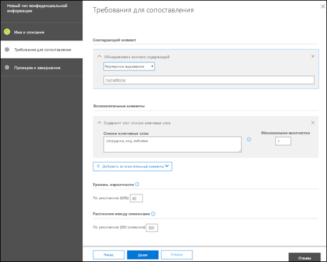

<!-- rename md file to match the display name -->
# Создание пользовательского типа конфиденциальной информации в Центре безопасности и соответствия требованиямCreate a custom sensitive information type in the Security & Compliance Center

Ознакомьтесь с этой статьей, чтобы создать пользовательский тип конфиденциальной информации в Центре безопасности и соответствия требованиям ([https://protection.office.com](https://protection.office.com)).Read this article to create a custom sensitive information type in the Security & Compliance Center ([https://protection.office.com](https://protection.office.com)). Пользовательские типы конфиденциальной информации, создаваемые этим методом, добавляются в пакет правил `Microsoft.SCCManaged.CustomRulePack`.The custom sensitive information types that you create by using this method are added to the rule package named `Microsoft.SCCManaged.CustomRulePack`.

Вы также можете создавать пользовательские типы конфиденциальной информации с помощью PowerShell и функций точного совпадения данных.You can also create custom sensitive information types by using PowerShell and Exact Data Match capabilities. Дополнительные сведения об этих методах см. в следующих статьях:To learn more about those methods, see:
- [Создание пользовательского типа конфиденциальной информации в PowerShell Центра безопасности и соответствия требованиямCreate a custom sensitive information type in Security & Compliance Center PowerShell](create-a-custom-sensitive-information-type-in-scc-powershell.md)
- [Создание пользовательского типа конфиденциальной информации для защиты от потери данных с помощью точного совпадения данных (EDM)Create a custom sensitive information type for DLP with Exact Data Match (EDM)](create-custom-sensitive-information-types-with-exact-data-match-based-classification.md)

> [!NOTE]
> Служба защиты информации Microsoft 365 теперь поддерживает в предварительный версии языки с  	набором двухбайтовых символов:Microsoft 365 Information Protection now  supports in preview double byte character set languages for:
> - Китайский (упрощенное письмо)Chinese (simplified)
> - Китайский (традиционное письмо)Chinese (traditional)
> - КорейскийKorean
> - ЯпонскийJapanese
> 
>Эта предварительная версия доступна только в коммерческом облаке, а развертывание ограничено следующими странами:This preview is only in the commercial cloud and the rollout is limited to:
> - ЯпонияJapan
> - Республика КореяKorea
> - КитайChina
> - Гонконг (САР)Hong Kong
> - Макао (САР)Macau
> - ТайваньTaiwan
>
>Эта поддержка доступна для конфиденциальных типов информации.This support is available for sensitive information types. Дополнительные сведения см. в статье [Заметки о выпуске: поддержка защиты информации для наборов двухбайтовых символов (предварительная версия)](mip-dbcs-relnotes.md).See, [Information protection support for double byte character sets release notes (preview)](mip-dbcs-relnotes.md) for more information.

## Прежде чем начатьBefore you begin

> [!NOTE]
> Чтобы создать, тестировать и развернуть собственный тип конфиденциальной информации с помощью пользовательского интерфейса, необходимы разрешения глобального администратора или администратора соответствия требованиям.You should have Global admin or Compliance admin permissions to create, test, and deploy a custom sensitive information type through the UI. См. [сведения о ролях администраторов](https://docs.microsoft.com/office365/admin/add-users/about-admin-roles?view=o365-worldwide) в Office 365.See [About admin roles](https://docs.microsoft.com/office365/admin/add-users/about-admin-roles?view=o365-worldwide) in Office 365.

- У вашей организации должна быть подписка, например на Office 365 корпоративный, включающая защиту от потери данных (DLP).Your organization must have a subscription, such as Office 365 Enterprise, that includes Data Loss Prevention (DLP). См. статью [Описание политики обмена сообщениями и соответствия требованиям](https://docs.microsoft.com/office365/servicedescriptions/exchange-online-protection-service-description/messaging-policy-and-compliance-servicedesc).See [Messaging Policy and Compliance ServiceDescription](https://docs.microsoft.com/office365/servicedescriptions/exchange-online-protection-service-description/messaging-policy-and-compliance-servicedesc). 

- Для работы с пользовательскими типами конфиденциальной информации вы должны быть знакомы с регулярными выражениями (RegEx). Дополнительные сведения о модуле Boost.RegEx (прежнее название — RegEx++), используемом для обработки текста, см. в статье [Boost.Regex 5.1.3](https://www.boost.org/doc/libs/1_68_0/libs/regex/doc/html/).Custom sensitive information types require familiarity with regular expressions (RegEx). For more information about the Boost.RegEx (formerly known as RegEx++) engine that's used for processing the text, see [Boost.Regex 5.1.3](https://www.boost.org/doc/libs/1_68_0/libs/regex/doc/html/).

  Центр обслуживания клиентов Майкрософт не может оказывать помощь при создании пользовательских категорий или шаблонов регулярных выражений.Microsoft Customer Service & Support can't assist with creating custom classifications or regular expression patterns. Инженеры службы поддержки могут оказывать ограниченную поддержку по этой функции, например предоставлять примеры шаблонов регулярных выражений для тестирования или помогать с устранением неполадок имеющегося шаблона, который не срабатывает должным образом, но не могут гарантировать, что то или иное решение для сопоставления контента будет соответствовать вашим требованиям или обязательствам.Support engineers can provide limited support for the feature, such as, providing sample regular expression patterns for testing purposes, or assisting with troubleshooting an existing regular expression pattern that's not triggering as expected, but can't provide assurances that any custom content-matching development will fulfill your requirements or obligations.

- В службе защиты от потери данных используется агент данных для выявления и классификации конфиденциальной информации на сайтах SharePoint Online и OneDrive для бизнеса.DLP uses the search crawler to identify and classify sensitive information in SharePoint Online and OneDrive for Business sites. Для выявления в имеющемся контенте элементов, относящихся к новому пользовательскому типу конфиденциальной информации, необходимо заново выполнить его обход.To identify your new custom sensitive information type in existing content, the content must be re-crawled. Обход контента выполняется по расписанию, но вы можете повторно выполнить обход контента вручную для семейства веб-сайтов, списка или библиотеки.Content is crawled based on a schedule, but you can manually re-crawl content for a site collection, list, or library. Дополнительные сведения см. в статье [Ручной запрос обхода контента и переиндексации сайта, библиотеки или списка](https://docs.microsoft.com/sharepoint/crawl-site-content).For more information, see [Manually request crawling and re-indexing of a site, a library or a list](https://docs.microsoft.com/sharepoint/crawl-site-content).

## Создание пользовательского типа конфиденциальной информации в Центре безопасности и соответствия требованиямCreate custom sensitive information types in the Security & Compliance Center

В Центре безопасности и соответствия требованиям выберите **Классификации** \> **Типы конфиденциальной информации** и нажмите **Создать**.In the Security & Compliance Center, go to **Classifications** \> **Sensitive info types** and click **Create**.

Параметры не требуют особых пояснений и описываются на соответствующей странице мастера.The settings are fairly self-evident, and are explained on the associate page of the wizard:

- **Имя****Name**

- **Описание****Description**

- **Расстояние****Proximity**

- **Уровень вероятности****Confidence level**

- **Элемент основного шаблона** (ключевые слова, регулярное выражение или словарь)**Primary pattern element** (keywords, regular expression, or dictionary)

- Необязательные **элементы вспомогательного шаблона** (ключевые слова, регулярное выражение или словарь) и соответствующее значение **минимальной стоимости**.Optional **Supporting pattern elements** (keywords, regular expression, or dictionary) and a corresponding **Minimum cost** value.

Предположим, вам нужен пользовательский тип конфиденциальной информации, обнаруживающий в контенте 9-значные номера сотрудников, а также ключевые слова "сотрудник", "ИД" и "бейдж". Чтобы создать этот тип, выполните указанные ниже действия.Here's a scenario: You want a custom sensitive information type that detects 9-digit employee numbers in content, along with the keywords "employee" "ID" and "badge". To create this custom sensitive information type, do the following steps:

1. В Центре безопасности и соответствия требованиям выберите **Классификации** \> **Типы конфиденциальной информации** и нажмите **Создать**.In the Security & Compliance Center, go to **Classifications** \> **Sensitive info types** and click **Create**.

    

2. На открывшейся странице **Выберите имя и описание** введите следующие значения:In the **Choose a name and description** page that opens, enter the following values:

  - **Имя**: "ИД сотрудника".**Name**: Employee ID.

  - **Описание**: "Обнаружение девятизначных кодов сотрудников Contoso".**Description**: Detect nine-digit Contoso employee ID numbers.

    

    По завершении нажмите кнопку **Далее**.When you're finished, click **Next**.

3. На открывшейся странице **Требования для сопоставления** нажмите **Добавить элемент** и настройте указанные ниже параметры.In the **Requirements for matching** page that opens, click **Add an element** configure the following settings:

    - Чтобы настроить **Обнаруживать контент, содержащий**:**Detect content containing**:
 
      Щелкните **Любое из указанных** и выберите **Регулярное выражение**.a. Click **Any of these** and select **Regular expression**.

      В поле регулярного выражения введите `(\s)(\d{9})(\s)` (девятизначное число с пробелами с обеих сторон).b. In the regular expression box, enter `(\s)(\d{9})(\s)` (nine-digit numbers surrounded by white space).
  
    - Чтобы настроить **Вспомогательные элементы**, нажмите **Добавить вспомогательные элементы** и выберите **Содержит этот список ключевых слов**.**Supporting elements**: Click **Add supporting elements** and select **Contains this keyword list**.

    - В открывшейся области **Содержит этот список ключевых слов** настройте указанные ниже параметры.In the **Contains this keyword list** area that appears, configure the following settings:

      - **Список ключевых слов.** Введите следующее значение: сотрудник,ИД,бейдж.**Keyword list**: Enter the following value: employee,ID,badge.

      - **Минимальное количество.** Оставьте значение по умолчанию (1).**Minimum count**: Leave the default value 1.

    - Оставьте для параметра **Уровень вероятности** значение по умолчанию (60).Leave the default **Confidence level** value 60. 

    - Оставьте для параметра **Расстояние между символами** значение по умолчанию (300).Leave the default **Character proximity** value 300.

    

    По завершении нажмите кнопку **Далее**.When you're finished, click **Next**.

4. На открывшейся странице **Проверка и завершение** проверьте параметры и нажмите кнопку **Готово**.On the **Review and finalize** page that opens, review the settings and click **Finish**.

    

5. На следующей странице вам предлагается протестировать новый тип конфиденциальной информации, нажав кнопку **Да**. Дополнительные сведения см. в статье [Тестирование пользовательских типов конфиденциальной информации в Центре безопасности и соответствия требованиям](#test-custom-sensitive-information-types-in-the-security--compliance-center). Чтобы протестировать правило позже, нажмите кнопку **Нет**.The next page encourages you to test the new custom sensitive information type by clicking **Yes**. For more information, see [Test custom sensitive information types in the Security & Compliance Center](#test-custom-sensitive-information-types-in-the-security--compliance-center). To test the rule later, click **No**.

    

### Как убедиться, что все получилось?How do you know this worked?

Чтобы убедиться, что вы успешно создали новый тип конфиденциальной информации, выполните любое из указанных ниже действий.To verify that you've successfully created a new sensitive information type, do any of the following steps:

  - Откройте раздел **Классификации** \> **Типы конфиденциальной информации** и убедитесь, что новый тип присутствует в списке.Go to **Classifications** \> **Sensitive info types** and verify the new custom sensitive information type is listed.

  - Протестируйте новый тип конфиденциальной информации. Дополнительные сведения см. в статье [Тестирование пользовательских типов конфиденциальной информации в Центре безопасности и соответствия требованиям](#test-custom-sensitive-information-types-in-the-security--compliance-center).Test the new custom sensitive information type. For more information, see [Test custom sensitive information types in the Security & Compliance Center](#test-custom-sensitive-information-types-in-the-security--compliance-center).

## Редактирование пользовательских типов конфиденциальной информации в Центре безопасности и соответствия требованиямModify custom sensitive information types in the Security & Compliance Center

**Примечания**.**Notes**:
<!-- check to see if this note contradicts the guidance in "customize a built in sensitive information type customize-a-built-in-sensitive-information-type it sure seems like it does-->
- Редактировать можно только пользовательские типы конфиденциальной информации. Изменить встроенный тип невозможно. Однако вы можете использовать PowerShell, чтобы экспортировать встроенные типы конфиденциальной информации, настроить их и импортировать в качестве пользовательских типов. Дополнительные сведения см. в статье [Настройка встроенных типов конфиденциальной информации](customize-a-built-in-sensitive-information-type.md).You can only modify custom sensitive information types; you can't modify built-in sensitive information types. But you can use PowerShell to export built-in custom sensitive information types, customize them, and import them as custom sensitive information types. For more information, see [Customize a built-in sensitive information type](customize-a-built-in-sensitive-information-type.md).

- Редактировать можно только пользовательские типы конфиденциальной информации, созданные в интерфейсе. Если вы использовали [процедуру PowerShell](create-a-custom-sensitive-information-type-in-scc-powershell.md) для импорта пакета правил с типом пользовательской конфиденциальной информации, появится сообщение об ошибке.You can only modify custom sensitive information types that you created in the UI. If you used the [PowerShell procedure](create-a-custom-sensitive-information-type-in-scc-powershell.md) to import a custom sensitive information type rule package, you'll get an error.

В Центре безопасности и соответствия требованиям откройте раздел **Классификации** \> **Типы конфиденциальной информации**, выберите нужный пользовательский тип и нажмите кнопку **Изменить**.In the Security & Compliance Center, go to **Classifications** \> **Sensitive info types**, select the custom sensitive information type that you want to modify, and then click **Edit**.

  

При этом доступны те же параметры, что и при создании типа конфиденциальной информации в Центре безопасности и соответствия требованиям. Дополнительные сведения см. в статье [Создание пользовательского типа конфиденциальной информации в Центре безопасности и соответствия требованиям](#create-custom-sensitive-information-types-in-the-security--compliance-center).The same options are available here as when you created the custom sensitive information type in the Security & Compliance Center. For more information, see [Create custom sensitive information types in the Security & Compliance Center](#create-custom-sensitive-information-types-in-the-security--compliance-center).

### Как убедиться, что все получилось?How do you know this worked?

Чтобы убедиться, что вы успешно изменили тип конфиденциальной информации, выполните любое из указанных ниже действий.To verify that you've successfully modified a sensitive information type, do any of the following steps:

  - Откройте раздел **Классификации** \> **Типы конфиденциальной информации** и проверьте параметры измененного типа.Go to **Classifications** \> **Sensitive info types** to verify the properties of the modified custom sensitive information type. 

  - Протестируйте измененный тип конфиденциальной информации. Дополнительные сведения см. в статье [Тестирование пользовательских типов конфиденциальной информации в Центре безопасности и соответствия требованиям](#test-custom-sensitive-information-types-in-the-security--compliance-center).Test the modified custom sensitive information type. For more information, see [Test custom sensitive information types in the Security & Compliance Center](#test-custom-sensitive-information-types-in-the-security--compliance-center).

## Удаление пользовательского типа конфиденциальной информации в Центре безопасности и соответствия требованиямRemove custom sensitive information types in the Security & Compliance Center 

**Примечания**:**Notes**:

- Удалять можно только пользовательские типы конфиденциальной информации. Удалить встроенный тип невозможно.You can only remove custom sensitive information types; you can't remove built-in sensitive information types.

- Перед удалением пользовательского типа конфиденциальной информации убедитесь, что политики защиты от потери данных и правила потока обработки почты Exchange (также называемые правилами транспорта) не ссылаются на этот тип.Before your remove a custom sensitive information type, verify that no DLP policies or Exchange mail flow rules (also known as transport rules) still reference the sensitive information type.

1. В Центре безопасности и соответствия требованиям откройте раздел **Классификации** \> **Типы конфиденциальной информации** и выберите один или несколько пользовательских типов.In the Security & Compliance Center, go to **Classifications** \> **Sensitive info types** and select one or more custom sensitive information types that you want to remove.

2. В открывшемся всплывающем окне нажмите **Удалить** (или **Удалить типы конфиденциальной информации**, если выбрано несколько типов).In the fly-out that opens, click **Delete** (or **Delete sensitive info types** if you selected more than one).

    

3. В появившемся предупреждающем сообщении нажмите **Да**.In the warning message that appears, click **Yes**.

### Как убедиться, что все получилось?How do you know this worked?

Чтобы убедиться, что вы успешно удалили пользовательский тип конфиденциальной информации, откройте раздел **Классификации** \> **Типы конфиденциальной информации** и проверьте, исчез ли этот тип из списка.To verify that you've successfully removed a custom sensitive information type, go to **Classifications** \> **Sensitive info types** to verify the custom sensitive information type is no longer listed.

## Тестирование пользовательских типов конфиденциальной информации в Центре безопасности и соответствия требованиямTest custom sensitive information types in the Security & Compliance Center

1. В Центре безопасности и соответствия требованиям выберите **Классификации** \> **Типы конфиденциальной информации**.In the Security & Compliance Center, go to **Classifications** \> **Sensitive info types**.

2. Выберите один или несколько типов конфиденциальной информации. В появившемся всплывающем окне нажмите **Тестировать тип** (или **Тестировать типы конфиденциальной информации**, если выбрано несколько типов).Select one or more custom sensitive information types to test. In the fly-out that opens, click **Test type** (or **Test sensitive info types** if you selected more than one).

    

3. На открывшейся странице **Добавление файла для тестирования** отправьте документ на проверку, перетащив файл или нажав кнопку **Обзор** и выбрав файл.On the **Upload file to test** page that opens, upload a document to test by dragging and dropping a file or by clicking **Browse** and selecting a file.

    

4. Нажмите кнопку **Тестировать**, чтобы проверить документ на совпадения с шаблоном.Click the **Test** button to test the document for pattern matches in the file.

5. На странице **Результаты проверки соответствия** нажмите кнопку **Готово**.On the **Match results** page, click **Finish**.

    
