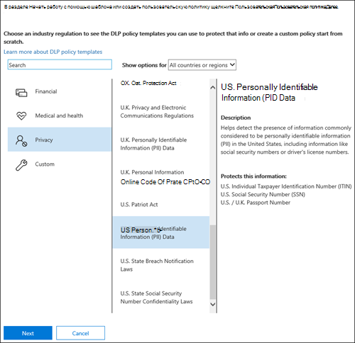
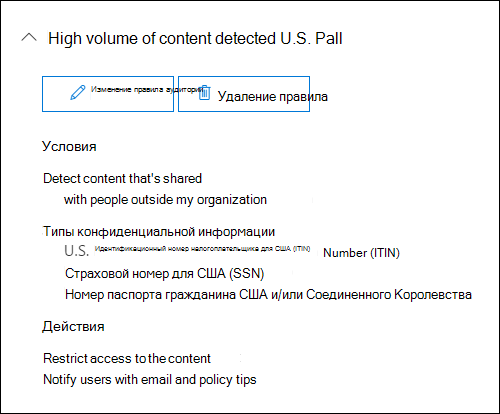
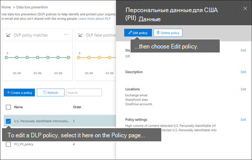

# Создание политики защиты от потери данных на основе шаблонаCreate a DLP policy from a template

Самый простой и распространенный способ приступить к работе с политиками защиты от потери данных — использовать один из шаблонов, включенных в Office 365.The easiest, most common way to get started with DLP policies is to use one of the templates included in Office 365. Вы можете использовать один из этих шаблонов как есть, или настроить правила, чтобы соответствовать определенным требованиям вашей организации.You can use one of these templates as is, or customize the rules to meet your organization's specific compliance requirements.
  
Microsoft 365 содержит более 40 готовых к использованию шаблонов, которые помогут вам удовлетворить широкий спектр общих потребностей в области регулирования и бизнес-политики.Microsoft 365 includes over 40 ready-to-use templates that can help you meet a wide range of common regulatory and business policy needs. Например, имеются шаблоны политик защиты от потери данных для следующих документов:For example, there are DLP policy templates for:
  
- Акт Грэмма-Лича-Блайли (Акт о модернизации финансовой системы 1999 г.)Gramm-Leach-Bliley Act (GLBA)
    
- Отраслевой стандарт защиты данных платежных карт (PCI-DSS)Payment Card Industry Data Security Standard (PCI-DSS)
    
- Законы США о защите персональных данныхUnited States Personally Identifiable Information (U.S. PII)
    
- Закон США о медицинском страховании (HIPAA)United States Health Insurance Act (HIPAA)
    
Вы можете настроить шаблон, изменив любое из существующих правил или добавив новое. Например, вы также можете добавить к правилу новые типы конфиденциальной информации, изменить в нем счетчики, чтобы его было сложнее или проще вызвать, позволить пользователям обходить действия в правиле, предоставив обоснование, или изменить адресатов уведомлений и отчетов об инцидентах. Шаблон политики защиты от потери данных — это отличная отправная точка для многих распространенных сценариев, связанных с соответствием требованиям.You can fine tune a template by modifying any of the existing rules or adding new ones. For example, you can add new types of sensitive information to a rule, modify the counts in a rule to make it harder or easier to trigger, allow people to override the actions in a rule by providing a business justification, or change who notifications and incident reports are sent to. A DLP policy template is a flexible starting point for many common compliance scenarios.
  
Вы также можете выбрать настраиваемый шаблон, который не содержит правил по умолчанию, и настроить политику защиты от потери данных с нуля в соответствии с конкретными требованиями организации.You can also choose the Custom template, which has no default rules, and configure your DLP policy from scratch, to meet the specific compliance requirements for your organization.
  
## Пример. Определение конфиденциальной информации на всех OneDrive для бизнеса и ограничение доступа для людей за пределами организацииExample: Identify sensitive information across all OneDrive for Business sites and restrict access for people outside your organization

OneDrive для бизнеса учетных записей у вас легко работать и обмениваться документами.OneDrive for Business accounts make it easy for people across your organization to collaborate and share documents. Однако обычно сотрудники по соблюдению требований касаются того, что конфиденциальные сведения, хранимые в OneDrive для бизнеса учетных записях, могут случайно делиться с людьми за пределами организации.But a common concern for compliance officers is that sensitive information stored in OneDrive for Business accounts may be inadvertently shared with people outside your organization. Политика защиты от потери данных может помочь снизить этот риск.A DLP policy can help mitigate this risk.
  
В этом примере вы создадите политику DLP, которая идентифицирует данные PII США, включающие индивидуальные идентификационные номера налогоплательщиков (ITIN), номера социального страхования и номера паспортов США.In this example, you'll create a DLP policy that identifies U.S. PII data, which includes Individual Taxpayer Identification Numbers (ITIN), Social Security Numbers, and U.S. passport numbers. Вы начинаете работу с помощью шаблона, а затем измените шаблон, чтобы соответствовать требованиям организации, в частности, вы:You'll get started by using a template, and then you'll modify the template to meet your organization's compliance requirements—specifically, you'll:
  
- Добавьте несколько типов конфиденциальной информации— номера банковских счетов в США и номера водительских прав в США, чтобы политика DLP защищала еще больше конфиденциальных данных.Add a couple of types of sensitive information—U.S. bank account numbers and U.S. driver's license numbers—so that the DLP policy protects even more of your sensitive data.
    
- Сделайте политику более чувствительной, чтобы одного появления конфиденциальной информации было достаточно, чтобы ограничить доступ для внешних пользователей.Make the policy more sensitive, so that a single occurrence of sensitive information is enough to restrict access for external users.
    
- разрешить пользователям обходить действия, предоставив обоснование или сообщив о ложном срабатывании.Allow users to override the actions by providing a business justification or reporting a false positive. Таким образом, политика DLP не будет препятствовать работе людей в организации при условии, что у них есть веские деловые причины для обмена конфиденциальной информацией.This way, your DLP policy won't prevent people in your organization from getting their work done, provided they have a valid business reason for sharing the sensitive information.
    
### Создание политики защиты от потери данных на основе шаблонаCreate a DLP policy from a template

1. Перейдите по ссылке [https://protection.office.com](https://protection.office.com).Go to [https://protection.office.com](https://protection.office.com).
    
2. Выполните вход с помощью рабочей или учебной учетной записи.Sign in using your work or school account. Теперь вы в Центре соответствия &amp; требованиям безопасности.You're now in the Security &amp; Compliance Center.
    
3. В Центре соответствия &amp; требованиям безопасности \> слева навигация Политика \>  \>  \> предотвращения потери данных + Создание политики .In the Security &amp; Compliance Center \> left navigation \> **Data loss prevention** \> **Policy** \> **+ Create a policy**.
    
    
  
4. Выберите шаблон политики DLP, который защищает типы конфиденциальных сведений, необходимых \> **далее.**Choose the DLP policy template that protects the types of sensitive information that you need \> **Next**.
    
    В этом примере вы  выберете данные конфиденциальности США. Персональные данные, идентифицируемые по данным \> **PII,** так как они уже включают большинство типов конфиденциальной информации, которую необходимо защитить, — вы добавите пару позже.In this example, you'll select **Privacy** \> **U.S. Personally Identifiable Information ‎(PII)‎ Data** because it already includes most of the types of sensitive information that you want to protect—you'll add a couple later. 
    
    При выборе шаблона можно прочитать описание справа, чтобы узнать, какие типы конфиденциальной информации защищает шаблон.When you select a template, you can read the description on the right to learn what types of sensitive information the template protects.
    
    
  
5. Назови политику \> **Далее.**Name the policy \> **Next**.
    
6. Чтобы выбрать расположения, которые необходимо защитить от политики DLP, сделайте одно из следующих:To choose the locations that you want the DLP policy to protect, do one of the following:
    
  - Выберите **все расположения в Office 365** \> **Далее**.Choose **All locations in Office 365** \> **Next**.
    
  - Выберите **Позвольте мне выбрать определенные расположения** \> **Далее**.Choose **Let me choose specific locations** \> **Next**. В этом примере выберите этот пример.For this example, choose this.
    
    Чтобы включить или исключить все расположения, такие как Exchange электронной почты  или OneDrive учетных записей, включите или отключите состояние этого расположения.To include or exclude an entire location such as all Exchange email or all OneDrive accounts, switch the **Status** of that location on or off. 
    
    Чтобы включить только конкретные SharePoint сайты или OneDrive для бизнеса учетные записи, включайте статус, а затем щелкните ссылки в статье **Включить,** чтобы выбрать конкретные сайты или учетные записи. To include only specific SharePoint sites or OneDrive for Business accounts, switch the **Status** to on, and then click the links under **Include** to choose specific sites or accounts. Когда вы применяете политику к сайту, настроенные в ней правила автоматически применяются ко всем дочерним сайтам.When you apply a policy to a site, the rules configured in that policy are automatically applied to all subsites of that site. 
    
    
  
    В этом примере для защиты конфиденциальных сведений, хранимых  во  всех учетных записях OneDrive для бизнеса, отключите состояние для сайтов электронной почты Exchange и **SharePoint** и оставьте состояние для OneDrive учетных записей **.** In this example, to protect sensitive information stored in all OneDrive for Business accounts, turn off the **Status** for both **Exchange email** and **SharePoint sites**, and leave the **Status** on for **OneDrive accounts**.
    
7. Выберите **Использование расширенных параметров** \> **Далее**.Choose **Use advanced settings** \> **Next**.
    
8. Шаблон политики защиты от потери данных содержит предопределенные правила с условиями и действиями, которые определяют и обрабатывают определенные типы конфиденциальной информации.A DLP policy template contains predefined rules with conditions and actions that detect and act upon specific types of sensitive information. Вы можете изменить, удалить или отключить все существующие правила или добавить новые.You can edit, delete, or turn off any of the existing rules, or add new ones. После этого нажмите **кнопку Далее**.When done, click **Next**.
    
    
  
    В этом примере шаблон данных PII в США содержит два заранее заранее заданной правила:In this example, the U.S. PII Data template includes two predefined rules:
    
  - **Низкий объем контента, обнаруженного в США piI** Это правило ищет файлы, содержащие от 1 до 10 случаев каждого из трех типов конфиденциальной информации (номера паспортов ITIN, SSN и США), где файлы делятся с людьми за пределами организации.**Low volume of content detected U.S. PII** This rule looks for files containing between 1 and 10 occurrences of each of three types of sensitive information (ITIN, SSN, and U.S. passport numbers), where the files are shared with people outside the organization. При обнаружении правило отправляет уведомление электронной почты основному администратору коллекции сайтов, владельцу документов и человеку, который в последний раз изменил документ.If found, the rule sends an email notification to the primary site collection administrator, document owner, and person who last modified the document. 
    
  - **Высокий объем контента, обнаруженного в США piI** Это правило ищет файлы, содержащие 10 или более случаев каждого из тех же трех типов конфиденциальной информации, где файлы делятся с людьми за пределами организации.**High volume of content detected U.S. PII** This rule looks for files containing 10 or more occurrences of each of the same three sensitive information types, where the files are shared with people outside the organization. При обнаружении это действие также отправляет уведомление по электронной почте, а также ограничивает доступ к файлу.If found, this action also sends an email notification, plus it restricts access to the file. Для контента в OneDrive для бизнеса учетной записи это означает, что разрешения на документ ограничены для всех, кроме основного администратора коллекции сайтов, владельца документа и человека, который в последний раз изменил документ.For content in a OneDrive for Business account, this means that permissions for the document are restricted for everyone except the primary site collection administrator, document owner, and person who last modified the document. 
    
    Чтобы соответствовать определенным требованиям организации, может потребоваться упростить запуск правил, чтобы одного появления конфиденциальной информации было достаточно, чтобы заблокировать доступ для внешних пользователей.To meet your organization's specific requirements, you may want to make the rules easier to trigger, so that a single occurrence of sensitive information is enough to block access for external users. Посмотрев на эти правила, вы поймете, что вам не нужны правила низкой и высокой графы — вам нужно только одно правило, которое блокирует доступ при обнаружении каких-либо конфиденциальных сведений.After looking at these rules, you understand that you don't need low and high count rules—you need only a single rule that blocks access if any occurrence of sensitive information is found.
    
    Таким образом, вы расширяете правило с именем Низкий объем контента, обнаруженного в США **правило удаления PII** \> .So you expand the rule named **Low volume of content detected U.S. PII** \> **Delete rule**.
    
    
  
9. В этом примере необходимо добавить два типа конфиденциальной информации (номера банковских счетов в США и номера водительских прав в США), разрешить пользователям переопределять правило и изменить число на любое происшествие.Now, in this example, you need to add two sensitive information types (U.S. bank account numbers and U.S. driver's license numbers), allow people to override a rule, and change the count to any occurrence. Вы можете сделать все это, редактируете одно правило, поэтому выберите правило редактирования **содержимого** с высоким объемом содержимого, обнаруженного в \> **США.**You can do all of this by editing one rule, so select **High volume of content detected U.S. PII** \> **Edit rule**.
    
    
  
10. Чтобы добавить тип конфиденциальной информации, в разделе **Условия** \> **добавьте или измените типы.**To add a sensitive information type, in the **Conditions** section \> **Add or change types**. Затем в **соответствии со** типами Добавить или изменить выберите Добавить выберите номер банковского счета в США и номер лицензии водителя в США \>  \>   \> **Добавить** \> **готово**.Then, under **Add or change types** \> choose **Add** \> select **U.S. Bank Account Number** and **U.S. Driver's License Number** \> **Add** \> **Done**.
    
    
  
    
  
11. Чтобы изменить число (количество экземпляров конфиденциальной информации, необходимой для запуска правила), в графе **Экземпляр** выберите значение min для каждого типа \> ввода  \> 1.To change the count (the number of instances of sensitive information required to trigger the rule), under **Instance count** \> choose the **min** value for each type \> enter 1. Минимальное количество не может быть пустым.The minimum count cannot be empty. Максимальное количество может быть пустым; пустое **максимальное** значение преобразования **в любое**.The maximum count can be empty; an empty **max** value convert to **any**.
    
    По завершению количество минут для всех типов конфиденциальной информации должно быть **1,** а максимальное количество должно быть **любым**.When finished, the min count for all of the sensitive information types should be **1** and the max count should be **any**. Другими словами, любое появление такого типа конфиденциальной информации удовлетворит это условие.In other words, any occurrence of this type of sensitive information will satisfy this condition.
    
    
  
12. Для окончательной настройки не нужно, чтобы политики DLP не блокировали работу людей, если у них есть допустимые бизнес-обоснования или они сталкиваются с ложным срабатывательным срабатывательными данными, поэтому необходимо, чтобы уведомление пользователя включало параметры для переопределения действия блокировки.For the final customization, you don't want your DLP policies to block people from doing their work when they have a valid business justification or encounter a false positive, so you want the user notification to include options to override the blocking action.
    
    В разделе **Уведомления пользователя** можно увидеть, что уведомления электронной почты и советы по политике по умолчанию включены для этого правила в шаблоне.In the **User notifications** section, you can see that email notifications and policy tips are turned on by default for this rule in the template. 
    
    В разделе **Переопределения** пользователя можно увидеть, что переопределения для бизнес-обоснования включены, но переопределения для сообщения о ложных срабатываний не являются.In the **User overrides** section, you can see that overrides for a business justification are turned on, but overrides to report false positives are not. Выберите **переопределять правило автоматически, если они сообщают о нем как о ложном срабатывке.**Choose **Override the rule automatically if they report it as a false positive**.
    
    
  
13. В верхней части редактора правил измените имя этого правила с высокой громкости контента, обнаруженного в США, на любой контент, обнаруженный с помощью **PII** в США, так как теперь оно вызывается любыми типами конфиденциальной информации. At the top of the rule editor, change the name of this rule from the default **High volume of content detected U.S. PII** to **Any content detected with U.S. PII** because it's now triggered by any occurrence of its sensitive information types. 
    
14. В нижней части редактора правила \> **Сохраните**.At the bottom of the rule editor \> **Save**.
    
15. Просмотрите условия и действия для этого правила \> **Далее**.Review the conditions and actions for this rule \> **Next**.
    
    Справа обратите внимание на **переключатель Status** для правила.On the right, notice the **Status** switch for the rule. Если отключить всю политику, все правила, содержащиеся в политике, также будут отключены.If you turn off an entire policy, all rules contained in the policy are also turned off. Однако здесь можно отключить определенное правило, не отключив всю политику.However, here you can turn off a specific rule without turning off the entire policy. Это может быть полезно, если требуется исследовать правило с большим количеством ложных срабатываний.This can be useful when you need to investigate a rule that is generating a large number of false positives. 
    
16. На следующей странице прочитайте и поймете следующее, а затем выберите, включить ли правило или протестировать его сначала \> **Далее**.On the next page, read and understand the following, and then choose whether to turn on the rule or test it out first \> **Next**.
    
     Перед созданием политик защиты от потери данных следует внедрять их постепенно, чтобы оценить их влияние и эффективность до полноценного развертывания.Before you create your DLP policies, you should consider rolling them out gradually to assess their impact and test their effectiveness before you fully enforce them. Например, не требуется, чтобы новая политика DLP непреднамеренно блокировала доступ к тысячам документов, которые требуются людям для работы.For example, you don't want a new DLP policy to unintentionally block access to thousands of documents that people require to get their work done. 
    
    При создании политик защиты от потери данных с потенциально мощным влиянием рекомендуется выполнить указанные ниже действия.If you're creating DLP policies with a large potential impact, we recommend following this sequence:
    
17. Начните работу в тестовом режиме без подсказок политики, а затем оцените влияние политики с помощью специальных отчетов. Для просмотра количества, расположения, типа и серьезности совпадений политики можно использовать отчеты политики защиты от потери данных. На основании результатов можно настроить правила согласно потребностям. В тестовом режиме политики защиты от потери данных не влияют на эффективность работы сотрудников вашей организации.Start in test mode without Policy Tips and then use the DLP reports to assess the impact. You can use DLP reports to view the number, location, type, and severity of policy matches. Based on the results, you can fine tune the rules as needed. In test mode, DLP policies will not impact the productivity of people working in your organization. 
    
18. Переключитесь в тестовый режим с уведомлениями и подсказками политики, чтобы начать знакомить пользователей с политиками соответствия требованиям вашей организации и подготовить их к введению новых правил. На этом этапе можно также попросить пользователей сообщать о ложных срабатываниях, чтобы сделать правила еще точнее.Move to Test mode with notifications and Policy Tips so that you can begin to teach users about your compliance policies and prepare them for the rules that are going to be applied. At this stage, you can also ask users to report false positives so that you can further refine the rules.
    
19. Включите политики, чтобы правила соблюдались и контент был защищен.Turn on the policies so that the rules are enforced and the content's protected. Продолжайте отслеживать отчеты системы защиты от потери данных и все отчеты об инцидентах или уведомления, чтобы убедиться в соответствии результатов вашим потребностям.Continue to monitor the DLP reports and any incident reports or notifications to make sure that the results are what you intend. 
    
    
  
20. Просмотрите параметры для этой политики \> выберите **Создать**.Review your settings for this policy \> choose **Create**.
    
После создания и включив политику DLP, она развертывается в любых источниках контента, включающих ее, например в веб-сайтах SharePoint Или OneDrive для бизнеса учетных записях, где политика начинает автоматически применять свои правила по этому контенту.After you create and turn on a DLP policy, it's deployed to any content sources that it includes, such as SharePoint Online sites or OneDrive for Business accounts, where the policy begins automatically enforcing its rules on that content.
  
## Просмотр состояния политики защиты от потери данныхView the status of a DLP policy

В любое время можно просмотреть состояние политик DLP  на странице  Политика в разделе Предотвращение потери данных Центра соответствия &amp; требованиям безопасности.At any time, you can view the status of your DLP policies on the **Policy** page in the **Data loss prevention** section of the Security &amp; Compliance Center. Здесь вы можете найти важные сведения, например, была ли политика успешно включена или отключена, или политика находится в тестовом режиме.Here you can find important information, such as whether a policy was successfully enabled or disabled, or whether the policy is in test mode. 
  
Ниже приведены различные состояния и их значение.Here are the different statuses and what they mean.
  
|**Состояние****Status**|**Пояснение****Explanation**|
|:-----|:-----|
|**Включение...****Turning on…**   |Политика развертывается для источников содержимого, которые она включает. Она пока не применяется ко всем источникам.The policy is being deployed to the content sources that it includes. The policy is not yet enforced on all sources.    |
|**Тестирование с уведомлениями****Testing, with notifications**   |Политика находится в тестовом режиме. Действия правила не выполняются, но совпадения политики собираются и их можно просмотреть с помощью отчетов защиты от потери данных. Уведомления о совпадениях политик отправляются указанным получателям.The policy is in test mode. The actions in a rule are not applied, but policy matches are collected and can be viewed by using the DLP reports. Notifications about policy matches are sent to the specified recipients.    |
|**Тестирование без уведомлений****Testing, without notifications**   |Политика находится в тестовом режиме. Действия правила не выполняются, но совпадения политики собираются и их можно просмотреть с помощью отчетов защиты от потери данных. Уведомления о совпадениях политик не отправляются указанным получателям.The policy is in test mode. The actions in a rule are not applied, but policy matches are collected and can be viewed by using the DLP reports. Notifications about policy matches are not sent to the specified recipients.    |
|**On****On**   |Политика активна и применяется принудительно. Политика успешно развернута во всех источниках контента.The policy is active and enforced. The policy was successfully deployed to all its content sources.    |
|**Отключение...****Turning off…**   |Политика удаляется из источников контента, которые она включает. Политика может оставаться активной и применяться к некоторым источникам. Отключение политики может занять до 45 минут.The policy is being removed from the content sources that it includes. The policy may still be active and enforced on some sources. Turning off a policy may take up to 45 minutes.    |
|**Выкл.****Off**   |Политика не активна и не применяется принудительно. Параметры политики (источники, ключевые слова, длительность, и т. д.) сохранены.The policy is not active and not enforced. The settings for the policy (sources, keywords, duration, etc) are saved.    |
|**Удаление...****Deleting…**   |Выполняется удаление политики.The policy is in the process of being deleted. Политика не активна и не применяется принудительно.The policy is not active and not enforced. Обычно для удаления политики требуется часIt normally takes an hour for a policy to delet   |
   
## Отключение политики защиты от потери данныхTurn off a DLP policy

Вы можете изменить или отключить политику DLP в любое время.You can edit or turn off a DLP policy at any time. Отключение политики отключает все правила политики.Turning off a policy disables all of the rules in the policy.
  
Чтобы изменить или отключить политику DLP, на странице **Политика** \> выберите политику \> **редактирования политики.**To edit or turn off a DLP policy, on the **Policy** page \> select the policy \> **Edit policy**.
  

  
Кроме того, вы можете отключить каждое правило по отдельности, отредактив политику, а затем отключив состояние этого правила, как описано выше. In addition, you can turn off each rule individually by editing the policy and then toggling off the **Status** of that rule, as described above. 
  
## Дополнительные сведенияMore information

- [Сведения о защите от потери данныхLearn about data loss prevention](dlp-learn-about-dlp.md)
- [Отправка уведомлений и отображение подсказок политик защиты от потери данныхSend notifications and show policy tips for DLP policies](use-notifications-and-policy-tips.md)
- [Создание политики защиты от потери данных для защиты документов с помощью FCI или других свойствCreate a DLP policy to protect documents with FCI or other properties](protect-documents-that-have-fci-or-other-properties.md)
- [Что входит в шаблоны политики защиты от потери данныхWhat the DLP policy templates include](what-the-dlp-policy-templates-include.md)
- [Определения объектов типов конфиденциальной информацииSensitive information type entity definitions](sensitive-information-type-entity-definitions.md)
