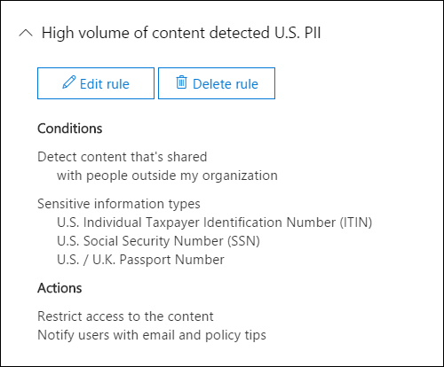
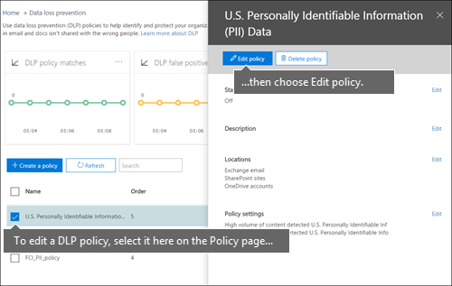

# Создание политики защиты от потери данных на основе шаблона

Самый простой и распространенный способ приступить к работе с политиками защиты от потери данных — использовать один из шаблонов, включенных в Office 365. Вы можете использовать один из этих шаблонов без изменения или настроить правила в соответствии с конкретными требованиями вашей организации.
  
Microsoft 365 включает более 40 готовых к использованию шаблонов, которые помогут вам удовлетворить широкий спектр общих нормативных и бизнес-политик. Например, имеются шаблоны политик защиты от потери данных для следующих документов:
  
- Акт Грэмма-Лича-Блайли (Акт о модернизации финансовой системы 1999 г.)
    
- Отраслевой стандарт защиты данных платежных карт (PCI-DSS)
    
- Законы США о защите персональных данных
    
- Закон США о медицинском страховании (HIPAA)
    
Вы можете настроить шаблон, изменив любое из существующих правил или добавив новое. Например, вы также можете добавить к правилу новые типы конфиденциальной информации, изменить в нем счетчики, чтобы его было сложнее или проще вызвать, позволить пользователям обходить действия в правиле, предоставив обоснование, или изменить адресатов уведомлений и отчетов об инцидентах. Шаблон политики защиты от потери данных — это отличная отправная точка для многих распространенных сценариев, связанных с соответствием требованиям.
  
Вы также можете выбрать настраиваемый шаблон, который не содержит правил по умолчанию, и настроить политику защиты от потери данных с нуля в соответствии с конкретными требованиями организации.
  
## Пример. Определение конфиденциальной информации на всех сайтах OneDrive для бизнеса и ограничение доступа для пользователей за пределами организации

Учетные записи OneDrive для бизнеса делают работу с документами совместной работы и обмена документами для людей в организации. Однако, как правило, для сотрудников по обеспечению соответствия требованиям конфиденциальную информацию, хранящуюся в учетных записях OneDrive для бизнеса, могут случайно получить доступ к людям за пределами вашей организации. Политика защиты от потери данных может помочь снизить этот риск.
  
В этом примере создается политика DLP, которая определяет персональные данные в США, в том числе индивидуальные идентификационные номера налогоплательщика (ITIN), номера социального страхования и номера паспортов в США. Для начала вы сможете использовать шаблон, а затем изменить его в соответствии с требованиями вашей организации, в частности:
  
- Добавьте несколько типов конфиденциальной информации — номера банковского счета в США и номера водительского удостоверения в США, чтобы политика защиты от защите данных защищает еще больше конфиденциальных данных.
    
- Сделайте политику более конфиденциальной, чтобы одного экземпляра конфиденциальной информации было достаточно для ограничения доступа внешних пользователей.
    
- разрешить пользователям обходить действия, предоставив обоснование или сообщив о ложном срабатывании. Таким образом, политика DLP не помешает людям в вашей организации работать, если у них есть веская бизнес-причина для обмена конфиденциальной информацией.
    
### Создание политики защиты от потери данных на основе шаблона

1. Перейдите по ссылке [https://protection.office.com](https://protection.office.com).
    
2. Выполните вход с помощью рабочей или учебной учетной записи. Теперь вы в Центре соответствия &amp; требованиям безопасности.
    
3. В Центре безопасности &amp; и соответствия требованиям навигация слева политика защиты от потери \> \>  \> **данных** \> **+ создание политики.**
    
    
  
4. Выберите шаблон политики DLP, который защищает типы конфиденциальной информации, которые вам нужны \> **далее.**
    
    В этом примере вы  выберете "Конфиденциальность персональных данных \> **(PII)** ДЛЯ США", так как они уже включают большинство типов конфиденциальной информации, которую вы хотите защитить— вы добавите пару позже. 
    
    При выборе шаблона можно прочитать описание справа, чтобы узнать, какие типы конфиденциальной информации защищает шаблон.
    
    
  
5. Назовем политику \> **"Далее".**
    
6. Чтобы выбрать расположения, которые необходимо защитить политикой DLP, сделайте одно из следующих пунктов:
    
  - Choose **All locations in Office 365** \> **Next**.
    
  - Choose **Let me choose specific locations** \> **Next**. В этом примере выберите этот вариант.
    
    Чтобы включить или исключить все расположения, такие как электронная  почта Exchange или все учетные записи OneDrive, включите или выключите состояние этого расположения. 
    
    Чтобы включить только определенные сайты SharePoint или учетные  записи OneDrive для бизнеса, включайте состояние и щелкните ссылки в раздел "Включить", чтобы выбрать определенные сайты или учетные записи.  Когда вы применяете политику к сайту, настроенные в ней правила автоматически применяются ко всем дочерним сайтам. 
    
    
  
    В этом примере для защиты конфиденциальных данных, хранимых  во всех учетных записях OneDrive  для бизнеса, отключите состояние для электронной почты **Exchange** и сайтов **SharePoint** и оставьте состояние для учетных записей **OneDrive.**
    
7. Choose **Use advanced settings** \> **Next**.
    
8. Шаблон политики защиты от потери данных содержит предопределенные правила с условиями и действиями, которые определяют и обрабатывают определенные типы конфиденциальной информации. Вы можете редактировать, удалять или отключать любые из существующих правил или добавлять новые. Когда все будет готово, нажмите **кнопку "Далее".**
    
    
  
    В этом примере шаблон данных личные сведения для США включает два предопределяемых правила:
    
  - **Небольшой объем содержимого, обнаруженного в** США Это правило ищет файлы, содержащие от 1 до 10 вхождений конфиденциальной информации каждого из трех типов (ИТ-, SSN и номера паспортов США), в которых файлы делиться с людьми за пределами организации. При обнаружении правило отправляет уведомление по электронной почте основному администратору, владельцу документа и человеку, который последним изменил документ. 
    
  - **Большой объем обнаруженного содержимого в** США Это правило ищет файлы, содержащие 10 или более вхождений каждого из этих трех типов конфиденциальной информации, где файлы совместно с людьми за пределами организации. При обнаружении это действие также отправляет уведомление по электронной почте, а также ограничивает доступ к файлу. Для контента в учетной записи OneDrive для бизнеса это означает, что разрешения на доступ к документу имеют все, кроме основного администратора, владельца документа и пользователя, который последним изменил документ. 
    
    Для удовлетворения конкретных требований организации может потребоваться упростить запуск правил, чтобы одного экземпляра конфиденциальной информации было достаточно для блокировки доступа внешних пользователей. Посмотрев на эти правила, вы поймете, что вам не нужны правила с низким и высоким количеством — вам потребуется только одно правило, которое блокирует доступ при обнаружении каких-либо вхождений конфиденциальной информации.
    
    Поэтому вы расширяете правило с именем **Low volume of content detected U.S. PII** Delete \> **rule.**
    
    
  
9. Теперь в этом примере необходимо добавить два типа конфиденциальной информации (номера банковских счетов в США и номеров водительского удостоверения), разрешить пользователям переопределять правило и изменить количество на любое событие. Все это можно сделать, отредактировать  одно правило, поэтому выберите правило редактирования большого объема содержимого, обнаруженного в \> США.
    
    
  
10. Чтобы добавить тип конфиденциальной информации, в разделе **"Условия"** \> **добавьте или измените типы.** Затем в области **"Добавить или изменить"** выберите "Добавить" "Добавить" "Добавить номер банковского счета для США" и "Добавить номер водительского удостоверения \> для  \>   \>  \> **США".**
    
    
  
    
  
11. Чтобы изменить число (количество экземпляров конфиденциальной информации, необходимой  для запуска правила), в области "Число экземпляров" выберите значение min для каждого типа введите \>  \> 1. Минимальное количество не может быть пустым. Максимальное число может быть пустым; пустое **максимальное** значение преобразуется в **любое.**
    
    По завершению отсчет min для всех типов конфиденциальной информации должен быть **1,** а максимальное — **любое.** Другими словами, любое вхождение таких конфиденциальных сведений удовлетворяет этому условию.
    
    
  
12. В окончательной настройке вы не хотите, чтобы политики DLP блокировали работу пользователей, когда у них есть допустимые бизнес-обоснования или они сталкивались с ложным срабатыважением, поэтому вы хотите, чтобы уведомление пользователя включало параметры для переопределения действия блокировки.
    
    В разделе **"Уведомления пользователя"** можно увидеть, что уведомления по электронной почте и подсказки политики по умолчанию для этого правила в шаблоне отключены. 
    
    В разделе **"Переопределения** пользователя" можно увидеть, что переопределения для бизнес-обоснования отключены, а переопределения для сообщения о ложных срабатываниях — нет. Выберите **"Переопредить правило" автоматически, если он сообщает о ложном срабатывии.**
    
    
  
13. В верхней части редактора правил измените имя этого правила с большого объема содержимого, обнаруженного в США по умолчанию, на любое содержимое, обнаруженное с помощью **pii** для США, так как теперь оно вызывается любыми типами конфиденциальной информации.  
    
14. В нижней части редактора правил \> **сохраните**.
    
15. Просмотрите условия и действия для этого правила \> **Далее.**
    
    Справа обратите внимание на **переключатель status** для правила. Если отключить всю политику, все содержащиеся в ней правила также будут отключены. Однако здесь можно отключить определенное правило, не отключая всю политику. Это может быть полезно, если требуется исследовать правило с большим количеством ложных срабатываний. 
    
16. На следующей странице прочитайте и ознакомьтесь со следующими данными, а затем выберите, следует ли включить правило или протестировать его \> **сначала.**
    
     Перед созданием политик защиты от потери данных следует внедрять их постепенно, чтобы оценить их влияние и эффективность до полноценного развертывания. Например, вы не хотите, чтобы новая политика DLP непреднамеренно блокировала доступ к тысячам документов, необходимых для работы. 
    
    При создании политик защиты от потери данных с потенциально мощным влиянием рекомендуется выполнить указанные ниже действия.
    
17. Начните работу в тестовом режиме без подсказок политики, а затем оцените влияние политики с помощью специальных отчетов. Для просмотра количества, расположения, типа и серьезности совпадений политики можно использовать отчеты политики защиты от потери данных. На основании результатов можно настроить правила согласно потребностям. В тестовом режиме политики защиты от потери данных не влияют на эффективность работы сотрудников вашей организации. 
    
18. Переключитесь в тестовый режим с уведомлениями и подсказками политики, чтобы начать знакомить пользователей с политиками соответствия требованиям вашей организации и подготовить их к введению новых правил. На этом этапе можно также попросить пользователей сообщать о ложных срабатываниях, чтобы сделать правила еще точнее.
    
19. Включите политики, чтобы правила были применены и содержимое защищено. Продолжайте отслеживать отчеты системы защиты от потери данных и все отчеты об инцидентах или уведомления, чтобы убедиться в соответствии результатов вашим потребностям. 
    
    
  
20. Просмотрите параметры этой политики, выберите \> **"Создать".**
    
После создания и включаемой политики DLP она развертывается во всех источниках контента, включаемых в нее, например на сайтах SharePoint Online или в учетных записях OneDrive для бизнеса, где политика начинает автоматически применять свои правила к этому контенту.
  
## Просмотр состояния политики защиты от потери данных

В любое время вы можете просмотреть состояние своих  политик защиты  от потери данных на странице "Политика" в разделе "Предотвращение потери данных" Центра соответствия &amp; требованиям безопасности. Здесь вы можете найти важные сведения, например о том, была ли политика успешно включена или отключена, или находится ли политика в тестовом режиме. 
  
Ниже приведены различные состояния и их значение.
  
|**Состояние**|**Пояснение**|
|:-----|:-----|
|**Включение...**   |Политика развертывается для источников содержимого, которые она включает. Она пока не применяется ко всем источникам.    |
|**Тестирование с уведомлениями**   |Политика находится в тестовом режиме. Действия правила не выполняются, но совпадения политики собираются и их можно просмотреть с помощью отчетов защиты от потери данных. Уведомления о совпадениях политик отправляются указанным получателям.    |
|**Тестирование без уведомлений**   |Политика находится в тестовом режиме. Действия правила не выполняются, но совпадения политики собираются и их можно просмотреть с помощью отчетов защиты от потери данных. Уведомления о совпадениях политик не отправляются указанным получателям.    |
|**On**   |Политика активна и применяется принудительно. Политика успешно развернута во всех источниках контента.    |
|**Отключение...**   |Политика удаляется из источников контента, которые она включает. Политика может оставаться активной и применяться к некоторым источникам. Отключение политики может занять до 45 минут.    |
|**Выключите**   |Политика не активна и не применяется принудительно. Параметры политики (источники, ключевые слова, длительность, и т. д.) сохранены.    |
|**Удаление...**   |Выполняется удаление политики. Политика не активна и не применяется принудительно. Удаление политики обычно занимает час   |
   
## Отключение политики защиты от потери данных

Политику DLP можно изменить или отключить в любое время. Отключение политики отключает все правила в политике.
  
Чтобы изменить или отключить политику DLP, на **странице** "Политика" выберите \> политику \> **"Изменить политику".**
  

  
Кроме того, вы можете отключить каждое правило по отдельности, отредактировав политику, а затем отключив состояние этого правила, как описано выше.  
  
## Дополнительные сведения

- [Обзор политик защиты от потери данных](data-loss-prevention-policies.md)
    
- [Отправка уведомлений и отображение подсказок политик защиты от потери данных](use-notifications-and-policy-tips.md)
    
- [Создание политики защиты от потери данных для защиты документов с помощью FCI или других свойств](protect-documents-that-have-fci-or-other-properties.md)
    
- [Что входит в шаблоны политики защиты от потери данных](what-the-dlp-policy-templates-include.md)
    
- [Определения объектов типов конфиденциальной информации](sensitive-information-type-entity-definitions.md)
    

