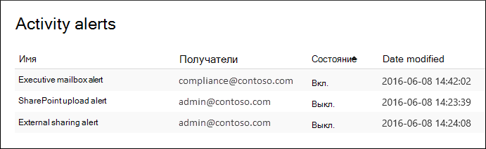

# Создание оповещений об активности

Вы можете создать оповещение о действии, которое отправит вам уведомление по электронной почте при выполнении пользователями определенных действий в Office 365. Оповещение об активности аналогично поиску событий в журнале аудита, за исключением того, что вам будет отправлено сообщение электронной почты, когда произойдет событие для действия, которое вы создали. 
  
 **Зачем использовать оповещений о действиях вместо поиска журнала аудита?** Могут быть определенные виды действий или действий, выполняемые определенными пользователями, о которые вы действительно хотите знать. Вместо того, чтобы помнить о поиске журнала аудита для этих действий, вы можете использовать оповещений о действиях, чтобы Microsoft 365 отправить вам сообщение электронной почты, когда пользователи выполняют эти действия. Например, можно создать оповещение о действии, чтобы уведомить вас об удалении файлов в SharePoint или создать оповещение о том, когда пользователь постоянно удаляет сообщения из почтового ящика. Отправленные вам уведомления электронной почты содержат сведения о том, какая деятельность была выполнена, и о пользователе, который ее выполнил.

> [!NOTE]
> Оповещение о действии отстает. Рекомендуется использовать политики оповещения в центре безопасности и соответствия требованиям вместо создания новых оповещений о действиях. Политики оповещений предоставляют дополнительные функции, такие как возможность создания политики оповещения, которая вызывает оповещение при выполнении пользователем указанного действия, и отображение оповещений на странице Оповещений **View** в центре безопасности и соответствия требованиям. Дополнительные сведения см. в политике [Alert.](alert-policies.md)
  
## Подтверждение ролей и настройка журнала аудита

- Для управления оповещениями о действиях необходимо навести роль конфигурации организации в Центре & безопасности. По умолчанию эта роль назначена группам ролей администратора соответствия требованиям и групп управления организацией. Дополнительные сведения о добавлении участников в группы ролей см. в дополнительных сведениях о том, как предоставить пользователям доступ к Центру [& безопасности.](../security/defender-365-security/grant-access-to-the-security-and-compliance-center.md)
    
- Прежде чем приступить к использованию оповещений о действиях, необходимо сначала включить журнал аудита для организации. Для этого просто нажмите кнопку **Начните запись действий** пользователя и администратора на странице **Оповещений о действии.** (Если вы не видите эту ссылку, аудит для организации уже включен.) Вы также можете включить аудит  на странице поиска журнала аудита в Центре  & безопасности (перейдите в поиск журнала \> **аудита поиска).** Это необходимо сделать только один раз для организации.
  
- Можно создавать оповещения для тех же действий, которые можно искать в журнале аудита. Дополнительные [сведения см.](#more-information) в разделе Дополнительные сведения о списке распространенных сценариев (и определенных действий для мониторинга), для создания оповещений. 
    
- Вы можете использовать страницу оповещений **activity** в Центре & безопасности для создания оповещений только для действий пользователей, указанных в адресной книге организации. Эту страницу нельзя использовать для создания оповещений о действиях внешних пользователей, которые не указаны в адресной книге. 
    
## Создание оповещений об активности

1. Перейдите по ссылке [https://protection.office.com/managealerts](https://protection.office.com/managealerts).
    
2. Выполните вход с помощью рабочей или учебной учетной записи.
    
3. На странице **Оповещений об активности** нажмите  **New**.

   Отображается страница для создания оповещений о действии.

    
    
  
4. Выполните следующие поля, чтобы создать оповещение о действии:
    
    а. **Имя** . Введите имя оповещений. Имена оповещений должны быть уникальными в организации.
    
    б. **Описание** (необязательный) — описание оповещений, таких как отслеживаются действия и пользователи, а также пользователи, на которые отправляются уведомления по электронной почте. Описания предоставляют быстрый и простой способ описать назначение оповещения другим администраторам.
    
    в. **Тип** оповещений . **Убедитесь, что** выбран настраиваемый параметр. 

    г. **Отправьте это оповещение,** когда нажмите **кнопку Отправить это** оповещение, когда и затем настроить эти два поля:
    
    - **Действия** . Щелкните выпадаемом списке, чтобы отобразить действия, для которые можно создать оповещение. Это тот же список действий, который отображается при поиске журнала аудита. Вы можете выбрать одно или несколько определенных действий или щелкнуть имя группы действий, чтобы выбрать все действия в группе. Описание этих действий см. в разделе "Аудит действий" в [разделе Поиск журнала аудита.](search-the-audit-log-in-security-and-compliance.md#audited-activities) При выполнении пользователем любых действий, добавленных в оповещение, отправляется уведомление по электронной почте. 
    
     - **Пользователи** — щелкните это поле, а затем выберите одного или несколько пользователей. Если пользователи в этом окне выполняют действия, добавленные в поле **Действия,** будет отправлено оповещение. Оставьте **поле Пользователи** пустым, чтобы отправить оповещение, когда любой пользователь в организации выполняет действия, указанные в оповещении. 

    д. Отправьте это оповещение **.** Щелкните Отправить  это оповещение, а затем нажмите в поле Получатели и введите имя, чтобы добавить пользователей, которые получат уведомление по электронной почте, когда пользователь (указанный в поле **Пользователи)** выполняет действие (указанное в поле **Действия).** Обратите внимание, что вы добавлены в список получателей по умолчанию. Вы можете удалить свое имя из этого списка.
    
5. Щелкните **Сохранить,** чтобы создать оповещение. 
    
    Новое оповещение отображается в списке на странице **Оповещений о действии.** 
    
    
  
    Состояние оповещений установлено **для On**. Обратите внимание, что также перечислены получатели, которые получат уведомление по электронной почте при отправке оповещений. 
  
## Отключение оповещений об активности

Вы можете отключить оповещение о действии, чтобы уведомление электронной почты не было отправлено. После отключения оповещений о действии оно по-прежнему отображается в списке оповещений о действиях для организации, и вы можете просматривать его свойства.
  
1. Перейти к [https://protection.office.com/managealerts](https://protection.office.com/managealerts) Перейти к .
    
2. Выполните вход с помощью учетной записи вашей организации или учебного заведения.
    
3. В списке оповещений о действиях для организации щелкните оповещение, которое необходимо отключить.
    
4. На странице **Редактирование оповещения** щелкните переключатель **On** toggle, чтобы изменить состояние на **Off,** а затем нажмите **кнопку Сохранить**.
    
    Состояние оповещений на страницах оповещений о действии замещается **отключением.**  
    
Чтобы включить оповещение о действии, просто повторите эти действия и щелкните переключатель **Off** toggle, чтобы изменить состояние **на On**.
  
## Дополнительные сведения

- Вот пример уведомления электронной почты, которое отправляется пользователям, указанным в поле Отправка этого оповещения  (и перечисленное в статье **Получатели** на странице Оповещений об активности) в Центре & соответствия требованиям. 
    
    
  
- Вот некоторые распространенные действия по документу и электронной почте, для которые можно создать оповещений об активности. В таблицах описываются действия, имя действия для создания оповещений и имя группы действий, которая  указана в списке "Действие". Полный список действий, для создания оповещений о действиях см. в разделе "Аудит действий" в [разделе Поиск журнала аудита.](search-the-audit-log-in-security-and-compliance.md#audited-activities)
    
    > [!TIP]
    > Может потребоваться создать оповещение о действии только для одной активности, выполняемой любым пользователем. Или может потребоваться создать оповещение о действии, которое отслеживает несколько действий, выполняемых одним или несколькими пользователями. 
  
    В следующей таблице перечислены некоторые общие действия, связанные с документами в SharePoint или OneDrive для бизнеса.
    
    |**Когда пользователь делает это...**|**Создание оповещений для этого действия**|**Группа действий**|
    |:-----|:-----|:-----|
    |Просмотр документа на сайте.    |Получен доступ к файлу    |Действия файлов и папок    |
    |Изменяет или изменяет документ.    |Изменен файл    |Действия файлов и папок    |
    |Делится документом с пользователем за пределами организации.    |Файл, папка или сайт share    And    Приглашение к совместному использованию создано    Для получения дополнительной информации см. раздел [Использование аудита совместного использования в журнале аудита](use-sharing-auditing.md).    |Действия, связанные с общим доступом и запросами на доступ    |
    |Загрузка или загрузка документа.    |Выложен файл    And/or    Скачан файл    |Действия файлов и папок    |
    |Изменение разрешений доступа на сайт.    |Изменены разрешения сайта    |Действия, связанные с администрированием сайта    |

    В следующей таблице перечислены некоторые распространенные действия, связанные с электронной почтой в Exchange Online.

    |**Когда пользователь делает это...**|**Создание оповещений для этого действия**|**Группа действий**|
    |:-----|:-----|:-----|
    |Постоянно удаляет (очищает) сообщение электронной почты из почтового ящика.    |Чистка сообщений из почтового ящика    | Действия, связанные с почтовыми ящиками Exchange    |
    |Отправляет сообщение электронной почты из общего почтового ящика.    |Отправить сообщение с использованием разрешений "Отправить как"    And    Отправлено сообщение с разрешениями "Отправить от имени"    | Действия, связанные с почтовыми ящиками Exchange    |
   
- Кроме того, для создания и редактирования оповещений о действиях можно также использовать в центре безопасности и powerShell & **New-ActivityAlert** и **Set-ActivityAlert.** Имейте в виду следующие вещи, если вы используете эти комлеты для создания или редактирования оповещений о действиях: 
    
  - Если для добавления действия к оповещению, которое не  указано в списке "Действие", на странице свойства отображается сообщение с предупреждением: "Это оповещение имеет настраиваемые операции, не указанные в выборке". 
    
  - Хорошей причиной для создания или редактирования оповещений об активности является отправка уведомлений электронной почты кому-либо за пределами организации. Этот внешний пользователь будет указан в списке получателей оповещения. Но если удалить этого внешнего пользователя из оповещений, этот пользователь не может быть повторно добавлен в оповещение с помощью страницы **Оповещения об редактировании.** Для добавления того же (или другого) внешнего пользователя в новое оповещение необходимо повторно добавить внешнего пользователя с помощью комлета **Set-ActivityAlert** или с помощью комлета **New-ActivityAlert.** 
