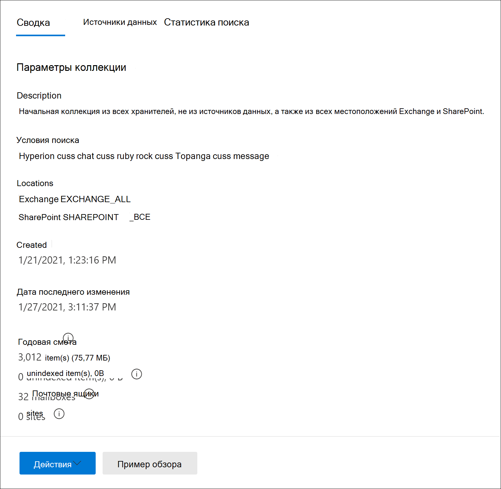
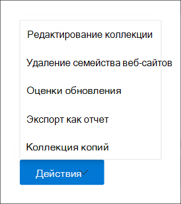

# Создание коллекции черновиков в advanced eDiscovery

После выявления хранителей и любых источников данных, не в отношении лиц, не в отношении хранения, для этого дела вы будете готовы определить и найти набор необходимых документов. Это можно сделать с помощью средства Collections для поиска источников данных для соответствующего контента. Это необходимо, создав коллекцию, которая ищет указанные источники данных для контента, который соответствует вашим критериям поиска. У вас есть возможность создать коллекцию *черновиков*, которая является оценкой найденных элементов или вы можете создать коллекцию, которая автоматически добавляет элементы в набор отзывов. При создании коллекции черновиков можно просмотра сведений о предполагаемых результатах, которые соответствуют запросу поиска, таких как общее число и размер найденных элементов, различные источники данных, в которых они были найдены, и статистические данные о запросе поиска. Вы также можете просмотреть пример элементов, возвращенных коллекцией. С помощью этих статистических данных можно изменить поисковый запрос и перезахоранить коллекцию черновиков, чтобы сузить результаты. После того, как вы будете удовлетворены результатами коллекции, вы можете нафиксировать коллекцию на набор отзывов. При фиксации черновика коллекции элементы, возвращаемые коллекцией, добавляются в набор отзывов для проверки, анализа и экспорта.

## Перед созданием коллекции черновиков

- Добавьте в дело хранители и источники данных, не в отношении хранения, прежде чем создать коллекцию черновиков. Это необходимо для выбора источников данных при создании коллекции черновиков. Дополнительные сведения см. в статьях:

  - [Добавление хранителей в дело](add-custodians-to-case.md)

  - [Добавление не охраняемых источников данных в дело](non-custodial-data-sources.md)

- Вы можете искать дополнительные источники данных (те, которые не были добавлены в дело в качестве мест хранения или не-хранения) в черновике коллекции контента, который может иметь отношение к делу. Эти источники данных могут включать почтовые ящики, сайты SharePoint и Teams. Если эта ситуация применима к вашему делу, составить список этих источников данных, чтобы можно было добавить их в коллекцию.

## Создание коллекции черновиков

1. В центре соответствия требованиям Microsoft 365 откройте дело advanced eDiscovery и выберите вкладку **Collections.**

2. На странице **Коллекции выберите** новую **коллекцию**  >  **Стандартная коллекция**.

3. Введите имя (обязательно) и описание (необязательно) для коллекции. После создания коллекции имя изменить нельзя, но можно изменить описание.

4. На странице **Источники данных custodial** сделайте одно из следующих вещей, чтобы определить источники данных для хранения для сбора контента из:

   - Щелкните **Выберите хранителей для** поиска определенных хранителей, добавленных в дело. При использовании этого параметра отображается список хранителей дела. Выберите одного или несколько хранителей. После выбора и добавления хранителей можно также выбрать конкретные источники данных для поиска каждого хранителя. Эти отображаемые источники данных были указаны при добавлении хранителя в дело.

   - Нажмите **кнопку Выберите все** очки для поиска всех хранителей, которые были добавлены в дело. При выборе этого параметра все источники данных для всех хранителей будут искаться.

5. На странице **Не-хранение** источников данных, сделать одно из следующих вещей, чтобы определить, не-хранение источников данных для сбора контента из:

   - Нажмите **кнопку Выберите источники** данных, не в отношении хранения, чтобы выбрать конкретные источники данных, которые были добавлены в дело. При использовании этого параметра отображается список источников данных. Выберите один или несколько из этих источников данных.

   - Щелкните **кнопку Выберите все** очки, чтобы выбрать все источники данных, которые были добавлены в дело.

6. На странице **Дополнительные источники** данных можно выбрать другие почтовые ящики и сайты для поиска в рамках коллекции. Эти типы источников данных не были добавлены в качестве мест хранения или не-хранения данных в этом случае. У вас также есть два варианта при поиске дополнительных источников данных:

   - Чтобы найти все расположения контента для определенной службы (почтовые ящики Exchange, сайты SharePoint и OneDrive или общедоступные папки Exchange), щелкните соответствующий раздел **Выберите** все кнопки в столбце **Состояние.** Этот параметр будет искать все расположения контента в выбранной службе.

   - Чтобы найти определенное расположение контента  для службы, щелкните соответствующий раздел Выберите все кнопки в столбце Состояние, а затем щелкните **Пользователи,** группы или группы (для почтовых ящиков Exchange) или Выберите сайты для (сайты SharePoint и OneDrive) для поиска определенных местоположений контента.  

7. На странице **Условия** можно создать поисковый запрос, который используется для сбора элементов из источников данных, которые были определены на предыдущих страницах мастера. Вы можете искать ключевые слова, пары свойств:значение или использовать список ключевых слов. Вы также можете добавить различные условия поиска, чтобы сузить область действия коллекции. Дополнительные сведения см. в [подборке Создание поисковых запросов для коллекций.](building-search-queries.md)

8. На странице **Сохранить в качестве черновика** или добавить для просмотра за наборной страницы выберите **сохранить коллекцию в качестве черновика.**

   > [!NOTE]
   > Другой параметр на этой странице позволяет собирать элементы и добавлять их непосредственно в набор отзывов. Вместо создания черновика коллекции, который можно просмотреть статистику и просмотреть пример результатов коллекции, этот параметр пропускает этот процесс и автоматически добавляет коллекцию в набор отзывов. Если выбрать второй вариант, чтобы добавить коллекцию в набор отзывов, необходимо настроить дополнительные параметры, такие как сбор целых потоков беседы в Microsoft Teams и Yammer и сбор облачных вложений (также называемых современными вложениями). Дополнительные сведения об этих параметрах см. в документе [Commit a draft collection to a review set.](commit-draft-collection.md)

9. На странице **Обзор коллекции** можно просмотреть и обновить параметры коллекции, настроенные на предыдущих страницах.

   - **Сводная** вкладка. Просмотрите и измените имя и описание коллекции, критерии поиска коллекции, дополнительные расположения данных и тип коллекции.

   - **Вкладка** Источники. Просмотрите и измените источники данных для коллекции для хранения и без хранения.

10. Нажмите **Кнопку Отправить,** чтобы создать коллекцию черновиков. Отображается страница, подтверждая, что коллекция создана.

## Что происходит после создания коллекции черновиков

После создания черновика коллекции он указан на странице **Коллекции** в случае, и состояние показывает, что он в процессе. Задание с **именем Подготовка предварительного** просмотра поиска и оценки также создаются и отображаются на странице **Jobs** в этом случае.

В процессе разработки проекта поиска advanced eDiscovery выполняет оценку поиска с использованием критериев поиска и источников данных, указанных в коллекции. Advanced eDiscovery также готовит выборку элементов, которые можно предварительно просмотреть. По завершению коллекции обновляются следующие столбцы и соответствующие значения на странице **Коллекция:**

- **Состояние.** Указывает состояние и тип коллекции. Значение **Estimated указывает,** что коллекция черновиков завершена. Это же значение также указывает на то, что коллекция является коллекцией черновиков и что она не была добавлена в набор отзывов. Значение **Committed** в столбце **Состояние** указывает, что коллекция была добавлена в набор отзывов.

- **Состояние оценки:** указывает состояние предполагаемых результатов поиска и готовность к проверке оценок и статистики поиска. Значение Successful **указывает,** что результаты коллекции черновиков готовы к проверке. После первого отправки коллекции черновиков отображается значение **In progress,** указывав на то, что коллекция по-прежнему запущена.

- **Состояние предварительного** просмотра. Указывает состояние элементов образца, которые можно просмотреть. Значение Successful **указывает,** что элементы готовы к предварительному просмотру. После первого отправки черновика коллекции отображается значение **In progress,** указывав на то, что коллекция по-прежнему запущена.

## Дальнейшие действия по завершению коллекции черновиков

После успешного завершения коллекции черновиков можно выполнить различные задачи. Чтобы выполнить большинство из этих задач, просто перейдите на вкладку **Collections** и щелкните имя коллекции черновиков, чтобы отобразить страницу вылетов.

Вот список вещей, которые можно сделать на странице вылетов коллекции:

- Выберите **вкладку Сводка,** чтобы просмотреть сводные сведения о коллекции и предполагаемых результатах поиска, возвращаемом коллекцией. Это включает общее количество элементов и размер предполагаемых результатов поиска, количество почтовых ящиков и сайтов, содержащих результаты поиска, а также условия поиска (если они используются) для охвата коллекции.

- Выберите **вкладку Источники** данных, чтобы просмотреть список хранителей и источников данных, не отбираемых в коллекции. Все дополнительные расположения контента, которые были в поиске, перечислены в **статье Расположения** на вкладке **Сводка.**

- Выберите **вкладку Статистики поиска,** чтобы просмотреть статистику о коллекции. Это включает общее число и размер элементов, найденных в каждой службе (например, почтовые ящики Exchange или сайты SharePoint) и отчет об условиях, в которых отображаются статистические данные о количестве элементов, возвращающихся различными компонентами поискового запроса, используемого коллекцией. Дополнительные сведения см. [в сборнике статистики и отчетов.](collection-statistics-reports.md)

- Щелкните **пример обзоров** (расположенный в нижней части страницы вылетов), чтобы просмотреть образец элементов, возвращенных коллекцией.

- Зафиксировать коллекцию черновиков в набор отзывов (щелкнув **коллекцию Действия**  >  **редактирования).** Это означает, что вы перезахоранили коллекцию (с помощью текущих параметров) и добавили элементы, возвращенные коллекцией, в набор отзывов. Как объяснялось ранее, при добавлении коллекции в набор отзывов можно также настроить дополнительные параметры (например, потоки разговоров и облачные вложения). Дополнительные сведения и пошаговая инструкция см. в обзоре [Commit a draft collection to a review set.](commit-draft-collection.md)

## Управление коллекцией черновиков

Вы можете использовать параметры в меню **Действия** на странице вылетов коллекции черновиков для выполнения различных задач управления.

Ниже описаны параметры управления.

- **Редактирование** коллекции: Изменение параметров коллекции черновиков. После внесения изменений можно перезахоранить коллекцию и обновить оценки и статистику поиска. Как объяснялось ранее, этот параметр используется для фиксации коллекции черновиков в набор отзывов.  

- **Удаление коллекции**. Удаление черновика коллекции. Обратите внимание, что после того, как коллекция черновиков будет настроена на набор отзывов, ее нельзя удалить.

- **Оценки обновления.** Перезахораните запрос (в отношении источников данных), указанный в коллекции черновиков, чтобы обновить оценки поиска и статистику.

- **Экспорт как отчет.** Экспорт сведений о черновике коллекции в CSV-файл, который можно скачать на локальном компьютере. Отчет об экспорте содержит следующие сведения:

  - Идентификатор каждого расположения контента, содержающего элементы, соответствующие запросу поиска в коллекции черновиков. Эти расположения обычно являются почтовыми ящиками или сайтами.
  
  - Общее количество элементов в каждом расположении контента.
  
  - Общий размер (в bytes) элементов в каждом расположении контента.

  - Служба (например Exchange или SharePoint), в которой расположено расположение контента.

- **Коллекция копий.** Создайте новую коллекцию черновиков, копируя параметры из существующей коллекции. Для новой коллекции необходимо использовать другое имя. Кроме того, перед отправкой новой коллекции можно изменить параметры. После отправки запроса поиска запускаются и создаются новые оценки и статистические данные. Это хороший способ быстро создать дополнительную коллекцию черновиков, а затем при необходимости изменить выбранные параметры при сохранении сведений в исходной коллекции. Это также позволяет легко сравнить результаты двух аналогичных коллекций.

> [!NOTE]
> После того как коллекция черновиков будет настроена на набор отзывов, можно только скопировать коллекцию и экспортировать отчет.
