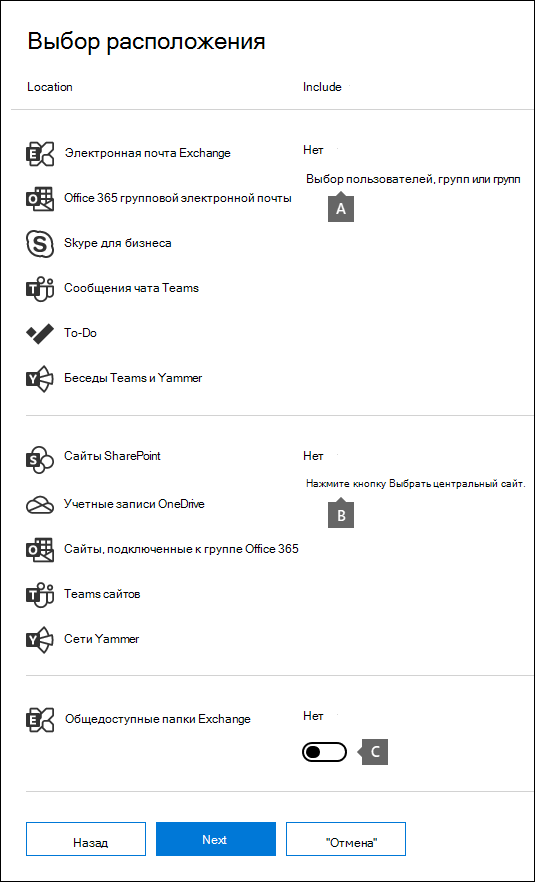
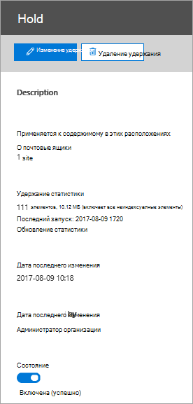
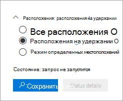

# <a name="create-an-ediscovery-hold"></a>Создание запроса на удержание в случае обнаружения электронных данных

Вы можете использовать основное дело eDiscovery для создания удержаний, чтобы сохранить содержимое, которое может быть релевантно для случая. Вы можете разместить удержание на учетных записях почтовых ящиков Exchange и OneDrive для бизнеса для людей, которые вы изучаете в этом случае. Вы также можете поместить удержание на почтовые ящики и сайты, связанные с Microsoft Teams, Office 365 Groups и группами Yammer. При помещении расположений контента в удержание содержимое сохраняется до тех пор, пока не будет удалено место хранения контента или не будет удалено удержание.

После создания удержания обнаружения электронных данных может потребоваться до 24 часов, чтобы удержание вступило в силу. 

При создании удержания можно использовать следующие параметры для определения области действия контента, который хранится в указанных расположениях контента:
  
- Вы создаете бесконечное удержание, где весь контент в указанных расположениях размещается на удержании. Кроме того, вы можете создать удержание на основе запроса, в котором на хранение помещается только содержимое в указанных расположениях, соответствующее поисковому запросу.

- Вы можете указать диапазон дат, чтобы сохранить только содержимое, которое было отправлено, получено или создано в пределах этого диапазона дат. Кроме того, вы можете хранить все содержимое в указанных местах независимо от того, когда оно было отправлено, получено или создано.
  
## <a name="how-to-create-an-ediscovery-hold"></a>Как создать удержание для обнаружения электронных данных

Чтобы создать удержание обнаружения электронных данных, связанное с основным вариантом обнаружения электронных данных, выполните указанные ниже действия.
  
1. Перейдите на страницу [https://compliance.microsoft.com](https://compliance.microsoft.com) и войдите, используя учетные данные для учетной записи пользователя, которой были назначены соответствующие разрешения на обнаружение электронных данных.

2. В левой области навигации центра соответствия требованиям Microsoft 365 щелкните **Показать все**, а затем щелкните **ядро > обнаружения электронных**данных.

3. На странице **основные обнаружения электронных** данных выберите случай, в котором необходимо создать удержание, а затем щелкните **открыть обращение**.

4. На **домашней** странице примера перейдите на вкладку **удержания** .
  
5. На странице **удержания** нажмите кнопку **создать**.

6. На странице " **имя мастера хранения** " укажите имя для удержания и добавьте описание, а затем нажмите кнопку **Далее**. Имя удержания должно быть уникальным в пределах организации.

7. На странице **расположения содержимого** выберите расположения контента, которые необходимо разместить на удержании. Вы можете размещать почтовые ящики, сайты и общедоступные папки на удержании.

    
  
   a. **Расположения почтовых ящиков** — выберите **Пользователи, группы или Teams** , а затем нажмите **выбрать пользователей, группы или Teams** еще раз, чтобы указать почтовые ящики, которые необходимо разместить на удержании. Используйте поле поиска для поиска почтовых ящиков пользователей и групп рассылки (чтобы заблокировать почтовые ящики участников группы), чтобы разместить их на удержании. Вы также можете разместить удержание на связанном почтовом ящике для группы Майкрософт, Office 365 или группы Yammer. Установите флажок Пользователь, группа, группа, нажмите кнопку **выбрать**, а затем нажмите кнопку **Готово**.

   b. **Расположения сайтов** — щелкните **выбрать сайты** , а затем нажмите кнопку **выбрать сайты** еще раз, чтобы указать учетные записи SharePoint и OneDrive, которые необходимо разместить на удержании. Укажите URL-адрес каждого сайта, который вы хотите поставить на удержание. Вы также можете добавить URL-адрес сайта SharePoint для группы Microsoft Team, Office 365 или группы Yammer. Нажмите кнопку **выбрать**, а затем кнопку **Готово**.
  
   c. **Общедоступные папки Exchange.** Переместите переключатель выключатель в  положение **все** , чтобы поместить все общедоступные папки в организации Exchange Online на удержание. Вы не можете выбрать определенные общедоступные папки, которые следует включить в удержание. Если вы не хотите хранить данные в общедоступных папках, оставьте переключатель переключатель в **положение нет** .

   > [!NOTE]
   > В удержание необходимо добавить по крайней мере одно расположение контента. В противном случае статические удержания обнаружения электронных данных покажут, что нет элементов на удержании.

8. Когда вы закончите Добавление расположений содержимого в удержание, нажмите кнопку **Далее**.

9. Чтобы создать удержание на основе запроса с условиями, выполните приведенные ниже условия. В противном случае, чтобы сохранить все содержимое в указанных расположениях контента, нажмите кнопку **Далее** .

    
  
    a. В поле **Ключевые слова**введите поисковый запрос таким образом, чтобы сохранялся только контент, соответствующий условиям поиска. Можно указать ключевые слова, свойства сообщений электронной почты или свойства документа, например имена файлов. Кроме того, можно использовать более сложные запросы, которые используют логический оператор, например **and**, **or**и **Not**.

    b. Нажмите кнопку **Добавить условия** , чтобы добавить одно или несколько условий, чтобы сузить поисковый запрос для удержания. Каждое условие добавляет в запрос поиска KQL предложение, созданное и выполняемое при создании удержания. Например, можно указать диапазон дат, чтобы документы электронной почты или документы сайта, созданные в пределах даты, помещаются на удержание. Условие логически подключается к запросу ключевого слова (указанному в поле **Ключевые слова** ) с помощью оператора **and** . Это означает, что элементы должны удовлетворять как запрос ключевого слова, так и условие, которое необходимо сохранить.

    Для получения дополнительных сведений о создании поискового запроса и использовании условий просмотрите [запросы ключевых слов и условия поиска контента](keyword-queries-and-search-conditions.md).

10. После того как вы настраиваете удержание на основе запроса, нажмите кнопку **Далее**.

11. Проверьте параметры (и при необходимости измените их), а затем нажмите кнопку **создать удержание**.

## <a name="ediscovery-hold-statistics"></a>Статистика удержания обнаружения электронных данных

После создания удержания обнаружения электронных данных на всплывающей странице для выбранного удержания отображается информация о новом удержании. Эта информация включает в себя количество почтовых ящиков и сайтов на удержании и статистику по содержимому, которое было включено в удержание, например общее число и размер элементов, включенных в удержание, а также время последнего расчета статистики удержания. Эти статистические данные помогают определить, сохраняется количество содержимого, связанное с обращением.
  

  
При использовании статистики хранения данных обнаружения электронных данных учитывайте следующие моменты.
  
- Общее количество элементов на удержании указывает количество элементов из всех источников контента, размещаемых на удержании. Если вы создали удержание на основе запроса, эта статистика указывает количество элементов, которые совпадают с запросом.

- Количество элементов на удержании также включает неиндексированные элементы, найденные в расположениях содержимого. Если вы создаете удержание на основе запроса, все неиндексированные элементы в расположениях содержимого помещаются на удержание. Сюда входят неиндексированные элементы, которые не соответствуют критериям поиска для хранения на основе запроса и неиндексированных элементов, которые могут находиться за пределами диапазона дат. Это отличается от того, что происходит при выполнении поиска, когда неиндексированные элементы, которые не отвечают поисковому запросу или исключены с помощью условия диапазона дат, не включаются в результаты поиска. Дополнительные сведения об неиндексированных [элементах см.](partially-indexed-items-in-content-search.md)

- Вы можете получить последнюю статистику хранения, нажав кнопку **Обновить статистику** , чтобы повторно выполнить оценку поиска, которая вычисляет текущее количество элементов на удержании.

- Обычно количество элементов на удержании увеличивается, так как пользователи, чьи почтовые ящики или сайты находятся на удержании, обычно отправляют или получают новое сообщение электронной почты и могут создавать новые документы в SharePoint и OneDrive.

- Если почтовый ящик Exchange, сайт SharePoint или учетная запись OneDrive перемещаются в другой регион в среде с поддержкой нескольких регионов, статистика для этого сайта не будет включаться в статистику удержания. Но содержимое в этих расположениях по-прежнему будет сохранено. Кроме того, если почтовый ящик или сайт перемещается в другой регион, SMTP-адрес или URL-адрес, отображаемый в удержании, не будет обновляться автоматически. Необходимо изменить удержание и обновить URL-адрес или SMTP-адрес, чтобы расположения контента снова включались в статистику удержания.

## <a name="search-locations-on-ediscovery-hold"></a>Расположения для поиска при удержании электронных данных

При [поиске контента](search-for-content-in-core-ediscovery.md) в базовом случае обнаружения электронных данных можно быстро настроить поиск так, чтобы поиск выполнялся только для тех расположений контента, которые были размещены на удержании, связанном с этим обращением.



Выберите вариант **места хранения** для поиска всех расположений контента, включенных в удержание. Если обращение содержит несколько удержаний eDiscovery, при выборе этого параметра будут выполняться поиск расположений контента из всех удержаний. Кроме того, если расположение содержимого было размещено на удержании на основе запроса, при выполнении поиска будет выполняться поиск только элементов, которые отвечают условиям поиска. Другими словами, с результатами поиска возвращаются только содержимое, которое соответствует критериям хранения и условиям поиска. Например, если пользователь поместился на удержание на основе запроса, в котором сохраняются элементы, отправленные или созданные до определенной даты, поиск будет выполнен только для этих элементов. Это достигается путем подключения запроса на удержание дел и поискового запроса оператором **и** .

Ниже приведены некоторые другие моменты, которые необходимо учитывать при поиске расположений на удержании электронных данных.

- Если расположение контента является частью нескольких удержаний в одном случае, запросы на удержание объединяются операторами **or** при поиске этого расположения контента с помощью параметра "все содержимое Case". Аналогично, если расположение контента является частью двух различных удержаний, где используется запрос, а второй — бесконечное удержание (то есть, когда весь контент размещается на удержании), весь контент будет выполнять поиск по причине неограниченного удержания.

- Если поиск настроен на поиск в местах хранения, а затем в случае изменения удержания обнаружения электронных данных (путем добавления или удаления расположения или изменения запроса на удержание), конфигурация поиска обновляется с учетом этих изменений. Тем не менее, чтобы обновить результаты поиска, необходимо повторно выполнить поиск после изменения удержания.

- Если несколько удержаний eDiscovery размещаются в едином месте в случае обнаружения электронных данных и выбрано расположение для поиска, максимальное число ключевых слов для этого поискового запроса равно 500. Это вызвано тем, что при поиске все удержания на основе запросов объединяются с помощью оператора **or** . Если в Объединенных запросах на удержание и запросе поиска более 500 ключевых слов, то выполняется поиск по всему содержимому почтового ящика, а не только к содержимому, которое соответствует регистру на основе запроса.
    
- Если удержание обнаружения **электронных данных имеет состояние "включено"**, вы по-прежнему можете выполнять поиск в расположениях на удержании, пока не будет включено удержание.

## <a name="preserve-content-in-microsoft-teams"></a>Сохранение контента в Microsoft Teams

Беседы, являющиеся частью канала Microsoft Teams, хранятся в почтовом ящике, связанном с командой Microsoft Teams. Файлы, которыми обмениваются участники команды, также сохраняются на сайте команды SharePoint. Поэтому для сохранения бесед и файлов в канале необходимо поместить почтовый ящик группы и сайт SharePoint на удержание eDiscovery.

Кроме того, в почтовых ящиках пользователей, участвующих в чате, хранятся беседы, являющиеся частью списка чата в Microsoft Teams (называемые сеансами *1:1* или *1: N групповых чатов*). И файлы, к которым пользователи имеют доступ в беседах в чате, хранятся в учетной записи OneDrive пользователя, который совместно использует файл. Поэтому необходимо добавить отдельные почтовые ящики пользователей и учетные записи OneDrive в удержание eDiscovery для сохранения бесед и файлов в списке чата. Рекомендуется поместить удержание в почтовые ящики участников группы Майкрософт, а также поместить почтовый ящик и сайт группы на удержание.

Начиная с 2020 февраля мы включили возможность сохранять контент в частных каналах. Так как сеансы частного канала хранятся в почтовых ящиках участников чата, помещение почтового ящика пользователя на удержание eDiscovery сохранит защищенные сеансы. Кроме того, если почтовый ящик пользователя был размещен на удержании eDiscovery до 2020 февраля, удержание будет автоматически применено к сообщениям частного канала, хранящимся в этом почтовом ящике. Кроме того, поддерживается сохранение файлов, совместно используемых в частных каналах.

Дополнительные сведения о том, как сохранить контент Teams, можно найти [в разделе помещение пользователя или группы Microsoft Teams на удержание по юридическим](https://docs.microsoft.com/MicrosoftTeams/legal-hold)причинам.
    
> [!IMPORTANT]
> В облачной организации пользователи, участвующие в беседах, которые входят в состав списка чата в Teams, должны иметь почтовый ящик Exchange Online, чтобы сохранять беседы в чате при размещении почтового ящика на удержании eDiscovery. Это связано с тем, что беседы, являющиеся частью списка чата, хранятся в облачных почтовых ящиках участников чата. Если у участника чата нет почтового ящика Exchange Online, вы не сможете сохранить эти беседы в чате. Например, в гибридном развертывании Exchange пользователи с локальным почтовым ящиком могут ГХТ участвовать в беседах, входящих в состав списка чата в Teams. Но в этом случае контент из этих бесед не может быть сохранен, так как у этих пользователей нет облачных почтовых ящиков, которые можно разместить на удержании.
  
Каждая команда или канал группы также содержит вики-сайт для работы с заметками и совместной работы. Содержимое вики-сайта автоматически сохраняется в файле формата MHT. Этот файл хранится в библиотеке документов Teams Wiki Data на сайте команды в SharePoint. Содержимое вики-сайта можно сохранить, добавив сайт SharePoint группы в удержание eDiscovery.
    
> [!NOTE]
> Возможность сохранения контента вики-сайта для команды или канала группы (при размещении сайта SharePoint группы на удержании) выпущен 22 июня 2017 г. Если сайт группы находится на удержании, контент Wiki будет храниться в этот день. Тем не менее, если сайт группы находится на удержании, а вики-контент был удален до 22 июня, 2017, контент wiki не сохранялся.

### <a name="office-365-groups"></a>Группы Office 365

Teams построено на основе групп Office 365. Таким образом, размещение групп Office 365 на удержании eDiscovery аналогично размещению контента Teams на удержании.

При размещении групп и групп Office 365 на удержании eDiscovery следует учитывать следующие моменты.

- Как описывалось ранее, для размещения контента, расположенного в группах Teams и Office 365, на удержании необходимо указать почтовый ящик и сайт SharePoint, связанный с группой или командой.

- Выполните командлет **Get-UnifiedGroup** в [Exchange Online PowerShell](https://docs.microsoft.com/powershell/exchange/exchange-online/connect-to-exchange-online-powershell/connect-to-exchange-online-powershell) , чтобы просмотреть свойства для Teams и групп Office 365. Это хороший способ получения URL-адреса для сайта, связанного с группой или группой Office 365. Например, следующая команда отображает выбранные свойства для группы Office365 с именем "Senior Leadership Team":

    ```text
    Get-UnifiedGroup "Senior Leadership Team" | FL DisplayName,Alias,PrimarySmtpAddress,SharePointSiteUrl

    DisplayName            : Senior Leadership Team
    Alias                  : seniorleadershipteam
    PrimarySmtpAddress     : seniorleadershipteam@contoso.onmicrosoft.com
    SharePointSiteUrl      : https://contoso.sharepoint.com/sites/seniorleadershipteam
    ```

    > [!NOTE]
    > Чтобы запустить командлет **Get-UnifiedGroup**, в Exchange Online вам должна быть назначена роль "получатели только для чтения" или вы должны входить в группу пользователей, которым она назначена. 
  
- При поиске в почтовом ящике пользователя все группы или группы Office 365, участником которых является пользователь, не будут выполнять поиск. Аналогично, при помещении группы или группы Office 365 на хранение с обнаружением электронных данных в удержание помещаются только группы почтового ящика и сайта группы. Почтовые ящики и сайты OneDrive для бизнеса участников группы не помещаются в удержание, если вы явно не добавите их в удержание для обнаружения электронных данных. Поэтому, если необходимо поместить группу или группу Office 365 на удержание по юридическим причинам, рекомендуется добавить почтовые ящики и учетные записи OneDrive для участников группы или группы в то же удержание.

- Чтобы получить список участников группы или группы Office 365, можно просмотреть свойства на странице " **группы** " в центре администрирования Microsoft 365. Или можно выполнить следующую команду в Exchange Online PowerShell: 
    
    ```powershell
    Get-UnifiedGroupLinks <group or team name> -LinkType Members | FL DisplayName,PrimarySmtpAddress
    ```

    > [!NOTE]
    > Чтобы запустить командлет **Get-UnifiedGroupLinks**, в Exchange Online вам должна быть назначена роль "получатели только для чтения" или вы должны входить в группу пользователей, которым она назначена.

## <a name="onedrive-accounts"></a>Учетные записи OneDrive

Чтобы собрать список URL-адресов для сайтов OneDrive для бизнеса в Организации, чтобы вы могли добавить их в удержание или поиск, связанный с вариантом обнаружения электронных данных, ознакомьтесь со статьей [Создание списка всех расположений OneDrive в Организации](https://docs.microsoft.com/onedrive/list-onedrive-urls). Сценарий, описанный в этой статье, создает текстовый файл, содержащий список всех сайтов OneDrive в Организации. Чтобы запустить этот скрипт, требуется установить и использовать командную консоль SharePoint Online. Не забудьте добавить URL-адрес домена личного сайта вашей организации к каждому сайту OneDrive, на котором нужно выполнить поиск. Это домен, содержащий все хранилище OneDrive. Пример: `https://contoso-my.sharepoint.com`. Вот пример URL-адреса для сайта OneDrive пользователя: `https://contoso-my.sharepoint.com/personal/sarad_contoso_onmicrosoft.com`.

> [!IMPORTANT]
> URL-адрес учетной записи OneDrive пользователя содержит имя участника-пользователя (например, `https://alpinehouse-my.sharepoint.com/personal/sarad_alpinehouse_onmicrosoft_com` ). В редких случаях изменение имени участника-пользователя в OneDrive также изменится на включение нового имени участника-пользователя. Если учетная запись пользователя OneDrive включена в удержание для обнаружения электронных данных, старое имя и имя участника-пользователя изменяются, необходимо обновить удержание и добавить новый URL-адрес OneDrive пользователя и удалить старый. Дополнительные сведения см. в разделе [Как изменения UPN влияют на URL-адрес OneDrive](https://docs.microsoft.com/onedrive/upn-changes).

## <a name="removing-content-locations-from-an-ediscovery-hold"></a>Удаление расположений контента из удержания обнаружения электронных данных

После удаления почтового ящика, сайта SharePoint или учетной записи OneDrive из удержания обнаружения электронных данных применяется *Задержка удержания* . Это означает, что фактическое удаление удержания задерживается в течение 30 дней, чтобы не допустить окончательного удаления данных из расположения контента. Это позволяет администраторам искать или восстанавливать содержимое, которое будет очищено после удаления удержания обнаружения электронных данных. Сведения о том, как задержка хранения работает для почтовых ящиков и сайтов, не так.

- **Почтовые ящики:** Отложенная задержка помещается в почтовый ящик при следующем обработке почтового ящика помощником для управляемых папок и обнаружении удаления удержания обнаружения электронных данных. В частности, при использовании помощника для управляемых папок для почтового ящика применяется задержка отложенного хранения, если для одного из следующих свойств почтового ящика задано **значение true**: 

   - **Делайхолдапплиед:** Это свойство применяется к контенту, связанному с электронной почтой (созданному пользователями с помощью Outlook и Outlook в Интернете), который хранится в почтовом ящике пользователя.

   - **Делайрелеасехолдапплиед:** Это свойство применяется к облачному контенту (созданным такими приложениями, как Microsoft Teams, Microsoft Forms и Microsoft Yammer), которые хранятся в почтовом ящике пользователя. Облачные данные, созданные приложением Майкрософт, обычно хранятся в скрытой папке в почтовом ящике пользователя.

   Если для почтового ящика размещается задержка хранения (если для какого-либо из предыдущих свойств задано **значение true**), почтовый ящик по-прежнему считается на хранение неограниченной продолжительности удержания, как если бы почтовый ящик находился на удержании судебного разбирательства. По истечении 30 дней задержка задержки и Microsoft 365 автоматически попытаются удалить отложенную задержку (задав для свойства Делайхолдапплиед или Делайрелеасехолдапплиед **значение false**), чтобы удалить удержание. После того как для любого из этих свойств установлено значение **false**, соответствующие элементы, помеченные для удаления, очищаются при следующем обработке почтового ящика помощником для управляемых папок.

   Дополнительные сведения см. в разделе [Управление почтовыми ящиками при удержании с задержкой](identify-a-hold-on-an-exchange-online-mailbox.md#managing-mailboxes-on-delay-hold).

- **Сайты SharePoint и OneDrive:** Любой контент SharePoint или OneDrive, который хранится в библиотеке хранения хранения, не удаляется в течение 30-дневного периода хранения с задержкой после удаления сайта из удержания обнаружения электронных данных. Это похоже на то, что происходит при отпускании сайта из политики хранения. Кроме того, вы не можете вручную удалить это содержимое из библиотеки хранения хранения в течение 30 дней с задержкой. 

   Дополнительные сведения [см.](retention-policies.md#releasing-a-retention-policy)

Отложенная задержка также применяется к расположениям содержимого на удержании при закрытии основного случая обнаружения электронных данных, так как при закрытии обращения удержания отключены. Дополнительные сведения о закрытии обращения можно найти [в статье Закрытие, повторное открытие и удаление основного случая обнаружения электронных](close-reopen-delete-core-ediscovery-cases.md)данных.

## <a name="ediscovery-hold-limits"></a>пределы удержания для обнаружения электронных данных

В приведенной ниже таблице перечислены пределы случаев обнаружения электронных данных и их удержания.
    
  |**Описание ограничения**|**Ограничение**|
  |:-----|:-----|
  |Максимальное количество обращений в Организации  <br/> |Нет ограничений  <br/> |
  |Максимальное число удержаний обнаружения электронных данных для Организации  <br/> |10 000  <br/> |
  |Максимальное количество почтовых ящиков в одной удержанию электронных данных  <br/> |1,000  <br/> |
  |Максимальное количество сайтов SharePoint и OneDrive для бизнеса в рамках одного удержания обнаружения электронных данных  <br/> |100  <br/> |
  |Максимальное число вариантов, отображаемых на домашней странице обнаружения электронных данных, и максимальное количество элементов, отображаемых на вкладках удержания, поиска и экспорта в случае. <sup>1,1</sup> |1,000|
  |||

   > [!NOTE]
   > <sup>1</sup> чтобы просмотреть список более чем 1 000 обращений, удержаний, поисков или экспортов, вы можете использовать соответствующий командлет PowerShell для безопасности & соответствия требованиям для Office 365:<br/> [Get — ComplianceCase](https://docs.microsoft.com/powershell/module/exchange/get-compliancecase) <br/> [Get — Caseholdpolicy позволяет](https://docs.microsoft.com/powershell/module/exchange/get-caseholdpolicy)<br/> [Get-ComplianceSearch](https://docs.microsoft.com/powershell/module/exchange/get-compliancesearch)<br/> [Get — ComplianceSearchAction](https://docs.microsoft.com/powershell/module/exchange/get-compliancesearchaction)
