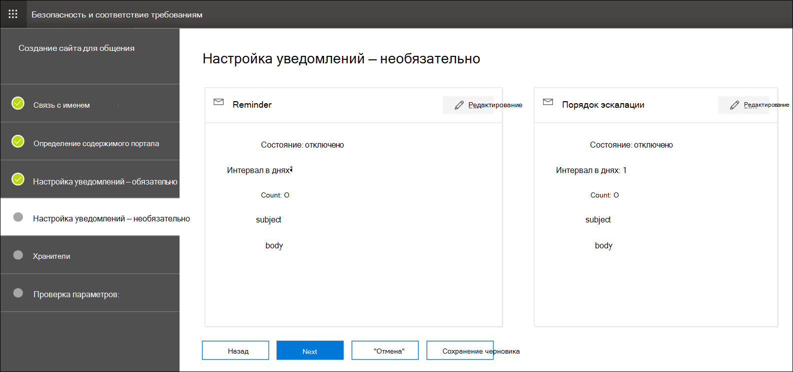

# Создание уведомления о легальном удержании

С Advanced eDiscovery связи с хранителями организации могут управлять своим процессом взаимодействия с хранителями. С помощью средства связи юридические группы могут систематически отправлять, собирать и отслеживать уведомления о удержании. Гибкий процесс создания также позволяет группам настраивать рабочий процесс уведомления о удержании и содержимое уведомлений, отправленных хранителям.

В статье описаны действия в рабочего процесса уведомления о удержании.

## Шаг 1. Указание сведений о связи

Первый шаг — указать соответствующие сведения для юридических уведомлений о удержании или других сообщений хранителя.

1. В Центре & безопасности перейдите в **службу** > Advanced eDiscovery, чтобы отобразить список случаев в организации.

2. Выберите случай, щелкните вкладку **Communications** и нажмите кнопку **Новое сообщение**.

3. На странице **Связи Имя** укажите следующие (необходимые) сведения о связи.

    - **Имя.** Это имя для связи.

    - **Сотрудник по выдаче.** В списке выпаданий отображается список участников дела. Дополнительные сведения о добавлении новых членов в дело см. в Advanced eDiscovery [примере.](create-and-manage-advanced-ediscoveryv2-case.md#create-a-case) Каждое уведомление, отправленные хранителям, будет отправлено от имени указанного сотрудника по выдаче.

> [!NOTE]
> Сотрудник по выдаче должен иметь **активный почтовый ящик** для показа в отсеве сотрудника по выдаче

4. Нажмите кнопку **Далее**.

## Шаг 2. Определение контента портала

Далее можно создать и добавить содержимое уведомления о удержании. На странице **"Определение контента портала"** в **мастере создания** связи укажите содержимое уведомления о удержании. Это содержимое автоматически будет примеся к уведомлениям о выпуске, повторном выпуске, напоминании и эскалации. Кроме того, этот контент появится на портале соответствия требованиям хранителя.

Для создания контента портала:

1. Введите (или вырезать и введите из другого документа) уведомление о удержании в текстовом ящике для контента портала.

2. Вставьте переменные слияния в уведомление, чтобы настроить уведомление и поделиться порталом соответствия требованиям хранителя.

3. Нажмите кнопку **Далее**.

  > [!TIP]
  > Дополнительные материалы о том, как настроить контент и формат контента портала, см. в статью [Использование редактора сообщений.](using-communications-editor.md)

## Шаг 3. Настройка необходимых уведомлений

После определения содержимого уведомления о удержании можно настроить рабочий процесс отправки и управления процессом уведомления. Уведомления — это сообщения электронной почты, которые отправляются для уведомления и последующей связи с хранителями. Каждый хранитель, добавленный в сообщение, получит одно и то же уведомление.

Чтобы настроить и отправить уведомление о удержании, необходимо включить уведомления о выпуске, повторной выдаче и выпуске.

### Уведомление о выдаче

После создания сообщения уведомление  о выдаче инициировал указанный сотрудник по выдаче. Уведомление о выдаче — это первое сообщение, отправленное хранителям для информирования о своих обязательствах по сохранению.

Чтобы создать уведомление о выдаче:

1. В **плитке выдачи** нажмите кнопку **Изменить**.

2. При необходимости добавьте дополнительных членов или сотрудников в **поля Cc** и **Bcc.** Чтобы добавить несколько пользователей в эти поля, разделяйте адреса электронной почты с полу-двоеточием.

3. Укажите **субъект** для уведомления (обязательно).

4. Укажите содержимое или дополнительные инструкции, которые необходимо предоставить хранителям. Содержимое портала, определенное в шаге 2, добавляется в конец уведомления о выдаче.

5. Щелкните **Сохранить**.

### Re-Issuance уведомления

По мере развития дела хранителям может потребоваться сохранить дополнительные или менее данные, чем было поручено ранее. После обновления контента портала отправляется уведомление о повторной выдаче и оповещает хранителей о любых изменениях в их обязательствах по сохранению.

Чтобы создать уведомление о повторной выдаче:

1. В **плитке Reissue** нажмите кнопку **Изменить**.

2. При необходимости добавьте дополнительных членов или сотрудников в **поля Cc** и **Bcc.** Чтобы добавить несколько пользователей в эти поля, разделяйте адреса электронной почты с полу-двоеточием.

3. Укажите **субъект** для уведомления (обязательно).

4. Укажите содержимое или дополнительные инструкции, которые необходимо предоставить хранителям. Содержимое портала, определенное в шаге 2, добавляется в конец уведомления о повторной выдаче.

5. Щелкните **Сохранить**.

> [!NOTE]
> Если содержимое портала изменено  (на странице Определение контента портала в мастере связи **Редактирование),** уведомление о повторной выдаче будет автоматически отправлено всем хранителям, назначенным к уведомлению. После того как уведомление будет отправлено, хранителям будет предложено повторно подтвердить уведомление о удержании. Если вы настроили какие-либо процессы напоминания или эскалации, они также будут повторно запускаться. Дополнительные сведения о том, какие другие события управления случаем вызывают связь, см. в примере [События, которые вызывают уведомления.](#events-that-trigger-notifications)

### Уведомление о выпуске

После решения вопроса или если хранитель больше не подлежит сохранению контента, вы можете освободить хранителя из дела. Если хранителям ранее было выдано уведомление о удержании, уведомление об освобождении может использоваться для оповещения хранителей о том, что они освобождены от своих обязательств.

Чтобы создать уведомление о выпуске:

1. В **плитке выпуска** нажмите кнопку **Изменить**.

2. При необходимости добавьте дополнительных членов или сотрудников в **поля Cc** и **Bcc.** Чтобы добавить несколько пользователей в эти поля, разделяйте адреса электронной почты с полу-двоеточием.

3. Укажите **субъект** для уведомления (обязательно).

4. Укажите содержимое или дополнительные инструкции, которые необходимо предоставить хранителям.

5. Щелкните **Сохранить** и перейти к следующему шагу.

## (Необязательный) Шаг 4. Настройка необязательных уведомлений

Дополнительно можно упростить рабочий процесс для работы с неопровержимыми хранителями, создав и запланируя автоматические уведомления о напоминаниях и эскалации.

### Reminders

После того как вы отправили уведомление о удержании, вы можете следить за неответствовающими хранителями, определяя рабочий процесс напоминания.

Чтобы запланировать напоминания:

1. В **плитке Напоминания** нажмите кнопку **Изменить**.

2. **Включим** рабочий процесс Reminder, включив очки **Status** (необходимые).

3. Укажите интервал **Напоминания (в днях)** (обязательно). Это число дней, которые необходимо подождать перед отправкой первых и последующих уведомлений о напоминаниях. Например, если интервал напоминаний установлен до семи дней, первое напоминание будет отправлено через семь дней после первоначального выпуска уведомления о удержании. Все последующие напоминания также будут отправлены каждые семь дней.

4. Укажите **количество напоминаний** (необходимых). В этом поле указывается количество напоминаний для отправки неоправданным хранителям. Например, если вы установите число напоминаний до 3, то хранитель получит не более трех напоминаний. После того как хранитель признает уведомление о удержании, напоминания больше не будут отправлены этому пользователю.

5. Укажите **субъект** для уведомления (обязательно).

6. Укажите содержимое или дополнительные инструкции, которые необходимо предоставить хранителям. Содержимое портала, определенное в шаге 2, добавляется в конец уведомления о напоминаниях.

7. Щелкните **Сохранить** и перейти на следующий шаг.

### Эскалации

В некоторых ситуациях вам могут потребоваться дополнительные способы для последующей проверки с неотвеживательными хранителями. Если хранитель не признает уведомление о удержании после получения указанного количества напоминаний, группа юристов может указать рабочий процесс, чтобы автоматически отправить уведомление об эскалации хранителю и его руководителю.

Чтобы запланировать эскалации:

1. В **плитке эскалации** нажмите кнопку **Изменить**.

2. Включить рабочий **процесс эскалации,** включив **переключить очки Status.**

3. Укажите **интервал эскалации (в днях)** (обязательно).

4. Укажите **количество эскалаций** (необходимых). В этом поле указывается количество эскалаций для отправки неоправданным хранителям. Например, если вы установите число эскалаций до 3, то уведомление об эскалации будет отправлено хранителям и их руководителю не более трех раз. После того как хранитель признает уведомление о удержании, эскалации больше не будут отправлены.

5. Укажите **субъект** для уведомления (обязательно).

6. Укажите содержимое или дополнительные инструкции, которые необходимо предоставить хранителям. Содержимое портала, определенное в шаге 2, добавляется в конец уведомления об эскалации.

7. Щелкните **Сохранить** и перейти на следующий шаг.

## Шаг 5. Назначение хранителей для получения уведомлений

После завершения подготовки контента для уведомлений выберите хранителей, в которые вы хотите отправить уведомления.

Добавление хранителей:

1. Назначьте хранителей связи, щелкнув рядом с их именем почтовый ящик.

    После создания сообщения рабочий процесс уведомления автоматически применяется к выбранным хранителям.

2. Нажмите **кнопку Далее,** чтобы просмотреть параметры и сведения о связи.

> [!NOTE]
> Вы можете добавить только хранителей, которые были добавлены в дело и не были отправлены еще одно уведомление в случае.

## Шаг 6. Параметры обзора

После просмотра параметров и нажмите **кнопку Отправить,** чтобы завершить сообщение, система автоматически запустит рабочий процесс связи, отправив уведомление о выдаче.

## События, запуская уведомления

В следующей таблице описываются события в процессе управления случаем, которые запускают при отправлении разных типов уведомлений хранителям.

|Тип связи|Триггер |
|:---------|:---------|
|Уведомления о выдаче|Начальное создание уведомления. Вы также можете вручную повторное уведомление о удержании. |
|Уведомления о повторной выдаче|Обновление контента портала на странице **Определение контента портала** в **мастере редактирования коммуникации.**|
|Уведомления о выпуске|Хранитель освобожден из дела.|
|Reminders|Интервал и количество напоминаний, настроенных для напоминания.|
|Эскалации|Интервал и количество напоминаний, настроенных для эскалации.|
|||
