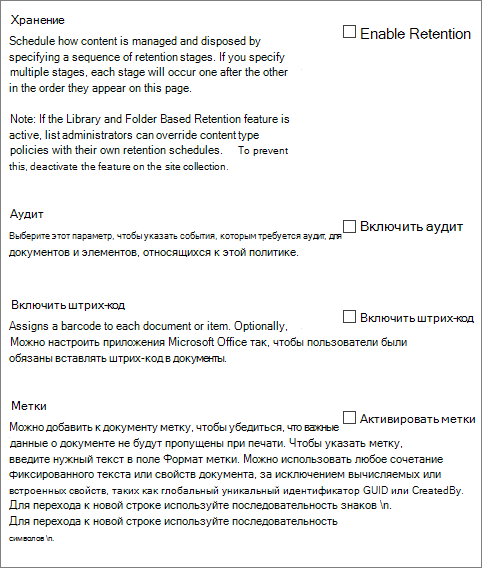
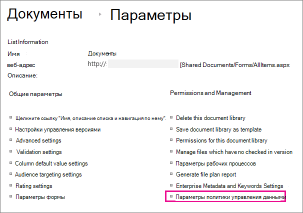

# Создание и применение политик управления сведениями

Политики управления информацией позволяют организации контролировать время сохранения контента, проверять, что люди делают с содержимым, а также добавлять штрихкоды или метки в документы. Политика может помочь обеспечить соблюдение правовых и правительственных правил или внутренних бизнес-процессов. В качестве администратора можно настроить политику, чтобы контролировать отслеживание документов и сроки сохранения документов.

Вы можете создать политику управления информацией в трех разных расположениях иерархии сайтов, от самых широких до самых узких:

- Создайте политику, используемую для нескольких типов контента в коллекции сайтов.
- Создайте политику для типа контента сайта.
- Создайте политику для списка или библиотеки.

Дополнительные сведения см. [в обзоре Введение в политики управления информацией.](intro-to-info-mgmt-policies.md)

## Создание политики для нескольких типов контента в коллекции сайтов

Чтобы обеспечить применение информационной политики во всех документах определенного типа в коллекции сайтов, рассмотрите возможность создания политики на уровне коллекции сайтов, а затем применяйте политику к типам контента. Они называются политиками коллекции сайтов.

1. На домашней странице \> **коллекции сайтов Параметры**  \> **Параметры сайта**.

    На веб-SharePoint, связанном с группой, щелкните **Параметры,** щелкните содержимое сайта **и** нажмите кнопку **Site Параметры**.

2. На странице Параметры сайте, в **статье Шаблоны** политики типов типов контента администрирования веб-сайтов. \> 

   

3. На странице Создание \> **политик**.

4. Введите имя и описание политики, а затем напишите краткое заявление о политике, которое объясняет пользователям, для чего эта политика.

5. В следующем разделе о создании политик для типа контента сайта см. в разделе Настройка функций, которые необходимо связать с политикой.

6. Нажмите кнопку **OK**.

## Создание политики для типа контента сайта

Добавление политики управления информацией в тип контента упрощает связывать функции политики с несколькими списками или библиотеками. Вы можете добавить существующую политику управления информацией в тип контента или создать уникальную политику, специфическая для отдельного типа контента.

 Вы также можете добавить политику управления информацией в тип контента, который специфичн для списков. Это влияет на применение политики только к пунктам в этом списке, использующим тип контента.

1. На домашней странице \> **коллекции сайтов Параметры**  \> **Параметры сайта**.

    На веб-SharePoint, связанном с группой, щелкните **Параметры,** щелкните содержимое сайта **и** нажмите кнопку **Site Параметры**.

2. На странице Сайт Параметры, в **веб-дизайнерских галереях** \> **типы контента сайта**.

   

3. На странице Тип контента Параметры выберите тип контента, к который необходимо добавить политику.

4. На странице Тип контента сайта в **Параметры** параметры политики \> **управления информацией**.

5. На странице Политика редактирования введите имя и описание политики, а затем напишите краткое описание, которое объясняет пользователям, для чего эта политика.

6. В следующих разделах выберите отдельные функции политики, которые необходимо добавить в политику управления информацией.

   

7. Чтобы указать период хранения документов и элементов, которые подлежат этой политике, выберите Включить **хранение,** а затем указать период хранения и действия, которые необходимо сделать по истечении срока действия элементов.

   Чтобы указать период хранения:

   1. Выберите **Добавить этап хранения для записей.**

   2. Выберите параметр периода хранения, чтобы указать, когда истекает срок действия документов или элементов. Выполните одно из следующих действий:
      - Чтобы установить дату истечения срока действия на основе свойства даты, в соответствии с **событием** Этот этап основан на свойстве даты элемента, а затем выберите действие документа или элемента (например, Созданный или Измененный) и время после этого действия (например, количество дней, месяцев или лет), когда вы хотите, чтобы элемент \> истек.
      - Чтобы использовать настраиваемую формулу хранения для определения срока действия, выберите **Set by a custom retention formula installed on this server.**

        > [!NOTE]
        > Этот параметр доступен только в том случае, если администратор настраивает настраиваемую формулу.

   3. Параметр **Start a workflow** доступен только в том случае, если вы определяете политику для списка, библиотеки или типа контента, который уже имеет связанный с ним рабочий процесс. Затем вам будет предоставлен выбор рабочего процесса на выбор.

   4. В разделе **Повторение** выберите **Повторите действие этого этапа...** и введите, как часто необходимо повторить действие.

      > [!NOTE]
      >  Этот параметр доступен только в том случае, если выбранное действие можно повторить. Например, нельзя установить повторение для действия **Permanently Delete**.

   5. Выбор **ОК**.

8. Чтобы включить аудит документов и элементов, которые подлежат этой политике, выберите **Включить** аудит, а затем указать события, которые необходимо аудитировать.

   Чтобы включить аудит:

   1. На странице Политика редактирования в статье **Аудит** выберите **Включить** аудит, а затем выберите флажки рядом с событиями, для которые необходимо сохранить след аудита.

   2. Чтобы побудить пользователей вставить эти штрихкоды в документы, выберите "Подсказывать" пользователям вставить **штрих-код перед сохранением или печатью.**

   3. Выберите **ОК,** чтобы применить функцию аудита к политике.

   Функция Политики аудита позволяет организациям создавать и анализировать маршруты аудита для документов и перечислять такие элементы, как списки задач, списки вопросов, группы обсуждений и календари. Данная функция предоставляет журнал аудита, в котором записываются такие события, как даты просмотра, изменения или удаления контента.

   Если аудит включен в рамках политики управления информацией, администраторы могут просматривать данные аудита в отчетах об использовании политики, основанных на Microsoft Excel и обобщающих текущее использование. Администраторы могут использовать данные отчеты для просмотра процесса использования информации внутри организации. Эти отчеты также могут помочь организациям проверять и документировать их соответствие нормативным требованиям или исследовать возможные проблемы.

   В журнале аудита записывается следующая информация: название события, его дата и время, системное имя пользователя, выполнившего действия.

9. Если штрихкоды включены в рамках политики, они добавляются в свойства документа и отображаются в области заголовки документа, к которому применяется штрихкод. Как и метки, штрих-коды также можно удалить вручную из документа. Можно указать, следует ли пользователям включать штрих-код при печати или сохранении элемента или вставлять штрихкод вручную с помощью вкладки **Insert** в 2010 г. Office программах выпуска.

   Чтобы включить штрихкоды:

   1. На странице **Изменить политику** под **штрихкодами** выберите **Включить штрихкоды**.

   2. Чтобы побудить пользователей вставить эти штрихкоды в документы, выберите "Подсказывать" пользователям вставить **штрих-код перед сохранением или печатью.**

   3. Выберите **ОК,** чтобы применить функцию штрихкода к политике.

   Политика штрихкодов создает стандартные штрихкоды Code 39. Каждое изображение штрихкода содержит текст ниже символа штрихкода, который представляет значение штрихкода. Это позволяет использовать данные штрихкода даже в том случае, если оборудование для сканирования не доступно. Пользователи могут вручную ввести номер штрихкода в поле поиска, чтобы найти элемент на сайте.    |

10. Чтобы требовать, чтобы документы, подавлимые для этой политики, были метки, выберите **Включить** метки, а затем указать параметры, которые нужны для меток.

    Чтобы включить метки:

    1. Чтобы потребовать от пользователей добавить метку в документ, выберите "Подсказок", чтобы вставить метку **перед сохранением или печатью.**

       > [!NOTE]
       > Чтобы метки использовались по желанию, не устанавливайте флажок. 

    2. Чтобы заблокировать метку, чтобы она не была изменена после вставки, выберите Предотвращение изменений меток **после их добавления.**

       Этот параметр предотвращает обновление текста метки после вставки метки в элемент в клиентских приложениях, таких как Word, Excel или PowerPoint. Чтобы метки обновлялись при обновлении свойств документа или элемента, не устанавливайте флажок.

    3. В поле формата Label введите текст метки так, как вы хотите, чтобы она отображалась. Метки могут содержать до 10 ссылок столбцов, каждая из которых может иметь до 255 символов. Чтобы создать формат для метки, сделайте следующие действия:
       - Введите имена столбцов, которые необходимо включить в метку в порядке их появления. Прикрепить имена столбцов в фигурные скобки (), как показано {} в примере на странице Политика редактирования.
       - Введите слова для определения столбцов за скобками, как показано в примере на странице Политика редактирования.

    4. Чтобы добавить разрыв строки, **введите\n,** где должен появиться разрыв строки.

    5. Выберите нужный размер и стиль шрифта и укажите, хотите ли вы, чтобы метка была размещена влево, в центре или вправо в документе.

       Выберите шрифт и стиль из набора имеющихся на компьютере пользователя. Размер шрифта влияет на объем текста, отображаемого в метке.

    6. Введите высоту и ширину метки. Высота и ширина метки могут варьироваться от 0,25 до 20 дюймов. Текст метки всегда центрирован по вертикали в пределах ее изображения.

    7. Выберите **Обновление,** чтобы просмотреть содержимое метки.

11. Нажмите кнопку **OK**.

## Создание политики для списка, библиотеки или папки (политика хранения в зависимости от местоположения)

Можно определить политику хранения, которая применяется только к определенному списку, библиотеке или папке. Однако, если вы создаете политику хранения таким образом, вы не можете повторно использовать эту политику в других списках, библиотеках, папках или сайтах, и вы не можете применить политику сбора веб-сайтов к политике, основанной на расположении.

Если вы хотите применить единую политику хранения для всех типов контента в одном расположении, скорее всего, вы захотите использовать хранение на основе расположения. В большинстве других случаев необходимо убедиться, что политика хранения указана для всех типов контента.

Каждый подмастерье наследует политику хранения своего родителя, если вы не решите разорвать наследование и определить новую политику хранения на уровне ребенка.

Если требуется определить политику управления информацией, помимо хранения в списке или библиотеке, необходимо определить политику управления информацией для каждого отдельного типа контента списка, связанного с этим списком или библиотекой.

Если в какой-либо момент вы решите перейти от типа контента к политикам на основе расположения для списка или библиотеки, в качестве политики на основе расположения будет использоваться только политика хранения. Все другие политики управления (аудиты, штрихкоды и штрихкоды) будут унаследованы от связанных типов контента.

Политики на основе расположения можно отключить для коллекции сайтов, отключив функцию хранения библиотек и папок. Это позволяет администраторам коллекции сайтов гарантировать, что политики типов контента не переопределяются политиками расположения администратора списка.

Для изменения параметров политики управления информацией для списка или библиотеки требуется по крайней мере разрешение "Управление списками".

1. Перейдите к списку или библиотеке, для которой необходимо указать политику управления информацией.

2. На ленте выберите библиотеку **библиотеки** или вкладки **List** \> **Library Параметры** **или List Параметры**.

   В SharePoint Online щелкните **Параметры,** а затем нажмите параметры списка **или** **параметры библиотеки.**

3. В **соответствии с настройками политики управления** сведениями и \> **разрешениями.**

   

4. На странице Политика управления Параметры убедитесь, что источник хранения для списка или библиотеки установлен в библиотеке и папках.

   Если **тип контента** отображается в качестве источника, щелкните **Источник изменений** и нажмите кнопку Библиотека и **папки**. Вы предупреждены, что политики хранения типов контента будут игнорироваться. Нажмите кнопку **OK**.

5. На странице Политика редактирования в **статье Расписание** хранения на основе библиотеки введите краткое описание создаемой политики.

6. Выберите **Добавить этап хранения...**

   Обратите внимание, что в статье Records можно определить различные политики хранения записей, выбрав для записей различные этапы хранения.

7. В диалоговом окантове свойства stage выберите параметр периода хранения, чтобы указать, когда истекает срок действия документов или элементов. Выполните одно из указанных ниже действий.

   - Чтобы установить дату истечения срока действия на основе свойства даты, в соответствии с **событием** Этот этап основан на свойстве даты элемента, а затем выберите действие документа или элемента (например, Созданный или Измененный) и время после этого действия (например, количество дней, месяцев или лет), когда вы хотите, чтобы элемент \> истек.

   - Чтобы использовать настраиваемую формулу хранения для определения срока действия, выберите **Set by a custom retention formula installed on this server.**

     > [!NOTE]
     >  Этот параметр доступен только в том случае, если администратор настраивает настраиваемую формулу.

   - В **статье Действие** укажите, что необходимо сделать, когда истекает срок действия документа или элемента. Чтобы включить определенное действие, которое должно произойти с документом или элементом (например, удаление), выберите действие из списка.

8. Параметр **Start a workflow** доступен только в том случае, если вы определяете политику для списка, библиотеки или типа контента, который уже имеет связанный с ним рабочий процесс. Затем вам будет предоставлен выбор рабочего процесса на выбор.

9. В **статье Recurrence** выберите **Повторите действие этого этапа...** и введите, как часто необходимо повторить действие.

   > [!NOTE]
   >  Этот параметр доступен только в том случае, если выбранное действие можно повторить. Например, нельзя установить повторение для действия **Permanently Delete**.

10. Нажмите кнопку **OK**.

## Применение политики коллекции сайтов к типу контента

Если политики управления информацией уже созданы для вашего сайта в качестве политик коллекции сайтов, можно применить одну из политик к типу контента. При этом можно применить ту же политику к нескольким типам контента в коллекции сайтов, которые не имеют одного родительского типа контента.

 Если вы хотите применить политики к нескольким типам контента в коллекции сайтов и настроить службу управляемых метаданных, вы можете использовать публикацию типа контента для публикации политик управления информацией в нескольких коллекциях сайтов. Дополнительные сведения см. в разделе Применение политики [в коллекциях](#apply-a-policy-across-site-collections) сайтов.

1. Перейдите к списку или библиотеке, в которой содержится тип контента, к которому необходимо применить политику.

2. На ленте выберите библиотеку **библиотеки** или вкладки **List** \> **Library Параметры** **или List Параметры**.

   В SharePoint Online щелкните **Параметры,** а затем нажмите параметры списка **или** **параметры библиотеки.**

3. В **соответствии с настройками политики управления** сведениями и \> **разрешениями.**

   

4. Убедитесь, что источник политики установлен для  типов контента, и в соответствии с политиками типа контента выберите тип контента, к который необходимо применить политику.

5. В **статье Укажите политику** Используйте политику сбора \> **веб-сайтов,** а затем выберите политику, которую необходимо применить из списка.

   > [!NOTE]
   >  Если **параметр Use a site collection policy** не доступен, политики коллекции сайтов не определены для коллекции сайтов.

6. Нажмите кнопку **OK**.

   Если список или библиотека, с которыми вы работаете, поддерживает управление несколькими типами контента, в статье **Типы** контента можно выбрать тип контента, для которого необходимо указать политику управления информацией. Это позволит вам напрямую перейти на шаг 5 выше.

## Применение политики в коллекциях сайтов

Совместное использование типов контента в коллекциях сайтов с помощью приложения-службы управляемых метаданных для настройка публикации типа контента. Публикация типа контента помогает последовательно управлять контентом и метаданными на сайтах, так как типы контента можно создавать и обновлять централизованно, а обновления можно публиковать в нескольких подписав коллекциях сайтов или веб-приложениях.

## Создание шаблона из существующей политики для использования в различных коллекциях сайтов

Можно определить политику управления информацией, а затем создать из нее шаблон для использования по мере необходимости в нескольких коллекциях сайтов. Этот метод можно использовать, если вы хотите иметь резервное копирование политик информации, или он также может использоваться в качестве альтернативного метода для использования публикации типа контента для применения одной политики в коллекциях сайтов. Вы создаете шаблон или резервное копирование политики, экспортируете политику из одной коллекции сайтов, а затем импортируете ее в сохраненное расположение или в другую коллекцию сайтов.

> [!IMPORTANT]
> Если вы используете функцию экспорта и импорта как способ создать набор шаблонов политики, имейте в виду, что уникальный идентификатор существует в файле политики .xml. Из-за этого нельзя импортировать эту политику на сайт несколько раз без изменения этого уникального идентификатора.

### Экспорт политики

1. На домашней странице коллекции сайтов **выберите** Параметры Параметры, которое заняло место сайта  \> **Параметры**.

   На веб-SharePoint, связанном с группой, щелкните **Параметры,** щелкните содержимое сайта **и** нажмите кнопку **Site Параметры**.

2. На странице Параметры сайте, в **статье Шаблоны** политики типов типов контента администрирования веб-сайтов. \> 

   

3. Выберите политику, которая будет экспортировать \> прокрутку в нижний \> **экспорт.**

4. При запросе на сохранение или открытие файла выберите **Сохранить,** а затем выберите расположение, чтобы сохранить файл. Обязательно выберите расположение, доступное для коллекций сайтов, импортируемых политики.

5. Когда отображается диалоговое окно Download Complete, выберите **Close**.

### Импорт политики в другую коллекцию сайтов

Импорт политики управления информацией позволяет применять ее к нескольким типам контента на уровне сайта или списка в любой коллекции сайтов. Преимущества этого двео: вам не нужно переопределять и применять политику для каждого типа контента, и вы можете более легко управлять изменениями политики, внося изменения в политику только в одном месте.

1. На домашней странице коллекции сайтов, к которой необходимо применить политику, выберите Параметры small Параметры, которое заняло место site  \> **Site Параметры**.

   На веб-SharePoint, связанном с группой, щелкните **Параметры,** щелкните содержимое сайта **и** нажмите кнопку **Site Параметры**.

2. На странице Параметры сайте, в **статье Шаблоны** политики типов типов контента администрирования веб-сайтов. \> 

3. На странице Импорт политик \> **просмотрите,** чтобы \>  найти XML-файл для политики.

4. Выберите XML-файл, в котором сохранена политика \> **Open.**

5. На странице Импорт политики сбора веб-сайтов \> **импорт** для добавления политики в коллекцию сайтов.

Теперь импортная политика может применяться к одному или многим типам контента на уровне сайта или списка.

Политики управления информацией позволяют организации контролировать время сохранения контента, проверять, что люди делают с содержимым, а также добавлять штрихкоды или метки в документы. Политика может помочь обеспечить соблюдение правовых и правительственных правил или внутренних бизнес-процессов. В качестве администратора можно настроить политику, чтобы контролировать отслеживание документов и сроки сохранения документов.

Вы можете создать политику управления информацией в трех разных расположениях иерархии сайтов, от самых широких до самых узких:

- Создайте политику, используемую для нескольких типов контента в коллекции сайтов.
- Создайте политику для типа контента сайта.
- Создайте политику для списка или библиотеки.

Дополнительные сведения см. [в обзоре Введение в политики управления информацией.](intro-to-info-mgmt-policies.md)
