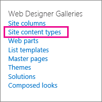

# Создание и применение политик управления сведениямиCreate and apply information management policies

Политики управления информацией позволяют организации контролировать время сохранения контента, проверять, что люди делают с содержимым, а также добавлять штрихкоды или метки в документы.Information management policies enable your organization to control how long to retain content, to audit what people do with content, and to add barcodes or labels to documents. Политика может помочь обеспечить соблюдение правовых и правительственных правил или внутренних бизнес-процессов.A policy can help enforce compliance with legal and governmental regulations or internal business processes. В качестве администратора можно настроить политику, чтобы контролировать отслеживание документов и сроки сохранения документов.As an administrator, you can set up a policy to control how to track documents and how long to retain documents.
  
Вы можете создать политику управления информацией в трех разных расположениях иерархии сайтов, от самых широких до самых узких:You can create an information management policy can at three different locations in the site hierarchy, from the broadest to the narrowest:
  
- Создайте политику, используемую для нескольких типов контента в коллекции сайтов.Create a policy to use on multiple content types within a site collection.
    
- Создайте политику для типа контента сайта.Create a policy for a site content type.
    
- Создайте политику для списка или библиотеки.Create a policy for a list or library.
    
Дополнительные сведения см. [в обзоре Введение в политики управления информацией.](intro-to-info-mgmt-policies.md)For more information, see [Introduction to information management policies](intro-to-info-mgmt-policies.md).
  
## Создание политики для нескольких типов контента в коллекции сайтовCreate a policy for multiple content types within a site collection

Чтобы обеспечить применение информационной политики во всех документах определенного типа в коллекции сайтов, рассмотрите возможность создания политики на уровне коллекции сайтов, а затем применяйте политику к типам контента.To ensure that an information policy is applied to all documents of a certain type within a site collection, consider creating the policy at the site collection level and then later apply the policy to content types. Они называются политиками коллекции сайтов.These are referred to as site collection policies. 
  
1. На домашней странице \> **коллекции сайтов Параметры** On the site collection home page \> **Settings** \> **Параметры сайта**.\> **Site Settings**.
    
    На веб-SharePoint, связанном с группой, щелкните **Параметры,** щелкните содержимое сайта **и** нажмите кнопку **Site Параметры**.In a SharePoint group-connected site, click **Settings**, click **Site Contents**, and then click **Site Settings**. 
    
2. На странице Параметры сайте, в **статье Шаблоны** политики типов типов контента администрирования веб-сайтов. \> On the Site Settings page, under **Site Collection Administration** \> **Content Type Policy Templates**. 
  

  
3. На странице Создание \> **политик**.On the Policies page \> **Create**. 
    
4. Введите имя и описание политики, а затем напишите краткое заявление о политике, которое объясняет пользователям, для чего эта политика.Enter a name and description for the policy, and then write a brief policy statement that explains to users what the policy is for.
    
5. В следующем разделе о создании политик для типа контента сайта см. в разделе Настройка функций, которые необходимо связать с политикой.See the next section on creating policies for a site content type to learn how to set up the features you want to associate with the policy. 
    
6. Нажмите кнопку **OK**.Choose **OK**.
    
## Создание политики для типа контента сайтаCreate a policy for a site content type

Добавление политики управления информацией в тип контента упрощает связывать функции политики с несколькими списками или библиотеками.Adding an information management policy to a content type makes it easy to associate policy features with multiple lists or libraries. Вы можете добавить существующую политику управления информацией в тип контента или создать уникальную политику, специфическая для отдельного типа контента.You can choose to add an existing information management policy to a content type or create a unique policy specific to an individual content type.
  
 Вы также можете добавить политику управления информацией в тип контента, который специфичн для списков.You can also add an information management policy to a content type that is specific to lists. Это влияет на применение политики только к пунктам в этом списке, использующим тип контента.This has the effect of applying the policy only to items in that list that are using the content type. 
  
1. На домашней странице \> **коллекции сайтов Параметры** On the site collection home page \> **Settings** \> **Параметры сайта**.\> **Site Settings**.
    
    На веб-SharePoint, связанном с группой, щелкните **Параметры,** щелкните содержимое сайта **и** нажмите кнопку **Site Параметры**.In a SharePoint group-connected site, click **Settings**, click **Site Contents**, and then click **Site Settings**. 
    
2. На странице Сайт Параметры, в **веб-дизайнерских галереях** \> **типы контента сайта**.On the Site Settings page, under **Web Designer Galleries** \> **Site content types**.
  

  
3. На странице Тип контента Параметры выберите тип контента, к который необходимо добавить политику.On the Site Content Type Settings page, select the content type that you want to add a policy to.
    
4. На странице Тип контента сайта в **Параметры** параметры политики \> **управления информацией**.On the Site Content Type page, under **Settings** \> **Information management policy settings**.
    
5. На странице Политика редактирования введите имя и описание политики, а затем напишите краткое описание, которое объясняет пользователям, для чего эта политика.On the Edit Policy page, enter a name and description for the policy, and then write a brief description that explains to users what the policy is for.
    
6. В следующих разделах выберите отдельные функции политики, которые необходимо добавить в политику управления информацией.In the next sections, select the individual policy features that you want to add to your information management policy. 
  

  
7. Чтобы указать период хранения документов и элементов, которые подлежат этой политике, выберите Включить **хранение,** а затем указать период хранения и действия, которые необходимо сделать по истечении срока действия элементов.To specify a retention period for documents and items that are subject to this policy, choose **Enable Retention**, and then specify the retention period and the actions that you want to occur when the items expire.
    
    Указать период храненияTo specify a retention period
    
||||||**1.****1.**|\*\*Выберите \*\*Добавить этап хранения записей...\*\*\*\*\*\*Choose \*\*Add a retention stage for records…\*\*\*\*|
|:-----|:-----|:-----|:-----|:-----|:-----|:-----|
||||||2.2.    | Выберите параметр периода хранения, чтобы указать, когда истекает срок действия документов или элементов.Select a retention period option to specify when documents or items are set to expire. Выполните одно из следующих действий.Do one of the following:     Чтобы установить дату истечения срока действия на основе свойства даты, в соответствии с **событием** Этот этап основан на свойстве даты элемента, а затем выберите действие документа или элемента (например, Созданный или Измененный) и время после этого действия (например, количество дней, месяцев или лет), когда вы хотите, чтобы элемент \> истек.To set the expiration date based on a date property, under **Event** \> **This stage is based off a date property on the item**, and then select the document or item action (for example, Created or Modified) and the increment of time after this action (for example, the number of days, months, or years) when you want the item to expire.     Чтобы использовать настраиваемую формулу хранения для определения срока действия, выберите **Set by a custom retention formula installed on this server.**To use a custom retention formula to determine expiration, choose **Set by a custom retention formula installed on this server**.    > [!NOTE]> этот параметр доступен только в том случае, если администратор настраивает настраиваемую формулу.> [!NOTE]>  This option is only available if a custom formula has been set up by your administrator.           |
||||||3.3.    |Параметр **Start a workflow** доступен только в том случае, если вы определяете политику для списка, библиотеки или типа контента, который уже имеет связанный с ним рабочий процесс.The **Start a workflow** option is available only if you are defining a policy for a list, library, or content type that already has a workflow associated with it. Затем вам будет предоставлен выбор рабочего процесса на выбор.You will then be given a choice of workflows to choose from.    |
||||||4.4.    |В разделе **Повторение** выберите **Повторите действие этого этапа...** и введите, как часто необходимо повторить действие.In the **Recurrence** section, select **Repeat this stage's action…** and enter how often you want the action to reoccur.    > [!NOTE]> Этот параметр доступен только в том случае, если выбранное действие можно повторить.> [!NOTE]>  This option is only available if the action you selected can be repeated. Например, нельзя установить повторение для действия **Permanently Delete**.For example, you cannot set recurrence for the action **Permanently Delete**.           |
||||||5.5.    |Выбор **ОК**.Chose **OK**.    |
   
1. Чтобы включить аудит документов и элементов, которые подлежат этой политике, выберите **Включить** аудит, а затем указать события, которые необходимо аудитировать.To enable auditing for the documents and items that are subject to this policy, choose **Enable Auditing**, and then specify the events you want to audit.
    
    Включить аудитTo enable auditing
    
||||||1.\*\*\*\*\*\*\*\*1.\*\*\*\*|На странице Изменить политику\*\*\* в статье Аудит включить аудит \*\*, а затем выберите флажки рядом с событиями, которые необходимо сохранить для   **\>**  аудита.\*\*\*\*\*\*\*\*On the Edit Policy page,\*\* **under** **Auditing** **\>** **Enable auditing** \*\*, and then select the check boxes next to the events you want to keep an audit trail for.\*\*\*\*|
|:-----|:-----|:-----|:-----|:-----|:-----|:-----|
||||||**2.****2.**   |**Чтобы побудить пользователей вставить эти штрихкоды**  в документы, выберите "Подсказывать" пользователям вставить штрих-код **перед сохранением или печатью.** **To prompt users to insert these barcodes into documents,** **choose** **Prompt users to insert a barcode before saving or printing** **.**   |
||||||**3.****3.**   |**Выберите** **ОК** \*\* для применения функции аудита к политике.**Choose** **OK** \*\* to apply the auditing feature to the policy. **   |
|||||||Функция Политики аудита позволяет организациям создавать и анализировать маршруты аудита для документов и перечислять такие элементы, как списки задач, списки вопросов, группы обсуждений и календари.The Auditing Policy feature enables organizations to create and analyze audit trails for documents and to list items such as task lists, issues lists, discussion groups, and calendars. Данная функция предоставляет журнал аудита, в котором записываются такие события, как даты просмотра, изменения или удаления контента.This policy feature provides an audit log that records events, such as when content is viewed, edited, or deleted.    |
|||||||Если аудит включен в рамках политики управления информацией, администраторы могут просматривать данные аудита в отчетах об использовании политики, основанных на Microsoft Excel и обобщающих текущее использование.When auditing is enabled as part of an information management policy, administrators can view the audit data in policy usage reports that are based in Microsoft Excel and that summarize current usage. Администраторы могут использовать данные отчеты для просмотра процесса использования информации внутри организации.Administrators can use these reports to determine how information is being used within the organization. Эти отчеты также могут помочь организациям проверять и документировать их соответствие нормативным требованиям или исследовать возможные проблемы.These reports can also help organizations to verify and document their regulatory compliance or to investigate potential concerns.    |
|||||||В журнале аудита записывается следующая информация: название события, его дата и время, системное имя пользователя, выполнившего действия.The audit log records the following information: event name, date and time of the event, and system name of the user who performed the action.    |
   
1. Если штрихкоды включены в рамках политики, они добавляются в свойства документа и отображаются в области заголовки документа, к которому применяется штрихкод.When barcodes are enabled as part of a policy, they are added to document properties and displayed in the header area of the document to which the barcode is applied. Как и метки, штрих-коды также можно удалить вручную из документа.Like labels, barcodes can also be manually removed from a document. Можно указать, следует ли пользователям включать штрих-код при печати или сохранении элемента или вставлять штрихкод вручную с помощью вкладки **Insert** в 2010 г. Office программах выпуска.You can specify whether users should be prompted to include the barcode when printing or saving an item or if the barcode should be inserted manually using the **Insert** tab in 2010 Office release programs. 
    
    Включить штрихкодыTo enable barcodes
    
||||||1.\*\*\*\*\*\*\*\*1.\*\*\*\*|**На странице Изменить политику в статье **Штрихкоды** \> **Включить штрихкоды**.****On the Edit Policy page, under **Barcodes**\> **Enable Barcodes**.**|
|:-----|:-----|:-----|:-----|:-----|:-----|:-----|
||||||**2.****2.**   |Чтобы побудить пользователей вставить эти штрихкоды в документы, выберите "Подсказывать" пользователям вставить **штрих-код перед сохранением или печатью.**To prompt users to insert these barcodes into documents, choose **Prompt users to insert a barcode before saving or printing**.    |
||||||**3.****3.**   |Выберите **ОК,** чтобы применить функцию штрихкода к политике.Choose **OK** to apply the barcode feature to the policy.    |
|||||||
 Политика штрихкодов создает стандартные штрихкоды Code 39.The barcode policy generates Code 39 standard barcodes. Каждое изображение штрихкода содержит текст ниже символа штрихкода, который представляет значение штрихкода.Each barcode image includes text below the barcode symbol that represents the barcode value. Это позволяет использовать данные штрихкода даже в том случае, если оборудование для сканирования не доступно.This enables the barcode data to be used even when scanning hardware is not available. Пользователи могут вручную ввести номер штрихкода в поле поиска, чтобы найти элемент на сайте.Users can manually type the barcode number into the search box to locate the item on a site.    |
   
1. Чтобы требовать, чтобы документы, подавлимые для этой политики, были метки, выберите **Включить** метки, а затем указать параметры, которые нужны для меток.To require that documents that are subject to this policy have labels, choose **Enable Labels**, and then specify the settings that you want for the labels.
    
    Включить меткиTo enable labels
    
||||||**1.****1.**|\*\*Чтобы потребовать от пользователей добавить метку в документ, выберите Запрос пользователей, чтобы вставить метку **перед сохранением или печатью.**\*\*To require users to add a label to a document, choose **Prompt users to insert a label before saving or printing**.    > [!NOTE]> Если вы хотите, чтобы метки были необязательными, не выберите этот контрольный ящик.> [!NOTE]>  If you want labels to be optional, do not select this check box.        **|
|:-----|:-----|:-----|:-----|:-----|:-----|:-----|
||||||2.2.    |Чтобы заблокировать метку, чтобы она не была изменена после вставки, выберите Предотвращение изменений меток **после их добавления.**To lock a label so that it cannot be changed after it has been inserted, choose **Prevent changes to labels after they are added**.     Этот параметр предотвращает обновление текста метки после вставки метки в элемент в клиентских приложениях, таких как Word, Excel или PowerPoint.This setting prevents the label text from updating once the label has been inserted into an item within a client application such as Word, Excel, or PowerPoint. Чтобы метки обновлялись при обновлении свойств документа или элемента, не устанавливайте флажок.If you want the label to be updated when the properties for this document or item are updated, do not select this check box.    |
||||||3.3.    |В поле формата Label введите текст метки так, как вы хотите, чтобы она отображалась.In the Label format box, enter the text for the label as you want it to be displayed. Метки могут содержать до 10 ссылок столбцов, каждая из которых может иметь до 255 символов.Labels can contain up to 10 column references, each of which can be up to 255 characters long. Чтобы создать формат для метки, сделайте следующее:To create the format for your label, do the following:    Введите имена столбцов, которые необходимо включить в метку в порядке их появления.Type the names of the columns that you want to include in the label in the order in which you want them to appear. Прикрепить имена столбцов в фигурные скобки (), как показано {} в примере на странице Политика редактирования.Enclose the column names in curly brackets ({}), as shown in the example on the Edit Policy page.    Введите слова для определения столбцов за скобками, как показано в примере на странице Политика редактирования.Type words to identify the columns outside the brackets, as shown in the example on the Edit Policy page.    |
||||||4.4.    |Чтобы добавить разрыв строки, **введите\n,** где должен появиться разрыв строки.To add a line break, enter **\n** where you want the line break to appear.    |
||||||5.5.    |Выберите нужный размер и стиль шрифта и укажите, хотите ли вы, чтобы метка была размещена влево, в центре или вправо в документе.Select the font size and style that you want, and specify whether you want the label positioned left, center, or right within the document.     Выберите шрифт и стиль из набора имеющихся на компьютере пользователя.Select a font and style that are available on the users' computers. Размер шрифта влияет на объем текста, отображаемого в метке.The size of the font affects how much text can be displayed on the label.    |
||||||6.6.    |Введите высоту и ширину метки.Enter the height and width of the label. Высота и ширина метки могут варьироваться от 0,25 до 20 дюймов.Label height can range from .25 inches to 20 inches, and label width can range from .25 inches to 20 inches. Текст метки всегда центрирован по вертикали в пределах ее изображения.Label text is always vertically centered within the label image.    |
||||||7.7.    |Выберите **Обновление,** чтобы просмотреть содержимое метки.Choose **Refresh** to preview the label content.    |
   
1. Нажмите кнопку **OK**.Choose **OK**.
    
## Создание политики для списка, библиотеки или папки (политика хранения в зависимости от местоположения)Create a policy for a list, library or folder (location-based retention policy)

Можно определить политику хранения, которая применяется только к определенному списку, библиотеке или папке.You can define a retention policy that applies only to a specific list, library or folder. Однако, если вы создаете политику хранения таким образом, вы не можете повторно использовать эту политику в других списках, библиотеках, папках или сайтах, и вы не можете применить политику сбора веб-сайтов к политике, основанной на расположении.However, if you create a retention policy this way, you cannot reuse this policy on other lists, libraries, folders or sites, and you cannot apply a site collection policy to a location based policy.
  
Если вы хотите применить единую политику хранения для всех типов контента в одном расположении, скорее всего, вы захотите использовать хранение на основе расположения.If you want to apply a single retention policy to all types of content in a single location, you will most likely want to use location-based retention. В большинстве других случаев необходимо убедиться, что политика хранения указана для всех типов контента.In most other cases, you will want to verify that a retention policy is specified for all content types.
  
 Каждый подмастерье наследует политику хранения своего родителя, если вы не решите разорвать наследование и определить новую политику хранения на уровне ребенка.Each subfolder inherits the retention policy of its parent, unless you choose to break inheritance and define a new retention policy at the child level. 
  
Если требуется определить политику управления информацией, помимо хранения в списке или библиотеке, необходимо определить политику управления информацией для каждого отдельного типа контента списка, связанного с этим списком или библиотекой.If you want to define an information management policy other than retention to a list or library, you need to define an information management policy for each individual list content type associated with that list or library.
  
 Если в какой-либо момент вы решите перейти от типа контента к политикам на основе расположения для списка или библиотеки, в качестве политики на основе расположения будет использоваться только политика хранения.If at any point you decide to switch from content type to location-based policies for a list or library, only the retention policy will be used as the location-based policy. Все другие политики управления (аудиты, штрихкоды и штрихкоды) будут унаследованы от связанных типов контента.All other management policies (audits, barcodes, and barcodes) will be inherited from the associated content types. 
  
 Политики на основе расположения можно отключить для коллекции сайтов, отключив функцию хранения библиотек и папок.Location based policies can be disabled for a site collection by deactivating the Library and Folder Based Retention feature. Это позволяет администраторам коллекции сайтов гарантировать, что политики типов контента не переопределяются политиками расположения администратора списка.This enables site collection administrators to ensure that their content type policies are not overridden by a list administrator's location based policies. 
  
Для изменения параметров политики управления информацией для списка или библиотеки требуется по крайней мере разрешение "Управление списками".You need at least the Manage Lists permission to change the information management policy settings for a list or library.
  
1. Перейдите к списку или библиотеке, для которой необходимо указать политику управления информацией.Navigate to the list or library for which you want to specify an information management policy. 
    
2. На ленте выберите библиотеку **библиотеки** или вкладки **List** \> **Library Параметры** **или List Параметры**.On the ribbon, choose the **Library** or **List** tab \> **Library Settings** or **List Settings**.
    
    В SharePoint Online щелкните **Параметры,** а затем нажмите параметры списка **или** **параметры библиотеки.**In SharePoint Online, click **Settings** and then click **List settings** or **Library settings**. 
    
3. В **соответствии с настройками политики управления** сведениями и \> **разрешениями.**Under **Permissions and Management**\> **Information management policy settings**.
  

  
4. На странице Политика управления Параметры убедитесь, что источник хранения для списка или библиотеки установлен в библиотеке и папках.On the Information Management Policy Settings page, make sure that the source of retention for the list or library is set to Library and Folders. 
  
Если **тип контента** отображается в качестве источника, щелкните **Источник изменений** и нажмите кнопку Библиотека и **папки**.If **Content Type** appears as the source, click **Change Source**, and then click **Library and Folders**. Вы предупреждены, что политики хранения типов контента будут игнорироваться.You are alerted that content type retention policies will be ignored. Нажмите кнопку **OK**.Choose **OK**. 
    
5. На странице Политика редактирования в **статье Расписание** хранения на основе библиотеки введите краткое описание создаемой политики.On the Edit Policy page, under **Library Based Retention Schedule**, enter a brief description for the policy you are creating. 
    
6. Выберите **Добавить этап хранения...**Choose **Add a retention stage…**
    
     Обратите внимание, что в статье Records можно определить различные политики хранения записей, выбрав для записей различные этапы хранения.Note that under Records, you can choose to define different retention policies for records by selecting the Define different retention stages for records option. 
    
7. В диалоговом окантове свойства stage выберите параметр периода хранения, чтобы указать, когда истекает срок действия документов или элементов.In the Stage properties dialog, select a retention period option to specify when documents or items are set to expire. Выполните одно из следующих действий.Do one of the following:
    
  - Чтобы установить дату истечения срока действия на основе свойства даты, в соответствии с **событием** Этот этап основан на свойстве даты элемента, а затем выберите действие документа или элемента (например, Созданный или Измененный) и время после этого действия (например, количество дней, месяцев или лет), когда вы хотите, чтобы элемент \> истек.To set the expiration date based on a date property, under **Event** \> **This stage is based off a date property on the item**, and then select the document or item action (for example, Created or Modified) and the increment of time after this action (for example, the number of days, months, or years) when you want the item to expire. 
    
  - Чтобы использовать настраиваемую формулу хранения для определения срока действия, выберите **Set by a custom retention formula installed on this server.**To use a custom retention formula to determine expiration, choose **Set by a custom retention formula installed on this server**. 
    
    > [!NOTE]
    >  Этот параметр доступен только в том случае, если администратор настраивает настраиваемую формулу.This option is only available if a custom formula has been set up by your administrator. 
  
  - В **статье Действие** укажите, что необходимо сделать, когда истекает срок действия документа или элемента.Under **Action**, specify what you want to happen when the document or item expires. Чтобы включить определенное действие, которое должно произойти с документом или элементом (например, удаление), выберите действие из списка.To enable a specific action to happen to the document or item (such as deletion), select an action from the list. 
    
8. Параметр **Start a workflow** доступен только в том случае, если вы определяете политику для списка, библиотеки или типа контента, который уже имеет связанный с ним рабочий процесс.The **Start a workflow** option is available only if you are defining a policy for a list, library, or content type that already has a workflow associated with it. Затем вам будет предоставлен выбор рабочего процесса на выбор.You will then be given a choice of workflows to choose from. 
    
9. В **статье Recurrence** выберите **Повторите действие этого этапа...** и введите, как часто необходимо повторить действие.Under **Recurrence**, choose **Repeat this stage's action…** and enter how often you want the action to reoccur. 
    
    > [!NOTE]
    >  Этот параметр доступен только в том случае, если выбранное действие можно повторить.This option is only available if the action you selected can be repeated. Например, нельзя установить повторение для действия **Permanently Delete**.For example, you cannot set recurrence for the action **Permanently Delete**. 
  
10. Нажмите кнопку **OK**.Choose **OK**.
    
## Применение политики коллекции сайтов к типу контентаApply a site collection policy to a content type

Если политики управления информацией уже созданы для вашего сайта в качестве политик коллекции сайтов, можно применить одну из политик к типу контента.If information management policies have already been created for your site as site collection policies, you can apply one of the policies to a content type. При этом можно применить ту же политику к нескольким типам контента в коллекции сайтов, которые не имеют одного родительского типа контента.By doing this, you can apply the same policy to multiple content types in a site collection that do not share the same parent content type.
  
 Если вы хотите применить политики к нескольким типам контента в коллекции сайтов и настроить службу управляемых метаданных, вы можете использовать публикацию типа контента для публикации политик управления информацией в нескольких коллекциях сайтов.If you want to apply policies to multiple content types in a site collection, and you have a Managed Metadata Service configured, you can use Content Type Publishing to publish out information management polices to multiple site collections. Дополнительные сведения см. в разделе Применение политики [в коллекциях](#apply-a-policy-across-site-collections) сайтов.See the section [Apply a policy across site collections](#apply-a-policy-across-site-collections) for more information. 
  
1. Перейдите к списку или библиотеке, в которой содержится тип контента, к которому необходимо применить политику.Navigate to the list or library that contains the content type to which you want to apply a policy.
    
2. На ленте выберите библиотеку **библиотеки** или вкладки **List** \> **Library Параметры** **или List Параметры**.On the ribbon, choose the **Library** or **List** tab \> **Library Settings** or **List Settings**.
    
    В SharePoint Online щелкните **Параметры,** а затем нажмите параметры списка **или** **параметры библиотеки.**In SharePoint Online, click **Settings** and then click **List settings** or **Library settings**. 
    
3. В **соответствии с настройками политики управления** сведениями и \> **разрешениями.**Under **Permissions and Management** \> **Information management policy settings**.
  

  
4. Убедитесь, что источник политики установлен для  типов контента, и в соответствии с политиками типа контента выберите тип контента, к который необходимо применить политику.Verify that the policy source is set to **Content Types**, and under **Content Type Policies** select the content type you want to apply the policy to. 
    
5. В **статье Укажите политику** Используйте политику сбора \> **веб-сайтов,** а затем выберите политику, которую необходимо применить из списка.Under **Specify the Policy** \> **Use a site collection policy**, and then select the policy that you want to apply from the list. 
    
    > [!NOTE]
    >  Если **параметр Use a site collection policy** не доступен, политики коллекции сайтов не определены для коллекции сайтов.If the **Use a site collection policy** option is not available, no site collection policies have been defined for the site collection. 
  
6. Нажмите кнопку **OK**.Choose **OK**.
    
     Если список или библиотека, с которыми вы работаете, поддерживает управление несколькими типами контента, в статье **Типы** контента можно выбрать тип контента, для которого необходимо указать политику управления информацией.If the list or library you are working with supports the management of multiple content types, under **Content Types** you can choose the content type for which you want to specify an information management policy. Это позволит вам напрямую перейти на шаг 5 выше.This will take you directly to Step 5 above. 
    
## Применение политики в коллекциях сайтовApply a policy across site collections

Совместное использование типов контента в коллекциях сайтов с помощью приложения-службы управляемых метаданных для настройка публикации типа контента.Share content types across site collections by using a Managed Metadata service application to set up content type publishing. Публикация типа контента помогает последовательно управлять контентом и метаданными на сайтах, так как типы контента можно создавать и обновлять централизованно, а обновления можно публиковать в нескольких подписав коллекциях сайтов или веб-приложениях.Content type publishing helps you manage content and metadata consistently across your sites because content types can be created and updated centrally, and updates can be published out to multiple subscribing site collections or Web applications.
  
## Создание шаблона из существующей политики для использования в различных коллекциях сайтовCreate a template from an existing policy to use across site collections

Можно определить политику управления информацией, а затем создать из нее шаблон для использования по мере необходимости в нескольких коллекциях сайтов.You can define an information management policy and then create a template from it to use as needed across multiple site collections. Этот метод можно использовать, если вы хотите иметь резервное копирование политик информации, или он также может использоваться в качестве альтернативного метода для использования публикации типа контента для применения одной политики в коллекциях сайтов.This method can be used if you want to have a backup of your information policies, or it can also be used as an alternate method to using content type publishing for applying one policy across site collections. Вы создаете шаблон или резервное копирование политики, экспортируете политику из одной коллекции сайтов, а затем импортируете ее в сохраненное расположение или в другую коллекцию сайтов.You create a template or backup of the policy by exporting the policy from one site collection and then importing it to a saved location or to another site collection.
  
> [!IMPORTANT]
>  Если вы используете функцию экспорта и импорта как способ создать набор шаблонов политики, имейте в виду, что уникальный идентификатор существует в файле политики .xml.If you using the export/import feature as a way to make a set of policy templates, keep in mind that a unique identifier exists in the policy .xml file. Из-за этого нельзя импортировать эту политику на сайт несколько раз без изменения этого уникального идентификатора.Because of this, you cannot import that policy into a site more than once without changing this unique identifier. 
  
### Экспорт политикиExport a policy

1. На домашней странице коллекции сайтов **выберите** Параметры Параметры, которое заняло место сайта  \> **Параметры**.On the site collection home page, choose **Settings**\> **Site Settings**.
    
    На веб-SharePoint, связанном с группой, щелкните **Параметры,** щелкните содержимое сайта **и** нажмите кнопку **Site Параметры**.In a SharePoint group-connected site, click **Settings**, click **Site Contents**, and then click **Site Settings**. 
    
2. На странице Параметры сайте, в **статье Шаблоны** политики типов типов контента администрирования веб-сайтов. \> On the Site Settings page, under **Site Collection Administration** \> **Content Type Policy Templates**. 
  

  
3. Выберите политику, которая будет экспортировать \> прокрутку в нижний \> **экспорт.**Choose the policy you want to export \> scroll to the bottom \> **Export**.
    
4. При запросе на сохранение или открытие файла выберите **Сохранить,** а затем выберите расположение, чтобы сохранить файл.At the prompt to save or open the file, choose **Save**, and then select a location to save the file to. Обязательно выберите расположение, доступное для коллекций сайтов, импортируемых политики.Be sure to select a location that is available to the site collections that are importing the policy.
    
5. Когда отображается диалоговое окно Download Complete, выберите **Close**.When the Download Complete dialog is displayed, choose **Close**.
    
### Импорт политики в другую коллекцию сайтовImport a policy to a different site collection

Импорт политики управления информацией позволяет применять ее к нескольким типам контента на уровне сайта или списка в любой коллекции сайтов.Importing an information management policy enables you to apply it to multiple content types at the site or list level within any given site collection. Преимущества этого двео: вам не нужно переопределять и применять политику для каждого типа контента, и вы можете более легко управлять изменениями политики, внося изменения в политику только в одном месте.The benefits of doing this are twofold: you don't have to re-define and apply the policy on each content type, and you can more easily manage policy modifications by making changes to the policy in just one place.
  
1. На домашней странице коллекции сайтов, к которой необходимо применить политику, выберите Параметры small Параметры, которое заняло место site  \> **Site Параметры**.On the home page of the site collection to which you want to apply the policy, choose **Settings**\> **Site Settings**.
    
    На веб-SharePoint, связанном с группой, щелкните **Параметры,** щелкните содержимое сайта **и** нажмите кнопку **Site Параметры**.In a SharePoint group-connected site, click **Settings**, click **Site Contents**, and then click **Site Settings**. 
    
2. На странице Параметры сайте, в **статье Шаблоны** политики типов типов контента администрирования веб-сайтов. \> On the Site Settings page, under **Site Collection Administration** \> **Content Type Policy Templates**.
    
3. На странице Импорт политик \> **просмотрите,** чтобы \>  найти XML-файл для политики.On the Policies page \> **Import** \> **Browse** to find the XML file for the policy. 
    
4. Выберите XML-файл, в котором сохранена политика \> **Open.**Select the XML file in which the policy has been saved \> **Open**. 
    
5. На странице Импорт политики сбора веб-сайтов \> **импорт** для добавления политики в коллекцию сайтов.On the Import a Site Collection Policy page \> **Import** to add the policy to the site collection. 
    
Теперь импортная политика может применяться к одному или многим типам контента на уровне сайта или списка.Your imported policy can now be applied to one or many content types at the site or list level. 
  
Политики управления информацией позволяют организации контролировать время сохранения контента, проверять, что люди делают с содержимым, а также добавлять штрихкоды или метки в документы.Information management policies enable your organization to control how long to retain content, to audit what people do with content, and to add barcodes or labels to documents. Политика может помочь обеспечить соблюдение правовых и правительственных правил или внутренних бизнес-процессов.A policy can help enforce compliance with legal and governmental regulations or internal business processes. В качестве администратора можно настроить политику, чтобы контролировать отслеживание документов и сроки сохранения документов.As an administrator, you can set up a policy to control how to track documents and how long to retain documents.

Вы можете создать политику управления информацией в трех разных расположениях иерархии сайтов, от самых широких до самых узких:You can create an information management policy can at three different locations in the site hierarchy, from the broadest to the narrowest:
- Создайте политику, используемую для нескольких типов контента в коллекции сайтов.Create a policy to use on multiple content types within a site collection.
- Создайте политику для типа контента сайта.Create a policy for a site content type.
- Создайте политику для списка или библиотеки.Create a policy for a list or library.

Дополнительные сведения см. [в обзоре Введение в политики управления информацией.](intro-to-info-mgmt-policies.md)For more information, see [Introduction to information management policies](intro-to-info-mgmt-policies.md).
  

