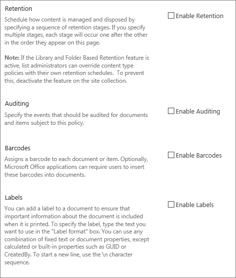

# Создание и применение политик управления сведениями

Политики управления сведениями позволяют организации контролировать сроки сохранения контента, проверять, что люди делают с содержимым, а также добавлять штрихкоды или метки в документы. Политика может помочь обеспечить соблюдение правовых и правительственных норм или внутренних бизнес-процессов. Как администратор вы можете настроить политику для управления отслеживанием документов и сроком их сохранения.
  
Политику управления сведениями можно создать в трех различных расположениях иерархии сайтов от самого широкого до самого узкого:
  
- Создайте политику, которая будет применяться к нескольким типам контента в пределах коллекции сайтов.
    
- Создайте политику для типа контента сайта.
    
- Создайте политику для списка или библиотеки.
    
Дополнительные сведения см. [в введении политик управления сведениями.](intro-to-info-mgmt-policies.md)
  
## Создание политики для нескольких типов контента в пределах коллекции веб-сайтов

Чтобы убедиться, что информационная политика применяется к всем документам определенного типа в пределах коллекции сайтов, рассмотрите возможность создания политики на уровне коллекции сайтов, а затем применить ее к типам контента. Они называются политиками для коллекций веб-сайтов. 
  
1. На домашней странице "Параметры" в заголовке страницы \>   \> **Параметры сайта**.
    
    На сайте, подключенного к группе SharePoint, щелкните "Параметры", "Содержимое **сайта"** и **"Параметры сайта".** 
    
2. На странице "Параметры сайта" в области **"Шаблоны** политики типов контента \> **администрирования веб-сайтов".** 
  

  
3. На странице "Создание \> **политик"** 
    
4. Введите имя и описание политики, а затем напишите краткое заявление о политике, объясняя пользователям, для чего она существует.
    
5. См. следующий раздел о создании политик для типа контента сайта, чтобы узнать, как настроить функции, которые необходимо связать с политикой. 
    
6. Нажмите кнопку **OK**.
    
## Создание политики для типа контента сайта

Добавление политики управления сведениями к типу контента упрощает связывать функции политики с несколькими списками или библиотеками. Можно добавить существующую политику управления сведениями к типу контента или создать уникальную политику, относяющуюся к отдельному типу контента.
  
 Вы также можете добавить политику управления сведениями к типу контента, который характерна для списков. Это влияет на применение политики только к тем элементами в этом списке, которые используют тип контента. 
  
1. На домашней странице "Параметры" в заголовке страницы \>   \> **Параметры сайта**.
    
    На сайте, подключенного к группе SharePoint, щелкните "Параметры", "Содержимое **сайта"** и **"Параметры сайта".** 
    
2. На странице "Параметры сайта" в области **"Типы контента сайта** "Галереи \> **веб-дизайнера"**.
  

  
3. На странице "Параметры типа контента сайта" выберите тип контента, в который нужно добавить политику.
    
4. На странице "Тип контента сайта" в области **"Параметры"** \> **параметров политики управления сведениями.**
    
5. На странице "Изменение политики" введите имя и описание политики, а затем напишите краткое описание, объясняя пользователям, для чего она существует.
    
6. В следующих разделах выберите отдельные функции политики, которые необходимо добавить в политику управления сведениями. 
  

  
7. Чтобы указать период хранения для документов и элементов, на которые будет действовать эта политика, выберите "Включить хранение", а затем укажите период хранения и действия, которые должны происходить по истечении срока действия элементов.
    
    Указание срока хранения
    
||||||**1.**|**Choose **Add a retention stage for records...****|
|:-----|:-----|:-----|:-----|:-----|:-----|:-----|
||||||2.    | Выберите параметр периода хранения, чтобы указать, когда истекает срок действия документов или элементов. Выполните одно из указанных ниже действий.     Чтобы установить дату окончания срока действия на основе свойства даты, в элементе **Event** This stage задают свойство даты элемента, а затем выберите действие документа или элемента (например, "Создано" или "Изменено"), а затем по истечении этого действия (например, количество дней, месяцев или лет), когда необходимо истечь срок действия \> элемента.     Чтобы использовать настраиваемую формулу хранения для определения срока действия, выберите "Установить по настраиваемой формуле **хранения", установленной на этом сервере.**    > [!NOTE]> этот параметр доступен, только если настраиваемая формула настроена администратором.           |
||||||3.    |Параметр **"Запустить рабочий** процесс" доступен, только если вы определяете политику для списка, библиотеки или типа контента, с ним уже связан рабочий процесс. После этого вам будет предоставлен выбор рабочего процесса для выбора.    |
||||||4.    |В разделе **"Повторение"** выберите **"Повторить действие этой стадии"...** и введите, как часто действие будет повторяться.    > [!NOTE]> этот параметр доступен, только если выбранное действие можно повторить. Например, нельзя установить повторение для действия **"Окончательно удалить".**           |
||||||5.    |Выбрано **"ОК"**.    |
   
1. Чтобы включить аудит документов и элементов, к которые будет данной политике, выберите "Включить аудит" и укажите события, которые нужно аудитировать.
    
    Чтобы включить аудит
    
||||||1.****|On the Edit Policy page,** **under** **Auditing** **\>** **Enable auditing** **, and then select the check boxes next to the events you want to keep an audit trail for.****|
|:-----|:-----|:-----|:-----|:-----|:-----|:-----|
||||||**2.**   |**Чтобы пользователям было предложено вставить эти штрихкоды**  в документы, выберите запрос на вставку штрихкода **перед сохранением или печатью.**    |
||||||**3.**   |**Choose** **OK** ** to apply the auditing feature to the policy. **   |
|||||||Функция политики аудита позволяет организациям создавать и анализировать отчеты аудита для документов, а также перечислять такие элементы, как списки задач, списки вопросов, группы обсуждений и календари. Данная функция предоставляет журнал аудита, в котором записываются такие события, как даты просмотра, изменения или удаления контента.    |
|||||||Если аудит включен в рамках политики управления сведениями, администраторы могут просматривать данные аудита в отчетах об использовании политик, основанных на Microsoft Excel, и суммировать текущее использование. Администраторы могут использовать данные отчеты для просмотра процесса использования информации внутри организации. Эти отчеты также помогают организациям проверять и документировать соответствие нормативным требованиям или изучать потенциальные проблемы.    |
|||||||В журнале аудита записывается следующая информация: название события, его дата и время, системное имя пользователя, выполнившего действия.    |
   
1. Когда штрих-коды включены в рамках политики, они добавляются в свойства документа и отображаются в области его заголовки, к которому применяется штрихкод. Как и метки, штрихкоды также можно вручную удалить из документа. Можно указать, следует ли пользователям включать штрих-код при печати или сохранении элемента, или необходимо ли  вручную вставлять штрих-код с помощью вкладки "Вставка" в программах выпуска 2010 Office. 
    
    Чтобы включить штрихкоды, с помощью
    
||||||1.****|**On the Edit Policy page, under **Barcodes** \> **Enable Barcodes**.**|
|:-----|:-----|:-----|:-----|:-----|:-----|:-----|
||||||**2.**   |Чтобы пользователям было предложено вставить эти штрихкоды в документы, выберите запрос на вставку штрихкода **перед сохранением или печатью.**    |
||||||**3.**   |Выберите **"ОК",** чтобы применить штрих-код к политике.    |
|||||||
 Политика штрихкодов создает стандартные штрихкоды Code 39. Каждое изображение штрихкода содержит текст под символом штрихкода, который представляет значение штрихкода. Это позволяет использовать данные штрихкодов, даже если сканирующее оборудование не доступно. Пользователи могут вручную ввести номер штрихкода в поле поиска, чтобы найти элемент на сайте.    |
   
1. Чтобы требовать, чтобы в документах, на которые налагается эта политика, были метки, выберите "Включить метки" и укажите нужные параметры для меток.
    
    Чтобы включить метки
    
||||||**1.**|**Чтобы потребовать от пользователей добавления метки в документ, выберите запрос на вставку метки перед **сохранением или печатью.**    > [!NOTE]> Если вы хотите, чтобы метки были необязательными, не выбирайте этот контрольный вариант.        **|
|:-----|:-----|:-----|:-----|:-----|:-----|:-----|
||||||2.    |Чтобы заблокировать метку, чтобы ее нельзя было изменить после вставки, выберите "Запретить изменения меток **после их добавления".**     Этот параметр предотвращает обновление текста метки после вставки метки в элемент в клиентских приложениях, таких как Word, Excel или PowerPoint. Чтобы метки обновлялись при обновлении свойств документа или элемента, не устанавливайте флажок.    |
||||||3.    |В поле "Формат метки" введите текст метки так, как нужно. Метки могут содержать до 10 ссылок на столбцы, каждая из которых может содержать до 255 символов. Чтобы создать формат метки, сделайте следующее:    Введите имена столбцов, которые необходимо включить в метку, в том порядке, в котором они должны отображаться. Заключив имена столбцов в фигурные скобки ( ), как показано в примере {} на странице "Изменение политики".    Введите слова, чтобы идентифицировать столбцы за пределами скобок, как показано в примере на странице "Изменение политики".    |
||||||4.    |Чтобы добавить разрыв строки, введите **\n** там, где должен отображаться разрыв строки.    |
||||||5.    |Выберите нужный размер и стиль шрифта и укажите, будет ли метка размещена слева, по центру или вправо в документе.     Выберите шрифт и стиль из набора имеющихся на компьютере пользователя. Размер шрифта влияет на объем текста, отображаемого в метке.    |
||||||6.    |Введите высоту и ширину метки. Высота и ширина метки могут варьироваться от 0,25 до 20 дюймов. Текст метки всегда центрирован по вертикали в пределах ее изображения.    |
||||||7.    |Выберите **"Обновить",** чтобы просмотреть содержимое метки.    |
   
1. Нажмите кнопку **OK**.
    
## Создание политики для списка, библиотеки или папки (политика хранения в зависимости от местоположения)

Можно определить политику хранения, применяемую только к определенному списку, библиотеке или папке. Однако если вы создаете политику хранения таким образом, вы не сможете повторно использовать эту политику для других списков, библиотек, папок или сайтов и не сможете применить политику к политике на основе расположения.
  
Если вы хотите применить одну политику хранения к всем типам контента в одном расположении, скорее всего, захотите использовать хранение на основе расположения. В большинстве других случаев необходимо проверить, указана ли политика хранения для всех типов контента.
  
 Каждая ветвь наследует политику хранения родительской, если вы не решите приорвать наследование и не определить новую политику хранения на уровне потомка. 
  
Если требуется определить политику управления сведениями, не связанную с хранением в списке или библиотеке, необходимо определить политику управления сведениями для каждого отдельного типа контента списка, связанного с этим списком или библиотекой.
  
 Если в какой-либо момент вы решите переключиться с типа контента на политики на основе расположения для списка или библиотеки, в качестве политики на основе расположения будет использоваться только политика хранения. Все остальные политики управления (аудиты, штрихкоды и штрихкоды) наследуются от связанных типов контента. 
  
 Политики на основе расположения можно отключить для коллекции веб-сайтов, отключив функцию хранения на основе библиотек и папок. Это позволяет администраторам сайтов гарантировать, что их политики типов контента не переопределяются политиками расположения администратора списка. 
  
Чтобы изменить параметры политики управления сведениями для списка или библиотеки, необходимо по крайней мере разрешение на управление списками.
  
1. Перейдите к списку или библиотеке, для которых необходимо указать политику управления сведениями. 
    
2. На ленте выберите **параметры** библиотеки или **вкладки "Список"** или \>  **"Параметры списка".**
    
    В SharePoint Online щелкните **"Параметры",** а затем выберите **"Параметры списка"** или **"Параметры библиотеки".** 
    
3. В **параметрах политики управления** разрешениями и \> **сведениями об управлении.**
  

  
4. На странице "Параметры политики управления сведениями" убедитесь, что источником хранения для списка или библиотеки является библиотека и папки. 
  
Если **в качестве источника** отображается тип контента, щелкните "Изменить **источник"** и выберите **"Библиотека и папки".** Вы будете предупреждены, что политики хранения типов контента будут игнорироваться. Нажмите кнопку **OK**. 
    
5. На странице "Изменение политики" в **области "Расписание** хранения на основе библиотеки" введите краткое описание создаемой политики. 
    
6. Choose **Add a retention stage...**
    
     Обратите внимание, что в области "Записи" можно выбрать различные политики хранения для записей, выбрав параметр "Определение различных этапов хранения для записей". 
    
7. В диалоговом окте "Свойства стадии" выберите параметр периода хранения, чтобы указать срок действия документов или элементов. Выполните одно из указанных ниже действий.
    
  - Чтобы установить дату окончания срока действия на основе свойства даты, в элементе **Event** This stage задают свойство даты элемента, а затем выберите действие документа или элемента (например, "Создано" или "Изменено"), а затем по истечении этого действия (например, количество дней, месяцев или лет), когда необходимо истечь срок действия \> элемента. 
    
  - Чтобы использовать настраиваемую формулу хранения для определения срока действия, выберите "Установить по настраиваемой формуле **хранения", установленной на этом сервере.** 
    
    > [!NOTE]
    >  Этот параметр доступен, только если настраиваемая формула настроена администратором. 
  
  - В **действии** укажите, что должно произойти по истечении срока действия документа или элемента. Чтобы включить определенное действие для документа или элемента (например, удаление), выберите действие из списка. 
    
8. Параметр **"Запустить рабочий** процесс" доступен, только если вы определяете политику для списка, библиотеки или типа контента, с ним уже связан рабочий процесс. После этого вам будет предоставлен выбор рабочего процесса для выбора. 
    
9. В **области "Повторение"** выберите **"Повторить действие этой стадии"...** и введите, как часто действие будет повторяться. 
    
    > [!NOTE]
    >  Этот параметр доступен, только если выбранное действие можно повторить. Например, нельзя установить повторение для действия **"Окончательно удалить".** 
  
10. Нажмите кнопку **OK**.
    
## Применение политики для коллекции веб-сайтов к типу контента

Если политики управления сведениями уже созданы для сайта в качестве политик для коллекции сайтов, вы можете применить одну из этих политик к типу контента. Таким образом можно применить ту же политику к нескольким типам контента в коллекции сайтов, которые не имеют одного родительского типа контента.
  
 Если вы хотите применить политики к нескольким типам контента в коллекции сайтов и у вас настроена служба управляемых метаданных, вы можете использовать публикацию типов контента для публикации политик управления сведениями в нескольких коллекциях сайтов. Дополнительные сведения см. в разделе ["Применение политики для](#apply-a-policy-across-site-collections) всех коллекций веб-сайтов". 
  
1. Перейдите к списку или библиотеке, содержа которой содержится тип контента, к которому необходимо применить политику.
    
2. На ленте выберите **параметры** библиотеки или **вкладки "Список"** или \>  **"Параметры списка".**
    
    В SharePoint Online щелкните **"Параметры",** а затем выберите **"Параметры списка"** или **"Параметры библиотеки".** 
    
3. В **параметрах политики управления** разрешениями и \> **сведениями об управлении.**
  

  
4. Убедитесь, что в источнике политики  выбраны типы контента, и в области "Политики типов контента" выберите тип контента, к который будет применяться политика. 
    
5. В **области "Укажите политику** использовать политику для сбора веб-сайтов" выберите политику, которую необходимо \> применить, в списке. 
    
    > [!NOTE]
    >  Если параметр **"Использовать политику для коллекции** веб-сайтов" не доступен, политики для этого сайта не определены. 
  
6. Нажмите кнопку **OK**.
    
     Если список или библиотека, с которыми вы работаете,  поддерживают управление несколькими типами контента, в области "Типы контента" можно выбрать тип контента, для которого необходимо указать политику управления сведениями. Это позволит вам перейти непосредственно к шагу 5 выше. 
    
## Применение политики к всем коллекциям веб-сайтов

Совместное использование типов контента в различных коллекциях сайтов с помощью приложения-службы управляемых метаданных для публикации типов контента. Публикация типов контента помогает согласованно управлять контентом и метаданными на всех сайтах, так как типы контента можно создавать и обновлять централизованно, а обновления можно публиковать для нескольких подписавшись на сайты или веб-приложения.
  
## Создание шаблона из существующей политики для использования в различных коллекциях веб-сайтов

Можно определить политику управления сведениями, а затем создать из нее шаблон для использования в нескольких коллекциях веб-сайтов по мере необходимости. Этот метод можно использовать, если вы хотите иметь резервную копию политик информации, или его также можно использовать в качестве альтернативного метода для использования публикации типов контента для применения одной политики в разных коллекциях веб-сайтов. Шаблон или резервная копия политики создается путем экспорта политики из одного и затем импорта в сохраненное расположение или в другое.
  
> [!IMPORTANT]
>  Если вы используете функцию экспорта и импорта в качестве способа создать набор шаблонов политики, помните, что в XML-файле политики существует уникальный идентификатор. Из-за этого нельзя импортировать эту политику на сайт более одного раза, не изменяя этот уникальный идентификатор. 
  
### Экспорт политики

1. На домашней странице веб-сайта выберите шестеренку "Параметры" на месте "Параметры   \> **сайта". Параметры сайта.**
    
    На сайте, подключенного к группе SharePoint, щелкните "Параметры", "Содержимое **сайта"** и **"Параметры сайта".** 
    
2. На странице "Параметры сайта" в области **"Шаблоны** политики типов контента \> **администрирования веб-сайтов".** 
  

  
3. Выберите политику для экспорта \> прокрутки в нижнюю часть \> **экспорта.**
    
4. В запросе на сохранение или открытие файла выберите "Сохранить", а затем выберите расположение для сохранения файла. Обязательно выберите расположение, доступное для коллекций веб-сайтов, которые импортируют политику.
    
5. When the Download Complete dialog is displayed, choose **Close**.
    
### Импорт политики в другое коллекцию веб-сайтов

Импорт политики управления сведениями позволяет применять ее к нескольким типам контента на уровне сайта или списка в любом заданном наборе сайтов. Это дает два преимущества: вам не нужно переопределять и применять политику для каждого типа контента, и вы можете легко управлять изменениями политики, внося изменения в политику только в одном месте.
  
1. На домашней странице сайта, к которому необходимо применить политику, выберите шестеренку "Параметры" с шестеренкой "Параметры", заняв место "Параметры  \> **сайта".** Параметры сайта.
    
    На сайте, подключенного к группе SharePoint, щелкните "Параметры", "Содержимое **сайта"** и **"Параметры сайта".** 
    
2. На странице "Параметры сайта" в области **"Шаблоны** политики типов контента \> **администрирования веб-сайтов".**
    
3. На странице "Импорт политик" \>  \>  найдите XML-файл политики. 
    
4. Выберите XML-файл, в котором была сохранена политика \> **Open.** 
    
5. На странице "Импорт политики для коллекции веб-сайтов импорт \>  для добавления политики в это коллекцию веб-сайтов". 
    
Импортируемая политика теперь может применяться к одному или многим типам контента на уровне сайта или списка. 
  
Политики управления сведениями позволяют организации контролировать сроки сохранения контента, проверять, что люди делают с содержимым, а также добавлять штрихкоды или метки в документы. Политика может помочь обеспечить соблюдение правовых и правительственных норм или внутренних бизнес-процессов. Как администратор вы можете настроить политику для управления отслеживанием документов и сроком их сохранения.

Политику управления сведениями можно создать в трех различных расположениях иерархии сайтов от самого широкого до самого узкого:
- Создайте политику, которая будет применяться к нескольким типам контента в пределах коллекции сайтов.
- Создайте политику для типа контента сайта.
- Создайте политику для списка или библиотеки.

Дополнительные сведения см. [в введении политик управления сведениями.](intro-to-info-mgmt-policies.md)
  

