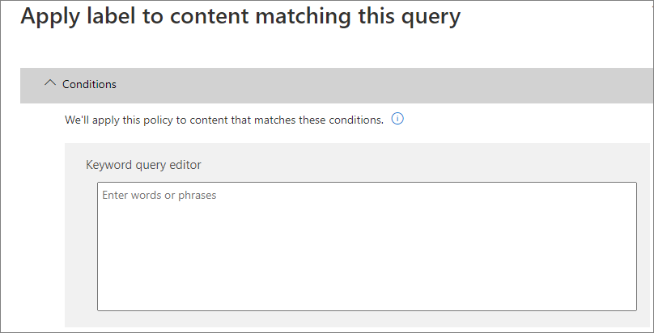

# <a name="create-publish-and-auto-apply-retention-labels"></a><span data-ttu-id="509d8-103">Создание, публикация и автоматическое применение меток хранения</span><span class="sxs-lookup"><span data-stu-id="509d8-103">Create, publish, and auto-apply retention labels</span></span>

><span data-ttu-id="509d8-104">*[Руководство по лицензированию Microsoft 365 для обеспечения безопасности и соответствия требованиям](https://aka.ms/ComplianceSD).*</span><span class="sxs-lookup"><span data-stu-id="509d8-104">*[Microsoft 365 licensing guidance for security & compliance](https://aka.ms/ComplianceSD).*</span></span>

<span data-ttu-id="509d8-105">Используйте сведения ниже, чтобы создать [метки хранения](labels.md), а затем автоматически применять их к документам и электронным сообщениям, или публиковать их, чтобы пользователи могли применить их вручную.</span><span class="sxs-lookup"><span data-stu-id="509d8-105">Use the following information to help you create [retention labels](labels.md), and then automatically apply them to documents and emails, or publish them so that users can manually apply them.</span></span>

<span data-ttu-id="509d8-106">Метки хранения помогают сохранить необходимые и удалить ненужные данные.</span><span class="sxs-lookup"><span data-stu-id="509d8-106">Retention labels help you retain what you need and delete what you don't.</span></span> <span data-ttu-id="509d8-107">Они также используются для объявления элемента записью в роли метода [управления записями](records-management.md) для данных Microsoft 365.</span><span class="sxs-lookup"><span data-stu-id="509d8-107">They are also used to declare an item as a record as part of a [records management](records-management.md) solution for your Microsoft 365 data.</span></span>

<span data-ttu-id="509d8-108">Место создания и настройки меток хранения, зависит от того, используете ли вы управление записями.</span><span class="sxs-lookup"><span data-stu-id="509d8-108">Where you create and configure your retention labels depend on whether you're using records management or not.</span></span> <span data-ttu-id="509d8-109">В обоих случаях доступны соответствующие инструкции.</span><span class="sxs-lookup"><span data-stu-id="509d8-109">Instructions are provided for both scenarios.</span></span>

## <a name="before-you-begin"></a><span data-ttu-id="509d8-110">Перед началом работы</span><span class="sxs-lookup"><span data-stu-id="509d8-110">Before you begin</span></span>

<span data-ttu-id="509d8-111">Участникам команды по обеспечению соответствия требованиям, которые будут создавать метки хранения, потребуются разрешения для Центра безопасности и соответствия требованиям.</span><span class="sxs-lookup"><span data-stu-id="509d8-111">Members of your compliance team who will create retention labels need permissions to the Security &amp; Compliance Center.</span></span> <span data-ttu-id="509d8-112">По умолчанию администратор клиента обладает доступом к этому расположению и может предоставить ответственным за обеспечение соответствия требованиям и другим лицам доступ к Центру безопасности и соответствия требованиям, не предоставляя им все разрешения администратора клиента. Для этого рекомендуем вам перейти на страницу **Разрешения** в Центре безопасности и соответствия требованиям, изменить группу ролей **Администратор соответствия требованиям** и добавить участников в эту группу ролей.</span><span class="sxs-lookup"><span data-stu-id="509d8-112">By default, your tenant admin has access to this location and can give compliance officers and other people access to the Security &amp; Compliance Center, without giving them all of the permissions of a tenant admin. To do this, we recommend that you go to the **Permissions** page of the Security &amp; Compliance Center, edit the **Compliance Administrator** role group, and add members to that role group.</span></span> 
  
<span data-ttu-id="509d8-113">Дополнительные сведения см. в статье [Предоставление пользователям доступа к Центру безопасности и соответствия требованиям Office 365](../security/office-365-security/grant-access-to-the-security-and-compliance-center.md).</span><span class="sxs-lookup"><span data-stu-id="509d8-113">For more information, see [Give users access to the Office 365 Security &amp; Compliance Center](../security/office-365-security/grant-access-to-the-security-and-compliance-center.md).</span></span>
  
<span data-ttu-id="509d8-114">These permissions are required only to create and apply retention labels and a label policy.</span><span class="sxs-lookup"><span data-stu-id="509d8-114">These permissions are required only to create and apply retention labels and a label policy.</span></span> <span data-ttu-id="509d8-115">Policy enforcement does not require access to the content.</span><span class="sxs-lookup"><span data-stu-id="509d8-115">Policy enforcement does not require access to the content.</span></span>

## <a name="create-and-configure-retention-labels"></a><span data-ttu-id="509d8-116">Создание и настройка меток хранения</span><span class="sxs-lookup"><span data-stu-id="509d8-116">Create and configure retention labels</span></span>

1. <span data-ttu-id="509d8-117">В [Центре соответствия требованиям Microsoft 365](https://compliance.microsoft.com/) перейдите в одно из следующих расположений:</span><span class="sxs-lookup"><span data-stu-id="509d8-117">In the [Microsoft 365 compliance center](https://compliance.microsoft.com/), navigate to one of the following locations:</span></span>
    
    - <span data-ttu-id="509d8-118">Если используется управление записями:</span><span class="sxs-lookup"><span data-stu-id="509d8-118">If you are using records management:</span></span>
        - <span data-ttu-id="509d8-119">**Решения** > **Управление записями** > вкладка **План хранения** > **+ Создать метку** > **Метка хранения**</span><span class="sxs-lookup"><span data-stu-id="509d8-119">**Solutions** > **Records management** > **File plan** tab > **+ Create a label** > **Retention label**</span></span>
        
    - <span data-ttu-id="509d8-120">Если управление записями не используется:</span><span class="sxs-lookup"><span data-stu-id="509d8-120">If you are not using records management:</span></span>
       - <span data-ttu-id="509d8-121">**Решения** > **Управление информацией** > вкладка **Метки** > + **Создать метку**</span><span class="sxs-lookup"><span data-stu-id="509d8-121">**Solutions** > **Information governance** > **Labels** tab > + **Create a label**</span></span>
    
    <span data-ttu-id="509d8-122">Не отображается необходимый параметр?</span><span class="sxs-lookup"><span data-stu-id="509d8-122">Don't immediately see your option?</span></span> <span data-ttu-id="509d8-123">Сначала выберите **Показать все**.</span><span class="sxs-lookup"><span data-stu-id="509d8-123">First select **Show all**.</span></span> 

2. <span data-ttu-id="509d8-124">Следуйте указаниям мастера.</span><span class="sxs-lookup"><span data-stu-id="509d8-124">Follow the prompts in the wizard.</span></span> <span data-ttu-id="509d8-125">Если используется управление записями:</span><span class="sxs-lookup"><span data-stu-id="509d8-125">If you are using records management:</span></span>
    
    - <span data-ttu-id="509d8-126">Дополнительные сведения о дескрипторах плана хранения, см. в статье [Использование плана хранения для управления метками хранения](file-plan-manager.md)</span><span class="sxs-lookup"><span data-stu-id="509d8-126">For information about the file plan descriptors, see [Use file plan to manage retention labels](file-plan-manager.md)</span></span>
    
    - <span data-ttu-id="509d8-127">Чтобы использовать метку хранения для объявления содержимого записью, включите флажок **Использовать метку, чтобы классифицировать содержимое как "Запись"**.</span><span class="sxs-lookup"><span data-stu-id="509d8-127">To use the retention label to declare content as a record, enable the checkbox **Use label to classify content as a "Record"**.</span></span>

3. <span data-ttu-id="509d8-128">Повторите эти действия для создания дополнительных меток.</span><span class="sxs-lookup"><span data-stu-id="509d8-128">Repeat these steps to create more labels.</span></span>

<span data-ttu-id="509d8-129">Чтобы изменить существующую метку, выберите ее и нажмите **Изменить метку**, чтобы запустить тот же мастер, который позволяет изменить описания меток и любые [доступные параметры](#updating-retention-labels-and-their-policies) на шаге 2.</span><span class="sxs-lookup"><span data-stu-id="509d8-129">To edit an existing label, select it, and then select **Edit label** to start the same wizard that lets you change the label descriptions and any [eligible settings](#updating-retention-labels-and-their-policies) from step 2.</span></span> <span data-ttu-id="509d8-130">Вместо этого можно выбрать любой из доступных параметров **Редактирования**, чтобы перейти непосредственно на соответствующую страницу для обновления.</span><span class="sxs-lookup"><span data-stu-id="509d8-130">Alternatively, select any of the available **Edit** options to go directly to the relevant page to make your update.</span></span>

## <a name="publish-retention-labels-by-creating-a-retention-label-policy"></a><span data-ttu-id="509d8-131">Публикуйте метки хранения, создавая их политику</span><span class="sxs-lookup"><span data-stu-id="509d8-131">Publish retention labels by creating a retention label policy</span></span>

<span data-ttu-id="509d8-132">Публикуйте метки хранения, чтобы пользователи могли применить их вручную.</span><span class="sxs-lookup"><span data-stu-id="509d8-132">Publish retention labels so that they can be manually applied by users.</span></span>

1. <span data-ttu-id="509d8-133">В [Центре соответствия требованиям Microsoft 365](https://compliance.microsoft.com/) перейдите в одно из следующих расположений:</span><span class="sxs-lookup"><span data-stu-id="509d8-133">In the [Microsoft 365 compliance center](https://compliance.microsoft.com/), navigate to one of the following locations:</span></span>
    
    - <span data-ttu-id="509d8-134">Если используется управление записями:</span><span class="sxs-lookup"><span data-stu-id="509d8-134">If you are using records management:</span></span>
        - <span data-ttu-id="509d8-135">**Решения** > **Управление записями** > > вкладка**Политики меток** > **Опубликовать метки**</span><span class="sxs-lookup"><span data-stu-id="509d8-135">**Solutions** > **Records management** > > **Label policies** tab > **Publish labels**</span></span>
    
    - <span data-ttu-id="509d8-136">Если управление записями не используется:</span><span class="sxs-lookup"><span data-stu-id="509d8-136">If you are not using records management:</span></span>
        - <span data-ttu-id="509d8-137">**Решения** > **Управление информацией** >  вкладка **Политики меток** > **Опубликовать метки**</span><span class="sxs-lookup"><span data-stu-id="509d8-137">**Solutions** > **Information governance** > **Label policies** tab > **Publish labels**</span></span>
    
    <span data-ttu-id="509d8-138">Не отображается необходимый параметр?</span><span class="sxs-lookup"><span data-stu-id="509d8-138">Don't immediately see your option?</span></span> <span data-ttu-id="509d8-139">Сначала выберите **Показать все**.</span><span class="sxs-lookup"><span data-stu-id="509d8-139">First select **Show all**.</span></span> 

2. <span data-ttu-id="509d8-140">Следуйте указаниям мастера.</span><span class="sxs-lookup"><span data-stu-id="509d8-140">Follow the prompts in the wizard.</span></span>
    
    <span data-ttu-id="509d8-141">Сведения о расположениях, поддерживаемых метками хранения, см. в разделе [Метки хранения и расположения](labels.md#retention-label-policies-and-locations).</span><span class="sxs-lookup"><span data-stu-id="509d8-141">For information about the locations supported by retention labels, see the [Retention labels and locations](labels.md#retention-label-policies-and-locations) section.</span></span> 

<span data-ttu-id="509d8-142">Чтобы изменить существующую политику меток хранения, выберите ее и нажмите **Изменить политику**, чтобы запустить тот же мастер, который позволяет изменить описание политики и любые [доступные параметры](#updating-retention-labels-and-their-policies) на шаге 2.</span><span class="sxs-lookup"><span data-stu-id="509d8-142">To edit an existing retention label policy, select it, and then select **Edit policy** to start the same wizard that lets you change the policy description and any [eligible settings](#updating-retention-labels-and-their-policies) from step 2.</span></span> <span data-ttu-id="509d8-143">Вместо этого можно выбрать любой из доступных параметров **Редактирования**, чтобы перейти непосредственно на соответствующую страницу для обновления.</span><span class="sxs-lookup"><span data-stu-id="509d8-143">Alternatively, select any of the available **Edit** options to go directly to the relevant page to make your update.</span></span>

## <a name="auto-apply-a-retention-label"></a><span data-ttu-id="509d8-144">Автоматическое применение меток хранения</span><span class="sxs-lookup"><span data-stu-id="509d8-144">Auto-apply a retention label</span></span>

<span data-ttu-id="509d8-145">Применяйте метки хранения автоматически на основе указанных условий.</span><span class="sxs-lookup"><span data-stu-id="509d8-145">Auto-apply a retention label, based on the conditions that you specify.</span></span>

1. <span data-ttu-id="509d8-146">В [Центре соответствия требованиям Microsoft 365](https://compliance.microsoft.com/) перейдите в одно из следующих расположений:</span><span class="sxs-lookup"><span data-stu-id="509d8-146">In the [Microsoft 365 compliance center](https://compliance.microsoft.com/), navigate to one of the following locations:</span></span>
    
    - <span data-ttu-id="509d8-147">Если используется управление записями: **Управление информацией**:</span><span class="sxs-lookup"><span data-stu-id="509d8-147">If you are using records management: **Information governance**:</span></span>
        - <span data-ttu-id="509d8-148">**Решения** > **Управление записями** >  вкладка **Политики меток** > **Автоматически применить метку**</span><span class="sxs-lookup"><span data-stu-id="509d8-148">**Solutions** > **Records management** > **Label policies** tab > **Auto-apply label**</span></span>
    
    - <span data-ttu-id="509d8-149">Если управление записями не используется:</span><span class="sxs-lookup"><span data-stu-id="509d8-149">If you are not using records management:</span></span>
        - <span data-ttu-id="509d8-150">**Решения** > **Управление информацией** >  вкладка **Политики меток** > **Автоматически применить метку**</span><span class="sxs-lookup"><span data-stu-id="509d8-150">**Solutions** > **Information governance** > **Label policies** tab > **Auto-apply label**</span></span>
    
    <span data-ttu-id="509d8-151">Не отображается необходимый параметр?</span><span class="sxs-lookup"><span data-stu-id="509d8-151">Don't immediately see your option?</span></span> <span data-ttu-id="509d8-152">Сначала выберите **Показать все**.</span><span class="sxs-lookup"><span data-stu-id="509d8-152">First select **Show all**.</span></span> 

2. <span data-ttu-id="509d8-153">Следуйте указаниям мастера.</span><span class="sxs-lookup"><span data-stu-id="509d8-153">Follow the prompts in the wizard.</span></span>
    
    <span data-ttu-id="509d8-154">Сведения о настройке условий для автоматического применения метки хранения, см. в разделе [Настройка условий автоматического применения меток хранения](#configuring-conditions-for-auto-apply-retention-labels) на этой странице.</span><span class="sxs-lookup"><span data-stu-id="509d8-154">For information about configuring the conditions that automatically apply the retention label, see the [Configuring conditions for auto-apply retention labels](#configuring-conditions-for-auto-apply-retention-labels) section on this page.</span></span>
    
    <span data-ttu-id="509d8-155">Сведения о расположениях, поддерживаемых метками хранения, см. в разделе [Метки хранения и расположения](labels.md#retention-label-policies-and-locations).</span><span class="sxs-lookup"><span data-stu-id="509d8-155">For information about the locations supported by retention labels, see the [Retention labels and locations](labels.md#retention-label-policies-and-locations) section.</span></span>

<span data-ttu-id="509d8-156">Чтобы изменить существующую политику автоматического применения меток, выберите ее и нажмите **Изменить политику**, чтобы запустить тот же мастер, который позволяет изменить описание политики и любые [доступные параметры](#updating-retention-labels-and-their-policies) на шаге 2.</span><span class="sxs-lookup"><span data-stu-id="509d8-156">To edit an existing auto-apply label policy, select it, and then select **Edit policy** to start the same wizard that lets you change the policy description and any [eligible settings](#updating-retention-labels-and-their-policies) from step 2.</span></span> <span data-ttu-id="509d8-157">Вместо этого можно выбрать любой из доступных параметров **Редактирования**, чтобы перейти непосредственно на соответствующую страницу для обновления.</span><span class="sxs-lookup"><span data-stu-id="509d8-157">Alternatively, select any of the available **Edit** options to go directly to the relevant page to make your update.</span></span>


## <a name="configuring-conditions-for-auto-apply-retention-labels"></a><span data-ttu-id="509d8-158">Настройка условий для автоматического применения меток хранения</span><span class="sxs-lookup"><span data-stu-id="509d8-158">Configuring conditions for auto-apply retention labels</span></span>

<span data-ttu-id="509d8-159">Автоматически применяйте метки хранения к контенту, содержащему:</span><span class="sxs-lookup"><span data-stu-id="509d8-159">You can apply retention labels to content automatically when that content contains:</span></span>
  
- <span data-ttu-id="509d8-160">[конфиденциальную информацию определенных типов](#auto-apply-labels-to-content-with-specific-types-of-sensitive-information);</span><span class="sxs-lookup"><span data-stu-id="509d8-160">[Specific types of sensitive information](#auto-apply-labels-to-content-with-specific-types-of-sensitive-information)</span></span>
    
- <span data-ttu-id="509d8-161">[определенные ключевые слова, соответствующие созданному запросу](#auto-apply-labels-to-content-with-keywords-or-searchable-properties);</span><span class="sxs-lookup"><span data-stu-id="509d8-161">[Specific keywords that match a query you create](#auto-apply-labels-to-content-with-keywords-or-searchable-properties)</span></span>

- <span data-ttu-id="509d8-162">[совпадение для обучаемых классификаторов](#auto-apply-labels-to-content-by-using-trainable-classifiers).</span><span class="sxs-lookup"><span data-stu-id="509d8-162">[A match for trainable classifiers](#auto-apply-labels-to-content-by-using-trainable-classifiers)</span></span>
    


<span data-ttu-id="509d8-164">Автоматическое применение меток хранения к контенту, соответствующему заданным условиям, может занять до семи дней.</span><span class="sxs-lookup"><span data-stu-id="509d8-164">It can take up to seven days for auto-apply retention labels to be applied to all content that matches the conditions you've configured.</span></span>

### <a name="auto-apply-labels-to-content-with-specific-types-of-sensitive-information"></a><span data-ttu-id="509d8-165">Автоматическое применение меток к контенту с определенными типами конфиденциальной информации</span><span class="sxs-lookup"><span data-stu-id="509d8-165">Auto-apply labels to content with specific types of sensitive information</span></span>

<span data-ttu-id="509d8-166">Когда вы создаете автоматически присваиваемые метки хранения для конфиденциальной информации, вы видите тот же список шаблонов политик, что и при создании политики защиты от потери данных (DLP) .</span><span class="sxs-lookup"><span data-stu-id="509d8-166">When you create auto-apply retention labels for sensitive information, you see the same list of policy templates as when you create a data loss prevention (DLP) policy.</span></span> <span data-ttu-id="509d8-167">Каждый шаблон политик настроен для поиска определенных типов конфиденциальной информации.</span><span class="sxs-lookup"><span data-stu-id="509d8-167">Each policy template is preconfigured to look for specific types of sensitive information.</span></span> <span data-ttu-id="509d8-168">Например, показанный здесь шаблон служит для выявления идентификационного номера налогоплательщика (ITIN), номера социального страхования (SSN) и номера паспорта в американском формате.</span><span class="sxs-lookup"><span data-stu-id="509d8-168">For example, the template shown here looks for U.S. ITIN, SSN, and passport numbers.</span></span> <span data-ttu-id="509d8-169">Дополнительные сведения см. в статье [Обзор политик защиты от потери данных](data-loss-prevention-policies.md).</span><span class="sxs-lookup"><span data-stu-id="509d8-169">To learn more about DLP, see [Overview of data loss prevention policies](data-loss-prevention-policies.md).</span></span>
  

  
<span data-ttu-id="509d8-171">After you select a policy template, you can add or remove any types of sensitive information, and you can change the instance count and match accuracy.</span><span class="sxs-lookup"><span data-stu-id="509d8-171">After you select a policy template, you can add or remove any types of sensitive information, and you can change the instance count and match accuracy.</span></span> <span data-ttu-id="509d8-172">In the example shown here, a retention label will be auto-applied only when:</span><span class="sxs-lookup"><span data-stu-id="509d8-172">In the example shown here, a retention label will be auto-applied only when:</span></span>
  
- <span data-ttu-id="509d8-173">The content contains between 1 and 9 instances of any of these three sensitive information types.</span><span class="sxs-lookup"><span data-stu-id="509d8-173">The content contains between 1 and 9 instances of any of these three sensitive information types.</span></span> <span data-ttu-id="509d8-174">You can delete the **max** value so that it changes to **any**.</span><span class="sxs-lookup"><span data-stu-id="509d8-174">You can delete the **max** value so that it changes to **any**.</span></span>
    
- <span data-ttu-id="509d8-175">The type of sensitive information that's detected has a match accuracy (or confidence level) of at least 75.</span><span class="sxs-lookup"><span data-stu-id="509d8-175">The type of sensitive information that's detected has a match accuracy (or confidence level) of at least 75.</span></span> <span data-ttu-id="509d8-176">Many sensitive information types are defined with multiple patterns, where a pattern with a higher match accuracy requires more evidence to be found (such as keywords, dates, or addresses), while a pattern with a lower match accuracy requires less evidence.</span><span class="sxs-lookup"><span data-stu-id="509d8-176">Many sensitive information types are defined with multiple patterns, where a pattern with a higher match accuracy requires more evidence to be found (such as keywords, dates, or addresses), while a pattern with a lower match accuracy requires less evidence.</span></span> <span data-ttu-id="509d8-177">Simply put, the lower the **min** match accuracy, the easier it is for content to match the condition.</span><span class="sxs-lookup"><span data-stu-id="509d8-177">Simply put, the lower the **min** match accuracy, the easier it is for content to match the condition.</span></span> 
    
<span data-ttu-id="509d8-178">Дополнительные сведения об этих параметрах см. в разделе [Настройка правил для упрощения или усложнения сопоставления](data-loss-prevention-policies.md#tuning-rules-to-make-them-easier-or-harder-to-match).</span><span class="sxs-lookup"><span data-stu-id="509d8-178">For more information on these options, see [Tuning rules to make them easier or harder to match](data-loss-prevention-policies.md#tuning-rules-to-make-them-easier-or-harder-to-match).</span></span>
    

  
### <a name="auto-apply-labels-to-content-with-keywords-or-searchable-properties"></a><span data-ttu-id="509d8-180">Автоматическое применение меток к контенту с ключевыми словами или доступными для поиска свойствами</span><span class="sxs-lookup"><span data-stu-id="509d8-180">Auto-apply labels to content with keywords or searchable properties</span></span>

<span data-ttu-id="509d8-181">You can auto-apply labels to content that satisfies certain conditions.</span><span class="sxs-lookup"><span data-stu-id="509d8-181">You can auto-apply labels to content that satisfies certain conditions.</span></span> <span data-ttu-id="509d8-182">The conditions now available support applying a label to content that contains specific words, phrases, or values of searchable properties.</span><span class="sxs-lookup"><span data-stu-id="509d8-182">The conditions now available support applying a label to content that contains specific words, phrases, or values of searchable properties.</span></span> <span data-ttu-id="509d8-183">You can refine your query by using search operators like AND, OR, and NOT.</span><span class="sxs-lookup"><span data-stu-id="509d8-183">You can refine your query by using search operators like AND, OR, and NOT.</span></span>

<span data-ttu-id="509d8-184">Дополнительные сведения о синтаксисе запросов см. в статье:</span><span class="sxs-lookup"><span data-stu-id="509d8-184">For more information on query syntax, see:</span></span>

- [<span data-ttu-id="509d8-185">Руководство по синтаксису языка запросов по ключевым словам (KQL)</span><span class="sxs-lookup"><span data-stu-id="509d8-185">Keyword Query Language (KQL) syntax reference</span></span>](https://docs.microsoft.com/sharepoint/dev/general-development/keyword-query-language-kql-syntax-reference)

<span data-ttu-id="509d8-186">Query-based labels use the search index to identify content.</span><span class="sxs-lookup"><span data-stu-id="509d8-186">Query-based labels use the search index to identify content.</span></span> <span data-ttu-id="509d8-187">For more information on valid searchable properties, see:</span><span class="sxs-lookup"><span data-stu-id="509d8-187">For more information on valid searchable properties, see:</span></span>

- [<span data-ttu-id="509d8-188">Запросы ключевых слов и условия поиска контента</span><span class="sxs-lookup"><span data-stu-id="509d8-188">Keyword queries and search conditions for Content Search</span></span>](keyword-queries-and-search-conditions.md)
- [<span data-ttu-id="509d8-189">Обзор свойств для обхода и управляемых свойств в SharePoint Server</span><span class="sxs-lookup"><span data-stu-id="509d8-189">Overview of crawled and managed properties in SharePoint Server</span></span>](https://docs.microsoft.com/SharePoint/technical-reference/crawled-and-managed-properties-overview)

<span data-ttu-id="509d8-190">Примеры запросов:</span><span class="sxs-lookup"><span data-stu-id="509d8-190">Examples queries:</span></span>

- <span data-ttu-id="509d8-191">Exchange</span><span class="sxs-lookup"><span data-stu-id="509d8-191">Exchange</span></span>
    - <span data-ttu-id="509d8-192">subject:"Квартальное финансирование"</span><span class="sxs-lookup"><span data-stu-id="509d8-192">subject:"Quarterly Financials"</span></span>
    - <span data-ttu-id="509d8-193">recipients:garthf</span><span class="sxs-lookup"><span data-stu-id="509d8-193">recipients:garthf</span></span><!--nolink--><span data-ttu-id="509d8-194">@contoso.com</span><span class="sxs-lookup"><span data-stu-id="509d8-194">@contoso.com</span></span>
- <span data-ttu-id="509d8-195">SharePoint и OneDrive</span><span class="sxs-lookup"><span data-stu-id="509d8-195">SharePoint and OneDrive</span></span>
    - <span data-ttu-id="509d8-196">contenttype:контракт</span><span class="sxs-lookup"><span data-stu-id="509d8-196">contenttype:contract</span></span>
    - <span data-ttu-id="509d8-197">site:https</span><span class="sxs-lookup"><span data-stu-id="509d8-197">site:https</span></span><!--nolink--><span data-ttu-id="509d8-198">://contoso.sharepoint.com/sites/teams/procurement И contenttype:contract</span><span class="sxs-lookup"><span data-stu-id="509d8-198">://contoso.sharepoint.com/sites/teams/procurement AND contenttype:contract</span></span>




### <a name="auto-apply-labels-to-content-by-using-trainable-classifiers"></a><span data-ttu-id="509d8-200">Автоматическое применение меток к контенту с помощью обучаемых классификаторов</span><span class="sxs-lookup"><span data-stu-id="509d8-200">Auto-apply labels to content by using trainable classifiers</span></span>

<span data-ttu-id="509d8-201">При использовании варианта для обучаемого классификатора вы можете выбрать один из встроенных классификаторов или настраиваемый классификатор.</span><span class="sxs-lookup"><span data-stu-id="509d8-201">When you choose the option for a trainable classifier, you can select one of the built-in classifiers, or a custom classifier.</span></span> <span data-ttu-id="509d8-202">К встроенным классификаторам относятся **Резюме**, **Исходный код**, **Целенаправленное притеснение**, **Сквернословие** и **Угрозы**.</span><span class="sxs-lookup"><span data-stu-id="509d8-202">The built-in classifiers include **Resumes**, **SourceCode**, **Targeted Harassment**, **Profanity**, and **Threat**:</span></span>


<span data-ttu-id="509d8-204">Для автоматического применения меток с помощью классификатора на сайтах и в почтовых ящиках SharePoint Online должно быть не менее 10 МБ данных.</span><span class="sxs-lookup"><span data-stu-id="509d8-204">To automatically apply a label by using this option, SharePoint Online sites and mailboxes must have at least 10 MB of data.</span></span>

<span data-ttu-id="509d8-205">Дополнительные сведения об обучаемых классификаторах см. в статье [Начало работы с обучаемыми классификаторами (предварительная версия)](classifier-getting-started-with.md).</span><span class="sxs-lookup"><span data-stu-id="509d8-205">For more information about trainable classifiers, see [Getting started with trainable classifiers (preview)](classifier-getting-started-with.md).</span></span>

<span data-ttu-id="509d8-206">Пример конфигурации см. в статье [Подготовка к использованию и использование встроенных классификаторов](classifier-using-a-ready-to-use-classifier.md#how-to-verify-that-a-built-in-classifier-will-meet-your-needs).</span><span class="sxs-lookup"><span data-stu-id="509d8-206">For an example configuration, see [How to prepare for and use a built-in classifier](classifier-using-a-ready-to-use-classifier.md#how-to-verify-that-a-built-in-classifier-will-meet-your-needs).</span></span>

## <a name="how-long-it-takes-for-retention-labels-to-take-effect"></a><span data-ttu-id="509d8-207">Срок вступления меток хранения в силу</span><span class="sxs-lookup"><span data-stu-id="509d8-207">How long it takes for retention labels to take effect</span></span>

<span data-ttu-id="509d8-208">При публикации автоматически применяемые метки хранения не сразу вступают в силу.</span><span class="sxs-lookup"><span data-stu-id="509d8-208">When you publish or auto-apply retention labels, they don't take effect immediately:</span></span>
  
1. <span data-ttu-id="509d8-209">Для начала необходимо синхронизировать политику меток с расположениями при помощи Центра администрирования.</span><span class="sxs-lookup"><span data-stu-id="509d8-209">First the label policy needs to be synced from the admin center to the locations in the policy.</span></span>
    
2. <span data-ttu-id="509d8-210">Затем в расположении может потребоваться некоторое время, чтобы опубликованные метки хранения стали доступными конечным пользователям или чтобы содержимому были автоматически присвоены соответствующие метки.</span><span class="sxs-lookup"><span data-stu-id="509d8-210">Then the location might require time to make published retention labels available to end users or time to auto-apply labels to content.</span></span> <span data-ttu-id="509d8-211">Необходимое для этого время зависит от расположения и типа метки хранения.</span><span class="sxs-lookup"><span data-stu-id="509d8-211">How long this takes depends on the location and type of retention label.</span></span>
    
### <a name="published-retention-labels"></a><span data-ttu-id="509d8-212">Опубликованные метки хранения</span><span class="sxs-lookup"><span data-stu-id="509d8-212">Published retention labels</span></span>

<span data-ttu-id="509d8-213">If you publish retention labels to SharePoint or OneDrive, those labels  typically appear for end users to select within one day.</span><span class="sxs-lookup"><span data-stu-id="509d8-213">If you publish retention labels to SharePoint or OneDrive, those labels  typically appear for end users to select within one day.</span></span> <span data-ttu-id="509d8-214">However, allow up to seven days.</span><span class="sxs-lookup"><span data-stu-id="509d8-214">However, allow up to seven days.</span></span> <span data-ttu-id="509d8-215">If you publish retention labels to Exchange, it can take up to seven days for those retention labels to appear for end users, and the mailbox must contain at least 10 MB of data.</span><span class="sxs-lookup"><span data-stu-id="509d8-215">If you publish retention labels to Exchange, it can take up to seven days for those retention labels to appear for end users, and the mailbox must contain at least 10 MB of data.</span></span>

<span data-ttu-id="509d8-216">Например:</span><span class="sxs-lookup"><span data-stu-id="509d8-216">For example:</span></span>
  

  
### <a name="auto-apply-retention-labels"></a><span data-ttu-id="509d8-218">Метки хранения, применяемые автоматически</span><span class="sxs-lookup"><span data-stu-id="509d8-218">Auto-apply retention labels</span></span>

<span data-ttu-id="509d8-219">Если метки хранения автоматически применяются к контенту, соответствующему определенным условиям, может потребоваться до семи дней, чтобы метки хранения были применены ко всему существующему контенту, соответствующему условиям.</span><span class="sxs-lookup"><span data-stu-id="509d8-219">If you auto-apply retention labels to content matching specific conditions, it can take up to seven days for the retention labels to be applied to all existing content that matches the conditions.</span></span>
  

  
### <a name="how-to-check-on-the-status-of-retention-labels-published-to-exchange"></a><span data-ttu-id="509d8-221">Проверка состояния меток хранения, опубликованных в Exchange</span><span class="sxs-lookup"><span data-stu-id="509d8-221">How to check on the status of retention labels published to Exchange</span></span>

<span data-ttu-id="509d8-222">В Exchange Online метки хранения доступны конечным пользователям благодаря процессу, который выполняется каждые семь дней.</span><span class="sxs-lookup"><span data-stu-id="509d8-222">In Exchange Online, retention labels are made available to end users by a process that runs every seven days.</span></span> <span data-ttu-id="509d8-223">С помощью Powershell вы можете узнать, когда этот процесс запускался в последний раз и, соответственно, когда он будет запущен снова.</span><span class="sxs-lookup"><span data-stu-id="509d8-223">By using Powershell, you can see when this process last ran and therefore identify when it will run again.</span></span>
  
1. <span data-ttu-id="509d8-224">[Подключение к Exchange Online PowerShell](https://go.microsoft.com/fwlink/?linkid=799773).</span><span class="sxs-lookup"><span data-stu-id="509d8-224">[Connect to Exchange Online PowerShell](https://go.microsoft.com/fwlink/?linkid=799773).</span></span>
    
2. <span data-ttu-id="509d8-225">Выполните следующие команды:</span><span class="sxs-lookup"><span data-stu-id="509d8-225">Run these commands.</span></span>
    
   ```powershell
   $logProps = Export-MailboxDiagnosticLogs <user> -ExtendedProperties
   ```

   ```powershell
   $xmlprops = [xml]($logProps.MailboxLog)
   ```

   ```powershell
   $xmlprops.Properties.MailboxTable.Property | ? {$_.Name -like "ELC*"}   ```

In the results, the `ELCLastSuccessTimeStamp` (UTC) property shows when the system last processed your mailbox. If it has not happened since the time you created the policy, the labels are not going to appear. To force processing, run  `Start-ManagedFolderAssistant -Identity <user>`.
    
If labels aren't appearing in Outlook on the web and you think they should be, make sure to clear the cache in your browser (CTRL+F5).
    

## Updating retention labels and their policies

When you edit a retention label, retention label policy, or auto-apply policy, and the retention label or policy is already applied to content, your updated settings will automatically be applied to this content in addition to content that's newly identified.

Some settings can't be changed after the label or policy is created and saved, which include:
- The retention settings except the retention period, unless you've configured the label to retain or delete the content based on when it was created.
- The option to classify as a record.

## Find the PowerShell cmdlets for retention labels

To use the retention label cmdlets:
  
1. [Connect to the Office 365 Security & Compliance Center Powershell](https://docs.microsoft.com/powershell/exchange/office-365-scc/connect-to-scc-powershell/connect-to-scc-powershell)
    
2. Use these Office 365 Security & Compliance Center cmdlets:
    
    - [Get-ComplianceTag](https://docs.microsoft.com/powershell/module/exchange/get-compliancetag)
    
    - [New-ComplianceTag](https://docs.microsoft.com/powershell/module/exchange/new-compliancetag)
    
    - [Remove-ComplianceTag](https://docs.microsoft.com/powershell/module/exchange/remove-compliancetag)
    
    - [Set-ComplianceTag](https://docs.microsoft.com/powershell/module/exchange/set-compliancetag)
    
    - [Enable-ComplianceTagStorage](https://docs.microsoft.com/powershell/module/exchange/enable-compliancetagstorage)
    
    - [Get-ComplianceTagStorage](https://docs.microsoft.com/powershell/module/exchange/get-compliancetagstorage)
    
    - [Get-RetentionCompliancePolicy](https://docs.microsoft.com/powershell/module/exchange/get-retentioncompliancepolicy)
    
    - [New-RetentionCompliancePolicy](https://docs.microsoft.com/powershell/module/exchange/new-retentioncompliancepolicy)
    
    - [Remove-RetentionCompliancePolicy](https://docs.microsoft.com/powershell/module/exchange/remove-retentioncompliancepolicy)
    
    - [Set-RetentionCompliancePolicy](https://docs.microsoft.com/powershell/module/exchange/set-retentioncompliancepolicy)
    
    - [Get-RetentionComplianceRule](https://docs.microsoft.com/powershell/module/exchange/get-retentioncompliancerule)
    
    - [New-RetentionComplianceRule](https://docs.microsoft.com/powershell/module/exchange/new-retentioncompliancerule)
    
    - [Remove-RetentionComplianceRule](https://docs.microsoft.com/powershell/module/exchange/remove-retentioncompliancerule)
    
    - [Set-RetentionComplianceRule](https://docs.microsoft.com/powershell/module/exchange/set-retentioncompliancerule)
