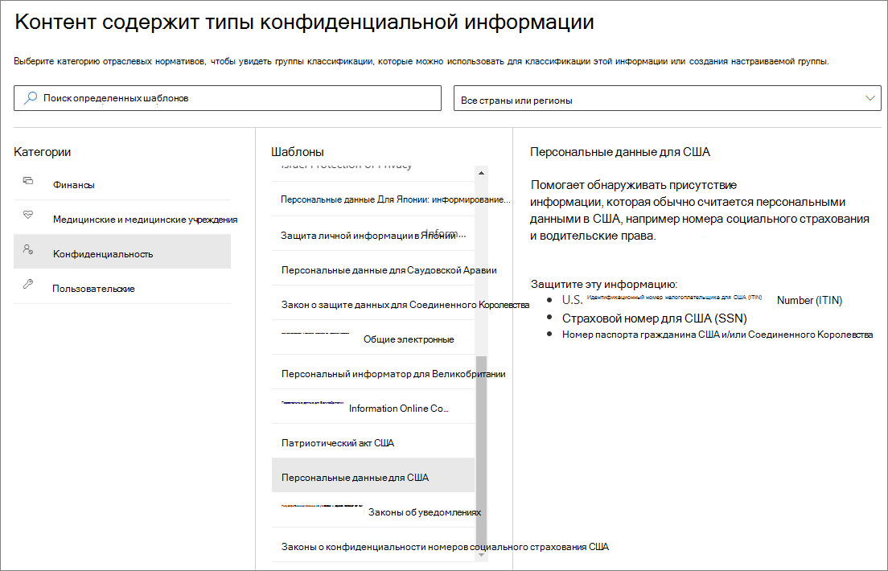

# <a name="create-publish-and-auto-apply-retention-labels"></a><span data-ttu-id="1d2e6-103">Создание, публикация и автоматическое применение меток хранения</span><span class="sxs-lookup"><span data-stu-id="1d2e6-103">Create, publish, and auto-apply retention labels</span></span>

><span data-ttu-id="1d2e6-104">*[Руководство по лицензированию Microsoft 365 для обеспечения безопасности и соответствия требованиям](https://aka.ms/ComplianceSD).*</span><span class="sxs-lookup"><span data-stu-id="1d2e6-104">*[Microsoft 365 licensing guidance for security & compliance](https://aka.ms/ComplianceSD).*</span></span>

<span data-ttu-id="1d2e6-105">Используйте сведения ниже, чтобы создать [метки хранения](labels.md), а затем автоматически применять их к документам и электронным сообщениям, или публиковать их, чтобы пользователи могли применить их вручную.</span><span class="sxs-lookup"><span data-stu-id="1d2e6-105">Use the following information to help you create [retention labels](labels.md), and then automatically apply them to documents and emails, or publish them so that users can manually apply them.</span></span>

<span data-ttu-id="1d2e6-106">Метки хранения помогают сохранить необходимые и удалить ненужные данные.</span><span class="sxs-lookup"><span data-stu-id="1d2e6-106">Retention labels help you retain what you need and delete what you don't.</span></span> <span data-ttu-id="1d2e6-107">Они также используются для объявления элемента записью в роли метода [управления записями](records-management.md) для данных Microsoft 365.</span><span class="sxs-lookup"><span data-stu-id="1d2e6-107">They are also used to declare an item as a record as part of a [records management](records-management.md) solution for your Microsoft 365 data.</span></span>

<span data-ttu-id="1d2e6-108">Место создания и настройки меток хранения, зависит от того, используете ли вы управление записями.</span><span class="sxs-lookup"><span data-stu-id="1d2e6-108">Where you create and configure your retention labels depend on whether you're using records management or not.</span></span> <span data-ttu-id="1d2e6-109">В обоих случаях доступны соответствующие инструкции.</span><span class="sxs-lookup"><span data-stu-id="1d2e6-109">Instructions are provided for both scenarios.</span></span>

## <a name="before-you-begin"></a><span data-ttu-id="1d2e6-110">Перед началом работы</span><span class="sxs-lookup"><span data-stu-id="1d2e6-110">Before you begin</span></span>

<span data-ttu-id="1d2e6-111">Участникам команды по обеспечению соответствия требованиям, которые будут создавать метки хранения, потребуются разрешения для Центра безопасности и соответствия требованиям.</span><span class="sxs-lookup"><span data-stu-id="1d2e6-111">Members of your compliance team who will create retention labels need permissions to the Security &amp; Compliance Center.</span></span> <span data-ttu-id="1d2e6-112">По умолчанию администратор клиента обладает доступом к этому расположению и может предоставить ответственным за обеспечение соответствия требованиям и другим лицам доступ к Центру безопасности и соответствия требованиям, не предоставляя им все разрешения администратора клиента. Для этого рекомендуем вам перейти на страницу **Разрешения** в Центре безопасности и соответствия требованиям, изменить группу ролей **Администратор соответствия требованиям** и добавить участников в эту группу ролей.</span><span class="sxs-lookup"><span data-stu-id="1d2e6-112">By default, your tenant admin has access to this location and can give compliance officers and other people access to the Security &amp; Compliance Center, without giving them all of the permissions of a tenant admin. To do this, we recommend that you go to the **Permissions** page of the Security &amp; Compliance Center, edit the **Compliance Administrator** role group, and add members to that role group.</span></span> 
  
<span data-ttu-id="1d2e6-113">Дополнительные сведения см. в статье [Предоставление пользователям доступа к Центру безопасности и соответствия требованиям Office 365](../security/office-365-security/grant-access-to-the-security-and-compliance-center.md).</span><span class="sxs-lookup"><span data-stu-id="1d2e6-113">For more information, see [Give users access to the Office 365 Security &amp; Compliance Center](../security/office-365-security/grant-access-to-the-security-and-compliance-center.md).</span></span>
  
<span data-ttu-id="1d2e6-p104">Эти разрешения необходимы только для создания и применения меток хранения и соответствующей политики. Для применения политики не требуется доступ к контенту.</span><span class="sxs-lookup"><span data-stu-id="1d2e6-p104">These permissions are required only to create and apply retention labels and a label policy. Policy enforcement does not require access to the content.</span></span>

## <a name="create-and-configure-retention-labels"></a><span data-ttu-id="1d2e6-116">Создание и настройка меток хранения</span><span class="sxs-lookup"><span data-stu-id="1d2e6-116">Create and configure retention labels</span></span>

1. <span data-ttu-id="1d2e6-117">В [Центре соответствия требованиям Microsoft 365](https://compliance.microsoft.com/) перейдите в одно из следующих расположений:</span><span class="sxs-lookup"><span data-stu-id="1d2e6-117">In the [Microsoft 365 compliance center](https://compliance.microsoft.com/), navigate to one of the following locations:</span></span>
    
    - <span data-ttu-id="1d2e6-118">Если используется управление записями:</span><span class="sxs-lookup"><span data-stu-id="1d2e6-118">If you are using records management:</span></span>
        - <span data-ttu-id="1d2e6-119">**Решения** > **Управление записями** > вкладка **План хранения** > **+ Создать метку** > **Метка хранения**</span><span class="sxs-lookup"><span data-stu-id="1d2e6-119">**Solutions** > **Records management** > **File plan** tab > **+ Create a label** > **Retention label**</span></span>
        
    - <span data-ttu-id="1d2e6-120">Если управление записями не используется:</span><span class="sxs-lookup"><span data-stu-id="1d2e6-120">If you are not using records management:</span></span>
       - <span data-ttu-id="1d2e6-121">**Решения** > **Управление информацией** > вкладка **Метки** > + **Создать метку**</span><span class="sxs-lookup"><span data-stu-id="1d2e6-121">**Solutions** > **Information governance** > **Labels** tab > + **Create a label**</span></span>
    
    <span data-ttu-id="1d2e6-122">Не отображается необходимый параметр?</span><span class="sxs-lookup"><span data-stu-id="1d2e6-122">Don't immediately see your option?</span></span> <span data-ttu-id="1d2e6-123">Сначала выберите **Показать все**.</span><span class="sxs-lookup"><span data-stu-id="1d2e6-123">First select **Show all**.</span></span> 

2. <span data-ttu-id="1d2e6-124">Следуйте указаниям мастера.</span><span class="sxs-lookup"><span data-stu-id="1d2e6-124">Follow the prompts in the wizard.</span></span> <span data-ttu-id="1d2e6-125">Если используется управление записями:</span><span class="sxs-lookup"><span data-stu-id="1d2e6-125">If you are using records management:</span></span>
    
    - <span data-ttu-id="1d2e6-126">Дополнительные сведения о дескрипторах плана хранения, см. в статье [Общие сведения о диспетчере плана хранения](file-plan-manager.md)</span><span class="sxs-lookup"><span data-stu-id="1d2e6-126">For information about the file plan descriptors, see [Overview of file plan manager](file-plan-manager.md)</span></span>
    
    - <span data-ttu-id="1d2e6-127">Чтобы использовать метку хранения для объявления содержимого записью, включите флажок **Использовать метку, чтобы классифицировать содержимое как "Запись"**.</span><span class="sxs-lookup"><span data-stu-id="1d2e6-127">To use the retention label to declare content as a record, enable the checkbox **Use label to classify content as a "Record"**.</span></span>

3. <span data-ttu-id="1d2e6-128">Повторите эти действия для создания дополнительных меток.</span><span class="sxs-lookup"><span data-stu-id="1d2e6-128">Repeat these steps to create more labels.</span></span>

<span data-ttu-id="1d2e6-129">Чтобы изменить существующую метку, выберите ее и нажмите **Изменить метку**.</span><span class="sxs-lookup"><span data-stu-id="1d2e6-129">To edit an existing label, select it, and then select **Edit label**.</span></span> <span data-ttu-id="1d2e6-130">При этом запускается тот же мастер, который позволяет изменить описания и параметры метки на шаге 2.</span><span class="sxs-lookup"><span data-stu-id="1d2e6-130">This starts the same wizard, which lets you change the label descriptions and settings in step 2.</span></span>

## <a name="publish-retention-labels-by-creating-a-retention-label-policy"></a><span data-ttu-id="1d2e6-131">Публикуйте метки хранения, создавая их политику</span><span class="sxs-lookup"><span data-stu-id="1d2e6-131">Publish retention labels by creating a retention label policy</span></span>

<span data-ttu-id="1d2e6-132">Публикуйте метки хранения, чтобы пользователи могли применить их вручную.</span><span class="sxs-lookup"><span data-stu-id="1d2e6-132">Publish retention labels so that they can be manually applied by users.</span></span>

1. <span data-ttu-id="1d2e6-133">В [Центре соответствия требованиям Microsoft 365](https://compliance.microsoft.com/) перейдите в одно из следующих расположений:</span><span class="sxs-lookup"><span data-stu-id="1d2e6-133">In the [Microsoft 365 compliance center](https://compliance.microsoft.com/), navigate to one of the following locations:</span></span>
    
    - <span data-ttu-id="1d2e6-134">Если используется управление записями:</span><span class="sxs-lookup"><span data-stu-id="1d2e6-134">If you are using records management:</span></span>
        - <span data-ttu-id="1d2e6-135">**Решения** > **Управление записями** > > вкладка**Политики меток** > **Опубликовать метки**</span><span class="sxs-lookup"><span data-stu-id="1d2e6-135">**Solutions** > **Records management** > > **Label policies** tab > **Publish labels**</span></span>
    
    - <span data-ttu-id="1d2e6-136">Если управление записями не используется:</span><span class="sxs-lookup"><span data-stu-id="1d2e6-136">If you are not using records management:</span></span>
        - <span data-ttu-id="1d2e6-137">**Решения** > **Управление информацией** >  вкладка **Политики меток** > **Опубликовать метки**</span><span class="sxs-lookup"><span data-stu-id="1d2e6-137">**Solutions** > **Information governance** > **Label policies** tab > **Publish labels**</span></span>
    
    <span data-ttu-id="1d2e6-138">Не отображается необходимый параметр?</span><span class="sxs-lookup"><span data-stu-id="1d2e6-138">Don't immediately see your option?</span></span> <span data-ttu-id="1d2e6-139">Сначала выберите **Показать все**.</span><span class="sxs-lookup"><span data-stu-id="1d2e6-139">First select **Show all**.</span></span> 

2. <span data-ttu-id="1d2e6-140">Следуйте указаниям мастера.</span><span class="sxs-lookup"><span data-stu-id="1d2e6-140">Follow the prompts in the wizard.</span></span>
    
    <span data-ttu-id="1d2e6-141">Сведения о настройке расположений, см. в разделе [Метки хранения и расположения](#retention-labels-and-locations) на этой странице.</span><span class="sxs-lookup"><span data-stu-id="1d2e6-141">For information about configuring the locations, see the [Retention labels and locations](#retention-labels-and-locations) section on this page.</span></span> 

## <a name="auto-apply-a-retention-label"></a><span data-ttu-id="1d2e6-142">Автоматическое применение меток хранения</span><span class="sxs-lookup"><span data-stu-id="1d2e6-142">Auto-apply a retention label</span></span>

<span data-ttu-id="1d2e6-143">Применяйте метки хранения автоматически на основе указанных условий.</span><span class="sxs-lookup"><span data-stu-id="1d2e6-143">Auto-apply a retention label, based on the conditions that you specify.</span></span>

1. <span data-ttu-id="1d2e6-144">В [Центре соответствия требованиям Microsoft 365](https://compliance.microsoft.com/) перейдите в одно из следующих расположений:</span><span class="sxs-lookup"><span data-stu-id="1d2e6-144">In the [Microsoft 365 compliance center](https://compliance.microsoft.com/), navigate to one of the following locations:</span></span>
    
    - <span data-ttu-id="1d2e6-145">Если используется управление записями: **Управление информацией**:</span><span class="sxs-lookup"><span data-stu-id="1d2e6-145">If you are using records management: **Information governance**:</span></span>
        - <span data-ttu-id="1d2e6-146">**Решения** > **Управление записями** >  вкладка **Политики меток** > **Автоматически применить метку**</span><span class="sxs-lookup"><span data-stu-id="1d2e6-146">**Solutions** > **Records management** > **Label policies** tab > **Auto-apply label**</span></span>
    
    - <span data-ttu-id="1d2e6-147">Если управление записями не используется:</span><span class="sxs-lookup"><span data-stu-id="1d2e6-147">If you are not using records management:</span></span>
        - <span data-ttu-id="1d2e6-148">**Решения** > **Управление информацией** >  вкладка **Политики меток** > **Автоматически применить метку**</span><span class="sxs-lookup"><span data-stu-id="1d2e6-148">**Solutions** > **Information governance** > **Label policies** tab > **Auto-apply label**</span></span>
    
    <span data-ttu-id="1d2e6-149">Не отображается необходимый параметр?</span><span class="sxs-lookup"><span data-stu-id="1d2e6-149">Don't immediately see your option?</span></span> <span data-ttu-id="1d2e6-150">Сначала выберите **Показать все**.</span><span class="sxs-lookup"><span data-stu-id="1d2e6-150">First select **Show all**.</span></span> 

2. <span data-ttu-id="1d2e6-151">Следуйте указаниям мастера.</span><span class="sxs-lookup"><span data-stu-id="1d2e6-151">Follow the prompts in the wizard.</span></span>
    
    <span data-ttu-id="1d2e6-152">Сведения о настройке условий для автоматического применения метки хранения, см. в разделе [Настройка условий автоматического применения меток хранения](#configuring-conditions-for-auto-apply-retention-labels) на этой странице.</span><span class="sxs-lookup"><span data-stu-id="1d2e6-152">For information about configuring the conditions that automatically apply the retention label, see the [Configuring conditions for auto-apply retention labels](#configuring-conditions-for-auto-apply-retention-labels) section on this page.</span></span>
    
    <span data-ttu-id="1d2e6-153">Сведения о настройке расположений, см. в следующем разделе [Метки хранения и расположения](#retention-labels-and-locations) на этой странице.</span><span class="sxs-lookup"><span data-stu-id="1d2e6-153">For information about configuring the locations, see the next section on this page, [Retention labels and locations](#retention-labels-and-locations).</span></span>

## <a name="retention-labels-and-locations"></a><span data-ttu-id="1d2e6-154">Метки хранения и расположения</span><span class="sxs-lookup"><span data-stu-id="1d2e6-154">Retention labels and locations</span></span>

<span data-ttu-id="1d2e6-155">Метки хранения различных типов можно публиковать в разных расположениях, зависящих от назначения метки хранения.</span><span class="sxs-lookup"><span data-stu-id="1d2e6-155">Different types of retention labels can be published to different locations, depending on what the retention label does.</span></span>
  
|<span data-ttu-id="1d2e6-156">**Тип метки хранения**</span><span class="sxs-lookup"><span data-stu-id="1d2e6-156">**If the retention label is…**</span></span>|<span data-ttu-id="1d2e6-157">**Сфера применения политики меток**</span><span class="sxs-lookup"><span data-stu-id="1d2e6-157">**Then the label policy can be applied to…**</span></span>|
|:-----|:-----|
|<span data-ttu-id="1d2e6-158">Публикуемая для пользователей</span><span class="sxs-lookup"><span data-stu-id="1d2e6-158">Published to end users</span></span>  <br/> |<span data-ttu-id="1d2e6-159">Exchange, SharePoint, OneDrive, группы Office 365</span><span class="sxs-lookup"><span data-stu-id="1d2e6-159">Exchange, SharePoint, OneDrive, Office 365 groups</span></span>  <br/> |
|<span data-ttu-id="1d2e6-160">Автоматически применяемая в соответствии с типами конфиденциальной информации</span><span class="sxs-lookup"><span data-stu-id="1d2e6-160">Auto-applied based on sensitive information types</span></span>  <br/> |<span data-ttu-id="1d2e6-161">Exchange (только ко всем почтовым ящикам), SharePoint, OneDrive</span><span class="sxs-lookup"><span data-stu-id="1d2e6-161">Exchange (all mailboxes only), SharePoint, OneDrive</span></span>  <br/> |
|<span data-ttu-id="1d2e6-162">Автоматически применяемая по запросу</span><span class="sxs-lookup"><span data-stu-id="1d2e6-162">Auto-applied based on a query</span></span>  <br/> |<span data-ttu-id="1d2e6-163">Exchange, SharePoint, OneDrive, группы Office 365</span><span class="sxs-lookup"><span data-stu-id="1d2e6-163">Exchange, SharePoint, OneDrive, Office 365 groups</span></span>  <br/> |
   
<span data-ttu-id="1d2e6-164">В Exchange метки хранения (и для запросов, и для конфиденциальной информации) присваиваются автоматически только недавно отправленным сообщениям (данным при передаче), а не ко всем элементам в почтовом ящике (неактивным данным).</span><span class="sxs-lookup"><span data-stu-id="1d2e6-164">In Exchange, auto-apply retention labels (for both queries and sensitive information types) are applied only to messages newly sent (data in transit), not to all items currently in the mailbox (data at rest).</span></span> <span data-ttu-id="1d2e6-165">Кроме того, метки хранения для типов конфиденциальной информации могут автоматически присваиваться только всем почтовым ящикам: выбирать определенные почтовые ящики нельзя.</span><span class="sxs-lookup"><span data-stu-id="1d2e6-165">Also, auto-apply retention labels for sensitive information types can apply only to all mailboxes; you can't select the specific mailboxes.</span></span>
  
<span data-ttu-id="1d2e6-166">Общедоступные папки Exchange и Skype не поддерживают метки хранения.</span><span class="sxs-lookup"><span data-stu-id="1d2e6-166">Exchange public folders and Skype do not support retention labels.</span></span>


## <a name="configuring-conditions-for-auto-apply-retention-labels"></a><span data-ttu-id="1d2e6-167">Настройка условий для автоматического применения меток хранения</span><span class="sxs-lookup"><span data-stu-id="1d2e6-167">Configuring conditions for auto-apply retention labels</span></span>

<span data-ttu-id="1d2e6-168">Автоматически применяйте метки хранения к контенту, содержащему:</span><span class="sxs-lookup"><span data-stu-id="1d2e6-168">You can apply retention labels to content automatically when that content contains:</span></span>
  
- <span data-ttu-id="1d2e6-169">[конфиденциальную информацию определенных типов](#auto-apply-labels-to-content-with-specific-types-of-sensitive-information);</span><span class="sxs-lookup"><span data-stu-id="1d2e6-169">[Specific types of sensitive information](#auto-apply-labels-to-content-with-specific-types-of-sensitive-information)</span></span>
    
- <span data-ttu-id="1d2e6-170">[определенные ключевые слова, соответствующие созданному запросу](#auto-apply-labels-to-content-with-keywords-or-searchable-properties);</span><span class="sxs-lookup"><span data-stu-id="1d2e6-170">[Specific keywords that match a query you create](#auto-apply-labels-to-content-with-keywords-or-searchable-properties)</span></span>

- <span data-ttu-id="1d2e6-171">[совпадение для обучаемых классификаторов](#auto-apply-labels-to-content-by-using-trainable-classifiers).</span><span class="sxs-lookup"><span data-stu-id="1d2e6-171">[A match for trainable classifiers](#auto-apply-labels-to-content-by-using-trainable-classifiers)</span></span>
    


<span data-ttu-id="1d2e6-173">Автоматическое применение меток хранения к контенту, соответствующему заданным условиям, может занять до семи дней.</span><span class="sxs-lookup"><span data-stu-id="1d2e6-173">It can take up to seven days for auto-apply retention labels to be applied to all content that matches the conditions you've configured.</span></span>

### <a name="auto-apply-labels-to-content-with-specific-types-of-sensitive-information"></a><span data-ttu-id="1d2e6-174">Автоматическое применение меток к контенту с определенными типами конфиденциальной информации</span><span class="sxs-lookup"><span data-stu-id="1d2e6-174">Auto-apply labels to content with specific types of sensitive information</span></span>

<span data-ttu-id="1d2e6-175">Когда вы создаете автоматически присваиваемые метки хранения для конфиденциальной информации, вы видите тот же список шаблонов политик, что и при создании политики защиты от потери данных (DLP) .</span><span class="sxs-lookup"><span data-stu-id="1d2e6-175">When you create auto-apply retention labels for sensitive information, you see the same list of policy templates as when you create a data loss prevention (DLP) policy.</span></span> <span data-ttu-id="1d2e6-176">Каждый шаблон политик настроен для поиска определенных типов конфиденциальной информации.</span><span class="sxs-lookup"><span data-stu-id="1d2e6-176">Each policy template is preconfigured to look for specific types of sensitive information.</span></span> <span data-ttu-id="1d2e6-177">Например, показанный здесь шаблон служит для выявления идентификационного номера налогоплательщика (ITIN), номера социального страхования (SSN) и номера паспорта в американском формате.</span><span class="sxs-lookup"><span data-stu-id="1d2e6-177">For example, the template shown here looks for U.S. ITIN, SSN, and passport numbers.</span></span> <span data-ttu-id="1d2e6-178">Дополнительные сведения см. в статье [Обзор политик защиты от потери данных](data-loss-prevention-policies.md).</span><span class="sxs-lookup"><span data-stu-id="1d2e6-178">To learn more about DLP, see [Overview of data loss prevention policies](data-loss-prevention-policies.md).</span></span>
  

  
<span data-ttu-id="1d2e6-p112">Выбрав шаблон политики, вы можете добавлять или удалять конфиденциальную информацию любых типов, а также менять количество экземпляров и точность совпадения. В приведенном ниже примере метка хранения будет автоматически применяться, только если:</span><span class="sxs-lookup"><span data-stu-id="1d2e6-p112">After you select a policy template, you can add or remove any types of sensitive information, and you can change the instance count and match accuracy. In the example shown here, a retention label will be auto-applied only when:</span></span>
  
- <span data-ttu-id="1d2e6-p113">контент содержит от 1 до 9 экземпляров любого из этих трех типов конфиденциальной информации. Вы можете удалить **максимальное** значение, чтобы оно изменилось на **Любое**;</span><span class="sxs-lookup"><span data-stu-id="1d2e6-p113">The content contains between 1 and 9 instances of any of these three sensitive information types. You can delete the **max** value so that it changes to **any**.</span></span>
    
- <span data-ttu-id="1d2e6-p114">для определяемого типа конфиденциальной информации задана точность совпадения (или уровень надежности) не менее 75. Для многих типов конфиденциальной информации определяется несколько шаблонов. Чем выше точность совпадения, тем больше признаков (например, ключевых слов, дат или адресов) нужно для обнаружения шаблона. Проще говоря, чем ниже **минимальная** точность совпадения, тем проще сопоставить контент с условием.</span><span class="sxs-lookup"><span data-stu-id="1d2e6-p114">The type of sensitive information that's detected has a match accuracy (or confidence level) of at least 75. Many sensitive information types are defined with multiple patterns, where a pattern with a higher match accuracy requires more evidence to be found (such as keywords, dates, or addresses), while a pattern with a lower match accuracy requires less evidence. Simply put, the lower the **min** match accuracy, the easier it is for content to match the condition.</span></span> 
    
<span data-ttu-id="1d2e6-187">Дополнительные сведения об этих параметрах см. в разделе [Настройка правил для упрощения или усложнения сопоставления](data-loss-prevention-policies.md#tuning-rules-to-make-them-easier-or-harder-to-match).</span><span class="sxs-lookup"><span data-stu-id="1d2e6-187">For more information on these options, see [Tuning rules to make them easier or harder to match](data-loss-prevention-policies.md#tuning-rules-to-make-them-easier-or-harder-to-match).</span></span>
    

  
### <a name="auto-apply-labels-to-content-with-keywords-or-searchable-properties"></a><span data-ttu-id="1d2e6-189">Автоматическое применение меток к контенту с ключевыми словами или доступными для поиска свойствами</span><span class="sxs-lookup"><span data-stu-id="1d2e6-189">Auto-apply labels to content with keywords or searchable properties</span></span>

<span data-ttu-id="1d2e6-p115">Вы можете автоматически применять метки к контенту, соответствующему определенным условиям. Имеющиеся в данный момент условия поддерживают применение метки к контенту, содержащему определенные слова, фразы или значения доступных для поиска свойств. Вы можете уточнить запрос с помощью таких операторов поиска, как AND, OR и NOT.</span><span class="sxs-lookup"><span data-stu-id="1d2e6-p115">You can auto-apply labels to content that satisfies certain conditions. The conditions now available support applying a label to content that contains specific words, phrases, or values of searchable properties. You can refine your query by using search operators like AND, OR, and NOT.</span></span>

<span data-ttu-id="1d2e6-193">Дополнительные сведения о синтаксисе запросов см. в статье:</span><span class="sxs-lookup"><span data-stu-id="1d2e6-193">For more information on query syntax, see:</span></span>

- [<span data-ttu-id="1d2e6-194">Руководство по синтаксису языка запросов по ключевым словам (KQL)</span><span class="sxs-lookup"><span data-stu-id="1d2e6-194">Keyword Query Language (KQL) syntax reference</span></span>](https://docs.microsoft.com/sharepoint/dev/general-development/keyword-query-language-kql-syntax-reference)

<span data-ttu-id="1d2e6-p116">Метки на основе запросов используют индекс поиска для определения контента. Дополнительные сведения о допустимых свойствах, доступных для поиска, см. в статьях:</span><span class="sxs-lookup"><span data-stu-id="1d2e6-p116">Query-based labels use the search index to identify content. For more information on valid searchable properties, see:</span></span>

- [<span data-ttu-id="1d2e6-197">Запросы ключевых слов и условия поиска контента</span><span class="sxs-lookup"><span data-stu-id="1d2e6-197">Keyword queries and search conditions for Content Search</span></span>](keyword-queries-and-search-conditions.md)
- [<span data-ttu-id="1d2e6-198">Обзор свойств для обхода и управляемых свойств в SharePoint Server</span><span class="sxs-lookup"><span data-stu-id="1d2e6-198">Overview of crawled and managed properties in SharePoint Server</span></span>](https://docs.microsoft.com/SharePoint/technical-reference/crawled-and-managed-properties-overview)

<span data-ttu-id="1d2e6-199">Примеры запросов:</span><span class="sxs-lookup"><span data-stu-id="1d2e6-199">Examples queries:</span></span>

- <span data-ttu-id="1d2e6-200">Exchange</span><span class="sxs-lookup"><span data-stu-id="1d2e6-200">Exchange</span></span>
    - <span data-ttu-id="1d2e6-201">subject:"Квартальное финансирование"</span><span class="sxs-lookup"><span data-stu-id="1d2e6-201">subject:"Quarterly Financials"</span></span>
    - <span data-ttu-id="1d2e6-202">recipients:garthf</span><span class="sxs-lookup"><span data-stu-id="1d2e6-202">recipients:garthf</span></span><!--nolink--><span data-ttu-id="1d2e6-203">@contoso.com</span><span class="sxs-lookup"><span data-stu-id="1d2e6-203">@contoso.com</span></span>
- <span data-ttu-id="1d2e6-204">SharePoint и OneDrive</span><span class="sxs-lookup"><span data-stu-id="1d2e6-204">SharePoint and OneDrive</span></span>
    - <span data-ttu-id="1d2e6-205">contenttype:контракт</span><span class="sxs-lookup"><span data-stu-id="1d2e6-205">contenttype:contract</span></span>
    - <span data-ttu-id="1d2e6-206">site:https</span><span class="sxs-lookup"><span data-stu-id="1d2e6-206">site:https</span></span><!--nolink--><span data-ttu-id="1d2e6-207">://contoso.sharepoint.com/sites/teams/procurement И contenttype:contract</span><span class="sxs-lookup"><span data-stu-id="1d2e6-207">://contoso.sharepoint.com/sites/teams/procurement AND contenttype:contract</span></span>


### <a name="auto-apply-labels-to-content-by-using-trainable-classifiers"></a><span data-ttu-id="1d2e6-209">Автоматическое применение меток к контенту с помощью обучаемых классификаторов</span><span class="sxs-lookup"><span data-stu-id="1d2e6-209">Auto-apply labels to content by using trainable classifiers</span></span>

<span data-ttu-id="1d2e6-210">При использовании варианта для обучаемого классификатора вы можете выбрать один из встроенных классификаторов или настраиваемый классификатор.</span><span class="sxs-lookup"><span data-stu-id="1d2e6-210">When you choose the option for a trainable classifier, you can select one of the built-in classifiers, or a custom classifier.</span></span> <span data-ttu-id="1d2e6-211">К встроенным классификаторам относятся **Резюме**, **Исходный код**, **Целенаправленное притеснение**, **Сквернословие** и **Угрозы**.</span><span class="sxs-lookup"><span data-stu-id="1d2e6-211">The built-in classifiers include **Resumes**, **SourceCode**, **Targeted Harassment**, **Profanity**, and **Threat**:</span></span>


<span data-ttu-id="1d2e6-213">Для автоматического применения меток с помощью классификатора на сайтах и в почтовых ящиках SharePoint Online должно быть не менее 10 МБ данных.</span><span class="sxs-lookup"><span data-stu-id="1d2e6-213">To automatically apply a label by using this option, SharePoint Online sites and mailboxes must have at least 10 MB of data.</span></span>

<span data-ttu-id="1d2e6-214">Дополнительные сведения об обучаемых классификаторах см. в статье [Начало работы с обучаемыми классификаторами (предварительная версия)](classifier-getting-started-with.md).</span><span class="sxs-lookup"><span data-stu-id="1d2e6-214">For more information about trainable classifiers, see [Getting started with trainable classifiers (preview)](classifier-getting-started-with.md).</span></span>

<span data-ttu-id="1d2e6-215">Пример конфигурации см. в статье [Подготовка к использованию и использование встроенных классификаторов](classifier-using-a-ready-to-use-classifier.md#how-to-verify-that-a-built-in-classifier-will-meet-your-needs).</span><span class="sxs-lookup"><span data-stu-id="1d2e6-215">For an example configuration, see [How to prepare for and use a built-in classifier](classifier-using-a-ready-to-use-classifier.md#how-to-verify-that-a-built-in-classifier-will-meet-your-needs).</span></span>

## <a name="how-long-it-takes-for-retention-labels-to-take-effect"></a><span data-ttu-id="1d2e6-216">Срок вступления меток хранения в силу</span><span class="sxs-lookup"><span data-stu-id="1d2e6-216">How long it takes for retention labels to take effect</span></span>

<span data-ttu-id="1d2e6-217">При публикации автоматически применяемые метки хранения не сразу вступают в силу.</span><span class="sxs-lookup"><span data-stu-id="1d2e6-217">When you publish or auto-apply retention labels, they don't take effect immediately:</span></span>
  
1. <span data-ttu-id="1d2e6-218">Для начала необходимо синхронизировать политику меток с расположениями при помощи Центра администрирования.</span><span class="sxs-lookup"><span data-stu-id="1d2e6-218">First the label policy needs to be synced from the admin center to the locations in the policy.</span></span>
    
2. <span data-ttu-id="1d2e6-219">Затем в расположении может потребоваться некоторое время, чтобы опубликованные метки хранения стали доступными конечным пользователям или чтобы содержимому были автоматически присвоены соответствующие метки.</span><span class="sxs-lookup"><span data-stu-id="1d2e6-219">Then the location might require time to make published retention labels available to end users or time to auto-apply labels to content.</span></span> <span data-ttu-id="1d2e6-220">Необходимое для этого время зависит от расположения и типа метки хранения.</span><span class="sxs-lookup"><span data-stu-id="1d2e6-220">How long this takes depends on the location and type of retention label.</span></span>
    
### <a name="published-retention-labels"></a><span data-ttu-id="1d2e6-221">Опубликованные метки хранения</span><span class="sxs-lookup"><span data-stu-id="1d2e6-221">Published retention labels</span></span>

<span data-ttu-id="1d2e6-p119">При публикации меток хранения в SharePoint или OneDrive могут потребоваться сутки, чтобы эти метки хранения стали видны пользователям. Кроме того, при публикации меток хранения в Exchange может потребоваться 7 дней, чтобы эти метки хранения стали видны пользователям, а почтовый ящик должен содержать не менее 10 МБ данных.</span><span class="sxs-lookup"><span data-stu-id="1d2e6-p119">If you publish retention labels to SharePoint or OneDrive, it can take one day for those retention labels to appear for end users. In addition, if you publish retention labels to Exchange, it can take 7 days for those retention labels to appear for end users, and the mailbox needs to contain at least 10 MB of data.</span></span>
  

  
### <a name="auto-apply-retention-labels"></a><span data-ttu-id="1d2e6-225">Метки хранения, применяемые автоматически</span><span class="sxs-lookup"><span data-stu-id="1d2e6-225">Auto-apply retention labels</span></span>

<span data-ttu-id="1d2e6-226">Если метки хранения автоматически применяются к контенту, соответствующему определенным условиям, может потребоваться семь дней, чтобы метки хранения были применены ко всему существующему контенту, соответствующему условиям.</span><span class="sxs-lookup"><span data-stu-id="1d2e6-226">If you auto-apply retention labels to content matching specific conditions, it can take seven days for the retention labels to be applied to all existing content that matches the conditions.</span></span>
  

  
### <a name="how-to-check-on-the-status-of-retention-labels-published-to-exchange"></a><span data-ttu-id="1d2e6-228">Проверка состояния меток хранения, опубликованных в Exchange</span><span class="sxs-lookup"><span data-stu-id="1d2e6-228">How to check on the status of retention labels published to Exchange</span></span>

<span data-ttu-id="1d2e6-p120">В Exchange Online метки хранения становятся доступны пользователям в ходе процесса, выполняемого каждые семь дней. С помощью Powershell можно узнать, когда этот процесс выполнялся в прошлый раз, и определить, когда он запустится снова.</span><span class="sxs-lookup"><span data-stu-id="1d2e6-p120">In Exchange Online, retention labels are made available to end users by a process that runs every seven days. By using Powershell, you can see when this process last ran and thus determine when it will run again.</span></span>
  
1. <span data-ttu-id="1d2e6-231">[Подключение к Exchange Online PowerShell](https://go.microsoft.com/fwlink/?linkid=799773).</span><span class="sxs-lookup"><span data-stu-id="1d2e6-231">[Connect to Exchange Online PowerShell](https://go.microsoft.com/fwlink/?linkid=799773).</span></span>
    
2. <span data-ttu-id="1d2e6-232">Выполните следующие команды:</span><span class="sxs-lookup"><span data-stu-id="1d2e6-232">Run these commands.</span></span>
    
   ```powershell
   $logProps = Export-MailboxDiagnosticLogs <user> -ExtendedProperties
   ```

   ```powershell
   $xmlprops = [xml]($logProps.MailboxLog)
   ```

   ```powershell
   $xmlprops.Properties.MailboxTable.Property | ? {$_.Name -like "ELC*"}
   ```

<span data-ttu-id="1d2e6-233">В результатах свойство `ELCLastSuccessTimeStamp` (UTC) показывает, когда система в последний раз обрабатывала ваш почтовый ящик.</span><span class="sxs-lookup"><span data-stu-id="1d2e6-233">In the results, the `ELCLastSuccessTimeStamp` (UTC) property shows when the system last processed your mailbox.</span></span> <span data-ttu-id="1d2e6-234">Если этого не происходило с момента создания политики, метки не будут отображаться.</span><span class="sxs-lookup"><span data-stu-id="1d2e6-234">If it has not happened since the time you created the policy, the labels are not going to appear.</span></span> <span data-ttu-id="1d2e6-235">Для принудительной обработки выполните команду `Start-ManagedFolderAssistant -Identity <user>`.</span><span class="sxs-lookup"><span data-stu-id="1d2e6-235">To force processing, run  `Start-ManagedFolderAssistant -Identity <user>`.</span></span>
    
<span data-ttu-id="1d2e6-236">Если метки не отображаются в Outlook в Интернете, хотя они должны быть видны, очистите кэш браузера (CTRL+F5).</span><span class="sxs-lookup"><span data-stu-id="1d2e6-236">If labels aren't appearing in Outlook on the web and you think they should be, make sure to clear the cache in your browser (CTRL+F5).</span></span>
    

## <a name="updating-retention-labels-and-their-policies"></a><span data-ttu-id="1d2e6-237">Обновление меток хранения и их политик</span><span class="sxs-lookup"><span data-stu-id="1d2e6-237">Updating retention labels and their policies</span></span>

<span data-ttu-id="1d2e6-238">При изменении меток хранения, их политику или политику авто-применения когда метка хранения уже применена к контенту, ваши обновленные параметры автоматически применяются к этому контенту, в дополнение к уже помеченному.</span><span class="sxs-lookup"><span data-stu-id="1d2e6-238">If you edit a retention label, retention label policy, or auto-apply policy and the retention label is already applied to content, your updated settings will automatically be applied to this content in addition to content that's newly labeled.</span></span>

## <a name="find-the-powershell-cmdlets-for-retention-labels"></a><span data-ttu-id="1d2e6-239">Поиск командлетов PowerShell для меток хранения</span><span class="sxs-lookup"><span data-stu-id="1d2e6-239">Find the PowerShell cmdlets for retention labels</span></span>

<span data-ttu-id="1d2e6-240">Для использования командлетов меток хранения:</span><span class="sxs-lookup"><span data-stu-id="1d2e6-240">To use the retention label cmdlets:</span></span>
  
1. [<span data-ttu-id="1d2e6-241">Подключение к PowerShell Центра безопасности и соответствия требованиям Office 365</span><span class="sxs-lookup"><span data-stu-id="1d2e6-241">Connect to the Office 365 Security & Compliance Center Powershell</span></span>](https://docs.microsoft.com/powershell/exchange/office-365-scc/connect-to-scc-powershell/connect-to-scc-powershell)
    
2. <span data-ttu-id="1d2e6-242">Используйте эти командлеты Центра безопасности и соответствия требованиям Office 365:</span><span class="sxs-lookup"><span data-stu-id="1d2e6-242">Use these Office 365 Security & Compliance Center cmdlets:</span></span>
    
    - [<span data-ttu-id="1d2e6-243">Get-ComplianceTag</span><span class="sxs-lookup"><span data-stu-id="1d2e6-243">Get-ComplianceTag</span></span>](https://docs.microsoft.com/powershell/module/exchange/get-compliancetag)
    
    - [<span data-ttu-id="1d2e6-244">New-ComplianceTag</span><span class="sxs-lookup"><span data-stu-id="1d2e6-244">New-ComplianceTag</span></span>](https://docs.microsoft.com/powershell/module/exchange/new-compliancetag)
    
    - [<span data-ttu-id="1d2e6-245">Remove-ComplianceTag</span><span class="sxs-lookup"><span data-stu-id="1d2e6-245">Remove-ComplianceTag</span></span>](https://docs.microsoft.com/powershell/module/exchange/remove-compliancetag)
    
    - [<span data-ttu-id="1d2e6-246">Set-ComplianceTag</span><span class="sxs-lookup"><span data-stu-id="1d2e6-246">Set-ComplianceTag</span></span>](https://docs.microsoft.com/powershell/module/exchange/set-compliancetag)
    
    - [<span data-ttu-id="1d2e6-247">Enable-ComplianceTagStorage</span><span class="sxs-lookup"><span data-stu-id="1d2e6-247">Enable-ComplianceTagStorage</span></span>](https://docs.microsoft.com/powershell/module/exchange/enable-compliancetagstorage)
    
    - [<span data-ttu-id="1d2e6-248">Get-ComplianceTagStorage</span><span class="sxs-lookup"><span data-stu-id="1d2e6-248">Get-ComplianceTagStorage</span></span>](https://docs.microsoft.com/powershell/module/exchange/get-compliancetagstorage)
    
    - [<span data-ttu-id="1d2e6-249">Get-RetentionCompliancePolicy</span><span class="sxs-lookup"><span data-stu-id="1d2e6-249">Get-RetentionCompliancePolicy</span></span>](https://docs.microsoft.com/powershell/module/exchange/get-retentioncompliancepolicy)
    
    - [<span data-ttu-id="1d2e6-250">New-RetentionCompliancePolicy</span><span class="sxs-lookup"><span data-stu-id="1d2e6-250">New-RetentionCompliancePolicy</span></span>](https://docs.microsoft.com/powershell/module/exchange/new-retentioncompliancepolicy)
    
    - [<span data-ttu-id="1d2e6-251">Remove-RetentionCompliancePolicy</span><span class="sxs-lookup"><span data-stu-id="1d2e6-251">Remove-RetentionCompliancePolicy</span></span>](https://docs.microsoft.com/powershell/module/exchange/remove-retentioncompliancepolicy)
    
    - [<span data-ttu-id="1d2e6-252">Set-RetentionCompliancePolicy</span><span class="sxs-lookup"><span data-stu-id="1d2e6-252">Set-RetentionCompliancePolicy</span></span>](https://docs.microsoft.com/powershell/module/exchange/set-retentioncompliancepolicy)
    
    - [<span data-ttu-id="1d2e6-253">Get-RetentionComplianceRule</span><span class="sxs-lookup"><span data-stu-id="1d2e6-253">Get-RetentionComplianceRule</span></span>](https://docs.microsoft.com/powershell/module/exchange/get-retentioncompliancerule)
    
    - [<span data-ttu-id="1d2e6-254">New-RetentionComplianceRule</span><span class="sxs-lookup"><span data-stu-id="1d2e6-254">New-RetentionComplianceRule</span></span>](https://docs.microsoft.com/powershell/module/exchange/new-retentioncompliancerule)
    
    - [<span data-ttu-id="1d2e6-255">Remove-RetentionComplianceRule</span><span class="sxs-lookup"><span data-stu-id="1d2e6-255">Remove-RetentionComplianceRule</span></span>](https://docs.microsoft.com/powershell/module/exchange/remove-retentioncompliancerule)
    
    - [<span data-ttu-id="1d2e6-256">Set-RetentionComplianceRule</span><span class="sxs-lookup"><span data-stu-id="1d2e6-256">Set-RetentionComplianceRule</span></span>](https://docs.microsoft.com/powershell/module/exchange/set-retentioncompliancerule)
