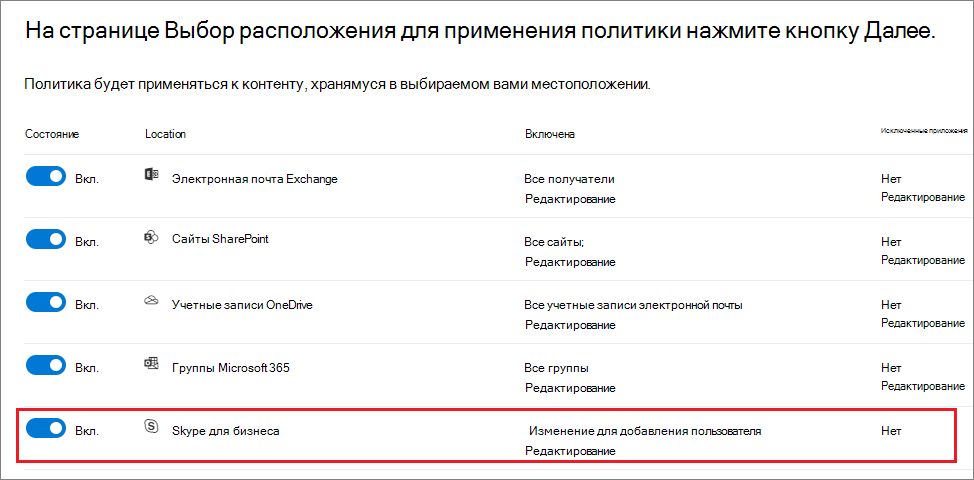

# <a name="create-and-configure-retention-policies"></a><span data-ttu-id="02a0c-103">Создание и настройка политик хранения</span><span class="sxs-lookup"><span data-stu-id="02a0c-103">Create and configure retention policies</span></span>

><span data-ttu-id="02a0c-104">*[Руководство по лицензированию Microsoft 365 для обеспечения безопасности и соответствия требованиям](https://aka.ms/ComplianceSD).*</span><span class="sxs-lookup"><span data-stu-id="02a0c-104">*[Microsoft 365 licensing guidance for security & compliance](https://aka.ms/ComplianceSD).*</span></span>

<span data-ttu-id="02a0c-105">Используйте политику хранения, чтобы заранее решить, следует ли сохранить контент, удалить контент или и то, и другое - сохранить, а затем удалить контент.</span><span class="sxs-lookup"><span data-stu-id="02a0c-105">Use a retention policy to decide proactively whether to retain content, delete content, or both - retain and then delete the content.</span></span> 

<span data-ttu-id="02a0c-106">Политика хранения позволяет очень эффективно выполнять эту задачу, назначая содержимому одни и те же параметры хранения по расположению, на уровне сайта или почтового ящика.</span><span class="sxs-lookup"><span data-stu-id="02a0c-106">A retention policy lets you do this very efficiently by assigning the same retention settings for content by location, at a site or mailbox level.</span></span> <span data-ttu-id="02a0c-107">Если вы не знаете, что использовать — политику или метку хранения, — см. раздел [Политики и метки хранения](retention.md#retention-policies-and-retention-labels).</span><span class="sxs-lookup"><span data-stu-id="02a0c-107">If you're not sure whether to use a retention policy or a retention label, see [Retention policies and retention labels](retention.md#retention-policies-and-retention-labels).</span></span>

<span data-ttu-id="02a0c-108">Дополнительные сведения о политиках хранения и о том, как работает хранение, см. в статье [Сведения о политиках и метках хранения](retention.md).</span><span class="sxs-lookup"><span data-stu-id="02a0c-108">For more information about retention policies and how retention works, see [Learn about retention](retention.md).</span></span>

## <a name="before-you-begin"></a><span data-ttu-id="02a0c-109">Перед началом работы</span><span class="sxs-lookup"><span data-stu-id="02a0c-109">Before you begin</span></span>

<span data-ttu-id="02a0c-110">Глобальный администратор организации обладает всеми разрешениями на создание и изменение политик хранения.</span><span class="sxs-lookup"><span data-stu-id="02a0c-110">The global admin for your organization has full permissions to create and edit retention policies.</span></span> <span data-ttu-id="02a0c-111">Если вы входите не как глобальный администратор, см. раздел [Разрешения, необходимые для создания и управления политиками хранения и метками хранения](get-started-with-retention.md#permissions-required-to-create-and-manage-retention-policies-and-retention-labels).</span><span class="sxs-lookup"><span data-stu-id="02a0c-111">If you aren't signing in as a global admin, see [Permissions required to create and manage retention policies and retention labels](get-started-with-retention.md#permissions-required-to-create-and-manage-retention-policies-and-retention-labels).</span></span>

## <a name="create-and-configure-a-retention-policy"></a><span data-ttu-id="02a0c-112">Создание и настройка политики хранения</span><span class="sxs-lookup"><span data-stu-id="02a0c-112">Create and configure a retention policy</span></span>

<span data-ttu-id="02a0c-113">Хотя политика хранения может поддерживать несколько расположений, невозможно создать одну политику хранения, включающую все поддерживаемые расположения.</span><span class="sxs-lookup"><span data-stu-id="02a0c-113">Although a retention policy can support multiple locations, you can't create a single retention policy that includes all the supported locations:</span></span>
- <span data-ttu-id="02a0c-114">Электронная почта Exchange</span><span class="sxs-lookup"><span data-stu-id="02a0c-114">Exchange email</span></span>
- <span data-ttu-id="02a0c-115">Сайт SharePoint</span><span class="sxs-lookup"><span data-stu-id="02a0c-115">SharePoint site</span></span>
- <span data-ttu-id="02a0c-116">Учетные записи OneDrive</span><span class="sxs-lookup"><span data-stu-id="02a0c-116">OneDrive accounts</span></span>
- <span data-ttu-id="02a0c-117">Группы Microsoft 365</span><span class="sxs-lookup"><span data-stu-id="02a0c-117">Microsoft 365 groups</span></span>
- <span data-ttu-id="02a0c-118">Skype для бизнеса</span><span class="sxs-lookup"><span data-stu-id="02a0c-118">Skype for Business</span></span>
- <span data-ttu-id="02a0c-119">Общедоступные папки Exchange</span><span class="sxs-lookup"><span data-stu-id="02a0c-119">Exchange public folders</span></span>
- <span data-ttu-id="02a0c-120">Сообщения из каналов Teams</span><span class="sxs-lookup"><span data-stu-id="02a0c-120">Teams channel messages</span></span>
- <span data-ttu-id="02a0c-121">Чаты Teams</span><span class="sxs-lookup"><span data-stu-id="02a0c-121">Teams chats</span></span>

<span data-ttu-id="02a0c-122">При выборе любого расположения в Teams во время создания политики хранения другие расположения автоматически исключаются.</span><span class="sxs-lookup"><span data-stu-id="02a0c-122">When you select either of the Teams locations when you create a retention policy, the other locations are automatically excluded.</span></span> <span data-ttu-id="02a0c-123">Поэтому дальнейшие действия зависят от того, нужно ли включать расположения в Teams:</span><span class="sxs-lookup"><span data-stu-id="02a0c-123">Therefore, the instructions to follow depend on whether you need to include the Teams locations:</span></span>

- [<span data-ttu-id="02a0c-124">Инструкции для политики хранения в расположениях Teams</span><span class="sxs-lookup"><span data-stu-id="02a0c-124">Instructions for a retention policy for Teams locations</span></span>](#retention-policy-for-teams-locations)
- [<span data-ttu-id="02a0c-125">Инструкции для политики хранения в других расположениях</span><span class="sxs-lookup"><span data-stu-id="02a0c-125">Instructions for a retention policy for locations other than Teams</span></span>](#retention-policy-for-locations-other-than-teams)

<span data-ttu-id="02a0c-126">Если у вас есть несколько политик хранения, а также используются метки хранения, см. раздел [Принципы хранения и приоритеты](retention.md#the-principles-of-retention-or-what-takes-precedence), чтобы понять результаты применения нескольких параметров хранения к одному и тому же содержимому.</span><span class="sxs-lookup"><span data-stu-id="02a0c-126">When you have more than one retention policy, and when you also use retention labels, see [The principles of retention, or what takes precedence?](retention.md#the-principles-of-retention-or-what-takes-precedence) to understand the outcome when multiple retention settings apply to the same content.</span></span>

### <a name="retention-policy-for-teams-locations"></a><span data-ttu-id="02a0c-127">Политика хранения для расположений в Teams</span><span class="sxs-lookup"><span data-stu-id="02a0c-127">Retention policy for Teams locations</span></span>

1. <span data-ttu-id="02a0c-128">В [Центре соответствия требованиям Microsoft 365](https://compliance.microsoft.com/) выберите **Политики** > **Сохранение**.</span><span class="sxs-lookup"><span data-stu-id="02a0c-128">From the [Microsoft 365 compliance center](https://compliance.microsoft.com/), select **Policies** > **Retention**.</span></span>

2. <span data-ttu-id="02a0c-129">Нажмите **Создать политику хранения**.</span><span class="sxs-lookup"><span data-stu-id="02a0c-129">Select **New retention policy** to create a new retention policy.</span></span>

3. <span data-ttu-id="02a0c-130">На странице мастера **Выберите, следует ли хранить содержимое, удалить его или и то, и другое** задайте параметры конфигурации для хранения и удаления содержимого.</span><span class="sxs-lookup"><span data-stu-id="02a0c-130">For **Decide if you want to retain content, delete it, or both** page of the wizard, specify the configuration options for retaining and deleting content.</span></span> 
    
    <span data-ttu-id="02a0c-131">Вы можете создать политику хранения, которая просто сохраняет содержимое без удаления, сохраняет, а затем удаляет по истечении определенного периода времени или просто удаляет содержимое по истечении указанного периода времени.</span><span class="sxs-lookup"><span data-stu-id="02a0c-131">You can create a retention policy that just retains content without deleting, retains and then deletes after a specified period of time, or just deletes content after a specified period of time.</span></span> <span data-ttu-id="02a0c-132">Дополнительные сведения см. в разделе [Настройки для сохранения и удаления контента](#settings-for-retaining-and-deleting-content) на этой странице.</span><span class="sxs-lookup"><span data-stu-id="02a0c-132">For more information, see [Settings for retaining and deleting content](#settings-for-retaining-and-deleting-content) on this page.</span></span>
    
    <span data-ttu-id="02a0c-133">Не выбирайте параметр **Использовать расширенные возможности хранения**, так как он не поддерживается в расположениях Teams.</span><span class="sxs-lookup"><span data-stu-id="02a0c-133">Do not select **Use advanced retention settings** because this option isn't supported for Teams locations.</span></span> 

4. <span data-ttu-id="02a0c-134">На вкладке **Выберите расположения** нажмите **Позволить мне выбрать расположения**.</span><span class="sxs-lookup"><span data-stu-id="02a0c-134">For the **Choose locations** page, select **Let me choose specific locations**.</span></span> <span data-ttu-id="02a0c-135">Затем включите одно или оба расположения для Teams: **Сообщение на канале Teams** и **Чаты Teams**.</span><span class="sxs-lookup"><span data-stu-id="02a0c-135">Then toggle on one or both of the locations for Teams: **Teams channel message** and **Teams chats**.</span></span>
     
    <span data-ttu-id="02a0c-136">Для **сообщений канала Teams** включены сообщения от стандартных каналов, но не от [частных каналов](https://docs.microsoft.com/microsoftteams/private-channels).</span><span class="sxs-lookup"><span data-stu-id="02a0c-136">For **Teams channel messages**, message from standard channels but not [private channels](https://docs.microsoft.com/microsoftteams/private-channels) are included.</span></span> <span data-ttu-id="02a0c-137">В настоящее время закрытые каналы не поддерживаются политиками хранения.</span><span class="sxs-lookup"><span data-stu-id="02a0c-137">Currently, private channels aren't supported by retention policies.</span></span>
    
    <span data-ttu-id="02a0c-138">По умолчанию выбраны все команды, но вы можете уточнить выбор, указав, какие команды следует включить, а какие — исключить.</span><span class="sxs-lookup"><span data-stu-id="02a0c-138">By default, all teams are selected, but you can refine this by specifying teams to be included, or teams to be excluded.</span></span>

5. <span data-ttu-id="02a0c-139">Завершите работу мастера, чтобы сохранить настройки.</span><span class="sxs-lookup"><span data-stu-id="02a0c-139">Complete the wizard to save your settings.</span></span>

<span data-ttu-id="02a0c-140">Дополнительные сведения о политиках хранения для Teams см. в статье [Политики хранения в Microsoft Teams](https://docs.microsoft.com/microsoftteams/retention-policies) из документации по Teams.</span><span class="sxs-lookup"><span data-stu-id="02a0c-140">For more information about retention policies for Teams, see [Retention policies in Microsoft Teams](https://docs.microsoft.com/microsoftteams/retention-policies) from the Teams documentation.</span></span>

#### <a name="additional-retention-policy-needed-to-support-teams"></a><span data-ttu-id="02a0c-141">Дополнительная политика хранения, необходимая для поддержки Teams</span><span class="sxs-lookup"><span data-stu-id="02a0c-141">Additional retention policy needed to support Teams</span></span>

<span data-ttu-id="02a0c-142">Teams — это не только сообщения в чатах и каналах.</span><span class="sxs-lookup"><span data-stu-id="02a0c-142">Teams is more than just chats and channel messages.</span></span> <span data-ttu-id="02a0c-143">Если у вас есть команды, созданные на основе группы Microsoft 365 (прежнее название — группа Office 365), необходимо дополнительно настроить политику хранения, включающую эту группу Microsoft 365, используя расположение **Группы Office 365**.</span><span class="sxs-lookup"><span data-stu-id="02a0c-143">If you have teams that were created from a Microsoft 365 group (formerly Office 365 group), you should additionally configure a retention policy that includes that Microsoft 365 group by using the **Office 365 groups** location.</span></span> <span data-ttu-id="02a0c-144">Эта политика хранения применяется к содержимому почтового ящика, сайта и файлов группы.</span><span class="sxs-lookup"><span data-stu-id="02a0c-144">This retention policy applies to content in the group's mailbox, site, and files.</span></span>

<span data-ttu-id="02a0c-145">Если у вас есть сайты групп, не подключенные к группе Microsoft 365, для хранения и удаления файлов в Teams нужна политика хранения, включающая расположение **Сайты SharePoint** или **Учетные записи OneDrive**.</span><span class="sxs-lookup"><span data-stu-id="02a0c-145">If you have team sites that aren't connected to a Microsoft 365 group, you need a retention policy that includes the **SharePoint sites** or **OneDrive accounts** locations to retain and delete files in Teams:</span></span>

- <span data-ttu-id="02a0c-146">Файлы, которыми пользователь поделился в чате, сохраняются в учетной записи OneDrive этого пользователя.</span><span class="sxs-lookup"><span data-stu-id="02a0c-146">Files that are shared in chat are stored in the OneDrive account of the user who shared the file.</span></span> 

- <span data-ttu-id="02a0c-147">Файлы, загруженные в каналы, хранятся на сайте SharePoint команды.</span><span class="sxs-lookup"><span data-stu-id="02a0c-147">Files that are uploaded to channels are stored in the SharePoint site for the team.</span></span>

> [!TIP]
> <span data-ttu-id="02a0c-148">Применить политику хранения можно к файлам только определенной команды, если она не подключена к группе Microsoft 365. Для этого нужно выбрать сайт SharePoint команды и учетные записи OneDrive участников команды.</span><span class="sxs-lookup"><span data-stu-id="02a0c-148">You can apply a retention policy to the files of just a specific team when it's not connected to a Microsoft 365 group by selecting the SharePoint site for the team, and the OneDrive accounts of users in the Team.</span></span>

<span data-ttu-id="02a0c-149">Политика хранения, примененная к группам Microsoft 365, сайтам SharePoint или учетным записям OneDrive, может удалить файл, на который ссылается сообщение чата или канала Teams, до удаления этого сообщения.</span><span class="sxs-lookup"><span data-stu-id="02a0c-149">It's possible that a retention policy that's applied to Microsoft 365 groups, SharePoint sites, or OneDrive accounts could delete a file that's referenced in a Teams chat or channel message before those messages get deleted.</span></span> <span data-ttu-id="02a0c-150">В этом случае файл по-прежнему отображается в сообщении Teams, но при его выборе возникает ошибка "Файл не найден".</span><span class="sxs-lookup"><span data-stu-id="02a0c-150">In this scenario, the file still displays in the Teams message, but when users select the file, they get a "File not found" error.</span></span> <span data-ttu-id="02a0c-151">Это ситуация относится не только к политикам хранения и может возникнуть также, если пользователь вручную удалит файл из SharePoint или OneDrive.</span><span class="sxs-lookup"><span data-stu-id="02a0c-151">This behavior isn't specific to retention policies and could also happen if a user manually deletes a file from SharePoint or OneDrive.</span></span>


### <a name="retention-policy-for-locations-other-than-teams"></a><span data-ttu-id="02a0c-152">Политика хранения для других расположений</span><span class="sxs-lookup"><span data-stu-id="02a0c-152">Retention policy for locations other than Teams</span></span>

1. <span data-ttu-id="02a0c-153">В [Центре соответствия требованиям Microsoft 365](https://compliance.microsoft.com/) выберите **Политики** > **Сохранение**.</span><span class="sxs-lookup"><span data-stu-id="02a0c-153">From the [Microsoft 365 compliance center](https://compliance.microsoft.com/), select **Policies** > **Retention**.</span></span>

2. <span data-ttu-id="02a0c-154">Нажмите **Создать политику хранения**.</span><span class="sxs-lookup"><span data-stu-id="02a0c-154">Select **New retention policy** to create a new retention policy.</span></span>

3. <span data-ttu-id="02a0c-155">На странице мастера **Выберите, следует ли хранить содержимое, удалить его или и то, и другое** задайте параметры конфигурации для хранения и удаления содержимого.</span><span class="sxs-lookup"><span data-stu-id="02a0c-155">For **Decide if you want to retain content, delete it, or both** page of the wizard, specify the configuration options for retaining and deleting content.</span></span> 
    
    <span data-ttu-id="02a0c-156">Вы можете создать политику хранения, которая просто сохраняет содержимое без удаления, сохраняет, а затем удаляет по истечении определенного периода времени или просто удаляет содержимое по истечении указанного периода времени.</span><span class="sxs-lookup"><span data-stu-id="02a0c-156">You can create a retention policy that just retains content without deleting, retains and then deletes after a specified period of time, or just deletes content after a specified period of time.</span></span> <span data-ttu-id="02a0c-157">Дополнительные сведения см. в разделе [Настройки для сохранения и удаления контента](#settings-for-retaining-and-deleting-content) на этой странице.</span><span class="sxs-lookup"><span data-stu-id="02a0c-157">For more information, see [Settings for retaining and deleting content](#settings-for-retaining-and-deleting-content) on this page.</span></span>
    
    <span data-ttu-id="02a0c-158">Затем решите, должна ли политика хранения применяться ко всему контенту или контенту, отвечающему определенным условиям.</span><span class="sxs-lookup"><span data-stu-id="02a0c-158">Then, decide whether the retention policy should apply to all content, or content that meets specific conditions.</span></span> <span data-ttu-id="02a0c-159">Для получения дополнительной информации об этих дополнительных параметрах хранения см. раздел [Дополнительные параметры для определения содержимого, соответствующего определенным условиям](#advanced-settings-to-identify-content-that-meets-specific-conditions), на этой странице.</span><span class="sxs-lookup"><span data-stu-id="02a0c-159">For more information about these advanced retention settings, see [Advanced settings to identify content that meets specific conditions](#advanced-settings-to-identify-content-that-meets-specific-conditions) on this page.</span></span> 

4. <span data-ttu-id="02a0c-160">На странице **Выбор местоположений** выберите, должна ли политика хранения применяться ко всем поддерживаемым местоположениям в вашей организации, или вы хотите указать местоположения.</span><span class="sxs-lookup"><span data-stu-id="02a0c-160">For the **Choose locations** page, select whether the retention policy should apply to all supported locations across your organization, or you want to specify the locations.</span></span> <span data-ttu-id="02a0c-161">Если вы выбираете определенные местоположения, вы также можете указать, включает и исключает.</span><span class="sxs-lookup"><span data-stu-id="02a0c-161">If you choose specific locations, you can also specify includes and excludes.</span></span> 
    
    <span data-ttu-id="02a0c-162">Для получения дополнительной информации о выборе между политикой хранения для организации или для определенных расположений см. [Применение политики хранения ко всей организации или определенным расположениям](#applying-a-retention-policy-to-an-entire-organization-or-specific-locations) на этой странице.</span><span class="sxs-lookup"><span data-stu-id="02a0c-162">For more information about choosing between a retention policy for the organization or for specific locations, see [Applying a retention policy to an entire organization or specific locations](#applying-a-retention-policy-to-an-entire-organization-or-specific-locations) on this page.</span></span>
    
    <span data-ttu-id="02a0c-163">Информация о конкретных расположениях:</span><span class="sxs-lookup"><span data-stu-id="02a0c-163">Information specific to locations:</span></span>
    - [<span data-ttu-id="02a0c-164">Электронная почта Exchange и общедоступные папки Exchange</span><span class="sxs-lookup"><span data-stu-id="02a0c-164">Exchange email and Exchange public folders</span></span>](#configuration-information-for-exchange-email-and-exchange-public-folders)
    - [<span data-ttu-id="02a0c-165">Сайты SharePoint и учетные записи OneDrive</span><span class="sxs-lookup"><span data-stu-id="02a0c-165">SharePoint sites and OneDrive accounts</span></span>](#configuration-information-for-sharepoint-sites-and-onedrive-accounts)
    - [<span data-ttu-id="02a0c-166">Группы Office 365</span><span class="sxs-lookup"><span data-stu-id="02a0c-166">Office 365 groups</span></span>](#configuration-information-for-microsoft-365-groups)
    - [<span data-ttu-id="02a0c-167">Skype для бизнеса</span><span class="sxs-lookup"><span data-stu-id="02a0c-167">Skype for Business</span></span>](#configuration-information-for-skype-for-business)

5. <span data-ttu-id="02a0c-168">Завершите работу мастера, чтобы сохранить настройки.</span><span class="sxs-lookup"><span data-stu-id="02a0c-168">Complete the wizard to save your settings.</span></span>


#### <a name="configuration-information-for-exchange-email-and-exchange-public-folders"></a><span data-ttu-id="02a0c-169">Сведения о конфигурации для электронной почты Exchange и общедоступных папок Exchange</span><span class="sxs-lookup"><span data-stu-id="02a0c-169">Configuration information for Exchange email and Exchange public folders</span></span>

<span data-ttu-id="02a0c-170">Расположение **Электронная почта Exchange** поддерживает хранение электронной почты, календаря и других элементов почтовых ящиков пользователей благодаря применению параметров хранения на уровне почтового ящика.</span><span class="sxs-lookup"><span data-stu-id="02a0c-170">The **Exchange email** location supports retention for users' email, calendar, and other mailbox items, by applying retention settings at the level of a mailbox.</span></span>

<span data-ttu-id="02a0c-171">Включаются следующие элементы почты: сообщения почты (в том числе черновики) со всеми вложениями, задачи и элементы календаря с датами окончания, а также заметки.</span><span class="sxs-lookup"><span data-stu-id="02a0c-171">The following mail items are included: Mail messages (includes drafts) with any attachments, tasks and calendar items when they have an end date, and notes.</span></span> <span data-ttu-id="02a0c-172">Контакты, задачи и элементы календаря, у которых нет даты окончания, не включаются.</span><span class="sxs-lookup"><span data-stu-id="02a0c-172">Contacts, and any tasks and calendar items that don't have an end date are not included.</span></span> <span data-ttu-id="02a0c-173">Прочие элементы, хранящиеся в почтовом ящике, например сохраненные сообщения Skype и Teams, не включаются в это расположение.</span><span class="sxs-lookup"><span data-stu-id="02a0c-173">Other items stored in a mailbox, such as Skype and Teams saved messages, aren't included with this location.</span></span> <span data-ttu-id="02a0c-174">У этих элементов есть собственные расположения для хранения.</span><span class="sxs-lookup"><span data-stu-id="02a0c-174">These items have their own retention locations.</span></span>

<span data-ttu-id="02a0c-175">Несмотря на то, что в группе Microsoft 365 есть почтовый ящик Exchange, политика хранения, включающая все расположение **электронной почты Exchange**, не будет включать содержимое в почтовые ящики группы Microsoft 365.</span><span class="sxs-lookup"><span data-stu-id="02a0c-175">Even though a Microsoft 365 group has an Exchange mailbox, a retention policy that includes the entire **Exchange email** location won't include content in Microsoft 365 group mailboxes.</span></span> <span data-ttu-id="02a0c-176">Чтобы сохранить содержимое в этих почтовых ящиках, выберите расположение **Группы Office 365**.</span><span class="sxs-lookup"><span data-stu-id="02a0c-176">To retain content in these mailboxes, select the **Office 365 groups** location.</span></span>

<span data-ttu-id="02a0c-177">В **общедоступных папках Exchange** параметры хранения применяются ко всем общедоступным папкам, и их невозможно использовать на уровне папки или почтового ящика.</span><span class="sxs-lookup"><span data-stu-id="02a0c-177">The **Exchange public folders** location applies retention settings to all public folders and can't be applied at the folder or mailbox level.</span></span>

#### <a name="configuration-information-for-sharepoint-sites-and-onedrive-accounts"></a><span data-ttu-id="02a0c-178">Сведения о конфигурации для сайтов SharePoint и учетных записей OneDrive</span><span class="sxs-lookup"><span data-stu-id="02a0c-178">Configuration information for SharePoint sites and OneDrive accounts</span></span>

<span data-ttu-id="02a0c-179">При выборе расположения **Сайты SharePoint** политика хранения может сохранять и удалять документы на информационных сайтах SharePoint, сайтах групп, не подключенных к группам Office 365, и классических сайтах.</span><span class="sxs-lookup"><span data-stu-id="02a0c-179">When you choose the **SharePoint sites** location, the retention policy can retain and delete documents in SharePoint communication sites, team sites that aren't connected by Office 365 groups, and classic sites.</span></span> <span data-ttu-id="02a0c-180">Сайты групп, подключенные к группам Office 365, не поддерживаются этим параметром, вместо этого используйте расположение **групп Office 365**, применимое к материалам в почтовом ящике, на сайте или в файлах группы.</span><span class="sxs-lookup"><span data-stu-id="02a0c-180">Team sites connected by Office 365 groups aren't supported with this option and instead, use the **Office 365 groups** location that applies to content in the group's mailbox, site, and files.</span></span>

<span data-ttu-id="02a0c-181">Хотя политика хранения применяется на уровне сайта, параметры хранения применяются только к документам.</span><span class="sxs-lookup"><span data-stu-id="02a0c-181">Although the retention policy is applied at the site level, only documents have retention settings applied to them.</span></span> <span data-ttu-id="02a0c-182">Параметры хранения не применяются к организационным структурам, включающим библиотеки, списки и папки на сайте.</span><span class="sxs-lookup"><span data-stu-id="02a0c-182">Retention settings do not apply to the organizing structures that include libraries, lists, and folders within the site.</span></span> 

<span data-ttu-id="02a0c-183">Когда вы указываете свои местоположения для сайтов SharePoint или учетных записей OneDrive, вам не нужны разрешения для доступа к сайтам, и при указании URL-адреса на странице **Изменить местоположения** не выполняются никакие проверки.</span><span class="sxs-lookup"><span data-stu-id="02a0c-183">When you specify your locations for SharePoint sites or OneDrive accounts, you don't need permissions to access the sites and no validation is done at the time you specify the URL on the **Edit locations** page.</span></span> <span data-ttu-id="02a0c-184">Однако сайты SharePoint должны быть проиндексированы, а в конце работы мастера проверяется их существование.</span><span class="sxs-lookup"><span data-stu-id="02a0c-184">However, the SharePoint sites must be indexed and the sites that you specify are checked that they exist at the end of the wizard.</span></span>

<span data-ttu-id="02a0c-185">Если эта проверка не пройдена, вы увидите сообщение о том, что проверка для введенного вами URL не удалась, и мастер не создаст политику хранения, пока проверка проверки не пройдет.</span><span class="sxs-lookup"><span data-stu-id="02a0c-185">If this check fails, you see a message that validation failed for the URL you entered, and the wizard won't create the retention policy until the validation check passes.</span></span> <span data-ttu-id="02a0c-186">Если вы видите это сообщение, вернитесь в мастер, чтобы изменить URL-адрес или удалить сайт из политики хранения.</span><span class="sxs-lookup"><span data-stu-id="02a0c-186">If you see this message, go back in the wizard to change the URL or remove the site from the retention policy.</span></span>

<span data-ttu-id="02a0c-187">Чтобы включить или исключить отдельные учетные записи OneDrive, используйте URL-адрес в следующем формате: `https://<tenant name>-my.sharepoint.com/personal/<user_name>_<tenant name>_com`</span><span class="sxs-lookup"><span data-stu-id="02a0c-187">To specify individual OneDrive accounts to include or exclude, the URL has the following format: `https://<tenant name>-my.sharepoint.com/personal/<user_name>_<tenant name>_com`</span></span>

<span data-ttu-id="02a0c-188">Например, для пользователя в клиенте Contoso с именем пользователя "rsimone": `https://contoso-my.sharepoint.com/personal/rsimone_contoso_onmicrosoft_com`</span><span class="sxs-lookup"><span data-stu-id="02a0c-188">For example, for a user in the contoso tenant that has a user name of "rsimone": `https://contoso-my.sharepoint.com/personal/rsimone_contoso_onmicrosoft_com`</span></span>

<span data-ttu-id="02a0c-189">Чтобы проверить синтаксис для клиента и определить URL-адреса для пользователей, ознакомьтесь со статьей [Получение списка всех пользовательских URL-адресов OneDrive в организации](https://docs.microsoft.com/onedrive/list-onedrive-urls).</span><span class="sxs-lookup"><span data-stu-id="02a0c-189">To verify the syntax for your tenant and identify URLs for users, see [Get a list of all user OneDrive URLs in your organization](https://docs.microsoft.com/onedrive/list-onedrive-urls).</span></span>

### <a name="configuration-information-for-microsoft-365-groups"></a><span data-ttu-id="02a0c-190">Сведения о конфигурации для групп Microsoft 365</span><span class="sxs-lookup"><span data-stu-id="02a0c-190">Configuration information for Microsoft 365 groups</span></span>

<span data-ttu-id="02a0c-191">Чтобы хранить или удалять содержимое группы Microsoft 365 (прежнее название — группа Office 365), используйте расположение **Группы Office 365**.</span><span class="sxs-lookup"><span data-stu-id="02a0c-191">To retain or delete content for a Microsoft 365 group (formerly Office 365 group), use the **Office 365 groups** location.</span></span> <span data-ttu-id="02a0c-192">Несмотря на то, что в группе Microsoft 365 есть почтовый ящик Exchange, политика хранения, включающая все расположение **электронной почты Exchange**, не будет включать содержимое в почтовые ящики группы Microsoft 365.</span><span class="sxs-lookup"><span data-stu-id="02a0c-192">Even though a Microsoft 365 group has an Exchange mailbox, a retention policy that includes the entire **Exchange email** location won't include content in Microsoft 365 group mailboxes.</span></span> <span data-ttu-id="02a0c-193">Дополнительно, хотя местоположение **электронной почты Exchange** изначально позволяет указать групповой почтовый ящик, который будет включен или исключен, при попытке сохранить политику хранения выдается сообщение о том, что «RemoteGroupMailbox» не является допустимым выбором для местоположения Exchange.</span><span class="sxs-lookup"><span data-stu-id="02a0c-193">In addition, although the **Exchange email** location initially allows you to specify a group mailbox to be included or excluded, when you try to save the retention policy, you receive an error that "RemoteGroupMailbox" is not a valid selection for the Exchange location.</span></span>

<span data-ttu-id="02a0c-194">Политика хранения, применяемая к группе Microsoft 365, включает в себя почтовый ящик группы и сайт групп, если последний был выбран во время создания группы или последующего добавления в группу.</span><span class="sxs-lookup"><span data-stu-id="02a0c-194">A retention policy applied to a Microsoft 365 group includes the group mailbox and teams site, if a teams site was selected at the time the group was created or later added to the group.</span></span> <span data-ttu-id="02a0c-195">Файлы, хранящиеся на сайте групп, охватываются этим местом, но не беседами Teams или сообщениями каналов Teams, у которых есть собственные местоположения политик хранения.</span><span class="sxs-lookup"><span data-stu-id="02a0c-195">Files stored in the teams site are covered with this location, but not Teams chats or Teams channel messages that have their own retention policy locations.</span></span>

### <a name="configuration-information-for-skype-for-business"></a><span data-ttu-id="02a0c-196">Информация о конфигурации для Skype для бизнеса</span><span class="sxs-lookup"><span data-stu-id="02a0c-196">Configuration information for Skype for Business</span></span>

<span data-ttu-id="02a0c-197">В отличие от электронной почты Exchange, вы не можете включить статус местоположения Skype, чтобы включить всех пользователей, но когда вы включаете это местоположение, вы затем вручную выбираете пользователей, чьи разговоры вы хотите сохранить:</span><span class="sxs-lookup"><span data-stu-id="02a0c-197">Unlike Exchange email, you can't toggle the status of the Skype location on to include all users, but when you turn on that location, you then manually choose the users whose conversations you want to retain:</span></span>


  
<span data-ttu-id="02a0c-199">Выбрав **Выбрать пользователей**, вы можете быстро включить всех пользователей, выбрав поле **Имя** в заголовке столбца.</span><span class="sxs-lookup"><span data-stu-id="02a0c-199">When you select **Choose users**, you can quickly include all users by selecting the **Name** box in the column header.</span></span> <span data-ttu-id="02a0c-200">но при этом важно понимать, что каждый пользователь засчитывается как отдельно включенный в политику.</span><span class="sxs-lookup"><span data-stu-id="02a0c-200">However, it's important to understand that each user counts as a specific inclusion in the policy.</span></span> <span data-ttu-id="02a0c-201">Поэтому, если вы выберете более 1000 пользователей, вступят в силу ограничения, о которых шла речь в предыдущем разделе.</span><span class="sxs-lookup"><span data-stu-id="02a0c-201">Therefore, if you include over 1,000 users, the limits noted in the previous section apply.</span></span> <span data-ttu-id="02a0c-202">Выбор всех пользователей Skype здесь не равносилен заданию гипотетической общеорганизационной политики, которая бы по умолчанию включала всех пользователей Skype.</span><span class="sxs-lookup"><span data-stu-id="02a0c-202">Selecting all Skype users here is not the same as if an org-wide policy were able to include all Skype users by default.</span></span> 
  

  
<span data-ttu-id="02a0c-p121">Обратите внимание, что **Журнал бесед**, папка в Outlook, не имеет отношения к архивам Skype. **Журнал бесед** может быть отключен пользователем, однако архивация для Skype выполняется путем сохранения копии бесед Skype в скрытой папке, не доступной для пользователя, но доступной для обнаружения электронных данных.</span><span class="sxs-lookup"><span data-stu-id="02a0c-p121">Note that **Conversation History**, a folder in Outlook, is a feature that has nothing to do with Skype archiving. **Conversation History** can be turned off by the end user, but archiving for Skype is done by storing a copy of Skype conversations in a hidden folder that is inaccessible to the user but available to eDiscovery.</span></span>


## <a name="settings-for-retaining-and-deleting-content"></a><span data-ttu-id="02a0c-206">Настройки для сохранения и удаления контента</span><span class="sxs-lookup"><span data-stu-id="02a0c-206">Settings for retaining and deleting content</span></span>

<span data-ttu-id="02a0c-207">Выбрав параметры для сохранения и удаления контента в вашей политике хранения, ваша политика хранения будет иметь одну из следующих конфигураций в течение определенного периода времени:</span><span class="sxs-lookup"><span data-stu-id="02a0c-207">By choosing the settings for retaining and deleting content in your retention policy, your retention policy will have one of the following configurations for a specified period of time:</span></span>

- <span data-ttu-id="02a0c-208">Только хранение</span><span class="sxs-lookup"><span data-stu-id="02a0c-208">Retain-only</span></span>
- <span data-ttu-id="02a0c-209">Сохранить и удалить</span><span class="sxs-lookup"><span data-stu-id="02a0c-209">Retain and then delete</span></span>
- <span data-ttu-id="02a0c-210">Только удаление</span><span class="sxs-lookup"><span data-stu-id="02a0c-210">Delete-only</span></span>

### <a name="retaining-content-for-a-specific-period-of-time"></a><span data-ttu-id="02a0c-211">Хранение содержимого в течение определенного периода времени</span><span class="sxs-lookup"><span data-stu-id="02a0c-211">Retaining content for a specific period of time</span></span>

<span data-ttu-id="02a0c-212">Когда вы настраиваете политику хранения, вы решаете сохранять контент на неопределенный срок или в течение определенного количества дней, месяцев или лет.</span><span class="sxs-lookup"><span data-stu-id="02a0c-212">When you configure a retention policy, you choose to retain content indefinitely or for a specific number of days, months, or years.</span></span> <span data-ttu-id="02a0c-213">Длительность хранения содержимого рассчитывается исходя из давности содержимого, а не с момента применения политики хранения.</span><span class="sxs-lookup"><span data-stu-id="02a0c-213">The duration for how long content is retained is calculated from the age of the content, not from when the retention policy is applied.</span></span> <span data-ttu-id="02a0c-214">Вы можете выбрать, как будет определяться давность содержимого (для OneDrive и SharePoint): по дате и времени создания или последнего изменения.</span><span class="sxs-lookup"><span data-stu-id="02a0c-214">You can choose whether the age is based on when the content was created or (for OneDrive and SharePoint) when it was last modified.</span></span>

<span data-ttu-id="02a0c-215">Примеры:</span><span class="sxs-lookup"><span data-stu-id="02a0c-215">Examples:</span></span>
  
- <span data-ttu-id="02a0c-216">SharePoint: если вы хотите сохранить содержимое в семействе сайтов в течение семи лет с момента его последнего изменения, а документ в этом семействе сайтов не изменялся в течение шести лет, документ будет сохраняться только еще один год, если он не был изменен.</span><span class="sxs-lookup"><span data-stu-id="02a0c-216">SharePoint: If you want to retain content in a site collection for seven years since it was last modified, and a document in that site collection hasn't been modified in six years, the document will be retained for only another year if it's not modified.</span></span> <span data-ttu-id="02a0c-217">Если документ редактируется снова, срок действия документа рассчитывается исходя из новой даты последнего изменения, и он будет сохраняться еще семь лет.</span><span class="sxs-lookup"><span data-stu-id="02a0c-217">If the document is edited again, the age of the document is calculated from the new last modified date, and it will be retained for another seven years.</span></span>
  
- <span data-ttu-id="02a0c-218">Обмен: Если вы хотите хранить содержимое в почтовом ящике в течение семи лет, а сообщение было отправлено шесть лет назад, оно будет храниться только один год.</span><span class="sxs-lookup"><span data-stu-id="02a0c-218">Exchange: If you want to retain content in a mailbox for seven years, and a message was sent six years ago, the message will be retained for only one year.</span></span> <span data-ttu-id="02a0c-219">Для содержимого Exchange возраст определяется на основе даты, полученной для входящей электронной почты, или даты, отправленной для исходящей электронной почты.</span><span class="sxs-lookup"><span data-stu-id="02a0c-219">For Exchange content, the age is based on the date received for incoming email, or the date sent for outgoing email.</span></span> <span data-ttu-id="02a0c-220">Хранение содержимого исходя из даты последнего изменения применяется только для содержимого сайтов в OneDrive и SharePoint.</span><span class="sxs-lookup"><span data-stu-id="02a0c-220">Retaining content based on when it was last modified applies only to site content in OneDrive and SharePoint.</span></span>
  
<span data-ttu-id="02a0c-221">По окончании срока хранения вы выбираете, хотите ли вы удалить содержимое навсегда:</span><span class="sxs-lookup"><span data-stu-id="02a0c-221">At the end of the retention period, you choose whether you want the content to be permanently deleted:</span></span>
  

  
### <a name="deleting-content-thats-older-than-a-specific-age"></a><span data-ttu-id="02a0c-223">Удаление содержимого, которое старше указанного возраста</span><span class="sxs-lookup"><span data-stu-id="02a0c-223">Deleting content that's older than a specific age</span></span>

<span data-ttu-id="02a0c-224">Политика хранения может предусматривать как хранение содержимого с последующим удалением, так и удаление старого содержимого без хранения.</span><span class="sxs-lookup"><span data-stu-id="02a0c-224">A retention policy can both retain and then delete content, or delete old content without retaining it.</span></span>
  
<span data-ttu-id="02a0c-225">Если политика хранения предусматривает удаление содержимого, важно понимать, что период, указанный для политики хранения, рассчитывается со времени создания или изменения содержимого, а не со времени назначения политики.</span><span class="sxs-lookup"><span data-stu-id="02a0c-225">If your retention policy deletes content, it's important to understand that the time period specified for a retention policy is calculated from the time when the content was created or modified, not the time since the policy was assigned.</span></span>
  

  
<span data-ttu-id="02a0c-227">Представьте, что вы создали политику хранения, согласно которой содержимое удаляется через три года, а затем назначили эту политику всем учетным записям OneDrive, содержащим большой объем данных, которые были созданы четыре или пять лет назад.</span><span class="sxs-lookup"><span data-stu-id="02a0c-227">For example, suppose that you create a retention policy that deletes content after three years, and then assign that policy to all OneDrive accounts, which contain a lot of content that was created four or five years ago.</span></span> <span data-ttu-id="02a0c-228">В этом случае значительная доля содержимого будет удалена вскоре после первого назначения этой политики хранения.</span><span class="sxs-lookup"><span data-stu-id="02a0c-228">In this case, a lot of content will be deleted soon after assigning the retention policy for the first time.</span></span> <span data-ttu-id="02a0c-229">По этой причине важно понимать, что политика хранения, которая удаляет контент, может оказать значительное влияние на ваш контент.</span><span class="sxs-lookup"><span data-stu-id="02a0c-229">For this reason, it's important to understand that a retention policy that deletes content can have a considerable impact on your content.</span></span> 
  
<span data-ttu-id="02a0c-p126">Потому перед первым назначением политики хранения семейству веб-сайтов следует сначала определить возраст содержимого и подумать о том, как может эта политика повлиять на такое содержимое. Кроме того, может потребоваться уведомить ваших пользователей о новой политике, прежде чем назначать ее, чтобы у них было время оценить возможное ее влияние. Обратите внимание на это предупреждение, которое появляется при просмотре параметров политики хранения непосредственно перед ее созданием.</span><span class="sxs-lookup"><span data-stu-id="02a0c-p126">Therefore, before you assign a retention policy to a site collection for the first time, you should first consider the age of the existing content and how the policy may impact that content. You may also want to communicate the new policy to your users before assigning it, to give them time to assess the possible impact. Note this warning that appears when you review the settings for your retention policy just before creating it.</span></span>
  

  
## <a name="advanced-settings-to-identify-content-that-meets-specific-conditions"></a><span data-ttu-id="02a0c-234">Расширенные настройки для определения содержимого, соответствующего определенным условиям</span><span class="sxs-lookup"><span data-stu-id="02a0c-234">Advanced settings to identify content that meets specific conditions</span></span>

<span data-ttu-id="02a0c-235">Политику хранения можно применить ко всему содержимому в расположениях, на которые она распространяется, или же только к содержимому, включающему определенные ключевые слова или [определенные типы конфиденциальной информации](what-the-sensitive-information-types-look-for.md).</span><span class="sxs-lookup"><span data-stu-id="02a0c-235">A retention policy can apply to all content in the locations that it includes, or you can choose to apply a retention policy only to content that contains specific keywords or [specific types of sensitive information](what-the-sensitive-information-types-look-for.md).</span></span>
  

  
### <a name="identify-content-that-contains-specific-keywords"></a><span data-ttu-id="02a0c-237">Определите контент, который содержит конкретные ключевые слова</span><span class="sxs-lookup"><span data-stu-id="02a0c-237">Identify content that contains specific keywords</span></span>

<span data-ttu-id="02a0c-238">Вы можете применить политику хранения только к контенту, отвечающему определенным условиям, а затем выполнить действия по сохранению только этого контента.</span><span class="sxs-lookup"><span data-stu-id="02a0c-238">You can apply a retention policy only to content that meets specific conditions, and then take retention actions on just that content.</span></span> <span data-ttu-id="02a0c-239">Доступные условия поддерживают применение политики хранения к контенту, который содержит определенные слова или фразы.</span><span class="sxs-lookup"><span data-stu-id="02a0c-239">The conditions available support applying a retention policy to content that contains specific words or phrases.</span></span> <span data-ttu-id="02a0c-240">Вы можете уточнить запрос, используя такие операторы поиска, как AND, OR и NOT.</span><span class="sxs-lookup"><span data-stu-id="02a0c-240">You can refine your query by using search operators like AND, OR, and NOT.</span></span> <span data-ttu-id="02a0c-241">Дополнительные сведения об этих операторах см. в статье [Запросы с ключевыми словами и условия для поиска содержимого](keyword-queries-and-search-conditions.md).</span><span class="sxs-lookup"><span data-stu-id="02a0c-241">For more information on these operators, see [Keyword queries and search conditions for Content Search](keyword-queries-and-search-conditions.md).</span></span>
  
<span data-ttu-id="02a0c-242">Поддержка добавления свойств, поддерживающих поиск (например, **subject:**), появится в скором времени.</span><span class="sxs-lookup"><span data-stu-id="02a0c-242">Support for adding searchable properties (for example, **subject:**) is coming soon.</span></span>
  
<span data-ttu-id="02a0c-243">При хранении на основе запросов используется индекс поиска для определения содержимого.</span><span class="sxs-lookup"><span data-stu-id="02a0c-243">Query-based retention uses the search index to identify content.</span></span>
  

  
### <a name="identify-content-that-contains-sensitive-information"></a><span data-ttu-id="02a0c-245">Определите контент, который содержит конфиденциальную информацию</span><span class="sxs-lookup"><span data-stu-id="02a0c-245">Identify content that contains sensitive information</span></span>

<span data-ttu-id="02a0c-p128">Если нужно, вы можете применить политику хранения только к содержимому, в котором есть определенные [типы конфиденциальной информации](what-the-sensitive-information-types-look-for.md). Например, можно установить уникальные требования к хранению содержимого, которое включает такие персональные данные, как идентификационные номера налогоплательщиков, номера социального страхования или номера паспортов.</span><span class="sxs-lookup"><span data-stu-id="02a0c-p128">You can also apply a retention policy only to content that contains [specific types of sensitive information](what-the-sensitive-information-types-look-for.md). For example, you can choose to apply unique retention requirements only to content that contains personal information, such as taxpayer identification numbers, social security numbers, or passport numbers.</span></span>
  

  
<span data-ttu-id="02a0c-249">Примечания:</span><span class="sxs-lookup"><span data-stu-id="02a0c-249">Notes:</span></span>
  
- <span data-ttu-id="02a0c-250">Дополнительные параметры хранения конфиденциальной информации не применяются к общедоступным папкам Exchange и Skype для бизнеса, так как эти расположения не поддерживают типы конфиденциальной информации.</span><span class="sxs-lookup"><span data-stu-id="02a0c-250">Advanced retention for sensitive information doesn't apply to Exchange public folders or Skype for Business because those locations don't support sensitive information types.</span></span>
    
- <span data-ttu-id="02a0c-251">Exchange Online использует правила потока почты (также известные как правила транспорта) для идентификации конфиденциальной информации, поэтому это работает только для транзитных сообщений, а не для всех элементов, уже сохраненных в почтовом ящике.</span><span class="sxs-lookup"><span data-stu-id="02a0c-251">Exchange Online uses mail flow rules (also known as transport rules) to identify sensitive information, so this works only on messages in transit—not on all items already stored in a mailbox.</span></span> <span data-ttu-id="02a0c-252">Для Exchange Online это означает, что выявлять конфиденциальную информацию и предпринимать действия в по хранению можно только в отношении сообщений, принятых **после** того, как политика была применена к почтовому ящику.</span><span class="sxs-lookup"><span data-stu-id="02a0c-252">For Exchange Online, this means that a retention policy can identify sensitive information and take retention actions only on messages that are received **after** the policy is applied to the mailbox.</span></span> <span data-ttu-id="02a0c-253">Хранение на основе запросов, описанное в предыдущем разделе, не имеет этого ограничения, поскольку оно использует поисковый индекс для идентификации контента.</span><span class="sxs-lookup"><span data-stu-id="02a0c-253">Query-based retention described in the previous section doesn't have this limitation because it uses the search index to identify content.</span></span> 
    
## <a name="applying-a-retention-policy-to-an-entire-organization-or-specific-locations"></a><span data-ttu-id="02a0c-254">Применение политики хранения ко всей организации или определенным расположениям</span><span class="sxs-lookup"><span data-stu-id="02a0c-254">Applying a retention policy to an entire organization or specific locations</span></span>

<span data-ttu-id="02a0c-255">Вы можете легко применить политику хранения ко всей организации, целому расположению или только к отдельным его частям или пользователям.</span><span class="sxs-lookup"><span data-stu-id="02a0c-255">You can easily apply a retention policy to an entire organization, entire locations, or only to specific locations or users.</span></span>
  
### <a name="org-wide-policy"></a><span data-ttu-id="02a0c-256">Политика для всей организации</span><span class="sxs-lookup"><span data-stu-id="02a0c-256">Org-wide policy</span></span>

<span data-ttu-id="02a0c-257">Одна из наиболее мощных функций политики хранения заключается в том, что она может применяться к местоположениям в Microsoft 365, включая:</span><span class="sxs-lookup"><span data-stu-id="02a0c-257">One of the most powerful features of a retention policy is that it can apply to locations across Microsoft 365, including:</span></span>
  
- <span data-ttu-id="02a0c-258">Электронная почта Exchange</span><span class="sxs-lookup"><span data-stu-id="02a0c-258">Exchange email</span></span>
    
- <span data-ttu-id="02a0c-259">Семейства веб-сайтов SharePoint</span><span class="sxs-lookup"><span data-stu-id="02a0c-259">SharePoint site collections</span></span>
    
- <span data-ttu-id="02a0c-260">Учетные записи OneDrive</span><span class="sxs-lookup"><span data-stu-id="02a0c-260">OneDrive accounts</span></span>
    
- <span data-ttu-id="02a0c-261">Группы Microsoft 365</span><span class="sxs-lookup"><span data-stu-id="02a0c-261">Microsoft 365 groups</span></span>
    
- <span data-ttu-id="02a0c-262">Общедоступные папки Exchange.</span><span class="sxs-lookup"><span data-stu-id="02a0c-262">Exchange public folders</span></span>
    


<span data-ttu-id="02a0c-264">Ниже перечислены другие важные возможности политики хранения для всей организации.</span><span class="sxs-lookup"><span data-stu-id="02a0c-264">Other important features of an org-wide retention policy include:</span></span>
  
- <span data-ttu-id="02a0c-265">Количество почтовых ящиков или сайтов, на которые может распространяться политика, не ограничено.</span><span class="sxs-lookup"><span data-stu-id="02a0c-265">There is no limit to the number of mailboxes or sites the policy can include.</span></span>
    
- <span data-ttu-id="02a0c-266">Для Exchange каждый новый почтовый ящик, созданный после применения политики, будет автоматически ее наследовать.</span><span class="sxs-lookup"><span data-stu-id="02a0c-266">For Exchange, any new mailbox created after the policy is applied will automatically inherit the policy.</span></span>
  
### <a name="a-policy-that-applies-to-entire-locations"></a><span data-ttu-id="02a0c-267">Политика, применяемая к целому расположению</span><span class="sxs-lookup"><span data-stu-id="02a0c-267">A policy that applies to entire locations</span></span>

<span data-ttu-id="02a0c-268">При выборе расположений можно легко включить или исключить из политики целое расположение, например всю электронную почту Exchange или все учетные записи OneDrive.</span><span class="sxs-lookup"><span data-stu-id="02a0c-268">When you choose locations, you can easily include or exclude an entire location, such as Exchange email or OneDrive accounts.</span></span> <span data-ttu-id="02a0c-269">Для этого включите или отключите параметр **Состояние** этого расположения.</span><span class="sxs-lookup"><span data-stu-id="02a0c-269">To do so, toggle the **Status** of that location on or off.</span></span> 
  
<span data-ttu-id="02a0c-270">Политика, применяемая к любому сочетанию целых расположений, может охватывать неограниченное количество почтовых ящиков и сайтов.</span><span class="sxs-lookup"><span data-stu-id="02a0c-270">Like an org-wide policy, if a policy applies to any combination of entire locations, there is no limit to the number of mailboxes or sites the policy can include.</span></span> 

<span data-ttu-id="02a0c-271">Например, если политика охватывает всю электронную почту Exchange и все сайты SharePoint, в нее будут включены все сайты и почтовые ящики независимо от их количества.</span><span class="sxs-lookup"><span data-stu-id="02a0c-271">For example, if a policy includes all Exchange email and all SharePoint sites, all sites and mailboxes will be included, no matter how many.</span></span> <span data-ttu-id="02a0c-272">А для Exchange любой новый почтовый ящик, созданный после применения политики, автоматически наследует политику.</span><span class="sxs-lookup"><span data-stu-id="02a0c-272">And for Exchange, any new mailbox created after the policy is applied will automatically inherit the policy.</span></span>

### <a name="a-policy-with-specific-inclusions-or-exclusions"></a><span data-ttu-id="02a0c-273">Политика, в которую включены нужные элементы</span><span class="sxs-lookup"><span data-stu-id="02a0c-273">A policy with specific inclusions or exclusions</span></span>

<span data-ttu-id="02a0c-274">Вы также можете применить политику хранения для определенных пользователей, определенных групп Microsoft 365 или определенных сайтов.</span><span class="sxs-lookup"><span data-stu-id="02a0c-274">You can also apply a retention policy to specific users, specific Microsoft 365 groups, or specific sites.</span></span> <span data-ttu-id="02a0c-275">Для этого переключите **Состояние** этого местоположения, а затем используйте ссылки для включения или исключения определенных пользователей, групп Microsoft 365 или сайтов.</span><span class="sxs-lookup"><span data-stu-id="02a0c-275">To do so, toggle the **Status** of that location on, and then use the links to include or exclude specific users, Microsoft 365 groups, or sites.</span></span> 
  
<span data-ttu-id="02a0c-276">Однако при использовании этой конфигурации существуют некоторые ограничения, когда ваша политика хранения включает или исключает более 1000 определенных местоположений:</span><span class="sxs-lookup"><span data-stu-id="02a0c-276">However, using this configuration, there are some limits when your retention policy includes or excludes over 1,000 specific locations:</span></span>
  
- <span data-ttu-id="02a0c-277">Максимальное количество для политики хранения:</span><span class="sxs-lookup"><span data-stu-id="02a0c-277">Maximum numbers for the retention policy:</span></span>
    - <span data-ttu-id="02a0c-278">1000 почтовых ящиков</span><span class="sxs-lookup"><span data-stu-id="02a0c-278">1,000 mailboxes</span></span>
    - <span data-ttu-id="02a0c-279">1 000 групп Microsoft 365</span><span class="sxs-lookup"><span data-stu-id="02a0c-279">1,000 Microsoft 365 groups</span></span>
    - <span data-ttu-id="02a0c-280">1 000 пользователей приватных чатов Teams</span><span class="sxs-lookup"><span data-stu-id="02a0c-280">1,000 users for Teams private chats</span></span>
    - <span data-ttu-id="02a0c-281">100 сайтов (OneDrive или SharePoint)</span><span class="sxs-lookup"><span data-stu-id="02a0c-281">100 sites (OneDrive or SharePoint)</span></span>

<span data-ttu-id="02a0c-282">Существует максимальное количество политик, поддерживаемых для клиента: 10 000.</span><span class="sxs-lookup"><span data-stu-id="02a0c-282">There is a maximum number of policies that are supported for a tenant: 10,000.</span></span> <span data-ttu-id="02a0c-283">Эти элементы включают политики хранения, политики меток хранения и политики автоматического применения.</span><span class="sxs-lookup"><span data-stu-id="02a0c-283">These items include retention policies, retention label policies, and auto-apply retention policies.</span></span>

<span data-ttu-id="02a0c-284">Если ваши политики хранения могут подвергаться этим ограничениям, выберите параметры конфигурации, которые применяются ко всем расположениям, или используйте политику всей организации.</span><span class="sxs-lookup"><span data-stu-id="02a0c-284">If your retention policies are likely to be subject to these limitations, choose the configuration options that apply to entire locations, or use an org-wide policy.</span></span>

> [!WARNING]
> <span data-ttu-id="02a0c-285">Если вы настроите объекты политики, а затем удалите последний из них, то конфигурация вернется в состояние **Все** для этого расположения.</span><span class="sxs-lookup"><span data-stu-id="02a0c-285">If you configure includes and then remove the last one, the configuration reverts to **All** for the location.</span></span>  <span data-ttu-id="02a0c-286">Убедитесь, что это именно та конфигурация, которая вам нужна, прежде чем сохранять политику.</span><span class="sxs-lookup"><span data-stu-id="02a0c-286">Make sure this is the configuration that you intend before you save the policy.</span></span>
> 
> <span data-ttu-id="02a0c-287">Например, если вы указали один сайт SharePoint для включения в свою политику хранения, настроенную для удаления данных, а затем удалили этот единственный сайт, то по умолчанию ко всем сайтам SharePoint будет применяться политика хранения, которая удаляет данные без возможности восстановления.</span><span class="sxs-lookup"><span data-stu-id="02a0c-287">For example, if you specify one SharePoint site to include in your retention policy that's configured to delete data, and then remove the single site, by default all SharePoint sites will then be subject to the retention policy that permanently deletes data.</span></span> <span data-ttu-id="02a0c-288">Это относится также к получателям в Exchange, учетным записям OneDrive, пользователям чатов Teams и т. д.</span><span class="sxs-lookup"><span data-stu-id="02a0c-288">The same applies to includes for Exchange recipients, OneDrive accounts, Teams chat users etc.</span></span>
> 
> <span data-ttu-id="02a0c-289">В этом случае отключите расположение, если не хотите, чтобы параметр **Все** для расположения стал применяться в политике хранения.</span><span class="sxs-lookup"><span data-stu-id="02a0c-289">In this scenario, toggle the location off if you don't want the **All** setting for the location to be subject to the retention policy.</span></span> <span data-ttu-id="02a0c-290">Кроме того, можно указать исключения из политики.</span><span class="sxs-lookup"><span data-stu-id="02a0c-290">Alternatively, specify excludes to be exempt from the policy.</span></span>

## <a name="updating-retention-policies"></a><span data-ttu-id="02a0c-291">Обновление политик хранения</span><span class="sxs-lookup"><span data-stu-id="02a0c-291">Updating retention policies</span></span>

<span data-ttu-id="02a0c-292">Если вы изменяете политику хранения, и для контента уже применяются исходные параметры в вашей политике хранения, ваши обновленные параметры будут автоматически применяться к этому контенту в дополнение к недавно идентифицированному контенту.</span><span class="sxs-lookup"><span data-stu-id="02a0c-292">If you edit a retention policy and content is already subject to the original settings in your retention policy, your updated settings will be automatically applied to this content in addition to content that's newly identified.</span></span>

<span data-ttu-id="02a0c-293">Обычно это обновление довольно быстрое, но может занять несколько дней.</span><span class="sxs-lookup"><span data-stu-id="02a0c-293">Usually this update is fairly quick but can take several days.</span></span> <span data-ttu-id="02a0c-294">Когда репликация политики по всем местоположениям Microsoft 365 будет завершена, вы увидите, что состояние политики хранения в центре соответствия Microsoft 365 изменится с **Вкл. (Ожидание)** на **Вкл. (Успешно)**.</span><span class="sxs-lookup"><span data-stu-id="02a0c-294">When the policy replication across your Microsoft 365 locations is complete, you'll see the status of the retention policy in the Microsoft 365 compliance center change from **On (Pending)** to **On (Success)**.</span></span>

## <a name="lock-a-retention-policy-by-using-powershell"></a><span data-ttu-id="02a0c-295">Блокировка политики хранения с помощью PowerShell</span><span class="sxs-lookup"><span data-stu-id="02a0c-295">Lock a retention policy by using PowerShell</span></span>

<span data-ttu-id="02a0c-296">Вы должны использовать PowerShell, если вам нужно применить [Блокировку для сохранения](retention.md#use-preservation-lock-to-comply-with-regulatory-requirements) для соответствия нормативным требованиям.</span><span class="sxs-lookup"><span data-stu-id="02a0c-296">You must use PowerShell if you need to use [Preservation Lock](retention.md#use-preservation-lock-to-comply-with-regulatory-requirements) to comply with regulatory requirements.</span></span> <span data-ttu-id="02a0c-297">Так как администраторы не могут отключить или удалить политику хранения после применения блокировки для сохранения, включение этой функции недоступно в пользовательском интерфейсе в качестве меры защиты от случайной настройки.</span><span class="sxs-lookup"><span data-stu-id="02a0c-297">Because administrators can't disable or delete a retention policy after a preservation lock is applied, enabling this feature is not available in the UI to safeguard against accidental configuration.</span></span>

<span data-ttu-id="02a0c-298">Все политики хранения с любой настройкой поддерживают блокировку для сохранения.</span><span class="sxs-lookup"><span data-stu-id="02a0c-298">All retention policies with any configuration support Preservation Lock.</span></span> <span data-ttu-id="02a0c-299">Однако если вы используете следующие команды PowerShell, вы заметите, что в параметре **Workload** всегда отображаются значения **Exchange, SharePoint, OneDriveForBusines, Skype, ModernGroup**, а не фактические рабочие нагрузки, настроенные в политике.</span><span class="sxs-lookup"><span data-stu-id="02a0c-299">However, when you use the PowerShell commands that follow, you'll notice that the **Workload** parameter always displays **Exchange, SharePoint, OneDriveForBusines, Skype, ModernGroup** rather than reflect the actual workloads configured in the policy.</span></span> <span data-ttu-id="02a0c-300">Это лишь проблема с отображением.</span><span class="sxs-lookup"><span data-stu-id="02a0c-300">This is a display issue only.</span></span>

1. <span data-ttu-id="02a0c-301">[Подключение к интерфейсу PowerShell Центра безопасности и соответствия требованиям](https://docs.microsoft.com/powershell/exchange/office-365-scc/connect-to-scc-powershell/connect-to-scc-powershell?view=exchange-ps).</span><span class="sxs-lookup"><span data-stu-id="02a0c-301">[Connect to Security & Compliance Center PowerShell](https://docs.microsoft.com/powershell/exchange/office-365-scc/connect-to-scc-powershell/connect-to-scc-powershell?view=exchange-ps).</span></span>

2. <span data-ttu-id="02a0c-302">Перечислите свои политики хранения и найдите название политики, которую вы хотите заблокировать, выполнив команду [Get-RetentionCompliancePolicy](https://powershell/module/exchange/get-retentioncompliancepolicy).</span><span class="sxs-lookup"><span data-stu-id="02a0c-302">List your retention policies and find the name of the policy that you want to lock by running [Get-RetentionCompliancePolicy](https://powershell/module/exchange/get-retentioncompliancepolicy).</span></span> <span data-ttu-id="02a0c-303">Например:</span><span class="sxs-lookup"><span data-stu-id="02a0c-303">For example:</span></span>
    
   
    
3. <span data-ttu-id="02a0c-305">Чтобы разместить блокировку для сохранения в политике хранения, выполните командлет [Set-RetentionCompliancePolicy]( ) с именем политики хранения и параметром *RestrictiveRetention* с присвоенным значением true:</span><span class="sxs-lookup"><span data-stu-id="02a0c-305">To place a Preservation Lock on a retention policy, run the [Set-RetentionCompliancePolicy]( ) cmdlet with the name of the retention policy, and the *RestrictiveRetention* parameter set to true:</span></span>
    
    ```powershell
    Set-RetentionCompliancePolicy -Identity "<Name of Policy>" –RestrictiveRetention $true
    ```
    
    <span data-ttu-id="02a0c-306">Например:</span><span class="sxs-lookup"><span data-stu-id="02a0c-306">For example:</span></span>
    
    
    
     <span data-ttu-id="02a0c-308">При появлении запроса прочтите и подтвердите ограничения, связанные с настройкой, путем ввода **Y**:</span><span class="sxs-lookup"><span data-stu-id="02a0c-308">When prompted, read and acknowledge the restrictions that come with this configuration by entering **Y**:</span></span>
    
   

<span data-ttu-id="02a0c-310">После этого для политики хранения установлена блокировка хранения.</span><span class="sxs-lookup"><span data-stu-id="02a0c-310">A Preservation Lock is now placed on the retention policy.</span></span> <span data-ttu-id="02a0c-311">Чтобы подтвердить, выполните команду `Get-RetentionCompliancePolicy` еще раз, но укажите имя политики хранения и отобразите параметры политики:</span><span class="sxs-lookup"><span data-stu-id="02a0c-311">To confirm, run `Get-RetentionCompliancePolicy` again, but specify the retention policy name and display the policy parameters:</span></span>

```powershell
Get-RetentionCompliancePolicy -Identity "<Name of Policy>" |Fl
```

<span data-ttu-id="02a0c-312">Вы увидите, что параметру **RestrictiveRetention** присвоено значение **True**.</span><span class="sxs-lookup"><span data-stu-id="02a0c-312">You should see **RestrictiveRetention** is set to **True**.</span></span> <span data-ttu-id="02a0c-313">Например:</span><span class="sxs-lookup"><span data-stu-id="02a0c-313">For example:</span></span>


  

