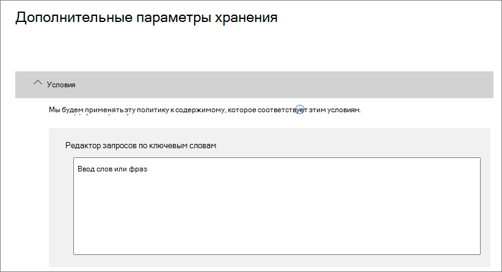

# <a name="create-and-configure-retention-policies"></a>Создание и настройка политик хранения

>*[Руководство по лицензированию Microsoft 365 для обеспечения безопасности и соответствия требованиям](https://aka.ms/ComplianceSD).*

Используйте политику хранения, чтобы заранее решить, следует ли сохранить контент, удалить контент или и то, и другое - сохранить, а затем удалить контент. 

Политика хранения позволяет очень эффективно выполнять эту задачу, назначая содержимому одни и те же параметры хранения по расположению, на уровне сайта или почтового ящика. Если вы не знаете, что использовать — политику или метку хранения, — см. раздел [Политики и метки хранения](retention.md#retention-policies-and-retention-labels).

Дополнительные сведения о политиках хранения и о том, как работает хранение, см. в статье [Сведения о политиках и метках хранения](retention.md).

## <a name="before-you-begin"></a>Перед началом работы

Глобальный администратор организации обладает всеми разрешениями на создание и изменение политик хранения. Если вы входите не как глобальный администратор, см. раздел [Разрешения, необходимые для создания и управления политиками хранения и метками хранения](get-started-with-retention.md#permissions-required-to-create-and-manage-retention-policies-and-retention-labels).

## <a name="create-and-configure-a-retention-policy"></a>Создание и настройка политики хранения

Хотя политика хранения может поддерживать несколько расположений, невозможно создать одну политику хранения, включающую все поддерживаемые расположения.
- Электронная почта Exchange
- Сайт SharePoint
- Учетные записи OneDrive
- Группы Microsoft 365
- Skype для бизнеса
- Общедоступные папки Exchange
- Сообщения из каналов Teams
- Чаты Teams

При выборе любого расположения в Teams во время создания политики хранения другие расположения автоматически исключаются. Поэтому дальнейшие действия зависят от того, нужно ли включать расположения в Teams:

- [Инструкции для политики хранения в расположениях Teams](#retention-policy-for-teams-locations)
- [Инструкции для политики хранения в других расположениях](#retention-policy-for-locations-other-than-teams)

Если у вас есть несколько политик хранения, а также используются метки хранения, см. раздел [Принципы хранения и приоритеты](retention.md#the-principles-of-retention-or-what-takes-precedence), чтобы понять результаты применения нескольких параметров хранения к одному и тому же содержимому.

### <a name="retention-policy-for-teams-locations"></a>Политика хранения для расположений в Teams

1. В [Центре соответствия требованиям Microsoft 365](https://compliance.microsoft.com/) выберите **Политики** > **Сохранение**.

2. Нажмите **Создать политику хранения**.

3. На странице мастера **Выберите, следует ли хранить содержимое, удалить его или и то, и другое** задайте параметры конфигурации для хранения и удаления содержимого. 
    
    Вы можете создать политику хранения, которая просто сохраняет содержимое без удаления, сохраняет, а затем удаляет по истечении определенного периода времени или просто удаляет содержимое по истечении указанного периода времени. Дополнительные сведения см. в разделе [Настройки для сохранения и удаления контента](#settings-for-retaining-and-deleting-content) на этой странице.
    
    Не выбирайте параметр **Использовать расширенные возможности хранения**, так как он не поддерживается в расположениях Teams. 

4. На вкладке **Выберите расположения** нажмите **Позволить мне выбрать расположения**. Затем включите одно или оба расположения для Teams: **Сообщение на канале Teams** и **Чаты Teams**.
     
    Для **сообщений канала Teams** включены сообщения от стандартных каналов, но не от [частных каналов](https://docs.microsoft.com/microsoftteams/private-channels). В настоящее время закрытые каналы не поддерживаются политиками хранения.
    
    По умолчанию выбраны все команды, но вы можете уточнить выбор, указав, какие команды следует включить, а какие — исключить.

5. Завершите работу мастера, чтобы сохранить настройки.

Дополнительные сведения о политиках хранения для Teams см. в статье [Политики хранения в Microsoft Teams](https://docs.microsoft.com/microsoftteams/retention-policies) из документации по Teams.

#### <a name="additional-retention-policy-needed-to-support-teams"></a>Дополнительная политика хранения, необходимая для поддержки Teams

Teams — это не только сообщения в чатах и каналах. Если у вас есть команды, созданные на основе группы Microsoft 365 (прежнее название — группа Office 365), необходимо дополнительно настроить политику хранения, включающую эту группу Microsoft 365, используя расположение **Группы Office 365**. Эта политика хранения применяется к содержимому почтового ящика, сайта и файлов группы.

Если у вас есть сайты групп, не подключенные к группе Microsoft 365, для хранения и удаления файлов в Teams нужна политика хранения, включающая расположение **Сайты SharePoint** или **Учетные записи OneDrive**.

- Файлы, которыми пользователь поделился в чате, сохраняются в учетной записи OneDrive этого пользователя. 

- Файлы, загруженные в каналы, хранятся на сайте SharePoint команды.

> [!TIP]
> Применить политику хранения можно к файлам только определенной команды, если она не подключена к группе Microsoft 365. Для этого нужно выбрать сайт SharePoint команды и учетные записи OneDrive участников команды.

Политика хранения, примененная к группам Microsoft 365, сайтам SharePoint или учетным записям OneDrive, может удалить файл, на который ссылается сообщение чата или канала Teams, до удаления этого сообщения. В этом случае файл по-прежнему отображается в сообщении Teams, но при его выборе возникает ошибка "Файл не найден". Это ситуация относится не только к политикам хранения и может возникнуть также, если пользователь вручную удалит файл из SharePoint или OneDrive.


### <a name="retention-policy-for-locations-other-than-teams"></a>Политика хранения для других расположений

1. В [Центре соответствия требованиям Microsoft 365](https://compliance.microsoft.com/) выберите **Политики** > **Сохранение**.

2. Нажмите **Создать политику хранения**.

3. На странице мастера **Выберите, следует ли хранить содержимое, удалить его или и то, и другое** задайте параметры конфигурации для хранения и удаления содержимого. 
    
    Вы можете создать политику хранения, которая просто сохраняет содержимое без удаления, сохраняет, а затем удаляет по истечении определенного периода времени или просто удаляет содержимое по истечении указанного периода времени. Дополнительные сведения см. в разделе [Настройки для сохранения и удаления контента](#settings-for-retaining-and-deleting-content) на этой странице.
    
    Затем решите, должна ли политика хранения применяться ко всему контенту или контенту, отвечающему определенным условиям. Для получения дополнительной информации об этих дополнительных параметрах хранения см. раздел [Дополнительные параметры для определения содержимого, соответствующего определенным условиям](#advanced-settings-to-identify-content-that-meets-specific-conditions), на этой странице. 

4. На странице **Выбор местоположений** выберите, должна ли политика хранения применяться ко всем поддерживаемым местоположениям в вашей организации, или вы хотите указать местоположения. Если вы выбираете определенные местоположения, вы также можете указать, включает и исключает. 
    
    Для получения дополнительной информации о выборе между политикой хранения для организации или для определенных расположений см. [Применение политики хранения ко всей организации или определенным расположениям](#applying-a-retention-policy-to-an-entire-organization-or-specific-locations) на этой странице.
    
    Информация о конкретных расположениях:
    - [Электронная почта Exchange и общедоступные папки Exchange](#configuration-information-for-exchange-email-and-exchange-public-folders)
    - [Сайты SharePoint и учетные записи OneDrive](#configuration-information-for-sharepoint-sites-and-onedrive-accounts)
    - [Группы Office 365](#configuration-information-for-microsoft-365-groups)
    - [Skype для бизнеса](#configuration-information-for-skype-for-business)

5. Завершите работу мастера, чтобы сохранить настройки.


#### <a name="configuration-information-for-exchange-email-and-exchange-public-folders"></a>Сведения о конфигурации для электронной почты Exchange и общедоступных папок Exchange

Расположение **Электронная почта Exchange** поддерживает хранение электронной почты, календаря и других элементов почтовых ящиков пользователей благодаря применению параметров хранения на уровне почтового ящика.

Включаются следующие элементы почты: сообщения почты (в том числе черновики) со всеми вложениями, задачи и элементы календаря с датами окончания, а также заметки. Контакты, задачи и элементы календаря, у которых нет даты окончания, не включаются. Прочие элементы, хранящиеся в почтовом ящике, например сохраненные сообщения Skype и Teams, не включаются в это расположение. У этих элементов есть собственные расположения для хранения.

Несмотря на то, что в группе Microsoft 365 есть почтовый ящик Exchange, политика хранения, включающая все расположение **электронной почты Exchange**, не будет включать содержимое в почтовые ящики группы Microsoft 365. Чтобы сохранить содержимое в этих почтовых ящиках, выберите расположение **Группы Office 365**.

В **общедоступных папках Exchange** параметры хранения применяются ко всем общедоступным папкам, и их невозможно использовать на уровне папки или почтового ящика.

#### <a name="configuration-information-for-sharepoint-sites-and-onedrive-accounts"></a>Сведения о конфигурации для сайтов SharePoint и учетных записей OneDrive

При выборе расположения **Сайты SharePoint** политика хранения может сохранять и удалять документы на информационных сайтах SharePoint, сайтах групп, не подключенных к группам Office 365, и классических сайтах. Сайты групп, подключенные к группам Office 365, не поддерживаются этим параметром, вместо этого используйте расположение **групп Office 365**, применимое к материалам в почтовом ящике, на сайте или в файлах группы.

Хотя политика хранения применяется на уровне сайта, параметры хранения применяются только к документам. Параметры хранения не применяются к организационным структурам, включающим библиотеки, списки и папки на сайте. 

Когда вы указываете свои местоположения для сайтов SharePoint или учетных записей OneDrive, вам не нужны разрешения для доступа к сайтам, и при указании URL-адреса на странице **Изменить местоположения** не выполняются никакие проверки. Однако сайты SharePoint должны быть проиндексированы, а в конце работы мастера проверяется их существование.

Если эта проверка не пройдена, вы увидите сообщение о том, что проверка для введенного вами URL не удалась, и мастер не создаст политику хранения, пока проверка проверки не пройдет. Если вы видите это сообщение, вернитесь в мастер, чтобы изменить URL-адрес или удалить сайт из политики хранения.

Чтобы включить или исключить отдельные учетные записи OneDrive, используйте URL-адрес в следующем формате: `https://<tenant name>-my.sharepoint.com/personal/<user_name>_<tenant name>_com`

Например, для пользователя в клиенте Contoso с именем пользователя "rsimone": `https://contoso-my.sharepoint.com/personal/rsimone_contoso_onmicrosoft_com`

Чтобы проверить синтаксис для клиента и определить URL-адреса для пользователей, ознакомьтесь со статьей [Получение списка всех пользовательских URL-адресов OneDrive в организации](https://docs.microsoft.com/onedrive/list-onedrive-urls).

### <a name="configuration-information-for-microsoft-365-groups"></a>Сведения о конфигурации для групп Microsoft 365

Чтобы хранить или удалять содержимое группы Microsoft 365 (прежнее название — группа Office 365), используйте расположение **Группы Office 365**. Несмотря на то, что в группе Microsoft 365 есть почтовый ящик Exchange, политика хранения, включающая все расположение **электронной почты Exchange**, не будет включать содержимое в почтовые ящики группы Microsoft 365. Дополнительно, хотя местоположение **электронной почты Exchange** изначально позволяет указать групповой почтовый ящик, который будет включен или исключен, при попытке сохранить политику хранения выдается сообщение о том, что «RemoteGroupMailbox» не является допустимым выбором для местоположения Exchange.

Политика хранения, применяемая к группе Microsoft 365, включает в себя почтовый ящик группы и сайт групп, если последний был выбран во время создания группы или последующего добавления в группу. Файлы, хранящиеся на сайте групп, охватываются этим местом, но не беседами Teams или сообщениями каналов Teams, у которых есть собственные местоположения политик хранения.

### <a name="configuration-information-for-skype-for-business"></a>Информация о конфигурации для Skype для бизнеса

В отличие от электронной почты Exchange, вы не можете включить статус местоположения Skype, чтобы включить всех пользователей, но когда вы включаете это местоположение, вы затем вручную выбираете пользователей, чьи разговоры вы хотите сохранить:


  
Выбрав **Выбрать пользователей**, вы можете быстро включить всех пользователей, выбрав поле **Имя** в заголовке столбца. но при этом важно понимать, что каждый пользователь засчитывается как отдельно включенный в политику. Поэтому, если вы выберете более 1000 пользователей, вступят в силу ограничения, о которых шла речь в предыдущем разделе. Выбор всех пользователей Skype здесь не равносилен заданию гипотетической общеорганизационной политики, которая бы по умолчанию включала всех пользователей Skype. 
  

  
Обратите внимание, что **Журнал бесед**, папка в Outlook, не имеет отношения к архивам Skype. **Журнал бесед** может быть отключен пользователем, однако архивация для Skype выполняется путем сохранения копии бесед Skype в скрытой папке, не доступной для пользователя, но доступной для обнаружения электронных данных.


## <a name="settings-for-retaining-and-deleting-content"></a>Настройки для сохранения и удаления контента

Выбрав параметры для сохранения и удаления контента в вашей политике хранения, ваша политика хранения будет иметь одну из следующих конфигураций в течение определенного периода времени:

- Только хранение
- Сохранить и удалить
- Только удаление

### <a name="retaining-content-for-a-specific-period-of-time"></a>Хранение содержимого в течение определенного периода времени

Когда вы настраиваете политику хранения, вы решаете сохранять контент на неопределенный срок или в течение определенного количества дней, месяцев или лет. Длительность хранения содержимого рассчитывается исходя из давности содержимого, а не с момента применения политики хранения. Вы можете выбрать, как будет определяться давность содержимого (для OneDrive и SharePoint): по дате и времени создания или последнего изменения.

Примеры:
  
- SharePoint: если вы хотите сохранить содержимое в семействе сайтов в течение семи лет с момента его последнего изменения, а документ в этом семействе сайтов не изменялся в течение шести лет, документ будет сохраняться только еще один год, если он не был изменен. Если документ редактируется снова, срок действия документа рассчитывается исходя из новой даты последнего изменения, и он будет сохраняться еще семь лет.
  
- Обмен: Если вы хотите хранить содержимое в почтовом ящике в течение семи лет, а сообщение было отправлено шесть лет назад, оно будет храниться только один год. Для содержимого Exchange возраст определяется на основе даты, полученной для входящей электронной почты, или даты, отправленной для исходящей электронной почты. Хранение содержимого исходя из даты последнего изменения применяется только для содержимого сайтов в OneDrive и SharePoint.
  
По окончании срока хранения вы выбираете, хотите ли вы удалить содержимое навсегда:
  

  
### <a name="deleting-content-thats-older-than-a-specific-age"></a>Удаление содержимого, которое старше указанного возраста

Политика хранения может предусматривать как хранение содержимого с последующим удалением, так и удаление старого содержимого без хранения.
  
Если политика хранения предусматривает удаление содержимого, важно понимать, что период, указанный для политики хранения, рассчитывается со времени создания или изменения содержимого, а не со времени назначения политики.
  

  
Представьте, что вы создали политику хранения, согласно которой содержимое удаляется через три года, а затем назначили эту политику всем учетным записям OneDrive, содержащим большой объем данных, которые были созданы четыре или пять лет назад. В этом случае значительная доля содержимого будет удалена вскоре после первого назначения этой политики хранения. По этой причине важно понимать, что политика хранения, которая удаляет контент, может оказать значительное влияние на ваш контент. 
  
Потому перед первым назначением политики хранения семейству веб-сайтов следует сначала определить возраст содержимого и подумать о том, как может эта политика повлиять на такое содержимое. Кроме того, может потребоваться уведомить ваших пользователей о новой политике, прежде чем назначать ее, чтобы у них было время оценить возможное ее влияние. Обратите внимание на это предупреждение, которое появляется при просмотре параметров политики хранения непосредственно перед ее созданием.
  

  
## <a name="advanced-settings-to-identify-content-that-meets-specific-conditions"></a>Расширенные настройки для определения содержимого, соответствующего определенным условиям

Политику хранения можно применить ко всему содержимому в расположениях, на которые она распространяется, или же только к содержимому, включающему определенные ключевые слова или [определенные типы конфиденциальной информации](what-the-sensitive-information-types-look-for.md).
  

  
### <a name="identify-content-that-contains-specific-keywords"></a>Определите контент, который содержит конкретные ключевые слова

Вы можете применить политику хранения только к контенту, отвечающему определенным условиям, а затем выполнить действия по сохранению только этого контента. Доступные условия поддерживают применение политики хранения к контенту, который содержит определенные слова или фразы. Вы можете уточнить запрос, используя такие операторы поиска, как AND, OR и NOT. Дополнительные сведения об этих операторах см. в статье [Запросы с ключевыми словами и условия для поиска содержимого](keyword-queries-and-search-conditions.md).

При хранении на основе запросов используется индекс поиска для определения содержимого.
  

  
### <a name="identify-content-that-contains-sensitive-information"></a>Определите контент, который содержит конфиденциальную информацию

Если нужно, вы можете применить политику хранения только к содержимому, в котором есть определенные [типы конфиденциальной информации](what-the-sensitive-information-types-look-for.md). Например, можно установить уникальные требования к хранению содержимого, которое включает такие персональные данные, как идентификационные номера налогоплательщиков, номера социального страхования или номера паспортов.
  

  
Примечания:
  
- Дополнительные параметры хранения конфиденциальной информации не применяются к общедоступным папкам Exchange и Skype для бизнеса, так как эти расположения не поддерживают типы конфиденциальной информации.
    
- Exchange Online использует правила потока почты (также известные как правила транспорта) для идентификации конфиденциальной информации, поэтому это работает только для транзитных сообщений, а не для всех элементов, уже сохраненных в почтовом ящике. Для Exchange Online это означает, что выявлять конфиденциальную информацию и предпринимать действия в по хранению можно только в отношении сообщений, принятых **после** того, как политика была применена к почтовому ящику. Хранение на основе запросов, описанное в предыдущем разделе, не имеет этого ограничения, поскольку оно использует поисковый индекс для идентификации контента. 
    
## <a name="applying-a-retention-policy-to-an-entire-organization-or-specific-locations"></a>Применение политики хранения ко всей организации или определенным расположениям

Вы можете легко применить политику хранения ко всей организации, целому расположению или только к отдельным его частям или пользователям.
  
### <a name="org-wide-policy"></a>Политика для всей организации

Одна из наиболее мощных функций политики хранения заключается в том, что она может применяться к местоположениям в Microsoft 365, включая:
  
- Электронная почта Exchange
    
- Семейства веб-сайтов SharePoint
    
- Учетные записи OneDrive
    
- Группы Microsoft 365
    
- Общедоступные папки Exchange.
    


Ниже перечислены другие важные возможности политики хранения для всей организации.
  
- Количество почтовых ящиков или сайтов, на которые может распространяться политика, не ограничено.
    
- Для Exchange каждый новый почтовый ящик, созданный после применения политики, будет автоматически ее наследовать.
  
### <a name="a-policy-that-applies-to-entire-locations"></a>Политика, применяемая к целому расположению

При выборе расположений можно легко включить или исключить из политики целое расположение, например всю электронную почту Exchange или все учетные записи OneDrive. Для этого включите или отключите параметр **Состояние** этого расположения. 
  
Политика, применяемая к любому сочетанию целых расположений, может охватывать неограниченное количество почтовых ящиков и сайтов. 

Например, если политика охватывает всю электронную почту Exchange и все сайты SharePoint, в нее будут включены все сайты и почтовые ящики независимо от их количества. А для Exchange любой новый почтовый ящик, созданный после применения политики, автоматически наследует политику.

### <a name="a-policy-with-specific-inclusions-or-exclusions"></a>Политика, в которую включены нужные элементы

Вы также можете применить политику хранения для определенных пользователей, определенных групп Microsoft 365 или определенных сайтов. Для этого переключите **Состояние** этого местоположения, а затем используйте ссылки для включения или исключения определенных пользователей, групп Microsoft 365 или сайтов. 
  
Однако при использовании этой конфигурации существуют некоторые ограничения, когда ваша политика хранения включает или исключает более 1000 определенных местоположений:
  
- Максимальное количество для политики хранения:
    - 1000 почтовых ящиков
    - 1 000 групп Microsoft 365
    - 1 000 пользователей приватных чатов Teams
    - 100 сайтов (OneDrive или SharePoint)

Существует максимальное количество политик, поддерживаемых для клиента: 10 000. Эти элементы включают политики хранения, политики меток хранения и политики автоматического применения.

Если ваши политики хранения могут подвергаться этим ограничениям, выберите параметры конфигурации, которые применяются ко всем расположениям, или используйте политику всей организации.

> [!WARNING]
> Если вы настроите объекты политики, а затем удалите последний из них, то конфигурация вернется в состояние **Все** для этого расположения.  Убедитесь, что это именно та конфигурация, которая вам нужна, прежде чем сохранять политику.
> 
> Например, если вы указали один сайт SharePoint для включения в свою политику хранения, настроенную для удаления данных, а затем удалили этот единственный сайт, то по умолчанию ко всем сайтам SharePoint будет применяться политика хранения, которая удаляет данные без возможности восстановления. Это относится также к получателям в Exchange, учетным записям OneDrive, пользователям чатов Teams и т. д.
> 
> В этом случае отключите расположение, если не хотите, чтобы параметр **Все** для расположения стал применяться в политике хранения. Кроме того, можно указать исключения из политики.

## <a name="updating-retention-policies"></a>Обновление политик хранения

Если вы изменяете политику хранения, и для контента уже применяются исходные параметры в вашей политике хранения, ваши обновленные параметры будут автоматически применяться к этому контенту в дополнение к недавно идентифицированному контенту.

Обычно это обновление довольно быстрое, но может занять несколько дней. Когда репликация политики по всем местоположениям Microsoft 365 будет завершена, вы увидите, что состояние политики хранения в центре соответствия Microsoft 365 изменится с **Вкл. (Ожидание)** на **Вкл. (Успешно)**.

## <a name="lock-a-retention-policy-by-using-powershell"></a>Блокировка политики хранения с помощью PowerShell

Вы должны использовать PowerShell, если вам нужно применить [Блокировку для сохранения](retention.md#use-preservation-lock-to-comply-with-regulatory-requirements) для соответствия нормативным требованиям. Так как администраторы не могут отключить или удалить политику хранения после применения блокировки для сохранения, включение этой функции недоступно в пользовательском интерфейсе в качестве меры защиты от случайной настройки.

Все политики хранения с любой настройкой поддерживают блокировку для сохранения. Однако если вы используете следующие команды PowerShell, вы заметите, что в параметре **Workload** всегда отображаются значения **Exchange, SharePoint, OneDriveForBusines, Skype, ModernGroup**, а не фактические рабочие нагрузки, настроенные в политике. Это лишь проблема с отображением.

1. [Подключение к интерфейсу PowerShell Центра безопасности и соответствия требованиям](https://docs.microsoft.com/powershell/exchange/connect-to-scc-powershell).

2. Перечислите свои политики хранения и найдите название политики, которую вы хотите заблокировать, выполнив команду [Get-RetentionCompliancePolicy](https://powershell/module/exchange/get-retentioncompliancepolicy). Например:
    
   
    
3. Чтобы разместить блокировку для сохранения в политике хранения, выполните командлет [Set-RetentionCompliancePolicy]( ) с именем политики хранения и параметром *RestrictiveRetention* с присвоенным значением true:
    
    ```powershell
    Set-RetentionCompliancePolicy -Identity "<Name of Policy>" –RestrictiveRetention $true
    ```
    
    Например:
    
    
    
     При появлении запроса прочтите и подтвердите ограничения, связанные с настройкой, путем ввода **Y**:
    
   

После этого для политики хранения установлена блокировка хранения. Чтобы подтвердить, выполните команду `Get-RetentionCompliancePolicy` еще раз, но укажите имя политики хранения и отобразите параметры политики:

```powershell
Get-RetentionCompliancePolicy -Identity "<Name of Policy>" |Fl
```

Вы увидите, что параметру **RestrictiveRetention** присвоено значение **True**. Например:


  

