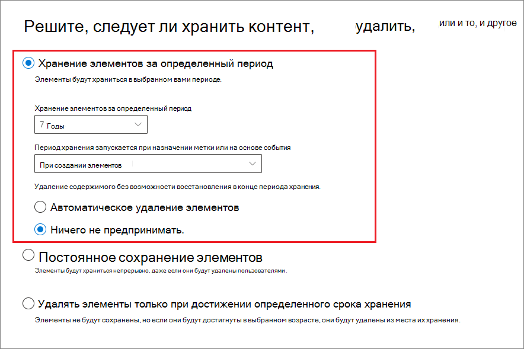

# <a name="create-and-configure-retention-policies"></a><span data-ttu-id="48cc5-103">Создание и настройка политик хранения</span><span class="sxs-lookup"><span data-stu-id="48cc5-103">Create and configure retention policies</span></span>

><span data-ttu-id="48cc5-104">*[Руководство по лицензированию Microsoft 365 для обеспечения безопасности и соответствия требованиям](https://aka.ms/ComplianceSD).*</span><span class="sxs-lookup"><span data-stu-id="48cc5-104">*[Microsoft 365 licensing guidance for security & compliance](https://aka.ms/ComplianceSD).*</span></span>

<span data-ttu-id="48cc5-105">Используйте политику хранения, чтобы заранее решить, следует ли сохранить контент, удалить контент или и то, и другое - сохранить, а затем удалить контент.</span><span class="sxs-lookup"><span data-stu-id="48cc5-105">Use a retention policy to decide proactively whether to retain content, delete content, or both - retain and then delete the content.</span></span> 

<span data-ttu-id="48cc5-106">Информацию о том, как работают политики хранения, смотрите в разделе [Узнайте о политиках хранения](retention-policies.md).</span><span class="sxs-lookup"><span data-stu-id="48cc5-106">For information about how retention policies work, see [Learn about retention policies](retention-policies.md).</span></span>

## <a name="before-you-begin"></a><span data-ttu-id="48cc5-107">Перед началом работы</span><span class="sxs-lookup"><span data-stu-id="48cc5-107">Before you begin</span></span>

<span data-ttu-id="48cc5-108">Участникам команды по обеспечению соответствия требованиям, которые будут создавать политики хранения и управлять ими, потребуются разрешения для [Центра соответствия требованиям Microsoft 365](https://compliance.microsoft.com/).</span><span class="sxs-lookup"><span data-stu-id="48cc5-108">Members of your compliance team who will create and manage retention policies need permissions to the [Microsoft 365 compliance center](https://compliance.microsoft.com/).</span></span> <span data-ttu-id="48cc5-109">По умолчанию администратор клиента (глобальный администратор) имеет доступ к этому расположению и может предоставлять сотрудникам, отвечающим за соблюдение требований, и другим пользователям доступ без предоставления им всех разрешений администратора клиента. Чтобы предоставить разрешения для ограниченного администрирования, мы рекомендуем добавить пользователей в группу административных ролей **Администратор соответствия требованиям**.</span><span class="sxs-lookup"><span data-stu-id="48cc5-109">By default, the tenant admin (global administrator) has access to this location and can give compliance officers and other people access without giving them all the permissions of a tenant admin. To grant permissions for this limited administration, we recommend that you add users to the **Compliance Administrator** admin role group.</span></span> <span data-ttu-id="48cc5-110">Инструкции см. в статье [Предоставление пользователям доступа к Центру безопасности и соответствия требованиям](https://docs.microsoft.com/microsoft-365/security/office-365-security/grant-access-to-the-security-and-compliance-center).</span><span class="sxs-lookup"><span data-stu-id="48cc5-110">For instructions, see [Give users access to the Security & Compliance Center](https://docs.microsoft.com/microsoft-365/security/office-365-security/grant-access-to-the-security-and-compliance-center).</span></span>

<span data-ttu-id="48cc5-111">Эти разрешения необходимы только для создания и применения политики хранения.</span><span class="sxs-lookup"><span data-stu-id="48cc5-111">These permissions are required only to create and apply a retention policy.</span></span> <span data-ttu-id="48cc5-112">Лицу, настраивающему политику хранения, не требуется доступ к контенту.</span><span class="sxs-lookup"><span data-stu-id="48cc5-112">The person configuring the retention policy doesn't require access to the content.</span></span>

## <a name="create-and-configure-a-retention-policy"></a><span data-ttu-id="48cc5-113">Создать и настроить политику хранения</span><span class="sxs-lookup"><span data-stu-id="48cc5-113">Create and configure a retention policy</span></span>

1. <span data-ttu-id="48cc5-114">В [Центре соответствия требованиям Microsoft 365](https://compliance.microsoft.com/) выберите **Политики** > **Сохранение**.</span><span class="sxs-lookup"><span data-stu-id="48cc5-114">From the [Microsoft 365 compliance center](https://compliance.microsoft.com/), select **Policies** > **Retention**.</span></span>

2. <span data-ttu-id="48cc5-115">Выберите **Новая политика хранения** или измените существующую политику хранения.</span><span class="sxs-lookup"><span data-stu-id="48cc5-115">Select **New retention policy** or edit an exiting retention policy.</span></span>

3. <span data-ttu-id="48cc5-116">Для **Настройки** сначала укажите параметры конфигурации для сохранения и удаления контента.</span><span class="sxs-lookup"><span data-stu-id="48cc5-116">For **Settings**, first specify the configuration options for retaining and deleting content.</span></span> <span data-ttu-id="48cc5-117">Вы можете создать политику хранения, которая просто сохраняет содержимое без удаления, сохраняет, а затем удаляет по истечении определенного периода времени или просто удаляет содержимое по истечении указанного периода времени.</span><span class="sxs-lookup"><span data-stu-id="48cc5-117">You can create a retention policy that just retains content without deleting, retains and then deletes after a specified period of time, or just deletes content after a specified period of time.</span></span> <span data-ttu-id="48cc5-118">Для получения дополнительной информации см. [Настройки для сохранения и удаления контента](#settings-for-retaining-and-deleting-content) на этой странице:</span><span class="sxs-lookup"><span data-stu-id="48cc5-118">For more information, see [Settings for retaining and deleting content](#settings-for-retaining-and-deleting-content) on this page:</span></span>
    
    <span data-ttu-id="48cc5-119">Затем решите, должна ли политика хранения применяться ко всему контенту или контенту, отвечающему определенным условиям.</span><span class="sxs-lookup"><span data-stu-id="48cc5-119">Then, decide whether the retention policy should apply to all content, or content that meets specific conditions.</span></span> <span data-ttu-id="48cc5-120">Для получения дополнительной информации об этих дополнительных параметрах хранения см. раздел [Дополнительные параметры для определения содержимого, соответствующего определенным условиям](#advanced-settings-to-identify-content-that-meets-specific-conditions), на этой странице.</span><span class="sxs-lookup"><span data-stu-id="48cc5-120">For more information about these advanced retention settings, see [Advanced settings to identify content that meets specific conditions](#advanced-settings-to-identify-content-that-meets-specific-conditions) on this page.</span></span> 

4. <span data-ttu-id="48cc5-121">На странице **Выбор местоположений** выберите, должна ли политика хранения применяться ко всем поддерживаемым местоположениям в вашей организации, или вы хотите указать местоположения.</span><span class="sxs-lookup"><span data-stu-id="48cc5-121">For the **Choose locations** page, select whether the retention policy should apply to all supported locations across your organization, or you want to specify the locations.</span></span> <span data-ttu-id="48cc5-122">Если вы выбираете определенные местоположения, вы также можете указать, включает и исключает.</span><span class="sxs-lookup"><span data-stu-id="48cc5-122">If you choose specific locations, you can also specify includes and excludes.</span></span> 
    
    <span data-ttu-id="48cc5-123">В Microsoft Teams:</span><span class="sxs-lookup"><span data-stu-id="48cc5-123">For Microsoft Teams:</span></span> 
    - <span data-ttu-id="48cc5-124">Вы должны выбрать опцию, чтобы выбрать определенные местоположения, если вы хотите удалить или сохранить сообщения канала Teams или групповые чаты.</span><span class="sxs-lookup"><span data-stu-id="48cc5-124">You must select the option to choose specific locations if you want to delete or retain Teams channel messages or Team chats.</span></span> <span data-ttu-id="48cc5-125">При выборе любого из этих параметров в качестве местоположений другие местоположения автоматически исключаются, поскольку политика хранения, включающая эти данные Teams, не может включать другие местоположения.</span><span class="sxs-lookup"><span data-stu-id="48cc5-125">When you select either of these options as locations, the other locations are automatically excluded because a retention policy that includes this Teams data can't include other locations.</span></span> 
    - <span data-ttu-id="48cc5-126">Обратите внимание, что для **сообщений канала Teams**, включены сообщения от стандартных каналов, но не от [частных каналов](https://docs.microsoft.com/microsoftteams/private-channels).</span><span class="sxs-lookup"><span data-stu-id="48cc5-126">Note that for **Teams channel messages**, message from standard channels but not [private channels](https://docs.microsoft.com/microsoftteams/private-channels) are included.</span></span> <span data-ttu-id="48cc5-127">В настоящее время закрытые каналы не поддерживаются политиками хранения.</span><span class="sxs-lookup"><span data-stu-id="48cc5-127">Currently, private channels aren't supported by retention policies.</span></span>
    
    <span data-ttu-id="48cc5-128">Для получения дополнительной информации о выборе между политикой хранения для организации или для определенных расположений см. [Применение политики хранения ко всей организации или определенным расположениям](#applying-a-retention-policy-to-an-entire-organization-or-specific-locations) на этой странице.</span><span class="sxs-lookup"><span data-stu-id="48cc5-128">For more information about choosing between a retention policy for the organization or for specific locations, see [Applying a retention policy to an entire organization or specific locations](#applying-a-retention-policy-to-an-entire-organization-or-specific-locations) on this page.</span></span>
    
    <span data-ttu-id="48cc5-129">Сведения, относящиеся к **группам Office 365** и **Skype для бизнеса**, см. В следующих разделах: [Информация о конфигурации для групп Microsoft 365](#configuration-information-for-microsoft-365-groups) и [Информация о конфигурации для Skype для бизнеса](#configuration-information-for-skype-for-business).</span><span class="sxs-lookup"><span data-stu-id="48cc5-129">For information specific to **Office 365 groups** and **Skype for Business**, see the following sections, [Configuration information for Microsoft 365 groups](#configuration-information-for-microsoft-365-groups) and [Configuration information for Skype for Business](#configuration-information-for-skype-for-business).</span></span>

5. <span data-ttu-id="48cc5-130">Завершите работу мастера, чтобы сохранить настройки.</span><span class="sxs-lookup"><span data-stu-id="48cc5-130">Complete the wizard to save your settings.</span></span>

<span data-ttu-id="48cc5-131">Если у вас есть более одной политики хранения, см. [Принципы хранения или что имеет приоритет?](retention-policies.md#the-principles-of-retention-or-what-takes-precedence)</span><span class="sxs-lookup"><span data-stu-id="48cc5-131">When you have more than one retention policy, see [The principles of retention, or what takes precedence?](retention-policies.md#the-principles-of-retention-or-what-takes-precedence)</span></span>

### <a name="configuration-information-for-microsoft-365-groups"></a><span data-ttu-id="48cc5-132">Информация о конфигурации для групп Microsoft 365</span><span class="sxs-lookup"><span data-stu-id="48cc5-132">Configuration information for Microsoft 365 groups</span></span>

<span data-ttu-id="48cc5-133">Чтобы сохранить или удалить содержимое для группы Microsoft 365 (ранее группы Office 365), выберите расположение **групп Office 365** при выборе местоположений для своей политики хранения.</span><span class="sxs-lookup"><span data-stu-id="48cc5-133">To retain or delete content for a Microsoft 365 group (formerly Office 365 group), select the **Office 365 groups** location when you choose locations for your retention policy.</span></span> <span data-ttu-id="48cc5-134">Несмотря на то, что в группе Microsoft 365 есть почтовый ящик Exchange, политика хранения, включающая все расположение **электронной почты Exchange**, не будет включать содержимое в почтовые ящики группы Microsoft 365.</span><span class="sxs-lookup"><span data-stu-id="48cc5-134">Even though a Microsoft 365 group has an Exchange mailbox, a retention policy that includes the entire **Exchange email** location won't include content in Microsoft 365 group mailboxes.</span></span> <span data-ttu-id="48cc5-135">Дополнительно, хотя местоположение **электронной почты Exchange** изначально позволяет указать групповой почтовый ящик, который будет включен или исключен, при попытке сохранить политику хранения выдается сообщение о том, что «RemoteGroupMailbox» не является допустимым выбором для местоположения Exchange.</span><span class="sxs-lookup"><span data-stu-id="48cc5-135">In addition, although the **Exchange email** location initially allows you to specify a group mailbox to be included or excluded, when you try to save the retention policy, you receive an error that "RemoteGroupMailbox" is not a valid selection for the Exchange location.</span></span>

<span data-ttu-id="48cc5-136">Политика хранения, применяемая к группе Microsoft 365, включает как сайт, так и почтовый ящик группы.</span><span class="sxs-lookup"><span data-stu-id="48cc5-136">A retention policy applied to a Microsoft 365 group includes both the group mailbox and site.</span></span> <span data-ttu-id="48cc5-137">Политика хранения, применяемая к группе Microsoft 365, защищает ресурсы, созданные группой Microsoft 365, в которую входят Microsoft Teams.</span><span class="sxs-lookup"><span data-stu-id="48cc5-137">A retention policy applied to a Microsoft 365 group protects the resources created by a Microsoft 365 group, which includes Microsoft Teams.</span></span>

### <a name="configuration-information-for-skype-for-business"></a><span data-ttu-id="48cc5-138">Информация о конфигурации для Skype для бизнеса</span><span class="sxs-lookup"><span data-stu-id="48cc5-138">Configuration information for Skype for Business</span></span>

<span data-ttu-id="48cc5-139">В отличие от электронной почты Exchange, вы не можете включить статус местоположения Skype, чтобы включить всех пользователей, но когда вы включаете это местоположение, вы затем вручную выбираете пользователей, чьи разговоры вы хотите сохранить:</span><span class="sxs-lookup"><span data-stu-id="48cc5-139">Unlike Exchange email, you can't toggle the status of the Skype location on to include all users, but when you turn on that location, you then manually choose the users whose conversations you want to retain:</span></span>


  
<span data-ttu-id="48cc5-141">Выбрав **Выбрать пользователей**, вы можете быстро включить всех пользователей, выбрав поле **Имя** в заголовке столбца.</span><span class="sxs-lookup"><span data-stu-id="48cc5-141">When you select **Choose users**, you can quickly include all users by selecting the **Name** box in the column header.</span></span> <span data-ttu-id="48cc5-142">но при этом важно понимать, что каждый пользователь засчитывается как отдельно включенный в политику.</span><span class="sxs-lookup"><span data-stu-id="48cc5-142">However, it's important to understand that each user counts as a specific inclusion in the policy.</span></span> <span data-ttu-id="48cc5-143">Поэтому, если вы выберете более 1000 пользователей, вступят в силу ограничения, о которых шла речь в предыдущем разделе.</span><span class="sxs-lookup"><span data-stu-id="48cc5-143">Therefore, if you include over 1,000 users, the limits noted in the previous section apply.</span></span> <span data-ttu-id="48cc5-144">Выбор всех пользователей Skype здесь не равносилен заданию гипотетической общеорганизационной политики, которая бы по умолчанию включала всех пользователей Skype.</span><span class="sxs-lookup"><span data-stu-id="48cc5-144">Selecting all Skype users here is not the same as if an org-wide policy were able to include all Skype users by default.</span></span> 
  

  
<span data-ttu-id="48cc5-146">Note that **Conversation History**, a folder in Outlook, is a feature that has nothing to do with Skype archiving.</span><span class="sxs-lookup"><span data-stu-id="48cc5-146">Note that **Conversation History**, a folder in Outlook, is a feature that has nothing to do with Skype archiving.</span></span> <span data-ttu-id="48cc5-147">**Conversation History** can be turned off by the end user, but archiving for Skype is done by storing a copy of Skype conversations in a hidden folder that is inaccessible to the user but available to eDiscovery.</span><span class="sxs-lookup"><span data-stu-id="48cc5-147">**Conversation History** can be turned off by the end user, but archiving for Skype is done by storing a copy of Skype conversations in a hidden folder that is inaccessible to the user but available to eDiscovery.</span></span>


## <a name="settings-for-retaining-and-deleting-content"></a><span data-ttu-id="48cc5-148">Настройки для сохранения и удаления контента</span><span class="sxs-lookup"><span data-stu-id="48cc5-148">Settings for retaining and deleting content</span></span>

<span data-ttu-id="48cc5-149">Выбрав параметры для сохранения и удаления контента в вашей политике хранения, ваша политика хранения будет иметь одну из следующих конфигураций в течение определенного периода времени:</span><span class="sxs-lookup"><span data-stu-id="48cc5-149">By choosing the settings for retaining and deleting content in your retention policy, your retention policy will have one of the following configurations for a specified period of time:</span></span>

- <span data-ttu-id="48cc5-150">Только хранение</span><span class="sxs-lookup"><span data-stu-id="48cc5-150">Retain-only</span></span>
- <span data-ttu-id="48cc5-151">Сохранить и удалить</span><span class="sxs-lookup"><span data-stu-id="48cc5-151">Retain and then delete</span></span>
- <span data-ttu-id="48cc5-152">Только удаление</span><span class="sxs-lookup"><span data-stu-id="48cc5-152">Delete-only</span></span>

### <a name="retaining-content-for-a-specific-period-of-time"></a><span data-ttu-id="48cc5-153">Хранение содержимого в течение определенного периода времени</span><span class="sxs-lookup"><span data-stu-id="48cc5-153">Retaining content for a specific period of time</span></span>

<span data-ttu-id="48cc5-154">Когда вы настраиваете политику хранения, вы решаете сохранять контент на неопределенный срок или в течение определенного количества дней, месяцев или лет.</span><span class="sxs-lookup"><span data-stu-id="48cc5-154">When you configure a retention policy, you choose to retain content indefinitely or for a specific number of days, months, or years.</span></span> <span data-ttu-id="48cc5-155">Длительность хранения содержимого рассчитывается исходя из давности содержимого, а не с момента применения политики хранения.</span><span class="sxs-lookup"><span data-stu-id="48cc5-155">The duration for how long content is retained is calculated from the age of the content, not from when the retention policy is applied.</span></span> <span data-ttu-id="48cc5-156">Вы можете выбрать, как будет определяться давность содержимого (для OneDrive и SharePoint): по дате и времени создания или последнего изменения.</span><span class="sxs-lookup"><span data-stu-id="48cc5-156">You can choose whether the age is based on when the content was created or (for OneDrive and SharePoint) when it was last modified.</span></span>

<span data-ttu-id="48cc5-157">Примеры:</span><span class="sxs-lookup"><span data-stu-id="48cc5-157">Examples:</span></span>
  
- <span data-ttu-id="48cc5-158">SharePoint: если вы хотите сохранить содержимое в семействе сайтов в течение семи лет с момента его последнего изменения, а документ в этом семействе сайтов не изменялся в течение шести лет, документ будет сохраняться только еще один год, если он не был изменен.</span><span class="sxs-lookup"><span data-stu-id="48cc5-158">SharePoint: If you want to retain content in a site collection for seven years since it was last modified, and a document in that site collection hasn't been modified in six years, the document will be retained for only another year if it's not modified.</span></span> <span data-ttu-id="48cc5-159">Если документ редактируется снова, срок действия документа рассчитывается исходя из новой даты последнего изменения, и он будет сохраняться еще семь лет.</span><span class="sxs-lookup"><span data-stu-id="48cc5-159">If the document is edited again, the age of the document is calculated from the new last modified date, and it will be retained for another seven years.</span></span>
  
- <span data-ttu-id="48cc5-160">Обмен: Если вы хотите хранить содержимое в почтовом ящике в течение семи лет, а сообщение было отправлено шесть лет назад, оно будет храниться только один год.</span><span class="sxs-lookup"><span data-stu-id="48cc5-160">Exchange: If you want to retain content in a mailbox for seven years, and a message was sent six years ago, the message will be retained for only one year.</span></span> <span data-ttu-id="48cc5-161">Для содержимого Exchange возраст определяется на основе даты, полученной для входящей электронной почты, или даты, отправленной для исходящей электронной почты.</span><span class="sxs-lookup"><span data-stu-id="48cc5-161">For Exchange content, the age is based on the date received for incoming email, or the date sent for outgoing email.</span></span> <span data-ttu-id="48cc5-162">Хранение содержимого исходя из даты последнего изменения применяется только для содержимого сайтов в OneDrive и SharePoint.</span><span class="sxs-lookup"><span data-stu-id="48cc5-162">Retaining content based on when it was last modified applies only to site content in OneDrive and SharePoint.</span></span>
  
<span data-ttu-id="48cc5-163">По окончании срока хранения вы выбираете, хотите ли вы удалить содержимое навсегда:</span><span class="sxs-lookup"><span data-stu-id="48cc5-163">At the end of the retention period, you choose whether you want the content to be permanently deleted:</span></span>
  

  
### <a name="deleting-content-thats-older-than-a-specific-age"></a><span data-ttu-id="48cc5-165">Удаление содержимого, которое старше указанного возраста</span><span class="sxs-lookup"><span data-stu-id="48cc5-165">Deleting content that's older than a specific age</span></span>

<span data-ttu-id="48cc5-166">Политика хранения может предусматривать как хранение содержимого с последующим удалением, так и удаление старого содержимого без хранения.</span><span class="sxs-lookup"><span data-stu-id="48cc5-166">A retention policy can both retain and then delete content, or delete old content without retaining it.</span></span>
  
<span data-ttu-id="48cc5-167">Если политика хранения предусматривает удаление содержимого, важно понимать, что период, указанный для политики хранения, рассчитывается со времени создания или изменения содержимого, а не со времени назначения политики.</span><span class="sxs-lookup"><span data-stu-id="48cc5-167">If your retention policy deletes content, it's important to understand that the time period specified for a retention policy is calculated from the time when the content was created or modified, not the time since the policy was assigned.</span></span>
  

  
<span data-ttu-id="48cc5-169">Представьте, что вы создали политику хранения, согласно которой содержимое удаляется через три года, а затем назначили эту политику всем учетным записям OneDrive, содержащим большой объем данных, которые были созданы четыре или пять лет назад.</span><span class="sxs-lookup"><span data-stu-id="48cc5-169">For example, suppose that you create a retention policy that deletes content after three years, and then assign that policy to all OneDrive accounts, which contain a lot of content that was created four or five years ago.</span></span> <span data-ttu-id="48cc5-170">В этом случае значительная доля содержимого будет удалена вскоре после первого назначения этой политики хранения.</span><span class="sxs-lookup"><span data-stu-id="48cc5-170">In this case, a lot of content will be deleted soon after assigning the retention policy for the first time.</span></span> <span data-ttu-id="48cc5-171">По этой причине важно понимать, что политика хранения, которая удаляет контент, может оказать значительное влияние на ваш контент.</span><span class="sxs-lookup"><span data-stu-id="48cc5-171">For this reason, it's important to understand that a retention policy that deletes content can have a considerable impact on your content.</span></span> 
  
<span data-ttu-id="48cc5-172">Therefore, before you assign a retention policy to a site collection for the first time, you should first consider the age of the existing content and how the policy may impact that content.</span><span class="sxs-lookup"><span data-stu-id="48cc5-172">Therefore, before you assign a retention policy to a site collection for the first time, you should first consider the age of the existing content and how the policy may impact that content.</span></span> <span data-ttu-id="48cc5-173">You may also want to communicate the new policy to your users before assigning it, to give them time to assess the possible impact.</span><span class="sxs-lookup"><span data-stu-id="48cc5-173">You may also want to communicate the new policy to your users before assigning it, to give them time to assess the possible impact.</span></span> <span data-ttu-id="48cc5-174">Note this warning that appears when you review the settings for your retention policy just before creating it.</span><span class="sxs-lookup"><span data-stu-id="48cc5-174">Note this warning that appears when you review the settings for your retention policy just before creating it.</span></span>
  

  
## <a name="advanced-settings-to-identify-content-that-meets-specific-conditions"></a><span data-ttu-id="48cc5-176">Расширенные настройки для определения содержимого, соответствующего определенным условиям</span><span class="sxs-lookup"><span data-stu-id="48cc5-176">Advanced settings to identify content that meets specific conditions</span></span>

<span data-ttu-id="48cc5-177">Политику хранения можно применить ко всему содержимому в расположениях, на которые она распространяется, или же только к содержимому, включающему определенные ключевые слова или [определенные типы конфиденциальной информации](what-the-sensitive-information-types-look-for.md).</span><span class="sxs-lookup"><span data-stu-id="48cc5-177">A retention policy can apply to all content in the locations that it includes, or you can choose to apply a retention policy only to content that contains specific keywords or [specific types of sensitive information](what-the-sensitive-information-types-look-for.md).</span></span>
  

  
### <a name="identify-content-that-contains-specific-keywords"></a><span data-ttu-id="48cc5-179">Определите контент, который содержит конкретные ключевые слова</span><span class="sxs-lookup"><span data-stu-id="48cc5-179">Identify content that contains specific keywords</span></span>

<span data-ttu-id="48cc5-180">Вы можете применить политику хранения только к контенту, отвечающему определенным условиям, а затем выполнить действия по сохранению только этого контента.</span><span class="sxs-lookup"><span data-stu-id="48cc5-180">You can apply a retention policy only to content that meets specific conditions, and then take retention actions on just that content.</span></span> <span data-ttu-id="48cc5-181">Доступные условия поддерживают применение политики хранения к контенту, который содержит определенные слова или фразы.</span><span class="sxs-lookup"><span data-stu-id="48cc5-181">The conditions available support applying a retention policy to content that contains specific words or phrases.</span></span> <span data-ttu-id="48cc5-182">Вы можете уточнить запрос, используя такие операторы поиска, как AND, OR и NOT.</span><span class="sxs-lookup"><span data-stu-id="48cc5-182">You can refine your query by using search operators like AND, OR, and NOT.</span></span> <span data-ttu-id="48cc5-183">Дополнительные сведения об этих операторах см. в статье [Запросы с ключевыми словами и условия для поиска содержимого](keyword-queries-and-search-conditions.md).</span><span class="sxs-lookup"><span data-stu-id="48cc5-183">For more information on these operators, see [Keyword queries and search conditions for Content Search](keyword-queries-and-search-conditions.md).</span></span>
  
<span data-ttu-id="48cc5-184">Поддержка добавления свойств, поддерживающих поиск (например, **subject:**), появится в скором времени.</span><span class="sxs-lookup"><span data-stu-id="48cc5-184">Support for adding searchable properties (for example, **subject:**) is coming soon.</span></span>
  
<span data-ttu-id="48cc5-185">При хранении на основе запросов используется индекс поиска для определения содержимого.</span><span class="sxs-lookup"><span data-stu-id="48cc5-185">Query-based retention uses the search index to identify content.</span></span>
  

  
### <a name="identify-content-that-contains-sensitive-information"></a><span data-ttu-id="48cc5-187">Определите контент, который содержит конфиденциальную информацию</span><span class="sxs-lookup"><span data-stu-id="48cc5-187">Identify content that contains sensitive information</span></span>

<span data-ttu-id="48cc5-188">You can also apply a retention policy only to content that contains [specific types of sensitive information](what-the-sensitive-information-types-look-for.md).</span><span class="sxs-lookup"><span data-stu-id="48cc5-188">You can also apply a retention policy only to content that contains [specific types of sensitive information](what-the-sensitive-information-types-look-for.md).</span></span> <span data-ttu-id="48cc5-189">For example, you can choose to apply unique retention requirements only to content that contains personally identifiable information (PII) such as taxpayer identification numbers, social security numbers, or passport numbers.</span><span class="sxs-lookup"><span data-stu-id="48cc5-189">For example, you can choose to apply unique retention requirements only to content that contains personally identifiable information (PII) such as taxpayer identification numbers, social security numbers, or passport numbers.</span></span>
  

  
<span data-ttu-id="48cc5-191">Примечания:</span><span class="sxs-lookup"><span data-stu-id="48cc5-191">Notes:</span></span>
  
- <span data-ttu-id="48cc5-192">Дополнительные параметры хранения конфиденциальной информации не применяются к общедоступным папкам Exchange и Skype для бизнеса, так как эти расположения не поддерживают типы конфиденциальной информации.</span><span class="sxs-lookup"><span data-stu-id="48cc5-192">Advanced retention for sensitive information doesn't apply to Exchange public folders or Skype for Business because those locations don't support sensitive information types.</span></span>
    
- <span data-ttu-id="48cc5-193">Exchange Online использует правила потока почты (также известные как правила транспорта) для идентификации конфиденциальной информации, поэтому это работает только для транзитных сообщений, а не для всех элементов, уже сохраненных в почтовом ящике.</span><span class="sxs-lookup"><span data-stu-id="48cc5-193">Exchange Online uses mail flow rules (also known as transport rules) to identify sensitive information, so this works only on messages in transit—not on all items already stored in a mailbox.</span></span> <span data-ttu-id="48cc5-194">Для Exchange Online это означает, что выявлять конфиденциальную информацию и предпринимать действия в по хранению можно только в отношении сообщений, принятых **после** того, как политика была применена к почтовому ящику.</span><span class="sxs-lookup"><span data-stu-id="48cc5-194">For Exchange Online, this means that a retention policy can identify sensitive information and take retention actions only on messages that are received **after** the policy is applied to the mailbox.</span></span> <span data-ttu-id="48cc5-195">Хранение на основе запросов, описанное в предыдущем разделе, не имеет этого ограничения, поскольку оно использует поисковый индекс для идентификации контента.</span><span class="sxs-lookup"><span data-stu-id="48cc5-195">Query-based retention described in the previous section doesn't have this limitation because it uses the search index to identify content.</span></span> 
    
## <a name="applying-a-retention-policy-to-an-entire-organization-or-specific-locations"></a><span data-ttu-id="48cc5-196">Применение политики хранения ко всей организации или определенным расположениям</span><span class="sxs-lookup"><span data-stu-id="48cc5-196">Applying a retention policy to an entire organization or specific locations</span></span>

<span data-ttu-id="48cc5-197">Вы можете легко применить политику хранения ко всей организации, целому расположению или только к отдельным его частям или пользователям.</span><span class="sxs-lookup"><span data-stu-id="48cc5-197">You can easily apply a retention policy to an entire organization, entire locations, or only to specific locations or users.</span></span>
  
### <a name="org-wide-policy"></a><span data-ttu-id="48cc5-198">Политика для всей организации</span><span class="sxs-lookup"><span data-stu-id="48cc5-198">Org-wide policy</span></span>

<span data-ttu-id="48cc5-199">Одна из наиболее мощных функций политики хранения заключается в том, что она может применяться к местоположениям в Microsoft 365, включая:</span><span class="sxs-lookup"><span data-stu-id="48cc5-199">One of the most powerful features of a retention policy is that it can apply to locations across Microsoft 365, including:</span></span>
  
- <span data-ttu-id="48cc5-200">Электронная почта Exchange</span><span class="sxs-lookup"><span data-stu-id="48cc5-200">Exchange email</span></span>
    
- <span data-ttu-id="48cc5-201">Семейства веб-сайтов SharePoint</span><span class="sxs-lookup"><span data-stu-id="48cc5-201">SharePoint site collections</span></span>
    
- <span data-ttu-id="48cc5-202">Учетные записи OneDrive</span><span class="sxs-lookup"><span data-stu-id="48cc5-202">OneDrive accounts</span></span>
    
- <span data-ttu-id="48cc5-203">Группы Microsoft 365 (применяется к содержимому в почтовом ящике группы и связанном сайте SharePoint.)</span><span class="sxs-lookup"><span data-stu-id="48cc5-203">Microsoft 365 groups (applies to content in the group's mailbox and associated SharePoint site.)</span></span>
    
- <span data-ttu-id="48cc5-204">Общедоступные папки Exchange.</span><span class="sxs-lookup"><span data-stu-id="48cc5-204">Exchange public folders</span></span>
    


<span data-ttu-id="48cc5-206">Ниже перечислены другие важные возможности политики хранения для всей организации.</span><span class="sxs-lookup"><span data-stu-id="48cc5-206">Other important features of an org-wide retention policy include:</span></span>
  
- <span data-ttu-id="48cc5-207">Количество почтовых ящиков или сайтов, на которые может распространяться политика, не ограничено.</span><span class="sxs-lookup"><span data-stu-id="48cc5-207">There is no limit to the number of mailboxes or sites the policy can include.</span></span>
    
- <span data-ttu-id="48cc5-208">Для Exchange каждый новый почтовый ящик, созданный после применения политики, будет автоматически ее наследовать.</span><span class="sxs-lookup"><span data-stu-id="48cc5-208">For Exchange, any new mailbox created after the policy is applied will automatically inherit the policy.</span></span>
  
### <a name="a-policy-that-applies-to-entire-locations"></a><span data-ttu-id="48cc5-209">Политика, применяемая к целому расположению</span><span class="sxs-lookup"><span data-stu-id="48cc5-209">A policy that applies to entire locations</span></span>

<span data-ttu-id="48cc5-210">При выборе расположений можно легко включить или исключить из политики целое расположение, например всю электронную почту Exchange или все учетные записи OneDrive.</span><span class="sxs-lookup"><span data-stu-id="48cc5-210">When you choose locations, you can easily include or exclude an entire location, such as Exchange email or OneDrive accounts.</span></span> <span data-ttu-id="48cc5-211">Для этого включите или отключите параметр **Состояние** этого расположения.</span><span class="sxs-lookup"><span data-stu-id="48cc5-211">To do so, toggle the **Status** of that location on or off.</span></span> 
  
<span data-ttu-id="48cc5-212">Политика, применяемая к любому сочетанию целых расположений, может охватывать неограниченное количество почтовых ящиков и сайтов.</span><span class="sxs-lookup"><span data-stu-id="48cc5-212">Like an org-wide policy, if a policy applies to any combination of entire locations, there is no limit to the number of mailboxes or sites the policy can include.</span></span> 

<span data-ttu-id="48cc5-213">Например, если политика охватывает всю электронную почту Exchange и все сайты SharePoint, в нее будут включены все сайты и почтовые ящики независимо от их количества.</span><span class="sxs-lookup"><span data-stu-id="48cc5-213">For example, if a policy includes all Exchange email and all SharePoint sites, all sites and mailboxes will be included, no matter how many.</span></span> <span data-ttu-id="48cc5-214">А для Exchange любой новый почтовый ящик, созданный после применения политики, автоматически наследует политику.</span><span class="sxs-lookup"><span data-stu-id="48cc5-214">And for Exchange, any new mailbox created after the policy is applied will automatically inherit the policy.</span></span>

### <a name="a-policy-with-specific-inclusions-or-exclusions"></a><span data-ttu-id="48cc5-215">Политика, в которую включены нужные элементы</span><span class="sxs-lookup"><span data-stu-id="48cc5-215">A policy with specific inclusions or exclusions</span></span>

<span data-ttu-id="48cc5-216">Вы также можете применить политику хранения для определенных пользователей, определенных групп Microsoft 365 или определенных сайтов.</span><span class="sxs-lookup"><span data-stu-id="48cc5-216">You can also apply a retention policy to specific users, specific Microsoft 365 groups, or specific sites.</span></span> <span data-ttu-id="48cc5-217">Для этого переключите **Состояние** этого местоположения, а затем используйте ссылки для включения или исключения определенных пользователей, групп Microsoft 365 или сайтов.</span><span class="sxs-lookup"><span data-stu-id="48cc5-217">To do so, toggle the **Status** of that location on, and then use the links to include or exclude specific users, Microsoft 365 groups, or sites.</span></span> 
  
<span data-ttu-id="48cc5-218">Однако при использовании этой конфигурации существуют некоторые ограничения, когда ваша политика хранения включает или исключает более 1000 определенных местоположений:</span><span class="sxs-lookup"><span data-stu-id="48cc5-218">However, using this configuration, there are some limits when your retention policy includes or excludes over 1,000 specific locations:</span></span>
  
- <span data-ttu-id="48cc5-219">Максимальное количество для политики хранения:</span><span class="sxs-lookup"><span data-stu-id="48cc5-219">Maximum numbers for the retention policy:</span></span>
    - <span data-ttu-id="48cc5-220">1000 почтовых ящиков</span><span class="sxs-lookup"><span data-stu-id="48cc5-220">1,000 mailboxes</span></span>
    - <span data-ttu-id="48cc5-221">1 000 групп Microsoft 365</span><span class="sxs-lookup"><span data-stu-id="48cc5-221">1,000 Microsoft 365 groups</span></span>
    - <span data-ttu-id="48cc5-222">1 000 пользователей приватных чатов Teams</span><span class="sxs-lookup"><span data-stu-id="48cc5-222">1,000 users for Teams private chats</span></span>
    - <span data-ttu-id="48cc5-223">100 сайтов (OneDrive или SharePoint)</span><span class="sxs-lookup"><span data-stu-id="48cc5-223">100 sites (OneDrive or SharePoint)</span></span>

<span data-ttu-id="48cc5-224">Существует максимальное количество политик, поддерживаемых для клиента: 10 000.</span><span class="sxs-lookup"><span data-stu-id="48cc5-224">There is a maximum number of policies that are supported for a tenant: 10,000.</span></span> <span data-ttu-id="48cc5-225">Эти элементы включают политики хранения, политики меток хранения и политики автоматического применения.</span><span class="sxs-lookup"><span data-stu-id="48cc5-225">These items include retention policies, retention label policies, and auto-apply retention policies.</span></span>

<span data-ttu-id="48cc5-226">Если ваши политики хранения могут подвергаться этим ограничениям, выберите параметры конфигурации, которые применяются ко всем расположениям, или используйте политику всей организации.</span><span class="sxs-lookup"><span data-stu-id="48cc5-226">If your retention policies are likely to be subject to these limitations, choose the configuration options that apply to entire locations, or use an org-wide policy.</span></span>

## <a name="updating-retention-policies"></a><span data-ttu-id="48cc5-227">Обновление политик хранения</span><span class="sxs-lookup"><span data-stu-id="48cc5-227">Updating retention policies</span></span>

<span data-ttu-id="48cc5-228">Если вы изменяете политику хранения, и для контента уже применяются исходные параметры в вашей политике хранения, ваши обновленные параметры будут автоматически применяться к этому контенту в дополнение к недавно идентифицированному контенту.</span><span class="sxs-lookup"><span data-stu-id="48cc5-228">If you edit a retention policy and content is already subject to the original settings in your retention policy, your updated settings will be automatically applied to this content in addition to content that's newly identified.</span></span>

<span data-ttu-id="48cc5-229">Обычно это обновление довольно быстрое, но может занять несколько дней.</span><span class="sxs-lookup"><span data-stu-id="48cc5-229">Usually this update is fairly quick but can take several days.</span></span> <span data-ttu-id="48cc5-230">Когда репликация политики по всем местоположениям Microsoft 365 будет завершена, вы увидите, что состояние политики хранения в центре соответствия Microsoft 365 изменится с **Вкл. (Ожидание)** на **Вкл. (Успешно)**.</span><span class="sxs-lookup"><span data-stu-id="48cc5-230">When the policy replication across your Microsoft 365 locations is complete, you'll see the status of the retention policy in the Microsoft 365 compliance center change from **On (Pending)** to **On (Success)**.</span></span>

## <a name="find-the-powershell-cmdlets-for-retention-policies"></a><span data-ttu-id="48cc5-231">Поиск командлетов PowerShell для политик хранения</span><span class="sxs-lookup"><span data-stu-id="48cc5-231">Find the PowerShell cmdlets for retention policies</span></span>

<span data-ttu-id="48cc5-232">Чтобы использовать командлеты политик хранения:</span><span class="sxs-lookup"><span data-stu-id="48cc5-232">To use the retention policies cmdlets:</span></span>
  
1. [<span data-ttu-id="48cc5-233">Подключение к PowerShell Центра безопасности и соответствия требованиям Office 365</span><span class="sxs-lookup"><span data-stu-id="48cc5-233">Connect to the Office 365 Security & Compliance Center PowerShell</span></span>](https://docs.microsoft.com/powershell/exchange/office-365-scc/connect-to-scc-powershell/connect-to-scc-powershell)
    
2. <span data-ttu-id="48cc5-234">Используйте эти командлеты Центра безопасности и соответствия требованиям Office 365:</span><span class="sxs-lookup"><span data-stu-id="48cc5-234">Use these Office 365 Security & Compliance Center cmdlets:</span></span>
    
    - [<span data-ttu-id="48cc5-235">Get-RetentionCompliancePolicy</span><span class="sxs-lookup"><span data-stu-id="48cc5-235">Get-RetentionCompliancePolicy</span></span>](https://docs.microsoft.com/powershell/module/exchange/get-retentioncompliancepolicy)
    
    - [<span data-ttu-id="48cc5-236">New-RetentionCompliancePolicy</span><span class="sxs-lookup"><span data-stu-id="48cc5-236">New-RetentionCompliancePolicy</span></span>](https://docs.microsoft.com/powershell/module/exchange/new-retentioncompliancepolicy)
    
    - [<span data-ttu-id="48cc5-237">Remove-RetentionCompliancePolicy</span><span class="sxs-lookup"><span data-stu-id="48cc5-237">Remove-RetentionCompliancePolicy</span></span>](https://docs.microsoft.com/powershell/module/exchange/remove-retentioncompliancepolicy)
    
    - [<span data-ttu-id="48cc5-238">Set-RetentionCompliancePolicy</span><span class="sxs-lookup"><span data-stu-id="48cc5-238">Set-RetentionCompliancePolicy</span></span>](https://docs.microsoft.com/powershell/module/exchange/set-retentioncompliancepolicy)
    
    - [<span data-ttu-id="48cc5-239">Get-RetentionComplianceRule</span><span class="sxs-lookup"><span data-stu-id="48cc5-239">Get-RetentionComplianceRule</span></span>](https://docs.microsoft.com/powershell/module/exchange/get-retentioncompliancerule)
    
    - [<span data-ttu-id="48cc5-240">New-RetentionComplianceRule</span><span class="sxs-lookup"><span data-stu-id="48cc5-240">New-RetentionComplianceRule</span></span>](https://docs.microsoft.com/powershell/module/exchange/new-retentioncompliancerule)
    
    - [<span data-ttu-id="48cc5-241">Remove-RetentionComplianceRule</span><span class="sxs-lookup"><span data-stu-id="48cc5-241">Remove-RetentionComplianceRule</span></span>](https://docs.microsoft.com/powershell/module/exchange/remove-retentioncompliancerule)
    
    - [<span data-ttu-id="48cc5-242">Set-RetentionComplianceRule</span><span class="sxs-lookup"><span data-stu-id="48cc5-242">Set-RetentionComplianceRule</span></span>](https://docs.microsoft.com/powershell/module/exchange/set-retentioncompliancerule)


## <a name="lock-a-retention-policy-by-using-powershell"></a><span data-ttu-id="48cc5-243">Блокировка политики хранения с помощью PowerShell</span><span class="sxs-lookup"><span data-stu-id="48cc5-243">Lock a retention policy by using PowerShell</span></span>

<span data-ttu-id="48cc5-244">Вы должны использовать PowerShell, если вам нужно применить [Блокировку для сохранения](retention-policies.md#use-preservation-lock-to-comply-with-regulatory-requirements) для соответствия нормативным требованиям.</span><span class="sxs-lookup"><span data-stu-id="48cc5-244">You must use PowerShell if you need to use [Preservation Lock](retention-policies.md#use-preservation-lock-to-comply-with-regulatory-requirements) to comply with regulatory requirements.</span></span>

1. <span data-ttu-id="48cc5-245">[Подключитесь к PowerShell Центра безопасности и соответствия требованиям Office 365](https://docs.microsoft.com/powershell/exchange/office-365-scc/connect-to-scc-powershell/connect-to-scc-powershell?view=exchange-ps).</span><span class="sxs-lookup"><span data-stu-id="48cc5-245">[Connect to Office 365 Security & Compliance Center PowerShell](https://docs.microsoft.com/powershell/exchange/office-365-scc/connect-to-scc-powershell/connect-to-scc-powershell?view=exchange-ps).</span></span>

2. <span data-ttu-id="48cc5-246">Укажите свои политики хранения и найдите название политики, которую вы хотите заблокировать, запустив `Get-RetentionCompliancePolicy`.</span><span class="sxs-lookup"><span data-stu-id="48cc5-246">List your retention policies and find the name of the policy that you want to lock by running `Get-RetentionCompliancePolicy`.</span></span>
    
    
    
3. <span data-ttu-id="48cc5-248">Чтобы установить блокировку сохранения в политике хранения, запустите `Set-RetentionCompliancePolicy` с параметром `RestrictiveRetention` со значением true.</span><span class="sxs-lookup"><span data-stu-id="48cc5-248">To place a Preservation Lock on a retention policy, run `Set-RetentionCompliancePolicy` with the `RestrictiveRetention` parameter set to true.</span></span> <span data-ttu-id="48cc5-249">Например,</span><span class="sxs-lookup"><span data-stu-id="48cc5-249">For example:</span></span>

   ```powershell
   Set-RetentionCompliancePolicy -Identity "<Name of Policy>" – RestrictiveRetention $true
   ```
   
    
    
    <span data-ttu-id="48cc5-251">После запуска этого командлета выберите **Да для всех**:</span><span class="sxs-lookup"><span data-stu-id="48cc5-251">After you run that cmdlet, choose **Yes to All**:</span></span>
    
    

<span data-ttu-id="48cc5-253">После этого для политики хранения установлена блокировка хранения.</span><span class="sxs-lookup"><span data-stu-id="48cc5-253">A Preservation Lock is now placed on the retention policy.</span></span> <span data-ttu-id="48cc5-254">Если запустить командлет `Get-RetentionCompliancePolicy`, параметр `RestrictiveRetention` будет иметь значение true.</span><span class="sxs-lookup"><span data-stu-id="48cc5-254">If you run `Get-RetentionCompliancePolicy`, the `RestrictiveRetention` parameter is set to true.</span></span> <span data-ttu-id="48cc5-255">Например:</span><span class="sxs-lookup"><span data-stu-id="48cc5-255">For example:</span></span>

`Get-RetentionCompliancePolicy -Identity "<Name of Policy>" |Fl`


  

