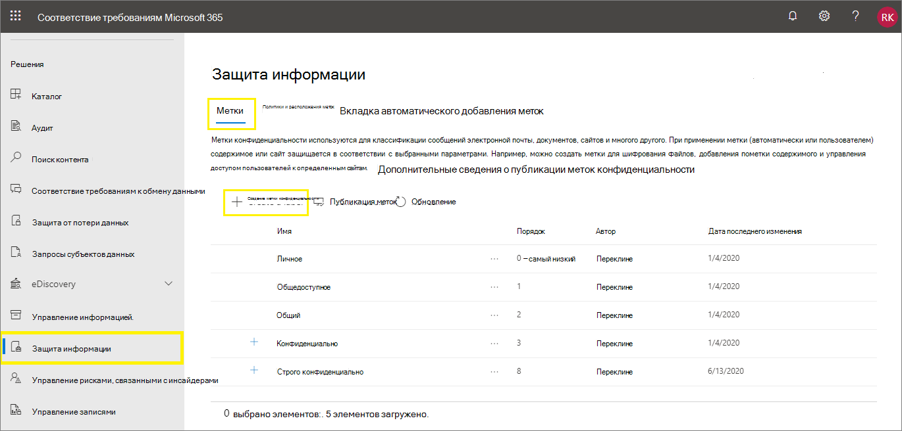
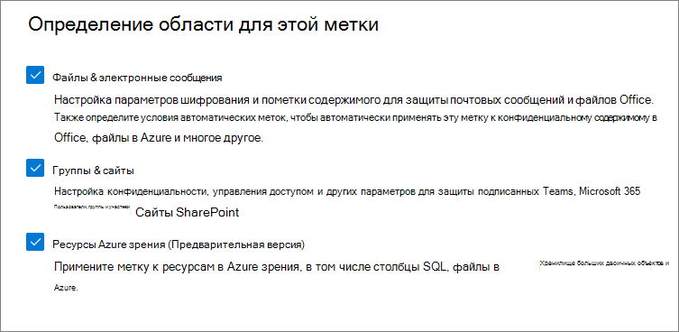

# <a name="create-and-configure-sensitivity-labels-and-their-policies"></a><span data-ttu-id="f3fc1-103">Создание и настройка меток конфиденциальности и соответствующих политик</span><span class="sxs-lookup"><span data-stu-id="f3fc1-103">Create and configure sensitivity labels and their policies</span></span>

><span data-ttu-id="f3fc1-104">*[Руководство по лицензированию Microsoft 365 для обеспечения безопасности и соответствия требованиям](https://aka.ms/ComplianceSD).*</span><span class="sxs-lookup"><span data-stu-id="f3fc1-104">*[Microsoft 365 licensing guidance for security & compliance](https://aka.ms/ComplianceSD).*</span></span>

<span data-ttu-id="f3fc1-105">Все решения Microsoft Information Protection (сокращенное название — MIP) реализуются с помощью [меток конфиденциальности](sensitivity-labels.md).</span><span class="sxs-lookup"><span data-stu-id="f3fc1-105">All Microsoft Information Protection solutions (sometimes abbreviated to MIP) are implemented by using [sensitivity labels](sensitivity-labels.md).</span></span> <span data-ttu-id="f3fc1-106">Чтобы создать и опубликовать эти метки, перейдите в центр администрирования меток, например в [Центр соответствия требованиям Microsoft 365](https://compliance.microsoft.com/).</span><span class="sxs-lookup"><span data-stu-id="f3fc1-106">To create and publish these labels, go to your labeling admin center, such as the [Microsoft 365 compliance center](https://compliance.microsoft.com/).</span></span> <span data-ttu-id="f3fc1-107">Вы также можете использовать Центр безопасности Microsoft 365 или Центр безопасности и соответствия требованиям.</span><span class="sxs-lookup"><span data-stu-id="f3fc1-107">You can also use the Microsoft 365 security center, or the Security & Compliance Center.</span></span>

<span data-ttu-id="f3fc1-108">Сначала создайте и настройте метки конфиденциальности, которые должны быть доступны для приложений и других служб.</span><span class="sxs-lookup"><span data-stu-id="f3fc1-108">First, create and configure the sensitivity labels that you want to make available for apps and other services.</span></span> <span data-ttu-id="f3fc1-109">Например, метки, которые пользователям нужно найти и применить из приложений Office.</span><span class="sxs-lookup"><span data-stu-id="f3fc1-109">For example, the labels you want users to see and apply from Office apps.</span></span> 

<span data-ttu-id="f3fc1-110">Затем создайте одну или несколько политик меток, содержащих настраиваемые метки и параметры политики.</span><span class="sxs-lookup"><span data-stu-id="f3fc1-110">Then, create one or more label policies that contain the labels and policy settings that you configure.</span></span> <span data-ttu-id="f3fc1-111">Публикацию меток и параметров для выбранных пользователей и расположений осуществляет политика меток.</span><span class="sxs-lookup"><span data-stu-id="f3fc1-111">It's the label policy that publishes the labels and settings for your chosen users and locations.</span></span>

## <a name="before-you-begin"></a><span data-ttu-id="f3fc1-112">Перед началом работы</span><span class="sxs-lookup"><span data-stu-id="f3fc1-112">Before you begin</span></span>

<span data-ttu-id="f3fc1-113">Глобальный администратор организации имеет все разрешения на создание меток конфиденциальности и управление всеми их аспектами.</span><span class="sxs-lookup"><span data-stu-id="f3fc1-113">The global admin for your organization has full permissions to create and manage all aspects of sensitivity labels.</span></span> <span data-ttu-id="f3fc1-114">Если вы входите не как глобальный администратор, см. раздел [Создание меток конфиденциальности и управление ими](get-started-with-sensitivity-labels.md#permissions-required-to-create-and-manage-sensitivity-labels).</span><span class="sxs-lookup"><span data-stu-id="f3fc1-114">If you aren't signing in as a global admin, see [Permissions required to create and manage sensitivity labels](get-started-with-sensitivity-labels.md#permissions-required-to-create-and-manage-sensitivity-labels).</span></span>

## <a name="create-and-configure-sensitivity-labels"></a><span data-ttu-id="f3fc1-115">Создание и настройка меток конфиденциальности</span><span class="sxs-lookup"><span data-stu-id="f3fc1-115">Create and configure sensitivity labels</span></span>

1. <span data-ttu-id="f3fc1-116">В своем центре администрирования меток перейдите к меткам конфиденциальности.</span><span class="sxs-lookup"><span data-stu-id="f3fc1-116">In your labeling admin center, navigate to sensitivity labels:</span></span>
    
    - <span data-ttu-id="f3fc1-117">Центр соответствия требованиям Microsoft 365:</span><span class="sxs-lookup"><span data-stu-id="f3fc1-117">Microsoft 365 compliance center:</span></span> 
        - <span data-ttu-id="f3fc1-118">**Решения** > **Защита информации**</span><span class="sxs-lookup"><span data-stu-id="f3fc1-118">**Solutions** > **Information protection**</span></span>
        
        <span data-ttu-id="f3fc1-119">Если этот параметр не отображается сразу, сначала выберите пункт **Показать все**.</span><span class="sxs-lookup"><span data-stu-id="f3fc1-119">If you don't immediately see this option, first select **Show all**.</span></span> 
    
    - <span data-ttu-id="f3fc1-120">Центр безопасности Microsoft 365:</span><span class="sxs-lookup"><span data-stu-id="f3fc1-120">Microsoft 365 security center:</span></span> 
        - <span data-ttu-id="f3fc1-121">**Классификация** > **Метки конфиденциальности**</span><span class="sxs-lookup"><span data-stu-id="f3fc1-121">**Classification** > **Sensitivity labels**</span></span>
    
    - <span data-ttu-id="f3fc1-122">Центр безопасности и соответствия требованиям:</span><span class="sxs-lookup"><span data-stu-id="f3fc1-122">Security & Compliance Center:</span></span>
        - <span data-ttu-id="f3fc1-123">**Классификация** > **Метки конфиденциальности**</span><span class="sxs-lookup"><span data-stu-id="f3fc1-123">**Classification** > **Sensitivity labels**</span></span>

2. <span data-ttu-id="f3fc1-124">На странице **Метки** нажмите **+ Создать метку**, чтобы запустить мастер создания метки конфиденциальности.</span><span class="sxs-lookup"><span data-stu-id="f3fc1-124">On the **Labels** page, select **+ Create a label** to start the New sensitivity label wizard.</span></span> 
    
    <span data-ttu-id="f3fc1-125">Например, в Центре соответствия требованиям Microsoft 365:</span><span class="sxs-lookup"><span data-stu-id="f3fc1-125">For example, from the Microsoft 365 compliance center:</span></span>
    
    
    
    > [!NOTE]
    > <span data-ttu-id="f3fc1-127">По умолчанию в клиентах отсутствуют метки, их необходимо создать.</span><span class="sxs-lookup"><span data-stu-id="f3fc1-127">By default, tenants don't have any labels and you must create them.</span></span> <span data-ttu-id="f3fc1-128">На рисунке показаны метки по умолчанию, которые были [перенесены из Azure Information Protection](https://docs.microsoft.com/azure/information-protection/configure-policy-migrate-labels).</span><span class="sxs-lookup"><span data-stu-id="f3fc1-128">The labels in the example picture show default labels that were [migrated from Azure Information Protection](https://docs.microsoft.com/azure/information-protection/configure-policy-migrate-labels).</span></span>

3. <span data-ttu-id="f3fc1-129">Параметры, выбранные на странице **Определение области для этой метки**, определяют параметры области метки, которые можно настроить, а также место их отображения после публикации.</span><span class="sxs-lookup"><span data-stu-id="f3fc1-129">On the **Define the scope for this label** page, the options selected determine the label's scope for the settings that you can configure and where they will be visible when they are published:</span></span>
    
    
    
    - <span data-ttu-id="f3fc1-131">Если выбран параметр **Файлы и сообщения электронной почты**, вы сможете настроить параметры в этом мастере, которые будут применяться к приложениям, поддерживающим метки конфиденциальности, например Office Word и Outlook.</span><span class="sxs-lookup"><span data-stu-id="f3fc1-131">If **Files & emails** is selected, you can configure settings in this wizard that apply to apps that support sensitivity labels, such as Office Word and Outlook.</span></span> <span data-ttu-id="f3fc1-132">Если этот параметр не выбран, мастер отобразит первую страницу этих параметров, но их нельзя будет настроить и пользователи не смогут выбрать метки в этих приложениях.</span><span class="sxs-lookup"><span data-stu-id="f3fc1-132">If this option isn't selected, the wizard displays the first page of these settings but you can't configure them and the labels won't be available for users to select in these apps.</span></span>
    
    - <span data-ttu-id="f3fc1-133">Если выбран параметр **Группы и сайты**, вы сможете настроить параметры в этом мастере, которые будут применяться к группам Microsoft 365, а также к сайтам для Teams и SharePoint.</span><span class="sxs-lookup"><span data-stu-id="f3fc1-133">If **Groups & sites** is selected, you can configure settings in this wizard that apply to Microsoft 365 groups, and sites for Teams and SharePoint.</span></span> <span data-ttu-id="f3fc1-134">Если этот параметр не выбран, мастер отобразит первую страницу этих параметров, но их нельзя будет настроить и пользователи не смогут выбрать метки для групп и сайта.</span><span class="sxs-lookup"><span data-stu-id="f3fc1-134">If this option isn't selected, the wizard displays the first page of these settings but you can't configure them and the labels won't be available for users to select for groups and site.</span></span>
    
    <span data-ttu-id="f3fc1-135">Сведения об области **ресурсов Azure Purview (предварительная версия)** см. в статье [Автоматическое применение меток к содержимому в Azure Purview](https://docs.microsoft.com/azure/purview/create-sensitivity-label).</span><span class="sxs-lookup"><span data-stu-id="f3fc1-135">For information about the **Azure Purview assets (preview)** scope, see [Automatically label your content in Azure Purview](https://docs.microsoft.com/azure/purview/create-sensitivity-label).</span></span>

4. <span data-ttu-id="f3fc1-136">Следуйте инструкциям мастера для настройки параметров метки.</span><span class="sxs-lookup"><span data-stu-id="f3fc1-136">Follow the prompts in the wizard for the label settings.</span></span>
    
    <span data-ttu-id="f3fc1-137">Дополнительные сведения о параметрах меток см. в разделе [Возможности меток конфиденциальности](sensitivity-labels.md#what-sensitivity-labels-can-do) обзорной статьи. Используйте справку мастера для настройки отдельных параметров.</span><span class="sxs-lookup"><span data-stu-id="f3fc1-137">For more information about the label settings, see [What sensitivity labels can do](sensitivity-labels.md#what-sensitivity-labels-can-do) from the overview information and use the help in the wizard for individual settings.</span></span>

5. <span data-ttu-id="f3fc1-138">Повторите эти действия для создания дополнительных меток.</span><span class="sxs-lookup"><span data-stu-id="f3fc1-138">Repeat these steps to create more labels.</span></span> <span data-ttu-id="f3fc1-139">Но если вы хотите создать дочернюю метку, сначала выберите родительскую метку и нажмите **...**, чтобы увидеть **дополнительные действия**, и выберите команду **Добавить дочернюю метку**.</span><span class="sxs-lookup"><span data-stu-id="f3fc1-139">However, if you want to create a sublabel, first select the parent label and select **...** for **More actions**, and then select **Add sub label**.</span></span>

6. <span data-ttu-id="f3fc1-140">Создав все нужные метки, проверьте их порядок и при необходимости переместите их вверх или вниз.</span><span class="sxs-lookup"><span data-stu-id="f3fc1-140">When you have created all the labels you need, review their order and if necessary, move them up or down.</span></span> <span data-ttu-id="f3fc1-141">Чтобы изменить порядок меток, нажмите **...**, чтобы увидеть **дополнительные действия**, и выберите параметр **Выше** или **Ниже**.</span><span class="sxs-lookup"><span data-stu-id="f3fc1-141">To change the order of a label, select **...** for **More actions**, and then select **Move up** or **Move down**.</span></span> <span data-ttu-id="f3fc1-142">Дополнительные сведения см. в разделе [Приоритет метки (важен порядок)](sensitivity-labels.md#label-priority-order-matters) обзорной статьи.</span><span class="sxs-lookup"><span data-stu-id="f3fc1-142">For more information, see [Label priority (order matters)](sensitivity-labels.md#label-priority-order-matters) from the overview information.</span></span>

<span data-ttu-id="f3fc1-143">Чтобы изменить существующую метку, выберите ее и нажмите кнопку **Изменить метку**.</span><span class="sxs-lookup"><span data-stu-id="f3fc1-143">To edit an existing label, select it, and then select the **Edit label** button:</span></span>


<span data-ttu-id="f3fc1-145">При нажатии этой кнопки запустится мастер **Изменение метки конфиденциальности**, позволяющий изменить любые параметры метки на шаге 4.</span><span class="sxs-lookup"><span data-stu-id="f3fc1-145">This button starts the **Edit sensitivity label** wizard, which lets you change all the label settings in step 4.</span></span>

<span data-ttu-id="f3fc1-146">Не удаляйте метку, если не знаете, как это повлияет на пользователей.</span><span class="sxs-lookup"><span data-stu-id="f3fc1-146">Don't delete a label unless you understand the impact for users.</span></span> <span data-ttu-id="f3fc1-147">Дополнительные сведения см. в разделе [Удаление меток](#removing-and-deleting-labels).</span><span class="sxs-lookup"><span data-stu-id="f3fc1-147">For more information, see the [Removing and deleting labels](#removing-and-deleting-labels) section.</span></span> 

> [!NOTE]
> <span data-ttu-id="f3fc1-148">При изменении метки, уже опубликованной с помощью политики меток, после завершения работы мастера никаких дополнительных действий не требуется.</span><span class="sxs-lookup"><span data-stu-id="f3fc1-148">If you edit a label that's already published by using a label policy, no extra steps are needed when you finish the wizard.</span></span> <span data-ttu-id="f3fc1-149">Например, вам не нужно добавлять ее в новую политику меток, чтобы сделать изменения доступными для тех же пользователей.</span><span class="sxs-lookup"><span data-stu-id="f3fc1-149">For example, you don't need to add it to a new label policy for the changes to become available to the same users.</span></span> <span data-ttu-id="f3fc1-150">Однако репликация этих изменений для всех приложений и служб может занять до 24 часов. </span><span class="sxs-lookup"><span data-stu-id="f3fc1-150">However, allow up to 24 hours for the changes to replicate to all apps and services.</span></span>

<span data-ttu-id="f3fc1-151">Пока вы не опубликуете метки, они будут недоступны для выбора в приложениях и службах.</span><span class="sxs-lookup"><span data-stu-id="f3fc1-151">Until you publish your labels, they won't be available to select in apps or for services.</span></span> <span data-ttu-id="f3fc1-152">Чтобы опубликовать метки, их нужно [добавить в политику меток](#publish-sensitivity-labels-by-creating-a-label-policy).</span><span class="sxs-lookup"><span data-stu-id="f3fc1-152">To publish the labels, they must be [added to a label policy](#publish-sensitivity-labels-by-creating-a-label-policy).</span></span>

> [!IMPORTANT]
> <span data-ttu-id="f3fc1-153">На этой вкладке **Метки** не нажимайте вкладку **Опубликовать метки** (или кнопку **Опубликовать метку** при изменении метки), если не нужно создавать политику меток.</span><span class="sxs-lookup"><span data-stu-id="f3fc1-153">On this **Labels** tab, do not select the **Publish labels** tab (or the **Publish label** button when you edit a label) unless you need to create a new label policy.</span></span> <span data-ttu-id="f3fc1-154">Несколько политик меток требуются только в том случае, если пользователям необходимы разные метки или другие параметры политики.</span><span class="sxs-lookup"><span data-stu-id="f3fc1-154">You need multiple label policies only if users need different labels or different policy settings.</span></span> <span data-ttu-id="f3fc1-155">Целью является минимально возможное число политик меток. Часто в организациях используется только одна политика меток.</span><span class="sxs-lookup"><span data-stu-id="f3fc1-155">Aim to have as few label policies as possible—it's not uncommon to have just one label policy for the organization.</span></span>

### <a name="additional-label-settings-with-security--compliance-center-powershell"></a><span data-ttu-id="f3fc1-156">Дополнительные параметры меток, доступные в PowerShell в Центре безопасности и соответствия требованиям</span><span class="sxs-lookup"><span data-stu-id="f3fc1-156">Additional label settings with Security & Compliance Center PowerShell</span></span>

<span data-ttu-id="f3fc1-157">Дополнительные параметры меток можно настраивать с помощью командлета [Set-Label](https://docs.microsoft.com/powershell/module/exchange/set-label) из [PowerShell в Центре безопасности и соответствия требованиям](https://docs.microsoft.com/powershell/exchange/scc-powershell).</span><span class="sxs-lookup"><span data-stu-id="f3fc1-157">Additional label settings are available with the [Set-Label](https://docs.microsoft.com/powershell/module/exchange/set-label) cmdlet from [Security & Compliance Center PowerShell](https://docs.microsoft.com/powershell/exchange/scc-powershell).</span></span>

<span data-ttu-id="f3fc1-158">Например:</span><span class="sxs-lookup"><span data-stu-id="f3fc1-158">For example:</span></span>

- <span data-ttu-id="f3fc1-159">Используйте параметр *LocaleSettings* для развертывания в многоязычной среде, чтобы пользователи видели имя метки и подсказку на своем языке.</span><span class="sxs-lookup"><span data-stu-id="f3fc1-159">Use the *LocaleSettings* parameter for multinational deployments so that users see the label name and tooltip in their local language.</span></span> <span data-ttu-id="f3fc1-160">В [следующем разделе](#example-configuration-to-configure-a-sensitivity-label-for-different-languages) содержится пример настройки, определяющей имя метки и текст подсказки для французского, итальянского и немецкого языков.</span><span class="sxs-lookup"><span data-stu-id="f3fc1-160">The [following section](#example-configuration-to-configure-a-sensitivity-label-for-different-languages) has an example configuration that specifies the label name and tooltip text for French, Italian, and German.</span></span>

- <span data-ttu-id="f3fc1-161">Только для клиента унифицированных меток Azure Information Protection можно указать [дополнительные параметры](https://docs.microsoft.com/azure/information-protection/rms-client/clientv2-admin-guide-customizations), включающие настройку цвета метки и применение настраиваемого свойства при присвоении метки.</span><span class="sxs-lookup"><span data-stu-id="f3fc1-161">For the Azure Information Protection unified labeling client only, specify [advanced settings](https://docs.microsoft.com/azure/information-protection/rms-client/clientv2-admin-guide-customizations) that include setting a label color, and applying a custom property when a label is applied.</span></span> <span data-ttu-id="f3fc1-162">Полный список см. в разделе [Доступные дополнительные параметры для меток](https://docs.microsoft.com/azure/information-protection/rms-client/clientv2-admin-guide-customizations#available-advanced-settings-for-labels) этого руководства для администраторов клиента.</span><span class="sxs-lookup"><span data-stu-id="f3fc1-162">For the full list, see [Available advanced settings for labels](https://docs.microsoft.com/azure/information-protection/rms-client/clientv2-admin-guide-customizations#available-advanced-settings-for-labels) from this client's admin guide.</span></span>

#### <a name="example-configuration-to-configure-a-sensitivity-label-for-different-languages"></a><span data-ttu-id="f3fc1-163">Пример настройки метки конфиденциальности для различных языков</span><span class="sxs-lookup"><span data-stu-id="f3fc1-163">Example configuration to configure a sensitivity label for different languages</span></span>

<span data-ttu-id="f3fc1-164">В приведенном ниже примере показана конфигурация метки "Общедоступные" в PowerShell с замещающим текстом для подсказки.</span><span class="sxs-lookup"><span data-stu-id="f3fc1-164">The following example shows the PowerShell configuration for a label named "Public" with placeholder text for the tooltip.</span></span> <span data-ttu-id="f3fc1-165">В этом примере имя метки и текст подсказки настраиваются для французского, итальянского и немецкого языков.</span><span class="sxs-lookup"><span data-stu-id="f3fc1-165">In this example, the label name and tooltip text are configured for French, Italian, and German.</span></span>

<span data-ttu-id="f3fc1-166">В результате такой настройки пользователи, имеющие приложения Office, в которых используются указанные выше языки интерфейса, видят имена меток и подсказки на этих языках.</span><span class="sxs-lookup"><span data-stu-id="f3fc1-166">As a result of this configuration, users who have Office apps that use those display languages see their label names and tooltips in the same language.</span></span> <span data-ttu-id="f3fc1-167">Кроме того, если у вас установлен клиент унифицированных меток Azure Information Protection, чтобы помечать файлы из проводника, пользователи, у которых есть указанные выше языковые версии Windows, видят имена меток и подсказки на своем языке при щелчке правой кнопкой мыши для применения меток.</span><span class="sxs-lookup"><span data-stu-id="f3fc1-167">Similarly, if you have the Azure Information Protection unified labeling client installed to label files from File Explorer, users who have those language versions of Windows see their label names and tooltips in their local language when they use the right-click actions for labeling.</span></span>

<span data-ttu-id="f3fc1-168">Для языков, которые вам нужны, используйте [идентификаторы языков](https://docs.microsoft.com/deployoffice/office2016/language-identifiers-and-optionstate-id-values-in-office-2016#language-identifiers) в Office (также именуемые тегами языков) и укажите свой перевод для имени метки и подсказки.</span><span class="sxs-lookup"><span data-stu-id="f3fc1-168">For the languages that you need to support, use the Office [language identifiers](https://docs.microsoft.com/deployoffice/office2016/language-identifiers-and-optionstate-id-values-in-office-2016#language-identifiers) (also known as language tags), and specify your own translation for the label name and tooltip.</span></span>

<span data-ttu-id="f3fc1-169">Перед выполнением команд в PowerShell необходимо сначала [подключиться к PowerShell в Центре безопасности и соответствия требованиям](https://docs.microsoft.com/powershell/exchange/connect-to-scc-powershell).</span><span class="sxs-lookup"><span data-stu-id="f3fc1-169">Before you run the commands in PowerShell, you must first [connect to Security & Compliance Center PowerShell](https://docs.microsoft.com/powershell/exchange/connect-to-scc-powershell).</span></span>


```powershell
$Languages = @("fr-fr","it-it","de-de")
$DisplayNames=@("Publique","Publico","Oeffentlich")
$Tooltips = @("Texte Français","Testo italiano","Deutscher text")
$label = "Public"
$DisplayNameLocaleSettings = [PSCustomObject]@{LocaleKey='DisplayName';
Settings=@(
@{key=$Languages[0];Value=$DisplayNames[0];}
@{key=$Languages[1];Value=$DisplayNames[1];}
@{key=$Languages[2];Value=$DisplayNames[2];})}
$TooltipLocaleSettings = [PSCustomObject]@{LocaleKey='Tooltip';
Settings=@(
@{key=$Languages[0];Value=$Tooltips[0];}
@{key=$Languages[1];Value=$Tooltips[1];}
@{key=$Languages[2];Value=$Tooltips[2];})}
Set-Label -Identity $Label -LocaleSettings (ConvertTo-Json $DisplayNameLocaleSettings -Depth 3 -Compress),(ConvertTo-Json $TooltipLocaleSettings -Depth 3 -Compress)
```

## <a name="publish-sensitivity-labels-by-creating-a-label-policy"></a><span data-ttu-id="f3fc1-170">Публикация меток конфиденциальности путем создания политики меток</span><span class="sxs-lookup"><span data-stu-id="f3fc1-170">Publish sensitivity labels by creating a label policy</span></span>

1. <span data-ttu-id="f3fc1-171">В своем центре администрирования меток перейдите к меткам конфиденциальности.</span><span class="sxs-lookup"><span data-stu-id="f3fc1-171">In your labeling admin center, navigate to sensitivity labels:</span></span>
    
    - <span data-ttu-id="f3fc1-172">Центр соответствия требованиям Microsoft 365:</span><span class="sxs-lookup"><span data-stu-id="f3fc1-172">Microsoft 365 compliance center:</span></span> 
        - <span data-ttu-id="f3fc1-173">**Решения** > **Защита информации**</span><span class="sxs-lookup"><span data-stu-id="f3fc1-173">**Solutions** > **Information protection**</span></span>
        
        <span data-ttu-id="f3fc1-174">Если этот параметр не отображается сразу, сначала выберите пункт **Показать все**.</span><span class="sxs-lookup"><span data-stu-id="f3fc1-174">If you don't immediately see this option, first select **Show all**.</span></span> 
    
    - <span data-ttu-id="f3fc1-175">Центр безопасности Microsoft 365:</span><span class="sxs-lookup"><span data-stu-id="f3fc1-175">Microsoft 365 security center:</span></span> 
        - <span data-ttu-id="f3fc1-176">**Классификация** > **Метки конфиденциальности**</span><span class="sxs-lookup"><span data-stu-id="f3fc1-176">**Classification** > **Sensitivity labels**</span></span>
    
    - <span data-ttu-id="f3fc1-177">Центр безопасности и соответствия требованиям:</span><span class="sxs-lookup"><span data-stu-id="f3fc1-177">Security & Compliance Center:</span></span>
        - <span data-ttu-id="f3fc1-178">**Классификация** > **Метки конфиденциальности**</span><span class="sxs-lookup"><span data-stu-id="f3fc1-178">**Classification** > **Sensitivity labels**</span></span>

2. <span data-ttu-id="f3fc1-179">Откройте вкладку **Политики меток** и выберите пункт **Публикация меток**, чтобы запустить мастер создания политики.</span><span class="sxs-lookup"><span data-stu-id="f3fc1-179">Select the **Label policies** tab, and then **Publish labels** to start the Create policy wizard:</span></span>
    
    <span data-ttu-id="f3fc1-180">Например, в Центре соответствия требованиям Microsoft 365:</span><span class="sxs-lookup"><span data-stu-id="f3fc1-180">For example, from the Microsoft 365 compliance center:</span></span>
        
    
    
    > [!NOTE]
    > <span data-ttu-id="f3fc1-182">По умолчанию в клиентах отсутствуют политики меток, их необходимо создать.</span><span class="sxs-lookup"><span data-stu-id="f3fc1-182">By default, tenants don't have any label policies and you must create them.</span></span> 

3. <span data-ttu-id="f3fc1-183">В мастере щелкните пункт **Выбрать метки конфиденциальности для публикации**.</span><span class="sxs-lookup"><span data-stu-id="f3fc1-183">In the wizard, select **Choose sensitivity labels to publish**.</span></span> <span data-ttu-id="f3fc1-184">Выберите метки, которые нужно сделать доступными в приложениях и службах, и нажмите кнопку **Добавить**.</span><span class="sxs-lookup"><span data-stu-id="f3fc1-184">Select the labels that you want to make available in apps and to services, and then select **Add**.</span></span>
    
    > [!IMPORTANT]
    > <span data-ttu-id="f3fc1-185">Если вы выбрали вложенную метку, убедитесь, что вы также выбрали родительскую метку.</span><span class="sxs-lookup"><span data-stu-id="f3fc1-185">If you select a sublabel, make sure you also select its parent label.</span></span>
    
4. <span data-ttu-id="f3fc1-186">Проверьте выбранные метки. Чтобы внести изменения, щелкните **Изменить**.</span><span class="sxs-lookup"><span data-stu-id="f3fc1-186">Review the selected labels and to make any changes, select **Edit**.</span></span> <span data-ttu-id="f3fc1-187">В противном случае нажмите кнопку **Далее**.</span><span class="sxs-lookup"><span data-stu-id="f3fc1-187">Otherwise, select **Next**.</span></span>

5. <span data-ttu-id="f3fc1-188">Следуйте инструкциям, чтобы настроить параметры политики.</span><span class="sxs-lookup"><span data-stu-id="f3fc1-188">Follow the prompts to configure the policy settings.</span></span>
    
    <span data-ttu-id="f3fc1-189">Отображаемые параметры политики соответствуют области выбранных меток.</span><span class="sxs-lookup"><span data-stu-id="f3fc1-189">The policy settings that you see match the scope of the labels that you selected.</span></span> <span data-ttu-id="f3fc1-190">Например, если выбраны метки с областью **Файлы и сообщения электронной почты**, то параметры политики **Применить эту метку по умолчанию к группам и сайтам** и **Требовать, чтобы пользователи применили метку к своим группам и сайтам** не будут отображаться.</span><span class="sxs-lookup"><span data-stu-id="f3fc1-190">For example, if you selected labels that have just the **Files & emails** scope, you don't see the policy settings **Apply this label by default to groups and sites** and **Require users to apply a label to their groups and sites**.</span></span>
    
    <span data-ttu-id="f3fc1-191">Дополнительные сведения об этих параметрах см. в разделе [Возможности политик меток](sensitivity-labels.md#what-label-policies-can-do) обзорной статьи. Используйте справку мастера для настройки отдельных параметров.</span><span class="sxs-lookup"><span data-stu-id="f3fc1-191">For more information about these settings, see [What label policies can do](sensitivity-labels.md#what-label-policies-can-do) from the overview information and use the help in the wizard for individual settings.</span></span>
    
    <span data-ttu-id="f3fc1-192">Для меток, настроенных для **ресурсов Azure Purview (предварительная версия)**: у этих меток нет соответствующих параметров политики.</span><span class="sxs-lookup"><span data-stu-id="f3fc1-192">For labels configured for **Azure Purview assets (preview)**: These labels don't have any associated policy settings.</span></span>

7. <span data-ttu-id="f3fc1-193">Повторите эти действия, если вам требуются разные параметры политики для разных пользователей или областей.</span><span class="sxs-lookup"><span data-stu-id="f3fc1-193">Repeat these steps if you need different policy settings for different users or scopes.</span></span> <span data-ttu-id="f3fc1-194">Например, вы можете использовать дополнительные метки для группы пользователей или другую метку по умолчанию для подмножества пользователей.</span><span class="sxs-lookup"><span data-stu-id="f3fc1-194">For example, you want additional labels for a group of users, or a different default label for a subset of users.</span></span> <span data-ttu-id="f3fc1-195">Кроме того, если вы настроили метки с разными областями.</span><span class="sxs-lookup"><span data-stu-id="f3fc1-195">Or, if you have configured labels to have different scopes.</span></span>

8. <span data-ttu-id="f3fc1-196">Если вы создаете несколько политик меток, которые могут конфликтовать при применении для пользователей или областей, проверьте порядок политик и при необходимости измените их очередность.</span><span class="sxs-lookup"><span data-stu-id="f3fc1-196">If you create more than one label policy that might result in a conflict for a user, review the policy order and if necessary, move them up or down.</span></span> <span data-ttu-id="f3fc1-197">Чтобы изменить порядок политик меток, нажмите **...**, чтобы увидеть **дополнительные действия**, и выберите параметр **Выше** или **Ниже**.</span><span class="sxs-lookup"><span data-stu-id="f3fc1-197">To change the order of a label policy, select **...** for **More actions**, and then select **Move up** or **Move down**.</span></span> <span data-ttu-id="f3fc1-198">Дополнительные сведения см. в разделе [Приоритет политики меток (важен порядок)](sensitivity-labels.md#label-policy-priority-order-matters) обзорной статьи.</span><span class="sxs-lookup"><span data-stu-id="f3fc1-198">For more information, see [Label policy priority (order matters)](sensitivity-labels.md#label-policy-priority-order-matters) from the overview information.</span></span>

<span data-ttu-id="f3fc1-199">После завершения работы мастера политика меток автоматически публикуется.</span><span class="sxs-lookup"><span data-stu-id="f3fc1-199">Completing the wizard automatically publishes the label policy.</span></span> <span data-ttu-id="f3fc1-200">Чтобы внести изменения в опубликованную политику, просто отредактируйте ее.</span><span class="sxs-lookup"><span data-stu-id="f3fc1-200">To make changes to a published policy, simply edit it.</span></span> <span data-ttu-id="f3fc1-201">Вам не требуется выбирать какие-либо определенные действия публикации или повторной публикации.</span><span class="sxs-lookup"><span data-stu-id="f3fc1-201">There is no specific publish or republish action for you to select.</span></span>

<span data-ttu-id="f3fc1-202">Чтобы изменить существующую политику меток, выберите ее и нажмите кнопку **Изменить политику**.</span><span class="sxs-lookup"><span data-stu-id="f3fc1-202">To edit an existing label policy, select it, and then select the **Edit Policy** button:</span></span> 


<span data-ttu-id="f3fc1-204">При нажатии этой кнопки запустится мастер **создания политики**, позволяющий изменить метки, которые будут включены, и параметры меток.</span><span class="sxs-lookup"><span data-stu-id="f3fc1-204">This button starts the **Create policy** wizard, which lets you edit which labels are included and the label settings.</span></span> <span data-ttu-id="f3fc1-205">После завершения работы мастера все изменения автоматически реплицируются для выбранных пользователей и служб.</span><span class="sxs-lookup"><span data-stu-id="f3fc1-205">When you complete the wizard, any changes are automatically replicated to the selected users and services.</span></span>

<span data-ttu-id="f3fc1-206">Если вы используете встроенные метки для Windows, macOS, iOS и Android, пользователи увидят новые метки в своих приложениях Office в течение четырех часов, а в Office для Интернета — в течение одного часа.</span><span class="sxs-lookup"><span data-stu-id="f3fc1-206">When you use built-in labeling for Windows, macOS, iOS and Android, users see new labels in their Office apps within four hours, and within one hour for Office on the web.</span></span> <span data-ttu-id="f3fc1-207">Однако репликация этих изменений для всех приложений и служб может занять до 24 часов.</span><span class="sxs-lookup"><span data-stu-id="f3fc1-207">However, allow up to 24 hours for changes to replicate to all apps and services.</span></span>

### <a name="additional-label-policy-settings-with-security--compliance-center-powershell"></a><span data-ttu-id="f3fc1-208">Дополнительные параметры политики меток в PowerShell в Центре безопасности и соответствия требованиям</span><span class="sxs-lookup"><span data-stu-id="f3fc1-208">Additional label policy settings with Security & Compliance Center PowerShell</span></span>

<span data-ttu-id="f3fc1-209">Дополнительные параметры политики меток можно настраивать с помощью командлета [Set-LabelPolicy](https://docs.microsoft.com/powershell/module/exchange/set-labelpolicy) из [PowerShell Центра безопасности и соответствия требованиям](https://docs.microsoft.com/powershell/exchange/scc-powershell).</span><span class="sxs-lookup"><span data-stu-id="f3fc1-209">Additional label policy settings are available with the [Set-LabelPolicy](https://docs.microsoft.com/powershell/module/exchange/set-labelpolicy) cmdlet from [Security & Compliance Center PowerShell](https://docs.microsoft.com/powershell/exchange/scc-powershell).</span></span>

<span data-ttu-id="f3fc1-210">Только для клиента унифицированных меток Azure Information Protection вы также можете указать [дополнительные параметры](https://docs.microsoft.com/azure/information-protection/rms-client/clientv2-admin-guide-customizations), включающие настройку другой метки по умолчанию для Outlook и внедрение всплывающих сообщений в Outlook для предупреждения, объяснения или блокирования отправляемых сообщений электронной почты.</span><span class="sxs-lookup"><span data-stu-id="f3fc1-210">For the Azure Information Protection unified labeling client only, you can specify [advanced settings](https://docs.microsoft.com/azure/information-protection/rms-client/clientv2-admin-guide-customizations) that include setting a different default label for Outlook, and implement pop-up messages in Outlook that warn, justify, or block emails being sent.</span></span> <span data-ttu-id="f3fc1-211">Полный список см. в разделе [Доступные дополнительные параметры для политик меток](https://docs.microsoft.com/azure/information-protection/rms-client/clientv2-admin-guide-customizations#available-advanced-settings-for-label-policies) этого руководства для администраторов клиента.</span><span class="sxs-lookup"><span data-stu-id="f3fc1-211">For the full list, see [Available advanced settings for label policies](https://docs.microsoft.com/azure/information-protection/rms-client/clientv2-admin-guide-customizations#available-advanced-settings-for-label-policies) from this client's admin guide.</span></span>

## <a name="use-powershell-for-sensitivity-labels-and-their-policies"></a><span data-ttu-id="f3fc1-212">Использование PowerShell для меток конфиденциальности и соответствующих политик</span><span class="sxs-lookup"><span data-stu-id="f3fc1-212">Use PowerShell for sensitivity labels and their policies</span></span>

<span data-ttu-id="f3fc1-213">Теперь для создания и настройки всех параметров, отображаемых в центре администрирования меток, вы можете использовать [PowerShell Центра безопасности и соответствия требованиям](https://docs.microsoft.com/powershell/exchange/scc-powershell).</span><span class="sxs-lookup"><span data-stu-id="f3fc1-213">You can now use [Security & Compliance Center PowerShell](https://docs.microsoft.com/powershell/exchange/scc-powershell) to create and configure all the settings you see in your labeling admin center.</span></span> <span data-ttu-id="f3fc1-214">Это означает, что в дополнение к использованию PowerShell для параметров, недоступных в центрах администрирования меток, теперь можно использовать полноценный сценарий создания и настройки меток конфиденциальности и политик меток конфиденциальности.</span><span class="sxs-lookup"><span data-stu-id="f3fc1-214">This means that in addition to using PowerShell for settings that aren't available in the labeling admin centers, you can now fully script the creation and maintenance of sensitivity labels and sensitivity label policies.</span></span> 

<span data-ttu-id="f3fc1-215">Поддерживаемые параметры и значения см. в следующих документах:</span><span class="sxs-lookup"><span data-stu-id="f3fc1-215">See the following documentation for supported parameters and values:</span></span>

- [<span data-ttu-id="f3fc1-216">New-Label</span><span class="sxs-lookup"><span data-stu-id="f3fc1-216">New-Label</span></span>](https://docs.microsoft.com/powershell/module/exchange/new-label)
- [<span data-ttu-id="f3fc1-217">New-LabelPolicy</span><span class="sxs-lookup"><span data-stu-id="f3fc1-217">New-LabelPolicy</span></span>](https://docs.microsoft.com/powershell/module/exchange/new-labelpolicy)
- [<span data-ttu-id="f3fc1-218">Set-Label</span><span class="sxs-lookup"><span data-stu-id="f3fc1-218">Set-Label</span></span>](https://docs.microsoft.com/powershell/module/exchange/set-label)
- [<span data-ttu-id="f3fc1-219">Set-LabelPolicy</span><span class="sxs-lookup"><span data-stu-id="f3fc1-219">Set-LabelPolicy</span></span>](https://docs.microsoft.com/powershell/module/exchange/set-labelpolicy)

<span data-ttu-id="f3fc1-220">Кроме того, вы можете использовать параметры [Remove-Label](https://docs.microsoft.com/powershell/module/exchange/remove-label) и [Remove-LabelPolicy](https://docs.microsoft.com/powershell/module/exchange/remove-labelpolicy), если требуется создать сценарий удаления меток конфиденциальности или политик меток конфиденциальности.</span><span class="sxs-lookup"><span data-stu-id="f3fc1-220">You can also use [Remove-Label](https://docs.microsoft.com/powershell/module/exchange/remove-label) and [Remove-LabelPolicy](https://docs.microsoft.com/powershell/module/exchange/remove-labelpolicy) if you need to script the deletion of sensitivity labels or sensitivity label policies.</span></span> <span data-ttu-id="f3fc1-221">Однако перед удалением меток конфиденциальности прочтите следующий раздел.</span><span class="sxs-lookup"><span data-stu-id="f3fc1-221">However, before you delete sensitivity labels, make sure you read the following section.</span></span>

## <a name="removing-and-deleting-labels"></a><span data-ttu-id="f3fc1-222">Удаление меток</span><span class="sxs-lookup"><span data-stu-id="f3fc1-222">Removing and deleting labels</span></span>

<span data-ttu-id="f3fc1-223">Маловероятно, что в рабочей среде вам потребуется убирать метки конфиденциальности из политики меток или удалять метки конфиденциальности.</span><span class="sxs-lookup"><span data-stu-id="f3fc1-223">In a production environment, it's unlikely that you will need to remove sensitivity labels from a label policy, or delete sensitivity labels.</span></span> <span data-ttu-id="f3fc1-224">Скорее всего, вам потребуется выполнить одно или оба следующих действия на этапе первоначального тестирования.</span><span class="sxs-lookup"><span data-stu-id="f3fc1-224">It's more likely that you might need to do one or either of these actions during an initial testing phase.</span></span> <span data-ttu-id="f3fc1-225">Убедитесь, что вы понимаете, что происходит при выполнении любого из этих действий.</span><span class="sxs-lookup"><span data-stu-id="f3fc1-225">Make sure you understand what happens when you do either of these actions.</span></span>

<span data-ttu-id="f3fc1-226">Устранение метки из политики меток менее рискованно, чем ее удаление, и при необходимости вы всегда можете вновь добавить ее в политику меток:</span><span class="sxs-lookup"><span data-stu-id="f3fc1-226">Removing a label from a label policy is less risky than deleting it, and you can always add it back to a label policy later if needed:</span></span>

- <span data-ttu-id="f3fc1-227">Когда вы убираете метку из политики меток, чтобы она больше не публиковалась для изначально определенных пользователей, при следующем обновлении политики меток пользователи не увидят эту метку среди вариантов выбора в приложении Office.</span><span class="sxs-lookup"><span data-stu-id="f3fc1-227">When you remove a label from a label policy so that the label is no longer published to the originally specified users, the next time the label policy is refreshed, users no longer see that label to select in their Office app.</span></span> <span data-ttu-id="f3fc1-228">Но если метка была применена к документам и сообщениям электронной почты, она не удаляется из этого содержимого.</span><span class="sxs-lookup"><span data-stu-id="f3fc1-228">However, if the label has been applied to documents or emails, the label isn't removed from that content.</span></span> <span data-ttu-id="f3fc1-229">Любое шифрование, примененное меткой, сохраняется, а базовый шаблон защиты остается опубликованным.</span><span class="sxs-lookup"><span data-stu-id="f3fc1-229">Any encryption that was applied by the label remains and the underlying protection template remains published.</span></span> 

- <span data-ttu-id="f3fc1-230">При устранении меток, которые ранее были применены к содержимому, пользователи, применяющие встроенные метки для Word, Excel и PowerPoint, по-прежнему видят имя примененной метки в строке состояния.</span><span class="sxs-lookup"><span data-stu-id="f3fc1-230">For labels that are removed but have previously been applied to content, users who are using built-in labeling for Word, Excel, and PowerPoint, still see the applied label name on the status bar.</span></span> <span data-ttu-id="f3fc1-231">Аналогичным образом, при устранении меток, примененных к сайтам SharePoint, в столбце **Конфиденциальность** по-прежнему отображается имя метки.</span><span class="sxs-lookup"><span data-stu-id="f3fc1-231">Similarly, labels that are removed that were applied to SharePoint sites still display the label name in the **Sensitivity** column.</span></span>

<span data-ttu-id="f3fc1-232">Сравнение с удалением метки:</span><span class="sxs-lookup"><span data-stu-id="f3fc1-232">In comparison, when you delete a label:</span></span>

- <span data-ttu-id="f3fc1-233">Если метка применяла шифрование, базовый шаблон защиты архивируется, чтобы можно было по-прежнему открыть ранее защищенное содержимое.</span><span class="sxs-lookup"><span data-stu-id="f3fc1-233">If the label applied encryption, the underlying protection template is archived so that previously protected content can still be opened.</span></span> <span data-ttu-id="f3fc1-234">Из-за этого архивированного шаблона защиты будет невозможно создать метку с таким же именем.</span><span class="sxs-lookup"><span data-stu-id="f3fc1-234">Because of this archived protection template, you won't be able to create a new label with the same name.</span></span> <span data-ttu-id="f3fc1-235">Хотя можно удалить шаблон защиты с помощью [PowerShell](https://docs.microsoft.com/powershell/module/aipservice/remove-aipservicetemplate), не делайте этого, если вам может потребоваться открыть содержимое, зашифрованное с помощью архивированного шаблона.</span><span class="sxs-lookup"><span data-stu-id="f3fc1-235">Although it's possible to delete a protection template by using [PowerShell](https://docs.microsoft.com/powershell/module/aipservice/remove-aipservicetemplate), don't do this unless you're sure you don't need to open content that was encrypted with the archived template.</span></span>

- <span data-ttu-id="f3fc1-236">Для классических приложений. Сведения о метке в метаданных сохраняются, но так как больше нельзя сопоставить идентификатор метки с именем, для пользователей не отображается имя примененной метки (например, в строке состояния), поэтому пользователи предполагают, что содержимое не имеет метки.</span><span class="sxs-lookup"><span data-stu-id="f3fc1-236">For desktop apps: The label information in the metadata remains, but because a label ID to name mapping is no longer possible, users don't see the applied label name displayed (for example, on the status bar) so users will assume the content isn't labeled.</span></span> <span data-ttu-id="f3fc1-237">Если метка применяла шифрование, шифрование сохраняется, а при открытии содержимого пользователи по-прежнему увидят имя и описание архивированного шаблона защиты.</span><span class="sxs-lookup"><span data-stu-id="f3fc1-237">If the label applied encryption, the encryption remains and when the content is opened, uses still see the name and description of the now archived protection template.</span></span>

- <span data-ttu-id="f3fc1-238">Для Office в Интернете. Пользователи не видят имя метки в строке состояния или в столбце **Конфиденциальность**.</span><span class="sxs-lookup"><span data-stu-id="f3fc1-238">For Office on the web: Users don't see the label name on status bar or in the **Sensitivity** column.</span></span> <span data-ttu-id="f3fc1-239">Сведения о метке в метаданных сохраняются только в том случае, если метка не применяла шифрование.</span><span class="sxs-lookup"><span data-stu-id="f3fc1-239">The label information in the metadata remains only if the label didn't apply encryption.</span></span> <span data-ttu-id="f3fc1-240">Если метка применяла шифрование и вы включили [метки конфиденциальности для SharePoint и OneDrive](sensitivity-labels-sharepoint-onedrive-files.md), сведения о метке в метаданных удаляются. Шифрование также удаляется.</span><span class="sxs-lookup"><span data-stu-id="f3fc1-240">If the label applied encryption, and you've enabled [sensitivity labels for SharePoint and OneDrive](sensitivity-labels-sharepoint-onedrive-files.md), the label information in the metadata is removed and the encryption is removed.</span></span> 

<span data-ttu-id="f3fc1-241">При удалении метки чувствительности из политики меток, репликация внесенных изменений для всех пользователей и услуг может занять до одного часа.</span><span class="sxs-lookup"><span data-stu-id="f3fc1-241">When you remove a sensitivity label from a label policy, or delete a sensitivity label, these changes can take up to one hour to replicate to all users and services.</span></span>

## <a name="next-steps"></a><span data-ttu-id="f3fc1-242">Дальнейшие действия</span><span class="sxs-lookup"><span data-stu-id="f3fc1-242">Next steps</span></span>

<span data-ttu-id="f3fc1-243">Сведения о настройке и использовании меток конфиденциальности для конкретных сценариев см. в следующих статьях:</span><span class="sxs-lookup"><span data-stu-id="f3fc1-243">To configure and use your sensitivity labels for specific scenarios, use the following articles:</span></span>

- [<span data-ttu-id="f3fc1-244">Ограничение доступа к контенту с помощью шифрования в метках конфиденциальности</span><span class="sxs-lookup"><span data-stu-id="f3fc1-244">Restrict access to content by using encryption in sensitivity labels</span></span>](encryption-sensitivity-labels.md)

- [<span data-ttu-id="f3fc1-245">Автоматическое применение метки конфиденциальности к содержимому</span><span class="sxs-lookup"><span data-stu-id="f3fc1-245">Apply a sensitivity label to content automatically</span></span>](apply-sensitivity-label-automatically.md)

- [<span data-ttu-id="f3fc1-246">Использование меток конфиденциальности для команд, групп и сайтов</span><span class="sxs-lookup"><span data-stu-id="f3fc1-246">Use sensitivity labels with teams, groups, and sites</span></span>](sensitivity-labels-teams-groups-sites.md)

- [<span data-ttu-id="f3fc1-247">Включение меток конфиденциальности для файлов Office в SharePoint и OneDrive</span><span class="sxs-lookup"><span data-stu-id="f3fc1-247">Enable sensitivity labels for Office files in SharePoint and OneDrive</span></span>](sensitivity-labels-sharepoint-onedrive-files.md)

<span data-ttu-id="f3fc1-248">Сведения об отслеживании использования меток см. в статье [Просмотр использования меток с помощью аналитики меток](label-analytics.md).</span><span class="sxs-lookup"><span data-stu-id="f3fc1-248">To monitor how your labels are being used, see [View label usage with label analytics](label-analytics.md).</span></span>
