# Создание, тестирование и настройка политики защиты от потери данных

Предотвращение потери данных (DLP) помогает предотвратить непреднамеренный или случайный обмен конфиденциальной информацией.

DLP проверяет сообщения электронной почты и файлы для получения конфиденциальной информации, например номер кредитной карты. Используя DLP, вы можете обнаружить конфиденциальную информацию и принять такие меры, как:

- Войти в событие для целей аудита
- Отображение предупреждения конечному пользователю, который отправляет электронное письмо или делится файлом
- Активно блокировать электронную почту или совместное использование файлов от происходящих

## Разрешения

Членам группы обеспечения соответствия требованиям, которые будут создавать политики защиты от потери данных, потребуются разрешения для работы в Центре соответствия требованиям. По умолчанию администратор-арендатор будет иметь доступ может предоставить сотрудникам по соблюдению нормативных требований и другим людям доступ. Выполните следующие действия.
  
1. Создайте группу в Microsoft 365 и добавьте в нее сотрудников, ответственных за обеспечение соответствия требованиям.
    
2. Создайте группу ролей на странице **Разрешения** в Центре безопасности и соответствия требованиям. 

3. При создании ролевой группы используйте **раздел «Выбрать роли»,** чтобы добавить следующую роль в ролевую группу: **Управление соответствием требованиям DLP.**
    
4. Используйте раздел **Выбор участников**, чтобы добавить созданную ранее группу Microsoft 365 в эту группу ролей.

Используйте **роль управления соответствием только для просмотра DLP** для создания ролевой группы с привилегиями только для просмотра политик DLP и отчетов DLP.

Дополнительные сведения см. в статье [Предоставление пользователям доступа к Центру безопасности и соответствия требованиям Office 365](../security/office-365-security/grant-access-to-the-security-and-compliance-center.md).
  
Эти разрешения необходимы для создания и применения политики DLP для обеспечения соблюдения политик.

## Как конфиденциальная информация обнаруживается DLP

DLP находит конфиденциальную информацию путем регулярного сопоставления шаблонов выражения (RegEx) в сочетании с другими индикаторами, такими как близость некоторых ключевых слов к соответствующим шаблонам. Например, номер кредитной карты VISA имеет 16 цифр. Но эти цифры могут быть написаны по-разному, такие как 1111-1111-1111-1111, 1111 1111 1111 1111, или 1111111111111111.

Любая 16-значная строка не обязательно является номером кредитной карты, это может быть номер билета из системы службы поддержки или серийный номер части оборудования. Чтобы отличить номер кредитной карты от безобидной 16-значной строки, выполняется расчет (checksum), чтобы подтвердить, что номера соответствуют известному шаблону от различных марок кредитных карт.

Если DLP находит ключевые слова, такие как "VISA" или "AMEX", близкие к значениям даты, которые могут быть датой истечения срока действия кредитной карты, DLP также использует эти данные, чтобы помочь ему решить, является ли строка номером кредитной карты или нет.

Другими словами, DLP достаточно умен, чтобы распознать разницу между этими двумя строками текста в электронной почте:

- "Можете ли вы заказать мне новый ноутбук. Используйте мой номер VISA 1111-1111-1111-1111, срок действия 11/22, и пришлите мне ориентировочную дату доставки, когда она у вас есть».
- "Мой серийный номер ноутбука 2222-2222-2222-2222 и он был приобретен 11/2010. Кстати, моя туристическая виза уже одобрена?»

Можно [просмотреть определения сущности типа конфиденциальной](sensitive-information-type-entity-definitions.md) информации, которые объясняют, как обнаруживается каждый тип информации.

## С чего начать с профилактики потери данных

Когда риски утечки данных не совсем очевидны, трудно понять, где именно вы должны начать с реализации DLP. К счастью, политики DLP можно запускать в «тестовом режиме», что позволяет оценить их эффективность и точность перед их включить.

Политиками DLP для Exchange Online можно управлять через Exchange центр. Но вы можете настроить политики DLP для всех рабочих нагрузок через Центр & безопасности, так что это то, что я буду использовать для демонстраций в этой статье. В Центре & безопасности вы найдете политики DLP в соответствии с Политикой **предотвращения потери**  >  **данных.** Выберите **Создать политику** для запуска.

Microsoft 365 предоставляет ряд шаблонов [политики DLP, которые](what-the-dlp-policy-templates-include.md) можно использовать для создания политик. Допустим, вы австралийский бизнес. Вы можете фильтровать шаблоны по Австралии, а также выбрать финансовые, медицинские и медицинские, и конфиденциальности.

Для этой демонстрации я выберу данные австралийской персональной идентифицируемой информации (PII), которые включают в себя информационные типы австралийского номера налогового файла (TFN) и номер водительских прав.

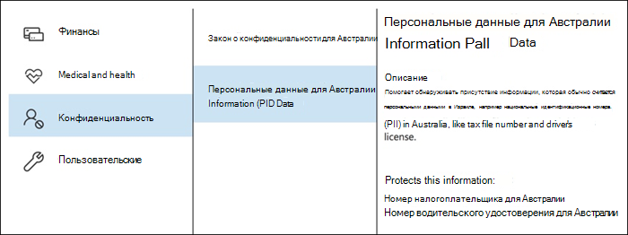

Назовите свою новую политику DLP. Имя по умолчанию будет соответствовать шаблону политики DLP, но вы должны выбрать более описательное имя самостоятельно, потому что несколько политик могут быть созданы из одного шаблона.

Выберите места, к которые будет применяться политика. Политики DLP могут применяться к Exchange Online, SharePoint Интернету и OneDrive для бизнеса. Я собираюсь оставить эту политику настроенной, чтобы применяться ко всем местам.

На первом **шаге Параметры,** просто принять по умолчанию на данный момент. Вы можете настроить политики DLP, но по умолчанию являются прекрасным местом для начала.

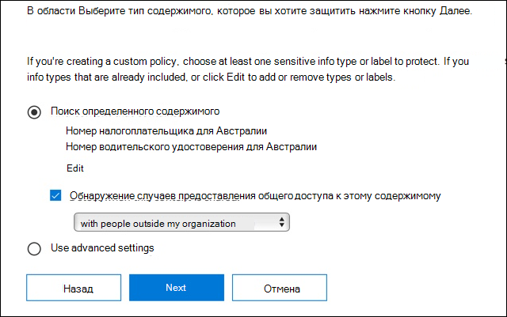

После нажатия Далее, вы будете представлены с более политики **Параметры** с более параметры настройки. Для политики, которую вы только тестируете, вот где вы можете начать вносить некоторые коррективы.

- Я выключил советы по политике на данный момент, что является разумным шагом, чтобы принять, если вы просто тестирования вещи и не хотят, чтобы показать что-нибудь для пользователей еще. Советы по политике отображают предупреждения пользователей о том, что они собираются нарушить политику DLP. Например, пользователь Outlook увидит предупреждение о том, что файл, к которому он прикреплен, содержит номера кредитных карт и приведет к отклонению их электронной почты. Цель советов по политике состоит в том, чтобы остановить несовместимые поведение, прежде чем это произойдет.
- Я также сократил число экземпляров с 10 до 1, так что эта политика будет обнаружить любой обмен австралийскими данными PII, а не только массовый обмен данными.
- Я также добавил еще одного получателя в отчет об инциденте электронной почты.

Наконец, я настроил эту политику для первоначального запуска в тестовом режиме. Обратите внимание, что здесь также есть возможность отключить советы по политике во время тестирования. Это дает вам возможность использовать советы по политике в политике, но затем решить, показывать или подавлять их во время тестирования.

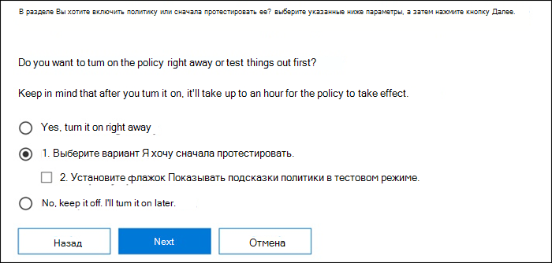

На экране окончательного обзора нажмите **Создайте,** чтобы закончить создание политики.

## Проверка политики DLP

Ваша новая политика DLP начнет вступят в силу в течение примерно 1 часа. Вы можете сидеть и ждать, пока он будет вызван нормальной активностью пользователя, или вы можете попытаться запустить его самостоятельно. Ранее я связан с [чувствительной информации типа лица определений](sensitive-information-type-entity-definitions.md), которая предоставляет вам информацию о том, как вызвать DLP матчей.

Например, политика DLP, созданная для этой статьи, позволит обнаружить австралийские номера налоговых файлов (TFN). Согласно документации, матч основан на следующих критериях.

 
Чтобы продемонстрировать обнаружение TFN в довольно тупой манере, электронная почта с словами "Налоговый номер файла" и девятизначная строка в непосредственной близости будет плыть через без каких-либо проблем. Причина, по которой она не запускает политику DLP, заключается в том, что девятизначная строка должна пройти проверку, которая указывает, что она является действительной TFN, а не просто безобидной строкой чисел.

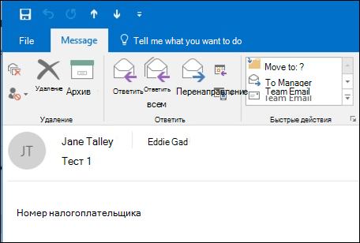

Для сравнения, электронная почта со словами "Налоговый номер файла" и действительный TFN, который проходит проверку вызовет политику. Для записи здесь, TFN я использую был взят из веб-сайта, который генерирует действительные, но не подлинные, TFNs. Такие сайты полезны, потому что одна из наиболее распространенных ошибок при тестировании политики DLP использует поддельный номер, который не действителен и не пройдет проверку (и, следовательно, не будет инициировать политику).

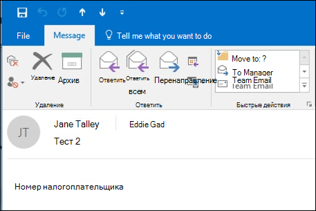

Электронная почта отчета об инциденте включает тип конфиденциальной информации, которая была обнаружена, сколько случаев было обнаружено, и уровень доверия обнаружения.

Если вы оставите свою политику DLP в тестовом режиме и проанализируете электронную почту отчета об инциденте, вы можете начать чувствовать себя для точности политики DLP и насколько эффективной она будет, когда она будет применяться. В дополнение к отчетам об инцидентах [можно использовать отчеты DLP для](view-the-dlp-reports.md) просмотра агрегированного представления совпадений политики вашего арендатора.

## Настройка политики защиты от потери данных

При анализе показов политики может потребоваться внести некоторые коррективы в поведение политик. В качестве простого примера можно определить, что один TFN в электронной почте не является проблемой (я думаю, что это все еще есть, но давайте пойдем с ним ради демонстрации), но два или более экземпляров являются проблемой. Несколько экземпляров могут быть рискованным сценарием, таким как сотрудник, ото электронному ех-му экспорту csV из базы данных отдела кадров внешней стороне, например внешней бухгалтерской службе. Определенно то, что вы предпочли бы обнаружить и заблокировать.

В Центре соответствия требованиям можно редактировать существующую политику для корректировки поведения.

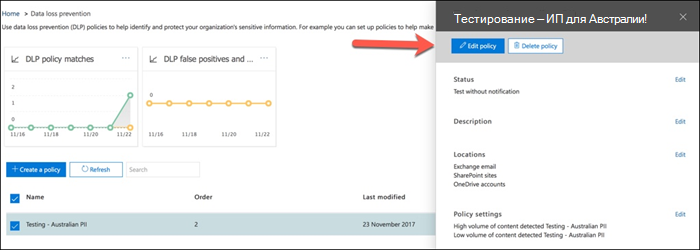
 
Можно настроить параметры местоположения таким образом, чтобы политика применялась только к определенным рабочим нагрузкам или к конкретным сайтам и учетным записям.

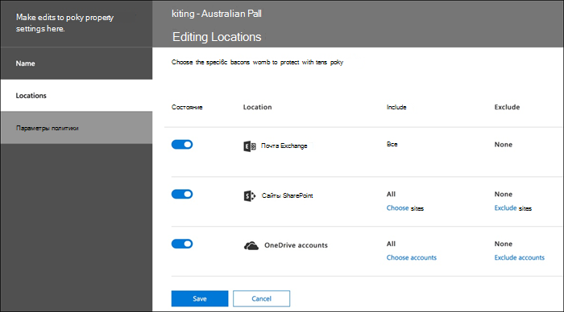

Вы также можете настроить параметры политики и редактировать правила, чтобы лучше соответствовать вашим потребностям.

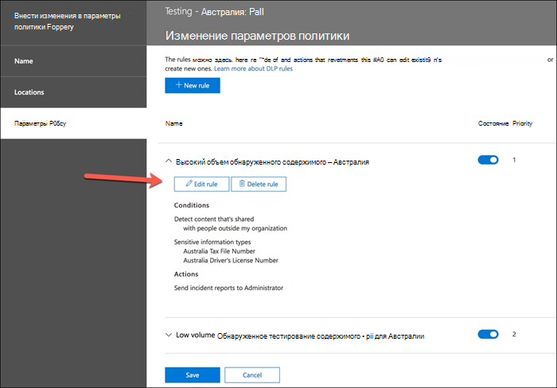

При редактировании правила в рамках политики DLP можно изменить:

- Условия, включая тип и количество экземпляров конфиденциальных данных, которые будут инициировать правило.
- Действия, которые принимаются, такие как ограничение доступа к содержимому.
- Уведомления пользователей, которые являются советами по политике, которые отображаются пользователю в их почтовом клиенте или веб-браузере.
- Пользователь переопределяет определяет, могут ли пользователи выбрать, чтобы продолжить свою электронную почту или файлообмеся в любом случае.
- Отчеты об инцидентах, чтобы уведомить администраторов.

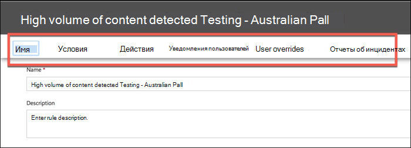

Для этой демонстрации я добавил уведомления пользователей в политику (будьте осторожны, делая это без надлежащего обучения осведомленности пользователей), и позволил пользователям переопределить политику с бизнес-обоснованием или пометив ее как ложное срабатывание. Вы также можете настроить текст отзыва по электронной почте и политике, если вы хотите включить какую-либо дополнительную информацию о политике вашей организации, или побудить пользователей обратиться в поддержку, если у них есть вопросы.

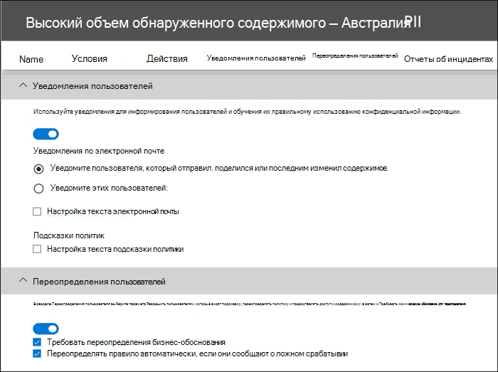

Политика содержит два правила для обработки большого объема и низкого объема, так что не забудьте редактировать оба с действиями, которые вы хотите. Это возможность по-разному относиться к случаям в зависимости от их характеристик. Например, можно разрешить переопределения для нарушений низкого объема, но не допускать переопределения для нарушений большого объема.

Кроме того, если вы хотите фактически заблокировать или ограничить доступ к содержимому, которое является нарушением политики, необходимо настроить действие на правило, чтобы сделать это.

После сохранения этих изменений в настройках политики мне также необходимо вернуться к главной странице настроек политики и включить возможность показывать пользователям советы по политике во время тестирования политики. Это эффективный способ внедрения политик DLP для конечных пользователей и обучения осведомленности пользователей, не рискуя слишком много ложных срабатываний, которые влияют на их производительность.

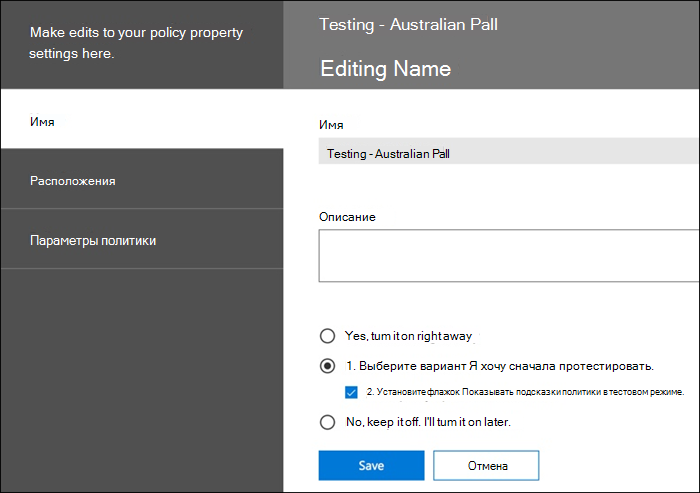

На стороне сервера (или облачной стороне, если вы предпочитаете), изменение не может вступят в силу немедленно, из-за различных интервалов обработки. Если вы внести изменения в политику DLP, которые будут отображать новые советы по политике для пользователя, пользователь не может видеть изменения вступят в силу немедленно в их Outlook клиента, который проверяет изменения политики каждые 24 часа. Если вы хотите ускорить процесс тестирования, вы можете использовать это исправление реестра, [чтобы очистить последнюю марку времени загрузки из ключа PolicyNudges.](https://support.microsoft.com/en-au/help/2823261/changes-to-a-data-loss-prevention-policy-don-t-take-effect-in-outlook?__hstc=18650278.46377037dc0a82baa8a30f0ef07a7b2f.1538687978676.1538693509953.1540315763430.3&__hssc=18650278.1.1540315763430&__hsfp=3446956451) Outlook загрузит последнюю информацию о политике при следующем перезапуске и начнете составление сообщения электронной почты.

Если у вас включены советы по политике, пользователь начнет видеть советы в Outlook и может сообщить вам ложные срабатывания, когда они происходят.

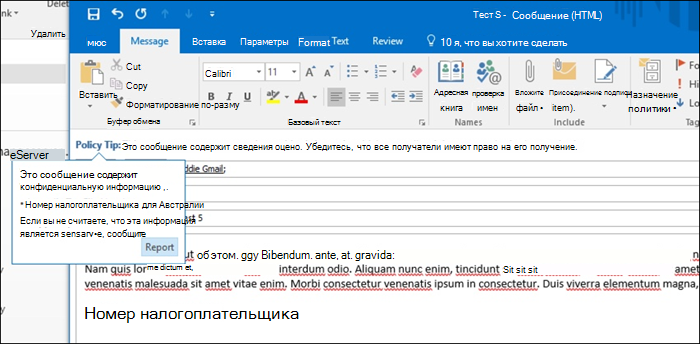

## Расследование ложных срабатываний

Шаблоны политики DLP не являются совершенными прямо из коробки. Вполне вероятно, что вы обнаружите некоторые ложные срабатывания, происходящие в вашей среде, поэтому так важно облегчить вам путь в развертывание DLP, найдите время, чтобы адекватно протестировать и настроить ваши политики.

Вот пример ложного срабатывания. Это письмо является весьма безвредным. Пользователь предоставляет кому-то свой номер мобильного телефона, включая его электронную подпись.

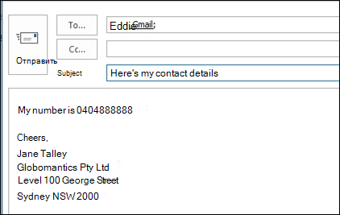
 
Но пользователь видит отзыв политики, предупреждающий их о том, что письмо содержит конфиденциальную информацию, в частности, номер австралийского водительного удостоверения.

Пользователь может сообщить о ложном срабатывании, и администратор может узнать, почему это произошло. В сообщении об инциденте электронная почта помечена как ложное срабатывание.

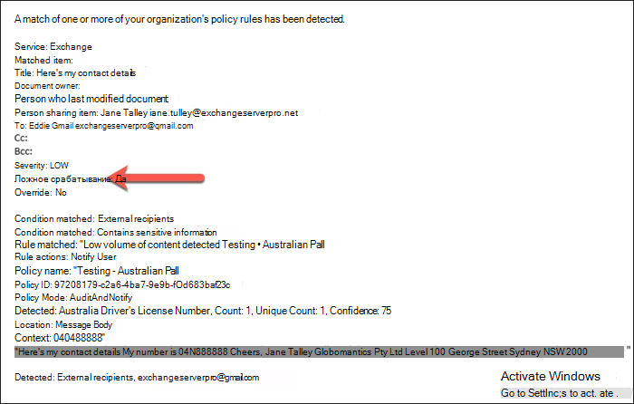

Это дело водительских прав является хорошим примером, чтобы копаться в. Причина этого ложного срабатывания произошло в том, что "Австралийская лицензия водителя" тип будет вызван любой 9-значный строка (даже тот, который является частью 10-значной строки), в пределах 300 символов близость к ключевым словам "Sydney nsw" (не чувствительный к делу). Так что это вызвано номером телефона и подписью электронной почты, только потому, что пользователь оказывается в Сиднее.

Один из вариантов заключается в удалении австралийского типа информации о водительских правах из полиса. Он там, потому что он является частью шаблона политики DLP, но мы не вынуждены использовать его. Если вас интересуют только номера налоговых файлов, а не водительские права, вы можете просто удалить его. Например, его можно удалить из правила низкого объема в политике, но оставить в правиле большого объема, чтобы списки нескольких водительских удостоверений все еще были обнаружены.
 
Другим вариантом является увеличение количества экземпляров, так что низкий объем водительских удостоверений обнаруживается только при нескольких экземплярах.

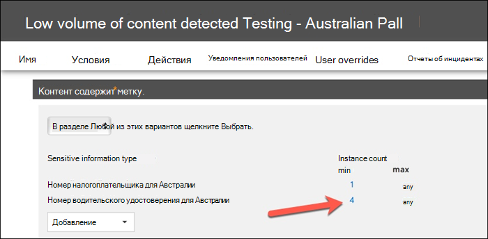

В дополнение к изменению отсчета экземпляров, вы также можете настроить точность матча (или уровень достоверности). Если тип конфиденциальной информации имеет несколько шаблонов, вы можете настроить точность совпадения в правиле, чтобы правило соответствовало только определенным шаблонам. Например, чтобы уменьшить ложные срабатывания, можно установить точность совпадения вашего правила так, чтобы оно соответствовало только шаблону с наивысшим уровнем доверия. Для получения дополнительной информации об уровнях [доверия, узнайте, как использовать уровень доверия для настройки правил.](data-loss-prevention-policies.md#match-accuracy)

Наконец, если вы хотите получить еще немного более продвинутые, вы можете настроить любой тип конфиденциальной информации - например, вы можете удалить "Сидней NSW" из списка ключевых слов для [Австралии водительские права номер](sensitive-information-type-entity-definitions.md#australia-drivers-license-number), чтобы устранить ложноположие срабатывает выше. Чтобы узнать, как это сделать с помощью XML и PowerShell, [см.](customize-a-built-in-sensitive-information-type.md)

## Включите политику DLP

Когда вы счастливы, что ваша политика DLP точно и эффективно обнаруживает типы конфиденциальной информации, и что конечные пользователи готовы иметь дело с политиками, которые находятся на месте, то вы можете включить политику.

 
Если вы ждете, когда политика вступят в [силу, Подключение в Центр соответствия требованиям Security & PowerShell](/powershell/exchange/connect-to-scc-powershell) и [запустите cmdlet Get-DlpCompliancePolicy,](/powershell/module/exchange/get-dlpcompliancepolicy) чтобы увидеть DistributionStatus.

После включив политику DLP, следует провести некоторые заключительные тесты самостоятельно, чтобы убедиться, что ожидаемые действия политики происходят. Если вы пытаетесь проверить такие вещи, как данные кредитных карт, Есть веб-сайты в Интернете с информацией о том, как генерировать образец кредитной карты или другой личной информации, которая будет проходить проверки и инициировать ваши политики.

Политики, позволяющие переопределению пользователя, представят эту опцию пользователю как часть наконечника политики.

Политики, ограничивающие содержание, представят предупреждение пользователю в качестве части наконечника политики и не позволяют ему отправлять электронное письмо.

## Сводка

Политика предотвращения потери данных полезна для организаций всех типов. Тестирование некоторых политик DLP является упражнением низкого риска из-за контроля над такими вещами, как советы по политике, переопределения конечных пользователей и отчеты об инцидентах. Вы можете спокойно протестировать некоторые политики DLP, чтобы увидеть, какие типы нарушений уже происходят в вашей организации, а затем разработать политики с низкими ложноположимыми показателями, просвещать пользователей о том, что разрешено и не допускается, а затем раскатать ваши политики DLP в организации.